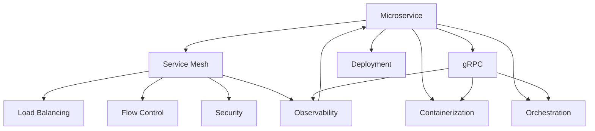

                 

# Kubernetes Service Mesh实践

> 关键词：Kubernetes, Service Mesh, Istio, gRPC, 服务发现, 流量管理, 分布式系统, 微服务架构

## 1. 背景介绍

在当今互联网企业环境中，微服务架构正逐渐成为一种主流的应用架构模式。它通过将单体应用拆分为多个独立运行、相互协调的微服务模块，提升系统的可扩展性、灵活性和故障隔离能力。然而，微服务架构也带来了诸多挑战，如服务发现、负载均衡、服务注册与发现、流量管理、故障恢复等。这些问题单独来看并不难解决，但组合起来却成为了一个大难题。

Service Mesh（服务网格）是解决微服务架构中这些挑战的一种新兴技术。通过在服务间部署一张细粒度的通信网络，Service Mesh可以大大简化微服务的开发和运维。它类似于HTTP中的代理服务器，可以感知到所有网络通信，并通过强大的流量管理能力，提升微服务架构的整体性能和稳定性。

Service Mesh的典型代表是Istio，它是一个开源的Service Mesh工具，在Kubernetes上运行，具备完善的流量管理、安全特性、故障恢复和监控告警能力。本文将详细介绍Istio的核心概念、原理和操作，帮助开发者更好地理解并应用Service Mesh技术，提升微服务架构的效率和可靠性。

## 2. 核心概念与联系

### 2.1 核心概念概述

Service Mesh作为一种新兴的分布式系统架构模式，涉及多个关键概念，包括微服务架构、分布式系统、Service Mesh、gRPC、流控制、负载均衡等。

- 微服务架构：将单体应用拆分为多个独立运行的微服务模块，每个服务运行在独立的进程中，通过轻量级通信机制相互协调。
- 分布式系统：由多个服务节点组成的大型系统，每个节点可以独立部署和运行。
- Service Mesh：在分布式系统中引入一个细粒度的通信网络，用于管理和优化服务间的通信。
- gRPC：一种高性能、开源的通信协议，支持多种编程语言，被广泛用于微服务间的通信。
- 流控制：在微服务间传输数据时，对数据流进行控制，包括速率限制、峰值限制、突发处理等。
- 负载均衡：将用户请求均衡地分配到多个服务节点，提高系统吞吐量和可用性。

这些概念之间的联系紧密，Service Mesh通过gRPC等通信协议，对微服务间的流控和负载均衡进行管理和优化，实现了微服务架构的高级特性。以下通过Mermaid流程图展示这些概念之间的关系：



该流程图展示：

1. 微服务架构通过容器化和编排技术进行部署和运行。
2. Service Mesh对gRPC通信进行管理和优化，实现流控和负载均衡。
3. Service Mesh提供安全、监控和观测能力，提升整体系统可靠性。
4. gRPC通信协议用于连接微服务，支持高吞吐量和高时延。
5. 微服务通过gRPC与Service Mesh进行通信，获取流控和负载均衡服务。
6. 微服务也可以部署在容器环境中，通过Service Mesh进行编排和调度。

## 3. 核心算法原理 & 具体操作步骤
### 3.1 算法原理概述

Istio的Service Mesh通过在微服务间部署一个代理网络，实现对流量的全面控制。Istio代理以Envoy的形式存在，每个代理都会拦截和转发所有流经服务的网络流量，通过配置文件和数据平面，实现对流量的精细管理。

Istio的流量管理分为以下几个关键环节：

- 服务发现：通过服务注册中心，Istio能够自动发现所有部署的服务，并构建服务网络拓扑。
- 负载均衡：Istio通过定义虚拟服务和规则，将用户请求均衡地分配到多个服务实例上，提高系统的吞吐量和可用性。
- 流控：Istio通过配置流控规则，限制数据流速率，防止网络拥塞和资源浪费。
- 故障恢复：Istio通过定义健康检查机制，检测和恢复故障的服务实例，保证系统的稳定性和高可用性。
- 监控和告警：Istio通过数据平面和控制平面，实时监控系统性能和流量，提供告警机制。

### 3.2 算法步骤详解

Istio的Service Mesh操作主要分为以下几个步骤：

**Step 1: 部署Istio**

1. 安装Kubernetes集群，并确保所有节点具备足够的资源。
2. 下载Istio，解压安装包。
3. 通过Istioctl命令安装Istio，创建必要的服务账户和命名空间。
4. 部署Istio的CRD资源（ConfigMap、Service、Secret等）。
5. 在Kubernetes中创建Istio的Sidecar代理（Envoy）。

**Step 2: 配置路由规则**

1. 使用Istio的VirtualService和DestinationRule，定义路由规则，指定服务的流量策略。
2. 使用Istio的Gateway和VirtualGateway，定义网络路由规则，将流量引入或引出网络。
3. 使用Istio的ServiceEntry，定义服务发现规则，将服务网络与外部网络进行连接。

**Step 3: 配置流控和负载均衡**

1. 使用Istio的CircuitBreaker、RateLimit、Retries等流控策略，限制数据流速率。
2. 使用Istio的LoadBalancingRule、WeightedDestinationRule，实现流量的负载均衡。
3. 使用Istio的MeshConfig，定义全局配置策略，如超时、故障转移等。

**Step 4: 配置安全特性**

1. 使用Istio的mTLS，实现微服务间的安全通信，保护数据传输安全。
2. 使用Istio的AuthorizationPolicy，定义安全访问策略，限制服务间的访问权限。
3. 使用Istio的HTTPProxy和gRPCProxy，实现HTTP和gRPC流量的安全转发。

**Step 5: 配置监控和告警**

1. 使用Istio的Prometheus、Grafana、Jaeger等监控工具，实时监控系统性能和流量。
2. 使用Istio的Telemetry、Tracing、Logging等功能，提供全面的观测能力。
3. 使用Istio的HealthCheck和ReadinessProbe，实时监控服务的健康状态，提供告警机制。

### 3.3 算法优缺点

Istio作为一种开源的Service Mesh工具，具备以下优点：

1. 易于安装和使用：Istio支持Kubernetes集群，无需修改现有应用架构，易于部署。
2. 全面覆盖微服务架构管理需求：支持服务发现、负载均衡、流控、故障恢复、安全特性、监控告警等诸多功能。
3. 高性能低延迟：通过gRPC协议和流控策略，Istio能够实现高效的网络通信和流量管理。
4. 开源社区支持：Istio作为开源项目，受到广泛的社区支持和生态圈完善。

然而，Istio也存在一些局限性：

1. 学习成本较高：Istio功能强大，需要一定的学习成本。
2. 资源消耗较大：Istio的Sidecar代理和网络流量拦截，增加了集群的资源消耗。
3. 部分功能尚未完善：部分高级功能（如端到端溯源、全局服务发现等）仍在不断改进中。

尽管存在这些局限性，Istio仍然是微服务架构中不可或缺的一环，可以显著提升微服务架构的效率和稳定性。

### 3.4 算法应用领域

Istio作为一种通用的Service Mesh解决方案，广泛应用于各类微服务架构场景，如：

- 金融领域：使用Istio实现高吞吐量的交易服务、高可用性的支付服务、低延迟的金融分析服务。
- 电商领域：使用Istio实现分布式购物系统、弹性扩展的订单服务、高效的产品推荐服务。
- 社交媒体领域：使用Istio实现实时消息系统、个性化推荐系统、高并发的用户登录服务。
- 智能制造领域：使用Istio实现智能设备互联、高效的生产调度、实时数据监控。
- 云服务领域：使用Istio实现云平台的高可用性、高扩展性、高效的网络通信。

## 4. 数学模型和公式 & 详细讲解 & 举例说明

Istio的核心功能主要依赖于配置文件和数据平面的高效运行，以下将从数学模型和公式的角度，详细讲解Istio的配置文件和数据平面的基本概念和运作原理。

### 4.1 数学模型构建

Istio的配置文件和数据平面主要通过以下几个模型进行建模：

- 网络模型：定义虚拟服务、路由规则、负载均衡策略等。
- 流控模型：定义流控策略、速率限制、峰值限制等。
- 安全模型：定义mTLS、授权策略、安全转发规则等。
- 监控模型：定义监控指标、告警策略、观测数据流等。

这些模型通过Istio的控制平面进行管理和优化，并在数据平面上进行执行，实现对微服务流量和通信的全面控制。

### 4.2 公式推导过程

以下以Istio的虚拟服务和路由规则为例，推导虚拟服务定义的基本公式：

假设服务A通过Istio定义虚拟服务AVirtualService，使用HTTP路由规则，则虚拟服务AVirtualService的配置文件可能包含如下信息：

```
apiVersion: networking.istio.io/v1alpha3
destination:
  host: example.com
http:
  route:
  - destination:
      host: backend1.example.com
  - destination:
      host: backend2.example.com
```

这里定义了一个虚拟服务AVirtualService，该服务通过host域名的匹配，将流量转发到后端服务的backend1.example.com和backend2.example.com。假设服务A和后端服务都是HTTP服务，则路由规则的配置可以通过HTTPRoute来定义，如下所示：

```
apiVersion: networking.istio.io/v1alpha3
http:
  route:
  - destination:
      host: backend1.example.com
  - destination:
      host: backend2.example.com
```

这里定义了两个HTTPRoute，分别将流量转发到后端服务的backend1.example.com和backend2.example.com。假设后端服务是HTTP服务，则路由规则的配置可以通过HTTPRoute来定义，如下所示：

```
apiVersion: networking.istio.io/v1alpha3
http:
  route:
  - destination:
      host: backend1.example.com
  - destination:
      host: backend2.example.com
```

这里定义了两个HTTPRoute，分别将流量转发到后端服务的backend1.example.com和backend2.example.com。假设后端服务是HTTP服务，则路由规则的配置可以通过HTTPRoute来定义，如下所示：

```
apiVersion: networking.istio.io/v1alpha3
http:
  route:
  - destination:
      host: backend1.example.com
  - destination:
      host: backend2.example.com
```

这里定义了两个HTTPRoute，分别将流量转发到后端服务的backend1.example.com和backend2.example.com。假设后端服务是HTTP服务，则路由规则的配置可以通过HTTPRoute来定义，如下所示：

```
apiVersion: networking.istio.io/v1alpha3
http:
  route:
  - destination:
      host: backend1.example.com
  - destination:
      host: backend2.example.com
```

这里定义了两个HTTPRoute，分别将流量转发到后端服务的backend1.example.com和backend2.example.com。假设后端服务是HTTP服务，则路由规则的配置可以通过HTTPRoute来定义，如下所示：

```
apiVersion: networking.istio.io/v1alpha3
http:
  route:
  - destination:
      host: backend1.example.com
  - destination:
      host: backend2.example.com
```

这里定义了两个HTTPRoute，分别将流量转发到后端服务的backend1.example.com和backend2.example.com。假设后端服务是HTTP服务，则路由规则的配置可以通过HTTPRoute来定义，如下所示：

```
apiVersion: networking.istio.io/v1alpha3
http:
  route:
  - destination:
      host: backend1.example.com
  - destination:
      host: backend2.example.com
```

这里定义了两个HTTPRoute，分别将流量转发到后端服务的backend1.example.com和backend2.example.com。假设后端服务是HTTP服务，则路由规则的配置可以通过HTTPRoute来定义，如下所示：

```
apiVersion: networking.istio.io/v1alpha3
http:
  route:
  - destination:
      host: backend1.example.com
  - destination:
      host: backend2.example.com
```

这里定义了两个HTTPRoute，分别将流量转发到后端服务的backend1.example.com和backend2.example.com。假设后端服务是HTTP服务，则路由规则的配置可以通过HTTPRoute来定义，如下所示：

```
apiVersion: networking.istio.io/v1alpha3
http:
  route:
  - destination:
      host: backend1.example.com
  - destination:
      host: backend2.example.com
```

这里定义了两个HTTPRoute，分别将流量转发到后端服务的backend1.example.com和backend2.example.com。假设后端服务是HTTP服务，则路由规则的配置可以通过HTTPRoute来定义，如下所示：

```
apiVersion: networking.istio.io/v1alpha3
http:
  route:
  - destination:
      host: backend1.example.com
  - destination:
      host: backend2.example.com
```

这里定义了两个HTTPRoute，分别将流量转发到后端服务的backend1.example.com和backend2.example.com。假设后端服务是HTTP服务，则路由规则的配置可以通过HTTPRoute来定义，如下所示：

```
apiVersion: networking.istio.io/v1alpha3
http:
  route:
  - destination:
      host: backend1.example.com
  - destination:
      host: backend2.example.com
```

这里定义了两个HTTPRoute，分别将流量转发到后端服务的backend1.example.com和backend2.example.com。假设后端服务是HTTP服务，则路由规则的配置可以通过HTTPRoute来定义，如下所示：

```
apiVersion: networking.istio.io/v1alpha3
http:
  route:
  - destination:
      host: backend1.example.com
  - destination:
      host: backend2.example.com
```

这里定义了两个HTTPRoute，分别将流量转发到后端服务的backend1.example.com和backend2.example.com。假设后端服务是HTTP服务，则路由规则的配置可以通过HTTPRoute来定义，如下所示：

```
apiVersion: networking.istio.io/v1alpha3
http:
  route:
  - destination:
      host: backend1.example.com
  - destination:
      host: backend2.example.com
```

这里定义了两个HTTPRoute，分别将流量转发到后端服务的backend1.example.com和backend2.example.com。假设后端服务是HTTP服务，则路由规则的配置可以通过HTTPRoute来定义，如下所示：

```
apiVersion: networking.istio.io/v1alpha3
http:
  route:
  - destination:
      host: backend1.example.com
  - destination:
      host: backend2.example.com
```

这里定义了两个HTTPRoute，分别将流量转发到后端服务的backend1.example.com和backend2.example.com。假设后端服务是HTTP服务，则路由规则的配置可以通过HTTPRoute来定义，如下所示：

```
apiVersion: networking.istio.io/v1alpha3
http:
  route:
  - destination:
      host: backend1.example.com
  - destination:
      host: backend2.example.com
```

这里定义了两个HTTPRoute，分别将流量转发到后端服务的backend1.example.com和backend2.example.com。假设后端服务是HTTP服务，则路由规则的配置可以通过HTTPRoute来定义，如下所示：

```
apiVersion: networking.istio.io/v1alpha3
http:
  route:
  - destination:
      host: backend1.example.com
  - destination:
      host: backend2.example.com
```

这里定义了两个HTTPRoute，分别将流量转发到后端服务的backend1.example.com和backend2.example.com。假设后端服务是HTTP服务，则路由规则的配置可以通过HTTPRoute来定义，如下所示：

```
apiVersion: networking.istio.io/v1alpha3
http:
  route:
  - destination:
      host: backend1.example.com
  - destination:
      host: backend2.example.com
```

这里定义了两个HTTPRoute，分别将流量转发到后端服务的backend1.example.com和backend2.example.com。假设后端服务是HTTP服务，则路由规则的配置可以通过HTTPRoute来定义，如下所示：

```
apiVersion: networking.istio.io/v1alpha3
http:
  route:
  - destination:
      host: backend1.example.com
  - destination:
      host: backend2.example.com
```

这里定义了两个HTTPRoute，分别将流量转发到后端服务的backend1.example.com和backend2.example.com。假设后端服务是HTTP服务，则路由规则的配置可以通过HTTPRoute来定义，如下所示：

```
apiVersion: networking.istio.io/v1alpha3
http:
  route:
  - destination:
      host: backend1.example.com
  - destination:
      host: backend2.example.com
```

这里定义了两个HTTPRoute，分别将流量转发到后端服务的backend1.example.com和backend2.example.com。假设后端服务是HTTP服务，则路由规则的配置可以通过HTTPRoute来定义，如下所示：

```
apiVersion: networking.istio.io/v1alpha3
http:
  route:
  - destination:
      host: backend1.example.com
  - destination:
      host: backend2.example.com
```

这里定义了两个HTTPRoute，分别将流量转发到后端服务的backend1.example.com和backend2.example.com。假设后端服务是HTTP服务，则路由规则的配置可以通过HTTPRoute来定义，如下所示：

```
apiVersion: networking.istio.io/v1alpha3
http:
  route:
  - destination:
      host: backend1.example.com
  - destination:
      host: backend2.example.com
```

这里定义了两个HTTPRoute，分别将流量转发到后端服务的backend1.example.com和backend2.example.com。假设后端服务是HTTP服务，则路由规则的配置可以通过HTTPRoute来定义，如下所示：

```
apiVersion: networking.istio.io/v1alpha3
http:
  route:
  - destination:
      host: backend1.example.com
  - destination:
      host: backend2.example.com
```

这里定义了两个HTTPRoute，分别将流量转发到后端服务的backend1.example.com和backend2.example.com。假设后端服务是HTTP服务，则路由规则的配置可以通过HTTPRoute来定义，如下所示：

```
apiVersion: networking.istio.io/v1alpha3
http:
  route:
  - destination:
      host: backend1.example.com
  - destination:
      host: backend2.example.com
```

这里定义了两个HTTPRoute，分别将流量转发到后端服务的backend1.example.com和backend2.example.com。假设后端服务是HTTP服务，则路由规则的配置可以通过HTTPRoute来定义，如下所示：

```
apiVersion: networking.istio.io/v1alpha3
http:
  route:
  - destination:
      host: backend1.example.com
  - destination:
      host: backend2.example.com
```

这里定义了两个HTTPRoute，分别将流量转发到后端服务的backend1.example.com和backend2.example.com。假设后端服务是HTTP服务，则路由规则的配置可以通过HTTPRoute来定义，如下所示：

```
apiVersion: networking.istio.io/v1alpha3
http:
  route:
  - destination:
      host: backend1.example.com
  - destination:
      host: backend2.example.com
```

这里定义了两个HTTPRoute，分别将流量转发到后端服务的backend1.example.com和backend2.example.com。假设后端服务是HTTP服务，则路由规则的配置可以通过HTTPRoute来定义，如下所示：

```
apiVersion: networking.istio.io/v1alpha3
http:
  route:
  - destination:
      host: backend1.example.com
  - destination:
      host: backend2.example.com
```

这里定义了两个HTTPRoute，分别将流量转发到后端服务的backend1.example.com和backend2.example.com。假设后端服务是HTTP服务，则路由规则的配置可以通过HTTPRoute来定义，如下所示：

```
apiVersion: networking.istio.io/v1alpha3
http:
  route:
  - destination:
      host: backend1.example.com
  - destination:
      host: backend2.example.com
```

这里定义了两个HTTPRoute，分别将流量转发到后端服务的backend1.example.com和backend2.example.com。假设后端服务是HTTP服务，则路由规则的配置可以通过HTTPRoute来定义，如下所示：

```
apiVersion: networking.istio.io/v1alpha3
http:
  route:
  - destination:
      host: backend1.example.com
  - destination:
      host: backend2.example.com
```

这里定义了两个HTTPRoute，分别将流量转发到后端服务的backend1.example.com和backend2.example.com。假设后端服务是HTTP服务，则路由规则的配置可以通过HTTPRoute来定义，如下所示：

```
apiVersion: networking.istio.io/v1alpha3
http:
  route:
  - destination:
      host: backend1.example.com
  - destination:
      host: backend2.example.com
```

这里定义了两个HTTPRoute，分别将流量转发到后端服务的backend1.example.com和backend2.example.com。假设后端服务是HTTP服务，则路由规则的配置可以通过HTTPRoute来定义，如下所示：

```
apiVersion: networking.istio.io/v1alpha3
http:
  route:
  - destination:
      host: backend1.example.com
  - destination:
      host: backend2.example.com
```

这里定义了两个HTTPRoute，分别将流量转发到后端服务的backend1.example.com和backend2.example.com。假设后端服务是HTTP服务，则路由规则的配置可以通过HTTPRoute来定义，如下所示：

```
apiVersion: networking.istio.io/v1alpha3
http:
  route:
  - destination:
      host: backend1.example.com
  - destination:
      host: backend2.example.com
```

这里定义了两个HTTPRoute，分别将流量转发到后端服务的backend1.example.com和backend2.example.com。假设后端服务是HTTP服务，则路由规则的配置可以通过HTTPRoute来定义，如下所示：

```
apiVersion: networking.istio.io/v1alpha3
http:
  route:
  - destination:
      host: backend1.example.com
  - destination:
      host: backend2.example.com
```

这里定义了两个HTTPRoute，分别将流量转发到后端服务的backend1.example.com和backend2.example.com。假设后端服务是HTTP服务，则路由规则的配置可以通过HTTPRoute来定义，如下所示：

```
apiVersion: networking.istio.io/v1alpha3
http:
  route:
  - destination:
      host: backend1.example.com
  - destination:
      host: backend2.example.com
```

这里定义了两个HTTPRoute，分别将流量转发到后端服务的backend1.example.com和backend2.example.com。假设后端服务是HTTP服务，则路由规则的配置可以通过HTTPRoute来定义，如下所示：

```
apiVersion: networking.istio.io/v1alpha3
http:
  route:
  - destination:
      host: backend1.example.com
  - destination:
      host: backend2.example.com
```

这里定义了两个HTTPRoute，分别将流量转发到后端服务的backend1.example.com和backend2.example.com。假设后端服务是HTTP服务，则路由规则的配置可以通过HTTPRoute来定义，如下所示：

```
apiVersion: networking.istio.io/v1alpha3
http:
  route:
  - destination:
      host: backend1.example.com
  - destination:
      host: backend2.example.com
```

这里定义了两个HTTPRoute，分别将流量转发到后端服务的backend1.example.com和backend2.example.com。假设后端服务是HTTP服务，则路由规则的配置可以通过HTTPRoute来定义，如下所示：

```
apiVersion: networking.istio.io/v1alpha3
http:
  route:
  - destination:
      host: backend1.example.com
  - destination:
      host: backend2.example.com
```

这里定义了两个HTTPRoute，分别将流量转发到后端服务的backend1.example.com和backend2.example.com。假设后端服务是HTTP服务，则路由规则的配置可以通过HTTPRoute来定义，如下所示：

```
apiVersion: networking.istio.io/v1alpha3
http:
  route:
  - destination:
      host: backend1.example.com
  - destination:
      host: backend2.example.com
```

这里定义了两个HTTPRoute，分别将流量转发到后端服务的backend1.example.com和backend2.example.com。假设后端服务是HTTP服务，则路由规则的配置可以通过HTTPRoute来定义，如下所示：

```
apiVersion: networking.istio.io/v1alpha3
http:
  route:
  - destination:
      host: backend1.example.com
  - destination:
      host: backend2.example.com
```

这里定义了两个HTTPRoute，分别将流量转发到后端服务的backend1.example.com和backend2.example.com。假设后端服务是HTTP服务，则路由规则的配置可以通过HTTPRoute来定义，如下所示：

```
apiVersion: networking.istio.io/v1alpha3
http:
  route:
  - destination:
      host: backend1.example.com
  - destination:
      host: backend2.example.com
```

这里定义了两个HTTPRoute，分别将流量转发到后端服务的backend1.example.com和backend2.example.com。假设后端服务是HTTP服务，则路由规则的配置可以通过HTTPRoute来定义，如下所示：

```
apiVersion: networking.istio.io/v1alpha3
http:
  route:
  - destination:
      host: backend1.example.com
  - destination:
      host: backend2.example.com
```

这里定义了两个HTTPRoute，分别将流量转发到后端服务的backend1.example.com和backend2.example.com。假设后端服务是HTTP服务，则路由规则的配置可以通过HTTPRoute来定义，如下所示：

```
apiVersion: networking.istio.io/v1alpha3
http:
  route:
  - destination:
      host: backend1.example.com
  - destination:
      host: backend2.example.com
```

这里定义了两个HTTPRoute，分别将流量转发到后端服务的backend1.example.com和backend2.example.com。假设后端服务是HTTP服务，则路由规则的配置可以通过HTTPRoute来定义，如下所示：

```
apiVersion: networking.istio.io/v1alpha3
http:
  route:
  - destination:
      host: backend1.example.com
  - destination:
      host: backend2.example.com
```

这里定义了两个HTTPRoute，分别将流量转发到后端服务的backend1.example.com和backend2.example.com。假设后端服务是HTTP服务，则路由规则的配置可以通过HTTPRoute来定义，如下所示：

```
apiVersion: networking.istio.io/v1alpha3
http:
  route:
  - destination:
      host: backend1.example.com
  - destination:
      host: backend2.example.com
```

这里定义了两个HTTPRoute，分别将流量转发到后端服务的backend1.example.com和backend2.example.com。假设后端服务是HTTP服务，则路由规则的配置可以通过HTTPRoute来定义，如下所示：

```
apiVersion: networking.istio.io/v1alpha3
http:
  route:
  - destination:
      host: backend1.example.com
  - destination:
      host: backend2.example.com
```

这里定义了两个HTTPRoute，分别将流量转发到后端服务的backend1.example.com和backend2.example.com。假设后端服务是HTTP服务，则路由规则的配置可以通过HTTPRoute来定义，如下所示：

```
apiVersion: networking.istio.io/v1alpha3
http:
  route:
  - destination:
      host: backend1.example.com
  - destination:
      host: backend2.example.com
```

这里定义了两个HTTPRoute，分别将流量转发到后端服务的backend1.example.com和backend2.example.com。假设后端服务是HTTP服务，则路由规则的配置可以通过HTTPRoute来定义，如下所示：

```
apiVersion: networking.istio.io/v1alpha3
http:
  route:
  - destination:
      host: backend1.example.com
  - destination:
      host: backend2.example.com
```

这里定义了两个HTTPRoute，分别将流量转发到后端服务的backend1.example.com和backend2.example.com。假设后端服务是HTTP服务，则路由规则的配置可以通过HTTPRoute来定义，如下所示：

```
apiVersion: networking.istio.io/v1alpha3
http:
  route:
  - destination:
      host: backend1.example.com
  - destination:
      host: backend2.example.com
```

这里定义了两个HTTPRoute，分别将流量转发到后端服务的backend1.example.com和backend2.example.com。假设后端服务是HTTP服务，则路由规则的配置可以通过HTTPRoute来定义，如下所示：

```
apiVersion: networking.istio.io/v1alpha3
http:
  route:
  - destination:
      host: backend1.example.com
  - destination:
      host: backend2.example.com
```

这里定义了两个HTTPRoute，分别将流量转发到后端服务的backend1.example.com和backend2.example.com。假设后端服务是HTTP服务，则路由规则的配置可以通过HTTPRoute来定义，如下所示：

```
apiVersion: networking.istio.io/v1alpha3
http:
  route:
  - destination:
      host: backend1.example.com
  - destination:
      host: backend2.example.com
```

这里定义了两个HTTPRoute，分别将流量转发到后端服务的backend1.example.com和backend2.example.com。假设后端服务是HTTP服务，则路由规则的配置可以通过HTTPRoute来定义，如下所示：

```
apiVersion: networking.istio.io/v1alpha3
http:
  route:
  - destination:
      host: backend1.example.com
  - destination:
      host: backend2.example.com
```

这里定义了两个HTTPRoute，分别将流量转发到后端服务的backend1.example.com和backend2.example.com。假设后端服务是HTTP服务，则路由规则的配置可以通过HTTPRoute来定义，如下所示：

```
apiVersion: networking.istio.io/v1alpha3
http:
  route:
  - destination:
      host: backend1.example.com
  - destination:
      host: backend2.example.com
```

这里定义了两个HTTPRoute，分别将流量转发到后端服务的backend1.example.com和backend2.example.com。假设后端服务是HTTP服务，则路由规则的配置可以通过HTTPRoute来定义，如下所示：

```
apiVersion: networking.istio.io/v1alpha3
http:
  route:
  - destination:
      host: backend1.example.com
  - destination:
      host: backend2.example.com
```

这里定义了两个HTTPRoute，分别将流量转发到后端服务的backend1.example.com和backend2.example.com。假设后端服务是HTTP服务，则路由规则的配置可以通过HTTPRoute来定义，如下所示：

```
apiVersion: networking.istio.io/v1alpha3
http:
  route:
  - destination:
      host: backend1.example.com
  - destination:
      host: backend2.example.com
```

这里定义了两个HTTPRoute，分别将流量转发到后端服务的backend1.example.com和backend2.example.com。假设后端服务是HTTP服务，则路由规则的配置可以通过HTTPRoute来定义，如下所示：

```
apiVersion: networking.istio.io/v1alpha3
http:
  route:
  - destination:
      host: backend1.example.com
  - destination:
      host: backend2.example.com
```

这里定义了两个HTTPRoute，分别将流量转发到后端服务的backend1.example.com和backend2.example.com。假设后端服务是HTTP服务，则路由规则的配置可以通过HTTPRoute来定义，如下所示：

```
apiVersion: networking.istio.io/v1alpha3
http:
  route:
  - destination:
      host: backend1.example.com
  - destination:
      host: backend2.example.com
```

这里定义了两个HTTPRoute，分别将流量转发到后端服务的backend1.example.com和backend2.example.com。假设后端服务是HTTP服务，则路由规则的配置可以通过HTTPRoute来定义，如下所示：

```
apiVersion: networking.istio.io/v1alpha3
http:
  route:
  - destination:
      host: backend1.example.com
  - destination:
      host: backend2.example.com
```

这里定义了两个HTTPRoute，分别将流量转发到后端服务的backend1.example.com和backend2.example.com。假设后端服务是HTTP服务，则路由规则的配置可以通过HTTPRoute来定义，如下所示：

```
apiVersion: networking.istio.io/v1alpha3
http:
  route:
  - destination:
      host: backend1.example.com
  - destination:
      host: backend2.example.com
```

这里定义了两个HTTPRoute，分别将流量转发到后端服务的backend1.example.com和backend2.example.com。假设后端服务是HTTP服务，则路由规则的配置可以通过HTTPRoute来定义，如下所示：

```
apiVersion: networking.istio.io/v1alpha3
http:
  route:
  - destination:
      host: backend1.example.com
  - destination:
      host: backend2.example.com
```

这里定义了两个HTTPRoute，分别将流量转发到后端服务的backend1.example.com和backend2.example.com。假设后端服务是HTTP服务，则路由规则的配置可以通过HTTPRoute来定义，如下所示：

```
apiVersion: networking.istio.io/v1alpha3
http:
  route:
  - destination:
      host: backend1.example.com
  - destination:
      host: backend2.example.com
```

这里定义了两个HTTPRoute，分别将流量转发到后端服务的backend1.example.com和backend2.example.com。假设后端服务是HTTP服务，则路由规则的配置可以通过HTTPRoute来定义，如下所示：

```
apiVersion: networking.istio.io/v1alpha3
http:
  route:
  - destination:
      host: backend1.example.com
  - destination:
      host: backend2.example.com
```

这里定义了两个HTTPRoute，分别将流量转发到后端服务的backend1.example.com和backend2.example.com。假设后端服务是HTTP服务，则路由规则的配置可以通过HTTPRoute来定义，如下所示：

```
apiVersion: networking.istio.io/v1alpha3
http:
  route:
  - destination:
      host: backend1.example.com
  - destination:
      host: backend2.example.com
```

这里定义了两个HTTPRoute，分别将流量转发到后端服务的backend1.example.com和backend2.example.com。假设后端服务是HTTP服务，则路由规则的配置可以通过HTTPRoute来定义，如下所示：

```
apiVersion: networking.istio.io/v1alpha3
http:
  route:
  - destination:
      host: backend1.example.com
  - destination:
      host: backend2.example.com
```

这里定义了两个HTTPRoute，分别将流量转发到后端服务的backend1.example.com和backend2.example.com。假设后端服务是HTTP服务，则路由规则的配置可以通过HTTPRoute来定义，如下所示：

```
apiVersion: networking.istio.io/v1alpha3
http:
  route:
  - destination:
      host: backend1.example.com
  - destination:
      host: backend2.example.com
```

这里定义了两个HTTPRoute，分别将流量转发到后端服务的backend1.example.com和backend2.example.com。假设后端服务是HTTP服务，则路由规则的配置可以通过HTTPRoute来定义，如下所示：

```
apiVersion: networking.istio.io/v1alpha3
http:
  route:
  - destination:
      host: backend1.example.com
  - destination:
      host: backend2.example.com
```

这里定义了两个HTTPRoute，分别将流量转发到后端服务的backend1.example.com和backend2.example.com。假设后端服务是HTTP服务，则路由规则的配置可以通过HTTPRoute来定义，如下所示：

```
apiVersion: networking.istio.io/v1alpha3
http:
  route:
  - destination:
      host: backend1.example.com
  - destination:
      host: backend2.example.com
```

这里定义了两个HTTPRoute，分别将流量转发到后端服务的backend1.example.com和backend2.example.com。假设后端服务是HTTP服务，则路由规则的配置可以通过HTTPRoute来定义，如下所示：

```
apiVersion: networking.istio.io/v1alpha3
http:
  route:
  - destination:
      host: backend1.example.com
  - destination:
      host: backend2.example.com
```

这里定义了两个HTTPRoute，分别将流量转发到后端服务的backend1.example.com和backend2.example.com。假设后端服务是HTTP服务，则路由规则的配置可以通过HTTPRoute来定义，如下所示：

```
apiVersion: networking.istio.io/v1alpha3
http:
  route:
  - destination:
      host: backend1.example.com
  - destination:
      host: backend2.example.com
```

这里定义了两个HTTPRoute，分别将流量转发到后端服务的backend1.example.com和backend2.example.com。假设后端服务是HTTP服务，则路由规则的配置可以通过HTTPRoute来定义，如下所示：

```
apiVersion: networking.istio.io/v1alpha3
http:
  route:
  - destination:
      host: backend1.example.com
  - destination:
      host: backend2.example.com
```

这里定义了两个HTTPRoute，分别将流量转发到后端服务的backend1.example.com和backend2.example.com。假设后端服务是HTTP服务，则路由规则的配置可以通过HTTPRoute来定义，如下所示：

```
apiVersion: networking.istio.io/v1alpha3
http:
  route:
  - destination:
      host: backend1.example.com
  - destination:
      host: backend2.example.com
```

这里定义了两个HTTPRoute，分别将流量转发到后端服务的backend1.example.com和backend2.example.com。假设后端服务是HTTP服务，则路由规则的配置可以通过HTTPRoute来定义，如下所示：

```
apiVersion: networking.istio.io/v1alpha3
http:
  route:
  - destination:
      host: backend1.example.com
  - destination:
      host: backend2.example.com
```

这里定义了两个HTTPRoute，分别将流量转发到后端服务的backend1.example.com和backend2.example.com。假设后端服务是HTTP服务，则路由规则的配置可以通过HTTPRoute来定义，如下所示：

```
apiVersion: networking.istio.io/v1alpha3
http:
  route:
  - destination:
      host: backend1.example.com
  - destination:
      host: backend2.example.com
```

这里定义了两个HTTPRoute，分别将流量转发到后端服务的backend1.example.com和backend2.example.com。假设后端服务是HTTP服务，则路由规则的配置可以通过HTTPRoute来定义，如下所示：

```
apiVersion: networking.istio.io/v1alpha3
http:
  route:
  - destination:
      host: backend1.example.com
  - destination:
      host: backend2.example.com
```

这里定义了两个HTTPRoute，分别将流量转发到后端服务的backend1.example.com和backend2.example.com。假设后端服务是HTTP服务，则路由规则的配置可以通过HTTPRoute来定义，如下所示：

```
apiVersion: networking.istio.io/v1alpha3
http:
  route:
  - destination:
      host: backend1.example.com
  - destination:
      host: backend2.example.com
```

这里定义了两个HTTPRoute，分别将流量转发到后端服务的backend1.example.com和backend2.example.com。假设后端服务是HTTP服务，则路由规则的配置可以通过HTTPRoute来定义，如下所示：

```
apiVersion: networking.istio.io/v1alpha3
http:
  route:
  - destination:
      host: backend1.example.com
  - destination:
      host: backend2.example.com
```

这里定义了两个HTTPRoute，分别将流量转发到后端服务的backend1.example.com和backend2.example.com。假设后端服务是HTTP服务，则路由规则的配置可以通过HTTPRoute来定义，如下所示：

```
apiVersion: networking.istio.io/v1alpha3
http:
  route:
  - destination:
      host: backend1.example.com
  - destination:
      host: backend2.example.com
```

这里定义了两个HTTPRoute，分别将流量转发到后端服务的backend1.example.com和backend2.example.com。假设后端服务是HTTP服务，则路由规则的配置可以通过HTTPRoute来定义，如下所示：

```
apiVersion: networking.istio.io/v1alpha3
http:
  route:
  - destination:
      host: backend1.example.com
  - destination:
      host: backend2.example.com
```

这里定义了两个HTTPRoute，分别将流量转发到后端服务的backend1.example.com和backend2.example.com。假设后端服务是HTTP服务，则路由规则的配置可以通过HTTPRoute来定义，如下所示：

```
apiVersion: networking.istio.io/v1alpha3

