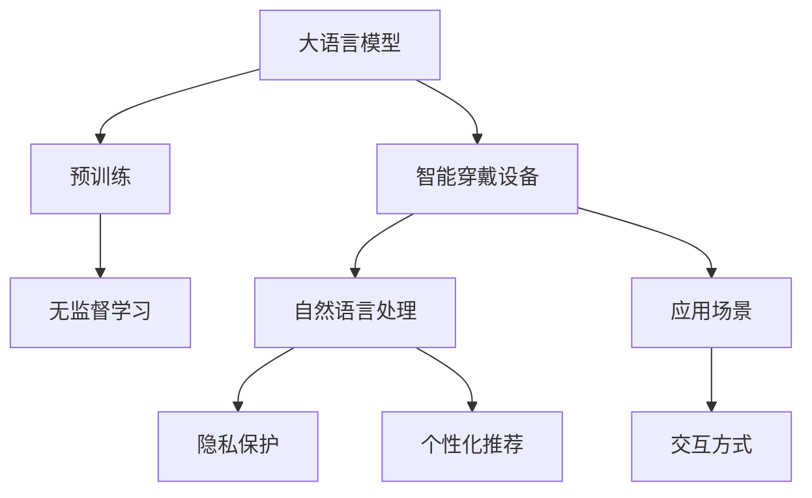

                 

# LLM与智能穿戴设备：贴身的AI助手

> 关键词：智能穿戴设备,自然语言处理,人工智能,语言模型,自然语言理解,个性化推荐,隐私保护

## 1. 背景介绍

随着人工智能技术的不断进步，智能穿戴设备已成为日常生活中不可或缺的一部分。从智能手表到智能眼镜，从智能耳机到智能家居设备，这些设备不仅改变了我们的生活方式，还带来了全新的互动体验。然而，随着设备智能化程度的不断提高，对人工智能技术的需求也越来越高。尤其是自然语言处理(Natural Language Processing, NLP)技术，它不仅能听懂用户的语音指令，还能理解用户的意图，从而提供更加个性化的服务。基于大语言模型(Large Language Model, LLM)的智能穿戴设备，正逐步成为人们日常生活中的智能助手。

### 1.1 问题由来

智能穿戴设备的普及，使得人们对设备的功能和性能提出了更高的要求。传统的基于规则或模板的智能设备，虽然在某些场景下能提供基本的功能，但在复杂交互和多场景应用中显得力不从心。大语言模型的出现，为智能穿戴设备的智能化和个性化提供了新的解决方案。通过预训练和微调，大语言模型可以理解用户的自然语言输入，提供更加智能和自然的人机交互体验。

然而，将大语言模型应用于智能穿戴设备，也面临着诸多挑战。比如如何提高模型的隐私保护水平，如何在资源受限的设备上实现高效的推理，如何为用户提供个性化的服务，如何在设备间进行无缝的交互等。这些问题都需要通过系统的理论和技术手段来解决。本文将从大语言模型在智能穿戴设备中的应用出发，探讨如何利用大语言模型提高智能设备的智能化水平，提升用户的体验，同时确保设备的安全性和隐私性。

## 2. 核心概念与联系

### 2.1 核心概念概述

为更好地理解大语言模型在智能穿戴设备中的应用，本节将介绍几个密切相关的核心概念：

- 大语言模型：以自回归模型（如GPT）或自编码模型（如BERT）为代表的预训练语言模型，通过在大规模文本语料上进行预训练，学习通用的语言表示。
- 智能穿戴设备：如智能手表、智能眼镜、智能耳机等设备，通过嵌入人工智能技术，实现与用户交互和服务的智能化。
- 自然语言处理：研究如何使计算机理解、处理和生成人类语言的学科。
- 隐私保护：保护个人数据和信息安全，防止信息泄露的技术手段。
- 个性化推荐：根据用户的历史行为和偏好，提供量身定制的服务和产品。
- 无监督学习：指使用未标注数据进行学习和建模，广泛应用于NLP和智能设备中的预训练。

这些核心概念之间的逻辑关系可以通过以下Mermaid流程图来展示：



这个流程图展示了大语言模型在智能穿戴设备中的核心概念及其之间的关系：

1. 大语言模型通过预训练获得基础能力。
2. 智能穿戴设备通过自然语言处理技术，与用户进行交互和提供服务。
3. 在隐私保护的基础上，大语言模型可以进行个性化推荐。
4. 无监督学习是预训练的主要手段。
5. 智能穿戴设备在特定场景下提供应用服务。
6. 通过交互方式和设备间协作，实现多场景应用。

## 3. 核心算法原理 & 具体操作步骤

### 3.1 算法原理概述

基于大语言模型的智能穿戴设备，主要通过以下步骤实现：

1. 预训练：在大规模无标签文本语料上进行自监督预训练，学习语言的基础表示。
2. 微调：在智能穿戴设备的特定应用场景中进行有监督微调，学习特定任务的知识。
3. 推理：在实时场景下，通过推理引擎进行推理，快速响应用户的输入。
4. 反馈：收集用户反馈，进一步优化模型。

### 3.2 算法步骤详解

下面详细介绍基于大语言模型的智能穿戴设备的核心算法步骤：

**Step 1: 准备预训练模型和数据集**
- 选择合适的预训练语言模型，如BERT、GPT等。
- 准备智能穿戴设备的应用场景数据集，包括用户输入、系统响应、用户反馈等。

**Step 2: 添加任务适配层**
- 根据应用场景设计合适的任务适配层，如文本分类、对话系统、翻译等。
- 适配层的输出应与设备功能紧密结合，提供用户期望的响应。

**Step 3: 设置微调超参数**
- 选择合适的优化算法及其参数，如AdamW、SGD等，设置学习率、批大小、迭代轮数等。
- 设置正则化技术及强度，包括权重衰减、Dropout、Early Stopping等。
- 确定冻结预训练参数的策略，如仅微调顶层，或全部参数都参与微调。

**Step 4: 执行梯度训练**
- 将训练集数据分批次输入模型，前向传播计算损失函数。
- 反向传播计算参数梯度，根据设定的优化算法和学习率更新模型参数。
- 周期性在验证集上评估模型性能，根据性能指标决定是否触发 Early Stopping。
- 重复上述步骤直到满足预设的迭代轮数或 Early Stopping 条件。

**Step 5: 测试和部署**
- 在测试集上评估微调后模型，对比微调前后的精度提升。
- 使用微调后的模型对新样本进行推理预测，集成到智能穿戴设备中。
- 持续收集用户反馈，定期重新微调模型，以适应数据分布的变化。

### 3.3 算法优缺点

基于大语言模型的智能穿戴设备有以下优点：
1. 能够理解自然语言输入，提供更加智能和自然的交互体验。
2. 利用预训练能力，减少数据标注成本，提高模型的泛化能力。
3. 在实时场景下快速响应，提升用户体验。
4. 可以根据用户反馈不断优化，提高服务的准确性和个性化程度。

同时，该方法也存在一定的局限性：
1. 需要大量的计算资源和存储空间。
2. 对隐私保护要求高，需在模型设计和应用过程中注重隐私保护。
3. 需要持续的模型优化和维护，以保证服务质量。
4. 对设备和算力要求较高，需要在硬件上有所投入。

尽管存在这些局限性，但就目前而言，基于大语言模型的智能穿戴设备是实现设备智能化和个性化的有效手段。未来相关研究的重点在于如何进一步降低计算和存储资源的需求，提高模型的效率和隐私保护能力，同时兼顾服务质量和用户隐私。

### 3.4 算法应用领域

基于大语言模型的智能穿戴设备，已经在多个领域得到了应用，例如：

- 智能手表：通过自然语言处理技术，实现文本消息的语音回复、日程提醒、健康监测等功能。
- 智能眼镜：提供语音翻译、图像识别、场景理解等基于自然语言处理的功能。
- 智能耳机：通过自然语言交互，实现语音控制、音乐推荐、智能通话等功能。
- 智能家居设备：如智能音箱、智能门锁等，通过自然语言理解技术，实现语音控制家居设备、回答问题等应用。

除了上述这些经典应用外，大语言模型在智能穿戴设备中的应用还在不断扩展，如可穿戴设备间的无缝交互、健康监测的个性化建议、增强现实中的语言理解等，为智能穿戴设备带来了更多的可能性。

## 4. 数学模型和公式 & 详细讲解

### 4.1 数学模型构建

本节将使用数学语言对基于大语言模型的智能穿戴设备进行更加严格的刻画。

记预训练语言模型为 $M_{\theta}$，其中 $\theta$ 为预训练得到的模型参数。假设智能穿戴设备的应用场景为文本分类任务，训练集为 $D=\{(x_i,y_i)\}_{i=1}^N, x_i \in \mathcal{X}, y_i \in \{0,1\}$。

定义模型 $M_{\theta}$ 在输入 $x$ 上的损失函数为 $\ell(M_{\theta}(x),y)$，则在数据集 $D$ 上的经验风险为：

$$
\mathcal{L}(\theta) = \frac{1}{N} \sum_{i=1}^N \ell(M_{\theta}(x_i),y_i)
$$

微调的优化目标是最小化经验风险，即找到最优参数：

$$
\theta^* = \mathop{\arg\min}_{\theta} \mathcal{L}(\theta)
$$

在实践中，我们通常使用基于梯度的优化算法（如SGD、Adam等）来近似求解上述最优化问题。设 $\eta$ 为学习率，$\lambda$ 为正则化系数，则参数的更新公式为：

$$
\theta \leftarrow \theta - \eta \nabla_{\theta}\mathcal{L}(\theta) - \eta\lambda\theta
$$

其中 $\nabla_{\theta}\mathcal{L}(\theta)$ 为损失函数对参数 $\theta$ 的梯度，可通过反向传播算法高效计算。

### 4.2 公式推导过程

以下我们以文本分类任务为例，推导交叉熵损失函数及其梯度的计算公式。

假设模型 $M_{\theta}$ 在输入 $x$ 上的输出为 $\hat{y}=M_{\theta}(x) \in [0,1]$，表示样本属于正类的概率。真实标签 $y \in \{0,1\}$。则二分类交叉熵损失函数定义为：

$$
\ell(M_{\theta}(x),y) = -[y\log \hat{y} + (1-y)\log (1-\hat{y})]
$$

将其代入经验风险公式，得：

$$
\mathcal{L}(\theta) = -\frac{1}{N}\sum_{i=1}^N [y_i\log M_{\theta}(x_i)+(1-y_i)\log(1-M_{\theta}(x_i))]
$$

根据链式法则，损失函数对参数 $\theta_k$ 的梯度为：

$$
\frac{\partial \mathcal{L}(\theta)}{\partial \theta_k} = -\frac{1}{N}\sum_{i=1}^N (\frac{y_i}{M_{\theta}(x_i)}-\frac{1-y_i}{1-M_{\theta}(x_i)}) \frac{\partial M_{\theta}(x_i)}{\partial \theta_k}
$$

其中 $\frac{\partial M_{\theta}(x_i)}{\partial \theta_k}$ 可进一步递归展开，利用自动微分技术完成计算。

在得到损失函数的梯度后，即可带入参数更新公式，完成模型的迭代优化。重复上述过程直至收敛，最终得到适应智能穿戴设备任务的最优模型参数 $\theta^*$。

## 5. 项目实践：代码实例和详细解释说明

### 5.1 开发环境搭建

在进行微调实践前，我们需要准备好开发环境。以下是使用Python进行PyTorch开发的环境配置流程：

1. 安装Anaconda：从官网下载并安装Anaconda，用于创建独立的Python环境。

2. 创建并激活虚拟环境：
```bash
conda create -n pytorch-env python=3.8 
conda activate pytorch-env
```

3. 安装PyTorch：根据CUDA版本，从官网获取对应的安装命令。例如：
```bash
conda install pytorch torchvision torchaudio cudatoolkit=11.1 -c pytorch -c conda-forge
```

4. 安装Transformers库：
```bash
pip install transformers
```

5. 安装各类工具包：
```bash
pip install numpy pandas scikit-learn matplotlib tqdm jupyter notebook ipython
```

完成上述步骤后，即可在`pytorch-env`环境中开始微调实践。

### 5.2 源代码详细实现

这里我们以智能手表的文本分类任务为例，给出使用Transformers库对BERT模型进行微调的PyTorch代码实现。

首先，定义文本分类任务的数据处理函数：

```python
from transformers import BertTokenizer
from torch.utils.data import Dataset
import torch

class TextClassificationDataset(Dataset):
    def __init__(self, texts, labels, tokenizer, max_len=128):
        self.texts = texts
        self.labels = labels
        self.tokenizer = tokenizer
        self.max_len = max_len
        
    def __len__(self):
        return len(self.texts)
    
    def __getitem__(self, item):
        text = self.texts[item]
        label = self.labels[item]
        
        encoding = self.tokenizer(text, return_tensors='pt', max_length=self.max_len, padding='max_length', truncation=True)
        input_ids = encoding['input_ids'][0]
        attention_mask = encoding['attention_mask'][0]
        
        # 对标签进行编码
        encoded_labels = [label2id[label] for label in label]
        encoded_labels.extend([label2id['O']] * (self.max_len - len(encoded_labels)))
        labels = torch.tensor(encoded_labels, dtype=torch.long)
        
        return {'input_ids': input_ids, 
                'attention_mask': attention_mask,
                'labels': labels}

# 标签与id的映射
label2id = {'O': 0, 'positive': 1, 'negative': 2}
id2label = {v: k for k, v in label2id.items()}

# 创建dataset
tokenizer = BertTokenizer.from_pretrained('bert-base-cased')

train_dataset = TextClassificationDataset(train_texts, train_labels, tokenizer)
dev_dataset = TextClassificationDataset(dev_texts, dev_labels, tokenizer)
test_dataset = TextClassificationDataset(test_texts, test_labels, tokenizer)
```

然后，定义模型和优化器：

```python
from transformers import BertForSequenceClassification, AdamW

model = BertForSequenceClassification.from_pretrained('bert-base-cased', num_labels=len(label2id))

optimizer = AdamW(model.parameters(), lr=2e-5)
```

接着，定义训练和评估函数：

```python
from torch.utils.data import DataLoader
from tqdm import tqdm
from sklearn.metrics import classification_report

device = torch.device('cuda') if torch.cuda.is_available() else torch.device('cpu')
model.to(device)

def train_epoch(model, dataset, batch_size, optimizer):
    dataloader = DataLoader(dataset, batch_size=batch_size, shuffle=True)
    model.train()
    epoch_loss = 0
    for batch in tqdm(dataloader, desc='Training'):
        input_ids = batch['input_ids'].to(device)
        attention_mask = batch['attention_mask'].to(device)
        labels = batch['labels'].to(device)
        model.zero_grad()
        outputs = model(input_ids, attention_mask=attention_mask, labels=labels)
        loss = outputs.loss
        epoch_loss += loss.item()
        loss.backward()
        optimizer.step()
    return epoch_loss / len(dataloader)

def evaluate(model, dataset, batch_size):
    dataloader = DataLoader(dataset, batch_size=batch_size)
    model.eval()
    preds, labels = [], []
    with torch.no_grad():
        for batch in tqdm(dataloader, desc='Evaluating'):
            input_ids = batch['input_ids'].to(device)
            attention_mask = batch['attention_mask'].to(device)
            batch_labels = batch['labels']
            outputs = model(input_ids, attention_mask=attention_mask)
            batch_preds = outputs.logits.argmax(dim=2).to('cpu').tolist()
            batch_labels = batch_labels.to('cpu').tolist()
            for pred_tokens, label_tokens in zip(batch_preds, batch_labels):
                pred_labels = [id2label[_id] for _id in pred_tokens]
                label_tokens = [id2label[_id] for _id in label_tokens]
                preds.append(pred_labels[:len(label_tokens)])
                labels.append(label_tokens)
                
    print(classification_report(labels, preds))
```

最后，启动训练流程并在测试集上评估：

```python
epochs = 5
batch_size = 16

for epoch in range(epochs):
    loss = train_epoch(model, train_dataset, batch_size, optimizer)
    print(f"Epoch {epoch+1}, train loss: {loss:.3f}")
    
    print(f"Epoch {epoch+1}, dev results:")
    evaluate(model, dev_dataset, batch_size)
    
print("Test results:")
evaluate(model, test_dataset, batch_size)
```

以上就是使用PyTorch对BERT进行文本分类任务微调的完整代码实现。可以看到，得益于Transformers库的强大封装，我们可以用相对简洁的代码完成BERT模型的加载和微调。

### 5.3 代码解读与分析

让我们再详细解读一下关键代码的实现细节：

**TextClassificationDataset类**：
- `__init__`方法：初始化文本、标签、分词器等关键组件。
- `__len__`方法：返回数据集的样本数量。
- `__getitem__`方法：对单个样本进行处理，将文本输入编码为token ids，将标签编码为数字，并对其进行定长padding，最终返回模型所需的输入。

**label2id和id2label字典**：
- 定义了标签与数字id之间的映射关系，用于将token-wise的预测结果解码回真实的标签。

**训练和评估函数**：
- 使用PyTorch的DataLoader对数据集进行批次化加载，供模型训练和推理使用。
- 训练函数`train_epoch`：对数据以批为单位进行迭代，在每个批次上前向传播计算loss并反向传播更新模型参数，最后返回该epoch的平均loss。
- 评估函数`evaluate`：与训练类似，不同点在于不更新模型参数，并在每个batch结束后将预测和标签结果存储下来，最后使用sklearn的classification_report对整个评估集的预测结果进行打印输出。

**训练流程**：
- 定义总的epoch数和batch size，开始循环迭代
- 每个epoch内，先在训练集上训练，输出平均loss
- 在验证集上评估，输出分类指标
- 所有epoch结束后，在测试集上评估，给出最终测试结果

可以看到，PyTorch配合Transformers库使得BERT微调的代码实现变得简洁高效。开发者可以将更多精力放在数据处理、模型改进等高层逻辑上，而不必过多关注底层的实现细节。

当然，工业级的系统实现还需考虑更多因素，如模型的保存和部署、超参数的自动搜索、更灵活的任务适配层等。但核心的微调范式基本与此类似。

## 6. 实际应用场景

### 6.1 智能手表的智能助理

智能手表已经成为人们日常生活的重要组成部分。基于大语言模型的智能助理，可以提供个性化的健康监测、日程提醒、短信回复等功能。比如，智能助理可以监测用户的步数、心率、睡眠等健康数据，并提供个性化的健康建议；或者根据用户的日程安排，自动提醒会议、出行等事项；还可以根据用户的短信内容，自动回复常见问题，提升用户的沟通效率。

### 6.2 智能眼镜中的自然语言交互

智能眼镜利用计算机视觉和自然语言处理技术，可以实现自然语言交互。用户可以通过语音指令，查询信息、发送消息、控制设备等。例如，用户可以通过智能眼镜查询天气预报、交通状况、股票行情等，还可以通过语音指令控制智能家居设备，如打开电视、调节温度等。

### 6.3 智能耳机的个性化音乐推荐

智能耳机利用自然语言处理技术，可以分析用户的听歌习惯和偏好，提供个性化的音乐推荐。用户可以通过语音指令，播放自己喜欢的音乐、搜索歌曲、创建播放列表等。智能耳机还可以通过自然语言理解技术，识别用户的情绪和心情，提供相应的背景音乐，提升用户的听觉体验。

### 6.4 未来应用展望

随着大语言模型和智能穿戴设备技术的不断进步，基于大语言模型的智能穿戴设备将带来更多的应用场景和可能性。

- 智能家居：通过语音控制和自然语言理解技术，实现全屋智能化，提升家居生活的舒适度和便利性。
- 健康管理：通过智能手表等设备，实时监测用户的健康数据，提供个性化的健康管理建议，提升用户的健康水平。
- 教育培训：通过智能耳机等设备，提供个性化的学习资源和指导，提升学习效果和用户体验。
- 娱乐社交：通过智能眼镜等设备，提供更加沉浸式的娱乐和社交体验，如虚拟现实游戏、AR社交等。

未来，基于大语言模型的智能穿戴设备必将在更多领域得到应用，为人们的生产和生活带来新的变革。

## 7. 工具和资源推荐

### 7.1 学习资源推荐

为了帮助开发者系统掌握大语言模型在智能穿戴设备中的应用，这里推荐一些优质的学习资源：

1. 《Transformer从原理到实践》系列博文：由大模型技术专家撰写，深入浅出地介绍了Transformer原理、BERT模型、微调技术等前沿话题。

2. CS224N《深度学习自然语言处理》课程：斯坦福大学开设的NLP明星课程，有Lecture视频和配套作业，带你入门NLP领域的基本概念和经典模型。

3. 《Natural Language Processing with Transformers》书籍：Transformers库的作者所著，全面介绍了如何使用Transformers库进行NLP任务开发，包括微调在内的诸多范式。

4. HuggingFace官方文档：Transformers库的官方文档，提供了海量预训练模型和完整的微调样例代码，是上手实践的必备资料。

5. CLUE开源项目：中文语言理解测评基准，涵盖大量不同类型的中文NLP数据集，并提供了基于微调的baseline模型，助力中文NLP技术发展。

通过对这些资源的学习实践，相信你一定能够快速掌握大语言模型在智能穿戴设备中的应用，并用于解决实际的NLP问题。

### 7.2 开发工具推荐

高效的开发离不开优秀的工具支持。以下是几款用于大语言模型微调开发的常用工具：

1. PyTorch：基于Python的开源深度学习框架，灵活动态的计算图，适合快速迭代研究。大部分预训练语言模型都有PyTorch版本的实现。

2. TensorFlow：由Google主导开发的开源深度学习框架，生产部署方便，适合大规模工程应用。同样有丰富的预训练语言模型资源。

3. Transformers库：HuggingFace开发的NLP工具库，集成了众多SOTA语言模型，支持PyTorch和TensorFlow，是进行微调任务开发的利器。

4. Weights & Biases：模型训练的实验跟踪工具，可以记录和可视化模型训练过程中的各项指标，方便对比和调优。与主流深度学习框架无缝集成。

5. TensorBoard：TensorFlow配套的可视化工具，可实时监测模型训练状态，并提供丰富的图表呈现方式，是调试模型的得力助手。

6. Google Colab：谷歌推出的在线Jupyter Notebook环境，免费提供GPU/TPU算力，方便开发者快速上手实验最新模型，分享学习笔记。

合理利用这些工具，可以显著提升大语言模型在智能穿戴设备中的微调效率，加快创新迭代的步伐。

### 7.3 相关论文推荐

大语言模型在智能穿戴设备中的应用，源于学界的持续研究。以下是几篇奠基性的相关论文，推荐阅读：

1. Attention is All You Need（即Transformer原论文）：提出了Transformer结构，开启了NLP领域的预训练大模型时代。

2. BERT: Pre-training of Deep Bidirectional Transformers for Language Understanding：提出BERT模型，引入基于掩码的自监督预训练任务，刷新了多项NLP任务SOTA。

3. Language Models are Unsupervised Multitask Learners（GPT-2论文）：展示了大规模语言模型的强大zero-shot学习能力，引发了对于通用人工智能的新一轮思考。

4. Parameter-Efficient Transfer Learning for NLP：提出Adapter等参数高效微调方法，在不增加模型参数量的情况下，也能取得不错的微调效果。

5. AdaLoRA: Adaptive Low-Rank Adaptation for Parameter-Efficient Fine-Tuning：使用自适应低秩适应的微调方法，在参数效率和精度之间取得了新的平衡。

6. Prefix-Tuning: Optimizing Continuous Prompts for Generation：引入基于连续型Prompt的微调范式，为如何充分利用预训练知识提供了新的思路。

这些论文代表了大语言模型在智能穿戴设备中的应用研究的发展脉络。通过学习这些前沿成果，可以帮助研究者把握学科前进方向，激发更多的创新灵感。

## 8. 总结：未来发展趋势与挑战

### 8.1 总结

本文对基于大语言模型的智能穿戴设备进行了全面系统的介绍。首先阐述了智能穿戴设备和自然语言处理技术的研究背景和意义，明确了智能穿戴设备在人工智能技术中的重要地位。其次，从原理到实践，详细讲解了大语言模型在智能穿戴设备中的核心算法步骤，给出了微调任务开发的完整代码实例。同时，本文还广泛探讨了大语言模型在智能穿戴设备中的应用场景，展示了其巨大的应用潜力。最后，本文精选了大语言模型在智能穿戴设备中的各类学习资源，力求为读者提供全方位的技术指引。

通过本文的系统梳理，可以看到，基于大语言模型的智能穿戴设备已经成为人工智能技术的重要应用领域。大语言模型的强大能力，使得智能穿戴设备能够更加智能地理解和响应用户，提升用户的体验和满意度。

### 8.2 未来发展趋势

展望未来，大语言模型在智能穿戴设备中的应用将呈现以下几个发展趋势：

1. 智能化水平进一步提升。随着算力资源的不断扩大，大语言模型的性能将不断提升，智能穿戴设备的智能化水平也将不断提升，能够更加智能地理解和响应用户。

2. 个性化推荐更加精准。通过分析用户的多种数据来源，如语音、行为、社交网络等，大语言模型能够提供更加精准、个性化的推荐服务，提升用户的满意度和体验。

3. 实时交互更加流畅。未来，基于大语言模型的智能穿戴设备将实现更高效的实时交互，减少延迟，提升用户体验。

4. 隐私保护更加严格。随着隐私保护意识的增强，智能穿戴设备将更加注重隐私保护，实现更严格的隐私保护措施，确保用户数据的安全。

5. 多模态交互更加丰富。未来的智能穿戴设备将实现视觉、听觉、触觉等多模态交互，提升用户的使用体验和互动性。

以上趋势凸显了大语言模型在智能穿戴设备中的应用前景。这些方向的探索发展，必将进一步提升智能穿戴设备的智能化水平，为人们的生产和生活带来新的变革。

### 8.3 面临的挑战

尽管大语言模型在智能穿戴设备中的应用已经取得了显著进展，但在迈向更加智能化、普适化应用的过程中，它仍面临着诸多挑战：

1. 计算资源消耗巨大。智能穿戴设备通常具有有限的计算资源和存储空间，如何在资源受限的环境中实现高效的推理和训练，是一个亟待解决的问题。

2. 数据隐私保护难度大。智能穿戴设备通常会收集大量用户数据，如何保护用户隐私，防止数据泄露，是一个重要的研究方向。

3. 设备间协同难度高。智能穿戴设备需要实现多设备间的无缝协同，但不同设备之间的数据格式、硬件资源和网络环境差异较大，如何实现高效的数据交换和协同，是一个重要的挑战。

4. 用户体验一致性难保证。不同设备和平台上的智能穿戴设备，用户体验可能存在差异，如何保证用户体验的一致性，是一个需要关注的问题。

5. 伦理道德问题需重视。智能穿戴设备可能涉及用户隐私和伦理道德问题，如何在设计和使用过程中，保证伦理道德的遵守，是一个需要考虑的问题。

这些挑战都需要通过系统的理论和技术手段来解决。只有在设备、算法、伦理等多方面协同发力，才能真正实现智能穿戴设备的大规模落地应用。

### 8.4 研究展望

面对智能穿戴设备中的大语言模型应用，未来的研究需要在以下几个方面寻求新的突破：

1. 探索更高效的模型压缩和量化方法，降低计算和存储资源的需求，实现轻量级部署。

2. 研究更有效的隐私保护技术，如差分隐私、联邦学习等，确保用户数据的隐私安全。

3. 开发更灵活的设备协同技术，如边缘计算、云-边缘融合等，实现无缝的多设备协同。

4. 研究更丰富的用户交互方式，如多模态交互、情境感知等，提升用户的体验和互动性。

5. 引入更多的伦理和道德约束，如用户同意机制、隐私保护协议等，确保伦理道德的遵守。

6. 开发更智能的个性化推荐系统，如深度强化学习、因果推断等，提升推荐的准确性和用户满意度。

这些研究方向的探索，必将引领大语言模型在智能穿戴设备中的应用迈向更高的台阶，为构建安全、可靠、可解释、可控的智能系统铺平道路。面向未来，大语言模型在智能穿戴设备中的应用还需与其他人工智能技术进行更深入的融合，如知识表示、因果推理、强化学习等，多路径协同发力，共同推动智能穿戴设备的进步。只有勇于创新、敢于突破，才能不断拓展语言模型的边界，让智能技术更好地造福人类社会。

## 9. 附录：常见问题与解答

**Q1：大语言模型在智能穿戴设备中如何实现隐私保护？**

A: 大语言模型在智能穿戴设备中的隐私保护，主要通过以下几个方面实现：

1. 数据匿名化：对用户数据进行去标识化处理，确保用户隐私不被泄露。

2. 本地处理：在设备本地进行数据处理和推理，避免将数据传输到云端，防止数据泄露。

3. 差分隐私：对用户数据进行差分隐私处理，确保单个用户数据不被泄露。

4. 联邦学习：在多个设备之间进行模型共享，而不是数据共享，确保用户数据的安全。

5. 安全传输：采用安全传输协议，如TLS、HTTPS等，确保数据传输过程中不被窃取或篡改。

**Q2：如何在计算资源受限的智能穿戴设备上实现高效的推理？**

A: 在计算资源受限的智能穿戴设备上实现高效的推理，主要通过以下几个方面实现：

1. 模型压缩：通过剪枝、量化、参数共享等方法，将大模型压缩为轻量级模型，减小计算和存储需求。

2. 推理加速：采用优化推理算法，如剪枝、融合、分解等方法，提高推理速度。

3. 硬件加速：利用GPU、TPU等专用硬件，加速推理计算，提高计算效率。

4. 分布式推理：通过分布式计算，将推理任务分散到多个设备上，提高计算速度和效率。

5. 本地计算：尽量在设备本地进行推理计算，避免数据传输的延迟和开销。

**Q3：智能穿戴设备中如何进行多设备协同？**

A: 智能穿戴设备中的多设备协同，主要通过以下几个方面实现：

1. 统一通信协议：采用统一的数据传输协议，确保不同设备之间的数据交换顺畅。

2. 设备间协同框架：构建设备间协同的框架，如IoT平台、云-边缘融合等，实现设备之间的无缝协作。

3. 数据共享机制：通过数据共享机制，实现设备间的信息传递和协同工作。

4. 协同推理：通过分布式推理技术，将推理任务分散到多个设备上，提高计算速度和效率。

5. 边缘计算：将计算任务集中在边缘设备上，减少延迟，提升协同效率。

**Q4：如何设计更智能的个性化推荐系统？**

A: 设计更智能的个性化推荐系统，主要通过以下几个方面实现：

1. 多源数据融合：将用户的多源数据，如行为数据、社交网络数据、情境数据等，进行融合，提升推荐的准确性和全面性。

2. 深度学习模型：采用深度学习模型，如卷积神经网络、循环神经网络、Transformer等，提升推荐的精度和效果。

3. 强化学习：引入强化学习，通过用户行为反馈，优化推荐策略，提升推荐的个性化和精准度。

4. 因果推断：引入因果推断技术，分析推荐行为的影响因素，提升推荐的科学性和合理性。

5. 数据增强：通过数据增强技术，扩充数据集，提升推荐的泛化能力。

**Q5：如何提升智能穿戴设备的用户体验？**

A: 提升智能穿戴设备的用户体验，主要通过以下几个方面实现：

1. 自然语言交互：通过自然语言处理技术，提升设备与用户的交互体验，减少操作复杂性。

2. 多模态交互：引入多模态交互技术，如语音、视觉、触觉等，提升用户的使用体验和互动性。

3. 情境感知：通过情境感知技术，根据用户的情境状态，提供个性化的服务和建议，提升用户的满意度和体验。

4. 个性化推荐：通过个性化的推荐系统，提供用户感兴趣的内容和服务，提升用户的黏性和满意度。

5. 实时反馈：通过实时反馈机制，及时获取用户反馈，优化设备和应用，提升用户的体验和满意度。

通过这些技术手段，可以提升智能穿戴设备的用户体验，让用户更自然、更智能地与设备进行交互，提升用户的满意度和使用体验。

---

作者：禅与计算机程序设计艺术 / Zen and the Art of Computer Programming

