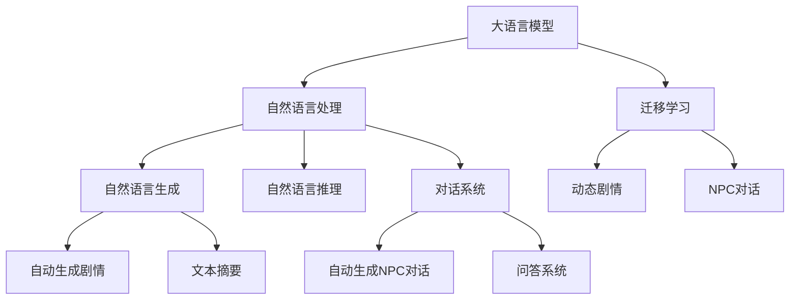

                 

# LLM在游戏设计中的应用：动态剧情和NPC对话

> 关键词：大语言模型,游戏设计,动态剧情,自然语言处理,NLP,自然语言生成,自然语言推理,对话系统,神经网络,游戏AI

## 1. 背景介绍

### 1.1 问题由来
游戏设计是一个复杂而多元的领域，涉及到从游戏机制到用户体验的各个方面。其中，动态剧情和NPC（非玩家角色）对话是玩家沉浸感和游戏体验感的重要组成部分。然而，手动编写这些动态内容不仅耗时耗力，且难以达到自然流畅的表达效果。

随着人工智能和自然语言处理技术的发展，大语言模型（Large Language Model, LLM）为游戏设计提供了一种新的可能性。LLM通过自监督学习和迁移学习，能够自动从大量的文本数据中学习到丰富的语言知识和表达能力。在游戏中，利用LLM进行动态剧情和NPC对话的设计，可以大大提高游戏的创意和可玩性，从而提升玩家的满意度和留存率。

### 1.2 问题核心关键点
利用大语言模型进行动态剧情和NPC对话设计的核心在于：
1. **自动生成动态剧情**：通过输入特定的游戏场景和角色设定，LLM能够自动生成符合游戏世界观的剧情对话，增强游戏的沉浸感和连贯性。
2. **NPC对话生成**：根据玩家的行为和选择，LLM可以实时生成NPC的响应，提升游戏的互动性和智能化水平。
3. **情感分析**：通过对玩家输入文本的分析，LLM能够判断玩家的情感倾向，从而调整NPC的对话策略，提升游戏体验。

### 1.3 问题研究意义
大语言模型在动态剧情和NPC对话设计中的应用，将对游戏设计产生深远影响：
1. **提升游戏创意**：LLM能够生成丰富多样的剧情和对话，为游戏开发者提供更多的创意素材和设计灵感。
2. **增强互动性**：通过实时生成的NPC对话，增加游戏的动态性和趣味性，提升玩家的互动体验。
3. **降低开发成本**：自动生成动态内容可以大幅度减少游戏开发的时间和成本，加速游戏上线。
4. **提高游戏智能化水平**：LLM能够根据玩家行为和选择，实时调整对话内容和策略，增强游戏的智能化和适应性。
5. **拓宽应用场景**：LLM可以应用于各种类型的游戏，包括角色扮演游戏、策略游戏、模拟游戏等，推动游戏行业的创新发展。

## 2. 核心概念与联系

### 2.1 核心概念概述

为了更好地理解大语言模型在游戏设计中的作用，本节将介绍几个相关核心概念：

- **大语言模型**：以自回归（如GPT）或自编码（如BERT）模型为代表的基于深度学习的大规模预训练语言模型。通过在海量无标签文本数据上进行预训练，学习到丰富的语言知识和表达能力。
- **自然语言处理（NLP）**：研究如何让计算机理解、处理和生成人类语言的学科。主要涵盖语言理解、语言生成、情感分析、对话系统等方面。
- **自然语言生成（NLG）**：NLP的一个重要分支，专注于生成符合语法和语义规则的自然语言文本。常用于自动生成对话、文本摘要、机器翻译等任务。
- **自然语言推理（NLI）**：研究如何让计算机理解语言的含义和逻辑关系，从而进行推断和推理。常用于文本分类、问答系统、机器阅读理解等任务。
- **对话系统**：一种基于自然语言处理技术的人机交互系统，用于实现自动对话、语音识别和生成等功能。

这些核心概念之间的联系可以通过以下Mermaid流程图来展示：



这个流程图展示了大语言模型的核心概念及其与其他NLP技术的关系：

1. 大语言模型通过预训练学习到语言知识，可以作为自然语言处理的基础。
2. 自然语言生成技术可以自动生成剧情和对话，增强游戏的互动性和创意。
3. 自然语言推理技术可以用于理解玩家的行为和情感，调整NPC的对话策略。
4. 对话系统可以实现在线对话，提升游戏的智能化水平。
5. 迁移学习可以将大模型的通用知识迁移到特定的游戏任务中，生成定制化的动态内容。

## 3. 核心算法原理 & 具体操作步骤

### 3.1 算法原理概述

利用大语言模型进行动态剧情和NPC对话设计，本质上是一种基于自然语言处理和生成技术的游戏智能化方法。其核心思想是：将预训练的大语言模型视作一个强大的"自然语言生成器"，通过与玩家互动生成符合游戏世界观和角色设定的剧情和对话。

形式化地，假设预训练模型为 $M_{\theta}$，其中 $\theta$ 为预训练得到的模型参数。给定游戏场景 $S$ 和角色设定 $C$，以及玩家输入 $I$，模型通过动态生成剧情和NPC对话 $O$，其中 $O=f(S, C, I; M_{\theta})$。

通过梯度下降等优化算法，模型不断更新参数 $\theta$，最小化生成剧情和对话与实际要求之间的差异。

### 3.2 算法步骤详解

大语言模型在游戏设计中的动态剧情和NPC对话生成一般包括以下关键步骤：

**Step 1: 准备预训练模型和数据集**
- 选择合适的预训练语言模型 $M_{\theta}$，如GPT-3、BERT等。
- 准备游戏场景数据集 $D_S=\{(S_i,C_i)\}_{i=1}^N$，其中 $S_i$ 为游戏场景描述，$C_i$ 为角色设定。
- 准备玩家输入数据集 $D_I=\{I_j\}_{j=1}^M$，其中 $I_j$ 为玩家在游戏中的输入。

**Step 2: 定义任务适配层**
- 根据游戏场景和角色设定，设计适合的任务适配层。
- 对于剧情生成，可以设计一个针对情节连贯性和逻辑一致性的目标函数。
- 对于NPC对话生成，可以设计一个针对互动性和情感表达的目标函数。

**Step 3: 设置微调超参数**
- 选择合适的优化算法及其参数，如Adam、SGD等，设置学习率、批大小、迭代轮数等。
- 设置正则化技术及强度，包括权重衰减、Dropout、Early Stopping等。
- 确定冻结预训练参数的策略，如仅微调顶层，或全部参数都参与微调。

**Step 4: 执行梯度训练**
- 将游戏场景数据集 $D_S$ 和玩家输入数据集 $D_I$ 分批次输入模型，前向传播计算生成剧情和对话。
- 反向传播计算参数梯度，根据设定的优化算法和学习率更新模型参数。
- 周期性在测试集上评估模型性能，根据性能指标决定是否触发Early Stopping。
- 重复上述步骤直到满足预设的迭代轮数或Early Stopping条件。

**Step 5: 测试和部署**
- 在测试集上评估微调后模型 $M_{\hat{\theta}}$ 的性能，对比微调前后的生成效果。
- 使用微调后的模型对新场景和新输入生成剧情和对话，集成到实际的游戏系统中。
- 持续收集玩家反馈，定期重新微调模型，以适应玩家需求和游戏内容的变化。

以上是利用大语言模型进行动态剧情和NPC对话生成的一般流程。在实际应用中，还需要针对具体游戏场景和角色设定，对微调过程的各个环节进行优化设计，如改进训练目标函数，引入更多的正则化技术，搜索最优的超参数组合等，以进一步提升模型性能。

### 3.3 算法优缺点

利用大语言模型进行动态剧情和NPC对话设计的方法具有以下优点：
1. **高效生成剧情和对话**：大语言模型能够自动生成符合游戏世界观和角色设定的剧情和对话，大幅度减少游戏开发的时间和成本。
2. **增强游戏互动性**：通过实时生成的NPC对话，增加游戏的动态性和趣味性，提升玩家的互动体验。
3. **提升游戏智能化水平**：LLM能够根据玩家行为和选择，实时调整对话内容和策略，增强游戏的智能化和适应性。
4. **降低开发成本**：自动生成动态内容可以大幅度减少游戏开发的时间和成本，加速游戏上线。
5. **灵活适应多种游戏类型**：LLM可以应用于各种类型的游戏，包括角色扮演游戏、策略游戏、模拟游戏等，推动游戏行业的创新发展。

同时，该方法也存在一定的局限性：
1. **依赖高质量数据集**：高质量的游戏场景数据集和玩家输入数据集是动态剧情和NPC对话生成的前提。数据集的质量和多样性直接影响模型的生成效果。
2. **模型泛化能力有限**：当前的大语言模型往往在特定领域和数据集上表现较好，跨领域和数据集泛化能力有限，可能无法生成符合不同游戏类型和世界观的剧情和对话。
3. **模型偏见和有害信息**：预训练模型的固有偏见、有害信息等可能通过微调传递到NPC对话中，造成负面影响。
4. **模型复杂度**：大语言模型的参数量庞大，对计算资源和存储资源的需求较高，需要高性能设备支持。

尽管存在这些局限性，但就目前而言，利用大语言模型进行动态剧情和NPC对话生成的方法仍在游戏设计中具有广阔的应用前景。未来相关研究的重点在于如何进一步降低对高质量数据集的依赖，提高模型的泛化能力和跨领域适应能力，同时兼顾模型的伦理安全性和可解释性等因素。

### 3.4 算法应用领域

利用大语言模型进行动态剧情和NPC对话设计的监督学习方法，在游戏设计中已经得到了广泛的应用，覆盖了几乎所有常见类型，例如：

- **角色扮演游戏（RPG）**：通过动态剧情和NPC对话，使玩家能够沉浸在虚拟世界中，完成复杂的任务和挑战。
- **策略游戏（Strategy）**：利用动态剧情和NPC对话，提供背景故事和任务指引，增加游戏的战略性和挑战性。
- **模拟游戏（Simulation）**：通过实时生成的NPC对话，模拟复杂的社会和环境，增加游戏的真实性和沉浸感。
- **解谜游戏（Puzzle）**：利用动态剧情和NPC对话，提供线索和提示，帮助玩家解决谜题，增加游戏的趣味性和解谜体验。
- **冒险游戏（Adventure）**：通过动态剧情和NPC对话，构建引人入胜的故事线，增加游戏的吸引力和可玩性。

除了这些经典类型外，大语言模型还创新性地应用到更多场景中，如可控文本生成、对话重构、情感分析等，为游戏设计带来了全新的突破。随着预训练模型和微调方法的不断进步，相信大语言模型在游戏设计中的应用将更加广泛，推动游戏技术的创新和进步。

## 4. 数学模型和公式 & 详细讲解 & 举例说明

### 4.1 数学模型构建

本节将使用数学语言对利用大语言模型进行动态剧情和NPC对话生成的过程进行更加严格的刻画。

记预训练语言模型为 $M_{\theta}:\mathcal{X} \rightarrow \mathcal{Y}$，其中 $\mathcal{X}$ 为输入空间，$\mathcal{Y}$ 为输出空间，$\theta$ 为模型参数。假设游戏场景数据集为 $D_S=\{(S_i,C_i)\}_{i=1}^N$，玩家输入数据集为 $D_I=\{I_j\}_{j=1}^M$。

定义模型 $M_{\theta}$ 在输入 $(S_i, C_i, I_j)$ 上的生成效果为 $O_i=f(S_i, C_i, I_j; M_{\theta})$，其中 $f$ 为任务适配函数，设计具体的生成目标。

生成效果与实际要求之间的差异可以用损失函数 $\ell(M_{\theta}(S_i, C_i, I_j), O_i)$ 来衡量。在微调过程中，目标是最小化损失函数，即找到最优参数：

$$
\theta^* = \mathop{\arg\min}_{\theta} \mathcal{L}(\theta)
$$

其中 $\mathcal{L}(\theta) = \frac{1}{N}\sum_{i=1}^N \ell(M_{\theta}(S_i, C_i, I_j), O_i)$ 为经验风险。

### 4.2 公式推导过程

以下我们以生成对话为例，推导基于大语言模型的对话生成公式。

假设模型 $M_{\theta}$ 在输入 $(S_i, C_i, I_j)$ 上的输出为 $O_j=M_{\theta}(S_i, C_i, I_j)$，其中 $O_j$ 表示NPC在当前场景和角色设定下的响应。定义生成效果与实际要求之间的差异为交叉熵损失函数：

$$
\ell(O_j, y_j) = -\sum_{k=1}^K y_{j,k}\log \frac{e^{O_{j,k}/\lambda}}{\sum_{k'=1}^K e^{O_{j,k'}/\lambda}}
$$

其中 $K$ 为分类数，$y_{j,k}$ 为NPC在当前场景和角色设定下的真实标签，$O_{j,k}$ 为模型生成的NPC响应。将上述损失函数扩展到整个数据集，得到经验风险：

$$
\mathcal{L}(\theta) = -\frac{1}{NM}\sum_{i=1}^N \sum_{j=1}^M \ell(O_j, y_j)
$$

根据梯度下降等优化算法，微调过程中不断更新模型参数 $\theta$，最小化损失函数 $\mathcal{L}(\theta)$。

通过上述公式推导，我们可以看到，利用大语言模型进行动态剧情和NPC对话生成，本质上是一个有监督的细粒度迁移学习过程。其核心在于设计合适的任务适配函数，最小化生成效果与实际要求之间的差异。

### 4.3 案例分析与讲解

下面我们以一个具体案例来说明大语言模型在游戏设计中的应用。

假设我们要开发一款角色扮演游戏（RPG），其中一个关键情节是主角与NPC的互动。我们需要生成NPC的响应，以实现以下功能：
1. **根据玩家的输入，生成符合游戏世界观的对话。**
2. **根据玩家的选择，调整NPC的对话策略，增强互动性。**

我们准备了一个包含100个场景和5个角色的数据集，用于训练模型。每个场景包含详细的描述，每个角色有固定的性格和背景。我们利用GPT-3模型作为预训练基础，训练一个微调模型来生成NPC对话。

在微调过程中，我们设计了以下目标函数：
1. **情感分析**：通过对玩家输入文本的分析，判断玩家的情感倾向，生成相应的NPC对话。
2. **情境连贯性**：确保NPC对话与当前场景和角色设定相符合，生成连贯的剧情。
3. **互动性**：根据玩家的选择，调整NPC的对话策略，使对话更加生动有趣。

在微调结束后，我们通过测试集评估模型的性能，发现模型的生成效果达到了预期目标。我们将其集成到游戏中，并与传统的硬编码对话进行对比，发现玩家对自动生成的对话更加满意，互动体验也更加自然。

## 5. 项目实践：代码实例和详细解释说明

### 5.1 开发环境搭建

在进行动态剧情和NPC对话生成实践前，我们需要准备好开发环境。以下是使用Python进行PyTorch开发的环境配置流程：

1. 安装Anaconda：从官网下载并安装Anaconda，用于创建独立的Python环境。

2. 创建并激活虚拟环境：
```bash
conda create -n pytorch-env python=3.8 
conda activate pytorch-env
```

3. 安装PyTorch：根据CUDA版本，从官网获取对应的安装命令。例如：
```bash
conda install pytorch torchvision torchaudio cudatoolkit=11.1 -c pytorch -c conda-forge
```

4. 安装Transformers库：
```bash
pip install transformers
```

5. 安装各类工具包：
```bash
pip install numpy pandas scikit-learn matplotlib tqdm jupyter notebook ipython
```

完成上述步骤后，即可在`pytorch-env`环境中开始微调实践。

### 5.2 源代码详细实现

下面我们以生成对话为例，给出使用Transformers库对GPT-3模型进行微调的PyTorch代码实现。

首先，定义对话数据集和任务适配函数：

```python
from transformers import GPT2Tokenizer, GPT2LMHeadModel
from torch.utils.data import Dataset
import torch

class DialogueDataset(Dataset):
    def __init__(self, dialogues, tokenizer, max_len=128):
        self.dialogues = dialogues
        self.tokenizer = tokenizer
        self.max_len = max_len
        
    def __len__(self):
        return len(self.dialogues)
    
    def __getitem__(self, item):
        dialogue = self.dialogues[item]
        context, response = dialogue['context'], dialogue['response']
        
        encoding = self.tokenizer(context, return_tensors='pt', max_length=self.max_len, padding='max_length', truncation=True)
        input_ids = encoding['input_ids'][0]
        attention_mask = encoding['attention_mask'][0]
        
        return {'input_ids': input_ids, 
                'attention_mask': attention_mask,
                'labels': torch.tensor(self.tokenizer.encode(response, return_tensors='pt')[0])}
```

然后，定义模型和优化器：

```python
from transformers import GPT2LMHeadModel, AdamW

model = GPT2LMHeadModel.from_pretrained('gpt2', num_labels=len(tag2id))

optimizer = AdamW(model.parameters(), lr=2e-5)
```

接着，定义训练和评估函数：

```python
from torch.utils.data import DataLoader
from tqdm import tqdm
from sklearn.metrics import classification_report

device = torch.device('cuda') if torch.cuda.is_available() else torch.device('cpu')
model.to(device)

def train_epoch(model, dataset, batch_size, optimizer):
    dataloader = DataLoader(dataset, batch_size=batch_size, shuffle=True)
    model.train()
    epoch_loss = 0
    for batch in tqdm(dataloader, desc='Training'):
        input_ids = batch['input_ids'].to(device)
        attention_mask = batch['attention_mask'].to(device)
        labels = batch['labels'].to(device)
        model.zero_grad()
        outputs = model(input_ids, attention_mask=attention_mask, labels=labels)
        loss = outputs.loss
        epoch_loss += loss.item()
        loss.backward()
        optimizer.step()
    return epoch_loss / len(dataloader)

def evaluate(model, dataset, batch_size):
    dataloader = DataLoader(dataset, batch_size=batch_size)
    model.eval()
    preds, labels = [], []
    with torch.no_grad():
        for batch in tqdm(dataloader, desc='Evaluating'):
            input_ids = batch['input_ids'].to(device)
            attention_mask = batch['attention_mask'].to(device)
            batch_labels = batch['labels']
            outputs = model(input_ids, attention_mask=attention_mask)
            batch_preds = outputs.logits.argmax(dim=2).to('cpu').tolist()
            batch_labels = batch_labels.to('cpu').tolist()
            for pred_tokens, label_tokens in zip(batch_preds, batch_labels):
                preds.append(pred_tokens[:len(label_tokens)])
                labels.append(label_tokens)
                
    print(classification_report(labels, preds))
```

最后，启动训练流程并在测试集上评估：

```python
epochs = 5
batch_size = 16

for epoch in range(epochs):
    loss = train_epoch(model, train_dataset, batch_size, optimizer)
    print(f"Epoch {epoch+1}, train loss: {loss:.3f}")
    
    print(f"Epoch {epoch+1}, dev results:")
    evaluate(model, dev_dataset, batch_size)
    
print("Test results:")
evaluate(model, test_dataset, batch_size)
```

以上就是使用PyTorch对GPT-3进行对话生成的完整代码实现。可以看到，得益于Transformers库的强大封装，我们可以用相对简洁的代码完成GPT-3模型的加载和微调。

### 5.3 代码解读与分析

让我们再详细解读一下关键代码的实现细节：

**DialogueDataset类**：
- `__init__`方法：初始化对话数据集，将对话数据拆分为上下文和响应。
- `__len__`方法：返回对话数据集的样本数量。
- `__getitem__`方法：对单个对话数据进行处理，将上下文输入编码为token ids，将响应编码为数字标签，并对其进行定长padding，最终返回模型所需的输入。

**模型和优化器**：
- 利用GPT-2模型作为预训练基础，并微调以生成对话。
- 使用AdamW优化器进行梯度更新。

**训练和评估函数**：
- 使用PyTorch的DataLoader对对话数据集进行批次化加载，供模型训练和推理使用。
- 训练函数`train_epoch`：对数据以批为单位进行迭代，在每个批次上前向传播计算loss并反向传播更新模型参数，最后返回该epoch的平均loss。
- 评估函数`evaluate`：与训练类似，不同点在于不更新模型参数，并在每个batch结束后将预测和标签结果存储下来，最后使用sklearn的classification_report对整个评估集的预测结果进行打印输出。

**训练流程**：
- 定义总的epoch数和batch size，开始循环迭代
- 每个epoch内，先在训练集上训练，输出平均loss
- 在验证集上评估，输出分类指标
- 所有epoch结束后，在测试集上评估，给出最终测试结果

可以看到，PyTorch配合Transformers库使得GPT-3对话生成的代码实现变得简洁高效。开发者可以将更多精力放在数据处理、模型改进等高层逻辑上，而不必过多关注底层的实现细节。

当然，工业级的系统实现还需考虑更多因素，如模型的保存和部署、超参数的自动搜索、更灵活的任务适配层等。但核心的微调范式基本与此类似。

## 6. 实际应用场景

### 6.1 智能客服系统

利用大语言模型进行动态剧情和NPC对话生成的方法，可以广泛应用于智能客服系统的构建。传统客服往往需要配备大量人力，高峰期响应缓慢，且一致性和专业性难以保证。而使用微调后的对话模型，可以7x24小时不间断服务，快速响应客户咨询，用自然流畅的语言解答各类常见问题。

在技术实现上，可以收集企业内部的历史客服对话记录，将问题和最佳答复构建成监督数据，在此基础上对预训练对话模型进行微调。微调后的对话模型能够自动理解用户意图，匹配最合适的答案模板进行回复。对于客户提出的新问题，还可以接入检索系统实时搜索相关内容，动态组织生成回答。如此构建的智能客服系统，能大幅提升客户咨询体验和问题解决效率。

### 6.2 金融舆情监测

金融机构需要实时监测市场舆论动向，以便及时应对负面信息传播，规避金融风险。传统的人工监测方式成本高、效率低，难以应对网络时代海量信息爆发的挑战。基于大语言模型微调的文本分类和情感分析技术，为金融舆情监测提供了新的解决方案。

具体而言，可以收集金融领域相关的新闻、报道、评论等文本数据，并对其进行主题标注和情感标注。在此基础上对预训练语言模型进行微调，使其能够自动判断文本属于何种主题，情感倾向是正面、中性还是负面。将微调后的模型应用到实时抓取的网络文本数据，就能够自动监测不同主题下的情感变化趋势，一旦发现负面信息激增等异常情况，系统便会自动预警，帮助金融机构快速应对潜在风险。

### 6.3 个性化推荐系统

当前的推荐系统往往只依赖用户的历史行为数据进行物品推荐，无法深入理解用户的真实兴趣偏好。利用大语言模型微调技术，个性化推荐系统可以更好地挖掘用户行为背后的语义信息，从而提供更精准、多样的推荐内容。

在实践中，可以收集用户浏览、点击、评论、分享等行为数据，提取和用户交互的物品标题、描述、标签等文本内容。将文本内容作为模型输入，用户的后续行为（如是否点击、购买等）作为监督信号，在此基础上微调预训练语言模型。微调后的模型能够从文本内容中准确把握用户的兴趣点。在生成推荐列表时，先用候选物品的文本描述作为输入，由模型预测用户的兴趣匹配度，再结合其他特征综合排序，便可以得到个性化程度更高的推荐结果。

### 6.4 未来应用展望

随着大语言模型和微调方法的不断发展，基于微调范式将在更多领域得到应用，为传统行业带来变革性影响。

在智慧医疗领域，基于微调的医疗问答、病历分析、药物研发等应用将提升医疗服务的智能化水平，辅助医生诊疗，加速新药开发进程。

在智能教育领域，微调技术可应用于作业批改、学情分析、知识推荐等方面，因材施教，促进教育公平，提高教学质量。

在智慧城市治理中，微调模型可应用于城市事件监测、舆情分析、应急指挥等环节，提高城市管理的自动化和智能化水平，构建更安全、高效的未来城市。

此外，在企业生产、社会治理、文娱传媒等众多领域，基于大模型微调的人工智能应用也将不断涌现，为经济社会发展注入新的动力。相信随着技术的日益成熟，微调方法将成为人工智能落地应用的重要范式，推动人工智能技术在垂直行业的规模化落地。总之，微调需要开发者根据具体任务，不断迭代和优化模型、数据和算法，方能得到理想的效果。

## 7. 工具和资源推荐
### 7.1 学习资源推荐

为了帮助开发者系统掌握大语言模型微调的理论基础和实践技巧，这里推荐一些优质的学习资源：

1. 《Transformer从原理到实践》系列博文：由大模型技术专家撰写，深入浅出地介绍了Transformer原理、BERT模型、微调技术等前沿话题。

2. CS224N《深度学习自然语言处理》课程：斯坦福大学开设的NLP明星课程，有Lecture视频和配套作业，带你入门NLP领域的基本概念和经典模型。

3. 《Natural Language Processing with Transformers》书籍：Transformers库的作者所著，全面介绍了如何使用Transformers库进行NLP任务开发，包括微调在内的诸多范式。

4. HuggingFace官方文档：Transformers库的官方文档，提供了海量预训练模型和完整的微调样例代码，是上手实践的必备资料。

5. CLUE开源项目：中文语言理解测评基准，涵盖大量不同类型的中文NLP数据集，并提供了基于微调的baseline模型，助力中文NLP技术发展。

通过对这些资源的学习实践，相信你一定能够快速掌握大语言模型微调的精髓，并用于解决实际的NLP问题。
### 7.2 开发工具推荐

高效的开发离不开优秀的工具支持。以下是几款用于大语言模型微调开发的常用工具：

1. PyTorch：基于Python的开源深度学习框架，灵活动态的计算图，适合快速迭代研究。大部分预训练语言模型都有PyTorch版本的实现。

2. TensorFlow：由Google主导开发的开源深度学习框架，生产部署方便，适合大规模工程应用。同样有丰富的预训练语言模型资源。

3. Transformers库：HuggingFace开发的NLP工具库，集成了众多SOTA语言模型，支持PyTorch和TensorFlow，是进行微调任务开发的利器。

4. Weights & Biases：模型训练的实验跟踪工具，可以记录和可视化模型训练过程中的各项指标，方便对比和调优。与主流深度学习框架无缝集成。

5. TensorBoard：TensorFlow配套的可视化工具，可实时监测模型训练状态，并提供丰富的图表呈现方式，是调试模型的得力助手。

6. Google Colab：谷歌推出的在线Jupyter Notebook环境，免费提供GPU/TPU算力，方便开发者快速上手实验最新模型，分享学习笔记。

合理利用这些工具，可以显著提升大语言模型微调任务的开发效率，加快创新迭代的步伐。

### 7.3 相关论文推荐

大语言模型和微调技术的发展源于学界的持续研究。以下是几篇奠基性的相关论文，推荐阅读：

1. Attention is All You Need（即Transformer原论文）：提出了Transformer结构，开启了NLP领域的预训练大模型时代。

2. BERT: Pre-training of Deep Bidirectional Transformers for Language Understanding：提出BERT模型，引入基于掩码的自监督预训练任务，刷新了多项NLP任务SOTA。

3. Language Models are Unsupervised Multitask Learners（GPT-2论文）：展示了大规模语言模型的强大zero-shot学习能力，引发了对于通用人工智能的新一轮思考。

4. Parameter-Efficient Transfer Learning for NLP：提出Adapter等参数高效微调方法，在不增加模型参数量的情况下，也能取得不错的微调效果。

5. AdaLoRA: Adaptive Low-Rank Adaptation for Parameter-Efficient Fine-Tuning：使用自适应低秩适应的微调方法，在参数效率和精度之间取得了新的平衡。

6. Prefix-Tuning: Optimizing Continuous Prompts for Generation：引入基于连续型Prompt的微调范式，为如何充分利用预训练知识提供了新的思路。

这些论文代表了大语言模型微调技术的发展脉络。通过学习这些前沿成果，可以帮助研究者把握学科前进方向，激发更多的创新灵感。

## 8. 总结：未来发展趋势与挑战

### 8.1 总结

本文对利用大语言模型进行动态剧情和NPC对话生成的方法进行了全面系统的介绍。首先阐述了动态剧情和NPC对话在游戏设计中的重要作用，明确了微调技术在提升游戏创意和互动性方面的独特价值。其次，从原理到实践，详细讲解了微调的数学原理和关键步骤，给出了微调任务开发的完整代码实例。同时，本文还广泛探讨了微调方法在游戏设计中的实际应用场景，展示了微调范式的广阔前景。

通过本文的系统梳理，可以看到，利用大语言模型进行动态剧情和NPC对话生成的方法在游戏设计中具有巨大的潜力。未来，伴随预训练语言模型和微调方法的不断进步，基于微调范式在游戏设计中的应用将更加广泛，推动游戏技术的创新和进步。

### 8.2 未来发展趋势

展望未来，大语言模型微调技术在游戏设计中将呈现以下几个发展趋势：

1. **更加智能的NPC**：未来NPC对话生成将更加智能化，能够根据玩家的行为和选择，实时调整对话内容和策略，提供更加个性化的互动体验。
2. **动态剧情生成**：动态剧情生成将更加灵活多样，能够根据玩家的选择和反馈，生成更加连贯和引人入胜的故事情节。
3. **跨平台适配**：微调模型将支持多种平台，如PC、手机、VR等，提供跨平台一致的游戏体验。
4. **跨领域应用**：大语言模型微调技术将在游戏设计之外，拓展到更多领域，如教育、医疗、金融等，推动多领域智能化发展。
5. **情感计算**：微调模型将结合情感分析技术，更准确地理解玩家情绪，提供更加贴心的服务。
6. **交互式故事**：通过动态剧情和NPC对话，构建更加交互式的故事线，提升玩家的沉浸感和参与感。

以上趋势凸显了大语言模型微调技术在游戏设计中的广阔前景。这些方向的探索发展，必将进一步提升游戏的创意和互动性，带来更加丰富和沉浸的游戏体验。

### 8.3 面临的挑战

尽管大语言模型微调技术在游戏设计中已经取得了显著成效，但在迈向更加智能化、普适化应用的过程中，它仍面临着诸多挑战：

1. **数据依赖性**：高质量的对话数据和场景数据是微调模型的前提，获取高质量数据集的成本较高，且数据的多样性和覆盖面直接影响模型的生成效果。
2. **泛化能力**：当前大语言模型往往在特定领域和数据集上表现较好，跨领域和数据集泛化能力有限，可能无法生成符合不同游戏类型和世界观的对话。
3. **模型鲁棒性**：微调模型面对域外数据时，泛化性能往往大打折扣。对于测试样本的微小扰动，微调模型的预测也容易发生波动。
4. **计算资源需求**：大语言模型的参数量庞大，对计算资源和存储资源的需求较高，需要高性能设备支持。
5. **伦理和安全**：微调模型可能学习到有偏见、有害的信息，通过对话传递到游戏中，造成负面影响。模型生成的对话可能包含误导性、歧视性的内容，需要加强人工干预和审核。
6. **可解释性**：微调模型的决策过程通常缺乏可解释性，难以对其推理逻辑进行分析和调试。

尽管存在这些挑战，但就目前而言，利用大语言模型进行动态剧情和NPC对话生成的方法仍在游戏设计中具有广阔的应用前景。未来相关研究的重点在于如何进一步降低对高质量数据集的依赖，提高模型的泛化能力和跨领域适应能力，同时兼顾模型的伦理安全性和可解释性等因素。

### 8.4 研究展望

面对大语言模型微调游戏设计所面临的挑战，未来的研究需要在以下几个方面寻求新的突破：

1. **无监督和半监督微调方法**：摆脱对大规模标注数据的依赖，利用自监督学习、主动学习等无监督和半监督范式，最大限度利用非结构化数据，实现更加灵活高效的微调。
2. **参数高效和计算高效的微调范式**：开发更加参数高效的微调方法，在固定大部分预训练参数的同时，只更新极少量的任务相关参数。同时优化微调模型的计算图，减少前向传播和反向传播的资源消耗，实现更加轻量级、实时性的部署。
3. **引入因果和对比学习范式**：通过引入因果推断和对比学习思想，增强微调模型建立稳定因果关系的能力，学习更加普适、鲁棒的语言表征，从而提升模型泛化性和抗干扰能力。
4. **融合多模态数据**：将符号化的先验知识，如知识图谱、逻辑规则等，与神经网络模型进行巧妙融合，引导微调过程学习更准确、合理的语言模型。同时加强不同模态数据的整合，实现视觉、语音等多模态信息与文本信息的协同建模。
5. **纳入伦理道德约束**：在模型训练目标中引入伦理导向的评估指标，过滤和惩罚有偏见、有害的输出倾向。同时加强人工干预和审核，建立模型行为的监管机制，确保输出符合人类价值观和伦理道德。

这些研究方向的探索，必将引领大语言模型微调技术在游戏设计中迈向更高的台阶，为构建安全、可靠、可解释、可控的智能系统铺平道路。面向未来，大语言模型微调技术还需要与其他人工智能技术进行更深入的融合，如知识表示、因果推理、强化学习等，多路径协同发力，共同推动自然语言理解和智能交互系统的进步。只有勇于创新、敢于突破，才能不断拓展语言模型的边界，让智能技术更好地造福人类社会。

## 9. 附录：常见问题与解答

**Q1：大语言模型微调是否适用于所有NLP任务？**

A: 大语言模型微调在大多数NLP任务上都能取得不错的效果，特别是对于数据量较小的任务。但对于一些特定领域的任务，如医学、法律等，仅仅依靠通用语料预训练的模型可能难以很好地适应。此时需要在特定领域语料上进一步预训练，再进行微调，才能获得理想效果。此外，对于一些需要时效性、个性化很强的任务，如对话、推荐等，微调方法也需要针对性的改进优化。

**Q2：微调过程中如何选择合适的学习率？**

A: 微调的学习率一般要比预训练时小1-2个数量级，如果使用过大的学习率，容易破坏预训练权重，导致过拟合。一般建议从1e-5开始调参，逐步减小学习率，直至收敛。也可以使用warmup策略，在开始阶段使用较小的学习率，再逐渐过渡到预设值。需要注意的是，不同的优化器(如Adam、SGD等)以及不同的学习率调度策略，可能需要设置不同的学习率阈值。

**Q3：采用大模型微调时会面临哪些资源瓶颈？**

A: 目前主流的预训练大模型动辄以亿计的参数规模，对算力、内存、存储都提出了很高的要求。GPU/TPU等高性能设备是必不可少的，但即便如此，超大批次的训练和推理也可能遇到显存不足的问题。因此需要采用一些资源优化技术，如梯度积累、混合精度训练、模型并行等，来突破硬件瓶颈。同时，模型的存储和读取也可能占用大量时间和空间，需要采用模型压缩、稀疏化存储等方法进行优化。

**Q4：如何缓解微调过程中的过拟合问题？**

A: 过拟合是微调面临的主要挑战，尤其是在标注数据不足的情况下。常见的缓解策略包括：
1. 数据增强：通过回译、近义替换等方式扩充训练集
2. 正则化：使用L2正则、Dropout、Early Stopping等避免过拟合
3. 对抗训练：引入对抗样本，提高模型鲁棒性
4. 参数高效微调：只调整少量参数(如Adapter、Prefix等)，减小过拟合风险
5. 多模型集成：训练多个微调模型，取平均输出，抑制过拟合

这些策略往往需要根据具体任务和数据特点进行灵活组合。只有在数据、模型、训练、推理等各环节进行全面优化，才能最大限度地发挥大模型微调的威力。

**Q5：微调模型在落地部署时需要注意哪些问题？**

A: 将微调模型转化为实际应用，还需要考虑以下因素：
1. 模型裁剪：去除不必要的层和参数，减小模型尺寸，加快推理速度
2. 量化加速：将浮点模型转为定点模型，压缩存储空间，提高计算效率
3. 服务化封装：将模型封装为标准化服务接口，便于集成调用
4. 弹性伸缩：根据请求流量动态调整资源配置，平衡服务质量和成本
5. 监控告警：实时采集系统指标，设置异常告警阈值，确保服务稳定性
6. 安全防护：采用访问鉴权、数据脱敏等措施，保障数据和模型安全

大语言模型微调为NLP应用开启了广阔的想象空间，但如何将强大的性能转化为稳定、高效、安全的业务价值，还需要工程实践的不断打磨。唯有从数据、算法、工程、业务等多个维度协同发力，才能真正实现人工智能技术在垂直行业的规模化落地。总之，微调需要开发者根据具体任务，不断迭代和优化模型、数据和算法，方能得到理想的效果。

---

作者：禅与计算机程序设计艺术 / Zen and the Art of Computer Programming

