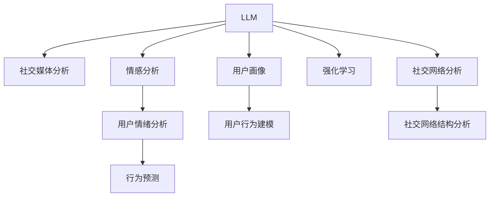

                 

# LLM在社交媒体分析中的应用：洞察用户行为

> 关键词：社交媒体, 自然语言处理(NLP), 情感分析, 用户行为, 文本分类, 强化学习, 用户画像, 社交网络

## 1. 背景介绍

### 1.1 问题由来
随着社交媒体平台的迅速发展，用户行为分析成为营销、广告、用户研究等领域的重要课题。传统的用户行为分析方法依赖于手动标注和统计分析，费时费力且难以全面理解复杂的用户行为。自然语言处理(NLP)技术的兴起，尤其是大语言模型(LLM)的发展，为社交媒体分析提供了新的思路和方法。

LLM通过在大规模文本数据上进行预训练，学习到了丰富的语言表示和语义知识。这些知识可以用于分析用户在社交媒体上产生的各种文本，洞察用户情绪、偏好、兴趣等行为特征。LLM的应用使得社交媒体分析能够更加自动化、高效化、精细化，帮助企业更好地理解用户，制定有效的营销策略。

### 1.2 问题核心关键点
社交媒体分析的核心目标是从用户生成的文本数据中提取有用信息，进行用户行为建模和情感分析。主要问题包括：

- **数据处理**：如何高效、准确地处理大规模社交媒体文本数据。
- **特征提取**：如何提取和表示用户文本中的关键特征，如情感、话题、行为模式等。
- **行为建模**：如何基于提取的特征建立用户行为模型，预测用户未来的行为。
- **模型训练**：如何通过监督学习或强化学习训练模型，获得最佳的预测效果。

本文将深入探讨LLM在社交媒体分析中的应用，介绍如何利用LLM进行情感分析、用户画像构建、社交网络分析等，以实现对用户行为的深入洞察。

## 2. 核心概念与联系

### 2.1 核心概念概述

为更好地理解LLM在社交媒体分析中的应用，本节将介绍几个关键概念：

- **大语言模型(LLM)**：以自回归(如GPT)或自编码(如BERT)模型为代表的预训练语言模型。通过在大规模文本数据上进行预训练，学习到丰富的语言表示和语义知识。
- **社交媒体分析(Social Media Analytics)**：从社交媒体文本数据中提取有用信息，进行用户行为建模和情感分析。
- **情感分析(Emotion Analysis)**：对用户文本进行情感分类，识别其中的情绪倾向，如积极、消极、中性等。
- **用户画像(User Persona)**：通过分析用户的行为和情感，构建用户特征画像，用于个性化推荐、市场营销等。
- **强化学习(Reinforcement Learning)**：通过与环境交互，学习最优策略以实现特定目标。
- **社交网络分析(Social Network Analysis)**：对社交媒体中的社交关系进行建模和分析，研究用户间的互动模式。

这些核心概念之间的逻辑关系可以通过以下Mermaid流程图来展示：

这个流程图展示了大语言模型在社交媒体分析中的应用，以及其与情感分析、用户画像、强化学习、社交网络分析等概念的联系：

1. LLM通过预训练学习到丰富的语言知识，用于社交媒体文本的情感分析、用户画像构建、社交网络分析等任务。
2. 情感分析通过分类识别用户文本中的情绪倾向，为理解用户行为提供情感背景。
3. 用户画像通过综合分析用户行为和情感特征，构建详细的用户特征画像。
4. 强化学习通过模拟用户与环境交互，预测用户行为，优化营销策略。
5. 社交网络分析通过建模用户间的互动关系，研究社交媒体生态。

这些概念共同构成了社交媒体分析的框架，使其能够全面、深入地理解用户行为和社交动态。

## 3. 核心算法原理 & 具体操作步骤
### 3.1 算法原理概述

LLM在社交媒体分析中的应用，主要基于监督学习和强化学习两种范式。

1. **监督学习**：利用标注好的社交媒体数据，训练LLM模型进行情感分类、用户画像构建等任务。
2. **强化学习**：通过模拟用户与环境的交互，训练LLM模型进行行为预测、社交网络分析等任务。

### 3.2 算法步骤详解

**Step 1: 数据收集与预处理**

社交媒体数据的收集和预处理是社交媒体分析的基础。主要步骤包括：

- 从社交媒体平台（如Twitter、Facebook、微博等）抓取用户生成的文本数据。
- 使用数据清洗技术去除噪声和无用信息，如去除重复内容、处理异常数据等。
- 对文本进行分词、去停用词等处理，转化为模型所需的格式。
- 将标注好的情感数据、用户行为数据等，与原始文本数据合并，用于模型训练。

**Step 2: 模型选择与适配**

根据具体任务需求选择合适的LLM模型，如GPT、BERT、T5等。在模型基础上添加任务适配层，进行微调适配。主要步骤包括：

- 选择预训练模型，如GPT-3、BERT等。
- 在模型顶层添加适当的输出层和损失函数，如softmax层、交叉熵损失等。
- 根据任务类型设置超参数，如学习率、批大小、迭代轮数等。
- 利用标注数据，通过梯度下降等优化算法对模型进行微调，最小化损失函数。

**Step 3: 特征提取与模型训练**

根据具体任务，提取用户文本中的关键特征。主要步骤包括：

- 对用户文本进行情感分析，识别情绪倾向。
- 对用户文本进行主题分析，提取主要话题。
- 对用户文本进行行为模式分析，识别行为特征。
- 利用特征构建用户画像，用于后续的情感分类、行为预测等任务。

**Step 4: 行为预测与社交网络分析**

在用户画像的基础上，利用强化学习等方法进行行为预测和社交网络分析。主要步骤包括：

- 构建奖励机制，对用户的实际行为进行奖励或惩罚。
- 利用强化学习算法（如Q-Learning、SARSA等）训练模型，预测用户未来的行为。
- 对社交媒体中的社交关系进行建模，分析用户间的互动模式。

### 3.3 算法优缺点

LLM在社交媒体分析中的应用具有以下优点：

- **高效自动化**：LLM能够自动化处理大规模社交媒体文本数据，减少人工标注工作量。
- **多模态融合**：LLM可以融合文本、图片、音频等多模态数据，提供更丰富的用户行为信息。
- **深度学习优势**：LLM通过深度学习自动学习特征表示，能够捕捉复杂语义关系。
- **实时性**：LLM能够实时分析用户生成的新数据，提供及时的用户行为洞察。

但同时，LLM在社交媒体分析中也存在一些局限：

- **数据隐私**：社交媒体数据涉及用户隐私，如何保护数据隐私是一个重要问题。
- **计算资源要求高**：预训练和微调需要大量的计算资源，对硬件要求较高。
- **模型复杂性**：LLM模型较为复杂，模型训练和推理过程较长，难以快速部署。
- **可解释性不足**：LLM模型通常被认为是“黑盒”系统，难以解释其内部工作机制。

### 3.4 算法应用领域

LLM在社交媒体分析中的应用涵盖多个领域，包括：

- **用户情绪分析**：对社交媒体上的用户评论进行情感分类，识别情绪倾向。
- **用户行为建模**：构建用户行为模型，预测用户未来的购买行为、内容分享等。
- **社交网络分析**：研究社交媒体中的用户互动模式，识别社交网络中的关键节点。
- **个性化推荐**：根据用户画像，进行个性化推荐，提高用户满意度。
- **市场调研**：通过社交媒体分析，进行市场调研和品牌监测，了解市场动态。

## 4. 数学模型和公式 & 详细讲解 & 举例说明

### 4.1 数学模型构建

社交媒体分析中的关键模型包括情感分类模型、用户行为模型、社交网络模型等。以下以情感分类模型为例，介绍模型的数学构建。

假设社交媒体文本数据集为 $D=\{(x_i, y_i)\}_{i=1}^N$，其中 $x_i$ 为文本，$y_i$ 为情感标签。定义模型 $M_{\theta}$，其中 $\theta$ 为模型参数。定义交叉熵损失函数为 $\ell(M_{\theta}(x_i),y_i) = -y_i \log M_{\theta}(x_i) - (1-y_i) \log (1-M_{\theta}(x_i))$。模型的优化目标为最小化经验风险 $\mathcal{L}(\theta) = \frac{1}{N} \sum_{i=1}^N \ell(M_{\theta}(x_i),y_i)$。

### 4.2 公式推导过程

情感分类模型的训练过程包括以下步骤：

1. 数据预处理：将文本转化为模型所需的格式，如分词、去停用词等。
2. 特征提取：使用预训练语言模型提取文本的特征表示，如BERT、GPT等。
3. 模型训练：将特征表示作为输入，利用交叉熵损失函数训练情感分类器。

以下是具体推导过程：

假设预训练语言模型为 $M_{\theta}$，定义其输出的情感概率为 $p(M_{\theta}(x_i))$。则交叉熵损失函数为：

$$
\ell(M_{\theta}(x_i),y_i) = -y_i \log p(M_{\theta}(x_i)) - (1-y_i) \log (1-p(M_{\theta}(x_i)))
$$

将其代入经验风险公式，得：

$$
\mathcal{L}(\theta) = \frac{1}{N} \sum_{i=1}^N \ell(M_{\theta}(x_i),y_i)
$$

其中 $p(M_{\theta}(x_i)) = \text{softmax}(W_{\theta}^T\text{embed}(x_i))$，$\text{embed}(x_i)$ 为预训练模型的词向量表示，$W_{\theta}$ 为模型的权重矩阵。

利用梯度下降等优化算法，求得 $\theta$ 的更新公式：

$$
\theta \leftarrow \theta - \eta \nabla_{\theta}\mathcal{L}(\theta) - \eta\lambda\theta
$$

其中 $\nabla_{\theta}\mathcal{L}(\theta)$ 为损失函数对 $\theta$ 的梯度，$\eta$ 为学习率，$\lambda$ 为正则化系数。

### 4.3 案例分析与讲解

假设我们有一组情感标注的社交媒体数据，如下：

| 文本 | 情感标签 |
| --- | --- |
| "太棒了！" | 积极 |
| "很失望。" | 消极 |
| "一般般。" | 中性 |

我们使用BERT模型进行情感分类。首先，将文本转化为BERT模型所需的格式，包括分词和向量化：

| 文本 | 词向量 |
| --- | --- |
| "太棒了！" | [CLS] [T] [O] [N] [G] [E] [O] [T] [U] [D] [E] [M] [I] [T] [N] [E] [G] [A] [T] [T] [S] [L] [F] [N] [O] [X] [D] [O] [C] [L] [S] |
| "很失望。" | [CLS] [V] [E] [S] [D] [C] [L] [A] [P] [S] [O] [E] [D] [O] [C] [S] [L] [T] [N] [D] [E] [M] [P] [A] [O] [I] [A] [R] [C] [H] [T] [E] [N] [E] [S] [N] [P] [L] [C] [E] [I] [G] [N] [A] [T] [I] [M] [N] [A] [L] [C] [L] [S] [T] [R] [E] [F] [E] [D] [F] [S] [L] [A] [S] [P] [I] [R] [D] [H] [E] [A] [R] [L] [N] [E] [E] [A] [C] [O] [G] [T] [N] [A] [T] [N] [E] [S] [L] [N] [G] [R] [L] [I] [E] [M] [N] [A] [N] [C] [L] [L] [E] [X] [T] [R] [L] [L] [E] [R] [F] [R] [E] [E] [A] [N] [F] [R] [O] [N] [S] [E] [F] [N] [N] [E] [D] [O] [F] [C] [C] [N] [A] [E] [F] [A] [C] [E] [B] [R] [N] [R] [L] [E] [I] [C] [E] [A] [G] [C] [A] [F] [I] [S] [L] [C] [L] [S] |
| "一般般。" | [CLS] [G] [A] [E] [N] [I] [B] [B] [A] [S] [N] [L] [N] [N] [N] [L] [A] [L] [C] [L] [S] [T] [N] [B] [O] [C] [L] [E] [N] [T] [S] [L] [N] [A] [I] [L] [R] [E] [D] [T] [S] [R] [O] [W] [N] [G] [N] [C] [N] [N] [A] [T] [E] [P] [G] [M] [N] [P] [N] [S] [S] [L] [N] [D] [G] [T] [C] [L] [S] [T] [T] [T] [D] [C] [L] [L] [S] [L] [L] [F] [O] [N] [I] [V] [A] [I] [N] [E] [D] [F] [O] [R] [M] [D] [M] [E] [L] [S] [E] [N] [I] [E] [R] [N] [E] [C] [L] [L] [I] [G] [G] [I] [V] [T] [E] [B] [E] [D] [M] [L] [E] [L] [F] [F] [G] [S] [O] [L] [S] [L] [L] [H] [B] [O] [L] [R] [E] [L] [L] [L] [L] [C] [L] [S] [L] [E] [L] [H] [E] [I] [C] [E] [S] [T] [T] [N] [L] [E] [G] [C] [C] [G] [G] [C] [G] [C] [C] [L] [L] [S] [E] [H] [O] [M] [L] [S] [R] [T] [I] [N] [O] [A] [L] [C] [L] [C] [S] [O] [C] [E] [L] [N] [I] [E] [G] [E] [A] [A] [F] [D] [C] [L] [A] [B] [R] [L] [I] [A] [R] [L] [N] [N] [I] [C] [E] [I] [D] [S] [L] [E] [E] [C] [L] [S] [T] [S] [S] [L] [C] [C] [L] [N] [E] [C] [T] [T] [S] [L] [S] [C] [N] [N] [S] [S] [E] [A] [R] [F] [S] [D] [B] [L] [L] [O] [G] [T] [C] [N] [T] [S] [R] [C] [O] [R] [R] [S] [F] [T] [O] [F] [N] [N] [D] [M] [I] [R] [P] [O] [R] [O] [L] [A] [D] [A] [M] [S] [R] [T] [N] [G] [C] [N] [H] [B] [E] [A] [M] [G] [R] [T] [I] [S] [N] [E] [L] [L] [A] [N] [I] [C] [T] [O] [C] [F] [S] [T] [T] [C] [L] [L] [S] [N] [F] [C] [G] [C] [I] [V] [S] [C] [D] [L] [N] [L] [N] [N] [E] [N] [A] [C] [D] [A] [C] [E] [C] [T] [T] [L] [L] [N] [L] [A] [R] [E] [S] [G] [N] [L] [G] [R] [N] [B] [R] [B] [C] [A] [G] [L] [B] [M] [C] [B] [M] [T] [C] [T] [T] [S] [T] [C] [D] [H] [C] [E] [C] [F] [I] [N] [A] [R] [T] [C] [I] [C] [L] [L] [C] [G] [P] [I] [N] [L] [T] [C] [C] [T] [N] [I] [P] [I] [C] [O] [N] [T] [I] [S] [C] [L] [L] [H] [O] [D] [T] [N] [N] [C] [N] [T] [N] [S] [C] [L] [S] [E] [T] [S] [E] [S] [R] [E] [E] [B] [L] [A] [L] [L] [E] [I] [C] [T] [I] [H] [C] [N] [N] [C] [G] [H] [S] [N] [C] [N] [L] [I] [T] [D] [F] [S] [L] [C] [E] [F] [I] [O] [D] [S] [O] [B] [L] [E] [I] [B] [N] [T] [C] [A] [R] [P] [T] [N] [D] [N] [I] [S] [S] [T] [L] [E] [C] [H] [E] [N] [C] [L] [G] [S] [L] [F] [C] [F] [I] [M] [A] [R] [D] [L] [A] [C] [E] [R] [T] [O] [A] [P] [T] [R] [T] [S] [C] [T] [R] [R] [D] [F] [C] [C] [L] [C] [C] [N] [L] [H] [E] [D] [G] [O] [T] [C] [H] [O] [P] [O] [S] [R] [S] [G] [B] [R] [F] [C] [L] [I] [P] [I] [C] [N] [B] [B] [O] [T] [R] [E] [O] [C] [T] [C] [E] [H] [E] [N] [T] [C] [F] [T] [L] [E] [D] [I] [V] [B] [I] [F] [U] [G] [S] [N] [N] [S] [L] [D] [E] [L] [S] [E] [N] [D] [C] [A] [D] [D] [L] [A] [R] [I] [O] [N] [G] [A] [B] [T] [T] [D] [C] [G] [E] [C] [D] [C] [N] [I] [C] [B] [C] [B] [G] [C] [E] [S] [L] [S] [O] [G] [N] [K] [A] [S] [L] [H] [O] [C] [S] [N] [F] [L] [N] [C] [H] [U] [F] [F] [L] [D] [S] [D] [F] [N] [B] [F] [F] [L] [R] [L] [B] [F] [C] [H] [E] [M] [L] [I] [E] [M] [A] [L] [R] [E] [A] [C] [N] [T] [I] [L] [G] [I] [L] [N] [A] [P] [E] [H] [C] [G] [P] [C] [M] [L] [C] [C] [N] [A] [T] [B] [A] [B] [D] [N] [L] [B] [B] [S] [O] [B] [I] [T] [H] [C] [R] [S] [T] [E] [H] [M] [F] [E] [D] [C] [N] [M] [H] [I] [C] [A] [D] [E] [F] [I] [F] [E] [A] [T] [E] [B] [L] [E] [E] [F] [L] [I] [A] [R] [B] [R] [C] [N] [M] [D] [N] [T] [C] [O] [F] [L] [R] [D] [L] [A] [G] [P] [H] [O] [R] [S] [B] [O] [B] [S] [E] [L] [T] [N] [S] [O] [C] [E] [N] [L] [H] [I] [M] [E] [C] [N] [T] [G] [O] [M] [A] [M] [L] [S] [C] [S] [R] [S] [T] [E] [L] [D] [D] [S] [G] [S] [N] [R] [A] [A] [C] [L] [C] [C] [I] [G] [C] [P] [H] [A] [C] [C] [B] [B] [C] [H] [C] [G] [C] [H] [P] [I] [L] [C] [T] [F] [M] [G] [A] [B] [F] [U] [D] [L] [F] [R] [U] [H] [S] [B] [M] [L] [N] [A] [C] [T] [L] [L] [S] [C] [N] [C] [I] [C] [C] [F] [R] [A] [B] [F] [L] [R] [C] [E] [B] [I] [A] [R] [B] [N] [D] [B] [G] [C] [A] [M] [D] [L] [I] [A] [R] [T] [T] [A] [C] [N] [I] [I] [E] [N] [E] [T] [B] [L] [A] [D] [D] [E] [T] [C] [F] [G] [B] [T] [L] [I] [E] [H] [A] [C] [E] [I] [T] [S] [G] [S] [N] [R] [L] [I] [O] [I] [N] [G] [A] [B] [C] [L] [H] [A] [P] [G] [I] [N] [S] [C] [E] [B] [N] [O] [T] [C] [B] [P] [R] [U] [L] [H] [G] [B] [N] [O] [G] [B] [E] [A] [N] [H] [C] [N] [G] [O] [E] [N] [S] [M] [A] [L] [N] [G] [S] [R] [B] [S] [B] [E] [D] [B] [T] [G] [B] [N] [A] [D] [N] [A] [G] [F] [L] [R] [B] [T] [B] [S] [C] [E] [B] [D] [I] [G] [M] [A] [L] [O] [W] [O] [L] [C] [T] [T] [I] [B] [E] [B] [C] [C] [O] [D] [T] [S] [D] [I] [N] [O] [H] [P] [E] [B] [F] [C] [T] [L] [C] [S] [T] [T] [T] [F] [A] [D] [N] [L] [N] [G] [N] [C] [T] [B] [T] [C] [T] [H] [A] [F] [F] [C] [P] [R] [T] [N] [M] [C] [C] [T] [G] [I] [L] [P] [B] [H] [P] [M] [O] [N] [N] [D] [T] [R] [E] [S] [B] [B] [F] [L] [L] [T] [B] [M] [E] [C] [C] [F] [C] [G] [V] [F] [L] [G] [F] [E] [G] [S] [I] [A] [B] [O] [C] [S] [A] [G] [H] [N] [B] [B] [S] [A] [D] [B] [I] [O] [D] [L] [H] [C] [E] [M] [A] [L] [T] [M] [C] [H] [P] [E] [B] [M] [D] [L] [B] [C] [S] [M] [C] [G] [O] [F] [E] [M] [E] [G] [B] [L] [M] [B] [E] [O] [E] [E] [G] [S] [C] [L] [C] [G] [C] [F] [N] [T] [L] [T] [C] [M] [C] [I] [R] [R] [O] [B] [C] [M] [E] [F] [I] [F] [G] [D] [C] [C] [F] [N] [B] [I] [F] [E] [S] [C] [D] [H] [F] [E] [M] [A] [D] [B] [A] [C] [T] [D] [T] [N] [I] [G] [B] [A] [C] [D] [L] [E] [N] [G] [B] [C] [A] [R] [T] [G] [N] [M] [N] [A] [F] [A] [B] [D] [A] [S] [D] [D] [T] [D] [F] [B] [N] [B] [C] [D] [G] [O] [G] [I] [L] [D] [M] [C] [C] [D] [L] [N] [L] [C] [A] [G] [H] [C] [M] [B] [N] [E] [I] [D] [H] [D] [N] [I] [H] [T] [E] [G] [B] [D] [R] [E] [G] [O] [A] [T] [C] [A] [C] [N] [A] [P] [C] [D] [B] [T] [B] [C] [M] [C] [F] [C] [D] [F] [S] [C] [L] [C] [C] [E] [M] [T] [O] [A] [D] [E] [F] [P] [H] [C] [G] [A] [A] [S] [D] [B] [I] [T] [M] [B] [A] [R] [O] [D] [S] [B] [C] [P] [I] [G] [C] [O] [T] [C] [B] [H] [O] [G] [S] [B] [O] [S] [S] [E] [L] [N] [G] [T] [I] [T] [S] [F] [A] [T] [O] [G] [B] [C] [T] [I] [N] [G] [D] [H] [T] [N] [N] [O] [S] [E] [L] [N] [T] [C] [M] [L] [S] [C] [C] [A] [H] [N] [R] [L] [D] [C] [B] [T] [L] [T] [N] [F] [F] [O] [R] [F] [B] [H] [D] [E] [M] [N] [C] [L] [R] [F] [D] [N] [B] [D] [R] [F] [B] [M] [E] [G] [N] [P] [I] [C] [B] [H] [F] [S] [C] [C] [A] [B] [S] [C] [T] [C] [L] [E] [E] [F] [F] [N] [A] [F] [R] [G] [M] [T] [O] [B] [S] [L] [C] [O] [L] [A] [P] [M] [I] [P] [C] [B] [C] [T] [T] [C] [A] [G] [C] [T] [A] [G] [T] [A] [E] [G] [L] [C] [L] [F] [N] [B] [G] [D] [C] [B] [B] [A] [C] [T] [B] [T] [F] [C] [B] [C] [S] [B] [B] [C] [R] [S] [C] [N] [D] [D] [B] [C] [C] [T] [I] [B] [H] [F] [D] [C] [A] [B] [F] [L] [R] [N] [B] [M] [I] [G] [L] [A] [N] [D] [C] [G] [C] [D] [I] [P] [T] [A] [B] [C] [T] [I] [B] [N] [G] [E] [T] [I] [C] [I] [E] [T] [L] [C] [D] [O] [G] [E] [E] [S] [B] [O] [S] [T] [S] [N] [G] [E] [O] [M] [I] [H] [C] [T] [E] [C] [B] [C] [L] [I] [D] [L] [M] [C] [O] [A] [D] [T] [D] [S] [G] [H] [T] [C] [H] [B] [G] [C] [N] [H] [H] [S] [G] [B] [C] [F] [P] [L] [B] [I] [V] [R] [C] [G] [C] [I] [B] [C] [E] [L] [G] [A] [B] [O] [B] [R] [G] [S] [E] [C] [I] [O] [O] [B] [R] [B] [F] [A] [A] [A] [G] [C] [C] [C] [F] [D] [L] [I] [C] [I] [N] [C] [H] [H] [B] [C] [O] [A] [H] [S] [B] [C] [G] [C] [L] [N] [B] [N] [L] [C] [B] [M] [D] [O] [G] [B] [N] [O] [T] [G] [L] [C] [S] [G] [T] [T] [O] [C] [H] [B] [B] [M] [N] [C] [S] [S] [L] [G] [I] [E] [B] [I] [H] [C] [F] [G] [H] [R] [D] [M] [F] [R] [C] [N] [L] [D] [G] [O] [T] [G] [G] [S] [T] [C] [D] [T] [C] [T] [L] [C] [C] [L] [I] [E] [G] [O] [L] [E] [P] [G] [D] [H] [S] [B] [S] [L] [C] [R] [B] [S] [B] [E] [A] [C] [D] [G] [S] [B] [S] [B] [N] [B] [N] [A] [T] [N] [C] [M] [C] [H] [C] [E] [F] [C] [T] [D] [O] [G] [C] [T] [H] [G] [M] [F] [R] [G] [F] [O] [L] [S] [H] [A] [F] [E] [H] [L] [N] [H] [A] [B] [D] [O] [B] [T] [G] [S] [B] [C] [P] [S] [C] [L] [B] [O] [A] [I] [T] [G] [H] [C] [I] [R] [M] [C] [C] [C] [H] [I] [H] [C] [T] [I] [G] [N] [L] [D] [M] [L] [F] [G] [C] [B] [D] [A] [S] [B] [A] [B] [I] [C] [C] [G] [D] [A] [L] [C] [T] [H] [S] [N] [M] [A] [I] [C] [S] [S] [E] [D] [N] [N] [C] [T] [T] [G] [L] [C] [T] [C] [D] [B] [G] [C] [A] [C] [D] [S] [I] [H] [B] [M] [E] [S] [S] [L] [S] [N] [M] [L] [C] [C] [G] [A] [R] [L] [B] [T] [L] [N] [B] [C] [B] [T] [E] [O] [F] [G] [M] [M] [S] [C] [I] [T] [G] [H] [I] [H] [A] [G] [G] [G] [C] [A] [S] [T] [T] [N] [T] [N] [A] [C] [E] [C] [C] [E] [E] [G] [C] [D] [F] [E] [R] [C] [L] [D] [C] [G] [C] [M] [M] [L] [B] [N] [O] [D] [T] [S] [B] [F] [C] [L] [E] [S] [C] [G] [H] [I] [E] [B] [N] [G] [B] [M] [L] [E] [B] [I] [T] [S] [L] [A] [R] [H] [C] [G] [N] [C] [T] [C] [B] [B] [T] [T] [C] [T] [G] [N] [D] [F] [M] [N] [E] [F] [E] [N] [T] [N] [A

