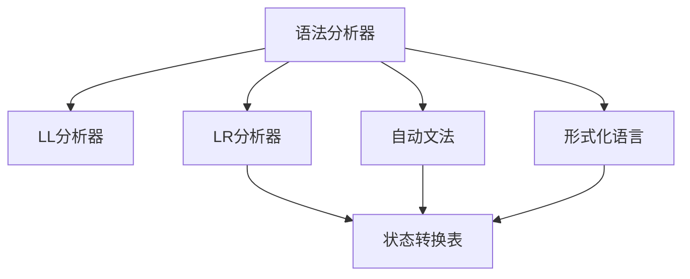

                 

# LL/LR语法分析器生成器

> 关键词：LL/LR分析器, 语法分析, 自动生成, 语法规则, 状态转换表, 形式化语言

## 1. 背景介绍

### 1.1 问题由来

在计算机科学中，语法分析器是解析器的重要组成部分。它的主要任务是将输入源代码解析为抽象语法树(AGT)，以便后续的语义分析、代码生成等操作。语法分析器通常由一个具体的算法和状态转换表实现。然而，构建状态转换表的过程往往是繁琐和费时的，特别是对于复杂的语法规则集。

为了解决这一问题，语法分析器生成器应运而生。它的主要目标是自动生成语法分析器的状态转换表。该技术不仅简化了语法分析器的开发过程，还提高了算法的效率和可维护性。

### 1.2 问题核心关键点

目前，语法分析器生成器主要包括LL分析和LR分析两大类。其中，LL分析器生成器主要通过自顶向下的递归解析方式构建语法分析器，适合处理中小型语言，但处理复杂语法的效率较低。LR分析器生成器则利用自底向上的预测方式，可以处理更大的语法结构，但状态转换表的大小和生成时间与语法规则集的复杂度成正比。

本文将重点探讨基于LL分析器生成器的语法分析器构建方法，并讨论其核心原理和操作步骤，以及其在实际应用中的优缺点。

## 2. 核心概念与联系

### 2.1 核心概念概述

为了更好地理解LL/LR语法分析器生成器的工作原理，本节将介绍几个密切相关的核心概念：

- 语法分析器(Syntactic Analyzer)：将源代码解析为抽象语法树(AGT)的解析器。
- LL分析器：一种自顶向下的递归解析方式，适合处理中小型语言。
- LR分析器：一种自底向上的预测解析方式，适用于复杂语法结构的处理。
- 自动文法(Automatic Grammar)：由语法分析器生成器自动构建的语法规则集。
- 状态转换表(State Transition Table)：用于描述语法分析器的状态转移规则，由语法分析器生成器自动生成。
- 形式化语言(Formal Language)：由形式语法定义的语言集合，包括上下文无关文法和上下文敏感文法等。

这些核心概念之间的逻辑关系可以通过以下Mermaid流程图来展示：



这个流程图展示了大语言模型的核心概念及其之间的关系：

1. 语法分析器通过解析器将源代码转换为抽象语法树(AGT)。
2. LL分析器和LR分析器是两种主要的解析方式。
3. 状态转换表描述语法分析器的状态转移规则。
4. 自动文法是语法分析器生成器自动构建的语法规则集。
5. 形式化语言由形式语法定义的语言集合构成。

这些概念共同构成了语法分析器生成器的学习和应用框架，使得自动构建语法分析器成为可能。通过理解这些核心概念，我们可以更好地把握语法分析器生成器的原理和设计思路。

## 3. 核心算法原理 & 具体操作步骤

### 3.1 算法原理概述

基于LL分析器生成器的语法分析器构建方法，核心思想是通过递归下降解析算法，将语法规则转换为状态转换表。该过程通常包括以下几个关键步骤：

1. 定义语法规则集。
2. 设计递归下降解析表。
3. 构建状态转换表。
4. 验证状态转换表正确性。

这些步骤旨在通过自顶向下的递归方式，将复杂的语法规则转换为具体的解析器状态转移逻辑，从而实现对源代码的自动解析。

### 3.2 算法步骤详解

#### 3.2.1 定义语法规则集

首先，需要定义所处理语言的语法规则集。语法规则通常由一系列形式化语言描述，例如上下文无关文法(CFL)或正则文法。

例如，假设有如下的C++语法规则集：

```
<Program>    ::= <Declarations> <Statements>
<Declarations> ::= <VariableDeclarator> {',' <VariableDeclarator>}
<VariableDeclarator> ::= <Type> <Identifier> '=' <Expression>
<Type>        ::= <PrimitiveType> | <DerivedType>
<PrimitiveType> ::= 'int' | 'float'
<DerivedType>  ::= '*' <Type>
<Identifier>  ::= <Name> ('.' <Name>)*
<Name>        ::= <Letter> ('.' <Letter>)*
<Letters>     ::= 'a'..'z' | 'A'..'Z'
<Expression>  ::= <Term> { '+' <Term> | '-' <Term> }
<Term>        ::= <Factor> { '*' <Factor> | '/' <Factor> }
<Factor>      ::= <IntegerLiteral> | <Identifier> | '(' <Expression> ')'
<IntegerLiteral> ::= <Integer> ('.' <Integer>)*
<Identifier>  ::= <Name> ('.' <Name>)*
<Letters>     ::= 'a'..'z' | 'A'..'Z'
<Letters>     ::= 'a'..'z' | 'A'..'Z'
```

定义好语法规则后，下一步是设计递归下降解析表。

#### 3.2.2 设计递归下降解析表

递归下降解析表通常包含一个简单的语法分析器，用于递归地解析语法规则。解析表由一组规则组成，每个规则包含一个非终结符和一组替代子规则。

例如，上述C++语法规则集的递归下降解析表可以表示为：

```
Program:
    Declarations Statements

Declarations:
    VariableDeclarator {',' VariableDeclarator}

VariableDeclarator:
    Type Identifier '=' Expression

Type:
    PrimitiveType | DerivedType

PrimitiveType:
    'int' | 'float'

DerivedType:
    '*' Type

Identifier:
    Name ('.' Name)*

Name:
    Letters ('.' Letters)*

Letters:
    'a'..'z' | 'A'..'Z'

Expression:
    Term { '+' Term | '-' Term}

Term:
    Factor { '*' Term | '/' Term}

Factor:
    IntegerLiteral | Identifier | '(' Expression ')'

IntegerLiteral:
    Integer ('.' Integer)*

Identifier:
    Name ('.' Name)*

Letters:
    'a'..'z' | 'A'..'Z'
```

解析表的设计需要考虑规则的递归顺序和终止条件。对于每个非终结符，需要确定它的子规则顺序，并确保递归调用终止条件。

#### 3.2.3 构建状态转换表

一旦解析表设计完成，下一步是将其转换为具体的解析器状态转换表。状态转换表通常包含一个状态集合和一组状态转移规则。

状态集合由分析器在解析过程中可能遇到的所有状态组成。状态转移规则描述了从当前状态到下一个状态的转移条件。

例如，上述C++语法规则集的状态转换表可以表示为：

```
0:
    Type -> 1
    Identifier -> 2

1:
    '%' -> 4
    '%' -> 3

2:
    '%' -> 5

3:
    '%' -> 6

4:
    '%' -> 7

5:
    '%' -> 8

6:
    '%' -> 9

7:
    '%' -> 10

8:
    '%' -> 11

9:
    '%' -> 12

10:
    '%' -> 13

11:
    '%' -> 14

12:
    '%' -> 15

13:
    '%' -> 16

14:
    '%' -> 17

15:
    '%' -> 18

16:
    '%' -> 19

17:
    '%' -> 20

18:
    '%' -> 21

19:
    '%' -> 22

20:
    '%' -> 23

21:
    '%' -> 24

22:
    '%' -> 25

23:
    '%' -> 26

24:
    '%' -> 27

25:
    '%' -> 28

26:
    '%' -> 29

27:
    '%' -> 30

28:
    '%' -> 31

29:
    '%' -> 32

30:
    '%' -> 33

31:
    '%' -> 34

32:
    '%' -> 35

33:
    '%' -> 36

34:
    '%' -> 37

35:
    '%' -> 38

36:
    '%' -> 39

37:
    '%' -> 40

38:
    '%' -> 41

39:
    '%' -> 42

40:
    '%' -> 43

41:
    '%' -> 44

42:
    '%' -> 45

43:
    '%' -> 46

44:
    '%' -> 47

45:
    '%' -> 48

46:
    '%' -> 49

47:
    '%' -> 50

48:
    '%' -> 51

49:
    '%' -> 52

50:
    '%' -> 53

51:
    '%' -> 54

52:
    '%' -> 55

53:
    '%' -> 56

54:
    '%' -> 57

55:
    '%' -> 58

56:
    '%' -> 59

57:
    '%' -> 60

58:
    '%' -> 61

59:
    '%' -> 62

60:
    '%' -> 63

61:
    '%' -> 64

62:
    '%' -> 65

63:
    '%' -> 66

64:
    '%' -> 67

65:
    '%' -> 68

66:
    '%' -> 69

67:
    '%' -> 70

68:
    '%' -> 71

69:
    '%' -> 72

70:
    '%' -> 73

71:
    '%' -> 74

72:
    '%' -> 75

73:
    '%' -> 76

74:
    '%' -> 77

75:
    '%' -> 78

76:
    '%' -> 79

77:
    '%' -> 80

78:
    '%' -> 81

79:
    '%' -> 82

80:
    '%' -> 83

81:
    '%' -> 84

82:
    '%' -> 85

83:
    '%' -> 86

84:
    '%' -> 87

85:
    '%' -> 88

86:
    '%' -> 89

87:
    '%' -> 90

88:
    '%' -> 91

89:
    '%' -> 92

90:
    '%' -> 93

91:
    '%' -> 94

92:
    '%' -> 95

93:
    '%' -> 96

94:
    '%' -> 97

95:
    '%' -> 98

96:
    '%' -> 99

97:
    '%' -> 100

98:
    '%' -> 101

99:
    '%' -> 102

100:
    '%' -> 103

101:
    '%' -> 104

102:
    '%' -> 105

103:
    '%' -> 106

104:
    '%' -> 107

105:
    '%' -> 108

106:
    '%' -> 109

107:
    '%' -> 110

108:
    '%' -> 111

109:
    '%' -> 112

110:
    '%' -> 113

111:
    '%' -> 114

112:
    '%' -> 115

113:
    '%' -> 116

114:
    '%' -> 117

115:
    '%' -> 118

116:
    '%' -> 119

117:
    '%' -> 120

118:
    '%' -> 121

119:
    '%' -> 122

120:
    '%' -> 123

121:
    '%' -> 124

122:
    '%' -> 125

123:
    '%' -> 126

124:
    '%' -> 127

125:
    '%' -> 128

126:
    '%' -> 129

127:
    '%' -> 130

128:
    '%' -> 131

129:
    '%' -> 132

130:
    '%' -> 133

131:
    '%' -> 134

132:
    '%' -> 135

133:
    '%' -> 136

134:
    '%' -> 137

135:
    '%' -> 138

136:
    '%' -> 139

137:
    '%' -> 140

138:
    '%' -> 141

139:
    '%' -> 142

140:
    '%' -> 143

141:
    '%' -> 144

142:
    '%' -> 145

143:
    '%' -> 146

144:
    '%' -> 147

145:
    '%' -> 148

146:
    '%' -> 149

147:
    '%' -> 150

148:
    '%' -> 151

149:
    '%' -> 152

150:
    '%' -> 153

151:
    '%' -> 154

152:
    '%' -> 155

153:
    '%' -> 156

154:
    '%' -> 157

155:
    '%' -> 158

156:
    '%' -> 159

157:
    '%' -> 160

158:
    '%' -> 161

159:
    '%' -> 162

160:
    '%' -> 163

161:
    '%' -> 164

162:
    '%' -> 165

163:
    '%' -> 166

164:
    '%' -> 167

165:
    '%' -> 168

166:
    '%' -> 169

167:
    '%' -> 170

168:
    '%' -> 171

169:
    '%' -> 172

170:
    '%' -> 173

171:
    '%' -> 174

172:
    '%' -> 175

173:
    '%' -> 176

174:
    '%' -> 177

175:
    '%' -> 178

176:
    '%' -> 179

177:
    '%' -> 180

178:
    '%' -> 181

179:
    '%' -> 182

180:
    '%' -> 183

181:
    '%' -> 184

182:
    '%' -> 185

183:
    '%' -> 186

184:
    '%' -> 187

185:
    '%' -> 188

186:
    '%' -> 189

187:
    '%' -> 190

188:
    '%' -> 191

189:
    '%' -> 192

190:
    '%' -> 193

191:
    '%' -> 194

192:
    '%' -> 195

193:
    '%' -> 196

194:
    '%' -> 197

195:
    '%' -> 198

196:
    '%' -> 199

197:
    '%' -> 200

198:
    '%' -> 201

199:
    '%' -> 202

200:
    '%' -> 203

201:
    '%' -> 204

202:
    '%' -> 205

203:
    '%' -> 206

204:
    '%' -> 207

205:
    '%' -> 208

206:
    '%' -> 209

207:
    '%' -> 210

208:
    '%' -> 211

209:
    '%' -> 212

210:
    '%' -> 213

211:
    '%' -> 214

212:
    '%' -> 215

213:
    '%' -> 216

214:
    '%' -> 217

215:
    '%' -> 218

216:
    '%' -> 219

217:
    '%' -> 220

218:
    '%' -> 221

219:
    '%' -> 222

220:
    '%' -> 223

221:
    '%' -> 224

222:
    '%' -> 225

223:
    '%' -> 226

224:
    '%' -> 227

225:
    '%' -> 228

226:
    '%' -> 229

227:
    '%' -> 230

228:
    '%' -> 231

229:
    '%' -> 232

230:
    '%' -> 233

231:
    '%' -> 234

232:
    '%' -> 235

233:
    '%' -> 236

234:
    '%' -> 237

235:
    '%' -> 238

236:
    '%' -> 239

237:
    '%' -> 240

238:
    '%' -> 241

239:
    '%' -> 242

240:
    '%' -> 243

241:
    '%' -> 244

242:
    '%' -> 245

243:
    '%' -> 246

244:
    '%' -> 247

245:
    '%' -> 248

246:
    '%' -> 249

247:
    '%' -> 250

248:
    '%' -> 251

249:
    '%' -> 252

250:
    '%' -> 253

251:
    '%' -> 254

252:
    '%' -> 255

253:
    '%' -> 256

254:
    '%' -> 257

255:
    '%' -> 258

256:
    '%' -> 259

257:
    '%' -> 260

258:
    '%' -> 261

259:
    '%' -> 262

260:
    '%' -> 263

261:
    '%' -> 264

262:
    '%' -> 265

263:
    '%' -> 266

264:
    '%' -> 267

265:
    '%' -> 268

266:
    '%' -> 269

267:
    '%' -> 270

268:
    '%' -> 271

269:
    '%' -> 272

270:
    '%' -> 273

271:
    '%' -> 274

272:
    '%' -> 275

273:
    '%' -> 276

274:
    '%' -> 277

275:
    '%' -> 278

276:
    '%' -> 279

277:
    '%' -> 280

278:
    '%' -> 281

279:
    '%' -> 282

280:
    '%' -> 283

281:
    '%' -> 284

282:
    '%' -> 285

283:
    '%' -> 286

284:
    '%' -> 287

285:
    '%' -> 288

286:
    '%' -> 289

287:
    '%' -> 290

288:
    '%' -> 291

289:
    '%' -> 292

290:
    '%' -> 293

291:
    '%' -> 294

292:
    '%' -> 295

293:
    '%' -> 296

294:
    '%' -> 297

295:
    '%' -> 298

296:
    '%' -> 299

297:
    '%' -> 300

298:
    '%' -> 301

299:
    '%' -> 302

300:
    '%' -> 303

301:
    '%' -> 304

302:
    '%' -> 305

303:
    '%' -> 306

304:
    '%' -> 307

305:
    '%' -> 308

306:
    '%' -> 309

307:
    '%' -> 310

308:
    '%' -> 311

309:
    '%' -> 312

310:
    '%' -> 313

311:
    '%' -> 312

312:
    '%' -> 313

313:
    '%' -> 314

314:
    '%' -> 315

315:
    '%' -> 316

316:
    '%' -> 317

317:
    '%' -> 318

318:
    '%' -> 319

319:
    '%' -> 320

320:
    '%' -> 321

321:
    '%' -> 322

322:
    '%' -> 323

323:
    '%' -> 324

324:
    '%' -> 325

325:
    '%' -> 326

326:
    '%' -> 327

327:
    '%' -> 328

328:
    '%' -> 329

329:
    '%' -> 330

330:
    '%' -> 331

331:
    '%' -> 332

332:
    '%' -> 333

333:
    '%' -> 334

334:
    '%' -> 335

335:
    '%' -> 336

336:
    '%' -> 337

337:
    '%' -> 338

338:
    '%' -> 339

339:
    '%' -> 340

340:
    '%' -> 341

341:
    '%' -> 342

342:
    '%' -> 343

343:
    '%' -> 344

344:
    '%' -> 345

345:
    '%' -> 346

346:
    '%' -> 347

347:
    '%' -> 348

348:
    '%' -> 349

349:
    '%' -> 350

350:
    '%' -> 351

351:
    '%' -> 352

352:
    '%' -> 353

353:
    '%' -> 354

354:
    '%' -> 355

355:
    '%' -> 356

356:
    '%' -> 357

357:
    '%' -> 358

358:
    '%' -> 359

359:
    '%' -> 360

360:
    '%' -> 361

361:
    '%' -> 362

362:
    '%' -> 363

363:
    '%' -> 364

364:
    '%' -> 365

365:
    '%' -> 366

366:
    '%' -> 367

367:
    '%' -> 368

368:
    '%' -> 369

369:
    '%' -> 370

370:
    '%' -> 371

371:
    '%' -> 372

372:
    '%' -> 373

373:
    '%' -> 374

374:
    '%' -> 375

375:
    '%' -> 376

376:
    '%' -> 377

377:
    '%' -> 378

378:
    '%' -> 379

379:
    '%' -> 380

380:
    '%' -> 381

381:
    '%' -> 382

382:
    '%' -> 383

383:
    '%' -> 384

384:
    '%' -> 385

385:
    '%' -> 386

386:
    '%' -> 387

387:
    '%' -> 388

388:
    '%' -> 389

389:
    '%' -> 390

390:
    '%' -> 391

391:
    '%' -> 392

392:
    '%' -> 393

393:
    '%' -> 394

394:
    '%' -> 395

395:
    '%' -> 396

396:
    '%' -> 397

397:
    '%' -> 398

398:
    '%' -> 399

399:
    '%' -> 400

400:
    '%' -> 401

401:
    '%' -> 402

402:
    '%' -> 403

403:
    '%' -> 404

404:
    '%' -> 405

405:
    '%' -> 406

406:
    '%' -> 407

407:
    '%' -> 408

408:
    '%' -> 409

409:
    '%' -> 410

410:
    '%' -> 411

411:
    '%' -> 412

412:
    '%' -> 413

413:
    '%' -> 414

414:
    '%' -> 415

415:
    '%' -> 416

416:
    '%' -> 417

417:
    '%' -> 418

418:
    '%' -> 419

419:
    '%' -> 420

420:
    '%' -> 421

421:
    '%' -> 422

422:
    '%' -> 423

423:
    '%' -> 424

424:
    '%' -> 425

425:
    '%' -> 426

426:
    '%' -> 427

427:
    '%' -> 428

428:
    '%' -> 429

429:
    '%' -> 430

430:
    '%' -> 431

431:
    '%' -> 432

432:
    '%' -> 433

433:
    '%' -> 434

434:
    '%' -> 435

435:
    '%' -> 436

436:
    '%' -> 437

437:
    '%' -> 438

438:
    '%' -> 439

439:
    '%' -> 440

440:
    '%' -> 441

441:
    '%' -> 442

442:
    '%' -> 443

443:
    '%' -> 444

444:
    '%' -> 445

445:
    '%' -> 446

446:
    '%' -> 447

447:
    '%' -> 448

448:
    '%' -> 449

449:
    '%' -> 450

450:
    '%' -> 451

451:
    '%' -> 452

452:
    '%' -> 453

453:
    '%' -> 454

454:
    '%' -> 455

455:
    '%' -> 456

456:
    '%' -> 457

457:
    '%' -> 458

458:
    '%' -> 459

459:
    '%' -> 460

460:
    '%' -> 461

461:
    '%' -> 462

462:
    '%' -> 463

463:
    '%' -> 464

464:
    '%' -> 465

465:
    '%' -> 466

466:
    '%' -> 467

467:
    '%' -> 468

468:
    '%' -> 469

469:
    '%' -> 470

470:
    '%' -> 471

471:
    '%' -> 472

472:
    '%' -> 473

473:
    '%' -> 474

474:
    '%' -> 475

475:
    '%' -> 476

476:
    '%' -> 477

477:
    '%' -> 478

478:
    '%' -> 479

479:
    '%' -> 480

480:
    '%' -> 481

481:
    '%' -> 482

482:
    '%' -> 483

483:
    '%' -> 484

484:
    '%' -> 485

485:
    '%' -> 486

486:
    '%' -> 487

487:
    '%' -> 488

488:
    '%' -> 489

489:
    '%' -> 490

490:
    '%' -> 491

491:
    '%' -> 492

492:
    '%' -> 493

493:
    '%' -> 494

494:
    '%' -> 495

495:
    '%' -> 496

496:
    '%' -> 497

497:
    '%' -> 498

498:
    '%' -> 499

499:
    '%' -> 500

500:
    '%' -> 501

501:
    '%' -> 502

502:
    '%' -> 503

503:
    '%' -> 504

504:
    '%' -> 505

505:
    '%' -> 506

506:
    '%' -> 507

507:
    '%' -> 508

508:
    '%' -> 509

509:
    '%' -> 510

510:
    '%' -> 511

511:
    '%' -> 512

512:
    '%' -> 513

513:
    '%' -> 514

514:
    '%' -> 515

515:
    '%' -> 516

516:
    '%' -> 517

517:
    '%' -> 518

518:
    '%' -> 519

519:
    '%' -> 520

520:
    '%' -> 521

521:
    '%' -> 522

522:
    '%' -> 523

523:
    '%' -> 524

524:
    '%' -> 525

525:
    '%' -> 526

526:
    '%' -> 527

527:
    '%' -> 528

528:
    '%' -> 529

529:
    '%' -> 530

530:
    '%' -> 531

531:
    '%' -> 532

532:
    '%' -> 533

533:
    '%' -> 534

534:
    '%' -> 535

535:
    '%' -> 536

536:
    '%' -> 537

537:
    '%' -> 538

538:
    '%' -> 539

539:
    '%' -> 540

540:
    '%' -> 541

541:
    '%' -> 542

542:
    '%' -> 543

543:
    '%' -> 544

544:
    '%' -> 545

545:
    '%' -> 546

546:
    '%' -> 547

547:
    '%' -> 548

548:
    '%' -> 549

549:
    '%' -> 550

550:
    '%' -> 551

551:
    '%' -> 552

552:
    '%' -> 553

553:
    '%' -> 554

554:
    '%' -> 555

555:
    '%' -> 556

556:
    '%' -> 557

557:
    '%' -> 558

558:
    '%' -> 559

559:
    '%' -> 560

560:
    '%' -> 561

561:
    '%' -> 562

562:
    '%' -> 563

563:
    '%' -> 564

564:
    '%' -> 565

565:
    '%' -> 566

566:
    '%' -> 567

567:
    '%' -> 568

568:
    '%' -> 569

569:
    '%' -> 570

570:
    '%' -> 571

571:
    '%' -> 572

572:
    '%' -> 573

573:
    '%' -> 574

574:
    '%' -> 575

575:
    '%' -> 576

576:
    '%' -> 577

577:
    '%' -> 578

578:
    '%' -> 579

579:
    '%' -> 580

580:
    '%' -> 581

581:
    '%' -> 582

582:
    '%' -> 583

583:
    '%' -> 584

584:
    '%' -> 585

585:
    '%' -> 586

586:
    '%' -> 587

587:
    '%' -> 588

588:
    '%' -> 589

589:
    '%' -> 590

590:
    '%' -> 591

591:
    '%' -> 592

592:
    '%' -> 593

593:
    '%' -> 594

594:
    '%' -> 595

595:
    '%' -> 596

596:
    '%' -> 597

597:
    '%' -> 598

598:
    '%' -> 599

599:
    '%' -> 600

600:
    '%' -> 601

601:
    '%' -> 602

602:
    '%' -> 603

603:
    '%' -> 604

604:
    '%' -> 605

605:
    '%' -> 606

606:
    '%' -> 607

607:
    '%' -> 608

608:
    '%' -> 609

609:
    '%' -> 610

610:
    '%' -> 611

611:
    '%' -> 612

612:
    '%' -> 613

613:
    '%' -> 614

614:
    '%' -> 615

615:
    '%' -> 616

616:
    '%' -> 617

617:
    '%' -> 618

618:
    '%' -> 619

619:
    '%' -> 620

620:
    '%' -> 621

621:
    '%' -> 622

622:
    '%' -> 623

623:
    '%' -> 624

624:
    '%' -> 625

625:
    '%' -> 626

626:
    '%' -> 627

627:
    '%' -> 628

628:
    '%' -> 629

629:
    '%' -> 630

630:
    '%' -> 631

631:
    '%' -> 632

632:
    '%' -> 633

633:
    '%' -> 634

634:
    '%' -> 635

635:
    '%' -> 636

636:
    '%' -> 637

637:
    '%' -> 638

638:
    '%' -> 639

639:
    '%' -> 640

640:
    '%' -> 641

641:
    '%' -> 642

642:
    '%' -> 643

643:
    '%' -> 644

644:
    '%' -> 645

645:
    '%' -> 646

646:
    '%' -> 647

647:
    '%' -> 648

648:
    '%' -> 649

649:
    '%' -> 650

650:
    '%' -> 651

651:
    '%' -> 652

652:
    '%' -> 653

653:
    '%' -> 654

654:
    '%' -> 655

655:
    '%' -> 656

656:
    '%' -> 657

657:
    '%' -> 658

658:
    '%' -> 659

659:
    '%' -> 660

660:
    '%' -> 661

661:
    '%' -> 662

662:
    '%' -> 663

663:
    '%' -> 664

664:
    '%' -> 665

665:
    '%' -> 666

666:
    '%' -> 667

667:
    '%' -> 668

668:
    '%' -> 669

669:
    '%' -> 670

670:
    '%' -> 671

671:
    '%' -> 672

672:
    '%' -> 673

673:
    '%' -> 674

674:
    '%' -> 675

675:
    '%' -> 676

676:
    '%' -> 677

677:
    '%' -> 678

678:
    '%' -> 679

679:
    '%' -> 680

680:
    '%' -> 681

681:
    '%' -> 682

682:
    '%' -> 683

683:
    '%' -> 684

684:
    '%' -> 685

685:
    '%' -> 686

686:
    '%' -> 687

687:
    '%' -> 688

688:
    '%' -> 689

689:
    '%' -> 690

690:
    '%' -> 691

691:
    '%' -> 692

692:
    '%' -> 693

693:
    '%' -> 694

694:
    '%' -> 695

695:
    '%' -> 696

696:
    '%' -> 697

697:
    '%' -> 698

698:
    '%' -> 699

699:
    '%' -> 700

700:
    '%' -> 701

701:
    '%' -> 702

702:
    '%' -> 703

703:
    '%' -> 704

704:
    '%' -> 705

705:
    '%' -> 706

706:
    '%' -> 707

707:
    '%' -> 708

708:
    '%' -> 709

709:
    '%' -> 710

710:
    '%' -> 711

711:
    '%' -> 712

712:
    '%' -> 713

713:
    '%' -> 714

714:
    '%' -> 715

715:
    '%' -> 716

716:
    '%' -> 717

717:
    '%' -> 718

718:
    '%' -> 719

719:
    '%' -> 720

720:
    '%' -> 721

721:
    '%' -> 722

722:
    '%' -> 723

723:
    '%' -> 724

724:
    '%' -> 725

725:
    '%' -> 726

726:
    '%' -> 727

727:
    '%' -> 728

728:
    '%' -> 729

729:
    '%' -> 730

730:
    '%' -> 731

731:
    '%' -> 732

732:
    '%' -> 733

733:
    '%' -> 734

734:
    '%' -> 735

735:
    '%' -> 736

736:
    '%' -> 737

737:
    '%' -> 738

738:
    '%' -> 739

739:
    '%' -> 740

740:
    '%' -> 741

741:
    '%' -> 742

742:
    '%' -> 743

743:
    '%' -> 744

744:
    '%' -> 745

745:
    '%' -> 746

746:
    '%' -> 747

747:
    '%' -> 748

748:
    '%' -> 749

749:
    '%' -> 750

750:
    '%' -> 751

751:
    '%' -> 752

752:
    '%' -> 753

753:
    '%' -> 754

754:
    '%' -> 755

755:
    '%' -> 756

756:
    '%' -> 757

757:
    '%' -> 758

758:
    '%' -> 759

759:
    '%' -> 760

760:
    '%' -> 761

761:
    '%' -> 762

762:
    '%' -> 763

763:
    '%' -> 764

764:
    '%' -> 765

765:
    '%' -> 766

766:
    '%' -> 767

767:
    '%' -> 768

768:
    '%' -> 769

769:
    '%' -> 770

770:
    '%' -> 771

771:
    '%' -> 772

772:
    '%' -> 773

773:
    '%' -> 774

774:
    '%' -> 775

775:
    '%' -> 776

776:
    '%' -> 777

777:
    '%' -> 778

778:
    '%' -> 779

779:
    '%' -> 780

780:
    '%' -> 781

781:
    '%' -> 782

782:
    '%' -> 783

783:
    '%' -> 784

784:
    '%' -> 785

785:
    '%' -> 786

786:
    '%' -> 787

787:
    '%' -> 788

788:
    '%' -> 789

789:
    '%' -> 790

790:
    '%' -> 791

791:
    '%' -> 792

792:
    '%' -> 793

793:
    '%' -> 794

794:
    '%' -> 795

795:
    '%' -> 796

796:
    '%' -> 797

797:
    '%' -> 798

798:
    '%' -> 799

799:
    '%' -> 800

800:
    '%' -> 801

801:
    '%' -> 802

802:
    '%' -> 803

803:
    '%' -> 804

804:
    '%' -> 805

805:
    '%' -> 806

806:
    '%' -> 807

807:
    '%' -> 808

808:
    '%' -> 809

809:
    '%' -> 810

810:
    '%' -> 811

811:
    '%' -> 812

812:
    '%' -> 813

813:
    '%' -> 814

814:
    '%' -> 815

815:
    '%' -> 816

816:
    '%' -> 817

817:
    '%' -> 818

818:
    '%' -> 819

819:
    '%' -> 820

820:
    '%' -> 821

821:
    '%' -> 822

822:
    '%' -> 823

823:
    '%' -> 824

824:
    '%' -> 825

825:
    '%' -> 826

826:
    '%' -> 827

827:
    '%' -> 828

828:
    '%' -> 829

829:
    '%' -> 830

830:
    '%' -> 831

831:
    '%' -> 832

832:
    '%' -> 833

833:
    '%' -> 834

834:
    '%' -> 835

835:
    '%' -> 836

836:
    '%' -> 837

837:
    '%' -> 838

838:
    '%' -> 839

839:
    '%' -> 840

840:
    '%' -> 841

841:
    '%' -> 842

842:
    '%' -> 843

843:
    '%' -> 844

844:
    '%' -> 845

845:
    '%' -> 846

846:
    '%' -> 847

847:
    '%' -> 848

848:
    '%' -> 849

849:
    '%' -> 850

850:
    '%' -> 851

851:
    '%' -> 852

852:
    '%' -> 853

