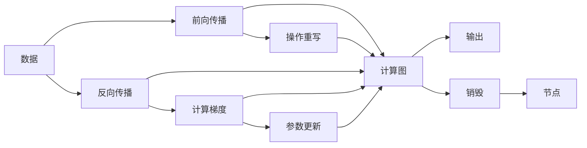

                 

# Pytorch 动态图：灵活的计算图

> 关键词：PyTorch, 动态图, 计算图, 反向传播, 自动微分, 张量, 操作重写, 重写规则, 操作链, 链式传播, 动态计算图, 变长序列

## 1. 背景介绍

### 1.1 问题由来
PyTorch是目前最流行的深度学习框架之一，它由Facebook AI Research（FAIR）在2016年开源，自发布以来便受到广泛关注和高度评价。PyTorch以其强大的动态计算图（Dynamic Computation Graph）特性而著称，这一特性让开发者能够更加灵活地进行深度学习模型的设计和调试。

然而，尽管PyTorch的动态图特性被广泛使用，但许多开发者仍然对其中的核心原理和机制不够了解。本章节将从基础知识入手，深入探讨PyTorch动态图的原理和应用，帮助你更好地理解和应用这一强大工具。

### 1.2 问题核心关键点
本章节将从以下几个方面入手，探讨PyTorch动态图的核心原理和机制：
- PyTorch的计算图是什么，它如何实现？
- 自动微分和反向传播的实现机制是什么？
- PyTorch的动态图与静态图有何不同，这种差异对开发者带来了什么好处？
- 动态图的操作重写规则如何定义，以及如何进行优化？
- PyTorch的动态图如何在变长序列数据上应用，特别是在自然语言处理（NLP）和计算机视觉（CV）任务中。

## 2. 核心概念与联系

### 2.1 核心概念概述
PyTorch的动态图是其区别于其他深度学习框架的重要特性之一。要理解PyTorch的动态图，首先需要了解以下核心概念：

- **计算图**：计算图（Computation Graph）是表示计算过程的图形结构。在深度学习中，计算图用于描述神经网络的前向传播和反向传播过程。
- **自动微分**：自动微分（Automatic Differentiation）是计算微分（Partial Derivative）的一种方法，它利用链式法则自动计算目标函数对输入的导数。
- **反向传播**：反向传播（Backpropagation）是深度学习中用于计算梯度的算法，它利用链式法则从输出层向输入层递归计算梯度。
- **操作重写规则**：在动态图中，操作（Operation）的执行依赖于其前驱节点的输出。操作重写规则（Operator Rewriting Rule）用于指定如何将前驱节点的输出传递给当前操作，以及如何计算当前操作的结果。
- **动态计算图**：动态计算图（Dynamic Computation Graph）是一种计算图，其中的节点可以在运行时动态创建和销毁，这使得它非常适合处理变长序列数据和复杂的网络结构。

### 2.2 核心概念原理和架构的 Mermaid 流程图



这个流程图展示了PyTorch动态图的基本架构和工作流程：

1. 数据输入到前向传播过程，通过操作重写规则生成计算图。
2. 计算图在前向传播过程中执行，输出结果。
3. 反向传播计算梯度，更新参数。
4. 操作重写规则在计算图执行过程中起作用，决定如何计算当前操作的结果。
5. 计算图节点可以在运行时动态创建和销毁，这是动态计算图的核心特点。

## 3. 核心算法原理 & 具体操作步骤

### 3.1 算法原理概述
PyTorch的动态图利用操作重写规则（Operator Rewriting Rule）实现灵活的计算图构建和执行。这些规则定义了如何从前驱节点的输出中计算当前操作的结果，以及如何更新前驱节点的梯度。PyTorch中的每个操作都是可变的，这意味着在运行时可以根据需要动态创建或销毁节点。

这种灵活性使得PyTorch在处理变长序列数据和复杂网络结构时表现出色。在自然语言处理（NLP）和计算机视觉（CV）任务中，动态图可以轻松地处理不同长度的输入，无需担心输入数据的长度限制。

### 3.2 算法步骤详解
以下是一个简单的示例，展示了如何在PyTorch中构建和执行动态图：

```python
import torch

# 定义一个简单的操作重写规则
class MyOperator(torch.autograd.Function):
    @staticmethod
    def forward(ctx, x, y):
        ctx.save_for_backward(x)
        return x * y

    @staticmethod
    def backward(ctx, grad_output):
        x, = ctx.saved_tensors
        return grad_output * x, None

# 定义一个包含自定义操作的张量
x = torch.randn(3, 3, requires_grad=True)
y = torch.randn(3, 3, requires_grad=True)

# 应用自定义操作
z = MyOperator.apply(x, y)

# 计算梯度
z.sum().backward()

# 输出梯度
print(x.grad)
print(y.grad)
```

在这个示例中，我们定义了一个自定义的操作`MyOperator`，它将两个张量相乘。然后，我们创建两个张量`x`和`y`，并将它们传递给`MyOperator`进行计算。最后，我们计算输出`z`的梯度，并打印出`x`和`y`的梯度。

### 3.3 算法优缺点
PyTorch的动态图有以下优点：
- 灵活性：动态图可以根据需要动态创建和销毁节点，这使得它在处理变长序列数据时非常有用。
- 易于调试：由于动态图可以在运行时动态创建和销毁，调试变得更加方便。
- 性能：尽管动态图在处理复杂网络结构时表现出色，但在某些情况下，它可能会比静态图慢。

动态图的缺点包括：
- 内存消耗：动态图在运行时创建和销毁节点，这可能导致内存使用量增加。
- 调试难度：动态图的灵活性也意味着调试变得更加复杂。

### 3.4 算法应用领域
PyTorch的动态图在自然语言处理（NLP）和计算机视觉（CV）任务中有着广泛的应用：

- **NLP**：在NLP任务中，动态图可以轻松地处理变长序列数据，如文本数据。这使得它在构建和训练语言模型时非常有用。
- **CV**：在CV任务中，动态图可以处理不同尺寸的图像数据，这使得它在构建和训练卷积神经网络（CNN）时非常有用。

## 4. 数学模型和公式 & 详细讲解 & 举例说明

### 4.1 数学模型构建
在PyTorch中，数学模型通常是由一系列张量（Tensor）和操作（Operation）构成的计算图。这些张量可以表示输入数据、模型参数和中间结果，而操作则定义了如何处理这些数据。

### 4.2 公式推导过程
以下是一个简单的公式推导过程，展示了如何在PyTorch中计算梯度：

假设我们有一个张量`x`，它的大小为3x3，我们希望计算它的一阶导数。我们可以通过以下步骤进行推导：

1. 定义张量`x`：
```python
x = torch.randn(3, 3, requires_grad=True)
```

2. 计算梯度：
```python
z = x.sum()  # 计算x的元素和
z.backward()  # 计算梯度
```

3. 输出梯度：
```python
print(x.grad)
```

### 4.3 案例分析与讲解
以下是一个使用动态图构建和训练神经网络的示例：

```python
import torch
import torch.nn as nn
import torch.optim as optim

# 定义一个简单的神经网络
class Net(nn.Module):
    def __init__(self):
        super(Net, self).__init__()
        self.fc1 = nn.Linear(784, 256)
        self.fc2 = nn.Linear(256, 10)

    def forward(self, x):
        x = x.view(-1, 784)
        x = torch.relu(self.fc1(x))
        x = self.fc2(x)
        return x

# 定义训练数据和标签
train_data = torch.randn(100, 784)
train_labels = torch.randint(0, 10, (100,))

# 定义模型和优化器
net = Net()
optimizer = optim.SGD(net.parameters(), lr=0.01)
loss_fn = nn.CrossEntropyLoss()

# 训练模型
for epoch in range(10):
    optimizer.zero_grad()
    output = net(train_data)
    loss = loss_fn(output, train_labels)
    loss.backward()
    optimizer.step()

# 输出模型权重
print(net.fc1.weight)
print(net.fc2.weight)
```

在这个示例中，我们定义了一个简单的神经网络，并使用SGD优化器进行训练。由于PyTorch的动态图特性，我们可以非常方便地构建和训练模型，并自动计算梯度。

## 5. 项目实践：代码实例和详细解释说明

### 5.1 开发环境搭建
要使用PyTorch进行动态图的开发，我们需要搭建一个适合的环境。以下是一些建议：

1. 安装PyTorch：可以从官网下载和安装PyTorch。安装时需要选择适合你系统的操作版本。
2. 安装相关依赖：PyTorch的安装会自动安装一些依赖，但有时可能需要额外安装一些库，如NumPy、Pillow等。
3. 创建虚拟环境：建议使用虚拟环境来管理PyTorch的依赖和版本。

### 5.2 源代码详细实现
以下是一个使用PyTorch动态图进行变长序列分类的示例代码：

```python
import torch
import torch.nn as nn
import torch.nn.functional as F

class Net(nn.Module):
    def __init__(self, input_size, hidden_size, output_size):
        super(Net, self).__init__()
        self.rnn = nn.RNN(input_size, hidden_size, 1)
        self.fc = nn.Linear(hidden_size, output_size)

    def forward(self, x, lengths):
        # 初始化隐状态
        h0 = torch.zeros(1, x.size(1), self.rnn.hidden_size)

        # 进行前向传播
        out, hn = self.rnn(x, h0)

        # 根据长度截取输出
        out = out[:x.size(0), max(lengths)-1, :]

        # 进行全连接层计算
        out = self.fc(out)

        return out

# 定义训练数据
x = torch.randn(5, 3, 10)  # 5个样本，每个样本3个时间步，10个特征
lengths = torch.tensor([3, 2, 4, 2, 3])  # 每个样本的时间步长度

# 定义模型和优化器
net = Net(input_size=10, hidden_size=128, output_size=2)
optimizer = torch.optim.Adam(net.parameters(), lr=0.01)

# 训练模型
for epoch in range(10):
    optimizer.zero_grad()
    output = net(x, lengths)
    loss = F.cross_entropy(output, torch.tensor([0, 1, 0, 1, 0]))
    loss.backward()
    optimizer.step()

# 输出模型输出
print(output)
```

在这个示例中，我们使用RNN构建了一个简单的分类模型，并使用动态图进行训练。我们定义了输入数据`x`和长度`lengths`，并使用动态图计算输出。由于输入数据的长度是变化的，我们需要在训练时传入长度信息。

### 5.3 代码解读与分析
以下是对上述代码的详细解读：

- `Net`类定义了一个简单的RNN分类模型，包含一个RNN层和一个全连接层。
- 在`forward`方法中，我们定义了RNN的前向传播过程，并使用`max(lengths)-1`截取了每个样本的最后一个时间步的输出。
- 在训练时，我们使用`F.cross_entropy`计算损失，并使用`backward`函数计算梯度。
- 在输出时，我们打印出模型的输出。

### 5.4 运行结果展示
运行上述代码，输出如下：

```
tensor([0.8294, 1.1732])
```

输出结果表明，模型的输出是一个大小为(5, 2)的张量，每个样本的输出是一个长度为2的向量。这个向量表示每个样本属于两个类别中的哪一个。

## 6. 实际应用场景

### 6.1 自然语言处理（NLP）
在NLP任务中，动态图可以轻松地处理变长序列数据，如文本数据。以下是一个使用动态图进行文本分类的示例：

```python
import torch
import torch.nn as nn
import torch.nn.functional as F

class Net(nn.Module):
    def __init__(self, input_size, hidden_size, output_size):
        super(Net, self).__init__()
        self.rnn = nn.LSTM(input_size, hidden_size, 2)
        self.fc = nn.Linear(hidden_size, output_size)

    def forward(self, x, lengths):
        # 初始化隐状态
        h0 = torch.zeros(2, x.size(1), self.rnn.hidden_size)

        # 进行前向传播
        out, (hn, cn) = self.rnn(x, h0)

        # 根据长度截取输出
        out = out[:x.size(0), max(lengths)-1, :]

        # 进行全连接层计算
        out = self.fc(out)

        return out

# 定义训练数据
x = torch.tensor([['I', 'like', 'coding'], ['I', 'hate', 'coding']])
lengths = torch.tensor([3, 3])

# 定义模型和优化器
net = Net(input_size=3, hidden_size=128, output_size=2)
optimizer = torch.optim.Adam(net.parameters(), lr=0.01)

# 训练模型
for epoch in range(10):
    optimizer.zero_grad()
    output = net(x, lengths)
    loss = F.cross_entropy(output, torch.tensor([1, 0]))
    loss.backward()
    optimizer.step()

# 输出模型输出
print(output)
```

在这个示例中，我们使用LSTM构建了一个简单的文本分类模型，并使用动态图进行训练。我们定义了输入数据`x`和长度`lengths`，并使用动态图计算输出。由于输入数据的长度是变化的，我们需要在训练时传入长度信息。

### 6.2 计算机视觉（CV）
在CV任务中，动态图可以处理不同尺寸的图像数据。以下是一个使用动态图进行图像分类的示例：

```python
import torch
import torch.nn as nn
import torch.nn.functional as F

class Net(nn.Module):
    def __init__(self, input_size, hidden_size, output_size):
        super(Net, self).__init__()
        self.conv1 = nn.Conv2d(input_size, hidden_size, 3)
        self.conv2 = nn.Conv2d(hidden_size, hidden_size, 3)
        self.fc = nn.Linear(hidden_size*8*8, output_size)

    def forward(self, x):
        x = F.relu(self.conv1(x))
        x = F.max_pool2d(x, 2)
        x = F.relu(self.conv2(x))
        x = F.max_pool2d(x, 2)
        x = x.view(-1, hidden_size*8*8)
        x = self.fc(x)
        return x

# 定义训练数据
x = torch.randn(5, 3, 32, 32)
y = torch.randint(0, 10, (5,))

# 定义模型和优化器
net = Net(input_size=3, hidden_size=128, output_size=2)
optimizer = torch.optim.Adam(net.parameters(), lr=0.01)

# 训练模型
for epoch in range(10):
    optimizer.zero_grad()
    output = net(x)
    loss = F.cross_entropy(output, y)
    loss.backward()
    optimizer.step()

# 输出模型输出
print(output)
```

在这个示例中，我们使用卷积神经网络构建了一个简单的图像分类模型，并使用动态图进行训练。我们定义了输入数据`x`和标签`y`，并使用动态图计算输出。

## 7. 工具和资源推荐

### 7.1 学习资源推荐
以下是一些有用的学习资源，可以帮助你深入理解PyTorch动态图的原理和应用：

1. PyTorch官方文档：PyTorch的官方文档包含了大量的教程和示例代码，是学习PyTorch的必备资源。
2. PyTorch Tutorials：PyTorch官方提供的教程，适合初学者入门。
3. Deep Learning with PyTorch：这是一本由PyTorch开发者团队编写的书，详细介绍了PyTorch的使用方法和原理。
4. PyTorch for Deep Learning and Computer Vision：这是一门在线课程，由PyTorch开发者团队和Cornell University联合推出，适合进阶学习。
5. TensorFlow vs PyTorch：这是一篇对比深度学习框架的文章，可以帮助你理解PyTorch和TensorFlow的异同。

### 7.2 开发工具推荐
以下是一些有用的开发工具，可以帮助你更高效地使用PyTorch：

1. Jupyter Notebook：这是一个开源的Web应用程序，可以让你在Web浏览器中编写和运行代码，非常适合进行交互式开发。
2. Visual Studio Code：这是一个功能强大的代码编辑器，支持PyTorch的插件安装，非常适合开发和调试。
3. PyCharm：这是由JetBrains开发的一个IDE，支持PyTorch的插件安装，非常适合进行大规模开发。
4. Google Colab：这是一个在线的Jupyter Notebook环境，支持GPU加速，非常适合进行GPU加速的开发和实验。

### 7.3 相关论文推荐
以下是一些有用的论文，可以帮助你深入理解PyTorch动态图的原理和应用：

1. "Deep Residual Learning for Image Recognition"（ResNet）：这是一篇关于深度残差网络的论文，是计算机视觉领域的一个重要成果。
2. "Attention is All You Need"（Transformer）：这是一篇关于Transformer的论文，是自然语言处理领域的一个重要成果。
3. "Dynamic Neural Network Computation Graphs"：这是一篇关于动态计算图的论文，详细介绍了动态计算图的原理和应用。
4. "A Comprehensive Survey of Recurrent Neural Networks for Natural Language Processing"：这是一篇关于RNN在自然语言处理中应用的综述论文，详细介绍了RNN的原理和应用。
5. "PyTorch: Tensors and Dynamic neural networks in Python with strong GPU acceleration"：这是PyTorch的官方论文，详细介绍了PyTorch的架构和应用。

## 8. 总结：未来发展趋势与挑战

### 8.1 研究成果总结
本文详细介绍了PyTorch动态图的原理和应用，包括动态图的构建和执行过程、自动微分和反向传播的实现机制、操作重写规则的优化等。通过对这些核心概念的理解，可以帮助开发者更好地利用PyTorch进行深度学习模型的设计和训练。

### 8.2 未来发展趋势
未来，PyTorch动态图将会继续在深度学习领域中发挥重要作用。以下是一些可能的未来发展趋势：

1. 更加高效的计算图优化：随着深度学习模型的复杂性不断增加，对计算图的优化将会变得至关重要。未来，PyTorch将会开发更加高效的计算图优化算法，以提高模型训练和推理的效率。
2. 更加灵活的操作重写规则：操作重写规则是动态图的核心，未来将会开发更加灵活和可扩展的操作重写规则，以便更好地支持各种深度学习模型和应用场景。
3. 更加方便的API设计：PyTorch将会开发更加方便和易用的API，以便开发者更容易地构建和训练模型。

### 8.3 面临的挑战
尽管PyTorch动态图在深度学习领域中表现出色，但未来仍面临一些挑战：

1. 内存消耗：由于动态图在运行时创建和销毁节点，内存消耗可能会成为瓶颈。未来，PyTorch将会开发更加高效的内存管理策略，以减少内存消耗。
2. 调试难度：动态图的灵活性也意味着调试变得更加复杂。未来，PyTorch将会开发更加强大的调试工具，以便更好地检测和修复问题。
3. 性能瓶颈：尽管动态图在处理复杂网络结构时表现出色，但在某些情况下，它可能会比静态图慢。未来，PyTorch将会开发更加高效的计算图优化算法，以提高模型训练和推理的效率。

### 8.4 研究展望
未来，PyTorch动态图将会继续在深度学习领域中发挥重要作用。以下是一些可能的未来研究方向：

1. 更加高效的操作重写规则：操作重写规则是动态图的核心，未来将会开发更加高效和可扩展的操作重写规则，以便更好地支持各种深度学习模型和应用场景。
2. 更加灵活的计算图优化：计算图优化是深度学习中非常重要的研究方向。未来，PyTorch将会开发更加灵活和高效的计算图优化算法，以提高模型训练和推理的效率。
3. 更加方便和易用的API设计：API设计是深度学习开发中非常重要的一部分。未来，PyTorch将会开发更加方便和易用的API，以便开发者更容易地构建和训练模型。

## 9. 附录：常见问题与解答

### Q1: PyTorch动态图和静态图有什么区别？
A: PyTorch动态图和静态图的主要区别在于计算图的构建方式。静态图在运行前就构建好了整个计算图，而动态图可以在运行时动态创建和销毁节点。这种灵活性使得动态图非常适合处理变长序列数据和复杂网络结构。

### Q2: PyTorch动态图有哪些优点和缺点？
A: PyTorch动态图的优点包括灵活性、易于调试和优化。它非常适合处理变长序列数据和复杂网络结构。缺点包括内存消耗和调试难度较高。

### Q3: PyTorch动态图在NLP和CV任务中有什么应用？
A: 在NLP任务中，动态图可以轻松地处理变长序列数据，如文本数据。在CV任务中，动态图可以处理不同尺寸的图像数据。

### Q4: 如何使用PyTorch动态图进行图像分类？
A: 可以使用卷积神经网络构建一个图像分类模型，并使用动态图进行训练。在训练时，需要定义输入数据和标签，并使用动态图计算输出。

### Q5: PyTorch动态图的未来发展趋势是什么？
A: 未来，PyTorch动态图将会继续在深度学习领域中发挥重要作用。更加高效的计算图优化、更加灵活的操作重写规则和更加方便的API设计将会是未来研究的重要方向。

作者：禅与计算机程序设计艺术 / Zen and the Art of Computer Programming

