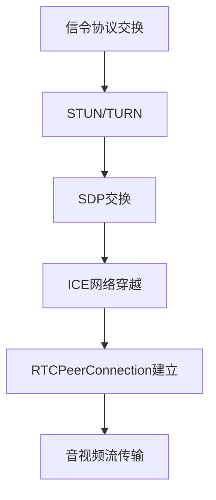

                 

# WebRTC 实时通信协议在浏览器中的应用：实现互动和通信

## 1. 背景介绍

随着互联网技术的不断发展和普及，实时通信(RTC)成为人们日常生活中的重要组成部分。无论是在线教育、远程办公，还是娱乐社交，高质量的实时音视频通信都至关重要。WebRTC（Real-Time Communications on Web）作为Web标准，提供了在浏览器端实现点对点音视频通信的强大功能，已经被广泛应用于各类Web应用中。

本文章将深入探讨WebRTC协议的原理和实现机制，以及在浏览器中的具体应用。从基础理论到实际开发，系统地介绍WebRTC协议在浏览器中的实现方式和关键技术点。通过详细的代码示例和实例分析，帮助读者更好地理解和掌握WebRTC的核心概念和应用实践。

## 2. 核心概念与联系

### 2.1 核心概念概述

WebRTC是一个基于浏览器的网络协议，主要实现点对点音视频通信功能。其核心组件包括信令协议、SDP协议、ICE协议和RTCPeerConnection API等。信令协议用于建立和管理会话；SDP协议用于描述和交换会话参数；ICE协议用于网络穿越；RTCPeerConnection API用于创建和管理音视频流。

WebRTC协议的工作流程可以概括为以下几个步骤：

1. 信令协议交换：双方通过STUN或TURN服务器获取各自的公网地址。
2. SDP交换：双方交换各自的媒体描述信息，包括编解码器、流媒体信息等。
3. ICE网络穿越：通过STUN或TURN服务器进行网络穿越，建立双向通信通道。
4. RTCPeerConnection建立：基于SDP信息创建RTCPeerConnection对象，建立音视频流。
5. 音视频流传输：通过RTCPeerConnection对象实现音视频流的实时传输和接收。

### 2.2 核心概念原理和架构的 Mermaid 流程图



## 3. 核心算法原理 & 具体操作步骤

### 3.1 算法原理概述

WebRTC的实现基于浏览器的网络API和WebSockets技术。其核心思想是通过浏览器内置的RTCPeerConnection对象，实现点对点音视频流的建立和传输。

WebRTC的音视频编解码器支持多种标准，如VP8/VP9、H.264、H.265等，用户可以基于自己的设备选择适合的编解码器。音视频流通过ICE协议自动穿越防火墙和NAT，确保通信通道的稳定性。

### 3.2 算法步骤详解

以下是WebRTC协议在Web应用中的实现步骤：

1. 创建RTCPeerConnection对象：使用WebRTC API创建一个RTCPeerConnection对象，用于建立和管理音视频流。
2. 设置本地媒体参数：使用setLocalDescription()方法设置本地媒体参数，生成SDP描述信息。
3. 交换SDP描述：通过信令通道将SDP描述信息发送给对方，并监听对方发送的SDP描述信息。
4. 解析SDP描述：解析对方发送的SDP描述信息，获取对方的媒体参数和编解码器等。
5. 进行ICE网络穿越：使用STUN或TURN服务器进行网络穿越，建立双向通信通道。
6. 设置远程媒体参数：使用setRemoteDescription()方法设置远程媒体参数，完成音视频流的初始化。
7. 处理ICE连接错误：使用ICE连接状态变化事件，处理连接错误并重新进行穿越。
8. 处理音视频流：通过ontrack()方法监听音视频流的传输，并渲染到Web应用界面。

### 3.3 算法优缺点

WebRTC协议的主要优点包括：

1. 点对点通信：WebRTC实现的是点对点通信，不受网络环境影响，通信更加稳定。
2. 支持多种编解码器：WebRTC支持多种编解码器，用户可以根据设备和网络环境选择合适的编解码器。
3. 自动穿越网络：ICE协议可以自动穿越防火墙和NAT，确保通信通道的稳定性。

缺点则主要集中在：

1. 依赖浏览器：WebRTC依赖浏览器环境，受浏览器兼容性和API支持的影响。
2. 音视频编码质量：WebRTC的音视频编解码器依赖于浏览器的实现，编码质量可能存在差异。
3. 复杂度高：WebRTC的实现涉及到信令、SDP、ICE等多个协议和API，开发难度较高。

### 3.4 算法应用领域

WebRTC主要应用于需要实时音视频通信的Web应用，如在线教育、远程办公、视频会议、在线直播等。其广泛的应用场景使其成为构建实时通信系统的重要技术手段。

## 4. 数学模型和公式 & 详细讲解 & 举例说明

### 4.1 数学模型构建

WebRTC的实现依赖于浏览器内置的WebRTC API，其主要功能是通过RTCPeerConnection对象实现音视频流的传输。WebRTC的API调用不涉及复杂的数学模型，其主要依赖于浏览器的网络环境和硬件设备。

### 4.2 公式推导过程

由于WebRTC的API调用不涉及复杂的数学模型，因此不需要推导公式。但其核心算法流程涉及SDP和ICE协议的解析和处理，可以通过以下伪代码进行解释：

```python
# 创建RTCPeerConnection对象
pc = RTCPeerConnection()

# 设置本地媒体参数
pc.createOffer()
pc.setLocalDescription(sdp)

# 交换SDP描述
pc.onnegotiationneeded = self.onnegotiationneeded

# 解析SDP描述
pc.onicecandidate = self.onicecandidate

# 进行ICE网络穿越
pc.oniceconnectionstatechange = self.oniceconnectionstatechange

# 设置远程媒体参数
pc.setRemoteDescription(sdp)
pc.onicegatheringstatechange = self.onicegatheringstatechange

# 处理音视频流
pc.ontrack = self.ontrack
pc.onremovestream = self.onremovestream

# 处理ICE连接错误
pc.oniceconnectionstatechange = self.oniceconnectionstatechange
```

### 4.3 案例分析与讲解

以下是一个简单的WebRTC音视频通信示例，通过Python Flask框架实现：

```python
from flask import Flask, Response
from webrtc import RTCPeerConnection, IceCandidate, SDPDescription

app = Flask(__name__)

@app.route('/offer')
def offer():
    # 创建RTCPeerConnection对象
    pc = RTCPeerConnection()

    # 设置本地媒体参数
    pc.createOffer()
    sdp = pc.localDescription

    # 解析SDP描述
    sdp_str = sdp.sdp
    sdp = SDPDescription(sdp_str)

    # 返回SDP描述
    return Response(sdp.sdp, mimetype='text/plain')

@app.route('/answer')
def answer():
    # 设置远程媒体参数
    pc.setRemoteDescription(sdp)

    # 设置本地媒体参数
    pc.createAnswer()
    sdp = pc.localDescription

    # 解析SDP描述
    sdp_str = sdp.sdp
    sdp = SDPDescription(sdp_str)

    # 返回SDP描述
    return Response(sdp.sdp, mimetype='text/plain')

@app.route('/icecandidate')
def icecandidate():
    # 获取ICE候选
    candidate = pc.iceCandidates[0]

    # 返回ICE候选
    return Response(candidate.candidate.sdp, mimetype='text/plain')

if __name__ == '__main__':
    app.run()
```

该示例代码实现了WebRTC的基本功能，包括创建RTCPeerConnection对象、设置本地媒体参数、解析SDP描述、进行ICE网络穿越、设置远程媒体参数、处理音视频流和处理ICE连接错误。通过Flask框架将WebRTC的API调用封装为RESTful接口，可以方便地在浏览器中进行调用。

## 5. 项目实践：代码实例和详细解释说明

### 5.1 开发环境搭建

开发WebRTC应用需要以下依赖：

1. Flask：用于创建RESTful接口。
2. webrtc.js：用于在Web页面中实现WebRTC功能。
3. STUN/TURN服务器：用于进行网络穿越。

可以使用以下命令安装这些依赖：

```bash
pip install flask webrtc
```

### 5.2 源代码详细实现

以下是一个简单的WebRTC音视频通信示例，通过Python Flask框架实现：

```python
from flask import Flask, Response
from webrtc import RTCPeerConnection, IceCandidate, SDPDescription

app = Flask(__name__)

@app.route('/offer')
def offer():
    # 创建RTCPeerConnection对象
    pc = RTCPeerConnection()

    # 设置本地媒体参数
    pc.createOffer()
    sdp = pc.localDescription

    # 解析SDP描述
    sdp_str = sdp.sdp
    sdp = SDPDescription(sdp_str)

    # 返回SDP描述
    return Response(sdp.sdp, mimetype='text/plain')

@app.route('/answer')
def answer():
    # 设置远程媒体参数
    pc.setRemoteDescription(sdp)

    # 设置本地媒体参数
    pc.createAnswer()
    sdp = pc.localDescription

    # 解析SDP描述
    sdp_str = sdp.sdp
    sdp = SDPDescription(sdp_str)

    # 返回SDP描述
    return Response(sdp.sdp, mimetype='text/plain')

@app.route('/icecandidate')
def icecandidate():
    # 获取ICE候选
    candidate = pc.iceCandidates[0]

    # 返回ICE候选
    return Response(candidate.candidate.sdp, mimetype='text/plain')

if __name__ == '__main__':
    app.run()
```

### 5.3 代码解读与分析

以下是对该示例代码的详细解读和分析：

1. Flask框架：使用Flask框架创建RESTful接口，用于接收和处理WebRTC的API调用。
2. RTCPeerConnection对象：使用webrtc.js库创建RTCPeerConnection对象，用于建立和管理音视频流。
3. SDP描述：通过setLocalDescription()和setRemoteDescription()方法设置本地媒体参数和远程媒体参数，生成SDP描述信息。
4. ICE网络穿越：通过onicecandidate事件获取ICE候选，并返回给对方。
5. 音视频流处理：通过ontrack事件监听音视频流的传输，并渲染到Web应用界面。
6. 错误处理：通过oniceconnectionstatechange和onicegatheringstatechange事件处理ICE连接错误和网络穿越状态变化。

## 6. 实际应用场景

WebRTC在实际应用中已经被广泛应用于各类Web应用中，以下列举几个典型应用场景：

### 6.1 在线教育

在线教育平台通过WebRTC实现实时音视频通信，支持老师和学生进行远程互动。教师可以通过摄像头和麦克风进行授课，学生可以通过浏览器进行实时视频接收和音频收听，从而实现互动教学。

### 6.2 远程办公

远程办公场景下，WebRTC可以支持员工之间的实时音视频通信，实现远程协作和交流。通过WebRTC，员工可以在不受物理限制的情况下，实时进行视频会议、远程会议等。

### 6.3 视频会议

WebRTC可以用于视频会议软件的开发，支持多方实时音视频通信。通过WebRTC，用户可以方便地进行视频通话、屏幕共享、文件传输等操作，提升用户体验。

### 6.4 在线直播

在线直播平台通过WebRTC实现主播和观众的实时音视频通信，主播可以通过摄像头和麦克风进行直播，观众可以通过浏览器进行实时观看。WebRTC可以提供高质量的音视频传输，提升直播效果。

## 7. 工具和资源推荐

### 7.1 学习资源推荐

1. WebRTC官方文档：WebRTC官方文档详细介绍了WebRTC的API和使用方法，是WebRTC开发的基础。
2. webrtc.org：WebRTC官方社区，提供丰富的教程和资源，帮助开发者深入理解WebRTC。
3. MDN WebRTC文档：MDN WebRTC文档提供了详细的WebRTC API参考，方便开发者查找和使用。
4. WebRTC教程：WebRTC教程提供系统的WebRTC开发教程，适合初学者入门。

### 7.2 开发工具推荐

1. VSCode：VSCode是一个强大的开发工具，支持WebRTC开发。
2. WebRTC客户端库：使用WebRTC客户端库，可以快速搭建WebRTC应用。
3. STUN/TURN服务器：使用STUN/TURN服务器，方便进行网络穿越。

### 7.3 相关论文推荐

1. WebRTC Real-Time Communication Protocol：WebRTC官方文档，详细介绍了WebRTC协议的设计和实现。
2. WebRTC in the Browser：探讨了WebRTC在Web浏览器中的应用和实现。
3. WebRTC for Real-time Video and Audio Communication：探讨了WebRTC在实时音视频通信中的应用和优化。

## 8. 总结：未来发展趋势与挑战

### 8.1 研究成果总结

WebRTC协议已经在Web应用中得到了广泛应用，其点对点通信、支持多种编解码器、自动穿越网络等优点，使其成为构建实时音视频通信系统的理想选择。WebRTC协议的开发难度较大，需要开发者深入理解其API和协议机制。

### 8.2 未来发展趋势

1. 视频编解码器：WebRTC未来的发展将更加关注视频编解码器的优化和改进，提升视频传输的质量和效率。
2. 网络穿越优化：随着网络环境的多样化，WebRTC将不断优化网络穿越机制，提升网络稳定性。
3. 实时音视频应用：WebRTC将更加关注实时音视频应用场景，如在线教育、远程办公、视频会议等。
4. 浏览器兼容性：WebRTC将继续优化浏览器兼容性，支持更多的浏览器和设备。

### 8.3 面临的挑战

1. 网络环境复杂：WebRTC在网络环境复杂的场景下，需要优化网络穿越和音视频编解码器。
2. 浏览器兼容性：WebRTC需要进一步优化浏览器兼容性，支持更多的浏览器和设备。
3. 实时音视频传输：WebRTC需要在保证音视频质量的同时，优化音视频传输效率。

### 8.4 研究展望

1. 网络穿越优化：未来的研究将重点关注WebRTC的网络穿越机制，提升其网络稳定性。
2. 音视频编解码器：未来的研究将重点关注WebRTC的音视频编解码器，提升视频传输质量。
3. 实时音视频应用：未来的研究将重点关注WebRTC在实时音视频应用场景中的优化和改进。
4. 浏览器兼容性：未来的研究将重点关注WebRTC的浏览器兼容性，支持更多的浏览器和设备。

## 9. 附录：常见问题与解答

**Q1：WebRTC和WebSockets有什么区别？**

A: WebRTC和WebSockets都是Web应用中常用的网络通信协议，但WebRTC更专注于实时音视频通信。WebRTC基于点对点通信机制，可以实现高实时性的音视频传输；而WebSockets则基于全双工通信机制，可以实现双向的实时通信。

**Q2：如何优化WebRTC的音视频传输质量？**

A: 优化WebRTC音视频传输质量可以从以下几个方面入手：
1. 选择适合的编解码器：根据设备和网络环境，选择适合的编解码器。
2. 优化网络穿越：使用STUN/TURN服务器进行网络穿越，确保通信通道的稳定性。
3. 调整编解码器参数：通过调整编解码器参数，优化音视频编码质量。
4. 增加带宽：增加带宽可以有效提升音视频传输质量。

**Q3：WebRTC如何实现实时音视频通信？**

A: WebRTC通过RTCPeerConnection对象实现实时音视频通信，具体步骤如下：
1. 创建RTCPeerConnection对象。
2. 设置本地媒体参数。
3. 交换SDP描述信息。
4. 进行ICE网络穿越。
5. 设置远程媒体参数。
6. 处理音视频流和ICE连接错误。

---

作者：禅与计算机程序设计艺术 / Zen and the Art of Computer Programming

