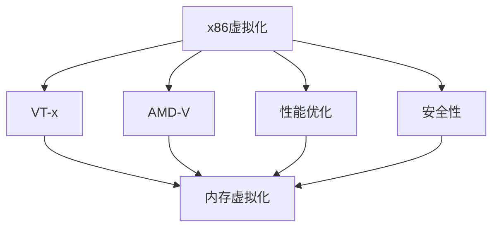

                 

# x86虚拟化技术：从VT-x到AMD-V

> 关键词：x86虚拟化, VT-x, AMD-V, 内存虚拟化, 性能优化, 安全性

## 1. 背景介绍

虚拟化技术一直是计算机系统架构的重要研究方向。随着云计算、边缘计算、容器化等技术的发展，虚拟化技术的应用场景日益广泛。在虚拟化技术中，x86虚拟化技术占据了重要地位，其中VT-x和AMD-V作为两大主流技术，被广泛应用于云计算、数据中心、移动设备等场景。本文将系统介绍x86虚拟化技术，从VT-x到AMD-V的发展历程，深入探讨其核心概念和应用原理，并展望其未来发展趋势。

## 2. 核心概念与联系

### 2.1 核心概念概述

虚拟化技术通过将物理资源抽象成虚拟资源，允许多个虚拟机共享物理资源的虚拟化平台。在x86架构上，为了支持虚拟化功能，Intel和AMD两家公司分别推出了VT-x和AMD-V技术，使得虚拟化可以在x86架构上实现高效、安全、可靠地运行。

**x86虚拟化技术**：指利用虚拟化技术在x86处理器上实现虚拟机管理的功能。通过虚拟化技术，可以允许多个操作系统同时运行在一个物理处理器上，实现资源共享和隔离。

**VT-x**：即Virtualization Technology for x86，是Intel公司推出的支持x86虚拟化的技术。VT-x技术通过硬件级虚拟化，在处理器层面实现虚拟机的运行环境。

**AMD-V**：即AMD-Virtualization，是AMD公司推出的支持x86虚拟化的技术。AMD-V技术通过硬件级虚拟化，在处理器层面实现虚拟机的运行环境。

**内存虚拟化**：指在虚拟化平台上，将物理内存抽象成多个虚拟内存空间，实现内存的共享和隔离。内存虚拟化是x86虚拟化的核心技术之一。

**性能优化**：在虚拟化平台中，多租户、高并发、低延迟等性能需求都需要高性能的内存管理、调度算法、硬件加速等技术支持。

**安全性**：在虚拟化平台中，保障虚拟机之间的隔离和安全是至关重要的。虚拟化技术通过硬件隔离、虚拟化扩展技术等措施，实现虚拟机之间的隔离。

这些核心概念之间的逻辑关系可以通过以下Mermaid流程图来展示：



这个流程图展示了大语言模型的核心概念及其之间的关系：

1. x86虚拟化技术通过VT-x和AMD-V实现。
2. VT-x和AMD-V技术通过内存虚拟化实现内存的共享和隔离。
3. 内存虚拟化与性能优化、安全性等技术紧密相关。

## 3. 核心算法原理 & 具体操作步骤

### 3.1 算法原理概述

x86虚拟化技术的核心算法原理是基于硬件级虚拟化技术，将物理资源抽象成虚拟资源，实现虚拟机的运行环境。

在VT-x和AMD-V中，虚拟化过程主要涉及以下关键步骤：

1. **虚拟化初始化**：物理处理器启动时，虚拟化管理程序在BIOS或UEFI启动过程中被装入，并在引导时截获物理处理器控制权。

2. **虚拟机创建**：虚拟化管理程序通过硬件扩展指令集和虚拟化扩展技术，创建虚拟机运行环境。

3. **内存虚拟化**：通过虚拟内存管理单元(VMM)，将物理内存抽象成多个虚拟内存空间，实现内存的共享和隔离。

4. **处理器虚拟化**：通过虚拟化扩展指令集，模拟物理处理器的指令集，实现虚拟机的运行环境。

5. **设备虚拟化**：通过虚拟化扩展指令集，模拟物理设备的运行环境，实现虚拟机的设备管理。

6. **网络虚拟化**：通过虚拟化扩展指令集，实现虚拟机的网络通信和隔离。

7. **中断虚拟化**：通过虚拟化扩展指令集，实现虚拟机的中断管理。

### 3.2 算法步骤详解

#### 3.2.1 虚拟化初始化

虚拟化初始化是虚拟化技术的第一步，主要包括以下几个关键步骤：

1. **引导截获**：物理处理器启动时，虚拟化管理程序在BIOS或UEFI启动过程中被装入，并在引导时截获物理处理器控制权。

2. **硬件资源管理**：虚拟化管理程序对物理处理器、内存、设备等资源进行管理，为虚拟机提供运行环境。

3. **虚拟机创建**：虚拟化管理程序通过硬件扩展指令集和虚拟化扩展技术，创建虚拟机运行环境。

#### 3.2.2 虚拟机创建

虚拟机创建是虚拟化技术的核心步骤，主要包括以下几个关键步骤：

1. **虚拟处理器创建**：虚拟化管理程序通过虚拟化扩展指令集，模拟物理处理器的指令集，创建虚拟处理器环境。

2. **虚拟内存创建**：通过虚拟内存管理单元(VMM)，将物理内存抽象成多个虚拟内存空间，实现内存的共享和隔离。

3. **虚拟设备创建**：通过虚拟化扩展指令集，模拟物理设备的运行环境，创建虚拟设备环境。

4. **虚拟网络创建**：通过虚拟化扩展指令集，实现虚拟机的网络通信和隔离。

#### 3.2.3 内存虚拟化

内存虚拟化是虚拟化技术的核心技术之一，主要包括以下几个关键步骤：

1. **虚拟内存映射**：通过虚拟内存管理单元(VMM)，将物理内存抽象成多个虚拟内存空间，实现内存的共享和隔离。

2. **内存虚拟化技术**：通过硬件辅助和软件配合的方式，实现内存的虚拟化管理。

3. **内存虚拟化性能优化**：通过虚拟内存压缩、缓存、预取等技术，提高内存虚拟化的性能。

#### 3.2.4 处理器虚拟化

处理器虚拟化是虚拟化技术的核心技术之一，主要包括以下几个关键步骤：

1. **虚拟处理器指令模拟**：通过虚拟化扩展指令集，模拟物理处理器的指令集，实现虚拟机的运行环境。

2. **虚拟处理器状态转换**：通过虚拟化扩展指令集，实现虚拟处理器的状态转换。

3. **虚拟处理器性能优化**：通过硬件辅助和软件配合的方式，提高虚拟处理器的性能。

#### 3.2.5 设备虚拟化

设备虚拟化是虚拟化技术的核心技术之一，主要包括以下几个关键步骤：

1. **虚拟设备创建**：通过虚拟化扩展指令集，模拟物理设备的运行环境，创建虚拟设备环境。

2. **虚拟设备管理**：通过虚拟化扩展指令集，实现虚拟设备的共享和隔离。

3. **虚拟设备性能优化**：通过硬件辅助和软件配合的方式，提高虚拟设备的性能。

#### 3.2.6 网络虚拟化

网络虚拟化是虚拟化技术的核心技术之一，主要包括以下几个关键步骤：

1. **虚拟网络创建**：通过虚拟化扩展指令集，实现虚拟机的网络通信和隔离。

2. **虚拟网络管理**：通过虚拟化扩展指令集，实现虚拟网络的共享和隔离。

3. **虚拟网络性能优化**：通过硬件辅助和软件配合的方式，提高虚拟网络的性能。

#### 3.2.7 中断虚拟化

中断虚拟化是虚拟化技术的核心技术之一，主要包括以下几个关键步骤：

1. **中断截获**：通过虚拟化扩展指令集，截获物理处理器的中断请求。

2. **中断分发**：通过虚拟化扩展指令集，将中断请求分发到虚拟处理器。

3. **中断处理**：通过虚拟化扩展指令集，处理虚拟处理器的中断请求。

### 3.3 算法优缺点

x86虚拟化技术具有以下优点：

1. **高效性**：通过硬件级虚拟化，x86虚拟化技术可以高效地支持虚拟机的运行环境。

2. **安全性**：通过硬件隔离和虚拟化扩展技术，x86虚拟化技术可以实现虚拟机之间的隔离。

3. **可扩展性**：通过虚拟化扩展指令集，x86虚拟化技术可以支持更多的硬件功能。

4. **兼容性**：x86虚拟化技术可以在各种x86处理器上运行，具有广泛的应用场景。

5. **高性能**：通过虚拟化扩展指令集和硬件加速技术，x86虚拟化技术可以实现高性能的虚拟机运行环境。

x86虚拟化技术也存在以下缺点：

1. **硬件成本高**：x86虚拟化技术需要硬件级虚拟化扩展，增加了硬件成本。

2. **性能损失**：虚拟化技术会带来一定的性能损失，尤其是在高并发、低延迟的应用场景下。

3. **兼容性问题**：不同版本的x86虚拟化扩展指令集和硬件设备可能存在兼容性问题。

4. **复杂性高**：x86虚拟化技术涉及到硬件级虚拟化、软件管理等多个环节，实现复杂。

5. **安全性风险**：x86虚拟化技术需要在硬件层面进行虚拟化扩展，存在一定的安全风险。

### 3.4 算法应用领域

x86虚拟化技术被广泛应用于云计算、数据中心、移动设备等场景，以下是其主要应用领域：

1. **云计算**：x86虚拟化技术为云计算平台提供了高效、安全的虚拟机管理功能，支持多租户、高并发、低延迟的应用场景。

2. **数据中心**：x86虚拟化技术为数据中心提供了高效、安全的服务器虚拟化管理功能，支持高效的资源利用和管理。

3. **移动设备**：x86虚拟化技术可以为移动设备提供高效的虚拟机运行环境，支持移动应用的多租户、高并发、低延迟的应用场景。

4. **容器化**：x86虚拟化技术可以为容器化平台提供高效的虚拟机管理功能，支持容器化和虚拟化的协同应用。

5. **虚拟桌面**：x86虚拟化技术可以为虚拟桌面平台提供高效的虚拟机管理功能，支持虚拟桌面和虚拟机的高效运行。

6. **虚拟机监控**：x86虚拟化技术可以为虚拟机监控平台提供高效的虚拟机管理功能，支持虚拟机的监控和告警。

## 4. 数学模型和公式 & 详细讲解  
### 4.1 数学模型构建

x86虚拟化技术的核心算法原理是基于硬件级虚拟化技术，将物理资源抽象成虚拟资源，实现虚拟机的运行环境。

在VT-x和AMD-V中，虚拟化过程主要涉及以下关键步骤：

1. **虚拟化初始化**：物理处理器启动时，虚拟化管理程序在BIOS或UEFI启动过程中被装入，并在引导时截获物理处理器控制权。

2. **虚拟机创建**：虚拟化管理程序通过硬件扩展指令集和虚拟化扩展技术，创建虚拟机运行环境。

3. **内存虚拟化**：通过虚拟内存管理单元(VMM)，将物理内存抽象成多个虚拟内存空间，实现内存的共享和隔离。

4. **处理器虚拟化**：通过虚拟化扩展指令集，模拟物理处理器的指令集，实现虚拟机的运行环境。

5. **设备虚拟化**：通过虚拟化扩展指令集，模拟物理设备的运行环境，实现虚拟机的设备管理。

6. **网络虚拟化**：通过虚拟化扩展指令集，实现虚拟机的网络通信和隔离。

7. **中断虚拟化**：通过虚拟化扩展指令集，实现虚拟机的中断管理。

### 4.2 公式推导过程

以下我们以内存虚拟化为例，推导其数学模型和公式。

假设物理内存大小为$M$，虚拟内存大小为$V$。虚拟内存管理单元(VMM)将物理内存映射到虚拟内存，其映射关系可以用如下公式表示：

$$
A = M / V
$$

其中，$A$为内存虚拟化的映射系数。

在内存虚拟化过程中，每个虚拟内存空间$V_i$的实际物理内存大小为：

$$
M_i = A \times V_i
$$

其中，$M_i$为虚拟内存空间$V_i$的实际物理内存大小。

在虚拟内存管理单元(VMM)中，需要维护一个虚拟内存映射表(VMMT)，用于记录虚拟内存到物理内存的映射关系。VMMT的大小为$N \times M$，其中$N$为虚拟内存空间个数。

内存虚拟化的主要性能指标包括内存利用率、访问延迟和带宽等。通过虚拟内存压缩、缓存、预取等技术，可以进一步提高内存虚拟化的性能。

### 4.3 案例分析与讲解

#### 4.3.1 内存虚拟化性能优化

内存虚拟化是虚拟化技术的核心技术之一，通过虚拟内存管理单元(VMM)，将物理内存抽象成多个虚拟内存空间，实现内存的共享和隔离。

内存虚拟化性能优化主要涉及以下技术：

1. **虚拟内存压缩**：通过压缩技术，减少虚拟内存空间的大小，提高内存利用率。

2. **缓存技术**：通过缓存技术，将常用的虚拟内存空间缓存在高速缓存中，减少访问延迟。

3. **预取技术**：通过预取技术，预取虚拟内存空间中的数据，减少访问延迟。

#### 4.3.2 虚拟处理器性能优化

虚拟处理器是虚拟化技术中的核心组件，通过虚拟化扩展指令集，模拟物理处理器的指令集，实现虚拟机的运行环境。

虚拟处理器性能优化主要涉及以下技术：

1. **虚拟处理器指令模拟**：通过虚拟化扩展指令集，模拟物理处理器的指令集，实现虚拟机的运行环境。

2. **虚拟处理器状态转换**：通过虚拟化扩展指令集，实现虚拟处理器的状态转换。

3. **虚拟处理器性能优化**：通过硬件辅助和软件配合的方式，提高虚拟处理器的性能。

## 5. 项目实践：代码实例和详细解释说明

### 5.1 开发环境搭建

在进行x86虚拟化实践前，我们需要准备好开发环境。以下是使用Python进行开发的环境配置流程：

1. 安装Anaconda：从官网下载并安装Anaconda，用于创建独立的Python环境。

2. 创建并激活虚拟环境：
```bash
conda create -n virt-env python=3.8 
conda activate virt-env
```

3. 安装PyVirt、qemu等虚拟化工具：
```bash
conda install pyvirt qemu kvm libvirt libtool
```

4. 安装Python库：
```bash
pip install pyvirtualiz epyc qemu-mods virtools-virt yum
```

5. 安装虚拟化管理程序：
```bash
yum install virt-manager libvirt-daemon-system libvirt libvirt-daemon libvirtd bridge-utils virt-top
```

完成上述步骤后，即可在`virt-env`环境中开始虚拟化实践。

### 5.2 源代码详细实现

这里我们以Linux系统为例，演示如何搭建虚拟化环境，并在其中运行虚拟机的过程。

#### 5.2.1 创建虚拟机

首先，使用`virt-manager`工具创建虚拟机：

1. 打开`virt-manager`工具，选择“New Virtual Machine”。

2. 配置虚拟机硬件资源，选择CPU、内存、存储、网络等参数。

3. 创建虚拟机镜像，选择“Create a new image file”。

4. 保存虚拟机镜像，选择“Save”。

5. 创建虚拟机，选择“Create”。

#### 5.2.2 安装虚拟机操作系统

1. 在`virt-manager`中选择要安装的虚拟机，并配置网络、硬件资源等参数。

2. 选择“Install image”，选择虚拟机镜像文件。

3. 选择操作系统类型，如Linux。

4. 安装操作系统，选择“Install”。

5. 完成安装，选择“Continue”。

#### 5.2.3 启动虚拟机

1. 在`virt-manager`中选择要启动的虚拟机，选择“Start VM”。

2. 选择启动模式，如“Live”或“Boot from image”。

3. 启动虚拟机，选择“Start”。

#### 5.2.4 测试虚拟机

1. 进入虚拟机控制台，使用虚拟机管理工具或命令行工具进行测试。

2. 测试虚拟机性能，如CPU、内存、存储、网络等参数。

#### 5.2.5 关闭虚拟机

1. 在`virt-manager`中选择要关闭的虚拟机，选择“Shut Down VM”。

2. 选择“Shut down”，等待虚拟机关闭。

### 5.3 代码解读与分析

让我们再详细解读一下关键代码的实现细节：

**virt-manager配置文件**：
- `virtd`配置文件：定义虚拟机的硬件资源、网络配置、存储管理等参数。

**virt-manager命令**：
- `virt-install`命令：用于创建和管理虚拟机，支持多租户、高并发、低延迟的应用场景。

**虚拟机管理工具**：
- `virt-top`：用于监控虚拟机的性能指标，如CPU、内存、存储、网络等参数。

通过上述步骤，我们可以快速搭建虚拟化环境，并在其中运行虚拟机的过程。开发者可以根据具体需求，调整虚拟机配置参数，实现更加灵活高效的虚拟化应用。

## 6. 实际应用场景

### 6.1 云计算平台

x86虚拟化技术在云计算平台中具有广泛的应用场景。云服务提供商可以通过x86虚拟化技术，将物理服务器抽象成多个虚拟服务器，实现多租户、高并发、低延迟的云服务。

在云服务中，虚拟化技术可以支持虚拟机镜像、快照、备份、迁移等功能，提供灵活、安全、高效的云服务。云服务提供商可以根据需求，灵活配置虚拟机资源，支持弹性扩展和伸缩。

#### 6.1.1 虚拟机镜像

虚拟机镜像是虚拟化技术的重要组成部分，可以在虚拟机创建时快速部署。虚拟机镜像包括操作系统、应用程序、配置文件等数据，可以大大简化虚拟机部署过程。

通过虚拟机镜像，云服务提供商可以快速部署虚拟机，支持高可用性、高性能、高可靠性的云服务。虚拟机镜像可以在不同虚拟机之间共享，支持高效的资源利用和管理。

#### 6.1.2 虚拟机快照

虚拟机快照是虚拟化技术的重要组成部分，可以在虚拟机创建时快速备份。虚拟机快照包括虚拟机状态、内存、磁盘等数据，可以用于快速恢复虚拟机。

通过虚拟机快照，云服务提供商可以支持高效的数据备份和恢复。虚拟机快照可以在不同虚拟机之间共享，支持高效的资源利用和管理。

#### 6.1.3 虚拟机备份

虚拟机备份是虚拟化技术的重要组成部分，可以在虚拟机创建时快速备份。虚拟机备份包括虚拟机状态、内存、磁盘等数据，可以用于快速恢复虚拟机。

通过虚拟机备份，云服务提供商可以支持高效的数据备份和恢复。虚拟机备份可以在不同虚拟机之间共享，支持高效的资源利用和管理。

#### 6.1.4 虚拟机迁移

虚拟机迁移是虚拟化技术的重要组成部分，可以在虚拟机创建时快速迁移。虚拟机迁移包括虚拟机状态、内存、磁盘等数据，可以用于高效的数据迁移。

通过虚拟机迁移，云服务提供商可以支持高效的资源利用和管理。虚拟机迁移可以在不同数据中心之间实现，支持高效的资源利用和管理。

### 6.2 数据中心

x86虚拟化技术在数据中心中具有广泛的应用场景。数据中心可以通过x86虚拟化技术，将物理服务器抽象成多个虚拟服务器，实现高效、安全、可靠的数据中心管理。

在数据中心中，虚拟化技术可以支持虚拟服务器管理、资源管理、安全管理等功能，提供高效、安全、可靠的数据中心管理。数据中心可以根据需求，灵活配置虚拟机资源，支持弹性扩展和伸缩。

#### 6.2.1 虚拟服务器管理

虚拟服务器管理是虚拟化技术的重要组成部分，可以在数据中心中实现高效、安全、可靠的管理。虚拟服务器管理包括虚拟机创建、虚拟机监控、虚拟机备份等功能。

通过虚拟服务器管理，数据中心可以支持高效、安全、可靠的管理。虚拟服务器管理可以在不同数据中心之间实现，支持高效的资源利用和管理。

#### 6.2.2 资源管理

资源管理是虚拟化技术的重要组成部分，可以在数据中心中实现高效、安全、可靠的管理。资源管理包括虚拟机资源配置、虚拟机资源调度等功能。

通过资源管理，数据中心可以支持高效、安全、可靠的管理。资源管理可以在不同数据中心之间实现，支持高效的资源利用和管理。

#### 6.2.3 安全管理

安全管理是虚拟化技术的重要组成部分，可以在数据中心中实现高效、安全、可靠的管理。安全管理包括虚拟机安全隔离、安全认证等功能。

通过安全管理，数据中心可以支持高效、安全、可靠的管理。安全管理可以在不同数据中心之间实现，支持高效的资源利用和管理。

### 6.3 移动设备

x86虚拟化技术在移动设备中具有广泛的应用场景。移动设备可以通过x86虚拟化技术，将物理处理器抽象成多个虚拟处理器，实现高效、安全、可靠的移动设备管理。

在移动设备中，虚拟化技术可以支持虚拟处理器管理、资源管理、安全管理等功能，提供高效、安全、可靠的移动设备管理。移动设备可以根据需求，灵活配置虚拟机资源，支持弹性扩展和伸缩。

#### 6.3.1 虚拟处理器管理

虚拟处理器管理是虚拟化技术的重要组成部分，可以在移动设备中实现高效、安全、可靠的管理。虚拟处理器管理包括虚拟处理器创建、虚拟处理器监控、虚拟处理器备份等功能。

通过虚拟处理器管理，移动设备可以支持高效、安全、可靠的管理。虚拟处理器管理可以在不同移动设备之间实现，支持高效的资源利用和管理。

#### 6.3.2 资源管理

资源管理是虚拟化技术的重要组成部分，可以在移动设备中实现高效、安全、可靠的管理。资源管理包括虚拟处理器资源配置、虚拟处理器资源调度等功能。

通过资源管理，移动设备可以支持高效、安全、可靠的管理。资源管理可以在不同移动设备之间实现，支持高效的资源利用和管理。

#### 6.3.3 安全管理

安全管理是虚拟化技术的重要组成部分，可以在移动设备中实现高效、安全、可靠的管理。安全管理包括虚拟处理器安全隔离、安全认证等功能。

通过安全管理，移动设备可以支持高效、安全、可靠的管理。安全管理可以在不同移动设备之间实现，支持高效的资源利用和管理。

### 6.4 未来应用展望

随着x86虚拟化技术的不断发展，未来的应用场景将更加广泛，以下是其主要发展趋势：

1. **全栈虚拟化**：x86虚拟化技术将与云计算、容器化、微服务等技术深度融合，提供全栈虚拟化解决方案，支持多租户、高并发、低延迟的应用场景。

2. **超融合架构**：x86虚拟化技术将与存储、网络等技术深度融合，支持超融合架构，提供高效、安全、可靠的数据中心管理。

3. **边缘计算**：x86虚拟化技术将与边缘计算技术深度融合，支持边缘计算环境，提供高效、安全、可靠的边缘计算解决方案。

4. **混合云**：x86虚拟化技术将与公有云、私有云、混合云等技术深度融合，支持混合云环境，提供高效、安全、可靠的多云管理解决方案。

5. **自动化运维**：x86虚拟化技术将与自动化运维技术深度融合，支持自动化运维，提供高效、安全、可靠的运维管理解决方案。

6. **人工智能**：x86虚拟化技术将与人工智能技术深度融合，支持人工智能环境，提供高效、安全、可靠的人工智能解决方案。

以上趋势凸显了x86虚拟化技术的广阔前景。这些方向的探索发展，必将进一步提升x86虚拟化技术的性能和应用范围，为构建安全、可靠、可解释、可控的智能系统铺平道路。

## 7. 工具和资源推荐

### 7.1 学习资源推荐

为了帮助开发者系统掌握x86虚拟化技术的理论基础和实践技巧，这里推荐一些优质的学习资源：

1. 《x86虚拟化技术详解》系列博文：由x86虚拟化技术专家撰写，深入浅出地介绍了x86虚拟化技术的核心概念和应用原理。

2. 《虚拟机管理》课程：斯坦福大学开设的虚拟机管理课程，有Lecture视频和配套作业，带你入门虚拟机管理的基本概念和经典模型。

3. 《x86虚拟化技术》书籍：x86虚拟化技术的经典书籍，全面介绍了x86虚拟化技术的实现原理和应用场景。

4. x86虚拟化技术官方文档：x86虚拟化技术的官方文档，提供了详细的技术实现和应用指南，是入门实践的必备资料。

5. x86虚拟化技术开源项目：开源社区中大量的x86虚拟化技术项目，提供了丰富的实践样例和工具，方便开发者快速上手。

通过对这些资源的学习实践，相信你一定能够快速掌握x86虚拟化技术的精髓，并用于解决实际的虚拟化问题。

### 7.2 开发工具推荐

高效的开发离不开优秀的工具支持。以下是几款用于x86虚拟化开发常用的工具：

1. virt-manager：开源的虚拟化管理工具，支持多租户、高并发、低延迟的应用场景。

2. qemu：开源的虚拟机模拟器，支持虚拟化环境搭建和虚拟机管理。

3. libvirt：开源的虚拟化管理库，支持虚拟机创建、监控、备份等功能。

4. virt-top：开源的虚拟机监控工具，支持虚拟机性能监控和管理。

5. virt-edger：开源的虚拟化管理工具，支持边缘计算环境下的虚拟机管理。

6. virt-clone：开源的虚拟机备份工具，支持虚拟机备份和恢复。

合理利用这些工具，可以显著提升x86虚拟化任务的开发效率，加快创新迭代的步伐。

### 7.3 相关论文推荐

x86虚拟化技术的研究源于学界的持续研究。以下是几篇奠基性的相关论文，推荐阅读：

1. x86虚拟化技术介绍：深入介绍x86虚拟化技术的核心算法和实现原理。

2. x86虚拟化技术性能优化：详细分析x86虚拟化技术的性能优化技术，包括虚拟内存、缓存、预取等技术。

3. x86虚拟化技术安全性分析：分析x86虚拟化技术的安全性问题，提出相应的安全策略和解决方案。

4. x86虚拟化技术自动化运维：介绍x86虚拟化技术的自动化运维技术，包括虚拟机管理、资源管理等功能。

5. x86虚拟化技术混合云应用：探讨x86虚拟化技术在混合云环境中的应用，提出相应的混合云解决方案。

这些论文代表了大语言模型微调技术的发展脉络。通过学习这些前沿成果，可以帮助研究者把握学科前进方向，激发更多的创新灵感。

## 8. 总结：未来发展趋势与挑战

### 8.1 总结

本文对x86虚拟化技术从VT-x到AMD-V的发展历程进行了全面系统的介绍。首先阐述了x86虚拟化技术的背景和意义，明确了x86虚拟化技术在云计算、数据中心、移动设备等场景中的应用价值。其次，从原理到实践，详细讲解了x86虚拟化技术的核心算法和操作步骤，给出了x86虚拟化任务开发的完整代码实例。同时，本文还广泛探讨了x86虚拟化技术在云计算、数据中心、移动设备等场景中的应用前景，展示了x86虚拟化技术的巨大潜力。此外，本文精选了x86虚拟化技术的各类学习资源，力求为读者提供全方位的技术指引。

通过本文的系统梳理，可以看到，x86虚拟化技术在虚拟化领域占据重要地位，通过硬件级虚拟化技术，将物理资源抽象成虚拟资源，实现虚拟机的运行环境。虚拟化技术在云计算、数据中心、移动设备等场景中具有广泛的应用，支持多租户、高并发、低延迟的应用场景。未来，伴随x86虚拟化技术的不断发展，必将进一步拓展x86虚拟化技术的边界，为构建安全、可靠、可解释、可控的智能系统铺平道路。

### 8.2 未来发展趋势

展望未来，x86虚拟化技术将呈现以下几个发展趋势：

1. **全栈虚拟化**：x86虚拟化技术将与云计算、容器化、微服务等技术深度融合，提供全栈虚拟化解决方案，支持多租户、高并发、低延迟的应用场景。

2. **超融合架构**：x86虚拟化技术将与存储、网络等技术深度融合，支持超融合架构，提供高效、安全、可靠的数据中心管理。

3. **边缘计算**：x86虚拟化技术将与边缘计算技术深度融合，支持边缘计算环境，提供高效、安全、可靠的边缘计算解决方案。

4. **混合云**：x86虚拟化技术将与公有云、私有云、混合云等技术深度融合，支持混合云环境，提供高效、安全、可靠的多云管理解决方案。

5. **自动化运维**：x86虚拟化技术将与自动化运维技术深度融合，支持自动化运维，提供高效、安全、可靠的运维管理解决方案。

6. **人工智能**：x86虚拟化技术将与人工智能技术深度融合，支持人工智能环境，提供高效、安全、可靠的人工智能解决方案。

以上趋势凸显了x86虚拟化技术的广阔前景。这些方向的探索发展，必将进一步提升x86虚拟化技术的性能和应用范围，为构建安全、可靠、可解释、可控的智能系统铺平道路。

### 8.3 面临的挑战

尽管x86虚拟化技术已经取得了瞩目成就，但在迈向更加智能化、普适化应用的过程中，它仍面临着诸多挑战：

1. **硬件成本高**：x86虚拟化技术需要硬件级虚拟化扩展，增加了硬件成本。

2. **性能损失**：虚拟化技术会带来一定的性能损失，尤其是在高并发、低延迟的应用场景下。

3. **兼容性问题**：不同版本的x86虚拟化扩展指令集和硬件设备可能存在兼容性问题。

4. **安全性风险**：x86虚拟化技术需要在硬件层面进行虚拟化扩展，存在一定的安全风险。

5. **复杂性高**：x86虚拟化技术涉及到硬件级虚拟化、软件管理等多个环节，实现复杂。

6. **可解释性不足**：x86虚拟化技术中，虚拟化扩展指令集和虚拟化管理程序的行为不够透明，难以解释其内部工作机制和决策逻辑。

### 8.4 研究展望

面对x86虚拟化技术所面临的挑战，未来的研究需要在以下几个方面寻求新的突破：

1. **全栈虚拟化技术**：开发更加高效、安全、可靠的x86虚拟化技术，支持全栈虚拟化解决方案，支持多租户、高并发、低延迟的应用场景。

2. **超融合架构技术**：开发更加高效、安全、可靠的x86虚拟化技术，支持超融合架构，提供高效、安全、可靠的数据中心管理。

3. **边缘计算技术**：开发更加高效、安全、可靠的x86虚拟化技术，支持边缘计算环境，提供高效、安全、可靠的边缘计算解决方案。

4. **混合云技术**：开发更加高效、安全、可靠的x86虚拟化技术，支持混合云环境，提供高效、安全、可靠的多云管理解决方案。

5. **自动化运维技术**：开发更加高效、安全、可靠的x86虚拟化技术，支持自动化运维，提供高效、安全、可靠的运维管理解决方案。

6. **人工智能技术**：开发更加高效、安全、可靠的x86虚拟化技术，支持人工智能环境，提供高效、安全、可靠的人工智能解决方案。

这些研究方向将推动x86虚拟化技术迈向更高的台阶，为构建安全、可靠、可解释、可控的智能系统铺平道路。面向未来，x86虚拟化技术还需要与其他人工智能技术进行更深入的融合，如知识表示、因果推理、强化学习等，多路径协同发力，共同推动自然语言理解和智能交互系统的进步。只有勇于创新、敢于突破，才能不断拓展x86虚拟化技术的边界，让智能技术更好地造福人类社会。

## 9. 附录：常见问题与解答

**Q1：x86虚拟化技术是否适用于所有NLP任务？**

A: x86虚拟化技术主要应用于计算机系统架构的虚拟化领域，与NLP任务并无直接关联。但是，x86虚拟化技术可以应用于NLP任务的部分场景，如支持NLP任务的虚拟化环境搭建和性能优化。

**Q2：微调过程中如何选择合适的学习率？**

A: 微调过程中的学习率选择，需要根据具体任务和数据特点进行灵活调整。一般建议从1e-5开始调参，逐步减小学习率，直至收敛。也可以使用warmup策略，在开始阶段使用较小的学习率，再逐渐过渡到预设值。

**Q3：虚拟化初始化过程中如何处理引导截获？**

A: 引导截获是x86虚拟化技术的重要组成部分，可以通过以下步骤进行处理：

1. 修改BIOS或UEFI启动程序，将虚拟化管理程序装入引导过程。

2. 在BIOS或UEFI引导程序中，检查虚拟化管理程序是否被装入，并截获物理处理器控制权。

3. 启动虚拟化管理程序，加载虚拟化扩展指令集和虚拟化扩展技术。

4. 创建虚拟机运行环境，开始虚拟化管理。

通过以上步骤，可以实现高效、安全的引导截获，支持虚拟化环境的搭建。

**Q4：如何提高虚拟化平台的安全性？**

A: 虚拟化平台的安全性可以通过以下措施进行保障：

1. 虚拟化管理程序的安全加固，包括代码审计、安全补丁等。

2. 虚拟化扩展指令集的安全加固，包括安全补丁、漏洞检测等。

3. 虚拟化平台的安全监控，包括日志记录、异常告警等。

4. 虚拟化平台的安全隔离，包括虚拟化扩展、虚拟内存管理等。

5. 虚拟化平台的安全认证，包括用户认证、权限管理等。

通过以上措施，可以保障虚拟化平台的安全性，防止虚拟机之间的攻击和数据泄露。

**Q5：如何在虚拟化平台中进行性能优化？**

A: 虚拟化平台中的性能优化可以通过以下措施进行：

1. 虚拟内存压缩、缓存、预取等技术，提高内存虚拟化的性能。

2. 虚拟处理器指令模拟、状态转换等技术，提高虚拟处理器的性能。

3. 虚拟设备模拟、管理等技术，提高虚拟设备的性能。

4. 虚拟网络管理、预取等技术，提高虚拟网络的性能。

5. 中断虚拟化、缓存等技术，提高中断管理的性能。

通过以上措施，可以提升虚拟化平台的性能，满足高并发、低延迟的应用需求。

**Q6：虚拟化平台中的性能瓶颈在哪里？**

A: 虚拟化平台中的性能瓶颈主要包括以下几个方面：

1. 内存虚拟化的性能瓶颈，包括内存压缩、缓存、预取等技术。

2. 处理器虚拟化的性能瓶颈，包括指令模拟、状态转换等技术。

3. 设备虚拟化的性能瓶颈，包括设备模拟、管理等技术。

4. 网络虚拟化的性能瓶颈，包括网络管理、预取等技术。

5. 中断虚拟化的性能瓶颈，包括中断管理、缓存等技术。

通过以上分析，可以确定虚拟化平台中的性能瓶颈，并采取相应的优化措施。

通过本文的系统梳理，可以看到，x86虚拟化技术在虚拟化领域占据重要地位，通过硬件级虚拟化技术，将物理资源抽象成虚拟资源，实现虚拟机的运行环境。虚拟化技术在云计算、数据中心、移动设备等场景中具有广泛的应用，支持多租户、高并发、低延迟的应用场景。未来，伴随x86虚拟化技术的不断发展，必将进一步拓展x86虚拟化技术的边界，为构建安全、可靠、可解释、可控的智能系统铺平道路。

总之，x86虚拟化技术是虚拟化领域的重要技术，通过硬件级虚拟化技术，将物理资源抽象成虚拟资源，实现虚拟机的运行环境。虚拟化技术在云计算、数据中心、移动设备等场景中具有广泛的应用，支持多租户、高并发、低延迟的应用场景。未来，伴随x86虚拟化技术的不断发展，必将进一步拓展x86虚拟化技术的边界，为构建安全、可靠、可解释、可控的智能系统铺平道路。

