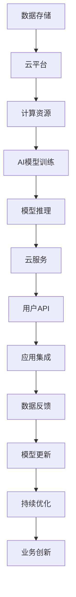

                 

# 云与AI的融合：贾扬清的独特视角，从阿里到Lepton AI的进化之路

## 1. 背景介绍

随着云计算和人工智能技术的迅猛发展，业界对于云与AI的融合创新需求日益增长。如何有效结合云计算的资源弹性、成本效益与人工智能的智能决策、个性化服务，成为了企业面临的重要挑战。

在这个背景下，贾扬清教授，作为全球顶尖AI专家、阿里巴巴达摩院AI研究院院长、Lepton AI的创始人兼CEO，以其深厚的AI理论功底和丰富的实践经验，带领团队成功打造了Lepton AI平台，引领了云计算和人工智能的深度融合。

本文将从贾扬清教授的视角，深入探讨云与AI融合的独特技术路径，分析其在工业界的应用与挑战，展望未来的发展方向。

## 2. 核心概念与联系

### 2.1 核心概念概述

为了更清晰地理解云与AI的融合，我们需要先明确几个核心概念：

- **云计算（Cloud Computing）**：指通过互联网提供资源和计算能力的服务模式，包括基础设施即服务（IaaS）、平台即服务（PaaS）、软件即服务（SaaS）等。
- **人工智能（AI）**：通过数据、算法和计算资源，使机器能够模拟、延伸并扩展人的智能能力，涵盖机器学习、深度学习、自然语言处理、计算机视觉等多个领域。
- **云原生人工智能（AI-Native Cloud）**：指在云平台之上构建和运行AI模型，充分利用云平台的资源弹性、自服务、高可用等特性，实现更高效、更灵活的AI应用。

这些概念之间的联系主要体现在以下几个方面：

- **数据与计算**：云计算提供了强大的计算资源和数据存储能力，支撑了AI模型的训练、推理和应用。
- **服务与模型**：云原生AI将AI模型封装为云服务，提供简单易用的API接口，降低使用门槛。
- **弹性与智能**：云计算的资源弹性能力，能够根据业务需求灵活调整，为AI模型提供更稳定的运行环境。

### 2.2 核心概念原理和架构的 Mermaid 流程图(Mermaid 流程节点中不要有括号、逗号等特殊字符)



## 3. 核心算法原理 & 具体操作步骤

### 3.1 算法原理概述

云与AI融合的核心在于构建一个高效、智能的云原生AI平台，将AI算法与云平台紧密结合，实现AI模型的自动化、可扩展性和易用性。

具体来说，云原生AI平台的核心技术包括：

- **模型自动化管理**：支持模型的自动部署、监控、更新，使开发者和用户能够更专注于模型优化和业务逻辑。
- **模型服务化封装**：将复杂的AI模型封装为云服务，提供统一的API接口，降低使用门槛。
- **弹性资源调度**：根据模型负载动态调整资源分配，避免资源浪费和性能瓶颈。
- **分布式训练与推理**：利用云平台的多节点、高性能计算能力，实现分布式并行训练与推理，加速模型训练和推理速度。

### 3.2 算法步骤详解

构建一个云原生AI平台，一般分为以下几个关键步骤：

**Step 1: 数据准备**
- 收集和整理数据，确保数据质量，标记数据样本。
- 将数据上传至云平台，利用云存储服务进行分布式存储。

**Step 2: 模型选择与训练**
- 根据任务需求选择合适的AI模型架构，如CNN、RNN、Transformer等。
- 在云平台上利用GPU、TPU等高性能计算资源进行模型训练，支持分布式训练、混合精度训练等优化技术。
- 训练过程中监控模型性能，及时调整超参数和训练策略。

**Step 3: 模型服务化**
- 将训练好的模型封装为云服务，提供RESTful API接口，支持SDK和客户端调用。
- 利用云平台的负载均衡、自动扩缩容等功能，确保服务的稳定性与可用性。
- 提供模型监控、日志分析等服务，帮助用户快速定位问题、优化性能。

**Step 4: 模型部署与推理**
- 将模型部署到云平台，支持按需扩缩容，根据业务负载动态调整资源。
- 利用云平台的多节点、高性能计算能力，支持分布式推理。
- 通过API接口，向业务系统提供推理服务，支持实时处理和批量处理。

**Step 5: 模型优化与更新**
- 根据业务反馈和实时监控数据，持续优化模型性能。
- 利用模型微调、迁移学习等技术，提升模型在特定场景下的适应性。
- 支持模型版本管理，确保模型升级和回滚的灵活性。

### 3.3 算法优缺点

云与AI融合的优点：

- **资源弹性**：云平台提供按需计费的资源，能够根据业务需求灵活调整，避免资源浪费。
- **成本效益**：利用云平台的高效资源管理和负载均衡，降低硬件成本和运维成本。
- **高性能**：利用分布式计算和并行推理技术，大幅提升模型训练和推理速度。
- **易用性**：将复杂的AI模型封装为云服务，提供统一的API接口，降低使用门槛。

云与AI融合的缺点：

- **安全性**：数据和模型在云平台上传输、存储，可能面临隐私泄露和安全性问题。
- **可靠性**：云平台的网络和服务质量，可能会影响AI模型的性能和稳定性。
- **复杂度**：云原生AI平台的设计和实现，需要深入理解和掌握云计算和AI技术。
- **依赖性**：对云平台的依赖程度较高，可能在某些情况下无法满足特定业务需求。

### 3.4 算法应用领域

云与AI融合的应用领域非常广泛，涵盖以下多个方向：

- **智能客服**：通过云平台部署的AI模型，实现自然语言理解和生成，支持智能客服系统。
- **智能推荐**：利用AI模型对用户行为进行分析，推荐个性化的商品、内容等。
- **图像识别**：通过云平台进行分布式训练和推理，实现高效的图像识别应用。
- **视频分析**：利用AI模型进行视频内容的自动化分析，如情感识别、行为分析等。
- **语音识别**：通过云平台进行分布式训练和推理，实现高精度的语音识别和语音生成。
- **智能监控**：通过云平台部署的AI模型，实现实时监控和异常检测。
- **医疗诊断**：利用AI模型对医疗影像进行分析和诊断，提升诊断精度和效率。

## 4. 数学模型和公式 & 详细讲解 & 举例说明

### 4.1 数学模型构建

为了深入理解云与AI融合的数学模型，我们需要构建一个简单但具有代表性的模型。这里我们以图像分类任务为例，构建一个基于卷积神经网络（CNN）的图像分类模型。

### 4.2 公式推导过程

假设输入图像的特征表示为 $x$，输出分类标签为 $y$，模型的参数为 $\theta$，则分类任务的目标函数为交叉熵损失函数：

$$
L(y, \hat{y}) = -\sum_{i=1}^{N} y_i \log \hat{y}_i
$$

其中 $y_i$ 为第 $i$ 个样本的真实标签，$\hat{y}_i$ 为模型预测的概率分布。

模型的训练目标是最小化损失函数：

$$
\min_{\theta} L(y, \hat{y}) = \min_{\theta} \sum_{i=1}^{N} y_i \log \hat{y}_i
$$

利用随机梯度下降法（SGD）更新模型参数：

$$
\theta \leftarrow \theta - \eta \nabla_{\theta} L(y, \hat{y})
$$

其中 $\eta$ 为学习率，$\nabla_{\theta} L(y, \hat{y})$ 为损失函数对模型参数的梯度。

### 4.3 案例分析与讲解

以图像分类为例，我们利用Lepton AI平台，在云平台上进行模型训练和推理。训练数据集为ImageNet，模型为ResNet。

1. **数据准备**：
   - 将ImageNet数据集上传到云存储，利用云平台的数据处理服务进行预处理。
   - 创建训练集、验证集和测试集，确保数据分布一致。

2. **模型训练**：
   - 在云平台上部署ResNet模型，使用GPU进行分布式训练。
   - 采用随机梯度下降法进行模型训练，设置合适的学习率和训练轮数。
   - 利用云平台的数据分析和监控工具，实时监控模型训练进度和性能指标。

3. **模型服务化**：
   - 将训练好的模型封装为云服务，提供RESTful API接口。
   - 利用云平台的负载均衡和自动扩缩容功能，确保服务的稳定性和高可用性。
   - 提供模型监控、日志分析等服务，帮助用户快速定位问题、优化性能。

4. **模型部署与推理**：
   - 将模型部署到云平台，支持按需扩缩容。
   - 利用云平台的多节点、高性能计算能力，进行分布式推理。
   - 通过API接口，向业务系统提供推理服务，支持实时处理和批量处理。

## 5. 项目实践：代码实例和详细解释说明

### 5.1 开发环境搭建

以下是使用Python在阿里云平台搭建云原生AI应用的基本流程：

1. 在阿里云平台创建虚拟机实例，安装Python和必要的依赖包。
2. 安装Lepton AI SDK，配置云平台访问权限。
3. 通过Lepton AI平台，上传数据集和模型，进行分布式训练。
4. 利用云平台的监控工具，实时监控训练进度和性能指标。
5. 将训练好的模型封装为云服务，提供API接口。
6. 测试API接口，验证模型推理效果。

### 5.2 源代码详细实现

以下是一个简单的图像分类任务的代码实现：

```python
from lepton_ai import LeptonClient

# 创建LeptonAI客户端
client = LeptonClient(api_key='your_api_key', secret_key='your_secret_key', endpoint='your_endpoint')

# 上传数据集
data = client.upload_data('your_bucket_name', 'your_data_path')

# 创建训练任务
train_config = {
    'model_name': 'resnet',
    'input_shape': (224, 224, 3),
    'output_classes': 1000,
    'epochs': 50,
    'batch_size': 64,
    'learning_rate': 0.001,
}
train_task = client.create_train_task(train_config, data)

# 训练模型
train_result = train_task.train()

# 获取模型
model = train_result.get_model()

# 推理预测
img_path = 'your_image_path'
prediction = model.predict(img_path)

# 输出预测结果
print(prediction)
```

### 5.3 代码解读与分析

**LeptonClient类**：
- `__init__`方法：初始化LeptonAI客户端，需要提供API密钥、访问端点和租户ID。
- `upload_data`方法：上传数据集到云平台存储桶。
- `create_train_task`方法：创建训练任务，配置模型、输入形状、输出类别、超参数等。
- `train`方法：启动模型训练。
- `get_model`方法：获取训练好的模型。
- `predict`方法：进行模型推理预测。

**训练配置**：
- `model_name`：指定使用的模型架构，如ResNet、VGG等。
- `input_shape`：指定输入数据的形状，如图像的大小。
- `output_classes`：指定输出的类别数量，如ImageNet中的1000类。
- `epochs`：指定训练轮数。
- `batch_size`：指定批次大小。
- `learning_rate`：指定学习率。

**代码实现**：
- 首先通过LeptonClient类创建LeptonAI客户端。
- 使用`upload_data`方法上传数据集到云平台存储桶。
- 配置训练任务，包括模型、超参数等。
- 使用`create_train_task`方法创建训练任务，启动模型训练。
- 获取训练好的模型，使用`predict`方法进行推理预测，输出预测结果。

## 6. 实际应用场景

### 6.1 智能客服系统

利用云与AI融合技术，可以构建高效的智能客服系统，提供7x24小时不间断服务。通过云平台部署的AI模型，可以自动理解客户咨询，生成合适的回答，提升客户体验。

### 6.2 个性化推荐系统

基于云与AI融合技术，可以构建高精度的个性化推荐系统。利用AI模型对用户行为进行分析，推荐个性化的商品、内容等，提升用户体验和销售额。

### 6.3 视频分析系统

通过云平台部署的AI模型，可以对视频内容进行自动化分析，如情感识别、行为分析等。应用场景包括视频监控、视频直播等。

### 6.4 医疗诊断系统

利用云平台部署的AI模型，可以对医疗影像进行分析和诊断，提升诊断精度和效率。应用场景包括放射影像、病理影像等。

## 7. 工具和资源推荐

### 7.1 学习资源推荐

为了深入理解云与AI融合的技术，以下是几本推荐的书籍和课程：

- 《云计算基础》：介绍云计算的基本概念、技术和应用。
- 《深度学习框架PyTorch》：介绍PyTorch框架的使用方法和实例。
- 《人工智能基础》：介绍人工智能的基本概念和算法。
- 《云原生人工智能：从算法到系统》：介绍云原生AI的概念、技术和应用。

### 7.2 开发工具推荐

以下是几款用于云与AI融合开发的常用工具：

- PyTorch：基于Python的开源深度学习框架，支持分布式训练和推理。
- TensorFlow：由Google主导开发的开源深度学习框架，支持分布式计算和模型优化。
- Lepton AI：阿里巴巴达摩院推出的云原生AI平台，支持模型训练、推理和服务化部署。
- AWS SageMaker：亚马逊云平台提供的AI服务平台，支持模型训练、推理和部署。

### 7.3 相关论文推荐

以下是几篇奠基性的云与AI融合相关论文，推荐阅读：

- Cloud Native AI: Patterns and Challenges: 介绍云原生AI的概念、挑战和设计模式。
- A Cloud-Based Adaptive-Algorithmic Framework for Deep Learning: 介绍云平台上的自适应算法框架，支持分布式训练和推理。
- A Survey on Cloud-Enabled Machine Learning: 综述云平台上的机器学习技术，介绍云原生AI的应用和挑战。

## 8. 总结：未来发展趋势与挑战

### 8.1 研究成果总结

云与AI融合技术已经取得了显著成果，主要体现在以下几个方面：

- **模型自动化管理**：支持模型的自动部署、监控、更新，提升模型开发效率。
- **模型服务化封装**：将复杂的AI模型封装为云服务，降低使用门槛。
- **弹性资源调度**：根据模型负载动态调整资源分配，避免资源浪费。
- **分布式训练与推理**：利用云平台的多节点、高性能计算能力，实现分布式并行训练与推理，加速模型训练和推理速度。

### 8.2 未来发展趋势

未来，云与AI融合技术将呈现以下几个发展趋势：

- **模型智能优化**：引入更多智能优化算法，提升模型训练和推理效率。
- **云平台一体化**：云平台提供更全面、更深入的AI服务，支持AI模型的全生命周期管理。
- **多模态融合**：将AI模型与语音、视觉、文本等多模态数据融合，提升AI系统的综合能力。
- **边缘计算融合**：将AI模型部署到边缘计算节点，支持离线推理和实时处理。
- **联邦学习**：通过分布式协同训练，提升AI模型在多节点、分布式环境下的性能。

### 8.3 面临的挑战

尽管云与AI融合技术已经取得了显著进展，但在应用过程中仍然面临以下挑战：

- **数据隐私和安全**：云平台上的数据和模型可能面临隐私泄露和安全性问题。
- **计算资源消耗**：高精度模型和分布式训练需要大量计算资源，可能带来高成本和能耗问题。
- **模型性能优化**：如何在有限的计算资源下，提升AI模型的性能和效率。
- **模型解释性**：AI模型的决策过程缺乏可解释性，难以理解和调试。

### 8.4 研究展望

面对云与AI融合技术面临的挑战，未来的研究需要在以下几个方面寻求新的突破：

- **数据隐私保护**：开发数据加密、差分隐私等技术，保护数据隐私和安全。
- **计算资源优化**：引入更多计算资源优化技术，如模型压缩、模型剪枝等，降低计算资源消耗。
- **模型解释性增强**：开发可解释性模型，提供模型决策的详细解释和调试工具。
- **多模态融合**：将AI模型与语音、视觉、文本等多模态数据融合，提升AI系统的综合能力。
- **联邦学习**：通过分布式协同训练，提升AI模型在多节点、分布式环境下的性能。

## 9. 附录：常见问题与解答

### Q1: 什么是云原生AI？

**A**: 云原生AI是指在云平台之上构建和运行AI模型，充分利用云平台的资源弹性、自服务、高可用等特性，实现更高效、更灵活的AI应用。

### Q2: 如何构建一个云原生AI平台？

**A**: 构建云原生AI平台需要以下几个关键步骤：数据准备、模型选择与训练、模型服务化、模型部署与推理、模型优化与更新。

### Q3: 云与AI融合技术有哪些优势？

**A**: 云与AI融合技术的优势包括资源弹性、成本效益、高性能、易用性等。

### Q4: 云与AI融合技术面临哪些挑战？

**A**: 云与AI融合技术面临的挑战包括数据隐私和安全、计算资源消耗、模型性能优化、模型解释性等。

### Q5: 如何保护云平台上的数据隐私？

**A**: 保护云平台上的数据隐私需要采用数据加密、差分隐私等技术，确保数据安全和隐私保护。

---

作者：禅与计算机程序设计艺术 / Zen and the Art of Computer Programming

