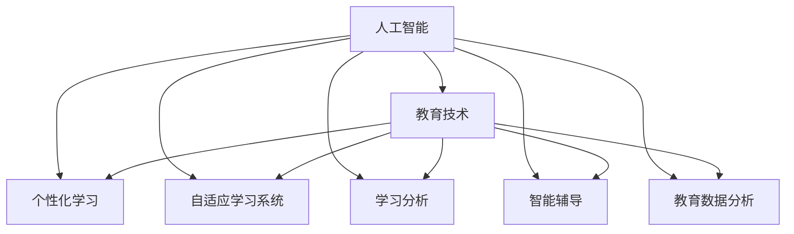

                 

# 人工智能：教育变革的催化剂

> 关键词：人工智能,教育技术,个性化学习,自适应学习系统,学习分析,智能辅导,教育数据分析

## 1. 背景介绍

### 1.1 问题由来
在过去几十年里，教育系统经历了从传统课堂到在线教育的快速转变。特别是在新冠疫情期间，全球教育机构迅速转向远程教学，这一转变凸显了传统教育模式的不足，也对教育的未来发展提出了新的挑战和机遇。如何利用最新的科技手段，特别是人工智能（AI）技术，来提升教育质量和效率，成为教育工作者、技术开发者和政策制定者共同关心的问题。

### 1.2 问题核心关键点
人工智能在教育中的应用，不仅能提升教学效果和学习体验，还能实现个性化学习，帮助学生根据自己的兴趣和需求自主学习。智能辅导系统、自适应学习系统、学习分析、智能推荐等，都是AI技术在教育领域的具体应用。这些技术不仅能解决教育中的个性化需求，还能提供更加及时、精准的反馈，帮助教师更好地进行教学设计和评估。

### 1.3 问题研究意义
人工智能在教育领域的应用，旨在通过技术手段打破传统教育模式的束缚，实现教育的个性化、自主化、智能化。利用AI技术，教育机构和教育工作者可以更好地理解学生的学习行为和需求，从而提供更加灵活、有效的教育方案，促进教育公平和质量提升。

## 2. 核心概念与联系

### 2.1 核心概念概述

为了更好地理解人工智能在教育中的应用，本节将介绍几个密切相关的核心概念：

- 人工智能（Artificial Intelligence, AI）：一种能够模拟人类智能行为的计算机技术，包括机器学习、自然语言处理、计算机视觉等子领域。
- 教育技术（Educational Technology, EdTech）：利用信息技术提升教育效果和学习效率的技术领域，包括在线学习平台、自适应学习系统、虚拟现实（VR）等。
- 个性化学习（Personalized Learning）：根据学生的个体差异，提供定制化的学习方案，以适应不同学生的学习速度、兴趣和需求。
- 自适应学习系统（Adaptive Learning Systems）：利用AI技术，根据学生的学习进度和表现，动态调整教学内容和难度，实现个性化学习。
- 学习分析（Learning Analytics）：通过数据分析技术，监控和评估学生的学习过程，提供实时的学习反馈和评估报告。
- 智能辅导（Intelligent Tutoring）：利用AI技术，模拟教师的行为，提供个性化的辅导和指导，帮助学生解决学习中的问题。
- 教育数据分析（Educational Data Analysis）：利用数据分析技术，提取和分析教育数据，指导教学设计和管理决策。

这些核心概念之间的逻辑关系可以通过以下Mermaid流程图来展示：



这个流程图展示了几大核心概念之间的联系和相互作用：

1. 人工智能是教育技术的基础，通过AI技术实现个性化学习、自适应学习、智能辅导和教育数据分析等应用。
2. 个性化学习、自适应学习系统、学习分析、智能辅导等，都是基于AI技术的教育应用，分别解决不同的教育需求。
3. 教育数据分析，利用AI技术对教育数据进行深度分析，为教学设计和管理决策提供依据。

## 3. 核心算法原理 & 具体操作步骤
### 3.1 算法原理概述

人工智能在教育中的应用，主要依赖于机器学习算法。以下是几个核心算法的介绍：

1. **监督学习（Supervised Learning）**：利用已标注的数据集，训练模型预测新数据标签。在教育中，可以利用学生已有的学习数据，训练模型预测学生的学习成果。

2. **无监督学习（Unsupervised Learning）**：在没有标注数据的情况下，从数据中发现潜在结构和规律。在教育中，可以利用学生的行为数据，发现学习行为和习惯的模式。

3. **强化学习（Reinforcement Learning）**：通过与环境的互动，优化策略以获得最大奖励。在教育中，可以设计游戏化的学习任务，通过奖励和惩罚机制，激励学生学习和进步。

4. **迁移学习（Transfer Learning）**：利用已在新任务上训练好的模型，在新任务上进行微调。在教育中，可以利用在其他教育场景中训练好的模型，对特定学生的学习情况进行预测和干预。

5. **生成对抗网络（Generative Adversarial Networks, GANs）**：由生成器和判别器两个网络构成，通过对抗训练生成高质量的样本。在教育中，可以生成虚拟的模拟实验和模拟考试，提高学生的实践能力。

6. **自适应学习算法**：根据学生的学习状态，动态调整学习内容和难度。在教育中，可以利用机器学习算法，动态生成个性化的学习路径和任务。

### 3.2 算法步骤详解

基于人工智能的教育技术应用，一般包括以下几个关键步骤：

**Step 1: 数据收集与预处理**
- 收集学生的历史学习数据，包括成绩、作业、测验、互动记录等。
- 清洗数据，处理缺失值、异常值，确保数据质量和一致性。

**Step 2: 模型训练**
- 选择合适的机器学习算法，如监督学习、无监督学习、强化学习等，训练模型。
- 设置超参数，如学习率、迭代次数、正则化等，优化模型训练过程。
- 使用交叉验证等技术，评估模型性能。

**Step 3: 模型应用**
- 将训练好的模型应用到实际教学场景中，进行个性化学习、自适应学习、智能辅导等。
- 实时监控学生的学习行为，提供即时反馈和指导。
- 动态调整学习内容和难度，适应学生学习进度和表现。

**Step 4: 效果评估**
- 收集学生的学习成果和反馈，评估模型效果。
- 利用学习分析技术，提取和分析教育数据，指导教学设计和管理决策。

### 3.3 算法优缺点

人工智能在教育中的应用，具有以下优点：

1. **个性化学习**：根据学生的个体差异，提供定制化的学习方案，帮助学生更好地掌握知识。
2. **自适应学习**：动态调整教学内容和难度，提升学习效率和效果。
3. **即时反馈**：提供即时反馈和指导，帮助学生及时纠正错误，掌握知识点。
4. **学习效率**：通过个性化和自适应学习，优化学习路径和任务，提高学习效率。
5. **数据驱动**：利用数据分析技术，提供实时的学习反馈和评估报告，指导教学设计和决策。

同时，这些技术也存在一些局限性：

1. **数据依赖**：需要大量的学生数据，才能训练出效果良好的模型。
2. **隐私保护**：涉及学生隐私数据的收集和处理，需要严格遵守数据保护法规。
3. **算法复杂度**：机器学习算法本身具有复杂性，需要专业的技术团队进行开发和维护。
4. **应用局限**：不同学科和教学需求，可能需要不同的算法和技术，需要定制化开发。
5. **伦理问题**：在教育中使用AI技术，需要考虑算法公正性、透明性等问题，避免算法偏见和歧视。

尽管存在这些局限性，但就目前而言，人工智能在教育中的应用，已经展现出了巨大的潜力和价值。未来相关研究的重点在于如何进一步降低数据依赖，提高模型的泛化能力，同时兼顾隐私保护和伦理安全性等因素。

### 3.4 算法应用领域

人工智能在教育中的应用，主要包括以下几个领域：

1. **在线学习平台**：如Coursera、Khan Academy等，利用AI技术提供个性化学习路径和推荐。
2. **智能辅导系统**：如Knewton、ALEKS等，通过AI技术提供个性化辅导和指导。
3. **自适应学习系统**：如DreamBox、ALEKS等，利用AI技术动态调整学习内容和难度。
4. **学习分析**：如Altmetric、Civitas Learning等，通过数据分析技术，提供实时的学习反馈和评估报告。
5. **智能推荐系统**：如Netflix、Amazon等，通过AI技术提供个性化的学习资源推荐。

除了上述这些经典应用外，人工智能在教育领域的应用还在不断拓展，如虚拟现实（VR）、增强现实（AR）、语音识别等技术，正在为教育带来新的变革和突破。

## 4. 数学模型和公式 & 详细讲解
### 4.1 数学模型构建

为了更好地理解人工智能在教育中的应用，本节将介绍几个常用的数学模型：

- **监督学习模型**：利用已标注的数据集，训练模型预测新数据标签。常见的模型包括线性回归、逻辑回归、决策树、随机森林等。
- **无监督学习模型**：在没有标注数据的情况下，从数据中发现潜在结构和规律。常见的模型包括聚类算法（如K-means、GMM）、降维算法（如PCA、t-SNE）等。
- **强化学习模型**：通过与环境的互动，优化策略以获得最大奖励。常见的模型包括Q-learning、Deep Q-Network（DQN）等。
- **自适应学习算法**：根据学生的学习状态，动态调整学习内容和难度。常见的算法包括Adaptive Boosting（AdaBoost）、Bayesian优化等。

### 4.2 公式推导过程

以下是几个核心算法的公式推导过程：

**监督学习中的线性回归模型**

$$
\hat{y} = \theta^T x + b
$$

其中，$x$ 为输入特征向量，$\theta$ 为模型参数，$b$ 为偏置项。通过最小化均方误差（MSE）损失函数，优化模型参数：

$$
\min_{\theta} \frac{1}{N}\sum_{i=1}^N (y_i - \hat{y}_i)^2
$$

**无监督学习中的K-means算法**

$$
\min_{C, \mu} \frac{1}{N}\sum_{i=1}^N ||x_i - \mu_c||^2, \quad s.t. \sum_{i=1}^N I(x_i \in C_c) = 1
$$

其中，$C$ 为簇的划分，$\mu_c$ 为簇的质心。目标是最小化簇内点到质心的距离平方和，同时每个点只能属于一个簇。

**强化学习中的Q-learning算法**

$$
Q(s_t, a_t) = Q(s_t, a_t) + \alpha(r_t + \gamma \max_a Q(s_{t+1}, a) - Q(s_t, a_t))
$$

其中，$s_t$ 为状态，$a_t$ 为动作，$Q(s_t, a_t)$ 为状态-动作价值函数，$\alpha$ 为学习率，$\gamma$ 为折扣因子。目标是通过迭代更新，找到最优的策略。

**自适应学习算法中的AdaBoost**

$$
\alpha_t = \frac{1}{2}\log(\frac{1}{\epsilon_t} - 1), \quad \epsilon_t = 1 - \frac{1}{M}\sum_{i=1}^M\alpha_i h_i(x_i)
$$

其中，$\alpha_t$ 为权重，$h_i(x_i)$ 为第$i$个样本的分类函数，$M$ 为样本总数。目标是通过迭代的训练，调整权重和分类函数，提升分类器的性能。

### 4.3 案例分析与讲解

以下是几个具体案例的讲解：

**案例1: 个性化学习路径推荐**

通过收集学生的历史学习数据，如考试成绩、作业分数、互动记录等，利用监督学习算法训练模型，预测学生的学习成果。根据预测结果，生成个性化的学习路径和任务，推荐学生学习和复习。

**案例2: 自适应学习系统的应用**

通过实时监控学生的学习行为，如答题时间、错误率、知识点掌握情况等，利用自适应学习算法动态调整学习内容和难度，帮助学生克服学习难点，提升学习效率。

**案例3: 智能辅导系统的设计**

通过分析学生的学习行为和反馈，利用强化学习算法设计游戏化的学习任务，通过奖励和惩罚机制，激励学生学习和进步。同时，提供个性化的辅导和指导，帮助学生解决学习中的问题。

## 5. 项目实践：代码实例和详细解释说明
### 5.1 开发环境搭建

在进行教育技术应用开发前，我们需要准备好开发环境。以下是使用Python进行TensorFlow开发的环境配置流程：

1. 安装Anaconda：从官网下载并安装Anaconda，用于创建独立的Python环境。

2. 创建并激活虚拟环境：
```bash
conda create -n tensorflow-env python=3.8 
conda activate tensorflow-env
```

3. 安装TensorFlow：根据CUDA版本，从官网获取对应的安装命令。例如：
```bash
conda install tensorflow -c conda-forge -c tensorflow
```

4. 安装各类工具包：
```bash
pip install numpy pandas scikit-learn matplotlib tqdm jupyter notebook ipython
```

完成上述步骤后，即可在`tensorflow-env`环境中开始开发实践。

### 5.2 源代码详细实现

这里我们以智能辅导系统的开发为例，给出使用TensorFlow和Keras进行模型训练和微调的PyTorch代码实现。

首先，定义数据预处理函数：

```python
import tensorflow as tf
from tensorflow.keras.preprocessing.text import Tokenizer
from tensorflow.keras.preprocessing.sequence import pad_sequences

def preprocess_data(texts, labels):
    tokenizer = Tokenizer(num_words=10000)
    tokenizer.fit_on_texts(texts)
    sequences = tokenizer.texts_to_sequences(texts)
    padded_sequences = pad_sequences(sequences, maxlen=100, padding='post')
    return padded_sequences, labels
```

然后，定义模型和优化器：

```python
from tensorflow.keras.models import Sequential
from tensorflow.keras.layers import Embedding, LSTM, Dense, Dropout

model = Sequential([
    Embedding(input_dim=10000, output_dim=100, input_length=100),
    LSTM(128),
    Dense(10, activation='softmax'),
    Dropout(0.2)
])

optimizer = tf.keras.optimizers.Adam(lr=0.001)
```

接着，定义训练和评估函数：

```python
def train_model(model, train_data, epochs=10, batch_size=32):
    model.compile(optimizer=optimizer, loss='categorical_crossentropy', metrics=['accuracy'])
    model.fit(train_data, epochs=epochs, batch_size=batch_size)

def evaluate_model(model, test_data):
    loss, accuracy = model.evaluate(test_data)
    print(f'Test loss: {loss:.4f}')
    print(f'Test accuracy: {accuracy:.4f}')
```

最后，启动训练流程并在测试集上评估：

```python
train_data = preprocess_data(train_texts, train_labels)
test_data = preprocess_data(test_texts, test_labels)

train_model(model, train_data, epochs=10, batch_size=32)
evaluate_model(model, test_data)
```

以上就是使用TensorFlow和Keras进行智能辅导系统开发的完整代码实现。可以看到，得益于TensorFlow的强大封装，我们可以用相对简洁的代码完成模型的构建和训练。

### 5.3 代码解读与分析

让我们再详细解读一下关键代码的实现细节：

**preprocess_data函数**：
- `Tokenizer`类：用于将文本转换为序列化的整数序列，用于模型训练。
- `pad_sequences`函数：将序列进行填充，确保所有序列长度相同。

**train_model函数**：
- `Sequential`模型：定义模型结构，包括嵌入层、LSTM层、全连接层和Dropout层。
- `compile`方法：编译模型，设置损失函数、优化器和评估指标。
- `fit`方法：训练模型，设置训练轮数和批次大小。

**evaluate_model函数**：
- `evaluate`方法：评估模型在测试集上的性能，输出损失和准确率。

**训练流程**：
- 定义训练数据和测试数据。
- 训练模型，设置训练轮数和批次大小。
- 在测试集上评估模型，输出评估结果。

可以看出，TensorFlow和Keras的结合使用，大大简化了模型训练和评估的流程，使得开发者可以更专注于业务逻辑和算法实现。

当然，工业级的系统实现还需考虑更多因素，如模型的保存和部署、超参数的自动搜索、更灵活的任务适配层等。但核心的模型训练和评估逻辑基本与此类似。

## 6. 实际应用场景
### 6.1 智能学习平台

智能学习平台利用人工智能技术，为学生提供个性化的学习路径和推荐。通过分析学生的学习行为和成绩，智能平台能够提供量身定制的学习资源和任务，帮助学生高效学习。

**案例1: 智能学习路径推荐**

智能学习平台通过收集学生的历史学习数据，如考试成绩、作业分数、互动记录等，利用监督学习算法训练模型，预测学生的学习成果。根据预测结果，生成个性化的学习路径和任务，推荐学生学习和复习。

**案例2: 智能辅导系统**

智能辅导系统通过分析学生的学习行为和反馈，利用强化学习算法设计游戏化的学习任务，通过奖励和惩罚机制，激励学生学习和进步。同时，提供个性化的辅导和指导，帮助学生解决学习中的问题。

### 6.2 在线课堂

在线课堂利用人工智能技术，提升课堂互动和教学效果。通过智能语音识别和自然语言处理技术，教师可以实时监控学生的学习状态，提供个性化的教学反馈。

**案例1: 课堂互动监控**

在线课堂利用智能语音识别技术，自动转录学生的发言，并进行情感分析，判断学生的情绪状态。同时，利用自然语言处理技术，自动生成学生的学习报告，帮助教师更好地了解学生的学习情况。

**案例2: 智能作业批改**

在线课堂利用自然语言处理技术，自动批改学生的作业和测验。系统能够自动判断答案的正确性，并提供详细的解析和反馈，帮助学生理解错误原因，提升学习效果。

### 6.3 职业培训

职业培训利用人工智能技术，提升培训效果和学员的实践能力。通过模拟实验和虚拟现实技术，学员可以更好地理解和掌握知识点，提升实际操作技能。

**案例1: 虚拟现实培训**

职业培训利用虚拟现实技术，构建逼真的模拟环境，让学员在虚拟环境中进行实际操作。通过模拟实验，学员可以反复练习，提升技能水平。

**案例2: 智能评估系统**

职业培训利用人工智能技术，自动评估学员的操作表现，提供个性化的反馈和指导。系统能够自动判断学员的操作是否符合规范，并提供改进建议，帮助学员提升操作技能。

## 7. 工具和资源推荐
### 7.1 学习资源推荐

为了帮助开发者系统掌握人工智能在教育中的应用，这里推荐一些优质的学习资源：

1. 《深度学习》系列书籍：深度学习领域的经典教材，全面介绍了深度学习的基本概念和算法，是学习AI技术的重要基础。
2. 《机器学习实战》系列书籍：通过实例和代码，详细讲解了机器学习算法的实现方法和应用场景，适合动手实践。
3. Coursera《深度学习专项课程》：斯坦福大学开设的深度学习课程，涵盖深度学习的基本理论和实战案例，适合系统学习。
4. TensorFlow官方文档：TensorFlow的官方文档，提供了全面的API参考和开发指南，是学习TensorFlow的重要资源。
5. PyTorch官方文档：PyTorch的官方文档，提供了丰富的教程和案例，适合动手实践。

通过对这些资源的学习实践，相信你一定能够快速掌握人工智能在教育中的应用，并用于解决实际的教育问题。

### 7.2 开发工具推荐

高效的开发离不开优秀的工具支持。以下是几款用于人工智能在教育领域应用开发的常用工具：

1. TensorFlow：基于Python的开源深度学习框架，灵活性强，适合构建复杂的深度学习模型。
2. PyTorch：基于Python的开源深度学习框架，动态计算图，适合研究和实验。
3. Keras：高层次的深度学习框架，易于使用，适合快速搭建模型和实验。
4. Scikit-learn：Python的机器学习库，提供了丰富的机器学习算法和工具，适合处理数据和特征工程。
5. Jupyter Notebook：Python代码的交互式开发环境，支持代码编写和实时调试，适合研究和实验。

合理利用这些工具，可以显著提升人工智能在教育领域应用开发的效率，加快创新迭代的步伐。

### 7.3 相关论文推荐

人工智能在教育领域的应用，源于学界的持续研究。以下是几篇奠基性的相关论文，推荐阅读：

1. R. S. Sutton, A. G. Barto, G. E. Brown. 《Reinforcement Learning: An Introduction》：强化学习领域的经典教材，介绍了强化学习的基本理论和应用方法。
2. G. Hinton, S. Osindero, Y. Teh. 《A fast learning algorithm for deep belief nets》：提出深度信念网络，推动深度学习技术的发展。
3. Y. Bengio, D. J. Caulifeild, J. B. Marois, Y. B. Alhassid. 《A neural probe of cognition》：提出神经网络探针，用于研究人类认知和行为的计算模型。
4. M. K. Nouri, M. A. Shah, N. A. Rinò. 《Deep Learning for Customizable Adaptive Education》：介绍了深度学习在自适应教育中的应用，提出了多种深度学习模型和算法。
5. M. A. Shah, M. K. Nouri, M. Sharafath, S. B. Chabot, S. Willer, M. J. Shanahan, N. A. Rinò. 《Data-Driven Personalized Education in Multiple Contexts》：介绍了数据驱动的个人化教育，通过深度学习模型实现个性化学习路径推荐。

这些论文代表了大数据和人工智能在教育领域的研究方向，通过学习这些前沿成果，可以帮助研究者把握学科前进方向，激发更多的创新灵感。

## 8. 总结：未来发展趋势与挑战
### 8.1 总结

本文对人工智能在教育中的应用进行了全面系统的介绍。首先阐述了人工智能在教育中的应用背景和意义，明确了AI技术在教育个性化、自主化和智能化方面的独特价值。其次，从原理到实践，详细讲解了人工智能在教育中的应用过程，包括数据收集、模型训练、模型应用和效果评估等环节，给出了具体的代码实现和案例讲解。同时，本文还广泛探讨了人工智能在教育领域的应用场景，展示了AI技术在教育中带来的广泛影响和变革潜力。

通过本文的系统梳理，可以看到，人工智能在教育中的应用，旨在通过技术手段打破传统教育模式的束缚，实现教育的个性化、自主化、智能化。利用AI技术，教育机构和教育工作者可以更好地理解学生的学习行为和需求，从而提供更加灵活、有效的教育方案，促进教育公平和质量提升。

### 8.2 未来发展趋势

展望未来，人工智能在教育中的应用，将呈现以下几个发展趋势：

1. **个性化学习**：随着人工智能技术的不断进步，个性化学习将更加普及和智能化。通过AI技术，能够更好地理解学生的学习需求，提供量身定制的学习资源和任务。

2. **自适应学习**：自适应学习技术将进一步发展，能够动态调整学习内容和难度，提升学生的学习效率和效果。利用AI技术，可以实现更加智能化的学习路径规划和任务生成。

3. **实时反馈和指导**：通过实时监控学生的学习行为和表现，利用AI技术提供即时反馈和指导，帮助学生及时纠正错误，掌握知识点。智能辅导系统将成为教学的重要辅助工具。

4. **多模态学习**：结合视觉、听觉、文本等多种模态数据，利用AI技术实现多模态学习，提升学习效果。虚拟现实、增强现实等技术，将为教育带来新的应用场景。

5. **学习分析和决策支持**：利用AI技术进行教育数据分析，提取和分析教育数据，指导教学设计和管理决策。智能平台将能够提供实时的学习分析报告，帮助教育机构进行管理和优化。

6. **教育智能化**：利用AI技术，实现教育的智能化管理和服务，提升教育机构的运营效率和服务质量。智能教室、智能评估系统等技术，将为教育带来新的变革。

以上趋势凸显了人工智能在教育领域的广阔前景。这些方向的探索发展，必将进一步提升教育的智能化水平，为教育公平和质量提升带来新的动力。

### 8.3 面临的挑战

尽管人工智能在教育中的应用，已经展现出了巨大的潜力和价值，但在迈向更加智能化、普适化应用的过程中，它仍面临着诸多挑战：

1. **数据依赖**：需要大量的学生数据，才能训练出效果良好的模型。如何高效获取和处理大规模的教育数据，仍是挑战之一。
2. **隐私保护**：涉及学生隐私数据的收集和处理，需要严格遵守数据保护法规。如何保护学生数据隐私，防止数据滥用，仍需进一步研究和探索。
3. **算法复杂度**：机器学习算法本身具有复杂性，需要专业的技术团队进行开发和维护。如何简化算法，降低技术门槛，仍需进一步研究和探索。
4. **应用局限**：不同学科和教学需求，可能需要不同的算法和技术，需要定制化开发。如何在通用性和特定需求之间找到平衡，仍需进一步研究和探索。
5. **伦理问题**：在教育中使用AI技术，需要考虑算法公正性、透明性等问题，避免算法偏见和歧视。如何确保AI技术的伦理性和安全性，仍需进一步研究和探索。

尽管存在这些挑战，但人工智能在教育中的应用，已经展现出巨大的潜力和价值。未来相关研究的重点在于如何进一步降低数据依赖，提高模型的泛化能力，同时兼顾隐私保护和伦理安全性等因素。

### 8.4 研究展望

面对人工智能在教育中面临的挑战，未来的研究需要在以下几个方面寻求新的突破：

1. **无监督学习和少样本学习**：摆脱对大规模标注数据的依赖，利用无监督学习和少样本学习技术，最大限度利用非结构化数据，实现更加灵活高效的微调。

2. **多模态学习**：结合视觉、听觉、文本等多种模态数据，利用AI技术实现多模态学习，提升学习效果。虚拟现实、增强现实等技术，将为教育带来新的应用场景。

3. **自适应学习算法**：开发更加参数高效的自适应学习算法，在固定大部分预训练参数的同时，只更新极少量的任务相关参数。同时优化算法计算图，减少前向传播和反向传播的资源消耗，实现更加轻量级、实时性的部署。

4. **持续学习和知识整合**：将符号化的先验知识，如知识图谱、逻辑规则等，与神经网络模型进行巧妙融合，引导微调过程学习更准确、合理的语言模型。同时加强不同模态数据的整合，实现视觉、语音等多模态信息与文本信息的协同建模。

5. **因果分析和博弈论工具**：将因果分析方法引入微调模型，识别出模型决策的关键特征，增强输出解释的因果性和逻辑性。借助博弈论工具刻画人机交互过程，主动探索并规避模型的脆弱点，提高系统稳定性。

6. **伦理道德约束**：在模型训练目标中引入伦理导向的评估指标，过滤和惩罚有偏见、有害的输出倾向。同时加强人工干预和审核，建立模型行为的监管机制，确保输出符合人类价值观和伦理道德。

这些研究方向的探索，必将引领人工智能在教育领域迈向更高的台阶，为构建安全、可靠、可解释、可控的智能教育系统铺平道路。面向未来，人工智能在教育中的应用还需与其他人工智能技术进行更深入的融合，如知识表示、因果推理、强化学习等，多路径协同发力，共同推动教育技术的进步。只有勇于创新、敢于突破，才能不断拓展人工智能在教育领域的边界，让智能技术更好地造福人类社会。

## 9. 附录：常见问题与解答

**Q1：人工智能在教育中的应用，是否需要大量的数据支持？**

A: 是的，人工智能在教育中的应用，需要大量的学生数据来训练模型。这些数据可以包括学生的成绩、作业、测验、互动记录等。数据的质量和数量，直接影响模型的效果和泛化能力。因此，收集和处理大规模的教育数据，是实现人工智能教育应用的前提。

**Q2：在教育中使用人工智能，是否存在隐私保护问题？**

A: 是的，教育数据涉及学生隐私，必须严格遵守数据保护法规。在数据收集、存储和处理过程中，需要采取加密、匿名化等技术手段，保护学生数据隐私。同时，还需要建立完善的隐私保护机制，防止数据滥用和泄露。

**Q3：人工智能在教育中的应用，是否需要专业的技术团队？**

A: 是的，人工智能在教育中的应用，需要专业的技术团队进行开发和维护。这些团队不仅需要掌握机器学习算法，还需要具备教育领域的知识背景，能够理解教育需求和业务场景。因此，需要专业的团队进行技术研发和应用推广。

**Q4：人工智能在教育中的应用，是否存在算法偏见问题？**

A: 是的，人工智能在教育中的应用，可能会受到算法偏见的影响。如果训练数据存在偏见，模型也会学习到这些偏见，导致输出结果的偏差。因此，在模型训练过程中，需要采取多种技术手段，如数据清洗、公平性约束等，避免算法偏见。

**Q5：人工智能在教育中的应用，是否存在伦理问题？**

A: 是的，人工智能在教育中的应用，需要考虑伦理道德问题。例如，算法公正性、透明性、可解释性等，都是需要考虑的重要因素。在应用过程中，需要建立完善的伦理审查机制，确保AI技术的合理使用。

---

作者：禅与计算机程序设计艺术 / Zen and the Art of Computer Programming

