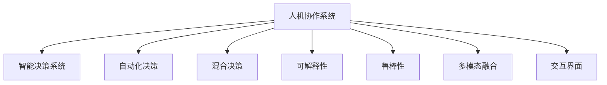

                 

# 人机协作新篇章：共创智能未来

> 关键词：人机协作,智能决策,自动化,数据驱动,机器学习,深度学习,自然语言处理,多模态融合

## 1. 背景介绍

### 1.1 问题由来
随着人工智能技术的快速发展，人机协作已经成为引领未来发展的重要方向。从自动驾驶、智能客服到智慧医疗，人机协作正在全面渗透各行各业。智能决策系统的广泛应用，使得企业在决策过程中不再仅仅依赖人力，而是更多地借助智能算法进行辅助。

然而，现有的人机协作系统往往依赖单一数据源，缺乏跨领域、跨模态的知识整合能力，难以应对复杂多变的现实世界问题。此外，现有的人机交互系统存在自动化程度不高、可解释性差、鲁棒性不足等问题，难以充分发挥智能系统的价值。因此，构建高效、普适、可解释的智能人机协作系统，已经成为当前的迫切需求。

### 1.2 问题核心关键点
人机协作的核心在于将人类与智能系统有机结合起来，发挥各自的优势，构建高效协同的决策支持体系。具体而言，包括以下几个关键点：

1. **自动化程度**：智能系统的自动化程度越高，人机协作系统的效率和准确性越高，能够更好地处理大规模、高复杂度的任务。
2. **可解释性**：智能系统的决策过程越透明、越可解释，人机协作系统的信任度越高，能够更好地满足用户需求。
3. **鲁棒性**：智能系统对异常数据、噪声数据的鲁棒性越强，人机协作系统的稳定性越高，能够更好地应对现实世界的变化。
4. **多模态融合**：智能系统能够融合多种数据源、多种模态的信息，人机协作系统的信息处理能力越强，能够更好地应对复杂、多变的环境。
5. **交互界面**：智能系统的交互界面越友好、越自然，人机协作系统的用户体验越好，能够更好地实现人机协同。

这些关键点共同构成了人机协作系统的核心要求，旨在实现高效、智能、可信的决策支持体系。

## 2. 核心概念与联系

### 2.1 核心概念概述

为更好地理解人机协作系统的构建，本节将介绍几个密切相关的核心概念：

- **人机协作系统**：以人机交互为核心的智能决策系统，通过智能算法对大量数据进行处理和分析，辅助人类进行决策。
- **智能决策系统**：利用人工智能技术，对大量数据进行建模和推理，辅助人类进行决策的系统。
- **自动化决策**：指完全由智能算法完成的决策过程，不需要人工干预。
- **混合决策**：指人机协作的决策过程，智能算法提供辅助建议，最终决策仍由人类完成。
- **可解释性**：指智能算法提供决策过程的解释，便于人类理解和使用。
- **鲁棒性**：指智能算法对噪声、异常数据的鲁棒性，能够保持稳定的性能。
- **多模态融合**：指智能算法能够融合多种数据源、多种模态的信息，提升决策能力。
- **交互界面**：指人机交互的界面设计，影响用户体验和系统易用性。

这些核心概念之间的逻辑关系可以通过以下Mermaid流程图来展示：



这个流程图展示是人机协作系统的核心概念及其之间的关系：

1. 人机协作系统以智能决策系统为核心，实现了混合决策。
2. 智能决策系统可以完全自动化或与人协作完成决策。
3. 智能决策系统的决策过程需要具备可解释性和鲁棒性。
4. 智能决策系统需要融合多种数据源、多种模态的信息。
5. 智能决策系统的交互界面需要设计得友好、自然。

这些概念共同构成了人机协作系统的基础框架，为人机协作系统的设计和实现提供了重要的理论指导。

## 3. 核心算法原理 & 具体操作步骤
### 3.1 算法原理概述

人机协作系统的构建，本质上是一个多层次、多模态的数据融合和处理过程。其核心思想是：通过融合多种数据源、多种模态的信息，利用人工智能算法对数据进行建模和推理，辅助人类进行决策。

形式化地，假设智能决策系统接收的数据集为 $D=\{(x_i,y_i)\}_{i=1}^N$，其中 $x_i$ 表示输入数据，$y_i$ 表示对应的决策标签。智能决策系统的目标是在数据集 $D$ 上进行训练，使得模型输出能够匹配任务标签，从而获得针对特定任务优化的模型。

具体的算法步骤如下：

1. **数据预处理**：对原始数据进行清洗、归一化、特征提取等处理，准备好输入数据。
2. **模型选择与设计**：选择合适的模型结构和算法，如神经网络、决策树、支持向量机等，并设计合适的损失函数和优化器。
3. **模型训练**：在训练集 $D_{train}$ 上训练模型，最小化损失函数，使得模型能够更好地拟合数据。
4. **模型评估与验证**：在验证集 $D_{val}$ 上评估模型性能，调整超参数，防止过拟合。
5. **模型应用**：在测试集 $D_{test}$ 上测试模型性能，评估模型的泛化能力。
6. **人机交互界面设计**：设计友好的交互界面，使人类能够方便地与智能决策系统进行交互。

### 3.2 算法步骤详解

人机协作系统的构建流程较为复杂，涉及多个环节。以下是详细的算法步骤：

**Step 1: 数据预处理**
- 对原始数据进行清洗，去除噪声和异常值。
- 对数据进行归一化，使不同特征的数据具有相同的尺度和范围。
- 进行特征提取，将原始数据转换为模型能够处理的特征向量。
- 对多模态数据进行融合，将不同来源、不同格式的数据整合为统一的特征向量。

**Step 2: 模型选择与设计**
- 选择合适的模型结构，如多层感知器、卷积神经网络、循环神经网络等。
- 设计合适的损失函数，如交叉熵损失、均方误差损失等。
- 选择适合的优化器，如随机梯度下降、Adam、Adagrad等。
- 设置合适的超参数，如学习率、批大小、迭代轮数等。

**Step 3: 模型训练**
- 将训练集 $D_{train}$ 分为若干批次，每次迭代使用一批数据进行训练。
- 在每一批次数据上前向传播计算模型输出。
- 计算输出与真实标签之间的误差，使用反向传播算法计算梯度。
- 根据优化器更新模型参数，最小化损失函数。
- 周期性在验证集上评估模型性能，调整超参数。

**Step 4: 模型评估与验证**
- 在验证集 $D_{val}$ 上测试模型性能，使用常见的评估指标如准确率、召回率、F1-score等。
- 根据验证集性能调整模型结构、超参数、融合方式等。
- 防止模型过拟合，使用正则化技术如L2正则、Dropout等。

**Step 5: 模型应用**
- 在测试集 $D_{test}$ 上测试模型性能，评估模型泛化能力。
- 使用模型对新数据进行预测，生成决策结果。
- 在实际应用中，设计友好的交互界面，使人类能够方便地与智能决策系统进行交互。

**Step 6: 交互界面设计**
- 设计简洁直观的界面，使用户能够方便地输入数据和查看结果。
- 设计可视化工具，使用户能够直观地理解模型的决策过程和结果。
- 设计交互机制，使用户能够对模型输出进行调整和反馈。

### 3.3 算法优缺点

人机协作系统的构建，具有以下优点：

1. **自动化程度高**：智能系统能够处理大量数据，快速生成决策结果，提高决策效率。
2. **多模态融合**：融合多种数据源、多种模态的信息，提升决策能力。
3. **可解释性**：智能系统的决策过程透明，便于人类理解和监督。
4. **鲁棒性强**：智能系统对噪声、异常数据具有鲁棒性，提高系统稳定性。
5. **交互界面友好**：友好的交互界面提高用户体验，提升人机协作系统的易用性。

同时，该方法也存在一些局限性：

1. **数据依赖**：人机协作系统的性能很大程度上依赖于数据的质量和数量，数据收集和处理成本较高。
2. **模型复杂**：复杂的模型结构增加了计算和存储成本，需要高性能的硬件支持。
3. **可解释性差**：某些高级模型（如深度神经网络）的决策过程不透明，难以理解。
4. **鲁棒性不足**：面对复杂、多变的环境，智能系统可能表现出脆弱性。
5. **交互界面限制**：友好的交互界面设计需要大量设计经验和资源。

尽管存在这些局限性，但就目前而言，人机协作系统是实现高效、智能、可信决策支持体系的重要途径。未来相关研究的重点在于如何进一步降低数据依赖，提高模型可解释性，增强系统鲁棒性，优化交互界面等，以进一步提升人机协作系统的性能和应用范围。

### 3.4 算法应用领域

人机协作系统在多个领域具有广泛的应用前景，例如：

- **金融领域**：智能投顾系统、风险评估、信用评分等，通过智能系统辅助金融决策，提升决策效率和准确性。
- **医疗领域**：智能诊断系统、个性化治疗方案推荐等，通过智能系统辅助医疗决策，提升诊断和治疗的精准度。
- **制造业**：智能质检系统、供应链优化等，通过智能系统辅助生产决策，提高生产效率和质量。
- **零售业**：智能推荐系统、库存管理等，通过智能系统辅助零售决策，提升用户体验和运营效率。
- **交通运输**：智能导航系统、交通流量分析等，通过智能系统辅助交通决策，提升交通安全和通行效率。
- **教育领域**：智能辅导系统、学习路径推荐等，通过智能系统辅助教育决策，提升教学效果和学习体验。

除了上述这些经典领域外，人机协作系统还被创新性地应用于更多场景中，如智能城市管理、环境保护、安全监控等，为社会治理带来新的解决方案。随着人工智能技术的不断进步，人机协作系统的应用领域将进一步拓展，为各行各业带来新的变革和机遇。

## 4. 数学模型和公式 & 详细讲解  
### 4.1 数学模型构建

本节将使用数学语言对人机协作系统的构建过程进行更加严格的刻画。

记智能决策系统接收的数据集为 $D=\{(x_i,y_i)\}_{i=1}^N$，其中 $x_i$ 表示输入数据，$y_i$ 表示对应的决策标签。假设智能决策系统在数据集 $D$ 上进行训练，得到最优模型 $M_{\theta}(x)$，其中 $\theta$ 为模型参数。智能决策系统的目标是最小化经验风险，即：

$$
\hat{\theta}=\mathop{\arg\min}_{\theta} \mathcal{L}(\theta,D)
$$

其中 $\mathcal{L}$ 为损失函数，用于衡量模型输出与真实标签之间的差异。常见的损失函数包括交叉熵损失、均方误差损失等。

通过梯度下降等优化算法，智能决策系统不断更新模型参数 $\theta$，最小化损失函数 $\mathcal{L}$，使得模型输出逼近真实标签。

### 4.2 公式推导过程

以下我们以二分类任务为例，推导交叉熵损失函数及其梯度的计算公式。

假设智能决策系统在输入 $x$ 上的输出为 $\hat{y}=M_{\theta}(x) \in [0,1]$，表示样本属于正类的概率。真实标签 $y \in \{0,1\}$。则二分类交叉熵损失函数定义为：

$$
\ell(M_{\theta}(x),y) = -[y\log \hat{y} + (1-y)\log (1-\hat{y})]
$$

将其代入经验风险公式，得：

$$
\mathcal{L}(\theta) = -\frac{1}{N}\sum_{i=1}^N [y_i\log M_{\theta}(x_i)+(1-y_i)\log(1-M_{\theta}(x_i))]
$$

根据链式法则，损失函数对参数 $\theta_k$ 的梯度为：

$$
\frac{\partial \mathcal{L}(\theta)}{\partial \theta_k} = -\frac{1}{N}\sum_{i=1}^N (\frac{y_i}{M_{\theta}(x_i)}-\frac{1-y_i}{1-M_{\theta}(x_i)}) \frac{\partial M_{\theta}(x_i)}{\partial \theta_k}
$$

其中 $\frac{\partial M_{\theta}(x_i)}{\partial \theta_k}$ 可进一步递归展开，利用自动微分技术完成计算。

在得到损失函数的梯度后，即可带入参数更新公式，完成模型的迭代优化。重复上述过程直至收敛，最终得到适应下游任务的最优模型参数 $\theta^*$。

## 5. 项目实践：代码实例和详细解释说明
### 5.1 开发环境搭建

在进行人机协作系统开发前，我们需要准备好开发环境。以下是使用Python进行PyTorch开发的环境配置流程：

1. 安装Anaconda：从官网下载并安装Anaconda，用于创建独立的Python环境。

2. 创建并激活虚拟环境：
```bash
conda create -n pytorch-env python=3.8 
conda activate pytorch-env
```

3. 安装PyTorch：根据CUDA版本，从官网获取对应的安装命令。例如：
```bash
conda install pytorch torchvision torchaudio cudatoolkit=11.1 -c pytorch -c conda-forge
```

4. 安装各类工具包：
```bash
pip install numpy pandas scikit-learn matplotlib tqdm jupyter notebook ipython
```

完成上述步骤后，即可在`pytorch-env`环境中开始人机协作系统的开发。

### 5.2 源代码详细实现

下面我们以金融领域的人机协作系统为例，给出使用Transformers库对BERT模型进行训练的PyTorch代码实现。

首先，定义数据处理函数：

```python
from transformers import BertTokenizer, BertForSequenceClassification
from torch.utils.data import Dataset
import torch

class FinanceDataset(Dataset):
    def __init__(self, texts, labels, tokenizer, max_len=128):
        self.texts = texts
        self.labels = labels
        self.tokenizer = tokenizer
        self.max_len = max_len
        
    def __len__(self):
        return len(self.texts)
    
    def __getitem__(self, item):
        text = self.texts[item]
        label = self.labels[item]
        
        encoding = self.tokenizer(text, return_tensors='pt', max_length=self.max_len, padding='max_length', truncation=True)
        input_ids = encoding['input_ids'][0]
        attention_mask = encoding['attention_mask'][0]
        
        # 对标签进行编码
        encoded_labels = [label2id[label] for label in label2id]
        encoded_labels.extend([label2id['O']] * (self.max_len - len(encoded_labels)))
        labels = torch.tensor(encoded_labels, dtype=torch.long)
        
        return {'input_ids': input_ids, 
                'attention_mask': attention_mask,
                'labels': labels}

# 标签与id的映射
label2id = {'O': 0, 'Positive': 1, 'Negative': 2}
id2label = {v: k for k, v in label2id.items()}

# 创建dataset
tokenizer = BertTokenizer.from_pretrained('bert-base-cased')

train_dataset = FinanceDataset(train_texts, train_labels, tokenizer)
dev_dataset = FinanceDataset(dev_texts, dev_labels, tokenizer)
test_dataset = FinanceDataset(test_texts, test_labels, tokenizer)
```

然后，定义模型和优化器：

```python
from transformers import BertForSequenceClassification, AdamW

model = BertForSequenceClassification.from_pretrained('bert-base-cased', num_labels=len(label2id))

optimizer = AdamW(model.parameters(), lr=2e-5)
```

接着，定义训练和评估函数：

```python
from torch.utils.data import DataLoader
from tqdm import tqdm
from sklearn.metrics import classification_report

device = torch.device('cuda') if torch.cuda.is_available() else torch.device('cpu')
model.to(device)

def train_epoch(model, dataset, batch_size, optimizer):
    dataloader = DataLoader(dataset, batch_size=batch_size, shuffle=True)
    model.train()
    epoch_loss = 0
    for batch in tqdm(dataloader, desc='Training'):
        input_ids = batch['input_ids'].to(device)
        attention_mask = batch['attention_mask'].to(device)
        labels = batch['labels'].to(device)
        model.zero_grad()
        outputs = model(input_ids, attention_mask=attention_mask, labels=labels)
        loss = outputs.loss
        epoch_loss += loss.item()
        loss.backward()
        optimizer.step()
    return epoch_loss / len(dataloader)

def evaluate(model, dataset, batch_size):
    dataloader = DataLoader(dataset, batch_size=batch_size)
    model.eval()
    preds, labels = [], []
    with torch.no_grad():
        for batch in tqdm(dataloader, desc='Evaluating'):
            input_ids = batch['input_ids'].to(device)
            attention_mask = batch['attention_mask'].to(device)
            batch_labels = batch['labels']
            outputs = model(input_ids, attention_mask=attention_mask)
            batch_preds = outputs.logits.argmax(dim=2).to('cpu').tolist()
            batch_labels = batch_labels.to('cpu').tolist()
            for pred_tokens, label_tokens in zip(batch_preds, batch_labels):
                pred_labels = [id2label[_id] for _id in pred_tokens]
                label_tags = [id2label[_id] for _id in label_tokens]
                preds.append(pred_labels[:len(label_tags)])
                labels.append(label_tags)
                
    print(classification_report(labels, preds))
```

最后，启动训练流程并在测试集上评估：

```python
epochs = 5
batch_size = 16

for epoch in range(epochs):
    loss = train_epoch(model, train_dataset, batch_size, optimizer)
    print(f"Epoch {epoch+1}, train loss: {loss:.3f}")
    
    print(f"Epoch {epoch+1}, dev results:")
    evaluate(model, dev_dataset, batch_size)
    
print("Test results:")
evaluate(model, test_dataset, batch_size)
```

以上就是使用PyTorch对BERT进行金融领域人机协作系统微调的完整代码实现。可以看到，得益于Transformers库的强大封装，我们可以用相对简洁的代码完成BERT模型的加载和微调。

### 5.3 代码解读与分析

让我们再详细解读一下关键代码的实现细节：

**FinanceDataset类**：
- `__init__`方法：初始化文本、标签、分词器等关键组件。
- `__len__`方法：返回数据集的样本数量。
- `__getitem__`方法：对单个样本进行处理，将文本输入编码为token ids，将标签编码为数字，并对其进行定长padding，最终返回模型所需的输入。

**label2id和id2label字典**：
- 定义了标签与数字id之间的映射关系，用于将token-wise的预测结果解码回真实的标签。

**训练和评估函数**：
- 使用PyTorch的DataLoader对数据集进行批次化加载，供模型训练和推理使用。
- 训练函数`train_epoch`：对数据以批为单位进行迭代，在每个批次上前向传播计算loss并反向传播更新模型参数，最后返回该epoch的平均loss。
- 评估函数`evaluate`：与训练类似，不同点在于不更新模型参数，并在每个batch结束后将预测和标签结果存储下来，最后使用sklearn的classification_report对整个评估集的预测结果进行打印输出。

**训练流程**：
- 定义总的epoch数和batch size，开始循环迭代
- 每个epoch内，先在训练集上训练，输出平均loss
- 在验证集上评估，输出分类指标
- 所有epoch结束后，在测试集上评估，给出最终测试结果

可以看到，PyTorch配合Transformers库使得BERT微调的代码实现变得简洁高效。开发者可以将更多精力放在数据处理、模型改进等高层逻辑上，而不必过多关注底层的实现细节。

当然，工业级的系统实现还需考虑更多因素，如模型的保存和部署、超参数的自动搜索、更灵活的任务适配层等。但核心的微调范式基本与此类似。

## 6. 实际应用场景
### 6.1 智能投顾系统

基于人机协作系统的智能投顾系统，可以在金融投资决策中发挥重要作用。传统的投资顾问需要耗费大量人力进行市场分析和决策，且准确度和及时性难以保证。通过引入智能投顾系统，投资顾问能够快速获取市场数据和智能分析结果，辅助做出科学投资决策。

在技术实现上，可以收集历史股票数据、经济指标、新闻评论等文本数据，将投资决策（如买入、卖出、持有等）作为监督信号，在此基础上对预训练语言模型进行微调。微调后的模型能够从文本数据中学习市场趋势和专家观点，预测股票价格变化，生成投资建议。

### 6.2 智能诊疗系统

智能诊疗系统可以结合医生的经验和知识，通过智能系统辅助诊断和治疗。传统的医疗决策依赖医生的经验，容易出现误诊和漏诊。通过引入智能诊疗系统，医生能够快速获取患者历史病历、最新研究成果和智能诊断结果，提高诊断的准确性和效率。

在技术实现上，可以收集患者的病历数据、医学文献、医学影像等文本数据，将诊断结果（如疾病类型、治疗方案等）作为监督信号，在此基础上对预训练语言模型进行微调。微调后的模型能够从文本数据中学习疾病的特征和治疗方法，辅助医生进行诊断和治疗。

### 6.3 智能质检系统

智能质检系统可以结合质检员的经验，通过智能系统辅助生产过程的质检。传统的质检依赖质检员的经验，容易出现人为错误和遗漏。通过引入智能质检系统，质检员能够快速获取产品信息和质检标准，提高质检的准确性和效率。

在技术实现上，可以收集产品的描述、技术参数、质检标准等文本数据，将质检结果（如合格、不合格、建议修改等）作为监督信号，在此基础上对预训练语言模型进行微调。微调后的模型能够从文本数据中学习产品的特征和质检标准，辅助质检员进行质检。

### 6.4 未来应用展望

随着人机协作系统的不断发展，其在更多领域将得到广泛应用，为各行各业带来新的解决方案。

在智慧医疗领域，基于人机协作系统的智能诊断和治疗系统将提升医疗服务的智能化水平，辅助医生诊疗，加速新药开发进程。

在智能教育领域，人机协作系统可应用于作业批改、学情分析、知识推荐等方面，因材施教，促进教育公平，提高教学质量。

在智慧城市治理中，人机协作系统可用于城市事件监测、舆情分析、应急指挥等环节，提高城市管理的自动化和智能化水平，构建更安全、高效的未来城市。

此外，在企业生产、社会治理、文娱传媒等众多领域，人机协作系统也将不断涌现，为经济社会发展注入新的动力。相信随着技术的日益成熟，人机协作系统必将在构建人机协同的智能时代中扮演越来越重要的角色。

## 7. 工具和资源推荐
### 7.1 学习资源推荐

为了帮助开发者系统掌握人机协作系统的理论基础和实践技巧，这里推荐一些优质的学习资源：

1. 《深度学习基础》系列课程：由Google开发者社区提供的入门级深度学习课程，覆盖从基础到进阶的内容，帮助初学者快速上手。

2. 《机器学习实战》书籍：权威的机器学习实战指南，结合大量案例，帮助读者深入理解机器学习算法和应用。

3. 《Python深度学习》书籍：由TensorFlow核心开发者撰写，全面介绍了深度学习在Python中的实现和应用，涵盖多个领域的案例。

4. Kaggle平台：提供丰富的数据集和竞赛，帮助读者在实战中提升技能，同时了解前沿技术和应用。

5. TensorFlow官方文档：提供详细的API文档和代码示例，帮助开发者快速上手TensorFlow框架。

通过对这些资源的学习实践，相信你一定能够快速掌握人机协作系统的精髓，并用于解决实际的业务问题。
###  7.2 开发工具推荐

高效的开发离不开优秀的工具支持。以下是几款用于人机协作系统开发常用的工具：

1. PyTorch：基于Python的开源深度学习框架，灵活动态的计算图，适合快速迭代研究。大部分预训练语言模型都有PyTorch版本的实现。

2. TensorFlow：由Google主导开发的开源深度学习框架，生产部署方便，适合大规模工程应用。同样有丰富的预训练语言模型资源。

3. Transformers库：HuggingFace开发的NLP工具库，集成了众多SOTA语言模型，支持PyTorch和TensorFlow，是进行人机协作系统开发的利器。

4. Weights & Biases：模型训练的实验跟踪工具，可以记录和可视化模型训练过程中的各项指标，方便对比和调优。与主流深度学习框架无缝集成。

5. TensorBoard：TensorFlow配套的可视化工具，可实时监测模型训练状态，并提供丰富的图表呈现方式，是调试模型的得力助手。

6. Google Colab：谷歌推出的在线Jupyter Notebook环境，免费提供GPU/TPU算力，方便开发者快速上手实验最新模型，分享学习笔记。

合理利用这些工具，可以显著提升人机协作系统的开发效率，加快创新迭代的步伐。

### 7.3 相关论文推荐

人机协作系统的构建源于学界的持续研究。以下是几篇奠基性的相关论文，推荐阅读：

1. Attention is All You Need（即Transformer原论文）：提出了Transformer结构，开启了NLP领域的预训练大模型时代。

2. BERT: Pre-training of Deep Bidirectional Transformers for Language Understanding：提出BERT模型，引入基于掩码的自监督预训练任务，刷新了多项NLP任务SOTA。

3. AlphaGo Zero: Mastering the Game of Go without Human Knowledge：提出AlphaGo Zero算法，通过自我对弈学习，取得了围棋领域的新突破，展示了深度强化学习的潜力。

4. Deep Speech 2: End-to-End Speech Recognition in English and Mandarin：提出Deep Speech 2算法，通过端到端语音识别，显著提升了语音识别的准确性，展示了深度学习在语音处理中的应用。

5. GANs Trained by a Two Time-Scale Update Rule Converge to the Semi-Equilibrium：提出生成对抗网络（GAN），通过对抗训练，生成逼真的图像，展示了深度生成模型在图像处理中的应用。

这些论文代表了大模型和强化学习的研究进展，为人机协作系统的构建提供了重要的理论基础。通过学习这些前沿成果，可以帮助研究者把握学科前进方向，激发更多的创新灵感。

## 8. 总结：未来发展趋势与挑战

### 8.1 总结

本文对基于人机协作的智能决策系统进行了全面系统的介绍。首先阐述了人机协作系统的研究背景和意义，明确了人机协作系统在提升决策效率、增强决策能力方面的独特价值。其次，从原理到实践，详细讲解了人机协作系统的数学原理和关键步骤，给出了人机协作系统开发的完整代码实例。同时，本文还广泛探讨了人机协作系统在金融、医疗、制造、零售等多个领域的应用前景，展示了人机协作系统的巨大潜力。此外，本文精选了人机协作系统的各类学习资源，力求为读者提供全方位的技术指引。

通过本文的系统梳理，可以看到，人机协作系统正在成为智能决策的重要途径，极大地拓展了人工智能的应用边界，催生了更多业务价值的产生。未来，伴随人工智能技术的不断进步，人机协作系统必将在更多领域得到应用，为经济社会发展注入新的动力。

### 8.2 未来发展趋势

展望未来，人机协作系统将呈现以下几个发展趋势：

1. **多模态融合**：未来的智能决策系统将能够融合多种数据源、多种模态的信息，提升决策能力。多模态信息的整合，将使系统能够更全面地理解现实世界。
2. **自动化程度提高**：随着预训练语言模型的不断发展，智能决策系统的自动化程度将不断提高，能够在更短的时间内生成更准确的决策结果。
3. **可解释性增强**：未来的智能决策系统将具备更强的可解释性，便于人类理解和监督。可解释性的提升，将使智能决策系统更加可信。
4. **鲁棒性增强**：智能决策系统对噪声、异常数据的鲁棒性将进一步增强，能够应对复杂、多变的环境。
5. **交互界面优化**：友好的交互界面设计将提高用户体验，提升人机协作系统的易用性。

以上趋势凸显了人机协作系统的广阔前景。这些方向的探索发展，必将进一步提升智能决策系统的性能和应用范围，为各行各业带来新的变革和机遇。

### 8.3 面临的挑战

尽管人机协作系统已经取得了瞩目成就，但在迈向更加智能化、普适化应用的过程中，它仍面临着诸多挑战：

1. **数据依赖**：人机协作系统的性能很大程度上依赖于数据的质量和数量，数据收集和处理成本较高。
2. **模型复杂**：复杂的模型结构增加了计算和存储成本，需要高性能的硬件支持。
3. **可解释性差**：某些高级模型（如深度神经网络）的决策过程不透明，难以理解。
4. **鲁棒性不足**：面对复杂、多变的环境，智能系统可能表现出脆弱性。
5. **交互界面限制**：友好的交互界面设计需要大量设计经验和资源。

尽管存在这些局限性，但就目前而言，人机协作系统是实现高效、智能、可信决策支持体系的重要途径。未来相关研究的重点在于如何进一步降低数据依赖，提高模型可解释性，增强系统鲁棒性，优化交互界面等，以进一步提升人机协作系统的性能和应用范围。

### 8.4 研究展望

面对人机协作系统所面临的挑战，未来的研究需要在以下几个方面寻求新的突破：

1. **探索无监督和半监督人机协作方法**：摆脱对大规模标注数据的依赖，利用自监督学习、主动学习等无监督和半监督范式，最大限度利用非结构化数据，实现更加灵活高效的人机协作。
2. **研究参数高效和人机协作方法**：开发更加参数高效的人机协作方法，在固定大部分预训练参数的同时，只更新极少量的任务相关参数。
3. **融合因果和对比学习范式**：通过引入因果推断和对比学习思想，增强人机协作系统建立稳定因果关系的能力，学习更加普适、鲁棒的语言表征。
4. **引入更多先验知识**：将符号化的先验知识，如知识图谱、逻辑规则等，与人机协作模型进行巧妙融合，引导人机协作过程学习更准确、合理的语言模型。
5. **结合因果分析和博弈论工具**：将因果分析方法引入人机协作系统，识别出模型决策的关键特征，增强输出解释的因果性和逻辑性。借助博弈论工具刻画人机交互过程，主动探索并规避模型的脆弱点，提高系统稳定性。
6. **纳入伦理道德约束**：在人机协作系统的训练目标中引入伦理导向的评估指标，过滤和惩罚有偏见、有害的输出倾向。同时加强人工干预和审核，建立模型行为的监管机制，确保输出符合人类价值观和伦理道德。

这些研究方向的探索，必将引领人机协作系统迈向更高的台阶，为构建安全、可靠、可解释、可控的智能系统铺平道路。面向未来，人机协作系统还需要与其他人工智能技术进行更深入的融合，如知识表示、因果推理、强化学习等，多路径协同发力，共同推动智能交互系统的进步。只有勇于创新、敢于突破，才能不断拓展人机协作系统的边界，让人工智能技术更好地造福人类社会。

## 9. 附录：常见问题与解答

**Q1：人机协作系统是否适用于所有决策任务？**

A: 人机协作系统在大多数决策任务上都能取得不错的效果，特别是对于数据量较小的任务。但对于一些特定领域的任务，如医学、法律等，仅仅依靠通用语料预训练的模型可能难以很好地适应。此时需要在特定领域语料上进一步预训练，再进行微调，才能获得理想效果。此外，对于一些需要时效性、个性化很强的任务，如对话、推荐等，人机协作方法也需要针对性的改进优化。

**Q2：人机协作系统如何缓解自动化程度低的问题？**

A: 人机协作系统自动化程度低的主要原因是模型的预训练数据集不充分或模型设计不合理。为了缓解自动化程度低的问题，可以采取以下措施：
1. 增加预训练数据集的规模和多样性，确保模型能够学习到更丰富的语言表示。
2. 设计更合理的模型结构和损失函数，确保模型能够更好地适应任务需求。
3. 引入多任务学习或联合训练，提升模型的泛化能力和自动化程度。

**Q3：人机协作系统如何增强可解释性？**

A: 人机协作系统的可解释性可以通过以下措施增强：
1. 设计简洁直观的界面，使用户能够方便地理解模型的输出结果。
2. 使用可视化工具，使用户能够直观地理解模型的决策过程。
3. 提供详细的解释文档，使用户能够理解模型的训练和推理过程。
4. 设计友好的交互机制，使用户能够对模型输出进行调整和反馈。

**Q4：人机协作系统如何提高鲁棒性？**

A: 人机协作系统的鲁棒性可以通过以下措施提高：
1. 使用正则化技术，如L2正则、Dropout等，防止模型过拟合。
2. 引入对抗训练，通过对抗样本提高模型的鲁棒性。
3. 设计多模型集成，通过融合多个模型的输出结果提高鲁棒性。
4. 使用自适应学习算法，如AdaLoRA、LoRA等，提高模型对噪声和异常数据的鲁棒性。

**Q5：人机协作系统如何设计友好的交互界面？**

A: 友好的交互界面设计需要考虑以下几个方面：
1. 简洁直观的界面布局，使用户能够快速找到所需功能。
2. 友好的交互语言和提示，使用户能够方便地理解系统的操作方式。
3. 实时反馈和提示，使用户能够及时了解系统的操作结果和状态。
4. 多种输入方式，如语音、文本、图像等，使用户能够方便地与系统进行交互。
5. 可自定义的选项和设置，使用户能够根据自己的需求进行个性化定制。

通过以上措施，可以设计出友好的交互界面，提升人机协作系统的易用性和用户体验。

---

作者：禅与计算机程序设计艺术 / Zen and the Art of Computer Programming

