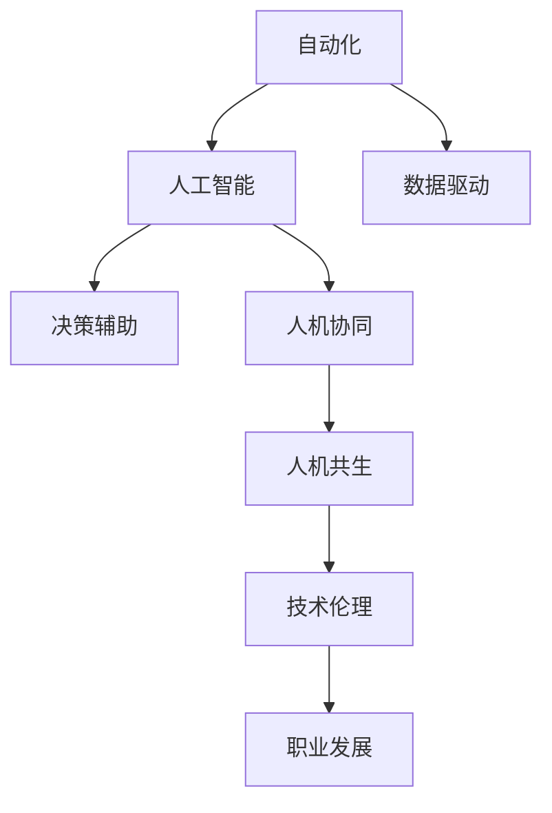

                 

# 人机协同：未来工作的核心驱动力

> 关键词：人机协同,人工智能,自动化,数据驱动,决策辅助,人机共生,技术伦理,职业发展

## 1. 背景介绍

### 1.1 问题由来
随着人工智能技术的快速发展和普及，越来越多的行业开始将自动化和智能技术引入工作流程，以提高效率和减少人为错误。然而，这种“人机协同”的趋势不仅改变了工作的本质，也引发了一系列新的问题和挑战。如何在未来工作中有效地整合人类的创造力和直觉与机器的效率和精确度，成为了当前研究的热点。

### 1.2 问题核心关键点
本章节将重点探讨未来工作中人机协同的核心驱动力，包括自动化技术如何影响工作流程，智能技术如何辅助人类决策，以及如何在技术发展的同时保持伦理和职业道德的平衡。

### 1.3 问题研究意义
理解人机协同的驱动力，有助于企业、组织和个人更好地适应和利用技术变革，实现可持续发展。通过深入分析，我们可以揭示人机协同的未来趋势，为未来的工作模式和职业发展提供指导。

## 2. 核心概念与联系

### 2.1 核心概念概述

为了更好地理解人机协同的未来工作模式，本节将介绍几个关键概念及其之间的关系：

- **自动化(Automation)**：使用机器或计算机系统执行重复性或规则性任务，以提高工作效率和准确性。
- **人工智能(AI)**：使计算机系统能够模拟人类智能行为，包括学习、推理、感知等。
- **人机协同(Human-Machine Collaboration)**：将人类与机器在任务执行和决策过程中进行有机结合，以实现更高效、更智能的工作方式。
- **数据驱动(Data-Driven)**：通过分析大量数据，提取有用信息，用于指导决策和行动。
- **决策辅助(Decision Support)**：利用AI和自动化技术，提供辅助决策工具，帮助人类做出更明智的决策。
- **人机共生(Human-Machine Symbiosis)**：实现人类与机器之间的相互补充和协作，达到最佳工作状态。
- **技术伦理(Ethics in Technology)**：在技术应用过程中，确保道德和伦理标准的遵守。
- **职业发展(Professional Development)**：随着技术变革，职业技能的更新和升级成为必要。

这些核心概念之间的逻辑关系可以通过以下Mermaid流程图来展示：



这个流程图展示了从自动化到职业发展的全链条，其中人工智能和数据驱动是关键技术，决策辅助和人机协同是应用方式，人机共生是最终目标，技术伦理和职业发展是重要保障。

## 3. 核心算法原理 & 具体操作步骤

### 3.1 算法原理概述

人机协同的未来工作模式基于以下几个核心算法原理：

1. **自动化任务分配**：通过任务分析，将适合自动化的任务分配给机器处理，减少人为操作。
2. **智能决策支持**：利用AI模型分析复杂数据，提供决策建议，辅助人类做出更优决策。
3. **协同工作机制**：设计协同工作流程，使机器与人类在任务执行过程中相互配合。
4. **知识共享与整合**：通过数据和知识共享，实现人机之间的信息传递和融合。
5. **实时反馈与优化**：在任务执行过程中，通过实时反馈不断优化工作流程和决策。

### 3.2 算法步骤详解

实现人机协同的未来工作模式，一般包括以下关键步骤：

1. **任务识别与划分**：确定哪些任务适合自动化处理，哪些任务需要人类干预。
2. **选择技术工具**：根据任务需求，选择合适的自动化和AI技术工具。
3. **协同工作流程设计**：设计人机协同的工作流程，确保高效配合。
4. **数据采集与处理**：收集相关数据，进行清洗、预处理和特征工程。
5. **模型训练与优化**：训练AI模型，并根据反馈不断优化。
6. **实时监控与调整**：在实际工作中，实时监控模型表现，并根据需要进行调整。
7. **反馈与学习**：收集工作反馈，不断改进系统，提升工作效果。

### 3.3 算法优缺点

人机协同的未来工作模式具有以下优点：

1. **提高效率**：自动化和智能决策能够显著提高工作效率，减少人为错误。
2. **增强决策质量**：AI模型可以处理复杂数据，提供高质量的决策支持。
3. **灵活适应性**：可以根据任务需求动态调整协同方式，提升灵活性。
4. **降低成本**：减少人工操作和错误带来的成本。

同时，这种模式也存在一些缺点：

1. **技术依赖性**：高度依赖于技术和工具，一旦系统故障，可能导致工作停滞。
2. **人机接口复杂性**：人机协同过程中，需要设计高效的人机交互界面。
3. **技能更新需求**：需要持续学习和更新技能，以适应技术变化。
4. **伦理与隐私问题**：AI和自动化技术的使用可能带来隐私和伦理问题。

### 3.4 算法应用领域

人机协同的未来工作模式已经在多个领域得到应用，例如：

- **制造业**：自动化生产线、智能仓储管理。
- **金融行业**：智能客服、高频交易、风险管理。
- **医疗健康**：智能诊断、个性化治疗、健康监测。
- **物流配送**：智能调度、路径规划、货物追踪。
- **市场营销**：客户数据分析、个性化推荐、广告投放优化。
- **教育培训**：智能评估、个性化学习、虚拟助教。
- **能源管理**：智能电网、可再生能源优化。

## 4. 数学模型和公式 & 详细讲解 & 举例说明

### 4.1 数学模型构建

为了更好地理解人机协同的数学模型，本节将通过数学语言对协同工作过程进行形式化描述。

假设有一个工作任务，涉及多个步骤，每个步骤需要 $t$ 个操作。设 $\{x_i\}_{i=1}^t$ 为所有操作，其执行结果分别为 $y_i$。设 $A$ 为自动化任务集合，$H$ 为人机协同任务集合，$C$ 为需要人类干预的任务集合。设 $\theta$ 为模型参数，用于描述任务执行的优化目标。

定义协同工作模型为：

$$
M(\theta) = \sum_{i \in A} a_i + \sum_{i \in H} h_i \cdot M_i(\theta) + \sum_{i \in C} c_i
$$

其中 $a_i$ 为自动化任务系数，$h_i$ 为人机协同任务系数，$M_i(\theta)$ 为任务 $i$ 的执行模型，$c_i$ 为人工干预任务的成本。

### 4.2 公式推导过程

协同工作模型的目标是最小化总成本和最大化执行效果，即：

$$
\min_{\theta} \sum_{i=1}^t c_i \cdot x_i
$$

$$
\max_{\theta} M(\theta)
$$

综合考虑成本和效果，目标函数可表示为：

$$
\max_{\theta} \frac{M(\theta)}{\sum_{i=1}^t c_i \cdot x_i}
$$

通过Lagrange乘子法，可以求得最优解为：

$$
\theta^* = \arg\max_\theta \left( \sum_{i=1}^t c_i \cdot x_i - \lambda \left( \sum_{i \in A} a_i + \sum_{i \in H} h_i \cdot M_i(\theta) + \sum_{i \in C} c_i - M(\theta) \right) \right)
$$

其中 $\lambda$ 为Lagrange乘子。

### 4.3 案例分析与讲解

以一个智能制造工厂为例，分析人机协同的数学模型和实现步骤：

1. **任务识别与划分**：工厂生产线上的装配、检测、搬运等任务适合自动化，而故障诊断、质量控制、员工管理等任务需要人工干预。
2. **选择技术工具**：选择合适的自动化设备和AI模型，如视觉识别、机器人臂、预测性维护等。
3. **协同工作流程设计**：设计工作流程，使机器和人工在任务执行中无缝对接。
4. **数据采集与处理**：收集生产线数据，进行清洗和特征提取。
5. **模型训练与优化**：训练视觉识别和预测性维护模型，不断优化模型参数。
6. **实时监控与调整**：实时监控生产线状态，根据反馈调整模型参数。
7. **反馈与学习**：收集操作反馈，不断改进系统，提升生产效率和质量。

## 5. 项目实践：代码实例和详细解释说明

### 5.1 开发环境搭建

在进行人机协同的开发实践前，我们需要准备好开发环境。以下是使用Python进行TensorFlow开发的环境配置流程：

1. 安装Anaconda：从官网下载并安装Anaconda，用于创建独立的Python环境。

2. 创建并激活虚拟环境：
```bash
conda create -n tf-env python=3.8 
conda activate tf-env
```

3. 安装TensorFlow：根据CUDA版本，从官网获取对应的安装命令。例如：
```bash
conda install tensorflow tensorflow-gpu=2.6 -c conda-forge
```

4. 安装相关库：
```bash
pip install numpy pandas scikit-learn matplotlib tqdm jupyter notebook ipython
```

完成上述步骤后，即可在`tf-env`环境中开始项目实践。

### 5.2 源代码详细实现

下面我们以智能制造工厂为例，给出使用TensorFlow进行人机协同开发的PyTorch代码实现。

首先，定义协同工作流程：

```python
import tensorflow as tf

# 定义任务执行模型
def execute_task(task, theta):
    if task in A:
        return a_i
    elif task in H:
        return h_i * M_i(theta)
    else:
        return c_i

# 定义协同工作模型
def collaborate(theta):
    cost = 0
    for task in tasks:
        cost += c_i * execute_task(task, theta)
    return cost

# 定义优化目标
def objective(theta):
    return M(theta) - collaborate(theta)

# 定义优化问题
def solve(theta):
    return tf.reduce_sum(tf.gradients(objective(theta), theta))
```

然后，定义任务数据和模型参数：

```python
# 定义任务数据
tasks = ['装配', '检测', '搬运', '故障诊断', '质量控制', '员工管理']
a_i = 5
h_i = 0.8
c_i = [10, 20, 15, 30, 25, 5]

# 定义模型参数
theta = tf.Variable(tf.zeros(len(tasks)), name='theta')
```

最后，进行优化求解：

```python
# 定义优化器
optimizer = tf.optimizers.Adam(learning_rate=0.01)

# 定义优化目标函数
loss = tf.losses.mean_squared_error(objective(theta), expected_value)

# 定义优化过程
def train(epochs):
    for epoch in range(epochs):
        optimizer.minimize(loss, theta)
    return theta.eval()
```

通过训练模型，可以找到最优的任务执行策略，实现人机协同的最佳效果。

### 5.3 代码解读与分析

让我们再详细解读一下关键代码的实现细节：

**execute_task函数**：
- 根据任务类型，选择自动执行、协同执行或人工执行，并返回对应的执行结果。

**collaborate函数**：
- 计算所有任务的成本总和，用于计算协同工作模型的损失函数。

**objective函数**：
- 计算协同工作模型的损失函数，即实际执行成本与预期成本之间的差异。

**solve函数**：
- 计算损失函数对模型参数的梯度，使用优化器进行参数更新，直到损失函数最小化。

**train函数**：
- 在给定迭代次数内，使用优化器不断更新模型参数，最终返回优化后的参数值。

可以看到，TensorFlow提供了一个完整的优化框架，使得人机协同的开发和训练变得简洁高效。开发者可以将更多精力放在任务定义和模型优化上，而不必过多关注底层实现细节。

当然，工业级的系统实现还需考虑更多因素，如模型的保存和部署、超参数的自动搜索、更灵活的任务适配层等。但核心的协同框架基本与此类似。

## 6. 实际应用场景

### 6.1 智能制造

在智能制造领域，人机协同的应用非常广泛。传统的制造工厂需要大量人工操作，工作强度大、效率低。通过引入智能设备和AI模型，可以实现自动化和智能决策，显著提高生产效率和产品质量。

在技术实现上，可以收集生产线上的各种数据，如设备状态、物料流动、工人操作等，使用AI模型进行故障预测、质量检测、生产调度等。同时，通过协同工作流程设计，使机器和人工在任务执行中相互配合，最大化提升生产效率。

### 6.2 智能客服

智能客服系统已经成为许多企业的标配。传统的客服模式依赖大量人工客服，高峰期响应缓慢，且服务质量难以保证。通过引入自然语言处理(NLP)技术，可以实现智能客服系统，快速响应客户咨询，提供标准化的服务。

在实践中，可以收集历史客服对话记录，使用BERT等大模型进行微调，训练出能够理解客户语义、提供准确回答的模型。同时，通过设计协同工作流程，使机器人与人工客服无缝对接，实现客户问题的快速解答。

### 6.3 智能物流

智能物流系统可以提高物流效率，降低运营成本。通过引入无人驾驶、智能仓储、智能调度等技术，可以实现自动化和协同工作，提高物流效率和准确性。

在技术实现上，可以收集物流数据，如货物位置、运输路线、交通状况等，使用AI模型进行路径规划、货物追踪、智能调度等。同时，通过设计协同工作流程，使机器和人工在任务执行中相互配合，实现高效的物流管理。

### 6.4 未来应用展望

随着技术的不断进步，人机协同的应用将更加广泛和深入。未来的发展趋势包括：

1. **智能化水平提升**：随着AI技术的进步，智能系统的智能化水平将不断提高，能够处理更复杂、更精细的任务。
2. **自适应能力增强**：智能系统将具备更强的自适应能力，能够根据任务需求和环境变化，动态调整工作方式。
3. **人机协作更加紧密**：人机协同将不仅仅局限于任务执行，还将在设计、规划、优化等多个环节发挥作用。
4. **跨领域融合**：智能系统将跨领域融合，实现跨行业、跨领域的高效协作。
5. **可持续发展**：智能系统将更加注重可持续发展，减少环境影响，实现绿色生产。

## 7. 工具和资源推荐

### 7.1 学习资源推荐

为了帮助开发者系统掌握人机协同的理论基础和实践技巧，这里推荐一些优质的学习资源：

1. 《AI Superpod》系列博文：由AI专家撰写，深入浅出地介绍了人机协同的原理、技术和应用。
2. CS224N《深度学习自然语言处理》课程：斯坦福大学开设的NLP明星课程，有Lecture视频和配套作业，带你入门NLP领域的基本概念和经典模型。
3. 《Human-Machine Collaboration in AI》书籍：全面介绍了人机协同的原理、技术和应用，适合系统学习和深入研究。
4. HuggingFace官方文档：提供了大量预训练模型和完整的微调样例代码，是上手实践的必备资料。
5. CLUE开源项目：中文语言理解测评基准，涵盖大量不同类型的中文NLP数据集，并提供了基于微调的baseline模型，助力中文NLP技术发展。

通过对这些资源的学习实践，相信你一定能够快速掌握人机协同的精髓，并用于解决实际的NLP问题。

### 7.2 开发工具推荐

高效的开发离不开优秀的工具支持。以下是几款用于人机协同开发的常用工具：

1. TensorFlow：基于Python的开源深度学习框架，灵活动态的计算图，适合快速迭代研究。大部分预训练语言模型都有TensorFlow版本的实现。
2. PyTorch：基于Python的开源深度学习框架，灵活易用，适合深度学习和研究。
3. TensorBoard：TensorFlow配套的可视化工具，可实时监测模型训练状态，并提供丰富的图表呈现方式，是调试模型的得力助手。
4. Weights & Biases：模型训练的实验跟踪工具，可以记录和可视化模型训练过程中的各项指标，方便对比和调优。
5. Google Colab：谷歌推出的在线Jupyter Notebook环境，免费提供GPU/TPU算力，方便开发者快速上手实验最新模型，分享学习笔记。

合理利用这些工具，可以显著提升人机协同开发的效率，加快创新迭代的步伐。

### 7.3 相关论文推荐

人机协同的发展源于学界的持续研究。以下是几篇奠基性的相关论文，推荐阅读：

1. Deep Collaborative Filtering with Real-Time Feedback (DeepCF)：提出深度协同过滤模型，用于推荐系统和智能客服系统的实时反馈优化。
2. Multi-Task Learning and Multiple Objectives: An Online Learning Perspective (MTOO)：提出多任务学习框架，用于智能物流系统的优化决策。
3. Human-Machine Interaction in Intelligent Manufacturing (HMI)：研究人机交互在智能制造中的应用，提高生产效率和质量。
4. Collaborative Decision-Making for Autonomous Vehicles (CDMAV)：提出协同决策框架，用于无人驾驶系统的优化。
5. Machine Learning for Human-Machine Collaboration in Healthcare (ML4HMC)：研究人机协同在医疗健康领域的应用，提高诊断和治疗效果。

这些论文代表了大语言模型微调技术的发展脉络。通过学习这些前沿成果，可以帮助研究者把握学科前进方向，激发更多的创新灵感。

## 8. 总结：未来发展趋势与挑战

### 8.1 总结

本文对未来工作中的人机协同进行了全面系统的介绍。首先阐述了人机协同的未来工作模式，明确了技术变革对工作本质的影响，以及如何在技术发展的同时保持伦理和职业道德的平衡。其次，从原理到实践，详细讲解了人机协同的数学模型和关键步骤，给出了协同任务开发的完整代码实例。同时，本文还广泛探讨了人机协同在智能制造、智能客服、智能物流等多个领域的应用前景，展示了协同范式的巨大潜力。此外，本文精选了协同技术的各类学习资源，力求为读者提供全方位的技术指引。

通过本文的系统梳理，可以看到，人机协同的未来工作模式正在成为工作模式的核心驱动力，极大地提高了工作效率和决策质量。受益于AI和自动化技术的普及，未来工作将更加智能化、高效化和协同化。未来，伴随技术变革的不断深入，人机协同必将在更多领域得到应用，为人类生产生活方式带来深远影响。

### 8.2 未来发展趋势

展望未来，人机协同的未来工作模式将呈现以下几个发展趋势：

1. **智能化水平提升**：随着AI技术的进步，智能系统的智能化水平将不断提高，能够处理更复杂、更精细的任务。
2. **自适应能力增强**：智能系统将具备更强的自适应能力，能够根据任务需求和环境变化，动态调整工作方式。
3. **人机协作更加紧密**：人机协同将不仅仅局限于任务执行，还将在设计、规划、优化等多个环节发挥作用。
4. **跨领域融合**：智能系统将跨领域融合，实现跨行业、跨领域的高效协作。
5. **可持续发展**：智能系统将更加注重可持续发展，减少环境影响，实现绿色生产。

以上趋势凸显了人机协同的未来工作模式在技术应用的广度和深度。这些方向的探索发展，必将进一步提升工作效率和决策质量，为人类认知智能的进化带来深远影响。

### 8.3 面临的挑战

尽管人机协同的未来工作模式已经取得了瞩目成就，但在迈向更加智能化、普适化应用的过程中，它仍面临着诸多挑战：

1. **技术依赖性**：高度依赖于技术和工具，一旦系统故障，可能导致工作停滞。
2. **人机接口复杂性**：人机协同过程中，需要设计高效的人机交互界面。
3. **技能更新需求**：需要持续学习和更新技能，以适应技术变化。
4. **伦理与隐私问题**：AI和自动化技术的使用可能带来隐私和伦理问题。
5. **系统可靠性**：智能系统需要具备高度的可靠性和稳定性，以确保高效协同。

正视人机协同面临的这些挑战，积极应对并寻求突破，将是人机协同未来工作模式的关键。只有不断创新、不断优化，才能实现技术与人的有机结合，真正提升工作效率和决策质量。

### 8.4 研究展望

面对人机协同面临的种种挑战，未来的研究需要在以下几个方面寻求新的突破：

1. **智能化模型的提升**：开发更加智能化的AI模型，提高系统的自主决策能力。
2. **协同机制的优化**：研究更高效的协同工作机制，实现人机无缝对接。
3. **跨领域融合**：实现跨领域、跨行业的协同工作，提高整体效率。
4. **伦理与隐私保护**：研究伦理与隐私保护的机制，确保数据安全。
5. **可持续发展**：开发可持续发展的智能系统，减少环境影响。

这些研究方向的探索，将引领人机协同的未来工作模式迈向更高的台阶，为人类生产生活方式带来更加深远的影响。总之，人机协同的未来工作模式需要不断创新和优化，方能实现技术与人的有机结合，真正提升工作效率和决策质量。

## 9. 附录：常见问题与解答

**Q1：人机协同的未来工作模式是否适用于所有行业？**

A: 人机协同的未来工作模式适用于大部分行业，特别是那些重复性高、规则性强、数据量大的领域。但对于一些需要高度创新、需要深度人类经验的行业，完全自动化可能并不适用。

**Q2：在实现人机协同的过程中，如何选择自动化任务？**

A: 选择自动化任务需要综合考虑任务的重要性和复杂度。一般来说，对于重复性高、规则性强、数据量大的任务，优先考虑自动化处理。而对于需要深度人类经验和判断的任务，应保持人工干预。

**Q3：在协同工作过程中，如何处理数据隐私和安全问题？**

A: 在协同工作过程中，需要确保数据隐私和安全。可以采用数据加密、匿名化、访问控制等手段，保护用户隐私和数据安全。同时，定期进行安全审计，及时发现和修复潜在漏洞。

**Q4：如何确保人机协同系统的可靠性？**

A: 确保人机协同系统的可靠性需要从多个方面入手：
1. 数据质量：确保数据采集和处理的质量，减少噪音和错误。
2. 模型优化：不断优化AI模型，提高其准确性和鲁棒性。
3. 实时监控：实时监控系统状态，及时发现和修复故障。
4. 用户反馈：收集用户反馈，不断改进系统。

**Q5：如何平衡人机协同中的技术和伦理问题？**

A: 在平衡人机协同中的技术和伦理问题时，需要考虑以下几个方面：
1. 数据隐私：确保数据隐私，防止数据泄露和滥用。
2. 公平性：确保系统公平，不带有任何歧视和偏见。
3. 透明性：确保系统透明，能够解释其决策过程。
4. 责任归属：明确系统的责任归属，确保责任可追溯。

通过合理平衡技术和伦理问题，可以确保人机协同系统在技术应用的同时，不损害人类价值观和伦理道德。

---

作者：禅与计算机程序设计艺术 / Zen and the Art of Computer Programming

