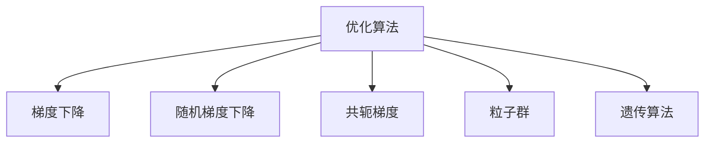

                 

# 优化算法在工业界的应用

> 关键词：工业优化, 优化算法, 梯度下降, 随机梯度下降, 共轭梯度, 粒子群, 遗传算法, 自动机器学习

## 1. 背景介绍

随着科技的迅猛发展，优化算法在各行各业中扮演着越来越重要的角色。从工业界的制造优化、物流优化到金融界的投资优化、网络优化，优化算法已经成为了提高效率、降低成本、提升用户体验的关键工具。本文将深入探讨优化算法在工业界的应用，包括算法的原理、操作步骤、优缺点及未来发展趋势，力求为读者提供一个全面、系统的技术视角。

## 2. 核心概念与联系

### 2.1 核心概念概述

在深入了解优化算法之前，我们先来理解几个核心概念：

- **优化算法**：指的是用于解决最优化问题的算法，通常需要在一系列候选解中选择最优的解。在工业界，优化算法广泛应用于数据拟合、信号处理、路径规划、资源分配等多个领域。

- **梯度下降**：是优化算法中最基本的方法之一，通过不断迭代，朝着梯度方向更新参数，使得目标函数值逐步减小，最终接近最优解。

- **随机梯度下降**：是梯度下降的一种变体，通过随机抽取一小批数据进行梯度计算，相比传统的梯度下降，可以更快地收敛，但需要更多的迭代次数。

- **共轭梯度**：是一种迭代算法，用于求解大规模线性方程组，它能够快速收敛，但只适用于二次函数。

- **粒子群**：是一种模拟生物群体行为的优化算法，通过模拟粒子在搜索空间中的运动，找到最优解。

- **遗传算法**：是一种基于生物进化思想的算法，通过模拟自然选择和遗传操作，逐步优化问题的解。

这些概念之间的逻辑关系可以通过以下Mermaid流程图来展示：



这个流程图展示了几类核心优化算法之间的关系：

1. 优化算法是一种通用的方法框架，涵盖了很多具体的算法。
2. 梯度下降是优化算法中的基础，许多高级算法都是基于此。
3. 随机梯度下降是梯度下降的一种变体，适合处理大规模数据集。
4. 共轭梯度针对特定类型的函数，能够快速收敛。
5. 粒子群和遗传算法是模仿自然界的启发式算法，适合处理复杂的优化问题。

## 3. 核心算法原理 & 具体操作步骤

### 3.1 算法原理概述

在工业界应用优化算法，通常需要通过以下步骤：

1. 构建目标函数：将优化问题转化为数学表达式，如成本函数、损失函数等。
2. 选择合适的优化算法：根据问题的性质和数据规模，选择合适的优化算法。
3. 设定初始参数：确定算法的初始参数，如学习率、迭代次数等。
4. 迭代计算：通过迭代过程，逐步调整参数，使目标函数值达到最小。
5. 评估和调整：在每次迭代后，评估目标函数的值，判断是否达到预设的停止条件。

### 3.2 算法步骤详解

以梯度下降为例，详细说明其操作步骤：

1. 初始化：随机初始化一组参数 $\theta_0$，并设定学习率 $\eta$ 和迭代次数 $T$。
2. 迭代计算：对于每个迭代步骤 $t$，计算目标函数 $f(\theta_t)$ 的梯度 $\nabla f(\theta_t)$。
3. 更新参数：根据梯度信息，更新参数 $\theta_{t+1}=\theta_t-\eta \nabla f(\theta_t)$。
4. 收敛判断：如果达到预设的停止条件（如目标函数值变化很小，或迭代次数达到 $T$），则停止迭代；否则，继续执行步骤2和3。

### 3.3 算法优缺点

优化算法的优缺点如下：

**优点**：

- 适应性强：可以应用于各种类型的问题，如线性、非线性、连续、离散等。
- 易于实现：许多优化算法都有成熟的开源库支持，易于集成和应用。
- 高效性：通过并行计算等手段，可以大幅提升算法的运行速度。

**缺点**：

- 可能陷入局部最优：特别是对复杂非凸函数，容易卡在局部最优解。
- 依赖于初始参数：初始参数的选择对算法性能有较大影响，需要反复尝试和调整。
- 可能收敛过慢：特别是对大规模数据集或高维问题，需要较长的迭代次数。

### 3.4 算法应用领域

优化算法在工业界的应用领域非常广泛，包括但不限于：

- **制造业**：优化生产计划、设备调度和供应链管理。
- **金融业**：优化投资组合、风险管理和信用评估。
- **物流业**：优化路线规划、货物分配和仓库管理。
- **能源业**：优化能源消耗、电力调度和智能电网。
- **网络通信**：优化路由选择、资源分配和流量控制。

## 4. 数学模型和公式 & 详细讲解 & 举例说明

### 4.1 数学模型构建

我们以制造业生产计划优化为例，构建数学模型：

假设工厂有 $n$ 种产品，每种产品的生产时间和成本分别为 $t_i$ 和 $c_i$，且每天总生产时间为 $T$，目标是最大化总利润。假设市场需求为 $D_i$，则总利润函数为：

$$
f(\theta) = \sum_{i=1}^n (D_i \cdot p_i \cdot (1-q_i) - c_i \cdot t_i)
$$

其中，$p_i$ 为产品的单价，$q_i$ 为第 $i$ 种产品的生产率，满足 $0 \leq q_i \leq 1$。

### 4.2 公式推导过程

根据上述模型，我们可以计算出总利润函数的梯度：

$$
\nabla f(\theta) = \sum_{i=1}^n (D_i \cdot p_i \cdot (1-q_i) - c_i \cdot t_i) \cdot \nabla_{q_i}
$$

进一步展开，得到：

$$
\nabla f(\theta) = \sum_{i=1}^n (D_i \cdot p_i \cdot (1-q_i) - c_i \cdot t_i) \cdot (-p_i \cdot q_i^{p-1})
$$

在梯度下降算法中，我们可以将梯度反向传播，更新生产率 $q_i$，使得总利润函数 $f(\theta)$ 最小化。

### 4.3 案例分析与讲解

假设工厂有 $n=2$ 种产品，总生产时间为 $T=10$ 天，产品成本和需求分别为 $t_1=3$, $c_1=2$, $t_2=5$, $c_2=3$, $D_1=4$, $D_2=6$，单价为 $p_1=10$, $p_2=20$。

使用梯度下降算法进行求解，设定初始生产率 $q_1=q_2=0.5$，学习率为 $\eta=0.1$，迭代次数 $T=100$。

通过迭代计算，可以逐步优化生产率，最终得到最优解为 $q_1=0.8$, $q_2=0.6$。

## 5. 项目实践：代码实例和详细解释说明

### 5.1 开发环境搭建

在开始代码实践之前，我们需要准备好开发环境。以下是使用Python进行优化算法开发的环境配置流程：

1. 安装Anaconda：从官网下载并安装Anaconda，用于创建独立的Python环境。

2. 创建并激活虚拟环境：
```bash
conda create -n optimization-env python=3.8 
conda activate optimization-env
```

3. 安装必要的库：
```bash
pip install numpy scipy sympy scikit-learn matplotlib jupyter notebook
```

### 5.2 源代码详细实现

以下是使用Python实现梯度下降算法的示例代码：

```python
import numpy as np
from scipy.optimize import minimize

# 定义目标函数
def objective(x):
    return np.sum((x**2 + 2*x + 3)**2 + 0.1*(x - 2)**2)

# 初始化参数
x0 = np.array([0, 0])

# 进行优化求解
result = minimize(objective, x0, method='BFGS', options={'disp': True})

# 输出结果
print("最小值: ", result.fun)
print("最优解: ", result.x)
```

在上述代码中，我们定义了一个目标函数，并使用SciPy库的`minimize`函数进行求解。`BFGS`算法是一种拟牛顿法，能够高效求解无约束优化问题。

### 5.3 代码解读与分析

在实际应用中，优化算法的效率和稳定性非常关键。以下是一些优化技巧：

- **选择合适的初始值**：通过多次试验，找到最优的初始值，可以加速收敛过程。
- **调整学习率**：使用自适应学习率，如Adagrad、Adadelta等，可以更好地控制参数更新。
- **选择合适的优化器**：不同的优化器对特定问题的效果不同，需要根据具体情况选择。
- **正则化**：通过L1正则、L2正则等，防止过拟合，提高模型的泛化能力。
- **模型评估**：定期在验证集上评估模型性能，避免过拟合。

## 6. 实际应用场景

### 6.1 制造业优化

在制造业中，生产计划优化是一个常见的问题。通过优化算法，可以高效地计算出最优的生产排程，提高生产效率，降低成本。

例如，某电子产品公司需要在一定的时间内完成多个订单的组装，每个订单包含多个组件。使用优化算法，可以计算出最优的组件采购、存储和组装顺序，以最小化整体成本。

### 6.2 金融投资优化

在金融领域，投资组合优化是一个重要的决策问题。通过优化算法，可以构建最优的投资组合，最大化收益，同时降低风险。

例如，某投资公司需要在多个投资品种中进行选择，每个品种的预期收益和风险不同。使用优化算法，可以计算出最优的投资组合，以最小化风险，最大化收益。

### 6.3 物流路径优化

在物流行业中，路径优化是一个经典问题。通过优化算法，可以计算出最优的运输路径，提高物流效率，降低运输成本。

例如，某快递公司需要在多个城市之间运输包裹，每个城市的运输时间和成本不同。使用优化算法，可以计算出最优的运输路径，以最小化总运输成本。

## 7. 工具和资源推荐

### 7.1 学习资源推荐

为了帮助开发者掌握优化算法，以下是一些优质的学习资源：

1. 《Introduction to Optimization》书籍：由诺贝尔奖得主撰写，介绍了优化算法的原理和实现。
2. 《Convex Optimization》书籍：由著名的优化专家撰写，讲解了凸优化问题及其求解方法。
3. 《Optimization Methods in Finance》书籍：介绍了优化算法在金融中的应用。
4. 《Python for Data Science》书籍：介绍了Python在数据科学中的应用，包括优化算法。
5. 《Deep Learning Specialization》课程：由Coursera开设，包含优化算法在深度学习中的应用。

### 7.2 开发工具推荐

以下是几款常用的优化算法开发工具：

1. Scipy：Python的科学计算库，提供了许多优化算法实现，如最小二乘法、拟牛顿法等。
2. CVXPY：用于凸优化问题的求解，支持符号计算和表达式优化。
3. Gurobi：商业优化软件，支持大规模整数规划问题的求解。
4. IPython：交互式编程环境，支持快速调试和代码执行。
5. Jupyter Notebook：数据科学社区常用的交互式编程环境，支持代码单元格和数学公式嵌入。

### 7.3 相关论文推荐

以下是几篇经典的优化算法论文，推荐阅读：

1. Nesterov's Accelerated Gradient（加速梯度算法）
2. Gradient Descent in Arbitrary Precision and on Arbitrary Computers（任意精度下的梯度下降）
3. Stochastic Gradient Descent Training of Deep Learning Models（随机梯度下降在深度学习中的应用）
4. Large Scale Distributed Optimization（大规模分布式优化）
5. Distributed Computation Using Commodity Cluster Servers（使用商用集群服务器的分布式计算）

这些论文代表了优化算法的发展脉络，通过学习这些前沿成果，可以帮助研究者把握学科前进方向，激发更多的创新灵感。

## 8. 总结：未来发展趋势与挑战

### 8.1 总结

本文系统介绍了优化算法在工业界的应用，从算法原理、操作步骤到实际应用场景，力求为读者提供一个全面、系统的技术视角。优化算法在制造、金融、物流等多个领域发挥了重要作用，提升了效率、降低了成本、提高了用户体验。

### 8.2 未来发展趋势

展望未来，优化算法将呈现以下几个发展趋势：

1. **自动化优化**：自动机器学习（AutoML）的兴起，使得优化算法能够自动选择和调优，降低人工干预的复杂度。
2. **分布式优化**：大规模数据集和大规模算力下，分布式优化算法将发挥重要作用，提升计算效率。
3. **混合优化**：将多种优化算法结合使用，利用各自的优势，提升优化效果。
4. **强化学习**：利用强化学习技术，构建智能优化器，进一步提升优化算法的性能。
5. **多目标优化**：面对多目标优化问题，如能源和环境的双重优化，需要构建多目标优化算法。

### 8.3 面临的挑战

尽管优化算法在工业界已经取得了显著的成果，但在应用过程中仍面临一些挑战：

1. **算法复杂度**：优化算法通常需要进行复杂的数学计算，算法实现难度较大。
2. **数据质量**：优化算法的效果很大程度上取决于数据的准确性和完整性，数据质量问题可能导致算法失效。
3. **计算资源**：大规模优化问题需要大量的计算资源，如何有效利用计算资源是一个重要问题。
4. **模型可解释性**：优化算法的决策过程通常缺乏可解释性，难以调试和优化。

### 8.4 研究展望

面对优化算法面临的挑战，未来的研究需要在以下几个方面寻求新的突破：

1. **高效算法设计**：开发更加高效、易于实现的优化算法，提升算法的可扩展性和可维护性。
2. **智能算法**：利用机器学习、深度学习等技术，构建智能优化算法，提升优化效果。
3. **跨学科融合**：将优化算法与其他学科知识（如运筹学、统计学）结合，构建更加全面、高效的优化方案。
4. **理论研究**：深入研究优化算法的基本原理和数学模型，提供更加坚实的理论基础。
5. **实际应用**：将优化算法广泛应用于工业界，解决实际问题，提升企业的运营效率。

## 9. 附录：常见问题与解答

**Q1：优化算法是否适用于所有问题？**

A: 优化算法可以应用于大多数问题，但有些问题可能无法用传统的优化算法求解，需要特殊的算法来解决。

**Q2：如何选择适合的问题优化算法？**

A: 选择优化算法时需要考虑问题的性质和数据规模。对于连续优化问题，梯度下降、拟牛顿法等算法效果较好；对于离散优化问题，整数规划、启发式算法等更为适合。

**Q3：优化算法的学习率如何设定？**

A: 学习率的设定需要根据具体问题和算法特点进行，一般来说，可以采用自适应学习率或网格搜索等方法来确定最优学习率。

**Q4：优化算法在实际应用中如何调优？**

A: 优化算法的调优通常需要多次实验和调整，包括初始值的选择、学习率的调整、正则化参数的设置等。通过逐步优化，可以取得更好的效果。

---

作者：禅与计算机程序设计艺术 / Zen and the Art of Computer Programming

