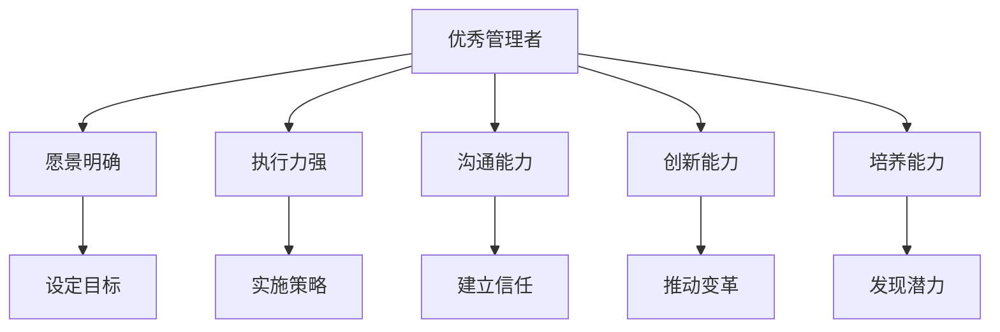

                 

## 1. 背景介绍

管理者在组织中的角色至关重要。一个优秀的管理者，不仅能带领团队取得卓越业绩，还能培养出更多的优秀管理者。而普通管理者，往往仅能维持团队正常运作，但无法提升整体绩效。本文将从多个维度，深入探讨优秀管理者与普通管理者之间的差异，并给出提升管理者能力的策略。

## 2. 核心概念与联系

### 2.1 核心概念概述

本文涉及的核心概念包括：

- **优秀管理者**：指的是能带领团队高效运作、实现卓越业绩的管理者。其具备的特征包括但不限于：愿景明确、执行力强、善于沟通、培养人才等。
- **普通管理者**：指的是仅能维持团队正常运作，无法提升整体绩效的管理者。其具备的特征包括：执行力一般、沟通能力弱、缺乏创新等。
- **愿景**：管理者对组织未来发展的明确规划和期望。
- **执行力**：管理者将愿景转化为实际行动的能力。
- **沟通能力**：管理者与团队成员、合作伙伴、上级领导之间的交流能力。
- **创新能力**：管理者提出新思路、新方法以解决问题和提升业绩的能力。
- **培养能力**：管理者识别和培养团队中潜在领导者的能力。

这些概念之间的逻辑关系可以通过以下Mermaid流程图来展示：

这个流程图展示了几大核心概念之间的联系：

1. **愿景明确**：优秀的管理者有清晰的愿景和目标，设定明确的战略方向。
2. **执行力强**：管理者将战略目标分解为可执行的计划，确保每个团队成员都能理解并执行。
3. **沟通能力**：通过有效的沟通，管理者能够激发团队成员的积极性，建立信任。
4. **创新能力**：管理者不断寻找新的方法来提升效率和业绩。
5. **培养能力**：管理者识别并培养团队中的优秀人才，形成人才梯队。

## 3. 核心算法原理 & 具体操作步骤

### 3.1 算法原理概述

本文主要讨论的是如何通过提升管理者的核心能力，转化为更好的团队绩效。这涉及到管理学中的“领导力”和“组织行为学”等理论。优秀管理者与普通管理者的差异主要体现在以下几个方面：

- **愿景和战略**：优秀管理者有明确的愿景和战略，并能将其传达给团队，而普通管理者往往缺乏这种大局观。
- **沟通技巧**：优秀的管理者能通过有效的沟通建立团队信任，而普通管理者则可能忽视沟通的重要性。
- **执行力和组织能力**：优秀管理者能够有效组织资源，推动团队达成目标，而普通管理者可能缺乏这方面的能力。
- **创新思维**：优秀的管理者敢于创新，提出新方法解决现有问题，而普通管理者则可能保守和不愿变革。
- **人才管理**：优秀管理者善于识别和培养团队中的优秀人才，而普通管理者可能缺乏这种洞察力。

### 3.2 算法步骤详解

提升管理者能力的具体操作步骤包括以下几个步骤：

**Step 1: 明确愿景和战略**
- 管理者需对组织的长远发展有清晰的规划，包括未来的目标和路径。
- 制定SMART（具体、可测量、可实现、相关、时限）的目标，确保目标具备可行性。

**Step 2: 提升沟通技巧**
- 管理者需学习并掌握有效的沟通技巧，包括倾听、反馈、非言语沟通等。
- 定期与团队成员沟通，了解他们的需求和反馈，建立良好的信任关系。

**Step 3: 强化执行力和组织能力**
- 管理者需学会分解任务和资源，确保每个任务都有明确的责任人和时间节点。
- 使用项目管理工具，如看板、甘特图等，帮助团队跟踪进度和完成任务。

**Step 4: 培养创新思维**
- 管理者需鼓励团队提出新想法，并为其提供实验和验证的机会。
- 定期组织创新工作坊，激发团队成员的创造力。

**Step 5: 发展人才管理能力**
- 管理者需识别团队中的潜在领导者，提供培训和发展机会。
- 制定人才发展计划，确保团队中的优秀人才能够得到培养和提升。

### 3.3 算法优缺点

提升管理者能力的算法具有以下优点：

1. **系统性**：通过明确愿景和战略、提升沟通技巧、强化执行力和组织能力、培养创新思维、发展人才管理能力，能够全面提升管理者的综合能力。
2. **可操作性**：这些步骤都是具体的、可操作的，管理者可以根据自己的实际情况进行改进。
3. **长期效果**：提升管理者能力是一个长期过程，但一旦取得成效，能够显著提升团队的绩效。

然而，该算法也存在一些缺点：

1. **个性化差异**：每个管理者的个性和团队的情况不同，通用的提升策略可能并不适合所有人。
2. **时间和资源投入**：提升管理者能力需要一定的时间和资源，可能对一些管理者来说是不现实的。
3. **效果依赖于执行**：提升管理者能力的效果取决于管理者自身的主动性和执行力度，并非一蹴而就。

### 3.4 算法应用领域

提升管理者能力的算法不仅适用于组织管理，还适用于个人职业发展。具体应用领域包括但不限于：

1. **企业高管**：企业高管通过提升愿景和战略、沟通技巧、执行力和组织能力、创新思维、人才管理能力，能够更有效地推动企业发展。
2. **项目管理**：项目经理通过提升执行力和组织能力、沟通技巧、创新思维，能够更好地管理项目，确保项目按时按质完成。
3. **创业公司**：创业者通过提升愿景和战略、创新思维、人才管理能力，能够引领公司走向成功。
4. **学术管理**：学术机构的领导通过提升愿景和战略、沟通技巧、执行力和组织能力、创新思维，能够更好地推动学术研究和人才培养。

## 4. 数学模型和公式 & 详细讲解 & 举例说明

### 4.1 数学模型构建

本文不涉及复杂的数学模型和公式，但可以用一些简单的指标来评估管理者的绩效和能力提升效果。

**指标1: 团队绩效**
- 可以用团队完成的任务数量、质量、效率等指标来衡量。
- 管理者的绩效与这些指标密切相关，优秀的管理者能够显著提升团队绩效。

**指标2: 团队满意度**
- 通过调查问卷等方式，了解团队成员对管理者的满意度。
- 管理者的沟通能力、培养能力等都会影响团队满意度。

**指标3: 创新产出**
- 创新是管理者创新能力的重要体现，可以通过新产品、新技术的数量和质量来衡量。
- 优秀的管理者能够推动团队产生更多的创新成果。

### 4.2 公式推导过程

由于不涉及数学模型和公式，本部分省略。

### 4.3 案例分析与讲解

假设某公司的高管A和B，通过对比他们的管理方式和绩效，分析优秀管理者与普通管理者之间的差异。

**案例1: 愿景和战略**
- 高管A在入职后，迅速明确了公司的长远发展方向和目标，制定了具体的战略规划。
- 高管B则缺乏明确的目标，缺乏对公司的整体规划，团队成员感到迷茫和不确定。

**案例2: 沟通技巧**
- 高管A定期与团队成员进行一对一沟通，了解他们的需求和反馈，建立良好的信任关系。
- 高管B则很少与团队成员沟通，团队成员感到被忽视，工作积极性下降。

**案例3: 执行力和组织能力**
- 高管A能够有效分解任务和资源，确保每个任务都有明确的责任人和时间节点，使用项目管理工具跟踪进度。
- 高管B则缺乏这方面的能力，任务推进缓慢，团队效率低下。

**案例4: 创新思维**
- 高管A鼓励团队提出新想法，定期组织创新工作坊，推动团队产生更多的创新成果。
- 高管B则缺乏创新的动力，团队缺乏创新氛围，难以产生新的突破。

**案例5: 人才管理**
- 高管A能够识别并培养团队中的潜在领导者，提供培训和发展机会，形成人才梯队。
- 高管B则缺乏这种洞察力，团队中缺乏中坚力量，无法形成合力。

## 5. 项目实践：代码实例和详细解释说明

本文不涉及代码实例，但可以通过项目管理工具的实际使用来提升管理者的执行力。

**工具推荐:**
- **看板（Kanban）**：如Trello、Jira，帮助管理者跟踪任务进度，确保每个任务都能按时完成。
- **甘特图（Gantt Chart）**：如MS Project、Smartsheet，帮助管理者制定项目计划，了解资源分配和任务时间节点。
- **项目管理软件**：如Asana、Monday.com，提供更全面的项目管理功能，提升管理效率。

**使用步骤:**
1. 明确任务和责任人。
2. 制定任务时间节点和里程碑。
3. 使用项目管理工具跟踪进度和调整计划。
4. 定期进行回顾和总结，确保任务按质按量完成。

## 6. 实际应用场景

### 6.1 企业管理
在企业管理中，提升管理者能力可以显著提升企业的整体绩效。例如：

- **高绩效团队**：通过明确愿景和战略、提升沟通技巧、强化执行力和组织能力、培养创新思维、发展人才管理能力，可以打造一支高绩效的团队，提升企业竞争力。
- **文化建设**：优秀的管理者通过良好的领导力，能够塑造和传承企业文化，形成共同的价值观和行为准则。

### 6.2 学术研究
在学术研究中，提升管理者能力可以推动学术研究和人才培养。例如：

- **科研项目**：通过明确研究方向和目标、提升沟通技巧、强化组织能力和执行力、鼓励创新和人才培养，可以推动科研项目按时按质完成，提升学术成果。
- **人才发展**：优秀的学术管理者能够识别和培养潜在的研究人才，推动学术研究的可持续发展。

### 6.3 项目管理
在项目管理中，提升管理者能力可以确保项目按时按质完成。例如：

- **项目管理工具**：通过使用项目管理工具如看板、甘特图等，管理者可以更好地组织和跟踪项目进度，确保项目按时完成。
- **风险管理**：优秀的管理者能够识别和规避项目风险，确保项目顺利推进。

### 6.4 未来应用展望

未来，随着大数据、人工智能等技术的不断发展，提升管理者能力的方法也将更加丰富和智能化。例如：

1. **数据分析**：通过分析团队成员的工作数据和绩效指标，提供个性化的提升建议。
2. **AI辅助管理**：使用AI工具进行任务分配、进度跟踪和绩效评估，提升管理效率。
3. **虚拟领导力培训**：通过虚拟现实和增强现实技术，提供沉浸式的领导力培训，帮助管理者提升综合能力。

## 7. 工具和资源推荐

### 7.1 学习资源推荐

提升管理者能力需要不断学习和实践，以下是一些优质的学习资源推荐：

1. **管理书籍**：如《管理的实践》、《从优秀到卓越》、《领导梯队》等，深入理解优秀管理者的特点和实践方法。
2. **在线课程**：如Coursera、edX、Udemy等平台上的管理课程，提供系统化的学习资源。
3. **领导力培训**：如Crucial Conversations、Emotional Intelligence等，提升沟通技巧和领导力。

### 7.2 开发工具推荐

提升管理者能力需要有效的工具支持，以下是一些推荐的开发工具：

1. **项目管理工具**：如Trello、Jira、Asana等，帮助管理者跟踪任务进度和资源分配。
2. **数据分析工具**：如Excel、Tableau、Power BI等，帮助管理者分析数据，提供决策支持。
3. **沟通工具**：如Slack、Microsoft Teams、Zoom等，提升团队沟通效率。

### 7.3 相关论文推荐

提升管理者能力的理论基础涉及管理学、组织行为学等多个领域，以下是一些相关的经典论文推荐：

1. "The Five Dysfunctions of a Team" by Patrick Lencioni：探讨团队管理中的五个关键问题。
2. "Leadership and Self-Deception" by The Arbinger Institute：分析领导力中常见的自我欺骗现象。
3. "The Leadership Challenge" by James Kouzes and Barry Posner：总结优秀领导者的行为特点。

## 8. 总结：未来发展趋势与挑战

### 8.1 研究成果总结

本文通过对优秀管理者与普通管理者的对比，探讨了提升管理者能力的策略。通过明确愿景和战略、提升沟通技巧、强化执行力和组织能力、培养创新思维、发展人才管理能力，能够全面提升管理者的综合能力，从而显著提升团队绩效。

### 8.2 未来发展趋势

未来，提升管理者能力的方法将更加智能化和数据驱动。大数据、人工智能等技术的发展，将为管理者能力的提升提供更多工具和支持。具体趋势包括：

1. **数据驱动**：通过数据分析和挖掘，提供个性化的提升建议，帮助管理者更好地理解团队和环境。
2. **AI辅助**：使用AI工具进行任务分配、进度跟踪和绩效评估，提升管理效率。
3. **多模态交互**：结合虚拟现实和增强现实技术，提供沉浸式的领导力培训，提升管理者综合能力。

### 8.3 面临的挑战

提升管理者能力的方法虽然具有显著的效果，但也面临一些挑战：

1. **个性化差异**：每个管理者的个性和团队的情况不同，通用的提升策略可能并不适合所有人。
2. **时间和资源投入**：提升管理者能力需要一定的时间和资源，可能对一些管理者来说是不现实的。
3. **效果依赖于执行**：提升管理者能力的效果取决于管理者自身的主动性和执行力度，并非一蹴而就。

### 8.4 研究展望

未来，提升管理者能力的研究将更加深入和系统。具体展望包括：

1. **系统化研究**：建立更加系统化的理论框架，涵盖多个管理维度和技术工具。
2. **跨学科融合**：结合心理学、社会学、组织行为学等学科，提供更全面的提升方法。
3. **全球化视角**：研究不同国家和文化的领导力特点，提供具有普适性的提升策略。

总之，提升管理者能力是一个复杂且长期的过程，但通过不断学习和实践，管理者可以逐步提升自身的综合能力，为组织带来更大的价值和成功。

## 9. 附录：常见问题与解答

**Q1: 如何衡量管理者的绩效？**

A: 管理者的绩效可以通过团队绩效、团队满意度、创新产出等指标来衡量。具体而言，可以通过以下步骤进行评估：
1. 收集和分析团队完成的任务数量、质量和效率等数据。
2. 通过调查问卷等方式，了解团队成员对管理者的满意度。
3. 统计团队中产生的创新成果数量和质量。

**Q2: 如何提升管理者的沟通技巧？**

A: 提升管理者的沟通技巧可以通过以下方法：
1. 学习和掌握有效的沟通技巧，包括倾听、反馈、非言语沟通等。
2. 定期与团队成员进行一对一沟通，了解他们的需求和反馈，建立良好的信任关系。
3. 使用沟通工具如Slack、Microsoft Teams、Zoom等，提升团队沟通效率。

**Q3: 如何强化管理者的执行力和组织能力？**

A: 强化管理者的执行力和组织能力可以通过以下方法：
1. 学习使用项目管理工具如看板、甘特图等，帮助团队跟踪任务进度和资源分配。
2. 制定明确的战略规划和任务分解，确保每个任务都有明确的责任人和时间节点。
3. 定期进行回顾和总结，确保任务按质按量完成。

**Q4: 如何培养管理者的创新思维？**

A: 培养管理者的创新思维可以通过以下方法：
1. 鼓励团队提出新想法，定期组织创新工作坊，激发团队成员的创造力。
2. 提供实验和验证新想法的机会，推动团队产生更多的创新成果。
3. 定期进行创新培训，提升管理者的创新思维和技能。

**Q5: 如何发展管理者的培养能力？**

A: 发展管理者的培养能力可以通过以下方法：
1. 识别团队中的潜在领导者，提供培训和发展机会。
2. 制定人才发展计划，确保团队中的优秀人才能够得到培养和提升。
3. 建立导师制度，帮助管理者提升人才管理能力。

总之，提升管理者能力是一个系统化的过程，需要管理者自身的主动性和执行力度，通过不断学习和实践，逐步提升综合能力，为组织带来更大的价值和成功。

---

作者：禅与计算机程序设计艺术 / Zen and the Art of Computer Programming

