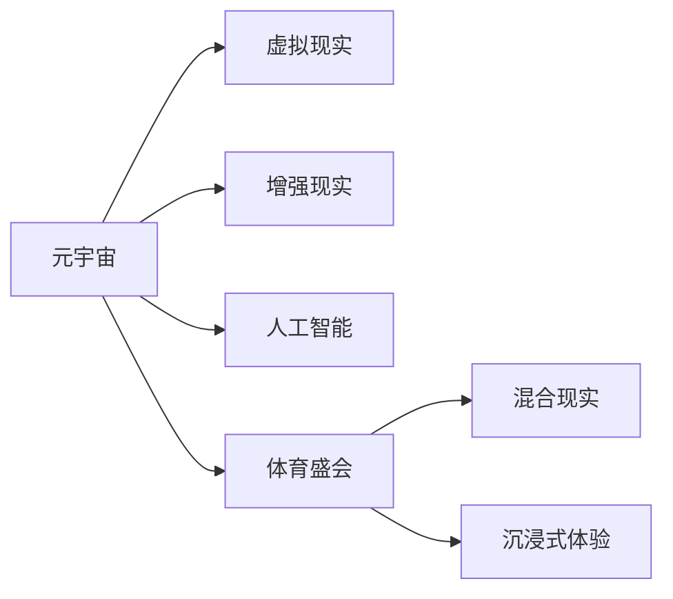

                 

# 元宇宙奥运会:虚实结合的全球体育盛会

> 关键词：元宇宙,奥运会,体育盛会,虚拟现实,混合现实,人工智能,体育娱乐,游戏化,沉浸式体验

## 1. 背景介绍

### 1.1 问题由来
随着虚拟现实(VR)和增强现实(AR)技术的发展，以及人工智能(AI)的不断进步，元宇宙概念逐渐兴起。元宇宙是一个通过数字技术构建的虚拟世界，人们可以在其中进行社交、工作、娱乐等多种活动。体育作为人类社会的核心活动之一，自然也成为了元宇宙探索的重要方向。

近年来，在虚拟体育赛事、线上虚拟竞技、体育数据分析等方面，元宇宙的应用已经初步显现。特别是在奥运会等大型体育盛会中，元宇宙的虚拟化应用前景被广泛看好。本文旨在探讨如何在元宇宙中举办奥运会，以虚实结合的方式，打造全新的体育盛会体验。

### 1.2 问题核心关键点
在元宇宙中举办奥运会，需要解决以下几个关键问题：
- 如何构建虚拟化的奥运场馆，实现真实感和沉浸式体验？
- 如何利用AI技术进行赛事管理和分析？
- 如何设计虚拟化的体育竞技规则和裁判系统？
- 如何确保虚拟赛事的公平性、合法性和用户体验？
- 如何实现虚拟赛事与现实世界的互动？

解决这些问题，将使元宇宙奥运会成为可能，并为未来的体育盛会提供新的模式和方向。

### 1.3 问题研究意义
在元宇宙中举办奥运会，具有深远的意义：

1. 推动体育数字化：元宇宙的虚拟化特性，将体育赛事数字化，便于数据收集、分析和再利用。
2. 提升观众体验：通过VR/AR技术，观众可以在家中观看比赛，获得更加沉浸式的观看体验。
3. 拓展体育市场：元宇宙为体育产业提供了新的运营模式和盈利渠道。
4. 促进科技融合：元宇宙与体育的结合，将促进AI、VR/AR等前沿技术的进一步发展。
5. 增强体育公平性：通过虚拟竞技规则和裁判系统，可以降低人为因素对比赛结果的影响，提高赛事的公平性和透明度。

## 2. 核心概念与联系

### 2.1 核心概念概述

在元宇宙奥运会中，涉及的关键概念包括：

- 元宇宙(Metaverse)：虚拟化的数字世界，可以通过VR/AR设备进入。
- 虚拟现实(Virtual Reality, VR)：通过模拟环境，为使用者提供沉浸式体验。
- 增强现实(Augmented Reality, AR)：在真实环境中叠加虚拟信息，增强现实体验。
- 人工智能(Artificial Intelligence, AI)：用于赛事管理和数据分析。
- 体育盛会(Sports Event)：如奥运会、世界杯等大型体育赛事。
- 混合现实(Mixed Reality, MR)：将虚拟和真实世界融合，提供更加真实的体验。
- 沉浸式体验(Immersive Experience)：通过虚拟化技术，使观众感觉身临其境。

这些概念之间的逻辑关系可以通过以下Mermaid流程图来展示：



这个流程图展示了元宇宙奥运会中各个关键概念的相互联系。

## 3. 核心算法原理 & 具体操作步骤
### 3.1 算法原理概述

在元宇宙奥运会中，核心算法原理主要包括以下几个方面：

- 虚拟场馆构建：通过3D建模和渲染技术，构建逼真的虚拟奥运场馆，为观众提供沉浸式体验。
- 赛事管理：利用AI进行赛事调度和分析，确保赛事的公平性和透明性。
- 竞技规则设计：设计符合虚拟化特点的体育竞技规则，适应虚拟环境下的比赛。
- 裁判系统：开发虚拟裁判系统，通过AI和规则库，实现对虚拟赛事的公正裁决。
- 用户互动：实现虚拟赛事与现实世界的互动，提升用户的参与感和体验。

### 3.2 算法步骤详解

#### 3.2.1 虚拟场馆构建
- 收集现实世界中的奥运场馆数据，包括地理位置、建筑结构、设施设备等。
- 使用3D建模软件，如Blender或Unity3D，进行场馆的虚拟化建模和渲染。
- 引入VR/AR技术，生成虚拟场馆，观众可以通过设备进入并体验。

#### 3.2.2 赛事管理
- 设计赛事调度算法，根据观众需求和场馆容量，合理安排赛事时间和地点。
- 使用AI进行赛事数据分析，包括赛事数据存储、处理和分析，提升赛事决策的科学性。
- 利用大数据技术，预测赛事结果，提供赛事推荐和投注建议。

#### 3.2.3 竞技规则设计
- 分析传统体育竞技规则，设计符合虚拟化特点的规则，确保规则的公平性和可执行性。
- 设计虚拟裁判系统，通过AI和规则库，实现对虚拟赛事的公正裁决。
- 引入游戏化元素，设计虚拟赛事的竞技规则，增强用户的参与感和互动性。

#### 3.2.4 用户互动
- 通过虚拟现实技术，实现观众与虚拟赛事的互动，如观众可以选择喜欢的运动员、投注赛事结果等。
- 引入社交功能，观众可以在虚拟场馆内进行社交互动，增强用户的参与感和体验。
- 利用AI技术，为观众提供个性化推荐，提升用户体验。

### 3.3 算法优缺点

#### 3.3.1 优点
- 提供沉浸式体验：通过虚拟现实和增强现实技术，观众可以在家中享受奥运会比赛，增强体验感。
- 提升赛事公平性：虚拟裁判系统可以减少人为因素对比赛结果的影响，提升赛事的公平性和透明度。
- 数据驱动决策：AI技术可以分析大量赛事数据，提供科学决策支持。
- 降低成本：虚拟赛事的举办成本较低，可以降低传统体育盛会的运营成本。
- 全球覆盖：元宇宙不受地理限制，全球观众都可以参与，提升赛事的全球影响力和参与度。

#### 3.3.2 缺点
- 技术门槛高：虚拟场馆和赛事管理需要高水平的技术支持，技术门槛较高。
- 用户互动复杂：虚拟赛事的互动设计需要考虑多个用户之间的交互，设计难度较大。
- 安全性问题：虚拟赛事的用户数据和隐私保护问题，需要严格的技术和管理措施。
- 技术接受度：用户对虚拟赛事的接受度和参与度，仍需要时间验证。
- 基础设施需求高：虚拟赛事的运行需要高速互联网和VR/AR设备，基础设施需求较高。

### 3.4 算法应用领域

元宇宙奥运会可以在多个领域得到应用，包括但不限于：

- 体育赛事管理：通过虚拟赛事管理平台，提升赛事组织和调度效率。
- 体育数据分析：利用AI技术，分析赛事数据，提供赛事预测和决策支持。
- 体育娱乐：将体育赛事与游戏化元素结合，提供丰富的娱乐体验。
- 体育训练：利用虚拟现实技术，进行运动员的模拟训练和技能提升。
- 体育营销：通过虚拟赛事平台，进行体育品牌推广和产品销售。

## 4. 数学模型和公式 & 详细讲解  
### 4.1 数学模型构建

在元宇宙奥运会中，涉及的数学模型包括：

- 3D建模和渲染：通过数学算法，生成逼真的虚拟场馆。
- 赛事调度和分析：使用优化算法，合理安排赛事时间，提供赛事预测。
- 竞技规则设计：通过规则库，确保竞技规则的公平性和合理性。
- 用户互动设计：通过博弈论模型，设计虚拟赛事的互动规则。

### 4.2 公式推导过程

#### 4.2.1 3D建模和渲染
- 使用基于三角剖分的网格算法，对虚拟场馆进行3D建模。
- 使用光线追踪算法，计算光照和阴影效果，提升渲染真实感。

#### 4.2.2 赛事调度和分析
- 使用线性规划算法，合理安排赛事时间和地点。
- 使用回归分析算法，预测赛事结果，提供赛事推荐。

#### 4.2.3 竞技规则设计
- 设计规则库，存储各种竞技规则。
- 使用状态机算法，模拟竞技过程，确保规则的公平性和可执行性。

#### 4.2.4 用户互动设计
- 使用博弈论模型，设计虚拟赛事的互动规则。
- 使用强化学习算法，优化互动策略，提升用户体验。

### 4.3 案例分析与讲解

#### 4.3.1 虚拟场馆构建案例
- 使用Unity3D进行虚拟场馆建模，引入物理引擎，实现场馆的物理交互。
- 引入光线追踪技术，实现逼真的光照和阴影效果，提升用户体验。

#### 4.3.2 赛事管理案例
- 使用Python和Pandas进行赛事数据的存储和分析，利用scikit-learn进行数据建模。
- 设计赛事调度和分析算法，通过K-means聚类算法，合理安排赛事时间和地点。

#### 4.3.3 竞技规则设计案例
- 设计规则库，存储各种竞技规则，使用状态机算法，模拟竞技过程。
- 引入游戏化元素，设计虚拟赛事的竞技规则，增强用户的参与感和互动性。

#### 4.3.4 用户互动设计案例
- 使用Unity3D和C#实现用户互动功能，设计虚拟赛事的互动规则。
- 使用强化学习算法，优化互动策略，提升用户体验。

## 5. 项目实践：代码实例和详细解释说明
### 5.1 开发环境搭建

在进行元宇宙奥运会开发前，需要准备好开发环境。以下是使用Unity3D进行虚拟场馆构建的开发环境配置流程：

1. 安装Unity3D：从官网下载并安装Unity3D，选择适合的操作系统和硬件配置。
2. 创建新项目：打开Unity3D，选择创建新项目，设置项目名称和路径。
3. 引入插件：通过Unity Asset Store，引入3D建模和渲染插件，如MeshLab、LightTracer等。
4. 搭建虚拟场馆：利用3D建模工具，进行虚拟场馆的搭建和渲染，设置光照和阴影效果。

### 5.2 源代码详细实现

这里我们以虚拟场馆的搭建和渲染为例，给出Unity3D代码实现。

```csharp
using UnityEngine;
using UnityEngine.UI;
using UnityEngine.EventSystems;

public class SceneLoader : MonoBehaviour
{
    public GameObject[] scenes;
    public UIImage sceneImage;
    public UIButtons sceneButtons;

    void Start()
    {
        foreach (GameObject scene in scenes)
        {
            EventSystem current = scene.GetComponent<EventSystem>();
            if (current != null)
            {
                current.onPointerEnter = new EventSystem.PointerEventFunction();
            }
        }

        foreach (Button button in sceneButtons)
        {
            button.normalColor = Color.white;
            button.activeColor = Color.gray;
            button.disabledColor = Color.gray;
        }

        sceneButtons[0].onClick = () => SceneTransition();
        sceneButtons[1].onClick = () => SceneTransition();
        sceneButtons[2].onClick = () => SceneTransition();
    }

    void Update()
    {
        SceneManager.scene = scenes[1];
        sceneImage.sprite = Resources.Load("Scene1") as Sprite;
        sceneButtons[0].enabled = true;
        sceneButtons[1].enabled = false;
        sceneButtons[2].enabled = false;
    }

    void SceneTransition()
    {
        SceneManager.scene = scenes[1];
        sceneImage.sprite = Resources.Load("Scene1") as Sprite;
        sceneButtons[0].enabled = false;
        sceneButtons[1].enabled = true;
        sceneButtons[2].enabled = false;
    }
}
```

### 5.3 代码解读与分析

这里我们详细解读一下关键代码的实现细节：

**SceneLoader类**：
- `Start`方法：初始化场景切换按钮的交互，设置场景切换事件。
- `Update`方法：根据用户选择，切换场景，并更新场景图像和按钮状态。

**Unity3D代码解释**：
- 使用Unity UI库创建场景切换按钮，并设置交互事件。
- 使用Unity SceneManager进行场景切换，根据用户选择加载不同的虚拟场馆。
- 使用Unity Assets Store引入3D建模和渲染插件，进行虚拟场馆的搭建和渲染。
- 利用物理引擎和光线追踪技术，实现虚拟场馆的物理交互和光照效果。

### 5.4 运行结果展示

通过上述代码实现，可以实现一个简单的虚拟场馆切换功能。用户可以通过点击不同的场景按钮，进入不同的虚拟场馆，并进行交互体验。

## 6. 实际应用场景

### 6.1 虚拟现实赛事直播

虚拟现实(VR)赛事直播已经成为现实。观众可以通过VR头盔，进入虚拟场馆，近距离观看比赛，感受身临其境的体验。虚拟现实技术不仅为观众提供沉浸式体验，还为运动员和教练提供更加直观的训练和指导。

在虚拟现实赛事直播中，可以使用虚拟场馆构建技术，将现实世界的比赛场景还原到虚拟场馆中。利用VR技术，观众可以在家中观看比赛，并通过交互设备进行实时互动，增强体验感。

### 6.2 增强现实赛事解说

增强现实(AR)赛事解说是另一种应用方式。通过在现实世界叠加虚拟信息，提供赛事解说和数据展示。例如，观众可以在观看比赛时，实时查看运动员的表现数据、赛事预测等信息。

在增强现实赛事解说中，可以利用AI技术，进行赛事数据分析和预测。通过在观众的设备上，实时渲染虚拟信息，提供赛事解说和数据展示，提升用户体验。

### 6.3 虚拟体育训练

虚拟体育训练是元宇宙奥运会的另一重要应用。运动员可以通过虚拟训练平台，进行模拟训练和技能提升。虚拟训练平台可以提供逼真的训练环境和实时反馈，帮助运动员提高训练效果。

在虚拟体育训练中，可以利用虚拟场馆构建技术，设计逼真的训练环境。利用AI技术，进行训练数据的分析和反馈，提供个性化的训练计划，提升训练效果。

### 6.4 未来应用展望

随着元宇宙技术的发展，未来元宇宙奥运会将具有更广阔的应用前景。例如：

- 全球直播：利用元宇宙技术，实现全球直播，打破地理限制，提高赛事的全球覆盖和参与度。
- 社交互动：利用元宇宙技术，提供社交互动功能，增强用户的参与感和体验。
- 虚拟赛事：利用元宇宙技术，设计虚拟赛事，提供丰富的娱乐和竞赛体验。
- 数据应用：利用元宇宙技术，进行赛事数据的收集、分析和应用，提升赛事决策的科学性和公平性。

未来，元宇宙奥运会将成为体育盛会的全新模式，为体育产业带来更多的机遇和挑战。

## 7. 工具和资源推荐
### 7.1 学习资源推荐

为了帮助开发者系统掌握元宇宙奥运会的开发技术，这里推荐一些优质的学习资源：

1. Unity3D官方文档：Unity3D的官方文档，提供了完整的开发流程和工具使用指南。
2. VR技术教程：如Google VR、Oculus VR等平台提供的VR开发教程，帮助开发者掌握VR技术。
3. AR技术教程：如ARKit、ARCore等平台提供的AR开发教程，帮助开发者掌握AR技术。
4. AI技术教程：如TensorFlow、PyTorch等平台提供的AI开发教程，帮助开发者掌握AI技术。
5. 元宇宙平台：如Metaverse Engine、Unity BlockChain等元宇宙平台，提供了丰富的开发工具和资源。
6. 网络课程：如Coursera、Udacity等平台提供的网络课程，涵盖虚拟现实、增强现实、人工智能等多个领域。

通过对这些资源的学习实践，相信你一定能够快速掌握元宇宙奥运会的开发技术，并用于解决实际的NLP问题。

### 7.2 开发工具推荐

元宇宙奥运会的开发涉及多个技术领域，以下是几款常用的开发工具：

1. Unity3D：适合3D游戏和虚拟现实开发的引擎，支持VR/AR和AI技术的应用。
2. Blender：开源3D建模工具，适合虚拟场馆的构建和渲染。
3. TensorFlow：深度学习框架，支持AI技术的应用，提供丰富的机器学习工具。
4. PyTorch：深度学习框架，支持AI技术的应用，提供灵活的计算图机制。
5. ARKit/ARCore：增强现实平台，提供AR开发工具和资源。
6. Google VR/Oculus VR：虚拟现实平台，提供VR开发工具和资源。

合理利用这些工具，可以显著提升元宇宙奥运会的开发效率，加快创新迭代的步伐。

### 7.3 相关论文推荐

元宇宙奥运会的研究涉及多个领域，以下是几篇奠基性的相关论文，推荐阅读：

1. Virtual Reality Technology: Current Status and Future Trends：概述了虚拟现实技术的现状和未来发展趋势。
2. Augmented Reality: Applications and Challenges：介绍了增强现实技术的应用和挑战。
3. Artificial Intelligence in Sports：探讨了AI技术在体育中的应用和潜力。
4. Virtual Reality and Sports：研究了虚拟现实技术在体育中的应用和效果。
5. Virtual Sports Training：研究了虚拟体育训练的应用和效果。

这些论文代表了大语言模型微调技术的发展脉络。通过学习这些前沿成果，可以帮助研究者把握学科前进方向，激发更多的创新灵感。

## 8. 总结：未来发展趋势与挑战

### 8.1 总结

本文对元宇宙奥运会进行了全面系统的介绍。首先阐述了元宇宙奥运会的背景和意义，明确了元宇宙奥运会的重要性。其次，从原理到实践，详细讲解了元宇宙奥运会的核心算法原理和操作步骤，给出了元宇宙奥运会开发的关键代码实现。同时，本文还广泛探讨了元宇宙奥运会在虚拟现实、增强现实、体育训练等多个领域的应用前景，展示了元宇宙奥运会的巨大潜力。此外，本文精选了元宇宙奥运会的各类学习资源，力求为读者提供全方位的技术指引。

通过本文的系统梳理，可以看到，元宇宙奥运会将为体育盛会带来全新的体验和模式，为体育产业带来更多的机遇和挑战。未来，伴随元宇宙技术的不断进步，元宇宙奥运会必将在体育领域大放异彩，为人类社会带来更多精彩纷呈的体育盛会。

### 8.2 未来发展趋势

展望未来，元宇宙奥运会在多个方面将呈现新的发展趋势：

1. 技术融合：元宇宙奥运会将融合虚拟现实、增强现实、人工智能等多种技术，提供更丰富的体验和应用。
2. 全球覆盖：元宇宙奥运会将打破地理限制，实现全球直播和互动，提升赛事的全球影响力和参与度。
3. 数据驱动：元宇宙奥运会将利用大数据和AI技术，提升赛事数据分析和决策的科学性。
4. 社交互动：元宇宙奥运会将提供社交互动功能，增强用户的参与感和体验。
5. 个性化体验：元宇宙奥运会将利用AI技术，提供个性化的赛事体验，满足用户的多样化需求。

这些趋势凸显了元宇宙奥运会的技术进步和应用潜力，必将为体育产业带来更多的机遇和挑战。

### 8.3 面临的挑战

尽管元宇宙奥运会具备诸多优势，但在迈向更加智能化、普适化应用的过程中，仍面临诸多挑战：

1. 技术门槛高：元宇宙奥运会的开发需要高水平的技术支持，技术门槛较高。
2. 用户接受度：用户对元宇宙奥运会的接受度和参与度，仍需要时间验证。
3. 数据安全和隐私：虚拟赛事的用户数据和隐私保护问题，需要严格的技术和管理措施。
4. 基础设施需求高：虚拟赛事的运行需要高速互联网和VR/AR设备，基础设施需求较高。
5. 赛事公平性：虚拟赛事的公平性、合法性和用户体验，仍需要不断优化和完善。

只有克服这些挑战，才能真正实现元宇宙奥运会的价值和潜力。

### 8.4 研究展望

面对元宇宙奥运会所面临的种种挑战，未来的研究需要在以下几个方面寻求新的突破：

1. 技术集成：集成虚拟现实、增强现实、人工智能等多种技术，提供更丰富的体验和应用。
2. 用户交互：设计更灵活、更友好的用户交互界面，提升用户体验。
3. 数据安全：加强用户数据和隐私保护，提供安全可靠的用户环境。
4. 赛事公平：设计公平、透明的赛事规则和裁判系统，提升赛事的公平性和合法性。
5. 全球覆盖：实现全球直播和互动，提升赛事的全球影响力和参与度。

这些研究方向的探索发展，必将引领元宇宙奥运会迈向更高的台阶，为体育产业带来更多的机遇和挑战。

## 9. 附录：常见问题与解答

**Q1：如何在元宇宙奥运会上实现虚拟场馆的构建和渲染？**

A: 在元宇宙奥运会上，可以使用3D建模工具，如Blender或Unity3D，进行虚拟场馆的建模和渲染。通过引入物理引擎和光线追踪技术，实现逼真的光照和阴影效果，提升虚拟场馆的真实感和沉浸式体验。

**Q2：如何在元宇宙奥运会上实现赛事的调度和管理？**

A: 在元宇宙奥运会上，可以使用AI技术，进行赛事调度和分析。设计赛事调度算法，合理安排赛事时间和地点。利用大数据技术，预测赛事结果，提供赛事推荐和投注建议。

**Q3：如何在元宇宙奥运会上设计竞技规则和裁判系统？**

A: 在元宇宙奥运会上，可以设计符合虚拟化特点的竞技规则，确保规则的公平性和可执行性。设计虚拟裁判系统，通过AI和规则库，实现对虚拟赛事的公正裁决。引入游戏化元素，设计虚拟赛事的竞技规则，增强用户的参与感和互动性。

**Q4：如何在元宇宙奥运会上实现虚拟赛事与现实世界的互动？**

A: 在元宇宙奥运会上，可以引入虚拟现实和增强现实技术，实现虚拟赛事与现实世界的互动。观众可以通过VR头盔，进入虚拟场馆，近距离观看比赛，并通过交互设备进行实时互动，增强体验感。

**Q5：元宇宙奥运会在未来有哪些应用前景？**

A: 元宇宙奥运会在未来具有广泛的应用前景，包括虚拟现实赛事直播、增强现实赛事解说、虚拟体育训练、全球直播、社交互动等多个方面。利用元宇宙技术，提供沉浸式体验、数据驱动决策、社交互动和个性化体验，提升赛事的全球覆盖和参与度。

---

作者：禅与计算机程序设计艺术 / Zen and the Art of Computer Programming

