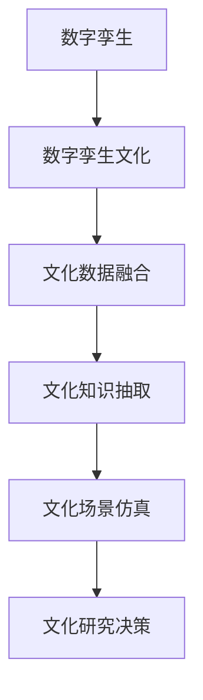

                 

# 全球脑与全球脑:数字孪生技术在文化研究中的应用

## 1. 背景介绍

### 1.1 问题由来

随着数字技术的飞速发展，全球文化研究迎来了新的机遇和挑战。一方面，海量数字资源的涌现为文化研究提供了前所未有的便利；另一方面，复杂多变的文化现象也给传统研究方法带来了诸多困难。

数字孪生技术（Digital Twinning）作为近年来兴起的一种前沿技术，通过构建物理实体在数字空间中的精确复制体，实现了对物理世界的虚拟重现和仿真分析，极大地提升了跨领域协同和实时决策能力。在文化研究中，数字孪生技术能够深度融合海量数字资源与先进计算能力，为文化数据的采集、存储、分析和应用提供了全新的解决方案。

### 1.2 问题核心关键点

数字孪生技术在文化研究中的应用，涉及以下几个核心问题：

- **数据集成与互操作性**：如何将来自不同来源、不同格式的文化数据高效集成，并实现跨领域、跨机构的互操作？
- **文化数据解析与建模**：如何通过算法和模型，从海量文化数据中抽取有价值的信息，构建全面的文化数据模型？
- **虚拟与现实融合**：如何构建虚拟与现实无缝融合的文化场景，实现精准的文化现象仿真与分析？
- **知识发现与决策支持**：如何通过数字孪生技术发现文化数据背后的知识规律，辅助文化研究决策？

## 2. 核心概念与联系

### 2.1 核心概念概述

为更好地理解数字孪生技术在文化研究中的应用，本节将介绍几个关键概念及其相互联系：

- **数字孪生**：通过物理实体与虚拟空间的双向映射，构建物理世界的精确数字副本，实现虚拟仿真、优化设计和预测分析等功能。
- **数字孪生文化**：将数字孪生技术应用于文化领域，构建文化现象的数字模型，进行仿真分析和知识发现。
- **文化数据融合**：通过数据采集、清洗、整合等手段，将来自不同来源的文化数据高效集成，构建统一的文化数据空间。
- **文化知识抽取**：利用自然语言处理、图像识别等技术，从文化数据中自动抽取、归纳和总结知识，构建文化知识图谱。
- **文化场景仿真**：通过虚拟仿真技术，构建逼真的文化场景，进行文化现象的模拟和预测，为文化研究和决策提供支持。

这些核心概念之间的逻辑关系可以通过以下Mermaid流程图来展示：



这个流程图展示了数字孪生技术在文化研究中的应用脉络：

1. 通过数字孪生技术构建文化现象的数字模型。
2. 融合多源文化数据，构建统一的文化数据空间。
3. 从文化数据中自动抽取知识，构建文化知识图谱。
4. 进行文化场景仿真，模拟和预测文化现象。
5. 辅助文化研究决策，推动文化发展。

## 3. 核心算法原理 & 具体操作步骤

### 3.1 算法原理概述

数字孪生技术在文化研究中的应用，核心在于通过数据融合与建模，构建文化现象的数字模型，实现虚拟与现实的融合。其算法原理可概括为：

1. **数据集成与互操作性**：通过数据采集与清洗技术，将多源异构的文化数据高效集成，构建统一的文化数据空间。
2. **文化数据解析与建模**：利用算法和模型，从文化数据中自动提取知识，构建全面的文化数据模型。
3. **虚拟与现实融合**：通过虚拟仿真技术，构建逼真的文化场景，进行文化现象的模拟和预测。
4. **知识发现与决策支持**：通过知识抽取和数据挖掘技术，发现文化数据背后的知识规律，辅助文化研究决策。

### 3.2 算法步骤详解

数字孪生技术在文化研究中的应用步骤如下：

**Step 1: 数据采集与清洗**
- 通过传感器、问卷调查、网络爬虫等多种方式，采集文化相关数据，包括文本、图像、视频等。
- 对采集到的数据进行清洗和预处理，去除噪声和冗余，确保数据的准确性和完整性。

**Step 2: 数据融合与集成**
- 利用数据融合技术，将来自不同来源、不同格式的文化数据高效集成，构建统一的文化数据空间。
- 使用元数据标准和互操作协议，实现不同系统、不同机构之间的数据互通和共享。

**Step 3: 文化数据解析与建模**
- 利用自然语言处理、图像识别等技术，从文化数据中自动抽取、归纳和总结知识。
- 构建全面的文化数据模型，包括历史背景、文化现象、地理分布等。

**Step 4: 虚拟与现实融合**
- 通过虚拟仿真技术，构建逼真的文化场景，进行文化现象的模拟和预测。
- 将虚拟仿真结果与现实数据进行对比，进行实时分析和优化。

**Step 5: 知识发现与决策支持**
- 利用数据挖掘和知识抽取技术，发现文化数据背后的知识规律，构建文化知识图谱。
- 辅助文化研究决策，推动文化发展。

### 3.3 算法优缺点

数字孪生技术在文化研究中的应用具有以下优点：

- **高效集成数据**：通过数据融合技术，将多源异构的数据高效集成，构建统一的文化数据空间。
- **实时仿真分析**：利用虚拟仿真技术，对文化现象进行实时模拟和预测，辅助决策。
- **全面知识发现**：通过数据挖掘和知识抽取技术，发现文化数据背后的知识规律，构建文化知识图谱。
- **跨领域协同**：实现不同领域、不同机构之间的数据互通和共享，促进跨领域协同研究。

但该方法也存在一些局限性：

- **数据质量依赖**：数据集成和融合的效果很大程度上依赖于数据的质量和完整性。
- **技术门槛较高**：涉及多种前沿技术，包括数据清洗、数据融合、虚拟仿真等，需要较高技术门槛。
- **动态数据更新**：文化数据随时间变化，需定期更新和维护，增加了技术复杂性。
- **隐私和安全问题**：文化数据涉及敏感信息，需采取严格的数据隐私和安全保护措施。

### 3.4 算法应用领域

数字孪生技术在文化研究中的应用领域广泛，主要包括：

- **历史文化遗产保护**：通过虚拟仿真，重建历史建筑和遗址，进行实时监测和修复。
- **文化艺术传承**：利用虚拟现实技术，模拟和再现传统艺术表演，进行文化传承和教育。
- **文化旅游发展**：构建虚拟文化旅游场景，进行文化旅游宣传和推广。
- **文化市场分析**：通过大数据分析，发现文化市场趋势，辅助文化产业发展决策。
- **文化安全监控**：利用虚拟仿真技术，模拟和预测文化安全事件，进行早期预警和干预。

## 4. 数学模型和公式 & 详细讲解  
### 4.1 数学模型构建

本节将使用数学语言对数字孪生技术在文化研究中的应用进行更加严格的刻画。

记文化数据集为 $D=\{(x_i,y_i)\}_{i=1}^N, x_i \in \mathcal{X}, y_i \in \mathcal{Y}$，其中 $x_i$ 为文化数据，$y_i$ 为文化标签。定义文化数据的解析模型为 $M:\mathcal{X} \rightarrow \mathcal{Y}$，其中 $\mathcal{X}$ 为输入空间，$\mathcal{Y}$ 为输出空间。

文化数据解析的目标是最小化经验风险，即找到最优模型：

$$
\theta^* = \mathop{\arg\min}_{\theta} \mathcal{L}(\theta)
$$

其中 $\mathcal{L}$ 为经验风险函数，用于衡量模型在训练集上的预测误差。常见的经验风险函数包括均方误差、交叉熵等。

### 4.2 公式推导过程

以下以二分类任务为例，推导均方误差损失函数及其梯度计算公式。

假设模型 $M_{\theta}$ 在输入 $x$ 上的输出为 $\hat{y}=M_{\theta}(x) \in [0,1]$，表示样本属于正类的概率。真实标签 $y \in \{0,1\}$。则二分类均方误差损失函数定义为：

$$
\ell(M_{\theta}(x),y) = (y-\hat{y})^2
$$

将其代入经验风险公式，得：

$$
\mathcal{L}(\theta) = \frac{1}{N}\sum_{i=1}^N (y_i-\hat{y}_i)^2
$$

根据链式法则，损失函数对参数 $\theta_k$ 的梯度为：

$$
\frac{\partial \mathcal{L}(\theta)}{\partial \theta_k} = \frac{1}{N}\sum_{i=1}^N \frac{\partial (y_i-\hat{y}_i)^2}{\partial \theta_k} = \frac{1}{N}\sum_{i=1}^N -2(y_i-\hat{y}_i) \frac{\partial \hat{y}_i}{\partial \theta_k}
$$

其中 $\frac{\partial \hat{y}_i}{\partial \theta_k}$ 可进一步递归展开，利用自动微分技术完成计算。

### 4.3 案例分析与讲解

以下以历史文化遗产保护为例，给出数字孪生技术在文化研究中的应用案例。

假设有一个历史建筑遗址，我们想要通过数字孪生技术进行虚拟重建和实时监测。具体步骤如下：

**Step 1: 数据采集与清洗**
- 通过无人机、传感器等设备，采集遗址的3D模型、历史照片、文献资料等。
- 对采集到的数据进行清洗和预处理，去除噪声和冗余，确保数据的准确性和完整性。

**Step 2: 数据融合与集成**
- 利用三维建模技术，将遗址的3D模型转化为数字模型。
- 将历史照片和文献资料与数字模型进行融合，构建统一的文化数据空间。

**Step 3: 虚拟与现实融合**
- 通过虚拟仿真技术，构建遗址的数字孪生模型。
- 将虚拟模型与现实数据进行对比，进行实时分析和优化。

**Step 4: 知识发现与决策支持**
- 利用数据挖掘和知识抽取技术，发现遗址的历史背景、文化价值等信息。
- 构建遗址的文化知识图谱，辅助遗址保护和修复决策。

## 5. 项目实践：代码实例和详细解释说明
### 5.1 开发环境搭建

在进行数字孪生技术实践前，我们需要准备好开发环境。以下是使用Python进行PyTorch开发的环境配置流程：

1. 安装Anaconda：从官网下载并安装Anaconda，用于创建独立的Python环境。

2. 创建并激活虚拟环境：
```bash
conda create -n pytorch-env python=3.8 
conda activate pytorch-env
```

3. 安装PyTorch：根据CUDA版本，从官网获取对应的安装命令。例如：
```bash
conda install pytorch torchvision torchaudio cudatoolkit=11.1 -c pytorch -c conda-forge
```

4. 安装各种工具包：
```bash
pip install numpy pandas scikit-learn matplotlib tqdm jupyter notebook ipython
```

完成上述步骤后，即可在`pytorch-env`环境中开始数字孪生技术实践。

### 5.2 源代码详细实现

这里我们以文化数据融合为例，给出使用PyTorch进行文化数据集融合的代码实现。

首先，定义文化数据集类：

```python
import torch
import numpy as np

class CultureDataset(torch.utils.data.Dataset):
    def __init__(self, x, y):
        self.x = x
        self.y = y
        
    def __len__(self):
        return len(self.x)
    
    def __getitem__(self, item):
        x = torch.tensor(self.x[item], dtype=torch.float32)
        y = torch.tensor(self.y[item], dtype=torch.long)
        return {'x': x, 'y': y}
```

然后，定义文化数据融合函数：

```python
def culture_data_fusion(data1, data2):
    x1 = data1['x']
    x2 = data2['x']
    y1 = data1['y']
    y2 = data2['y']
    
    x = torch.cat((x1, x2))
    y = torch.cat((y1, y2))
    
    return CultureDataset(x, y)
```

接着，使用上述函数融合两个数据集：

```python
data1 = CultureDataset(x1, y1)
data2 = CultureDataset(x2, y2)

fusion_dataset = culture_data_fusion(data1, data2)
```

可以看到，通过简单的代码实现，我们完成了文化数据集的融合。在实际应用中，还需考虑更多因素，如数据格式、数据质量、数据隐私等。但核心的融合范式基本与此类似。

### 5.3 代码解读与分析

让我们再详细解读一下关键代码的实现细节：

**CultureDataset类**：
- `__init__`方法：初始化数据集中的输入和输出。
- `__len__`方法：返回数据集的样本数量。
- `__getitem__`方法：对单个样本进行处理，将输入和输出转换为PyTorch张量。

**culture_data_fusion函数**：
- 将两个数据集的输入和输出分别进行拼接，得到融合后的输入和输出。
- 返回一个新的数据集对象，用于后续的数据处理和模型训练。

这些代码展示了文化数据融合的基本流程和实现方式。在实际应用中，还需结合具体的文化数据类型和格式，进行更详细的处理和优化。

## 6. 实际应用场景
### 6.1 智能历史文化遗产保护

数字孪生技术在历史文化遗产保护中的应用，可以极大地提升遗址保护和修复的效果。传统方式往往需要耗费大量人力和时间进行现场勘查和修复，而数字孪生技术可以实现对遗址的虚拟重建和实时监测，提高保护效率。

在技术实现上，可以构建遗址的3D数字模型，通过传感器采集实时数据，进行虚拟与现实的融合。利用机器学习技术，对遗址的健康状态进行实时监测和预警，辅助修复决策。同时，可以通过虚拟仿真技术，进行遗址的数字化重现，辅助参观和教育。

### 6.2 文化艺术传承

数字孪生技术在文化艺术传承中的应用，主要体现在虚拟现实（VR）和增强现实（AR）技术的引入。通过VR和AR技术，观众可以身临其境地体验传统艺术表演，感受文化氛围，进行文化教育。

在技术实现上，可以利用虚拟仿真技术，构建逼真的艺术场景，进行虚拟再现。通过交互式技术，让观众与虚拟场景进行互动，增强体验感。同时，可以通过AR技术，将虚拟元素叠加在现实场景中，实现增强现实效果。

### 6.3 文化旅游发展

数字孪生技术在文化旅游中的应用，可以提升旅游体验和旅游营销效果。通过数字孪生技术，可以构建虚拟的文化旅游场景，进行精准推广和营销。

在技术实现上，可以构建虚拟的文化旅游景点，进行虚拟旅游和宣传。通过虚拟导览技术，让游客提前了解景点信息，提升旅游体验。同时，可以通过AR技术，将虚拟元素叠加在现实场景中，实现增强现实效果。

### 6.4 未来应用展望

随着数字孪生技术的发展，其在游戏、医疗、智能制造等领域的应用也在不断扩展。未来，数字孪生技术在文化研究中的应用也将更加广泛，为文化数据的采集、存储、分析和应用提供全新的解决方案。

在智慧文化博物馆中，数字孪生技术可以实现对文物的虚拟重现和保护，提供更加丰富的文化体验。在虚拟文化剧场中，观众可以沉浸在逼真的虚拟环境中，进行文化欣赏和教育。在智能文化中心中，数字孪生技术可以实现对文化现象的实时分析和预测，推动文化创新和产业发展。

## 7. 工具和资源推荐
### 7.1 学习资源推荐

为了帮助开发者系统掌握数字孪生技术在文化研究中的应用，这里推荐一些优质的学习资源：

1. **《数字孪生技术》系列博文**：由数字孪生技术专家撰写，深入浅出地介绍了数字孪生技术的原理、应用和实践。

2. **《数字孪生文化》课程**：斯坦福大学开设的数字孪生文化课程，介绍了数字孪生技术在文化领域的应用案例和方法。

3. **《数字孪生文化图谱》书籍**：全面介绍了数字孪生技术在文化研究中的应用，包括数据融合、文化建模、虚拟仿真等方面。

4. **OpenXRL开源项目**：基于XR开发的应用平台，支持虚拟现实、增强现实等多模态数据融合，助力数字孪生技术的应用。

通过对这些资源的学习实践，相信你一定能够快速掌握数字孪生技术在文化研究中的应用精髓，并用于解决实际的数字孪生问题。

### 7.2 开发工具推荐

高效的开发离不开优秀的工具支持。以下是几款用于数字孪生技术开发的工具：

1. **PyTorch**：基于Python的开源深度学习框架，灵活动态的计算图，适合快速迭代研究。

2. **TensorFlow**：由Google主导开发的开源深度学习框架，生产部署方便，适合大规模工程应用。

3. **Unity3D**：全球领先的实时3D开发平台，支持虚拟现实、增强现实等多模态数据融合，助力数字孪生技术的应用。

4. **Unreal Engine**：业界领先的实时3D开发平台，支持虚拟现实、增强现实等多模态数据融合，助力数字孪生技术的应用。

5. **WebGL**：Web上的3D渲染技术，支持WebVR、WebAR等虚拟现实、增强现实应用。

合理利用这些工具，可以显著提升数字孪生技术开发和应用的效果，加快创新迭代的步伐。

### 7.3 相关论文推荐

数字孪生技术的发展源于学界的持续研究。以下是几篇奠基性的相关论文，推荐阅读：

1. **《数字孪生技术》**：综述了数字孪生技术的原理、应用和挑战，为数字孪生技术的研究提供了理论基础。

2. **《数字孪生文化图谱构建方法》**：提出了基于知识图谱的数字孪生文化图谱构建方法，为文化数据的建模和应用提供了新思路。

3. **《虚拟现实在文化传承中的应用》**：介绍了虚拟现实技术在文化传承中的应用案例，展示了虚拟现实技术在文化研究中的应用潜力。

4. **《数字孪生文化博物馆》**：介绍了数字孪生技术在博物馆中的应用，展示了数字孪生技术在文化遗产保护中的应用效果。

这些论文代表了大规模数字孪生技术的发展脉络。通过学习这些前沿成果，可以帮助研究者把握学科前进方向，激发更多的创新灵感。

## 8. 总结：未来发展趋势与挑战

### 8.1 总结

本文对数字孪生技术在文化研究中的应用进行了全面系统的介绍。首先阐述了数字孪生技术的原理和应用背景，明确了其在文化数据融合、文化场景仿真、文化知识发现等方面的独特价值。其次，从原理到实践，详细讲解了数字孪生技术的算法原理和关键步骤，给出了数字孪生技术实践的完整代码实例。同时，本文还广泛探讨了数字孪生技术在智能历史文化遗产保护、文化艺术传承、文化旅游发展等多个行业领域的应用前景，展示了数字孪生技术的巨大潜力。此外，本文精选了数字孪生技术的各类学习资源，力求为读者提供全方位的技术指引。

通过本文的系统梳理，可以看到，数字孪生技术在文化研究中的应用前景广阔，极大地拓展了文化数据的采集、存储、分析和应用边界，推动了文化数据驱动型研究的进步。未来，伴随数字孪生技术的不断演进，文化数据的整合、分析和应用也将迎来新的发展机遇。

### 8.2 未来发展趋势

展望未来，数字孪生技术在文化研究中的应用将呈现以下几个发展趋势：

1. **多模态数据融合**：将文化数据的多源异构性转化为多模态数据融合，提升文化数据处理的全面性和准确性。
2. **实时仿真与决策支持**：通过实时仿真技术，对文化现象进行实时分析和预测，辅助文化研究决策。
3. **知识图谱与知识发现**：构建文化知识图谱，进行知识抽取和知识发现，推动文化研究的自动化和智能化。
4. **虚拟现实与增强现实**：引入虚拟现实和增强现实技术，提供更加丰富和沉浸的文化体验。
5. **跨领域协同与跨学科融合**：通过跨领域协同和跨学科融合，提升文化研究的综合性和创新性。
6. **人机协同与用户参与**：引入人机协同和用户参与机制，提升文化研究的灵活性和创新性。

以上趋势凸显了数字孪生技术在文化研究中的广阔前景。这些方向的探索发展，必将进一步提升文化数据的整合、分析和应用效果，为文化研究的智能化和自动化提供新的解决方案。

### 8.3 面临的挑战

尽管数字孪生技术在文化研究中的应用取得了显著成效，但在迈向更加智能化、普适化应用的过程中，仍面临诸多挑战：

1. **数据质量问题**：文化数据的质量和完整性直接影响数字孪生技术的有效性。需采取数据清洗和预处理技术，确保数据的质量。
2. **技术复杂性**：数字孪生技术涉及多种前沿技术，包括数据融合、虚拟仿真、知识抽取等，需具备较高的技术门槛。
3. **计算资源需求**：文化数据的规模较大，需使用高性能计算资源进行数据处理和分析。
4. **隐私和安全问题**：文化数据涉及敏感信息，需采取严格的数据隐私和安全保护措施。
5. **知识表示与抽取**：文化数据复杂多样，需进行有效的知识表示和抽取，构建文化知识图谱。
6. **人机协同与用户参与**：人机协同和用户参与机制需设计合理，以提升文化研究的创新性和灵活性。

这些挑战需要在未来的研究中加以解决，以更好地推动数字孪生技术在文化研究中的应用。

### 8.4 研究展望

面对数字孪生技术在文化研究中面临的诸多挑战，未来的研究需要在以下几个方面寻求新的突破：

1. **高效数据融合方法**：开发高效的数据融合算法，提升数据处理的全面性和准确性。
2. **知识图谱构建技术**：探索基于知识图谱的文化数据建模和知识发现方法，提升文化研究的自动化和智能化。
3. **虚拟现实与增强现实技术**：引入虚拟现实和增强现实技术，提供更加丰富和沉浸的文化体验。
4. **跨领域协同与跨学科融合**：通过跨领域协同和跨学科融合，提升文化研究的综合性和创新性。
5. **人机协同与用户参与机制**：设计合理的人机协同和用户参与机制，提升文化研究的灵活性和创新性。

这些研究方向将引领数字孪生技术在文化研究中的应用走向成熟，推动文化研究的智能化和自动化。

## 9. 附录：常见问题与解答

**Q1：数字孪生技术是否适用于所有文化研究场景？**

A: 数字孪生技术适用于大多数文化研究场景，尤其是需要大规模数据处理和分析的领域。但对于一些高度个性化和复杂的文化现象，可能存在适用性限制。

**Q2：数字孪生技术在文化研究中如何处理数据质量问题？**

A: 数据质量是数字孪生技术在文化研究中面临的重要挑战。通过数据清洗和预处理技术，可以去除噪声和冗余，确保数据的质量。具体方法包括：
1. 数据清洗：去除不完整、不准确的样本。
2. 数据补全：利用机器学习模型，对缺失数据进行补全。
3. 数据标准化：对不同来源的数据进行标准化处理，确保数据格式一致。

**Q3：数字孪生技术在文化研究中如何降低技术门槛？**

A: 数字孪生技术涉及多种前沿技术，对技术门槛的要求较高。可以通过以下方法降低技术门槛：
1. 提供简单易用的开发工具和接口。
2. 提供详细的文档和示例代码，帮助开发者快速上手。
3. 提供完善的社区支持和培训资源，提升开发者的技术水平。

**Q4：数字孪生技术在文化研究中如何保护数据隐私和安全？**

A: 文化数据涉及敏感信息，需采取严格的数据隐私和安全保护措施。可以通过以下方法保护数据隐私和安全：
1. 数据匿名化：对数据进行匿名化处理，确保数据隐私。
2. 访问控制：设置访问权限，限制数据的访问范围。
3. 加密技术：对数据进行加密处理，确保数据安全。

**Q5：数字孪生技术在文化研究中如何构建知识图谱？**

A: 文化数据复杂多样，需进行有效的知识表示和抽取，构建知识图谱。可以通过以下方法构建知识图谱：
1. 自然语言处理：利用自然语言处理技术，从文本数据中抽取知识实体和关系。
2. 知识表示：采用知识图谱技术，对抽取的知识进行表示和组织。
3. 知识融合：将不同来源的知识进行融合，构建统一的知识图谱。

这些方法能够有效地处理文化数据的复杂性，提升文化研究的自动化和智能化。

---

作者：禅与计算机程序设计艺术 / Zen and the Art of Computer Programming

