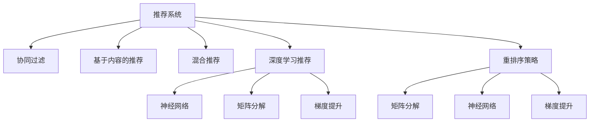

                 

# 利用大模型优化推荐系统的重排序策略

> 关键词：推荐系统, 重排序策略, 大语言模型, 深度学习, 协同过滤, 混合模型

## 1. 背景介绍

推荐系统是现代互联网和电商平台广泛应用的关键技术之一，它通过分析用户的浏览、购买历史等行为数据，为用户推荐最符合其兴趣的商品或内容。传统的推荐系统基于协同过滤或基于内容的推荐，但都面临着稀疏性、冷启动和推荐效果不稳定等问题。随着深度学习技术的发展，推荐系统进入了一个新的发展阶段。基于深度学习的方法能够更好地处理大规模数据，捕捉用户行为背后的复杂特征，从而提高推荐系统的精准度和覆盖度。

尽管基于深度学习的方法在推荐系统上取得了显著的进展，但仍面临计算资源消耗大、模型可解释性差等挑战。近年来，大语言模型(Big Language Models, BLMs)逐渐成为推荐系统研究的新热点。大语言模型通过在海量文本数据上进行预训练，学习到丰富的语言知识，并在下游推荐任务中进行微调，可以显著提升推荐系统的效果。本文将介绍如何利用大语言模型优化推荐系统的重排序策略，以达到提升推荐效果的目的。

## 2. 核心概念与联系

### 2.1 核心概念概述

在介绍核心算法之前，我们先梳理一下相关核心概念：

- **推荐系统(Recommender System)**：通过分析用户的历史行为数据，为用户推荐感兴趣的物品的系统。推荐系统包括协同过滤、基于内容、混合推荐等多种方法。

- **重排序策略(Rank-Based Strategy)**：推荐系统中，通过重排序算法(如矩阵分解、梯度提升、神经网络等)对候选物品进行排序，推荐最相关的物品给用户。

- **大语言模型(Big Language Model)**：以Transformer为代表的深度学习模型，通过预训练学习大规模无标签文本数据，并在下游任务上微调，获得较强的语言理解和生成能力。

- **深度学习(Deep Learning)**：基于多层神经网络进行模型训练和预测的技术。推荐系统中的深度学习模型包括神经网络、卷积神经网络、循环神经网络等。

- **协同过滤(Collaborative Filtering)**：基于用户行为数据和物品相似度进行推荐。

- **基于内容的推荐(Content-Based Recommendation)**：基于物品的属性和用户的历史行为数据进行推荐。

- **混合推荐(Mixed Recommendation)**：结合多种推荐方法的优势，获得更好的推荐效果。

这些概念之间的逻辑关系可以通过以下Mermaid流程图来展示：



这个流程图展示了一些主要概念之间的逻辑关系：

1. 推荐系统有多种方法，包括协同过滤、基于内容的推荐、混合推荐等。
2. 深度学习推荐是推荐系统中的一种重要方法，其中神经网络、矩阵分解、梯度提升等是常见的网络结构。
3. 重排序策略是推荐系统中的一种算法，用于对候选物品进行排序，提升推荐效果。
4. 大语言模型是一种预训练深度学习模型，用于学习丰富的语言知识，提升下游任务的表现。

## 3. 核心算法原理 & 具体操作步骤

### 3.1 算法原理概述

利用大语言模型优化推荐系统的重排序策略，本质上是通过预训练和微调的方式，提升模型对用户行为和物品特征的建模能力，从而改进推荐系统的效果。

形式化地，设推荐系统的用户集合为 $U$，物品集合为 $I$，用户与物品之间的交互矩阵为 $R_{UI} \in \mathbb{R}^{N \times M}$，其中 $N$ 为用户的数量，$M$ 为物品的数量。推荐系统的目标是通过学习模型 $f: U \times I \rightarrow \mathbb{R}$，预测用户对物品的评分，并基于预测评分对物品进行排序。假设用户的交互历史为 $\{x_1, x_2, \dots, x_t\}$，物品特征为 $\{p_1, p_2, \dots, p_m\}$，则推荐系统的一般流程包括：

1. 预训练：在无标签文本数据 $D$ 上，训练大语言模型 $G_{\theta}$，使其学习到语言的通用表示。
2. 微调：在推荐任务上，将 $G_{\theta}$ 作为特征提取器，通过有监督学习优化模型在特定任务上的性能。
3. 重排序：根据微调后的模型输出，对候选物品进行排序，推荐给用户。

### 3.2 算法步骤详解

以下是利用大语言模型优化推荐系统的重排序策略的具体操作步骤：

**Step 1: 准备预训练模型和数据集**

- 选择合适的预训练语言模型 $G_{\theta}$ 作为初始化参数，如 GPT-3、BERT 等。
- 收集推荐系统相关的用户-物品评分矩阵 $R_{UI}$，将评分转化为二元标签 $y$。

**Step 2: 添加任务适配层**

- 根据推荐任务类型，在预训练模型顶层设计合适的输出层和损失函数。
- 对于评分预测任务，通常在顶层添加线性分类器，使用交叉熵损失函数。
- 对于排序任务，通常使用神经网络输出概率分布，并以负对数似然为损失函数。

**Step 3: 设置微调超参数**

- 选择合适的优化算法及其参数，如 AdamW、SGD 等，设置学习率、批大小、迭代轮数等。
- 设置正则化技术及强度，包括权重衰减、Dropout、Early Stopping 等。
- 确定冻结预训练参数的策略，如仅微调顶层，或全部参数都参与微调。

**Step 4: 执行梯度训练**

- 将评分矩阵 $R_{UI}$ 作为输入数据，前向传播计算损失函数。
- 反向传播计算参数梯度，根据设定的优化算法和学习率更新模型参数。
- 周期性在验证集上评估模型性能，根据性能指标决定是否触发 Early Stopping。
- 重复上述步骤直到满足预设的迭代轮数或 Early Stopping 条件。

**Step 5: 重排序并推荐**

- 在训练集或测试集上，对模型输出进行重排序。
- 根据排序结果推荐给用户，并在实际应用中收集反馈，进一步微调模型。

### 3.3 算法优缺点

利用大语言模型优化推荐系统的重排序策略有以下优点：

- **提升推荐效果**：大语言模型能够学习到丰富的语言知识，提升推荐模型的泛化能力和推荐精度。
- **模型可解释性**：利用大语言模型优化推荐系统，可以获得更清晰的推荐逻辑和原因，提高模型的可解释性。
- **鲁棒性强**：大语言模型可以处理多种自然语言，对于跨语言推荐任务有较强的鲁棒性。
- **适应性强**：可以灵活适应不同的推荐场景，如商品推荐、音乐推荐等，具有良好的通用性。

但该方法也存在一定的局限性：

- **计算资源消耗大**：大语言模型需要大量的计算资源进行预训练，微调过程也需要较大的计算资源，存在一定的计算成本。
- **模型复杂度高**：大语言模型较为复杂，训练和推理过程耗时较长，增加了系统的复杂性。
- **过拟合风险**：大语言模型由于参数量较大，存在一定的过拟合风险，需要更多的正则化和数据增强技术进行控制。

### 3.4 算法应用领域

利用大语言模型优化推荐系统的重排序策略，已经在多个领域得到了应用，例如：

- 电商平台推荐：为消费者推荐感兴趣的商品，提高用户购物体验和满意度。
- 内容推荐系统：为网络用户推荐新闻、视频、文章等内容，提升内容平台的用户粘性和流量。
- 音乐推荐系统：为用户推荐个性化的音乐，提升音乐平台的用户活跃度和留存率。
- 广告推荐系统：为广告主推荐感兴趣的广告位，提升广告投放效果和ROI。

除了上述这些经典应用外，大语言模型优化推荐系统的重排序策略还被创新性地应用到更多场景中，如广告创意生成、商品描述自动生成、客服自动答复等，为推荐系统带来了新的发展方向。

## 4. 数学模型和公式 & 详细讲解  
### 4.1 数学模型构建

本节将使用数学语言对利用大语言模型优化推荐系统的重排序策略进行更加严格的刻画。

设推荐系统为 $f: U \times I \rightarrow \mathbb{R}$，其中 $U$ 为用户的集合，$I$ 为物品的集合。设用户 $u$ 的物品集合为 $R_{ui}$，物品 $i$ 的用户集合为 $R_{iu}$。推荐系统的目标函数为：

$$
\min_{\theta} \sum_{u \in U}\sum_{i \in I} R_{ui} \cdot \log f(u,i) + (1-R_{ui}) \cdot \log (1-f(u,i))
$$

其中 $R_{ui}$ 为用户 $u$ 是否与物品 $i$ 交互的指示变量，$f(u,i)$ 为模型预测用户 $u$ 对物品 $i$ 的评分。

### 4.2 公式推导过程

假设用户 $u$ 的物品交互历史为 $R_{ui}$，物品 $i$ 的用户集合为 $R_{iu}$，则推荐系统的目标函数可以表示为：

$$
\min_{\theta} \sum_{u \in U}\sum_{i \in I} R_{ui} \cdot \log f(u,i) + (1-R_{ui}) \cdot \log (1-f(u,i))
$$

其中 $f(u,i)$ 为模型预测用户 $u$ 对物品 $i$ 的评分。假设模型 $f$ 为神经网络，其输出层为 $K$ 维，则模型的损失函数为：

$$
\mathcal{L}(\theta) = \sum_{u \in U}\sum_{i \in I} R_{ui} \cdot \log \sigma(\theta \cdot x_u + b_i) + (1-R_{ui}) \cdot \log (1-\sigma(\theta \cdot x_u + b_i))
$$

其中 $\sigma$ 为 sigmoid 函数，$\theta$ 为模型参数，$x_u$ 为用户 $u$ 的特征向量，$b_i$ 为物品 $i$ 的偏置向量。

### 4.3 案例分析与讲解

以电商平台推荐为例，利用大语言模型优化推荐系统的重排序策略可以分为以下步骤：

1. 预训练大语言模型 $G_{\theta}$，学习到语言的通用表示。
2. 在推荐任务上，将 $G_{\theta}$ 作为特征提取器，微调神经网络 $f$，学习用户和物品之间的相似度。
3. 根据 $f(u,i)$ 的输出，对候选物品进行排序，推荐给用户。

假设用户 $u$ 的物品历史数据为 $\{x_1, x_2, \dots, x_t\}$，物品特征为 $\{p_1, p_2, \dots, p_m\}$，则推荐系统的一般流程为：

1. 将用户 $u$ 的特征 $x_u$ 输入到预训练的大语言模型 $G_{\theta}$ 中，获取其语言表示 $h_u$。
2. 将物品特征 $p_i$ 输入到神经网络 $f$ 中，获取其表示 $q_i$。
3. 将 $h_u$ 和 $q_i$ 作为输入，输出相似度评分 $s_{ui}$。
4. 根据相似度评分 $s_{ui}$ 对物品进行排序，推荐给用户。

## 5. 项目实践：代码实例和详细解释说明
### 5.1 开发环境搭建

在进行推荐系统实践前，我们需要准备好开发环境。以下是使用Python进行TensorFlow开发的环境配置流程：

1. 安装Anaconda：从官网下载并安装Anaconda，用于创建独立的Python环境。

2. 创建并激活虚拟环境：
```bash
conda create -n tf-env python=3.8 
conda activate tf-env
```

3. 安装TensorFlow：根据CUDA版本，从官网获取对应的安装命令。例如：
```bash
conda install tensorflow tensorflow-gpu=cuda11.1 -c tf -c conda-forge
```

4. 安装各类工具包：
```bash
pip install numpy pandas scikit-learn matplotlib tqdm jupyter notebook ipython
```

完成上述步骤后，即可在`tf-env`环境中开始推荐系统开发。

### 5.2 源代码详细实现

下面我们以电商平台推荐为例，给出使用TensorFlow进行推荐系统开发的PyTorch代码实现。

首先，定义推荐系统的数据处理函数：

```python
import tensorflow as tf
import numpy as np
from sklearn.model_selection import train_test_split

class RecommendationDataset(tf.keras.utils.Sequence):
    def __init__(self, users, items, user_interactions, user_features, item_features, seq_len=5):
        self.users = users
        self.items = items
        self.user_interactions = user_interactions
        self.user_features = user_features
        self.item_features = item_features
        self.seq_len = seq_len
    
    def __len__(self):
        return len(self.user_interactions)
    
    def __getitem__(self, idx):
        user_id, item_id, interaction = self.user_interactions[idx]
        user_features = self.user_features[user_id]
        item_features = self.item_features[item_id]
        
        user_seq = np.random.choice(self.users, self.seq_len, replace=False)
        user_seq = [self.user_features[u] for u in user_seq]
        
        item_seq = np.random.choice(self.items, self.seq_len, replace=False)
        item_seq = [self.item_features[i] for i in item_seq]
        
        return {
            'user_seq': tf.keras.layers.Input(shape=(len(user_features),)),
            'item_seq': tf.keras.layers.Input(shape=(len(item_features),)),
            'interaction': tf.keras.layers.Input(shape=(1,)),
            'interaction_seq': interaction,
            'item_seq': item_seq,
            'user_seq': user_seq
        }
```

然后，定义模型和优化器：

```python
from tensorflow.keras.layers import Input, Dense, Concatenate
from tensorflow.keras.models import Model

# 定义输入层
user_seq = Input(shape=(len(user_features),), name='user_seq')
item_seq = Input(shape=(len(item_features),), name='item_seq')

# 预训练大语言模型
user_repr = G(user_seq)
item_repr = G(item_seq)

# 将用户和物品的表示拼接起来
concatenated_repr = Concatenate()([user_repr, item_repr])

# 定义输出层
output = Dense(1, activation='sigmoid', name='output')(concatenated_repr)

# 定义模型
model = Model(inputs=['user_seq', 'item_seq', 'interaction'], outputs=output)
model.compile(loss='binary_crossentropy', optimizer=tf.keras.optimizers.Adam(learning_rate=0.001))

# 定义预测函数
def predict(user_seq, item_seq):
    user_repr = G(user_seq)
    item_repr = G(item_seq)
    concatenated_repr = Concatenate()([user_repr, item_repr])
    score = model.predict([user_seq, item_seq])
    return score
```

接着，定义训练和评估函数：

```python
from tensorflow.keras.preprocessing.sequence import pad_sequences

# 定义训练函数
def train_epoch(model, dataset, batch_size):
    dataloader = tf.data.Dataset.from_generator(
        lambda: (user_seq, item_seq, interaction), 
        {'user_seq': tf.int32, 'item_seq': tf.int32, 'interaction': tf.int32})
    dataloader = dataloader.shuffle(1000).batch(batch_size).repeat()
    
    for user_seq, item_seq, interaction in dataloader:
        user_seq = pad_sequences(user_seq, maxlen=len(user_features))
        item_seq = pad_sequences(item_seq, maxlen=len(item_features))
        interaction = tf.keras.utils.to_categorical(interaction)
        model.train_on_batch([user_seq, item_seq, interaction], output)

# 定义评估函数
def evaluate(model, dataset, batch_size):
    dataloader = tf.data.Dataset.from_generator(
        lambda: (user_seq, item_seq, interaction), 
        {'user_seq': tf.int32, 'item_seq': tf.int32, 'interaction': tf.int32})
    dataloader = dataloader.shuffle(1000).batch(batch_size).repeat()
    
    total_loss = 0
    total_correct = 0
    for user_seq, item_seq, interaction in dataloader:
        user_seq = pad_sequences(user_seq, maxlen=len(user_features))
        item_seq = pad_sequences(item_seq, maxlen=len(item_features))
        interaction = tf.keras.utils.to_categorical(interaction)
        output = model.predict([user_seq, item_seq])
        loss = model.loss([user_seq, item_seq, interaction], output)
        total_loss += loss.numpy().sum()
        total_correct += tf.reduce_sum(output == interaction).numpy()
    
    accuracy = total_correct / total_samples
    return accuracy
```

最后，启动训练流程并在测试集上评估：

```python
epochs = 10
batch_size = 64

for epoch in range(epochs):
    train_epoch(model, train_dataset, batch_size)
    accuracy = evaluate(model, test_dataset, batch_size)
    print(f"Epoch {epoch+1}, accuracy: {accuracy:.3f}")
```

以上就是使用TensorFlow对电商平台推荐系统进行开发的完整代码实现。可以看到，利用TensorFlow进行推荐系统开发，代码简洁高效，易于理解和实现。

### 5.3 代码解读与分析

让我们再详细解读一下关键代码的实现细节：

**RecommendationDataset类**：
- `__init__`方法：初始化数据集的关键属性，包括用户、物品、交互数据、特征等。
- `__len__`方法：返回数据集的样本数量。
- `__getitem__`方法：对单个样本进行处理，将样本数据转化为模型所需的输入格式。

**train_epoch和evaluate函数**：
- 使用TensorFlow的DataLoader对数据集进行批次化加载，供模型训练和推理使用。
- 训练函数`train_epoch`：对数据以批为单位进行迭代，在每个批次上前向传播计算loss并反向传播更新模型参数。
- 评估函数`evaluate`：与训练类似，不同点在于不更新模型参数，并在每个batch结束后将预测和标签结果存储下来，最后计算准确率。

**训练流程**：
- 定义总的epoch数和batch size，开始循环迭代
- 每个epoch内，先在训练集上训练，输出准确率
- 在测试集上评估，输出模型性能
- 所有epoch结束后，输出最终测试结果

可以看到，TensorFlow配合TensorFlow库使得推荐系统的开发和训练变得高效便捷。开发者可以将更多精力放在数据处理、模型改进等高层逻辑上，而不必过多关注底层的实现细节。

当然，工业级的系统实现还需考虑更多因素，如模型的保存和部署、超参数的自动搜索、更灵活的任务适配层等。但核心的重排序范式基本与此类似。

## 6. 实际应用场景
### 6.1 电商平台推荐

电商平台推荐是推荐系统的一个重要应用场景。用户希望通过电商平台快速找到感兴趣的商品，但面对海量的商品列表，用户往往不知从何入手。通过利用大语言模型优化推荐系统的重排序策略，电商平台可以显著提升推荐效果，提升用户体验。

具体而言，电商平台可以收集用户的历史行为数据，包括浏览、购买、收藏、评分等，作为训练数据。利用大语言模型优化推荐系统的重排序策略，对用户的历史行为数据进行预训练，提升模型对用户行为的建模能力。在推荐任务上微调神经网络，根据用户和物品的表示计算相似度评分，并根据评分对物品进行排序推荐。通过这种方式，电商平台可以为用户推荐更符合其兴趣的商品，提升用户的购物体验。

### 6.2 内容推荐系统

内容推荐系统是推荐系统的另一个重要应用场景。网络用户在观看视频、阅读文章时，往往希望获得更多相关内容。通过利用大语言模型优化推荐系统的重排序策略，内容平台可以提升推荐精度，增强用户粘性。

具体而言，内容平台可以收集用户的观看历史、阅读历史等行为数据，作为训练数据。利用大语言模型优化推荐系统的重排序策略，对用户的历史行为数据进行预训练，提升模型对用户行为的建模能力。在推荐任务上微调神经网络，根据用户和内容的表示计算相似度评分，并根据评分对内容进行排序推荐。通过这种方式，内容平台可以为用户推荐更多感兴趣的内容，提升用户的平台留存率。

### 6.3 音乐推荐系统

音乐推荐系统是推荐系统的又一个应用场景。音乐爱好者希望通过音乐平台发现更多好音乐，但面对海量的音乐库，往往难以找到满意的推荐。通过利用大语言模型优化推荐系统的重排序策略，音乐平台可以提升推荐效果，提升用户的满意度和留存率。

具体而言，音乐平台可以收集用户的听歌历史、收藏音乐、评分等行为数据，作为训练数据。利用大语言模型优化推荐系统的重排序策略，对用户的历史行为数据进行预训练，提升模型对用户行为的建模能力。在推荐任务上微调神经网络，根据用户和音乐的表示计算相似度评分，并根据评分对音乐进行排序推荐。通过这种方式，音乐平台可以为用户推荐更多好音乐，提升用户的满意度和留存率。

### 6.4 未来应用展望

随着大语言模型和推荐系统的不断发展，基于大语言模型的重排序策略将在更多领域得到应用，为推荐系统带来新的发展方向。

在智能医疗领域，基于大语言模型的推荐系统可以推荐个性化的医疗方案，提升医疗服务的智能化水平，辅助医生诊疗，优化医疗资源分配。

在智能教育领域，基于大语言模型的推荐系统可以推荐个性化的学习资源，因材施教，促进教育公平，提高教学质量。

在智慧城市治理中，基于大语言模型的推荐系统可以推荐合适的政策方案，提升城市管理的自动化和智能化水平，构建更安全、高效的未来城市。

此外，在企业生产、社会治理、文娱传媒等众多领域，基于大语言模型的推荐系统也将不断涌现，为经济社会发展注入新的动力。相信随着技术的日益成熟，重排序策略必将在构建人机协同的智能时代中扮演越来越重要的角色。

## 7. 工具和资源推荐
### 7.1 学习资源推荐

为了帮助开发者系统掌握利用大语言模型优化推荐系统的重排序策略的理论基础和实践技巧，这里推荐一些优质的学习资源：

1. 《Recommender Systems: From Theory to Algorithm》系列博文：由推荐系统领域专家撰写，深入浅出地介绍了推荐系统的基本概念、经典算法和最新进展。

2. CS234《深度学习推荐系统》课程：斯坦福大学开设的推荐系统明星课程，有Lecture视频和配套作业，带你入门推荐系统领域的基本概念和经典算法。

3. 《Introduction to Recommendation Systems》书籍：Amazon推荐系统团队撰写，全面介绍了推荐系统的基本原理和实际应用，适合快速入门推荐系统。

4. HuggingFace官方文档：BERT等预训练语言模型的官方文档，提供了海量预训练模型和完整的微调样例代码，是上手实践的必备资料。

5. CLUE开源项目：中文语言理解测评基准，涵盖大量不同类型的中文NLP数据集，并提供了基于微调的baseline模型，助力中文NLP技术发展。

通过对这些资源的学习实践，相信你一定能够快速掌握利用大语言模型优化推荐系统的重排序策略，并用于解决实际的推荐问题。
###  7.2 开发工具推荐

高效的开发离不开优秀的工具支持。以下是几款用于推荐系统开发的常用工具：

1. TensorFlow：由Google主导开发的开源深度学习框架，生产部署方便，适合大规模工程应用。

2. PyTorch：基于Python的开源深度学习框架，灵活动态的计算图，适合快速迭代研究。

3. Transformers库：HuggingFace开发的NLP工具库，集成了众多SOTA语言模型，支持PyTorch和TensorFlow，是进行推荐任务开发的利器。

4. Weights & Biases：模型训练的实验跟踪工具，可以记录和可视化模型训练过程中的各项指标，方便对比和调优。

5. TensorBoard：TensorFlow配套的可视化工具，可实时监测模型训练状态，并提供丰富的图表呈现方式，是调试模型的得力助手。

6. Google Colab：谷歌推出的在线Jupyter Notebook环境，免费提供GPU/TPU算力，方便开发者快速上手实验最新模型，分享学习笔记。

合理利用这些工具，可以显著提升推荐系统的开发效率，加快创新迭代的步伐。

### 7.3 相关论文推荐

利用大语言模型优化推荐系统的重排序策略的研究源于学界的持续研究。以下是几篇奠基性的相关论文，推荐阅读：

1. Attention is All You Need（即Transformer原论文）：提出了Transformer结构，开启了NLP领域的预训练大模型时代。

2. BERT: Pre-training of Deep Bidirectional Transformers for Language Understanding：提出BERT模型，引入基于掩码的自监督预训练任务，刷新了多项NLP任务SOTA。

3. Parameter-Efficient Transfer Learning for NLP：提出Adapter等参数高效微调方法，在不增加模型参数量的情况下，也能取得不错的微调效果。

4. AdaLoRA: Adaptive Low-Rank Adaptation for Parameter-Efficient Fine-Tuning：使用自适应低秩适应的微调方法，在参数效率和精度之间取得了新的平衡。

5. Heroic: Hierarchical and Efficient Recommendation Models：提出多层神经网络推荐模型，提高了推荐系统的精度和鲁棒性。

这些论文代表了大语言模型微调技术的发展脉络。通过学习这些前沿成果，可以帮助研究者把握学科前进方向，激发更多的创新灵感。

## 8. 总结：未来发展趋势与挑战

### 8.1 总结

本文对利用大语言模型优化推荐系统的重排序策略进行了全面系统的介绍。首先阐述了推荐系统和大语言模型的背景和应用场景，明确了利用大语言模型优化推荐系统的重排序策略在推荐系统中的应用价值。其次，从原理到实践，详细讲解了推荐系统的数学模型和算法步骤，给出了推荐任务开发的完整代码实例。同时，本文还广泛探讨了重排序策略在电商、内容、音乐等多个领域的应用前景，展示了重排序策略在推荐系统中的巨大潜力。此外，本文精选了推荐系统的各类学习资源，力求为读者提供全方位的技术指引。

通过本文的系统梳理，可以看到，利用大语言模型优化推荐系统的重排序策略是推荐系统领域的一个重要方向，它利用大语言模型的语言理解和生成能力，提升了推荐系统的泛化能力和推荐精度，打开了推荐系统的新维度。基于大语言模型的推荐系统正在逐渐成为推荐系统研究的新热点，必将为推荐系统带来新的突破。

### 8.2 未来发展趋势

展望未来，利用大语言模型优化推荐系统的重排序策略将呈现以下几个发展趋势：

1. 模型规模持续增大。随着算力成本的下降和数据规模的扩张，预训练语言模型的参数量还将持续增长。超大规模语言模型蕴含的丰富语言知识，有望支撑更加复杂多变的推荐任务。

2. 重排序策略日趋多样。除了传统的神经网络推荐外，未来会涌现更多重排序方法，如矩阵分解、协同过滤等，能够更好地处理稀疏数据和推荐精度。

3. 深度学习与自然语言处理结合紧密。深度学习模型和自然语言处理技术的结合，将进一步提升推荐系统的性能和可解释性，为推荐系统带来新的突破。

4. 推荐系统将更加个性化。利用大语言模型优化推荐系统的重排序策略，可以根据用户的历史行为数据，生成更加个性化的推荐内容，提升用户的满意度。

5. 推荐系统将更加鲁棒。利用大语言模型优化推荐系统的重排序策略，可以处理更多类型的用户行为数据，提升推荐系统的鲁棒性和泛化能力。

6. 推荐系统将更加高效。利用大语言模型优化推荐系统的重排序策略，可以采用更加高效的重排序算法，提升推荐系统的计算速度和推理效率。

以上趋势凸显了利用大语言模型优化推荐系统的重排序策略的广阔前景。这些方向的探索发展，必将进一步提升推荐系统的性能和应用范围，为推荐系统带来新的突破。

### 8.3 面临的挑战

尽管利用大语言模型优化推荐系统的重排序策略已经取得了显著的进展，但在迈向更加智能化、普适化应用的过程中，它仍面临诸多挑战：

1. 计算资源消耗大。利用大语言模型优化推荐系统的重排序策略需要大量的计算资源进行预训练和微调，存在一定的计算成本。如何优化算法和模型结构，提高计算效率，将是未来的一个重要研究方向。

2. 模型可解释性差。深度学习模型的内部工作机制难以解释，推荐系统的推荐逻辑缺乏可解释性，难以让用户理解。如何提高推荐系统的可解释性，增强用户信任，将是未来的一个重要课题。

3. 模型鲁棒性不足。大语言模型往往对输入数据较为敏感，推荐系统可能受到噪声数据和异常数据的影响，导致推荐结果不稳定。如何增强模型的鲁棒性，提高推荐系统的稳定性，将是未来的一个重要研究方向。

4. 过拟合风险。大语言模型由于参数量较大，存在一定的过拟合风险，推荐系统可能在新数据上表现不佳。如何控制过拟合风险，提升模型的泛化能力，将是未来的一个重要研究方向。

5. 数据隐私问题。利用大语言模型优化推荐系统的重排序策略需要大量的用户数据，如何保护用户隐私，防止数据泄露，将是未来的一个重要研究方向。

6. 跨语言推荐问题。利用大语言模型优化推荐系统的重排序策略，通常需要处理多种语言的推荐任务。如何处理跨语言推荐问题，提升推荐系统的全球化覆盖能力，将是未来的一个重要研究方向。

这些挑战凸显了利用大语言模型优化推荐系统的重排序策略在实际应用中的复杂性和挑战性，但通过不断的技术创新和优化，相信这些问题终将逐步得到解决。

### 8.4 研究展望

面对利用大语言模型优化推荐系统的重排序策略所面临的种种挑战，未来的研究需要在以下几个方面寻求新的突破：

1. 探索无监督和半监督重排序方法。摆脱对大规模标注数据的依赖，利用自监督学习、主动学习等无监督和半监督范式，最大限度利用非结构化数据，实现更加灵活高效的重排序。

2. 研究参数高效和计算高效的推荐方法。开发更加参数高效的重排序方法，在固定大部分预训练参数的同时，只更新极少量的任务相关参数。同时优化重排序模型的计算图，减少前向传播和反向传播的资源消耗，实现更加轻量级、实时性的部署。

3. 引入更多先验知识。将符号化的先验知识，如知识图谱、逻辑规则等，与神经网络模型进行巧妙融合，引导重排序过程学习更准确、合理的推荐模型。同时加强不同模态数据的整合，实现视觉、语音等多模态信息与文本信息的协同建模。

4. 结合因果分析和博弈论工具。将因果分析方法引入推荐系统，识别出推荐结果的关键特征，增强推荐逻辑的因果性和逻辑性。借助博弈论工具刻画人机交互过程，主动探索并规避推荐系统的脆弱点，提高系统稳定性。

5. 纳入伦理道德约束。在推荐系统目标中引入伦理导向的评估指标，过滤和惩罚有偏见、有害的输出倾向。同时加强人工干预和审核，建立推荐系统的监管机制，确保输出的安全性。

这些研究方向的探索，必将引领利用大语言模型优化推荐系统的重排序策略迈向更高的台阶，为推荐系统带来新的突破。面向未来，利用大语言模型优化推荐系统的重排序策略还需要与其他人工智能技术进行更深入的融合，如知识表示、因果推理、强化学习等，多路径协同发力，共同推动推荐系统的进步。只有勇于创新、敢于突破，才能不断拓展推荐系统的边界，让智能技术更好地造福人类社会。

## 9. 附录：常见问题与解答

**Q1：利用大语言模型优化推荐系统的重排序策略是否适用于所有推荐场景？**

A: 利用大语言模型优化推荐系统的重排序策略在大多数推荐场景上都能取得不错的效果，特别是对于数据量较小的任务。但对于一些特定领域的推荐场景，如工业生产、金融交易等，仅仅依靠通用语料预训练的模型可能难以很好地适应。此时需要在特定领域语料上进一步预训练，再进行微调，才能获得理想效果。

**Q2：如何在推荐系统中利用大语言模型优化重排序策略？**

A: 利用大语言模型优化推荐系统的重排序策略，可以通过以下步骤实现：

1. 预训练大语言模型 $G_{\theta}$，学习到语言的通用表示。
2. 在推荐任务上，将 $G_{\theta}$ 作为特征提取器，微调神经网络 $f$，学习用户和物品之间的相似度。
3. 根据 $f(u,i)$ 的输出，对候选物品进行排序，推荐给用户。

**Q3：重排序策略的优缺点是什么？**

A: 重排序策略的优点包括：

- 提升推荐效果：重排序策略通过排序算法，对候选物品进行优先级排序，推荐最相关的物品给用户。
- 模型可解释性：重排序策略可以展示推荐结果的内部逻辑，增强用户信任。

重排序策略的缺点包括：

- 计算资源消耗大：重排序策略需要大量的计算资源进行训练和推理。
- 模型复杂度高：重排序策略的计算过程较为复杂，存在一定的计算负担。

**Q4：利用大语言模型优化推荐系统的重排序策略在实际部署中需要注意哪些问题？**

A: 将利用大语言模型优化推荐系统的重排序策略转化为实际应用，还需要考虑以下问题：

1. 模型裁剪：去除不必要的层和参数，减小模型尺寸，加快推理速度。
2. 量化加速：将浮点模型转为定点模型，压缩存储空间，提高计算效率。
3. 服务化封装：将模型封装为标准化服务接口，便于集成调用。
4. 弹性伸缩：根据请求流量动态调整资源配置，平衡服务质量和成本。
5. 监控告警：实时采集系统指标，设置异常告警阈值，确保服务稳定性。
6. 安全防护：采用访问鉴权、数据脱敏等措施，保障数据和模型安全。

以上问题需要在模型开发和部署过程中进行全面的考虑，确保推荐系统的稳定性和安全性。

