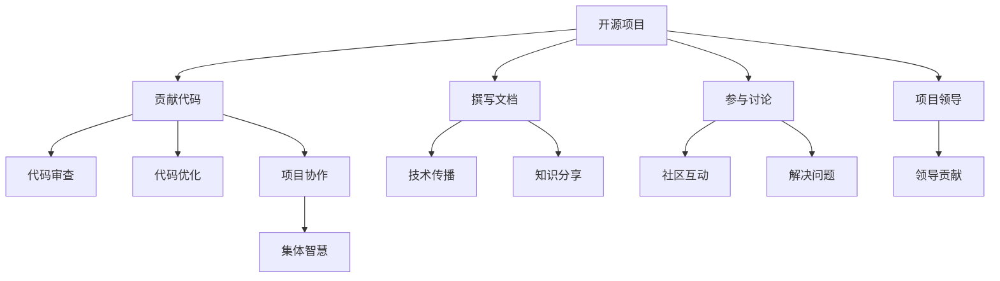

                 

# 利用开源项目打造个人品牌

> 关键词：开源项目,品牌建设,软件开发,社区参与,项目贡献

## 1. 背景介绍

在当今数字化时代，个人品牌已经成为职场竞争中不可或缺的一部分。对于软件开发人员而言，拥有一个强大的个人品牌不仅能提升自身职业发展，还能吸引更多的合作机会，实现个人价值的最大化。然而，如何在技术社区中脱颖而出，建立一个具有影响力和号召力的个人品牌，是许多开发者面临的共同挑战。幸运的是，开源项目提供了一个极佳的平台，使得开发者能够通过参与项目贡献，展示自己的技术实力和创新能力，逐步建立起个人品牌。

### 1.1 个人品牌的定义与重要性

个人品牌是个人在特定领域内建立的独特形象和价值主张，通过特定行为和成果在目标群体中形成的影响力和认同感。在软件开发领域，个人品牌通常包含以下几个方面：

1. **技术能力**：展示对编程语言的精通程度、算法和数据结构的熟悉度以及解决问题的能力。
2. **创新能力**：展示在技术上的创新思维，如新工具、新框架的开发和应用。
3. **社区影响力**：在开源社区中活跃，通过贡献代码、撰写文档、参与讨论等方式影响他人。
4. **项目领导力**：展示在领导和管理开源项目中的经验，如项目组织、团队协作等。

个人品牌的重要性在于：

- **职业发展**：强大的个人品牌能够帮助开发者在求职面试中脱颖而出，获得更好的职位和发展机会。
- **技术传播**：通过个人品牌，开发者可以将自己的技术见解和经验传播给更多人，推动整个行业的进步。
- **影响力**：个人品牌可以为开发者带来更多的合作和资源，促进职业成长和转型。

### 1.2 开源项目的定义与优势

开源项目是指那些代码开放、任何人都可以参与贡献的软件项目。这些项目通常使用诸如GitHub、GitLab等版本控制系统进行管理和协作。开源项目的优势包括：

- **透明度高**：所有代码和讨论都是公开透明的，任何人都可以查看、修改和评论。
- **社区驱动**：项目的发展由社区成员共同决定，能够集中多方面的智慧和力量。
- **快速迭代**：项目在不断的迭代中进化，快速响应市场需求和技术变革。
- **资源丰富**：开源社区拥有大量优秀的开发者、工具和文档，可极大提升开发效率。

## 2. 核心概念与联系

为了更好地理解利用开源项目打造个人品牌的机制，本节将介绍几个核心概念及其联系。

### 2.1 核心概念概述

- **开源项目**：指那些代码开放、任何人都可以参与贡献的软件项目，如Linux、Apache Hadoop等。
- **个人品牌**：指在特定领域内建立的独特形象和价值主张，展示技术能力、创新能力、社区影响力和项目领导力。
- **技术社区**：指以技术交流、知识共享、协作开发为核心的在线社区，如GitHub、Stack Overflow等。
- **贡献代码**：指开发者在开源项目中提交代码，参与项目开发和改进。
- **撰写文档**：指开发者撰写技术文档、教程、指南等，帮助他人理解和贡献项目。
- **参与讨论**：指开发者在开源社区中参与讨论、问题解答、设计评审等，提升社区互动性。

这些概念之间的逻辑关系可以通过以下Mermaid流程图来展示：



这个流程图展示了一个开发者在开源项目中逐步建立起个人品牌的过程：

1. 通过贡献代码参与项目开发，展示技术能力。
2. 撰写文档，帮助他人理解项目，提升技术传播能力。
3. 参与讨论，提升社区互动和影响力。
4. 通过优化代码、领导项目等活动，展示项目领导力和组织能力。

## 3. 核心算法原理 & 具体操作步骤
### 3.1 算法原理概述

利用开源项目打造个人品牌的过程，本质上是一种基于贡献与影响力的正反馈循环。其核心思想是：

1. **积累贡献**：通过不断提交代码、优化功能、修复Bug等，在开源项目中积累技术实力和经验。
2. **提升影响力**：通过撰写文档、回答社区问题、领导项目等方式，提升在技术社区中的知名度和影响力。
3. **迭代提升**：随着贡献和影响力的增加，个人品牌也将不断强化，吸引更多的合作机会和资源。

这一过程可以用以下公式来概括：

$$
品牌价值 = 贡献量 \times 影响力
$$

其中，“贡献量”指的是开发者在开源项目中的技术贡献和工作量，通常可以通过提交的Pull Request数量、代码行数等来衡量。“影响力”则是指开发者在社区中的互动频次、关注度、领导能力等，可以通过评论数量、开源项目贡献者排名等来衡量。

### 3.2 算法步骤详解

以下是利用开源项目打造个人品牌的具体操作步骤：

1. **选择开源项目**：
   - 根据个人兴趣和技术栈，选择一个开源项目。
   - 项目应具有一定的活跃度和社区支持，便于初期参与和后续发展。

2. **学习项目代码**：
   - 熟悉项目的代码结构、开发流程和社区规则。
   - 阅读项目的README文档、贡献指南等，理解项目需求和开发流程。

3. **提交第一个Pull Request**：
   - 找到适合初学者的入门任务，如修复Bug、优化功能等。
   - 在GitHub上创建Feature Branch，添加代码并提交Pull Request。
   - 等待社区成员审核和反馈，并根据建议进行修改。

4. **逐步增加贡献量**：
   - 持续提交代码，优化功能，修复Bug，参与重大功能的开发。
   - 积累贡献量，并在项目贡献者排名中逐步提升。

5. **提升影响力**：
   - 在社区中积极参与讨论，回答问题，提供有价值的见解。
   - 撰写技术文档、教程、博客等，分享知识和经验。
   - 参与项目设计评审，提出有见地的建议和改进方案。
   - 在社区中建立个人品牌，吸引更多关注和合作机会。

### 3.3 算法优缺点

利用开源项目打造个人品牌的方法具有以下优点：

- **低门槛**：任何人都可以通过提交代码、撰写文档等方式参与开源项目。
- **高度透明**：贡献和影响力的提升过程公开透明，便于追踪和验证。
- **广泛曝光**：通过开源社区的曝光，个人的技术和贡献可以被更多人看到。

然而，该方法也存在以下缺点：

- **时间成本高**：需要投入大量时间参与项目，影响工作和生活平衡。
- **技术门槛**：对技术栈和项目管理有一定要求，需要持续学习和提升。
- **社区文化差异**：不同项目社区的规则和文化可能存在差异，需要适应和理解。

### 3.4 算法应用领域

利用开源项目打造个人品牌的方法不仅适用于软件开发，还可以应用于多个领域，如数据科学、人工智能、生物信息学等。以下是几个具体的应用场景：

- **数据科学项目**：参与Kaggle竞赛、开源数据集分析等，通过提交分析和模型，展示数据分析和建模能力。
- **人工智能项目**：参与TensorFlow、PyTorch等框架的贡献，展示机器学习和深度学习技能。
- **生物信息学项目**：参与GenBank、Bioconductor等生物信息学库的贡献，展示生物信息学分析和研究能力。

## 4. 数学模型和公式 & 详细讲解
### 4.1 数学模型构建

假设开发者在开源项目中的贡献量为 $C$，影响力为 $I$，个人品牌价值为 $B$。则品牌价值可以表示为：

$$
B = C \times I
$$

### 4.2 公式推导过程

1. **贡献量 $C$ 的计算**：
   - 贡献量 $C$ 可以通过提交的Pull Request数量 $P$、代码行数 $L$、修复的Bug数量 $B_{\text{bug}}$ 等来衡量。
   - 假设每提交一个Pull Request贡献量为1单位，则有：
     \[
     C = \sum_{i=1}^{n} P_i
     \]
   其中 $P_i$ 表示第 $i$ 个Pull Request的贡献量。

2. **影响力 $I$ 的计算**：
   - 影响力 $I$ 可以通过评论数量 $C_{\text{comment}}$、开源项目贡献者排名 $R$、领导项目数量 $L_{\text{lead}}$ 等来衡量。
   - 假设每个评论贡献量为0.1单位，则有：
     \[
     I = 0.1 \times C_{\text{comment}} + R + L_{\text{lead}}
     \]

### 4.3 案例分析与讲解

以GitHub上的OpenAI的GPT-3模型为例，展示如何通过贡献代码和提升影响力来提升个人品牌价值。

1. **贡献代码**：
   - 在GPT-3模型中，开发者可以参与到自然语言处理算法、模型优化、文档编写等多个方面。
   - 例如，可以提交代码修复Bug，优化模型性能，撰写代码实现教程等。
   - 通过这些贡献，展示在自然语言处理和深度学习方面的技术实力。

2. **提升影响力**：
   - 在社区中积极参与讨论，回答开发者的问题，提供技术支持。
   - 撰写详细的技术文档和教程，帮助社区成员理解模型使用。
   - 参与项目设计评审，提出改进建议，展示领导力。
   - 通过这些活动，提升在社区中的知名度和影响力。

## 5. 项目实践：代码实例和详细解释说明
### 5.1 开发环境搭建

为了顺利参与开源项目并打造个人品牌，开发者需要搭建一个高效的开源项目开发环境。以下是一些常见的开发工具和平台：

1. **版本控制系统**：
   - 安装Git，使用GitHub或GitLab作为代码托管平台。
   - 学习基本的Git命令，如clone、add、commit、push等。

2. **开发环境**：
   - 安装Python、Java、C++等开发工具。
   - 使用IDE，如PyCharm、Eclipse、Visual Studio等，提升开发效率。

3. **持续集成工具**：
   - 安装Jenkins、Travis CI等持续集成工具，自动构建和测试代码。
   - 配置CI流水线，自动推送代码到测试环境，提升开发效率。

4. **协作工具**：
   - 使用Slack、Discord等即时通讯工具，与项目成员沟通协作。
   - 使用GitHub Issues、Jira等问题跟踪工具，管理项目任务和进度。

### 5.2 源代码详细实现

以下是使用Python对开源项目进行贡献的示例代码：

1. **创建Feature Branch**：
   ```python
   # 创建Feature Branch
   git checkout -b feature/submit_patch
   ```

2. **添加代码并提交Pull Request**：
   ```python
   # 添加代码
   # 修改代码文件
   # 删除文件
   # 新增文件
   # 提交代码
   git add .
   git commit -m "Add feature"
   
   # 推送到远程仓库
   git push origin feature/submit_patch
   ```

3. **提交Pull Request**：
   ```python
   # 打开Pull Request页面
   https://github.com/your_username/your_project/pulls
   
   # 描述提交内容
   [Add feature] Add new feature
   
   # 选择相关标签
   [Contributor: Your Name]
   
   # 提交Pull Request
   Commit new change
   ```

### 5.3 代码解读与分析

上述代码展示了如何通过Git实现开源项目的代码提交和Pull Request。具体步骤如下：

1. **创建Feature Branch**：
   - 通过 `git checkout -b feature/submit_patch` 命令，创建一个新的Feature Branch，用于存放对项目的修改。

2. **添加代码并提交**：
   - 在Feature Branch中修改代码文件、删除文件或新增文件，然后通过 `git add .` 命令将更改提交到暂存区。
   - 使用 `git commit -m "Add feature"` 命令提交代码，并添加提交说明。
   - 通过 `git push origin feature/submit_patch` 命令将修改推送到远程仓库。

3. **提交Pull Request**：
   - 在GitHub或GitLab上，打开项目的Pull Request页面，选择对应的Feature Branch。
   - 填写Pull Request标题和描述，添加相关标签，选择“Commit new change”按钮提交Pull Request。

### 5.4 运行结果展示

成功提交Pull Request后，项目经理或社区成员会进行代码审核，并提供反馈。开发者需要根据反馈进行修改，确保代码符合项目规范和需求。

## 6. 实际应用场景
### 6.1 开源软件开发

开源软件开发是利用开源项目打造个人品牌的常见场景。开发者可以在开源项目中展示技术能力和创新能力，逐步建立起个人品牌。

1. **贡献代码**：
   - 选择感兴趣的开源项目，参与项目开发。
   - 通过修复Bug、优化功能等方式积累贡献量。

2. **提升影响力**：
   - 积极参与社区讨论，回答问题，提供技术支持。
   - 撰写详细的技术文档和教程，分享知识和经验。
   - 参与项目设计评审，提出改进建议，展示领导力。

3. **品牌展示**：
   - 在GitHub、GitLab等平台上展示个人贡献和影响力。
   - 通过博客、论文、会议等方式展示技术成果和影响力。

### 6.2 开源数据科学

开源数据科学项目为开发者提供了一个展示数据科学和机器学习技能的平台。通过参与数据分析、模型训练、代码优化等工作，逐步建立起个人品牌。

1. **贡献代码**：
   - 参与开源数据集分析和机器学习模型训练。
   - 修复代码Bug，优化模型性能。

2. **提升影响力**：
   - 在社区中积极参与讨论，回答问题，提供技术支持。
   - 撰写详细的技术文档和教程，分享知识和经验。
   - 参与项目设计评审，提出改进建议，展示领导力。

3. **品牌展示**：
   - 在Kaggle、GitHub等平台上展示个人贡献和影响力。
   - 通过博客、论文、会议等方式展示技术成果和影响力。

### 6.3 开源人工智能

开源人工智能项目为开发者提供了一个展示机器学习和深度学习技能的平台。通过参与模型优化、算法改进、代码优化等工作，逐步建立起个人品牌。

1. **贡献代码**：
   - 参与开源AI框架和算法的开发。
   - 修复代码Bug，优化模型性能。

2. **提升影响力**：
   - 在社区中积极参与讨论，回答问题，提供技术支持。
   - 撰写详细的技术文档和教程，分享知识和经验。
   - 参与项目设计评审，提出改进建议，展示领导力。

3. **品牌展示**：
   - 在GitHub、GitLab等平台上展示个人贡献和影响力。
   - 通过博客、论文、会议等方式展示技术成果和影响力。

## 7. 工具和资源推荐
### 7.1 学习资源推荐

为了帮助开发者系统掌握开源项目开发和品牌建设的技术基础，这里推荐一些优质的学习资源：

1. **《开源开发实战指南》**：该书详细介绍了Git、GitHub、GitLab等开源开发工具的使用，适合初学者入门。
2. **《开源社区建设与维护》**：该书介绍了开源社区的建设和维护方法，帮助开发者建立自己的开源项目。
3. **《GitHub入门与实践》**：该课程通过实践项目，手把手教开发者如何使用GitHub平台进行代码管理和贡献。
4. **《Open Source Guide》**：该网站提供了开源项目的最佳实践和开发建议，适合开发者参考学习。
5. **《Open Source For Business》**：该网站介绍了开源项目在商业应用中的价值和策略，适合企业开发者参考。

通过对这些资源的学习实践，相信你一定能够快速掌握开源项目开发的技术和方法，逐步建立起个人品牌。

### 7.2 开发工具推荐

高效的开发离不开优秀的工具支持。以下是几款用于开源项目开发和品牌建设的工具：

1. **GitHub**：全球最大的开源社区平台，提供代码托管、问题跟踪、协作开发等功能。
2. **GitLab**：功能丰富的开源代码托管平台，支持CI/CD、项目管理、代码审查等。
3. **Jenkins**：流行的持续集成工具，支持多种编程语言和框架，易于配置和扩展。
4. **Travis CI**：基于云的持续集成工具，自动构建和测试代码，提升开发效率。
5. **Slack**：流行的即时通讯工具，支持频道、消息、文件共享等功能，便于社区成员沟通协作。
6. **Discord**：流行的即时通讯工具，支持语音、视频、表情等功能，便于社区成员互动。
7. **GitHub Issues**：流行的问题跟踪工具，支持任务管理、讨论、评论等功能，便于项目进度管理。
8. **Jira**：功能强大的问题跟踪工具，支持敏捷开发、Scrum管理等功能，便于项目协作。

合理利用这些工具，可以显著提升开源项目开发和品牌建设的效率，加快创新迭代的步伐。

### 7.3 相关论文推荐

开源项目和品牌建设的理论研究源于学界的持续研究。以下是几篇奠基性的相关论文，推荐阅读：

1. **《Open Source Software: The Computational Revolution in Science and Engineering》**：该论文介绍了开源软件对科学研究和技术进步的贡献，适合技术开发者和科研人员阅读。
2. **《Open Source Development: Building Resilient, Collaborative Technology Projects》**：该书籍深入探讨了开源项目的合作机制和项目管理，适合开源开发者和项目经理参考。
3. **《The Economics of Open Source Software: Volume I》**：该书籍介绍了开源软件的经济学原理和市场机制，适合经济学家和开源开发者阅读。
4. **《Building Your Open Source Project: A Primer》**：该书提供了开源项目开发的详细指南，适合开源开发者参考学习。
5. **《The Business of Open Source: Success in the Open Source Ecosystem》**：该书籍介绍了开源软件在商业应用中的成功案例和策略，适合企业开发者参考。

这些论文代表了大语言模型微调技术的发展脉络。通过学习这些前沿成果，可以帮助研究者把握学科前进方向，激发更多的创新灵感。

## 8. 总结：未来发展趋势与挑战
### 8.1 总结

本文对利用开源项目打造个人品牌的方法进行了全面系统的介绍。首先阐述了个人品牌和开源项目的定义与重要性，明确了利用开源项目逐步建立起个人品牌的过程和机制。其次，从原理到实践，详细讲解了开源项目的贡献与影响力的正反馈循环，给出了开源项目开发的具体操作步骤和代码实例。同时，本文还广泛探讨了开源项目在软件开发、数据科学、人工智能等多个领域的应用前景，展示了开源项目在个人品牌建设中的巨大潜力。

通过本文的系统梳理，可以看到，利用开源项目打造个人品牌是一种高效、透明、广泛曝光的策略，能够极大提升开发者在技术社区中的知名度和影响力。开源项目不仅提供了一个展示技术实力的平台，还能带来更多的合作机会和资源，推动职业成长和转型。

### 8.2 未来发展趋势

展望未来，利用开源项目打造个人品牌的技术将呈现以下几个发展趋势：

1. **开源社区的扩张**：随着技术的普及和应用场景的扩展，开源社区将进一步壮大，为开发者提供更多展示和合作的机会。
2. **跨领域合作**：开源项目将更加注重跨领域的合作，融合不同领域的知识和技能，推动技术进步和创新。
3. **开源技术的商业化**：开源项目在商业应用中的成功案例将增多，开源技术和商业模式将进一步融合，带来更多商业机会。
4. **开源文化的普及**：开源文化和价值观将进一步普及，越来越多的人将加入到开源社区，共同推动技术的开放和共享。

### 8.3 面临的挑战

尽管利用开源项目打造个人品牌的方法已经取得了瞩目成就，但在迈向更加智能化、普适化应用的过程中，它仍面临着诸多挑战：

1. **时间成本高**：需要投入大量时间参与项目，影响工作和生活平衡。
2. **技术门槛**：对技术栈和项目管理有一定要求，需要持续学习和提升。
3. **社区文化差异**：不同项目社区的规则和文化可能存在差异，需要适应和理解。
4. **代码质量要求高**：开源社区对代码质量和规范有严格要求，需要不断提升自身编码能力。
5. **合作和沟通困难**：开源项目中需要频繁与不同背景、时区的成员沟通，协作难度较大。

### 8.4 研究展望

面对开源项目打造个人品牌所面临的挑战，未来的研究需要在以下几个方面寻求新的突破：

1. **自动化工具的开发**：开发自动化工具，提升开源项目开发和贡献的效率。
2. **社区协作机制的优化**：改进社区协作机制，降低沟通和合作的难度。
3. **开源项目文化的建设**：通过培训、社区活动等方式，提升开源项目参与者的协作能力和文化认同。
4. **开源项目的商业化应用**：探索开源项目在商业应用中的商业模式，促进开源技术和商业的结合。

这些研究方向的探索，必将引领开源项目开发和品牌建设技术迈向更高的台阶，为开发者带来更多展示和合作的机会，推动技术进步和创新。总之，开源项目在个人品牌建设中的作用日益凸显，未来必将发挥更大的作用，推动技术进步和社会进步。

## 9. 附录：常见问题与解答

**Q1：如何选择适合自己的开源项目？**

A: 选择开源项目时，可以考虑以下几个方面：

1. **兴趣领域**：选择与自身兴趣和技术栈相符的项目，便于长期投入。
2. **项目活跃度**：选择活跃度高的项目，便于获得社区支持和反馈。
3. **贡献门槛**：选择贡献门槛适中的项目，便于快速上手和积累贡献量。

**Q2：如何在开源项目中展示自己的技术实力？**

A: 在开源项目中展示技术实力，可以通过以下几个方面：

1. **贡献代码**：选择适合自己的任务，提交代码并进行优化。
2. **撰写文档**：编写技术文档、教程、博客等，帮助社区成员理解项目。
3. **参与讨论**：在社区中积极参与讨论，回答问题，提供技术支持。
4. **领导项目**：参与项目设计评审，提出改进建议，展示领导力。

**Q3：如何提升在开源社区中的影响力？**

A: 提升在开源社区中的影响力，可以通过以下几个方面：

1. **积极参与**：在社区中积极参与讨论，回答问题，提供技术支持。
2. **撰写文档**：编写详细的技术文档和教程，分享知识和经验。
3. **贡献高质量代码**：提交高质量的代码，优化功能和性能。
4. **参与开源会议和活动**：参加开源会议和活动，展示技术和成果。

**Q4：如何应对开源项目中的代码审核？**

A: 应对开源项目中的代码审核，可以通过以下几个方面：

1. **了解项目规范**：阅读项目的贡献指南和代码规范，确保代码符合项目标准。
2. **阅读反馈意见**：仔细阅读社区成员的反馈意见，了解需要改进的地方。
3. **持续改进**：根据反馈意见进行代码修改和优化，确保代码质量。
4. **主动沟通**：与审核人员主动沟通，解决问题和疑问，确保代码顺利通过审核。

---

作者：禅与计算机程序设计艺术 / Zen and the Art of Computer Programming

