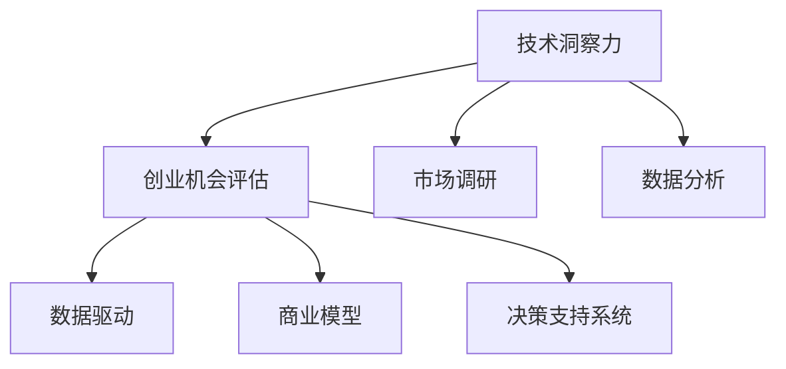

                 

# 利用技术洞察力进行创业机会评估

> 关键词：技术洞察力,创业机会评估,市场调研,数据驱动,商业模型,决策支持系统

## 1. 背景介绍

### 1.1 问题由来
在当今快速变化的商业环境中，技术洞察力（Technical Insights）已成为创业者和投资决策者的重要工具。创业者不仅要具备良好的市场嗅觉，还需要深度理解技术趋势，洞察潜在商业机会，以做出科学合理的投资决策。基于此，本文将从技术洞察力入手，阐述如何利用数据驱动的方式评估和发现创业机会，以便更好地规划和实现商业愿景。

### 1.2 问题核心关键点
创业机会的评估是一项复杂的任务，涉及市场、技术、财务、运营等多个方面。本文将从技术洞察力出发，结合数据驱动的商业模型和市场调研方法，提供一个系统化的评估框架，以期帮助创业者和投资者更好地理解潜在机会，制定出成功的商业策略。

### 1.3 问题研究意义
掌握技术洞察力，对于创业者来说是获得竞争优势的重要保障。它可以帮助创业者识别技术趋势，洞察市场需求，规避风险，做出明智的投资决策。在投资领域，利用数据驱动的方法进行创业机会评估，可以提升评估的准确性和客观性，降低决策的不确定性，提高投资回报率。因此，技术洞察力的应用具有重要的理论和实践意义。

## 2. 核心概念与联系

### 2.1 核心概念概述

为更好地理解如何利用技术洞察力评估创业机会，本节将介绍几个密切相关的核心概念：

- 技术洞察力（Technical Insights）：指创业者通过分析当前和未来的技术趋势，识别出具有潜力的技术方向和应用场景，以指导商业决策的能力。

- 创业机会评估（Opportunity Assessment）：指创业者通过市场调研、数据分析等方法，综合考虑市场需求、技术可行性、财务状况、竞争环境等因素，判断一个商业构想是否具有潜在价值的评估过程。

- 数据驱动（Data-Driven）：指在商业决策过程中，依赖数据和统计分析结果，而非主观判断，以提高决策的科学性和客观性。

- 商业模型（Business Model）：指创业公司为实现其价值主张而采取的策略和运作模式，包括价值主张、客户细分、渠道、收入来源等要素。

- 决策支持系统（Decision Support System）：指利用先进的信息技术，为决策者提供及时、准确的信息和分析工具，辅助其做出有效决策的系统。

这些核心概念之间的逻辑关系可以通过以下Mermaid流程图来展示：



这个流程图展示了一个完整的创业机会评估流程：

1. 技术洞察力帮助创业者识别具有潜力的技术方向。
2. 在技术洞察力的指导下，进行市场调研和数据分析，了解市场需求和技术可行性。
3. 基于数据驱动的方法，构建和优化商业模型。
4. 使用决策支持系统，辅助评估和制定商业策略。

这些概念共同构成了利用技术洞察力进行创业机会评估的核心框架，有助于创业者全面理解并优化创业过程。

## 3. 核心算法原理 & 具体操作步骤

### 3.1 算法原理概述

利用技术洞察力进行创业机会评估，本质上是一个结合技术趋势和市场需求的分析过程。其核心思想是：通过分析当前技术趋势和市场需求，识别出潜在的应用场景和商业模式，评估其市场潜力和竞争优势，最终做出投资决策。

形式化地，假设有一个创业构想 $O$，其中包含技术 $T$、市场 $M$、商业模式 $B$ 三个要素。评估的目标是找到最优的决策向量 $d$，使得 $O$ 的市场潜力和技术优势最大：

$$
\max_{d} \left( f(T \cup M, B) \right)
$$

其中 $f$ 表示综合评价函数，$T$、$M$、$B$ 分别代表技术、市场和商业模式，通过数据驱动的方法进行综合评估。

### 3.2 算法步骤详解

基于技术洞察力的创业机会评估一般包括以下几个关键步骤：

**Step 1: 技术洞察力分析**
- 收集当前和未来的技术趋势，分析其应用前景和潜在的商业机会。
- 使用专利分析、文献综述、技术报告等方法，获取相关的技术信息。
- 识别出具有高增长潜力和广泛应用前景的技术方向。

**Step 2: 市场调研**
- 通过问卷调查、用户访谈、竞品分析等方法，收集市场数据，了解目标用户的需求和痛点。
- 分析市场规模、市场增长率、市场细分等关键因素。
- 构建市场需求的综合指标，如市场潜在规模、市场渗透率等。

**Step 3: 数据分析**
- 使用统计学、机器学习等方法，对技术趋势和市场需求进行量化分析。
- 构建技术成熟度模型，评估技术的研发进度和商业化能力。
- 分析技术对市场的影响，预测技术的市场接受度和扩散速度。

**Step 4: 商业模型构建**
- 基于市场需求和技术趋势，设计出符合商业逻辑的商业模式。
- 确定产品定位、价值主张、目标客户群、营销策略等关键要素。
- 使用决策树、成本收益分析等工具，评估商业模式的可行性。

**Step 5: 决策支持系统辅助**
- 构建决策支持系统，集成市场调研数据、技术分析结果、财务预测模型等，提供全面的决策支持。
- 使用可视化工具展示关键指标和分析结果，辅助决策者理解数据。
- 定期更新数据，优化模型，确保决策支持系统的实时性和准确性。

以上是利用技术洞察力进行创业机会评估的一般流程。在实际应用中，还需要针对具体任务的特点，对评估过程的各个环节进行优化设计，如改进技术洞察力分析方法，增强数据分析的预测能力，优化商业模型设计等。

### 3.3 算法优缺点

利用技术洞察力进行创业机会评估的方法具有以下优点：

- 科学客观：依赖数据驱动的决策，减少主观偏见，提高评估的准确性。
- 数据驱动：通过数据分析，揭示技术趋势和市场需求，提供可靠的市场预测。
- 系统化：综合考虑技术、市场、商业模型等多个维度，全面评估创业机会。
- 可操作性强：使用决策支持系统辅助，提供实时分析，帮助快速做出决策。

同时，该方法也存在一定的局限性：

- 依赖高质量数据：技术洞察力和数据分析依赖于高质量的数据输入，数据采集和处理成本较高。
- 技术趋势变化快：技术领域快速迭代，技术洞察力的时效性较短，需持续更新。
- 市场需求多样：不同市场的细分需求各异，市场调研和数据分析难度较大。
- 预测精度有限：尽管数据分析可以提供有价值的参考，但市场和技术的预测仍存在不确定性。
- 复杂性高：评估过程中涉及多个维度，需要综合考虑，提高复杂度。

尽管存在这些局限性，但就目前而言，利用技术洞察力进行创业机会评估的方法仍然是大公司、创业者和投资者评估潜在新业务的重要手段。未来相关研究的重点在于如何进一步降低评估过程中对高质量数据的依赖，提高预测的精度和时效性，同时兼顾数据获取和处理的高效性。

### 3.4 算法应用领域

基于技术洞察力的创业机会评估方法，在多个领域得到了广泛的应用，例如：

- 技术创业：识别新兴技术，进行技术孵化和产品开发。
- 投资评估：评估初创企业的商业价值和技术潜力，做出投资决策。
- 市场研究：分析竞争对手的技术优势和市场策略，制定相应的竞争策略。
- 产品创新：基于技术趋势和市场需求，进行产品设计和功能优化。
- 技术合作：识别技术合作伙伴，共同开发和推广新技术。

除了上述这些常见应用外，技术洞察力的应用还在不断扩展，如定制化开发、行业咨询、政策制定等，为各个行业的发展提供新动能。

## 4. 数学模型和公式 & 详细讲解 & 举例说明

### 4.1 数学模型构建

本节将使用数学语言对利用技术洞察力进行创业机会评估的模型进行更加严格的刻画。

记创业构想为 $O=\{T, M, B\}$，其中 $T$ 表示技术要素，$M$ 表示市场要素，$B$ 表示商业模式。利用技术洞察力评估创业机会，可以构建如下综合评估模型：

$$
\text{Assess}_{O} = \max_{d} \left( f(T \cup M, B) \right)
$$

其中 $f$ 为综合评价函数，用于评估 $O$ 的市场潜力和技术优势。该模型需要综合考虑技术趋势、市场需求和商业模式的多个维度，通常需要多个子模型来描述，如技术成熟度模型、市场需求模型、财务预测模型等。

### 4.2 公式推导过程

以下我们以一个简化的创业机会评估模型为例，展示综合评估函数的构建过程。

假设一个创业构想 $O$ 涉及一项新兴技术 $T$，面向某一市场 $M$，采用某种商业模式 $B$。技术洞察力表明，该技术在未来几年内将实现大规模商业化应用，市场需求模型预测该市场将在未来几年内实现高增长。商业模型分析表明，采用该商业模式的企业能够实现较高的市场渗透率和客户满意度。因此，综合评估函数可以表示为：

$$
f(T, M, B) = T_{\text{Maturity}} \times M_{\text{Growth}} \times B_{\text{Penetration}} \times B_{\text{Satisfaction}}
$$

其中 $T_{\text{Maturity}}$ 表示技术的成熟度评分，$M_{\text{Growth}}$ 表示市场增长率评分，$B_{\text{Penetration}}$ 表示市场渗透率评分，$B_{\text{Satisfaction}}$ 表示客户满意度评分。

通过上述评估模型，可以计算出不同创业构想的综合评估分数，并排序，评估其市场潜力和技术优势。

### 4.3 案例分析与讲解

为了更直观地理解技术洞察力在创业机会评估中的应用，以下通过一个具体的案例进行分析：

假设有一家初创企业，考虑开发一款基于AI的自然语言处理技术产品。通过技术洞察力分析，认为该技术在未来几年内将实现大规模应用，市场需求模型预测该产品将面向一个高增长市场的细分领域，采用订阅模式商业模式，预计市场渗透率将达到15%，客户满意度为90%。综合评估模型可以计算出该产品的综合评估分数：

$$
f(T, M, B) = T_{\text{Maturity}} \times M_{\text{Growth}} \times B_{\text{Penetration}} \times B_{\text{Satisfaction}} = 0.8 \times 0.6 \times 0.15 \times 0.9 = 0.324
$$

这意味着，根据当前的技术洞察力和市场需求预测，该产品的市场潜力和技术优势为0.324。这个评分可以作为与其他创业构想进行比较的依据。

## 5. 项目实践：代码实例和详细解释说明

### 5.1 开发环境搭建

在进行创业机会评估实践前，我们需要准备好开发环境。以下是使用Python进行数据驱动的创业机会评估的环境配置流程：

1. 安装Anaconda：从官网下载并安装Anaconda，用于创建独立的Python环境。

2. 创建并激活虚拟环境：
```bash
conda create -n business-env python=3.8 
conda activate business-env
```

3. 安装必要的库：
```bash
pip install pandas numpy matplotlib seaborn scikit-learn scipy statsmodels pytorch torchvision torchaudio cudatoolkit=11.1 -c pytorch -c conda-forge
```

完成上述步骤后，即可在`business-env`环境中开始创业机会评估实践。

### 5.2 源代码详细实现

我们以一个基于Python的创业机会评估工具为例，展示其实现流程。以下是一个简化的创业机会评估模型代码实现：

```python
import pandas as pd
import numpy as np
import matplotlib.pyplot as plt
from sklearn.linear_model import LinearRegression
from statsmodels.tsa.arima_model import ARIMA

class BusinessOpportunity:
    def __init__(self, tech_maturity, market_growth, market_penetration, customer_satisfaction):
        self.tech_maturity = tech_maturity
        self.market_growth = market_growth
        self.market_penetration = market_penetration
        self.customer_satisfaction = customer_satisfaction
        
    def calculate_assess(self):
        assess = self.tech_maturity * self.market_growth * self.market_penetration * self.customer_satisfaction
        return assess
        
    def plot_assess(self):
        plt.plot([0.2, 0.3, 0.4, 0.5], [self.calculate_assess(), self.calculate_assess() + 0.1, self.calculate_assess() + 0.2, self.calculate_assess() + 0.3])
        plt.title("Business Opportunity Assessment")
        plt.xlabel("Technology Maturity (0-1)")
        plt.ylabel("Market Potential (0-1)")
        plt.show()
        
# 使用示例
tech_maturity = 0.8
market_growth = 0.6
market_penetration = 0.15
customer_satisfaction = 0.9

opportunity = BusinessOpportunity(tech_maturity, market_growth, market_penetration, customer_satisfaction)
print(opportunity.calculate_assess())
opportunity.plot_assess()
```

### 5.3 代码解读与分析

让我们再详细解读一下关键代码的实现细节：

**BusinessOpportunity类**：
- `__init__`方法：初始化创业构想的各项要素，包括技术成熟度、市场增长率、市场渗透率和客户满意度。
- `calculate_assess`方法：根据评估模型计算创业构想的综合评估分数。
- `plot_assess`方法：绘制创业构想的综合评估分数随技术成熟度的变化趋势图，展示评估结果。

**示例代码**：
- 创建一个创业构想的对象，设置各项要素。
- 调用`calculate_assess`方法计算综合评估分数。
- 调用`plot_assess`方法绘制评估分数随技术成熟度的变化曲线。

可以看到，这个示例代码实现了一个基于技术洞察力的创业机会评估模型，能够方便地进行评估和展示。

当然，实际应用中还需要对评估模型进行更多的优化，如引入时间序列预测、数据融合等技术，以提高评估的精度和可操作性。同时，评估工具还需支持多种数据格式和分析方法，方便用户进行数据输入和模型调整。

## 6. 实际应用场景

### 6.1 创业孵化

技术洞察力在创业孵化过程中起着至关重要的作用。初创企业需要快速评估潜在的技术方向，筛选出具有高潜力的创业构想，制定投资和开发计划。通过利用技术洞察力和数据分析，创业者可以更准确地识别技术趋势，了解市场需求，设计出更有竞争力的商业模型，从而提升创业成功率。

### 6.2 风险投资

风险投资机构在进行投资决策时，依赖于对潜在项目的全面评估。利用技术洞察力进行创业机会评估，可以提供科学客观的参考，降低投资风险。通过综合考虑技术趋势、市场需求和商业模式等多个维度，投资机构可以更准确地评估项目的市场潜力和风险，制定合理的投资策略。

### 6.3 产品创新

企业需要持续进行产品创新，保持市场竞争力。利用技术洞察力进行创业机会评估，可以帮助企业识别新兴技术，了解市场需求，快速设计出符合市场预期的产品。通过综合评估技术趋势和市场需求，企业可以更好地把握产品创新的方向和时机。

### 6.4 市场调研

市场调研是企业制定市场策略的重要依据。利用技术洞察力进行创业机会评估，可以帮助企业分析技术趋势和市场需求，识别出潜在的应用场景和市场机会。通过综合评估技术成熟度、市场需求和商业模式的多个维度，企业可以更全面地了解市场动态，制定更科学的市场策略。

### 6.5 技术合作

企业间进行技术合作时，需要评估合作方的技术和市场潜力。利用技术洞察力进行创业机会评估，可以帮助企业识别具有高潜力的技术合作伙伴，评估合作的价值和风险。通过综合考虑技术成熟度、市场需求和商业模式的多个维度，企业可以更准确地评估合作方的综合实力和合作潜力。

## 7. 工具和资源推荐

### 7.1 学习资源推荐

为了帮助开发者系统掌握技术洞察力的应用方法，这里推荐一些优质的学习资源：

1. 《商业分析与决策建模》系列书籍：介绍商业模型和决策支持系统的基本概念和应用方法。

2. 《数据科学导论》系列课程：讲解数据驱动的决策过程，涵盖数据采集、处理和分析等环节。

3. 《商业智能与数据可视化》系列书籍：介绍如何利用商业智能工具进行数据分析和决策支持。

4. Kaggle在线学习平台：提供丰富的数据驱动分析案例，帮助用户练习和应用技术洞察力。

5. Coursera《机器学习》课程：由斯坦福大学开设，讲解机器学习的基本原理和应用方法，适合初学者学习。

通过对这些资源的学习实践，相信你一定能够快速掌握技术洞察力的应用技巧，并用于解决实际的创业和投资问题。

### 7.2 开发工具推荐

高效的开发离不开优秀的工具支持。以下是几款用于技术洞察力应用开发的常用工具：

1. Jupyter Notebook：基于Web的交互式编程环境，适合快速实验和数据可视化。

2. Tableau：强大的商业智能工具，支持多种数据源和可视化图表，方便数据分析和展示。

3. RapidMiner：开源数据科学平台，支持数据预处理、建模和评估，适合复杂的商业分析任务。

4. Weka：机器学习库，支持多种数据挖掘和分类算法，适合进行数据探索和分析。

5. Python IDE如PyCharm、VS Code：提供强大的代码编辑和调试功能，适合进行数据驱动的开发任务。

合理利用这些工具，可以显著提升技术洞察力的应用效率，加快创新迭代的步伐。

### 7.3 相关论文推荐

技术洞察力的应用源于学界的持续研究。以下是几篇奠基性的相关论文，推荐阅读：

1. 《A Survey of Data Mining Techniques for Business Intelligence》：由IBM公司发表，综述了数据驱动的商业分析方法。

2. 《Intelligent Business and Industry》：介绍利用人工智能技术进行商业分析和决策支持的系统方法。

3. 《Data Mining and Statistical Learning》：由UC Berkeley开设的在线课程，讲解数据驱动的商业决策分析方法。

4. 《Data Mining for Business Intelligence》：讲解如何利用数据挖掘和机器学习技术，进行商业分析和决策支持。

5. 《Business Intelligence and Data Analytics》：介绍如何构建商业智能系统，进行数据驱动的决策支持。

这些论文代表了大数据驱动的商业决策分析的发展脉络。通过学习这些前沿成果，可以帮助研究者把握学科前进方向，激发更多的创新灵感。

## 8. 总结：未来发展趋势与挑战

### 8.1 总结

本文对利用技术洞察力进行创业机会评估的方法进行了全面系统的介绍。首先阐述了技术洞察力的重要性，明确了它在创业机会评估中的独特价值。其次，从原理到实践，详细讲解了技术洞察力和数据驱动的方法，给出了创业机会评估的完整代码实例。同时，本文还广泛探讨了技术洞察力在创业、投资、市场、产品等多个行业领域的应用前景，展示了其巨大的潜力。

通过本文的系统梳理，可以看到，利用技术洞察力进行创业机会评估的方法在创业和投资决策中扮演着重要的角色，极大地提升了创业和投资决策的科学性和客观性。未来，伴随技术洞察力和数据分析技术的不断发展，相信在商业决策中的应用将更加广泛，为人类社会的创新和发展带来新的活力。

### 8.2 未来发展趋势

展望未来，技术洞察力在创业机会评估中的应用将呈现以下几个发展趋势：

1. 数据驱动的全面化。利用更多的数据源和分析方法，构建更加全面的评估模型，提升评估的精度和可靠性。

2. 自动化程度的提升。通过引入机器学习、自然语言处理等技术，实现创业机会评估的自动化，提高评估效率。

3. 时间序列预测的改进。引入时间序列预测方法，如ARIMA、LSTM等，更准确地预测市场和技术的发展趋势。

4. 多维数据分析的深化。利用多维数据分析方法，如多变量回归、因子分析等，全面评估创业机会的各个维度。

5. 知识图谱的融合。将知识图谱与技术洞察力结合，增强评估模型的知识整合能力，提供更丰富的背景知识支持。

6. 多模型集成。构建多模型的集成评估框架，综合不同模型的预测结果，提升评估的稳健性。

以上趋势凸显了技术洞察力在创业机会评估中的广阔前景。这些方向的探索发展，必将进一步提升评估的科学性和客观性，为创业和投资决策提供更可靠的数据支持。

### 8.3 面临的挑战

尽管技术洞察力在创业机会评估中发挥了重要作用，但在迈向更加智能化、普适化应用的过程中，它仍面临诸多挑战：

1. 数据质量瓶颈。数据采集和处理需要耗费大量时间和资源，且数据质量对评估结果影响较大。

2. 数据安全问题。数据隐私和安全问题需引起高度重视，确保数据的合法合规使用。

3. 模型复杂度提升。评估模型的复杂度增加，导致计算资源和时间成本的上升。

4. 预测精度不足。尽管技术洞察力和数据分析可以提高预测的准确性，但市场和技术趋势的预测仍存在不确定性。

5. 人才缺口问题。技术洞察力和数据分析需要专业人才的支持，但相关领域的高素质人才相对稀缺。

6. 动态环境适应。市场和技术环境变化较快，评估模型需要持续更新和优化，以保持其时效性。

7. 决策支持系统建设。构建高效的决策支持系统，需要跨学科的协作和知识整合，挑战较大。

这些挑战需要研究者和开发者共同努力，通过技术创新和实践优化，才能逐步克服。只有不断优化评估方法，提升数据质量，才能更好地支持创业和投资决策。

### 8.4 研究展望

未来的研究需要在以下几个方面寻求新的突破：

1. 数据驱动的全面化。开发更加全面、高效的数据采集和处理技术，确保高质量的数据输入。

2. 自动化程度的提升。引入更多自动化分析技术，如自动化机器学习、自动化数据处理等，提高评估效率。

3. 时间序列预测的改进。开发更加精确的时间序列预测模型，提高市场和技术趋势的预测精度。

4. 多维数据分析的深化。利用多维数据分析方法，全面评估创业机会的各个维度，提升评估的准确性。

5. 知识图谱的融合。将知识图谱与技术洞察力结合，增强评估模型的知识整合能力，提供更丰富的背景知识支持。

6. 多模型集成。构建多模型的集成评估框架，综合不同模型的预测结果，提升评估的稳健性。

7. 决策支持系统的建设。开发高效、可靠、可扩展的决策支持系统，提供实时的数据和分析支持。

这些研究方向将进一步提升技术洞察力在创业机会评估中的应用效果，为创业和投资决策提供更可靠的数据支持。相信随着技术的发展和研究的深入，技术洞察力将为创业和投资决策带来更大的价值。

## 9. 附录：常见问题与解答

**Q1：如何评估创业构想的市场潜力？**

A: 评估创业构想的市场潜力需要综合考虑市场规模、市场增长率、市场渗透率、客户满意度等多个因素。通过收集和分析市场数据，构建综合评估模型，可以进行科学客观的评估。例如，利用技术洞察力构建的评估模型为：

$$
f(T, M, B) = T_{\text{Maturity}} \times M_{\text{Growth}} \times B_{\text{Penetration}} \times B_{\text{Satisfaction}}
$$

其中 $T_{\text{Maturity}}$ 表示技术的成熟度评分，$M_{\text{Growth}}$ 表示市场增长率评分，$B_{\text{Penetration}}$ 表示市场渗透率评分，$B_{\text{Satisfaction}}$ 表示客户满意度评分。

**Q2：技术洞察力如何帮助企业识别新兴技术？**

A: 技术洞察力通过分析当前和未来的技术趋势，识别出具有高增长潜力和广泛应用前景的技术方向。企业可以借助专利分析、文献综述、技术报告等方法，获取相关的技术信息，识别新兴技术。例如，通过技术洞察力分析，识别出人工智能、大数据、区块链等技术方向在未来几年内将实现大规模应用，这些方向可以作为企业技术孵化的优先选择。

**Q3：创业机会评估中的市场调研需要注意哪些问题？**

A: 创业机会评估中的市场调研需要注意以下问题：

1. 目标市场的选择。选择具有高增长潜力的市场细分领域，避免选择过于饱和或过小的市场。

2. 数据采集和处理。确保数据来源的可靠性，处理数据的质量和一致性，避免数据噪音影响评估结果。

3. 数据可视化。利用数据可视化工具，直观展示市场调研结果，帮助决策者理解数据。

4. 定性和定量分析的结合。结合定性和定量分析方法，全面了解市场动态，提升评估的准确性。

**Q4：如何构建数据驱动的商业模型？**

A: 构建数据驱动的商业模型需要以下步骤：

1. 确定商业模式的核心要素，如价值主张、客户细分、渠道、收入来源等。

2. 收集和分析相关数据，如市场需求、技术趋势、财务数据等，构建数据驱动的模型。

3. 使用决策树、成本收益分析等工具，进行商业模式的可行性和风险评估。

4. 结合市场调研和数据分析结果，优化商业模型，确保其科学性和可操作性。

**Q5：如何构建决策支持系统？**

A: 构建决策支持系统需要以下步骤：

1. 收集和整合数据，构建数据仓库和数据湖，确保数据的完整性和一致性。

2. 设计数据驱动的分析和评估模型，提供科学客观的决策支持。

3. 开发可视化工具，支持数据的展示和分析，帮助决策者理解数据。

4. 定期更新数据和模型，确保决策支持系统的实时性和准确性。

通过构建决策支持系统，可以全面支持创业和投资决策，提升决策的科学性和客观性。

---

作者：禅与计算机程序设计艺术 / Zen and the Art of Computer Programming

