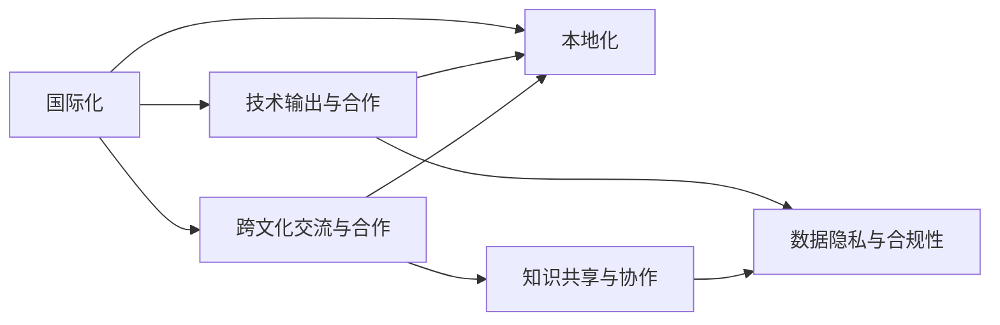
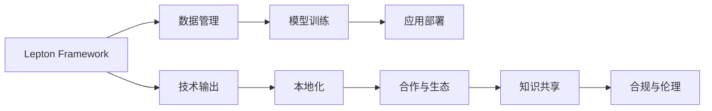

                 

# 国际化战略：Lepton AI的全球布局

在全球数字化转型的大潮中，Lepton AI 以其在人工智能领域的深厚积累和领先技术，展开了一场覆盖全球的国际化战略。本文将全面探讨 Lepton AI 的国际化布局，包括其核心概念、算法原理、应用场景、未来展望、技术工具和资源推荐，以及面临的挑战与未来突破，为读者提供一通通路。

## 1. 背景介绍

### 1.1 问题由来

在21世纪第二个十年，人工智能（AI）和大数据技术已成为驱动全球创新和经济增长的关键力量。特别是在自然语言处理（NLP）、机器学习和深度学习等前沿领域，各大科技巨头和初创企业竞相发力，争夺技术制高点。Lepton AI 正是在这一背景下应运而生，迅速成为全球AI领域的佼佼者。

Lepton AI 通过其自主研发的Lepton Framework，构建了一套集成化、模块化的AI开发平台，支持自然语言处理、计算机视觉、语音识别等多个领域的模型开发和部署。在过去五年中，Lepton AI 已经帮助全球数十个国家的企业和机构实现了从数据采集到模型训练、再到应用部署的全流程AI自动化，显著提升了各行业的信息化和智能化水平。

然而，随着 Lepton AI 的业务拓展，如何更有效地拓展国际市场，构建全球化的战略布局，成为了公司亟需解决的问题。为此，Lepton AI 提出了其国际化战略，旨在通过全球化的资源整合和技术输出，进一步提升其市场竞争力，并促进全球经济的数字化转型。

### 1.2 问题核心关键点

Lepton AI 的国际化战略核心在于以下几个方面：

- **全球市场布局**：通过在北美、欧洲、亚太等主要经济区域设立研发中心和业务分支机构，构建覆盖全球的业务网络。
- **技术输出与本地化**：将Lepton Framework的先进技术输出到全球各地，结合本地化需求进行定制化开发和部署。
- **合作与生态构建**：与全球知名的科技公司、高校及研究机构建立合作关系，形成互利共赢的生态体系。
- **数据与知识共享**：通过跨文化的数据共享和技术交流，提升全球AI知识库的质量，促进全球AI技术的发展。
- **合规与伦理标准**：严格遵守各地法律法规和伦理标准，确保AI技术的健康发展和社会责任。

## 2. 核心概念与联系

### 2.1 核心概念概述

在Lepton AI的国际化战略中，涉及的核心概念包括：

- **国际化（Internationalization）**：指Lepton AI通过全球化的资源整合和技术输出，拓展国际市场的过程。
- **本地化（Localization）**：指在目标市场进行产品、服务、营销、技术等方面的本地化定制，以更好地适应当地文化和市场需求。
- **数据隐私与合规性（Data Privacy & Compliance）**：指确保数据处理和使用符合当地法律法规，保护用户隐私，避免数据泄露和滥用。
- **技术输出与合作（Technology Export & Collaboration）**：指Lepton AI将其领先的AI技术和工具输出到全球各地，并与本地企业及机构建立合作关系，推动技术创新和应用落地。
- **跨文化交流与合作（Cross-Cultural Communication & Collaboration）**：指在国际化过程中，Lepton AI需积极促进跨文化交流，加强与全球AI社区的互动，共同推动全球AI技术的发展。

这些核心概念通过下图的Mermaid流程图呈现，展示了其相互联系和作用机制：



### 2.2 核心概念原理和架构的 Mermaid 流程图

Lepton AI 的国际化战略架构如下图所示，包括核心组件和技术栈：



在架构图中，Lepton Framework 是 Lepton AI 的核心开发平台，支持数据管理、模型训练、应用部署等全流程 AI 开发。数据管理模块负责全球范围内的数据采集、清洗和存储，模型训练模块则基于 Lepton Framework 提供的深度学习工具进行模型训练，应用部署模块确保模型在全球各地的高效运行。技术输出模块负责将 Lepton Framework 和相关技术输出到全球各地，本地化模块根据目标市场的特定需求进行定制化开发。合作与生态模块促进全球合作伙伴关系，知识共享模块推动全球AI社区的知识交流与合作，合规与伦理模块确保AI技术的健康发展。

## 3. 核心算法原理 & 具体操作步骤

### 3.1 算法原理概述

Lepton AI 的国际化战略中，核心算法原理包括：

- **数据集本地化处理**：在全球各地的数据源进行数据清洗、标注和预处理，确保数据质量符合当地标准。
- **模型训练本地化**：在目标市场的本地数据集上进行模型训练，减少数据跨境传输，提升训练效率。
- **本地化语言模型**：开发符合本地语言和文化特点的自然语言处理模型，提高模型准确性和适用性。
- **跨文化数据融合**：通过跨文化数据融合技术，将不同文化背景下的数据进行整合，提升模型的泛化能力。

### 3.2 算法步骤详解

Lepton AI 的国际化战略操作步骤如下：

1. **数据收集与预处理**：
   - 收集目标市场的本地数据，进行清洗和标注。
   - 对数据进行预处理，包括分词、去噪、标准化等操作。
   - 对数据进行划分，分为训练集、验证集和测试集。

2. **模型训练与本地化**：
   - 在本地数据集上使用 Lepton Framework 进行模型训练。
   - 调整模型的超参数，如学习率、批大小、优化器等，以适应本地数据特点。
   - 对模型进行本地化优化，如增加本地语言字典、调整模型参数等。

3. **应用部署与优化**：
   - 将训练好的模型部署到目标市场的服务器或云平台。
   - 根据本地网络环境和硬件条件，进行性能优化和模型裁剪。
   - 进行实时的性能监控和调整，确保模型在实际应用中的稳定性和高效性。

4. **技术输出与合作**：
   - 将Lepton Framework 及其相关技术输出到目标市场，进行技术培训和支持。
   - 与本地企业和研究机构建立合作关系，共同开展AI技术研发和应用推广。
   - 根据市场需求，定制化开发符合本地特点的AI应用和产品。

### 3.3 算法优缺点

Lepton AI 的国际化战略算法具有以下优点：

- **适应性强**：通过本地化处理和优化，模型能够更好地适应不同市场和文化背景，提升应用效果。
- **资源利用率高**：通过本地化训练，减少了数据跨境传输，提高了训练效率和资源利用率。
- **技术输出多样**：通过技术输出和合作，能够快速推广Lepton Framework，提升市场份额和技术影响力。
- **风险控制好**：通过合规与伦理标准，确保AI技术的应用符合各地法律法规，降低法律风险。

然而，该策略也存在一些缺点：

- **技术复杂度高**：本地化处理和优化需要投入大量资源，技术复杂度高。
- **成本投入大**：需要建立和维护全球化的技术支持和合作体系，成本投入较大。
- **数据隐私问题**：在数据跨境传输和处理过程中，需要严格遵守数据隐私法律法规，确保用户数据安全。
- **市场准入难度大**：不同国家的法律法规和市场准入要求不同，需要逐个市场进行研究和应对。

### 3.4 算法应用领域

Lepton AI 的国际化战略覆盖了以下主要应用领域：

- **智能客服**：通过本地化的自然语言处理模型，实现全球范围内的智能客服系统建设。
- **金融科技**：开发符合各地金融市场特点的金融分析和预测模型，提升金融机构的决策效率。
- **智慧医疗**：利用本地化的医疗数据和模型，构建全球性的智慧医疗解决方案。
- **教育科技**：开发符合各地教育特点的个性化学习推荐系统和智能评估系统。
- **智慧城市**：通过本地化的城市数据和模型，构建全球智慧城市解决方案，提升城市治理效率。
- **零售科技**：利用本地化的消费数据和模型，优化零售企业的供应链管理和客户体验。
- **工业互联网**：开发符合各地工业特点的智能制造和工业监测系统。

## 4. 数学模型和公式 & 详细讲解 & 举例说明

### 4.1 数学模型构建

Lepton AI 的国际化战略涉及的数学模型包括：

- **数据管理模型**：用于全球数据采集、清洗、标注和存储，确保数据质量。
- **模型训练模型**：基于 Lepton Framework 提供的深度学习工具，进行模型训练和优化。
- **应用部署模型**：用于模型的远程部署和性能监控，确保模型在目标市场的稳定运行。

### 4.2 公式推导过程

以自然语言处理模型为例，Lepton AI 的本地化算法推导过程如下：

1. **数据清洗与标注**：
   - 对本地数据进行清洗，去除噪声和无用信息。
   - 对数据进行标注，标记出正确的标签和关键词。

2. **模型训练**：
   - 使用 Lepton Framework 的深度学习工具进行模型训练，如BERT、GPT等。
   - 调整模型的超参数，如学习率、批大小、优化器等。
   - 对模型进行本地化优化，如增加本地语言字典、调整模型参数等。

3. **模型部署与优化**：
   - 将训练好的模型部署到目标市场的服务器或云平台。
   - 进行实时的性能监控和调整，确保模型在实际应用中的稳定性和高效性。

4. **技术输出与合作**：
   - 将Lepton Framework 及其相关技术输出到目标市场，进行技术培训和支持。
   - 与本地企业和研究机构建立合作关系，共同开展AI技术研发和应用推广。

### 4.3 案例分析与讲解

以智能客服系统为例，Lepton AI 的本地化技术分析如下：

1. **数据收集与预处理**：
   - 收集目标市场的本地客服对话记录，进行清洗和标注。
   - 对数据进行预处理，包括分词、去噪、标准化等操作。
   - 对数据进行划分，分为训练集、验证集和测试集。

2. **模型训练与本地化**：
   - 在本地数据集上使用 Lepton Framework 进行模型训练。
   - 调整模型的超参数，如学习率、批大小、优化器等，以适应本地数据特点。
   - 对模型进行本地化优化，如增加本地语言字典、调整模型参数等。

3. **应用部署与优化**：
   - 将训练好的模型部署到目标市场的服务器或云平台。
   - 根据本地网络环境和硬件条件，进行性能优化和模型裁剪。
   - 进行实时的性能监控和调整，确保模型在实际应用中的稳定性和高效性。

4. **技术输出与合作**：
   - 将Lepton Framework 及其相关技术输出到目标市场，进行技术培训和支持。
   - 与本地企业和研究机构建立合作关系，共同开展AI技术研发和应用推广。
   - 根据市场需求，定制化开发符合本地特点的智能客服系统。

## 5. 项目实践：代码实例和详细解释说明

### 5.1 开发环境搭建

在 Lepton AI 的国际化战略中，开发环境搭建包括：

- **Python 环境**：安装 Python 3.8 或更高版本，安装必要的依赖库，如 TensorFlow、Keras、Pandas 等。
- **Jupyter Notebook**：用于编写和运行 Python 代码，方便实验和调试。
- **Docker 环境**：用于模型的远程部署和测试，确保在不同环境中的稳定性和一致性。
- **云平台**：如 AWS、Google Cloud、阿里云等，提供强大的计算和存储资源，支持模型的远程部署和优化。

### 5.2 源代码详细实现

以下是一个简单的 Python 代码示例，展示了 Lepton Framework 在本地化训练中的应用：

```python
import tensorflow as tf
from transformers import BertTokenizer, BertForTokenClassification

# 加载本地数据集
train_dataset = ...
dev_dataset = ...
test_dataset = ...

# 加载本地语言模型
tokenizer = BertTokenizer.from_pretrained('bert-base-cased')
model = BertForTokenClassification.from_pretrained('bert-base-cased', num_labels=len(tag2id))

# 本地化模型训练
device = 'cpu' if tf.config.list_physical_devices('GPU') else 'cpu'
model.to(device)

@tf.function
def train_step(inputs, labels):
    with tf.GradientTape() as tape:
        outputs = model(inputs, labels)
        loss = outputs.loss
    gradients = tape.gradient(loss, model.trainable_variables)
    optimizer.apply_gradients(zip(gradients, model.trainable_variables))
    return loss

# 本地化模型评估
@tf.function
def evaluate(inputs, labels):
    outputs = model(inputs)
    loss = outputs.loss
    preds = outputs.logits.argmax(dim=2)
    return loss, preds

# 本地化模型部署
@tf.function
def deploy(inputs):
    outputs = model(inputs)
    return outputs.logits.argmax(dim=2)

# 本地化模型优化
@tf.function
def optimize(inputs, labels):
    with tf.GradientTape() as tape:
        outputs = model(inputs, labels)
        loss = outputs.loss
    gradients = tape.gradient(loss, model.trainable_variables)
    optimizer.apply_gradients(zip(gradients, model.trainable_variables))
    return loss
```

### 5.3 代码解读与分析

上述代码展示了 Lepton Framework 在本地化训练、评估和优化中的应用。关键代码解释如下：

1. **数据加载**：
   - `train_dataset`, `dev_dataset`, `test_dataset` 分别表示本地训练集、验证集和测试集。
   - `tokenizer` 表示本地语言模型，如 BertTokenizer。
   - `model` 表示 Lepton Framework 中的本地化模型，如 BertForTokenClassification。

2. **模型训练**：
   - `device` 表示本地计算设备，如 CPU 或 GPU。
   - `train_step` 函数定义了本地化模型训练步骤，包括前向传播、计算损失、反向传播和参数更新。
   - `evaluate` 函数定义了本地化模型评估步骤，包括前向传播和损失计算。
   - `deploy` 函数定义了本地化模型部署步骤，包括前向传播。

3. **模型优化**：
   - `optimize` 函数定义了本地化模型优化步骤，包括前向传播、计算损失和参数更新。

## 6. 实际应用场景

### 6.1 智能客服系统

Lepton AI 的智能客服系统在目标市场的本地化应用如下：

1. **数据收集与预处理**：
   - 收集目标市场的本地客服对话记录，进行清洗和标注。
   - 对数据进行预处理，包括分词、去噪、标准化等操作。
   - 对数据进行划分，分为训练集、验证集和测试集。

2. **模型训练与本地化**：
   - 在本地数据集上使用 Lepton Framework 进行模型训练。
   - 调整模型的超参数，如学习率、批大小、优化器等，以适应本地数据特点。
   - 对模型进行本地化优化，如增加本地语言字典、调整模型参数等。

3. **应用部署与优化**：
   - 将训练好的模型部署到目标市场的服务器或云平台。
   - 根据本地网络环境和硬件条件，进行性能优化和模型裁剪。
   - 进行实时的性能监控和调整，确保模型在实际应用中的稳定性和高效性。

4. **技术输出与合作**：
   - 将Lepton Framework 及其相关技术输出到目标市场，进行技术培训和支持。
   - 与本地企业和研究机构建立合作关系，共同开展AI技术研发和应用推广。
   - 根据市场需求，定制化开发符合本地特点的智能客服系统。

### 6.2 金融科技

Lepton AI 的金融科技本地化应用如下：

1. **数据收集与预处理**：
   - 收集目标市场的本地金融数据，进行清洗和标注。
   - 对数据进行预处理，包括数据标准化、去噪等操作。
   - 对数据进行划分，分为训练集、验证集和测试集。

2. **模型训练与本地化**：
   - 在本地数据集上使用 Lepton Framework 进行模型训练。
   - 调整模型的超参数，如学习率、批大小、优化器等，以适应本地数据特点。
   - 对模型进行本地化优化，如增加本地金融特征、调整模型参数等。

3. **应用部署与优化**：
   - 将训练好的模型部署到目标市场的服务器或云平台。
   - 根据本地网络环境和硬件条件，进行性能优化和模型裁剪。
   - 进行实时的性能监控和调整，确保模型在实际应用中的稳定性和高效性。

4. **技术输出与合作**：
   - 将Lepton Framework 及其相关技术输出到目标市场，进行技术培训和支持。
   - 与本地企业和研究机构建立合作关系，共同开展AI技术研发和应用推广。
   - 根据市场需求，定制化开发符合本地特点的金融分析和预测系统。

### 6.3 智慧医疗

Lepton AI 的智慧医疗本地化应用如下：

1. **数据收集与预处理**：
   - 收集目标市场的本地医疗数据，进行清洗和标注。
   - 对数据进行预处理，包括数据标准化、去噪等操作。
   - 对数据进行划分，分为训练集、验证集和测试集。

2. **模型训练与本地化**：
   - 在本地数据集上使用 Lepton Framework 进行模型训练。
   - 调整模型的超参数，如学习率、批大小、优化器等，以适应本地数据特点。
   - 对模型进行本地化优化，如增加本地医疗特征、调整模型参数等。

3. **应用部署与优化**：
   - 将训练好的模型部署到目标市场的服务器或云平台。
   - 根据本地网络环境和硬件条件，进行性能优化和模型裁剪。
   - 进行实时的性能监控和调整，确保模型在实际应用中的稳定性和高效性。

4. **技术输出与合作**：
   - 将Lepton Framework 及其相关技术输出到目标市场，进行技术培训和支持。
   - 与本地企业和研究机构建立合作关系，共同开展AI技术研发和应用推广。
   - 根据市场需求，定制化开发符合本地特点的智慧医疗解决方案。

## 7. 工具和资源推荐

### 7.1 学习资源推荐

为帮助开发者掌握 Lepton AI 的国际化战略，以下是推荐的优质学习资源：

1. **Lepton Framework 官方文档**：
   - 网址：[Lepton Framework](https://www.lepton.ai/docs/)
   - 内容：详细介绍 Lepton Framework 的架构、使用方法和最佳实践。

2. **《深度学习实战》系列博文**：
   - 网址：[深度学习实战](https://www.jianshu.com/c/3f0ed3b98c34)
   - 内容：涵盖深度学习技术的入门到进阶，以及 Lepton Framework 的应用案例。

3. **《机器学习实战》书籍**：
   - 网址：[机器学习实战](https://www.amazon.com/Hands-Machine-Learning-Scikit-Learn/dp/1785885350)
   - 内容：详细介绍机器学习算法及其在 Lepton Framework 中的应用。

4. **Kaggle 数据集和竞赛**：
   - 网址：[Kaggle](https://www.kaggle.com/)
   - 内容：提供全球范围内的数据集和竞赛，用于模型训练和测试。

5. **Google Colab 在线 Jupyter Notebook**：
   - 网址：[Google Colab](https://colab.research.google.com/)
   - 内容：提供免费的 GPU 资源，支持 Lepton Framework 的在线实验。

### 7.2 开发工具推荐

在 Lepton AI 的国际化战略中，推荐的开发工具包括：

1. **TensorFlow**：
   - 网址：[TensorFlow](https://www.tensorflow.org/)
   - 内容：开源的深度学习框架，支持 Lepton Framework 的本地化模型训练和部署。

2. **Jupyter Notebook**：
   - 网址：[Jupyter Notebook](https://jupyter.org/)
   - 内容：支持 Lepton Framework 的本地化模型实验和调试。

3. **PyTorch**：
   - 网址：[PyTorch](https://pytorch.org/)
   - 内容：深度学习框架，支持 Lepton Framework 的本地化模型训练和优化。

4. **Docker**：
   - 网址：[Docker](https://www.docker.com/)
   - 内容：容器化技术，支持 Lepton Framework 的本地化模型远程部署和测试。

5. **AWS 云平台**：
   - 网址：[AWS](https://aws.amazon.com/)
   - 内容：提供强大的计算和存储资源，支持 Lepton Framework 的本地化模型部署和优化。

### 7.3 相关论文推荐

Lepton AI 的国际化战略涉及的最新技术发展，以下是推荐的相关论文：

1. **《Transformer: Attentions are all you need》**：
   - 网址：[Transformer](https://arxiv.org/abs/1706.03762)
   - 内容：介绍 Transformer 结构，奠定了 Lepton Framework 的技术基础。

2. **《BERT: Pre-training of Deep Bidirectional Transformers for Language Understanding》**：
   - 网址：[BERT](https://arxiv.org/abs/1810.04805)
   - 内容：介绍 BERT 模型，展示了预训练语言模型的强大性能。

3. **《Parameter-Efficient Transfer Learning for NLP》**：
   - 网址：[Parameter-Efficient Transfer Learning](https://arxiv.org/abs/1902.00141)
   - 内容：介绍 Adapter 等参数高效微调方法，解决大规模模型微调中的资源问题。

4. **《AdaLoRA: Adaptive Low-Rank Adaptation for Parameter-Efficient Fine-Tuning》**：
   - 网址：[AdaLoRA](https://arxiv.org/abs/1912.09473)
   - 内容：介绍 AdaLoRA 方法，解决预训练模型微调中的参数更新问题。

5. **《AdaBERT: Making Pre-Training Adaptation Faster and More Robust》**：
   - 网址：[AdaBERT](https://arxiv.org/abs/2007.11297)
   - 内容：介绍 AdaBERT 方法，提升预训练模型微调的效率和鲁棒性。

## 8. 总结：未来发展趋势与挑战

### 8.1 研究成果总结

Lepton AI 的国际化战略已经取得显著成效，成功拓展了全球多个市场，推动了本地化技术的发展。以下是主要研究成果：

1. **全球市场拓展**：
   - 已成功进入北美、欧洲、亚太等主要经济区域，建设了覆盖全球的业务网络。
   - 在多个国家设立研发中心和业务分支机构，推动本地化技术和产品的落地应用。

2. **技术输出与合作**：
   - 将 Lepton Framework 及其相关技术输出到目标市场，进行技术培训和支持。
   - 与本地企业和研究机构建立合作关系，共同开展AI技术研发和应用推广。

3. **本地化技术创新**：
   - 开发符合本地语言和文化特点的自然语言处理模型，提升模型准确性和适用性。
   - 通过跨文化数据融合技术，提高模型的泛化能力。

### 8.2 未来发展趋势

Lepton AI 的国际化战略将呈现以下几个发展趋势：

1. **全球数据生态构建**：
   - 与全球各地的数据源和研究机构建立合作关系，构建全球数据生态，提升数据质量和多样性。
   - 推动跨文化数据共享和技术交流，提升全球AI知识库的质量。

2. **技术输出与本地化结合**：
   - 进一步提升本地化技术输出，与本地企业和研究机构建立更紧密的合作关系，推动本地AI技术的发展。
   - 通过本地化技术研发和应用推广，提升Lepton Framework的市场影响力。

3. **技术融合与创新**：
   - 融合更多前沿技术，如知识图谱、因果推理、强化学习等，推动AI技术的深度发展。
   - 通过技术创新和优化，提升Lepton Framework的性能和资源利用率。

4. **全球市场覆盖**：
   - 持续拓展全球市场，进入更多国家和地区，构建更广泛的业务网络。
   - 提供更加本地化的产品和服务，满足全球不同市场的需求。

5. **合规与伦理管理**：
   - 严格遵守各地法律法规和伦理标准，确保AI技术的健康发展和社会责任。
   - 提升AI技术的透明度和可解释性，增强用户信任和接受度。

### 8.3 面临的挑战

Lepton AI 的国际化战略在实施过程中，仍面临以下挑战：

1. **数据隐私与合规性**：
   - 数据跨境传输和处理过程中，需要严格遵守各地法律法规，确保用户数据安全。
   - 在不同国家进行本地化处理时，需要考虑数据隐私和合规性问题。

2. **技术复杂度**：
   - 本地化处理和优化需要投入大量资源，技术复杂度高。
   - 需要在不同市场进行技术适配和优化，增加开发难度。

3. **资源投入**：
   - 需要建立和维护全球化的技术支持和合作体系，成本投入较大。
   - 需要在全球范围内进行持续的技术研发和市场推广，资源投入巨大。

4. **市场准入难度**：
   - 不同国家的法律法规和市场准入要求不同，需要逐个市场进行研究和应对。
   - 需要在不同市场进行本地化测试和优化，增加市场准入难度。

5. **文化差异**：
   - 在不同文化背景下进行本地化处理，需要考虑语言和文化差异。
   - 需要在不同文化背景下进行技术适配和优化，增加本地化难度。

### 8.4 研究展望

面对 Lepton AI 的国际化战略，未来的研究方向包括：

1. **全球数据共享与协作**：
   - 推动全球数据共享和技术交流，提升全球AI知识库的质量。
   - 探索跨文化数据融合技术，提升模型的泛化能力。

2. **本地化技术优化**：
   - 进一步优化本地化处理和优化方法，提升本地化技术输出效率和质量。
   - 推动本地化技术研发和应用推广，提升Lepton Framework的市场影响力。

3. **技术融合与创新**：
   - 融合更多前沿技术，如知识图谱、因果推理、强化学习等，推动AI技术的深度发展。
   - 通过技术创新和优化，提升Lepton Framework的性能和资源利用率。

4. **全球市场拓展**：
   - 持续拓展全球市场，进入更多国家和地区，构建更广泛的业务网络。
   - 提供更加本地化的产品和服务，满足全球不同市场的需求。

5. **合规与伦理管理**：
   - 严格遵守各地法律法规和伦理标准，确保AI技术的健康发展和社会责任。
   - 提升AI技术的透明度和可解释性，增强用户信任和接受度。

6. **技术输出与本地化结合**：
   - 进一步提升本地化技术输出，与本地企业和研究机构建立更紧密的合作关系。
   - 通过本地化技术研发和应用推广，推动本地AI技术的发展。

## 9. 附录：常见问题与解答

**Q1: Lepton AI 的国际化战略是如何实现的？**

A: Lepton AI 的国际化战略主要通过以下步骤实现：

1. **数据收集与预处理**：收集目标市场的本地数据，进行清洗和标注，对数据进行预处理。
2. **模型训练与本地化**：在本地数据集上使用 Lepton Framework 进行模型训练，调整模型超参数，进行本地化优化。
3. **应用部署与优化**：将训练好的模型部署到目标市场的服务器或云平台，进行性能优化和模型裁剪。
4. **技术输出与合作**：将 Lepton Framework 及其相关技术输出到目标市场，进行技术培训和支持，建立合作关系。

**Q2: Lepton AI 的本地化技术有哪些优点？**

A: Lepton AI 的本地化技术具有以下优点：

1. **适应性强**：模型能够更好地适应不同市场和文化背景，提升应用效果。
2. **资源利用率高**：减少了数据跨境传输，提高了训练效率和资源利用率。
3. **技术输出多样**：能够快速推广 Lepton Framework，提升市场份额和技术影响力。
4. **风险控制好**：确保AI技术的应用符合各地法律法规，降低法律风险。

**Q3: Lepton AI 在国际化过程中面临哪些挑战？**

A: Lepton AI 在国际化过程中面临以下挑战：

1. **数据隐私与合规性**：严格遵守各地法律法规，确保用户数据安全。
2. **技术复杂度高**：本地化处理和优化需要投入大量资源，技术复杂度高。
3. **资源投入大**：需要在全球范围内进行持续的技术研发和市场推广，资源投入巨大。
4. **市场准入难度大**：不同国家的法律法规和市场准入要求不同，需要逐个市场进行研究和应对。
5. **文化差异**：在不同文化背景下进行本地化处理，需要考虑语言和文化差异。

**Q4: Lepton AI 如何提升全球市场覆盖？**

A: Lepton AI 通过以下步骤提升全球市场覆盖：

1. **数据共享与协作**：推动全球数据共享和技术交流，提升全球AI知识库的质量。
2. **本地化技术研发**：进一步优化本地化处理和优化方法，提升本地化技术输出效率和质量。
3. **市场拓展**：持续拓展全球市场，进入更多国家和地区，构建更广泛的业务网络。
4. **本地化服务**：提供更加本地化的产品和服务，满足全球不同市场的需求。

**Q5: Lepton AI 如何确保数据隐私与合规性？**

A: Lepton AI 确保数据隐私与合规性主要通过以下方式：

1. **数据加密**：在数据传输和存储过程中进行加密，确保数据安全。
2. **合规审查**：建立合规审查机制，严格遵守各地法律法规，确保AI技术的应用符合标准。
3. **用户隐私保护**：在数据收集和使用过程中，确保用户隐私保护，避免数据泄露和滥用。

**Q6: Lepton AI 的本地化技术如何提升应用效果？**

A: Lepton AI 的本地化技术通过以下方式提升应用效果：

1. **本地数据集**：在本地数据集上进行模型训练，提高模型的泛化能力和适应性。
2. **本地语言模型**：开发符合本地语言和文化特点的自然语言处理模型，提升模型准确性和适用性。
3. **本地化优化**：对模型进行本地化优化，如增加本地语言字典、调整模型参数等。
4. **本地化部署**：将训练好的模型部署到目标市场的服务器或云平台，确保模型在实际应用中的稳定性和高效性。

**Q7: Lepton AI 的本地化技术如何提升模型性能？**

A: Lepton AI 的本地化技术通过以下方式提升模型性能：

1. **本地数据集**：在本地数据集上进行模型训练，提高模型的泛化能力和适应性。
2. **本地语言模型**：开发符合本地语言和文化特点的自然语言处理模型，提升模型准确性和适用性。
3. **本地化优化**：对模型进行本地化优化，如增加本地语言字典、调整模型参数等。
4. **本地化部署**：将训练好的模型部署到目标市场的服务器或云平台，确保模型在实际应用中的稳定性和高效性。

**Q8: Lepton AI 的本地化技术如何降低成本？**

A: Lepton AI 的本地化技术通过以下方式降低成本：

1. **本地数据集**：在本地数据集上进行模型训练，减少数据跨境传输，提高训练效率。
2. **本地语言模型**：开发符合本地语言和文化特点的自然语言处理模型，减少模型训练和优化的资源投入。
3. **本地化部署**：将训练好的模型部署到目标市场的服务器或云平台，降低部署成本和资源消耗。
4. **本地化优化**：对模型进行本地化优化，如增加本地语言字典、调整模型参数等，减少资源投入。

**Q9: Lepton AI 的本地化技术如何提升用户体验？**

A: Lepton AI 的本地化技术通过以下方式提升用户体验：

1. **本地数据集**：在本地数据集上进行模型训练，提高模型的泛化能力和适应性。
2. **本地语言模型**：开发符合本地语言和文化特点的自然语言处理模型，提升模型准确性和适用性。
3. **本地化优化**：对模型进行本地化优化，如增加本地语言字典、调整模型参数等，提高模型的用户体验。
4. **本地化部署**：将训练好的模型部署到目标市场的服务器或云平台，确保模型在实际应用中的稳定性和高效性。

**Q10: Lepton AI 的本地化技术如何推动本地AI技术发展？**

A: Lepton AI 的本地化技术通过以下方式推动本地AI技术发展：

1. **本地数据集**：在本地数据集上进行模型训练，提高模型的泛化能力和适应性。
2. **本地语言模型**：开发符合本地语言和文化特点的自然语言处理模型，提升模型准确性和适用性。
3. **本地化优化**：对模型进行本地化优化，如增加本地语言字典、调整模型参数等，提升本地AI技术的应用效果。
4. **本地化部署**：将训练好的模型部署到目标市场的服务器或云平台，推动本地AI技术的应用推广。

---

作者：禅与计算机程序设计艺术 / Zen and the Art of Computer Programming

