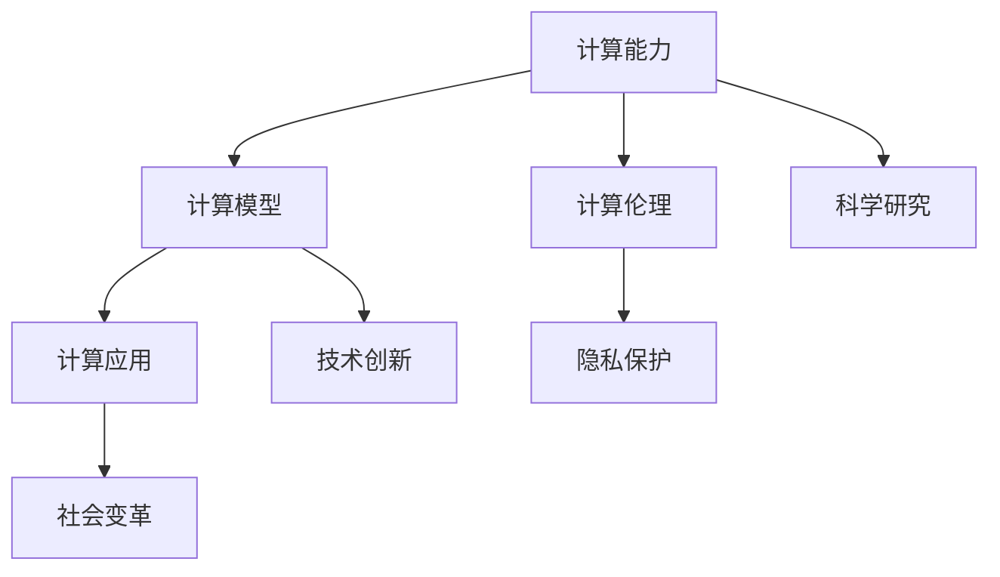

                 

## 1. 背景介绍

### 1.1 问题由来

在21世纪的数字时代，计算技术已经深入到人类社会的各个角落。从工业自动化到社交媒体，从科学探索到日常娱乐，计算都在无声无息地改变着我们的生活。然而，人类计算的演进并非一帆风顺。从最早的机械计算到电子计算机的诞生，再到今天的深度学习和人工智能，计算技术的每一次飞跃都伴随着巨大的挑战和突破。

本文旨在探讨计算技术如何塑造我们的未来世界，并分析其在工业、科学、社会等各个领域的深远影响。通过梳理计算技术的历史演变，展望其未来趋势，我们希望能够深入理解人类计算的重要性和前景，为未来的技术创新和应用提供有价值的参考。

### 1.2 问题核心关键点

人类计算的发展，核心在于计算能力的不断提升和计算模型的不断创新。关键点包括：

- **计算能力**：从最早的机械计数器到如今的超级计算机，计算能力的大幅提升使得复杂的科学计算、大数据分析成为可能。
- **计算模型**：从串行计算到并行计算，从冯诺依曼架构到分布式计算，计算模型的进步使得计算能力得以充分利用。
- **计算应用**：从自动化生产线到人工智能辅助诊断，计算技术的实际应用日益广泛，改变了人类社会的方方面面。
- **计算伦理**：计算技术的发展也引发了伦理、隐私、安全等社会问题，需要高度关注和解决。

这些关键点共同构成了人类计算的发展脉络，推动着计算技术的不断演进。

## 2. 核心概念与联系

### 2.1 核心概念概述

在深入探讨人类计算对未来世界的影响之前，我们先了解一些核心概念：

- **计算能力**：指计算机系统处理数据的能力，通常用每秒执行的浮点运算次数(FLOPS)来衡量。
- **计算模型**：指计算机系统处理数据的抽象模型，如串行、并行、分布式、机器学习等。
- **计算应用**：指计算技术在实际生活中的应用场景，如工业自动化、金融交易、医疗诊断等。
- **计算伦理**：指计算技术在使用过程中所涉及的伦理、隐私、安全等问题。

这些概念之间的关系如下图所示：



通过这个流程图，我们可以清晰地看到计算能力的提升、计算模型的创新、计算应用的扩展以及计算伦理的考量是如何相互影响，共同塑造着计算技术对未来世界的影响。

## 3. 核心算法原理 & 具体操作步骤

### 3.1 算法原理概述

人类计算的核心算法原理可以追溯到图灵机和冯诺依曼架构的提出。图灵机奠定了现代计算机的基础，冯诺依曼架构则提出了存储程序的概念，为计算机的存储和计算提供了统一的标准。随着计算机技术的发展，计算模型和计算能力不断提升，计算应用也随之扩展，涉及到工业、科学、社会等多个领域。

### 3.2 算法步骤详解

基于人类计算的历史演变，我们可以将其大致分为以下几个步骤：

1. **早期计算模型的探索**：
   - **图灵机**：1936年，图灵提出了图灵机，奠定了现代计算机的理论基础。
   - **冯诺依曼架构**：1945年，冯诺依曼提出了存储程序的概念，确立了计算机的基本结构。

2. **计算能力的提升**：
   - **摩尔定律**：1971年，摩尔提出了摩尔定律，预测了计算能力的指数级增长。
   - **分布式计算**：20世纪80年代，分布式计算技术的发展使得大规模计算成为可能。

3. **计算应用的扩展**：
   - **工业自动化**：20世纪50年代，工业自动化设备开始广泛应用。
   - **人工智能**：20世纪90年代，人工智能技术的兴起，计算技术开始深入到复杂的决策问题中。

4. **计算伦理的考量**：
   - **数据隐私**：21世纪初，大数据技术的发展带来了数据隐私问题。
   - **算法偏见**：近年来，计算技术在应用中暴露出算法偏见的问题，引发了广泛关注。

### 3.3 算法优缺点

人类计算的算法具有以下优点：

- **通用性**：计算模型和计算应用具有广泛的适用性，几乎可以应用于所有领域。
- **高效性**：随着计算能力的提升，计算技术的高效性得以充分发挥。
- **广泛性**：计算技术的应用范围广泛，涉及工业、科学、社会等多个领域。

同时，计算算法也存在一些缺点：

- **资源消耗**：计算应用对资源（如电力、数据、计算力）的需求巨大。
- **伦理风险**：计算技术在应用中可能带来隐私、安全等问题。
- **技术壁垒**：计算技术的复杂性使得一些小型企业和组织难以参与。

### 3.4 算法应用领域

人类计算的应用领域广泛，涵盖工业、科学、社会等多个方面。以下是一些典型应用领域：

- **工业自动化**：计算机在工业生产中的应用，如自动生产线、机器人控制等。
- **科学计算**：计算技术在科学研究中的应用，如气候模拟、基因分析等。
- **医疗健康**：计算技术在医疗领域的应用，如影像诊断、基因治疗等。
- **金融交易**：计算机在金融市场中的应用，如高频交易、风险管理等。
- **交通运输**：计算技术在交通领域的应用，如智能交通系统、自动驾驶等。

## 4. 数学模型和公式 & 详细讲解 & 举例说明

### 4.1 数学模型构建

人类计算的核心数学模型包括离散数学、线性代数、概率论等。这些模型为计算技术的各种应用提供了理论基础。

以计算机科学中的基本数据结构为例，数组和链表是两种常见的数据结构，它们的数学模型如下：

- **数组**：使用连续的内存空间存储数据，支持随机访问。
- **链表**：使用指针将数据元素链接起来，支持动态插入和删除。

### 4.2 公式推导过程

以数组和链表的对比为例，我们可以从时间和空间复杂度两个维度进行推导：

- **时间复杂度**：数组的随机访问时间复杂度为O(1)，链表的访问时间复杂度为O(n)。
- **空间复杂度**：数组需要连续的内存空间，链表则可以通过指针动态分配。

### 4.3 案例分析与讲解

以计算机视觉中的图像识别为例，我们可以使用卷积神经网络(CNN)进行图像分类。CNN的数学模型包括卷积层、池化层、全连接层等，其核心在于卷积核的滑动和权重共享。通过卷积操作，CNN可以提取图像的局部特征，通过池化操作，可以降低特征的维度。最后通过全连接层，将特征映射到分类结果。

## 5. 项目实践：代码实例和详细解释说明

### 5.1 开发环境搭建

在进行人类计算的实际应用开发之前，我们需要准备好开发环境。以下是使用Python进行TensorFlow开发的环境配置流程：

1. 安装Anaconda：从官网下载并安装Anaconda，用于创建独立的Python环境。

2. 创建并激活虚拟环境：
```bash
conda create -n tf-env python=3.8 
conda activate tf-env
```

3. 安装TensorFlow：根据CUDA版本，从官网获取对应的安装命令。例如：
```bash
conda install tensorflow -c tensorflow
```

4. 安装各类工具包：
```bash
pip install numpy pandas scikit-learn matplotlib tqdm jupyter notebook ipython
```

完成上述步骤后，即可在`tf-env`环境中开始开发实践。

### 5.2 源代码详细实现

以下是一个使用TensorFlow实现图像分类的代码实现。

```python
import tensorflow as tf
from tensorflow.keras import datasets, layers, models

# 加载数据集
(train_images, train_labels), (test_images, test_labels) = datasets.cifar10.load_data()

# 标准化图像数据
train_images, test_images = train_images / 255.0, test_images / 255.0

# 构建卷积神经网络
model = models.Sequential([
    layers.Conv2D(32, (3, 3), activation='relu', input_shape=(32, 32, 3)),
    layers.MaxPooling2D((2, 2)),
    layers.Conv2D(64, (3, 3), activation='relu'),
    layers.MaxPooling2D((2, 2)),
    layers.Conv2D(64, (3, 3), activation='relu'),
    layers.Flatten(),
    layers.Dense(64, activation='relu'),
    layers.Dense(10)
])

# 编译模型
model.compile(optimizer='adam',
              loss=tf.keras.losses.SparseCategoricalCrossentropy(from_logits=True),
              metrics=['accuracy'])

# 训练模型
history = model.fit(train_images, train_labels, epochs=10, 
                    validation_data=(test_images, test_labels))

# 评估模型
test_loss, test_acc = model.evaluate(test_images, test_labels, verbose=2)
print(test_acc)
```

### 5.3 代码解读与分析

让我们再详细解读一下关键代码的实现细节：

**模型构建**：
- `train_images, test_images = train_images / 255.0, test_images / 255.0`：将图像数据标准化到[0,1]之间。
- `model = models.Sequential(...)`：构建顺序模型，使用多个卷积层和全连接层。
- `model.compile(...)`：编译模型，指定优化器、损失函数和评估指标。
- `history = model.fit(...)`：训练模型，指定训练数据和验证数据。

**模型评估**：
- `test_loss, test_acc = model.evaluate(...)`：在测试集上评估模型，返回测试损失和准确率。

可以看到，TensorFlow的API设计简洁高效，使得模型构建和训练过程变得非常直观。开发者可以将更多精力放在模型改进、数据处理等高层逻辑上，而不必过多关注底层的实现细节。

## 6. 实际应用场景

### 6.1 工业自动化

人类计算在工业自动化中的应用极为广泛。从早期的数控机床到现在的智能制造，计算技术的应用极大地提高了生产效率和产品质量。例如，通过传感器和数据分析，可以实时监测生产线上的设备状态，及时发现和处理故障，避免停机时间。

### 6.2 科学研究

计算技术在科学研究中的应用同样不可或缺。从气候模拟到基因分析，计算模型为科学家们提供了强大的计算能力，帮助他们解决复杂的科学问题。例如，在高性能计算机上运行模拟实验，可以预测自然灾害的趋势，分析药物分子的结构，发现新的生物基因。

### 6.3 医疗健康

计算技术在医疗健康领域的应用也日益增多。通过数据分析和机器学习，计算技术可以辅助医生进行疾病诊断、治疗方案制定等。例如，计算机视觉技术可以自动分析医学影像，辅助放射科医生识别病变；自然语言处理技术可以分析病历资料，辅助临床决策。

### 6.4 未来应用展望

未来，随着计算技术的不断进步，人类计算将迎来更多创新应用。以下是几个未来展望：

- **量子计算**：量子计算将带来指数级的计算能力提升，解决当前经典计算难以解决的问题。
- **边缘计算**：边缘计算将使得数据处理更加分散，提高计算效率和数据安全性。
- **人类计算与人工智能融合**：人类计算将与人工智能技术深度融合，提升计算模型的智能水平和应用效果。

## 7. 工具和资源推荐

### 7.1 学习资源推荐

为了帮助开发者系统掌握人类计算的理论基础和实践技巧，这里推荐一些优质的学习资源：

1. **《计算机程序设计艺术》系列**：经典计算机科学著作，深入浅出地介绍了计算机科学的各个方面，包括算法、数据结构、操作系统等。
2. **《深度学习》课程**：斯坦福大学李飞飞教授主讲，全面讲解深度学习的基础知识和应用实例。
3. **Coursera平台**：提供来自全球顶尖大学和机构的在线课程，涵盖计算机科学和工程各个领域。
4. **GitHub**：开发者社区，提供丰富的代码示例和开源项目，方便学习和参考。

通过对这些资源的学习实践，相信你一定能够快速掌握人类计算的核心技术和实践方法，并用于解决实际问题。

### 7.2 开发工具推荐

高效的开发离不开优秀的工具支持。以下是几款用于人类计算开发常用的工具：

1. **TensorFlow**：Google开发的深度学习框架，支持分布式计算和GPU加速，适合大规模计算任务。
2. **PyTorch**：Facebook开发的深度学习框架，灵活性高，易于学习和使用。
3. **Jupyter Notebook**：交互式编程环境，支持Python等多种语言，方便开发者进行代码编写和调试。
4. **Visual Studio Code**：开源代码编辑器，支持多种语言和扩展，功能强大且易用。

合理利用这些工具，可以显著提升人类计算的开发效率，加快创新迭代的步伐。

### 7.3 相关论文推荐

人类计算的研究源于学界的持续研究。以下是几篇奠基性的相关论文，推荐阅读：

1. **《图灵机与计算理论》**：1936年，图灵提出了图灵机，奠定了现代计算机的理论基础。
2. **《存储程序计算机的设计》**：1945年，冯诺依曼提出了存储程序的概念，确立了计算机的基本结构。
3. **《分布式计算机系统：原理与设计》**：1996年，George Coulouris等提出了分布式计算机系统的设计原理和方法。
4. **《深度学习》**：2015年，Ian Goodfellow等撰写的深度学习著作，全面介绍了深度学习的基础知识和应用实例。
5. **《量子计算与信息》**：2020年，Michael A. Nielsen等撰写的量子计算教材，介绍了量子计算的基本概念和实现方法。

这些论文代表了几代计算机科学家的智慧结晶，是深入理解人类计算发展的必读书目。

## 8. 总结：未来发展趋势与挑战

### 8.1 总结

本文对人类计算技术的发展进行了全面系统的介绍。首先探讨了人类计算的起源、发展和现状，明确了计算能力、计算模型和计算应用之间的关系。其次，从原理到实践，详细讲解了人类计算的核心算法和具体操作步骤，给出了代码实现实例。同时，本文还广泛探讨了人类计算在工业、科学研究、医疗健康等领域的应用前景，展示了计算技术的巨大潜力。此外，本文精选了人类计算学习的相关资源，力求为读者提供全方位的技术指引。

通过本文的系统梳理，可以看到，人类计算技术正在不断演进，极大地拓展了计算应用的范围和深度。从早期的机械计算到如今的深度学习和量子计算，计算技术的发展日新月异，极大地改变了人类的生产生活方式。未来，随着计算技术的进一步发展，人类社会必将迎来更多创新应用，开启新的篇章。

### 8.2 未来发展趋势

展望未来，人类计算的发展将呈现以下几个趋势：

- **计算能力持续提升**：随着量子计算和分布式计算技术的发展，计算能力将不断提升，解决更复杂的问题。
- **计算模型不断创新**：从传统计算模型到人工智能模型，计算模型的创新将进一步拓展计算应用的范围。
- **计算应用日益广泛**：计算技术将深入到更多领域，如医疗健康、交通运输、环境保护等。
- **计算伦理备受关注**：随着计算技术的应用，数据隐私、算法偏见等伦理问题将日益受到关注。

这些趋势预示着人类计算技术将持续发展，带来更多的创新应用和挑战。

### 8.3 面临的挑战

尽管人类计算技术取得了瞩目成就，但在迈向更加智能化、普适化应用的过程中，它仍面临着诸多挑战：

- **计算资源瓶颈**：当前计算机硬件的瓶颈仍存在，计算资源的不足限制了计算技术的发展。
- **计算模型的复杂性**：复杂的计算模型需要大量的计算资源和时间，推广应用面临挑战。
- **计算应用的多样性**：计算技术的应用场景复杂多样，需要适应不同领域的需求。
- **计算伦理的风险**：数据隐私、算法偏见等问题需要进一步解决。

这些挑战需要学界和产业界的共同努力，才能推动计算技术的发展和应用。

### 8.4 研究展望

面对人类计算所面临的种种挑战，未来的研究需要在以下几个方面寻求新的突破：

- **计算资源优化**：开发更加高效的计算资源管理技术，优化计算效率。
- **计算模型的简化**：简化计算模型的设计，提高计算模型的推广性和可操作性。
- **计算应用的多样性**：发展适应不同领域需求的多样化计算模型和应用。
- **计算伦理的保障**：制定计算伦理规范，保护数据隐私和算法公正。

这些研究方向的探索，必将引领人类计算技术迈向更高的台阶，为构建智能化的未来社会提供有力支持。

## 9. 附录：常见问题与解答

**Q1：人类计算如何改变我们的生活？**

A: 人类计算通过提高计算能力、扩展计算应用、提升计算模型等手段，极大地改变了人类的生产生活方式。例如，工业自动化提高了生产效率，科学计算解决了复杂的科学问题，计算机视觉辅助医疗诊断，计算机语言辅助人机交互等。

**Q2：人类计算的发展趋势是什么？**

A: 未来，人类计算的发展将呈现出计算能力提升、计算模型创新、计算应用扩展、计算伦理重视等趋势。量子计算、分布式计算、人工智能计算等新技术将进一步推动人类计算的发展。

**Q3：人类计算面临的主要挑战是什么？**

A: 人类计算面临的主要挑战包括计算资源瓶颈、计算模型复杂性、计算应用多样性、计算伦理风险等。这些挑战需要通过技术创新和政策规范来解决。

**Q4：如何应对计算伦理问题？**

A: 应对计算伦理问题需要制定相关的规范和标准，保护数据隐私和算法公正。例如，采用差分隐私技术保护用户隐私，采用公平性算法避免算法偏见等。

**Q5：人类计算技术的应用前景如何？**

A: 人类计算技术的应用前景广阔，涵盖工业自动化、科学研究、医疗健康、金融交易、交通运输等领域。未来，随着计算技术的进一步发展，人类计算技术将带来更多的创新应用，推动社会进步。

---

作者：禅与计算机程序设计艺术 / Zen and the Art of Computer Programming

