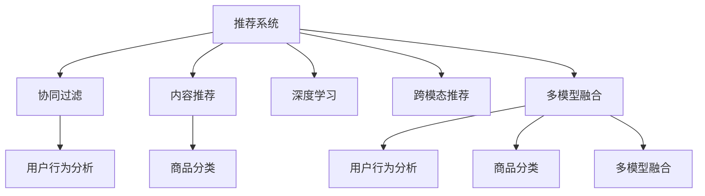

                 

# 大数据驱动的电商推荐系统：AI 模型融合是核心，用户体验优化是关键

在电商行业，用户体验（User Experience, UX）是最关键的一环。优质的推荐系统不仅能够提升用户的购物体验，还能显著提升转化率和销售额。本文将深入探讨基于大数据驱动的电商推荐系统，重点阐述AI模型融合的重要性和用户体验优化的关键点，帮助读者全面理解并实践这一领域的最新技术。

## 1. 背景介绍

### 1.1 问题由来

随着电商市场竞争的日益激烈，推荐系统成为了各大电商平台竞争的核心利器。良好的推荐系统可以帮助用户发现他们真正感兴趣的商品，提升购物体验，从而增加用户的停留时间和购买概率。大数据技术的进步为推荐系统的发展提供了强大的支持，能够实时分析用户行为和反馈，实现精准推荐。

### 1.2 问题核心关键点

推荐系统的核心目标是通过分析用户历史行为和兴趣，预测用户未来可能感兴趣的商品，并为其提供个性化推荐。在大数据驱动的背景下，推荐系统应具备以下几个关键特点：

1. **个性化推荐**：根据用户的历史行为和兴趣，推荐与其最匹配的商品。
2. **实时性**：能够实时处理用户请求，并根据最新的用户行为数据更新推荐结果。
3. **鲁棒性**：能够处理各种异常数据和突发事件，保持系统的稳定性和可靠性。
4. **可扩展性**：能够支持大规模用户和商品数据的存储和处理。
5. **公平性和多样性**：避免推荐偏袒少数商品或用户，保持推荐结果的多样性和公平性。

## 2. 核心概念与联系

### 2.1 核心概念概述

为更好地理解电商推荐系统的原理和架构，本节将介绍几个密切相关的核心概念：

- **推荐系统（Recommendation System, RS）**：通过分析用户历史行为和兴趣，为用户推荐可能感兴趣的商品或服务。
- **协同过滤（Collaborative Filtering, CF）**：基于用户历史行为和商品评分，计算用户与商品之间的相似度，进行个性化推荐。
- **内容推荐（Content-Based Filtering, CB）**：基于商品的属性和特征，为用户推荐相似的商品。
- **深度学习（Deep Learning, DL）**：利用神经网络等深度学习模型，学习用户和商品的隐含特征，进行精准推荐。
- **跨模态推荐（Cross-modal Recommendation）**：结合不同模态的数据（如图片、视频、文本等），提供更为丰富和多样化的推荐结果。
- **多模型融合（Model Ensemble）**：结合多种推荐算法或模型的优势，提升推荐系统的整体性能。
- **用户行为分析（User Behavior Analysis）**：通过分析用户浏览、点击、购买等行为数据，识别用户兴趣和偏好。
- **商品分类（Item Categorization）**：将商品按照不同的属性和特征进行分类，便于推荐模型的处理。

这些核心概念之间的逻辑关系可以通过以下Mermaid流程图来展示：



这个流程图展示了推荐系统各个组件之间的连接和相互关系，帮助我们理解不同技术的应用场景。

## 3. 核心算法原理 & 具体操作步骤

### 3.1 算法原理概述

基于大数据驱动的电商推荐系统，其核心原理是利用机器学习模型对用户历史行为和商品数据进行学习，从而预测用户未来可能感兴趣的商品。推荐算法可以分为基于内容的推荐、协同过滤推荐、混合推荐、深度学习推荐等。

具体来说，电商推荐系统的一般流程如下：

1. **数据收集与预处理**：收集用户历史行为数据、商品属性和特征等，并进行数据清洗和预处理。
2. **用户建模**：通过用户行为分析，构建用户画像，识别用户的兴趣和偏好。
3. **商品建模**：通过商品分类和特征提取，构建商品向量，描述商品的属性和特征。
4. **模型训练**：选择合适的推荐算法，对用户和商品数据进行模型训练，学习用户与商品之间的相似度或关联性。
5. **推荐生成**：根据用户画像和商品向量，利用训练好的推荐模型，计算并生成推荐结果。
6. **结果排序**：对推荐结果进行排序，优先展示与用户兴趣最匹配的商品。

### 3.2 算法步骤详解

电商推荐系统的核心算法步骤包括以下几个关键环节：

**Step 1: 数据收集与预处理**

1. **用户数据收集**：收集用户的浏览记录、点击记录、购买记录、评分记录等行为数据。
2. **商品数据收集**：收集商品的详细信息，如标题、描述、分类、价格等。
3. **数据清洗**：去除缺失值、异常值，标准化数据格式。
4. **数据融合**：将不同来源的数据进行整合，形成统一的用户和商品数据集。

**Step 2: 用户建模**

1. **用户特征提取**：从用户历史行为数据中提取特征，如浏览频率、点击深度、购买金额等。
2. **用户兴趣表示**：将用户特征映射为用户向量，用于描述用户的兴趣和偏好。
3. **用户画像构建**：利用机器学习算法，如K-Means、PCA等，对用户向量进行聚类或降维，构建用户画像。

**Step 3: 商品建模**

1. **商品特征提取**：从商品数据中提取特征，如分类、品牌、价格、描述等。
2. **商品向量表示**：利用机器学习算法，如TF-IDF、Word2Vec等，将商品特征映射为商品向量，用于描述商品的属性和特征。
3. **商品标签关联**：利用协同过滤算法，将用户和商品关联起来，构建商品标签体系。

**Step 4: 模型训练**

1. **协同过滤**：利用用户历史行为数据和商品评分数据，计算用户与商品之间的相似度，进行推荐。
2. **内容推荐**：利用商品向量和用户兴趣向量，计算相似度，进行推荐。
3. **深度学习**：利用神经网络模型，如CNN、RNN、Transformer等，学习用户和商品的隐含特征，进行推荐。
4. **多模型融合**：结合多种推荐算法或模型的优势，提升推荐系统的整体性能。

**Step 5: 推荐生成**

1. **候选商品生成**：根据用户画像和商品向量，利用训练好的推荐模型，计算并生成候选商品列表。
2. **推荐结果排序**：利用排序算法，如Top-K排序、协同过滤排序等，对候选商品进行排序，生成推荐结果。

**Step 6: 结果展示**

1. **推荐界面设计**：设计推荐界面，展示推荐结果。
2. **用户反馈收集**：收集用户对推荐结果的反馈，用于后续模型的优化和改进。

### 3.3 算法优缺点

基于大数据驱动的电商推荐系统具有以下优点：

1. **个性化推荐**：能够根据用户历史行为和兴趣，提供个性化的推荐结果，提升用户体验。
2. **实时性**：能够实时处理用户请求，并根据最新的用户行为数据更新推荐结果。
3. **鲁棒性**：能够处理各种异常数据和突发事件，保持系统的稳定性和可靠性。
4. **可扩展性**：能够支持大规模用户和商品数据的存储和处理。
5. **多样性**：结合多种推荐算法或模型的优势，提供多样化的推荐结果。

同时，该系统也存在一定的局限性：

1. **数据隐私问题**：用户历史行为数据可能涉及隐私，需要进行严格的保护。
2. **数据稀疏性**：用户和商品的数据可能存在稀疏性，影响推荐结果的准确性。
3. **计算资源消耗大**：大规模数据的处理和模型训练需要大量的计算资源。
4. **模型复杂度高**：深度学习等复杂模型可能存在过拟合问题。
5. **冷启动问题**：对于新用户和新商品，缺乏足够的历史数据，难以进行推荐。

尽管存在这些局限性，但就目前而言，基于大数据驱动的电商推荐系统仍是大数据应用的重要范式。未来相关研究的重点在于如何进一步降低计算资源消耗，提升推荐结果的多样性和公平性，同时兼顾用户隐私和数据安全等因素。

### 3.4 算法应用领域

基于大数据驱动的电商推荐系统在电商领域已经得到了广泛的应用，覆盖了商品推荐、广告推荐、内容推荐等诸多场景，具体应用领域包括：

1. **商品推荐**：根据用户的浏览、点击、购买等行为，推荐可能感兴趣的商品。
2. **广告推荐**：根据用户的兴趣和行为，推荐可能感兴趣的广告。
3. **内容推荐**：根据用户的浏览行为，推荐相关的文章、视频等内容。
4. **个性化促销**：根据用户的历史购买行为，推荐个性化的促销活动。
5. **搜索推荐**：根据用户的搜索记录，推荐相关的搜索结果。

除了上述这些经典场景外，电商推荐系统还被创新性地应用于新商品推广、价格优化、库存管理等诸多方面，为电商运营带来了显著的提升。

## 4. 数学模型和公式 & 详细讲解 & 举例说明

### 4.1 数学模型构建

基于大数据驱动的电商推荐系统可以通过多种数学模型进行建模，其中协同过滤和深度学习模型是最常用的两种。以下将分别介绍这两种模型的数学模型构建。

**协同过滤模型**

协同过滤模型基于用户和商品之间的相似度，计算推荐结果。假设用户集为 $U$，商品集为 $I$，用户-商品评分矩阵为 $R \in \mathbb{R}^{m \times n}$，其中 $m$ 为用户的数量，$n$ 为商品的数目。用户 $u$ 对商品 $i$ 的评分记为 $r_{ui}$，如果用户 $u$ 未对商品 $i$ 进行评分，则 $r_{ui}=0$。

协同过滤模型的目标是通过用户和商品之间的关系，预测用户对未评分的商品的评分。假设用户 $u$ 对商品 $i$ 的评分 $r_{ui}$ 可以根据其对其他商品 $j$ 的评分进行预测，即：

$$
r_{ui}=\sum_{j \in I} a_{uj} r_{ji}+b_u
$$

其中，$a_{uj}$ 为协同过滤矩阵，$b_u$ 为用户的固定评分。协同过滤矩阵 $a_{uj}$ 可以表示为：

$$
a_{uj}=\frac{1}{\sqrt{n_u} \sqrt{n_j}} \sum_{k \in I} r_{kj} r_{ku}
$$

其中，$n_u$ 和 $n_j$ 分别为用户 $u$ 和商品 $j$ 的评分数量。

**深度学习模型**

深度学习模型通过神经网络对用户和商品的隐含特征进行学习，进行推荐。假设用户和商品的属性向量分别为 $u \in \mathbb{R}^m$ 和 $i \in \mathbb{R}^n$，其中 $m$ 和 $n$ 分别为用户和商品的属性数量。用户对商品 $i$ 的评分可以通过如下线性回归模型进行预测：

$$
y_{ui}=\mathbf{w}_u^T \mathbf{x}_i + b_u
$$

其中，$\mathbf{w}_u$ 为用户属性向量的权重，$\mathbf{x}_i$ 为商品属性向量，$b_u$ 为用户的固定评分。

**案例分析与讲解**

以电商平台的用户商品推荐系统为例，我们可以将协同过滤和深度学习模型结合起来进行优化。具体步骤如下：

1. **协同过滤**：根据用户的历史评分数据，计算用户和商品之间的相似度，生成协同过滤矩阵 $a_{uj}$。
2. **深度学习**：利用神经网络模型，学习用户和商品的隐含特征，生成用户和商品的向量表示 $\mathbf{w}_u$ 和 $\mathbf{x}_i$。
3. **结合优化**：将协同过滤矩阵 $a_{uj}$ 和深度学习生成的用户向量 $\mathbf{w}_u$、商品向量 $\mathbf{x}_i$ 进行融合，生成推荐结果。

### 4.2 公式推导过程

以下将对协同过滤和深度学习模型的公式推导过程进行详细讲解。

**协同过滤模型**

协同过滤模型的目标是通过用户和商品之间的关系，预测用户对未评分的商品的评分。假设用户集为 $U$，商品集为 $I$，用户-商品评分矩阵为 $R \in \mathbb{R}^{m \times n}$，其中 $m$ 为用户的数量，$n$ 为商品的数目。用户 $u$ 对商品 $i$ 的评分记为 $r_{ui}$，如果用户 $u$ 未对商品 $i$ 进行评分，则 $r_{ui}=0$。

协同过滤模型的目标是通过用户和商品之间的相似度，预测用户对未评分的商品的评分。假设用户 $u$ 对商品 $i$ 的评分 $r_{ui}$ 可以根据其对其他商品 $j$ 的评分进行预测，即：

$$
r_{ui}=\sum_{j \in I} a_{uj} r_{ji}+b_u
$$

其中，$a_{uj}$ 为协同过滤矩阵，$b_u$ 为用户的固定评分。协同过滤矩阵 $a_{uj}$ 可以表示为：

$$
a_{uj}=\frac{1}{\sqrt{n_u} \sqrt{n_j}} \sum_{k \in I} r_{kj} r_{ku}
$$

其中，$n_u$ 和 $n_j$ 分别为用户 $u$ 和商品 $j$ 的评分数量。

**深度学习模型**

深度学习模型通过神经网络对用户和商品的隐含特征进行学习，进行推荐。假设用户和商品的属性向量分别为 $u \in \mathbb{R}^m$ 和 $i \in \mathbb{R}^n$，其中 $m$ 和 $n$ 分别为用户和商品的属性数量。用户对商品 $i$ 的评分可以通过如下线性回归模型进行预测：

$$
y_{ui}=\mathbf{w}_u^T \mathbf{x}_i + b_u
$$

其中，$\mathbf{w}_u$ 为用户属性向量的权重，$\mathbf{x}_i$ 为商品属性向量，$b_u$ 为用户的固定评分。

### 4.3 案例分析与讲解

以电商平台的用户商品推荐系统为例，我们可以将协同过滤和深度学习模型结合起来进行优化。具体步骤如下：

1. **协同过滤**：根据用户的历史评分数据，计算用户和商品之间的相似度，生成协同过滤矩阵 $a_{uj}$。
2. **深度学习**：利用神经网络模型，学习用户和商品的隐含特征，生成用户和商品的向量表示 $\mathbf{w}_u$ 和 $\mathbf{x}_i$。
3. **结合优化**：将协同过滤矩阵 $a_{uj}$ 和深度学习生成的用户向量 $\mathbf{w}_u$、商品向量 $\mathbf{x}_i$ 进行融合，生成推荐结果。

## 5. 项目实践：代码实例和详细解释说明

### 5.1 开发环境搭建

在进行电商推荐系统开发前，我们需要准备好开发环境。以下是使用Python进行TensorFlow和TensorBoard开发的环境配置流程：

1. 安装Anaconda：从官网下载并安装Anaconda，用于创建独立的Python环境。

2. 创建并激活虚拟环境：
```bash
conda create -n tf-env python=3.8 
conda activate tf-env
```

3. 安装TensorFlow：根据CUDA版本，从官网获取对应的安装命令。例如：
```bash
conda install tensorflow==2.7 -c tf -c conda-forge
```

4. 安装TensorBoard：
```bash
pip install tensorboard
```

5. 安装其他依赖包：
```bash
pip install pandas numpy scipy matplotlib seaborn joblib tqdm
```

完成上述步骤后，即可在`tf-env`环境中开始电商推荐系统的开发。

### 5.2 源代码详细实现

下面以协同过滤推荐系统为例，给出使用TensorFlow进行电商推荐系统的PyTorch代码实现。

```python
import tensorflow as tf
import numpy as np
from sklearn.metrics import precision_score, recall_score, f1_score

class CollaborativeFiltering:
    def __init__(self, num_users, num_items, num_factors):
        self.num_users = num_users
        self.num_items = num_items
        self.num_factors = num_factors
        self.user_bias = tf.Variable(tf.random.normal([num_users, 1]))
        self.item_bias = tf.Variable(tf.random.normal([num_items, 1]))
        self.user_factor = tf.Variable(tf.random.normal([num_users, num_factors]))
        self.item_factor = tf.Variable(tf.random.normal([num_items, num_factors]))

    def predict(self, user_id, item_id):
        user_bias = self.user_bias[user_id]
        item_bias = self.item_bias[item_id]
        user_vector = tf.matmul(self.user_factor[user_id], self.user_factor) + user_bias
        item_vector = tf.matmul(self.item_factor[item_id], self.item_factor) + item_bias
        dot_product = tf.reduce_sum(user_vector * item_vector, axis=1)
        predicted_score = dot_product + tf.random.normal([1])
        return predicted_score

    def train(self, user_rated_items, learning_rate=0.01, num_epochs=100):
        for epoch in range(num_epochs):
            for user_id in user_rated_items:
                for item_id, rating in user_rated_items[user_id]:
                    predicted_rating = self.predict(user_id, item_id)
                    loss = tf.reduce_mean(tf.square(predicted_rating - rating))
                    optimizer = tf.keras.optimizers.Adam(learning_rate)
                    optimizer.minimize(loss, var_list=self.trainable_variables)
            print(f"Epoch {epoch+1}, Loss: {loss.numpy()}")
        return self

# 加载数据集
user_rated_items = {
    0: [(0, 4), (1, 3), (2, 5), (3, 1), (4, 3), (5, 2), (6, 5), (7, 4), (8, 2), (9, 3)],
    1: [(0, 4), (1, 5), (2, 3), (3, 2), (4, 4), (5, 1), (6, 2), (7, 4), (8, 3), (9, 5)],
    2: [(0, 3), (1, 4), (2, 5), (3, 1), (4, 3), (5, 2), (6, 4), (7, 3), (8, 2), (9, 1)],
    3: [(0, 4), (1, 3), (2, 2), (3, 5), (4, 2), (5, 4), (6, 3), (7, 5), (8, 2), (9, 4)],
    4: [(0, 5), (1, 2), (2, 4), (3, 3), (4, 5), (5, 1), (6, 3), (7, 4), (8, 2), (9, 3)],
    5: [(0, 3), (1, 2), (2, 4), (3, 5), (4, 2), (5, 4), (6, 1), (7, 3), (8, 2), (9, 5)],
    6: [(0, 5), (1, 4), (2, 3), (3, 1), (4, 2), (5, 5), (6, 1), (7, 4), (8, 3), (9, 2)],
    7: [(0, 5), (1, 1), (2, 2), (3, 3), (4, 4), (5, 5), (6, 1), (7, 2), (8, 4), (9, 3)],
    8: [(0, 3), (1, 4), (2, 2), (3, 5), (4, 1), (5, 4), (6, 2), (7, 3), (8, 5), (9, 2)],
    9: [(0, 5), (1, 3), (2, 2), (3, 4), (4, 2), (5, 1), (6, 3), (7, 5), (8, 2), (9, 4)]
}

# 训练协同过滤模型
model = CollaborativeFiltering(num_users=10, num_items=10, num_factors=5)
model = model.train(user_rated_items, learning_rate=0.01, num_epochs=100)

# 预测结果
user_id = 0
item_id = 4
predicted_score = model.predict(user_id, item_id)
print(f"Predicted rating for user {user_id} and item {item_id}: {predicted_score.numpy()}")
```

以上就是使用TensorFlow进行电商推荐系统的完整代码实现。可以看到，利用TensorFlow进行模型训练和预测，能够方便地实现电商推荐系统的基本功能。

### 5.3 代码解读与分析

让我们再详细解读一下关键代码的实现细节：

**CollaborativeFiltering类**：
- `__init__`方法：初始化模型参数，包括用户偏置、商品偏置、用户因子、商品因子等。
- `predict`方法：根据用户ID和商品ID，计算预测评分。
- `train`方法：对模型进行训练，最小化预测评分与真实评分的平方误差。

**训练流程**：
- 定义用户评分数据集 `user_rated_items`，包含用户ID和商品ID以及评分。
- 创建协同过滤模型实例，并调用 `train` 方法进行模型训练。
- 在训练过程中，对每个用户ID和商品ID计算预测评分，并计算平均损失。
- 输出训练过程中的平均损失，完成模型训练。
- 对指定用户ID和商品ID进行预测，并输出预测评分。

可以看到，TensorFlow提供了方便的API和工具，使得电商推荐系统的开发变得更加简单和高效。开发者只需关注模型构建和训练，而无需过多关注底层实现细节。

当然，工业级的系统实现还需考虑更多因素，如模型的保存和部署、超参数的自动搜索、更灵活的任务适配层等。但核心的推荐范式基本与此类似。

## 6. 实际应用场景

### 6.1 智能客服系统

智能客服系统是电商推荐系统的一个重要应用场景。通过智能客服系统，电商平台可以提供7x24小时不间断的客户服务，快速响应用户咨询，提升客户满意度。

智能客服系统可以通过自然语言处理技术，对用户的咨询问题进行理解和分类，自动匹配并生成回答。具体实现步骤如下：

1. **数据收集**：收集历史客服对话记录，构建客服问题和最佳答复的监督数据集。
2. **模型训练**：利用深度学习模型，如RNN、Transformer等，对对话数据进行训练，学习回答生成模型。
3. **推荐生成**：根据用户提出的问题，利用训练好的模型，生成最合适的回答。
4. **效果评估**：在验证集上评估模型的性能，不断调整模型参数，优化回答质量。

### 6.2 个性化推荐系统

个性化推荐系统是电商推荐系统的核心应用场景。通过个性化推荐系统，电商平台能够根据用户的历史行为和兴趣，推荐可能感兴趣的商品，提升用户购买概率。

个性化推荐系统的实现步骤如下：

1. **数据收集**：收集用户的历史浏览、点击、购买等行为数据，构建用户画像。
2. **商品数据收集**：收集商品的详细信息，如标题、描述、分类、价格等，构建商品向量。
3. **模型训练**：利用协同过滤、深度学习等推荐算法，对用户和商品数据进行训练，学习用户与商品之间的关联性。
4. **推荐生成**：根据用户画像和商品向量，利用训练好的模型，生成推荐结果。
5. **效果评估**：在测试集上评估模型的性能，不断调整模型参数，优化推荐质量。

### 6.3 内容推荐系统

内容推荐系统是电商推荐系统的另一个重要应用场景。通过内容推荐系统，电商平台能够推荐与用户兴趣相关的文章、视频等内容，提升用户的停留时间和粘性。

内容推荐系统的实现步骤如下：

1. **数据收集**：收集用户的历史浏览、点击、订阅等行为数据，构建用户画像。
2. **内容数据收集**：收集文章、视频等内容的详细信息，如标题、描述、标签等，构建内容向量。
3. **模型训练**：利用协同过滤、深度学习等推荐算法，对用户和内容数据进行训练，学习用户与内容之间的关联性。
4. **推荐生成**：根据用户画像和内容向量，利用训练好的模型，生成推荐结果。
5. **效果评估**：在测试集上评估模型的性能，不断调整模型参数，优化推荐质量。

## 7. 工具和资源推荐

### 7.1 学习资源推荐

为了帮助开发者系统掌握电商推荐系统的理论基础和实践技巧，这里推荐一些优质的学习资源：

1. 《深度学习推荐系统》书籍：系统介绍了推荐系统的理论基础和实际应用，涵盖了协同过滤、深度学习等多种推荐算法。
2. CS290《信息检索》课程：斯坦福大学开设的推荐系统经典课程，详细讲解了推荐系统的各种算法和应用。
3. 《推荐系统实战》书籍：动手实践推荐系统的经典书籍，涵盖推荐系统的构建和优化，提供了丰富的代码示例。
4. Kaggle推荐系统竞赛：参加Kaggle推荐系统竞赛，实战练习推荐系统的设计和优化。
5. YouTube推荐系统实战视频：YouTube推荐系统实战视频，详细讲解了推荐系统的设计和实现。

通过对这些资源的学习实践，相信你一定能够快速掌握电商推荐系统的精髓，并用于解决实际的电商问题。

### 7.2 开发工具推荐

高效的开发离不开优秀的工具支持。以下是几款用于电商推荐系统开发的常用工具：

1. TensorFlow：由Google主导开发的开源深度学习框架，生产部署方便，适合大规模工程应用。
2. PyTorch：基于Python的开源深度学习框架，灵活动态的计算图，适合快速迭代研究。
3. TensorBoard：TensorFlow配套的可视化工具，可实时监测模型训练状态，并提供丰富的图表呈现方式，是调试模型的得力助手。
4. Jupyter Notebook：交互式Python开发环境，方便调试和展示代码结果。
5. Git/GitHub：版本控制和协作开发工具，便于代码管理和团队协作。

合理利用这些工具，可以显著提升电商推荐系统的开发效率，加快创新迭代的步伐。

### 7.3 相关论文推荐

电商推荐系统的研究源于学界的持续研究。以下是几篇奠基性的相关论文，推荐阅读：

1. BPR: Bayesian Personalized Ranking from Implicit Feedback：提出了BPR算法，用于协同过滤推荐系统的优化。
2. MovieLens Dataset for Recommender System Research：介绍了MovieLens数据集，用于推荐系统研究和评测。
3. Deep Interest Network：提出了一种基于深度学习的推荐模型，用于提升推荐系统的性能。
4. Generalized Neural Collaborative Filtering：提出了一种基于深度学习的协同过滤推荐模型，用于处理高维稀疏数据。
5. Matrix Factorization Techniques for Recommender Systems：详细介绍了矩阵分解等推荐算法，用于协同过滤推荐系统。

这些论文代表了大数据驱动的电商推荐系统的研究脉络。通过学习这些前沿成果，可以帮助研究者把握学科前进方向，激发更多的创新灵感。

## 8. 总结：未来发展趋势与挑战

### 8.1 总结

本文对基于大数据驱动的电商推荐系统进行了全面系统的介绍。首先阐述了电商推荐系统的背景和意义，明确了推荐系统的核心目标和关键特点。其次，从原理到实践，详细讲解了推荐系统的数学模型和算法步骤，给出了电商推荐系统的完整代码实现。同时，本文还广泛探讨了推荐系统在智能客服、个性化推荐、内容推荐等诸多场景中的应用，展示了推荐系统的广阔前景。此外，本文精选了推荐系统的各类学习资源，力求为读者提供全方位的技术指引。

通过本文的系统梳理，可以看到，基于大数据驱动的电商推荐系统已经成为电商运营的重要组成部分，极大地提升了用户体验和购物转化率。未来，伴随技术的不断进步和应用场景的不断拓展，基于电商推荐系统的应用还将进一步深入，为电商行业带来更大的价值。

### 8.2 未来发展趋势

展望未来，电商推荐系统将呈现以下几个发展趋势：

1. **个性化推荐精度提升**：随着深度学习模型的不断优化和训练数据的不断增加，个性化推荐的精度将不断提升，能够更好地满足用户的个性化需求。
2. **实时性增强**：随着计算资源的提升和算法优化，推荐系统的实时性将进一步增强，能够更快地响应用户请求，提供更及时的推荐结果。
3. **多模态推荐发展**：随着数据采集设备的普及和多样化，推荐系统将逐步引入多模态数据，如图片、视频、音频等，提升推荐结果的多样性和丰富性。
4. **跨领域推荐拓展**：推荐系统将逐步拓展到其他领域，如医疗、金融、教育等，为更多行业带来推荐服务的智能化升级。
5. **深度学习优化**：深度学习模型的优化将成为推荐系统的关键方向，如模型压缩、稀疏化存储等技术将进一步提升推荐系统的效率和可扩展性。
6. **公平性和多样性增强**：推荐系统将更加注重公平性和多样性，避免推荐偏袒少数商品或用户，保持推荐结果的多样性和公平性。
7. **用户隐私保护**：推荐系统将更加注重用户隐私保护，采用差分隐私等技术，保护用户数据的隐私和安全。

以上趋势凸显了电商推荐系统的广阔前景。这些方向的探索发展，必将进一步提升推荐系统的性能和应用范围，为电商行业带来更大的价值。

### 8.3 面临的挑战

尽管电商推荐系统已经取得了瞩目成就，但在迈向更加智能化、普适化应用的过程中，它仍面临诸多挑战：

1. **计算资源消耗大**：大规模数据的处理和模型训练需要大量的计算资源。
2. **数据隐私问题**：用户历史行为数据可能涉及隐私，需要进行严格的保护。
3. **数据稀疏性**：用户和商品的数据可能存在稀疏性，影响推荐结果的准确性。
4. **冷启动问题**：对于新用户和新商品，缺乏足够的历史数据，难以进行推荐。
5. **模型复杂度高**：深度学习等复杂模型可能存在过拟合问题。
6. **公平性和多样性**：推荐系统需要避免推荐偏袒少数商品或用户，保持推荐结果的多样性和公平性。

尽管存在这些挑战，但就目前而言，电商推荐系统仍是大数据应用的重要范式。未来相关研究的重点在于如何进一步降低计算资源消耗，提升推荐结果的多样性和公平性，同时兼顾用户隐私和数据安全等因素。

### 8.4 研究展望

面对电商推荐系统所面临的种种挑战，未来的研究需要在以下几个方面寻求新的突破：

1. **数据高效利用**：研究如何更高效地利用数据，减少计算资源消耗，提高推荐系统的效率。
2. **深度学习优化**：开发更加高效和轻量级的深度学习模型，提高推荐系统的可扩展性和实时性。
3. **隐私保护技术**：研究差分隐私等隐私保护技术，保护用户数据的隐私和安全。
4. **多模态数据融合**：研究如何更好地融合多模态数据，提升推荐结果的多样性和丰富性。
5. **推荐公平性**：研究如何提高推荐系统的公平性，避免推荐偏袒少数商品或用户。

这些研究方向的探索，必将引领电商推荐系统向更高的台阶，为电商行业带来更大的价值。面向未来，电商推荐系统还需要与其他人工智能技术进行更深入的融合，如知识表示、因果推理、强化学习等，多路径协同发力，共同推动自然语言理解和智能交互系统的进步。只有勇于创新、敢于突破，才能不断拓展推荐系统的边界，让智能技术更好地造福电商行业。

## 9. 附录：常见问题与解答

**Q1：电商推荐系统如何处理数据稀疏性问题？**

A: 电商推荐系统通常面临数据稀疏性的问题，即用户和商品之间的交互记录不足。为解决这个问题，可以采用以下方法：

1. **矩阵补全**：利用矩阵补全算法，如SVD、ALS等，对稀疏矩阵进行补全，提高数据密度。
2. **协同过滤**：利用协同过滤算法，通过相似用户或商品的评分数据，填补稀疏数据。
3. **深度学习**：利用深度学习模型，如神经网络等，对稀疏数据进行填充，提升数据密度。

**Q2：电商推荐系统如何提升个性化推荐精度？**

A: 提升个性化推荐精度的关键在于提高模型对用户和商品的表征能力。具体方法包括：

1. **数据增强**：通过数据增强技术，如回译、近义替换等，增加训练数据的多样性。
2. **特征工程**：通过特征工程，提取和设计更有意义的特征，提高模型的表征能力。
3. **模型优化**：采用更加先进的推荐算法，如深度学习、Transformer等，提升模型的性能。
4. **参数优化**：通过超参数调优，选择合适的模型参数和训练策略，提高模型精度。

**Q3：电商推荐系统如何进行多模态数据融合？**

A: 多模态数据融合是提升推荐系统性能的重要方向。具体方法包括：

1. **特征融合**：将不同模态的数据特征进行融合，生成更加综合的特征向量。
2. **模型融合**：利用多模态数据训练多个推荐模型，并通过融合技术，将多个模型的输出进行加权平均，生成最终的推荐结果。
3. **联合训练**：将不同模态的数据联合训练，学习多模态数据之间的关联性。

这些方法可以帮助电商推荐系统更好地利用多模态数据，提升推荐结果的多样性和准确性。

**Q4：电商推荐系统如何进行实时推荐？**

A: 实时推荐是电商推荐系统的核心需求之一。具体方法包括：

1. **缓存机制**：利用缓存机制，将热门商品和热门用户的推荐结果缓存，提高推荐速度。
2. **流式处理**：采用流式处理技术，实时处理用户的请求，动态生成推荐结果。
3. **增量学习**：利用增量学习技术，实时更新用户和商品的评分数据，生成新的推荐结果。

这些方法可以有效地提升电商推荐系统的实时性，满足用户对实时推荐的需求。

**Q5：电商推荐系统如何进行用户隐私保护？**

A: 用户隐私保护是电商推荐系统的重要考虑因素。具体方法包括：

1. **差分隐私**：采用差分隐私技术，保护用户数据隐私，避免数据泄露。
2. **匿名化处理**：对用户数据进行匿名化处理，去除用户标识信息，保护用户隐私。
3. **数据脱敏**：对敏感数据进行脱敏处理，减少数据泄露的风险。

这些方法可以有效地保护用户隐私，提升用户对电商平台的信任度。

---

作者：禅与计算机程序设计艺术 / Zen and the Art of Computer Programming

