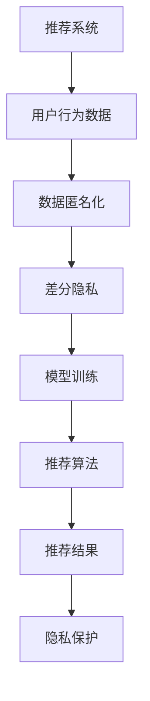

                 

## 1. 背景介绍

### 1.1 问题由来

推荐系统在电子商务、社交网络、媒体内容等许多领域广泛应用，极大地提升了用户个性化体验和信息获取效率。然而，推荐系统中的用户行为数据通常包含大量敏感信息，包括用户的浏览历史、购买记录、评价评论等，这些数据如果被不当利用，将对用户的隐私构成严重威胁。因此，隐私保护成为推荐系统设计和实现中必须严格考虑的关键问题。

### 1.2 问题核心关键点

推荐系统中的隐私保护问题主要集中在以下几个方面：

- **数据匿名化**：如何去除或模糊化原始数据中的个人标识信息，防止数据被逆向识别。
- **模型差分隐私**：如何在模型训练和推荐过程中，限制对个体数据的具体查询，保护用户隐私。
- **数据最小化**：只收集推荐系统所需的最少数据，减少隐私泄露风险。
- **用户控制权**：让用户有权控制自己的数据是否被收集、使用和共享，增强用户隐私自主权。

## 2. 核心概念与联系

### 2.1 核心概念概述

- **推荐系统**：根据用户的历史行为和特征，推荐最符合其兴趣的物品的系统。推荐系统的核心在于对用户行为数据的建模，从而预测用户可能感兴趣的物品。
- **隐私保护**：保护个人信息不被未经授权的访问、使用或披露，维护用户隐私权益。
- **差分隐私**：在数据处理和分析中，通过向数据中引入噪声或扰动，使得无法逆向推断个体数据的隐私保护技术。
- **模型透明性**：提高模型的可解释性和可理解性，使用户和监管机构能够监督模型的行为和决策过程。

### 2.2 核心概念原理和架构的 Mermaid 流程图(Mermaid 流程节点中不要有括号、逗号等特殊字符)


该流程图展示了推荐系统中隐私保护的流程：用户行为数据首先经过数据匿名化处理，然后在差分隐私的保护下进行模型训练，并使用差分隐私保护的推荐算法生成推荐结果，最终在隐私保护机制下对外提供推荐服务。

## 3. 核心算法原理 & 具体操作步骤

### 3.1 算法原理概述

推荐系统中的隐私保护算法主要围绕数据匿名化、差分隐私和数据最小化展开。

- **数据匿名化**：通过数据脱敏、泛化等方法，使得原始数据中的个人标识信息无法直接关联到具体个体。
- **差分隐私**：在模型训练和推荐过程中，通过加入随机噪声或扰动，确保模型输出无法准确反映个体数据的敏感信息。
- **数据最小化**：只收集推荐系统所需的最少数据，避免过度收集造成隐私泄露风险。

### 3.2 算法步骤详解

#### 数据匿名化

数据匿名化分为伪匿名化和假匿名化两种方式。

- **伪匿名化**：通过模糊化、泛化等方法，使得数据中的个人标识信息无法直接关联到具体个体。例如，将用户ID替换为不可逆的哈希值，或使用K-匿名化方法将数据划分为多个等价的子集，每个子集包含相同数量的个体。

  ```python
  from anonymization import KAnonymization

  # 创建K匿名化对象
  anonymizer = KAnonymization(data, k)

  # 对数据进行K匿名化处理
  anonymized_data = anonymizer.k_anonymize(data)
  ```

- **假匿名化**：通过引入噪声或扰动，使得数据无法逆向推断出具体个体。例如，使用Laplacian噪声或高斯噪声对数据进行扰动，使得每个数据点都略微偏移，无法准确推断原始值。

  ```python
  import numpy as np

  # 生成Laplacian噪声
  noise = np.random.laplace(0, 0.1, data.shape)

  # 对数据进行噪声注入
  anonymized_data = data + noise
  ```

#### 差分隐私

差分隐私通过在算法中加入随机噪声，确保模型输出的变化无法准确反映单个数据点的变化。常见的差分隐私机制包括：

- **Laplace机制**：向模型输出中加入Laplacian噪声，确保模型输出的L-1范数不超过一个预设的ε值。

  $$
  f(x) = M(x) + \epsilon N, \quad N \sim Laplace(0, \sigma)
  $$

  其中，$M(x)$ 是原始模型输出，$N$ 是Laplacian噪声，$\epsilon$ 是隐私保护参数。

  ```python
  from differential_privacy import LaplaceMechanism

  # 创建Laplace机制对象
  mechanism = LaplaceMechanism(epsilon)

  # 对模型输出进行差分隐私处理
  private_output = mechanism.private_computation(model_output)
  ```

- **高斯机制**：向模型输出中加入高斯噪声，确保模型输出的L-2范数不超过一个预设的ε值。

  $$
  f(x) = M(x) + \epsilon N, \quad N \sim N(0, \sigma^2)
  $$

  其中，$M(x)$ 是原始模型输出，$N$ 是高斯噪声，$\epsilon$ 是隐私保护参数。

  ```python
  from differential_privacy import GaussianMechanism

  # 创建高斯机制对象
  mechanism = GaussianMechanism(epsilon)

  # 对模型输出进行差分隐私处理
  private_output = mechanism.private_computation(model_output)
  ```

#### 数据最小化

数据最小化策略包括：

- **数据截断**：仅保留推荐系统所需的最少数据，避免过度收集和存储。例如，只收集用户的浏览记录和评分记录，不收集用户的个人信息。

  ```python
  # 定义推荐系统所需的数据字段
  required_fields = ['item_id', 'user_id', 'rating']

  # 截断数据，仅保留所需字段
  minimized_data = [data for data in original_data if all(field in data for field in required_fields)]
  ```

- **数据加密**：对敏感数据进行加密处理，确保数据在传输和存储过程中的安全性。例如，使用AES加密算法对用户数据进行加密。

  ```python
  from cryptography.fernet import Fernet

  # 生成加密密钥
  key = Fernet.generate_key()

  # 创建Fernet加密对象
  cipher = Fernet(key)

  # 对数据进行加密
  encrypted_data = [cipher.encrypt(data) for data in minimized_data]
  ```

### 3.3 算法优缺点

**数据匿名化**

- **优点**：能够有效保护用户隐私，防止数据被逆向识别。
- **缺点**：可能会引入一定的数据损失和计算开销。

**差分隐私**

- **优点**：能够在模型训练和推荐过程中保护用户隐私，确保模型输出的鲁棒性。
- **缺点**：可能会引入一定的噪声，影响模型精度。

**数据最小化**

- **优点**：能够减少隐私泄露风险，降低数据存储和处理的成本。
- **缺点**：可能会丢失一些有用的信息，影响推荐系统的准确性。

### 3.4 算法应用领域

- **电子商务推荐**：在电商平台上，推荐系统需要处理用户的浏览、购买记录，这些数据包含大量敏感信息。通过差分隐私和数据最小化策略，保护用户隐私，同时提供个性化的商品推荐。

- **社交网络推荐**：在社交平台上，推荐系统需要处理用户的关注、点赞、评论等行为数据。通过差分隐私和数据匿名化，保护用户隐私，同时提供个性化的内容推荐。

- **媒体内容推荐**：在视频、音频平台上，推荐系统需要处理用户的播放、收藏记录等行为数据。通过差分隐私和数据最小化策略，保护用户隐私，同时提供个性化的媒体内容推荐。

## 4. 数学模型和公式 & 详细讲解 & 举例说明（备注：数学公式请使用latex格式，latex嵌入文中独立段落使用 $$，段落内使用 $)
### 4.1 数学模型构建

在推荐系统中，隐私保护的核心在于保护用户行为数据中的敏感信息。假设用户行为数据为 $D$，其中包含 $n$ 个用户 $u_i$ 和 $m$ 个物品 $j$，每个用户的物品评分矩阵为 $X_{ui}$，其中 $X_{ui} \in [0,1]$ 表示用户 $u_i$ 对物品 $j$ 的评分。

### 4.2 公式推导过程

**Laplacian差分隐私**

Laplacian差分隐私机制的数学推导如下：

- **模型训练**：原始模型 $M(x)$ 在输入 $x$ 上的输出为 $f(x)$。

  $$
  f(x) = M(x) + \epsilon N, \quad N \sim Laplace(0, \sigma)
  $$

- **推荐算法**：将处理后的数据输入推荐算法 $R$，生成推荐结果 $y$。

  $$
  y = R(f(x))
  $$

  其中，$y$ 是推荐系统对用户 $x$ 的推荐结果。

**高斯差分隐私**

高斯差分隐私机制的数学推导如下：

- **模型训练**：原始模型 $M(x)$ 在输入 $x$ 上的输出为 $f(x)$。

  $$
  f(x) = M(x) + \epsilon N, \quad N \sim N(0, \sigma^2)
  $$

- **推荐算法**：将处理后的数据输入推荐算法 $R$，生成推荐结果 $y$。

  $$
  y = R(f(x))
  $$

### 4.3 案例分析与讲解

假设用户行为数据 $D$ 包含 $n=1000$ 个用户和 $m=1000$ 个物品，每个用户的物品评分矩阵 $X_{ui}$ 包含 $k=10$ 个物品的评分。现在需要对该数据集进行Laplacian差分隐私处理，设置隐私保护参数 $\epsilon=0.1$。

**Laplacian差分隐私的实现**

- **计算噪声**：计算Laplacian噪声的尺度 $\sigma$。

  $$
  \sigma = \frac{\epsilon}{2\ln(n+m)}
  $$

  在本例中，$\sigma = \frac{0.1}{2\ln(1000+1000)} \approx 0.0476$。

- **注入噪声**：将噪声注入到评分矩阵 $X_{ui}$ 中。

  $$
  X_{ui}^{private} = X_{ui} + \epsilon N
  $$

  其中，$N \sim Laplace(0, \sigma)$。

  ```python
  import numpy as np

  # 设置隐私保护参数
  epsilon = 0.1
  n, m, k = 1000, 1000, 10

  # 计算噪声尺度
  sigma = epsilon / (2 * np.log(n + m))

  # 生成Laplacian噪声
  noise = np.random.laplace(0, sigma, (n, m, k))

  # 注入噪声
  private_data = X + epsilon * noise
  ```

**高斯差分隐私的实现**

- **计算噪声**：计算高斯噪声的尺度 $\sigma$。

  $$
  \sigma = \frac{\epsilon}{\sqrt{2} \ln(n+m)}
  $$

  在本例中，$\sigma = \frac{0.1}{\sqrt{2} \ln(1000+1000)} \approx 0.0198$。

- **注入噪声**：将噪声注入到评分矩阵 $X_{ui}$ 中。

  $$
  X_{ui}^{private} = X_{ui} + \epsilon N
  $$

  其中，$N \sim N(0, \sigma^2)$。

  ```python
  import numpy as np

  # 设置隐私保护参数
  epsilon = 0.1
  n, m, k = 1000, 1000, 10

  # 计算噪声尺度
  sigma = epsilon / (np.sqrt(2) * np.log(n + m))

  # 生成高斯噪声
  noise = np.random.normal(0, sigma, (n, m, k))

  # 注入噪声
  private_data = X + epsilon * noise
  ```

## 5. 项目实践：代码实例和详细解释说明

### 5.1 开发环境搭建

进行推荐系统隐私保护项目开发，需要搭建相应的Python环境。

1. 安装Anaconda：从官网下载并安装Anaconda，用于创建独立的Python环境。

2. 创建并激活虚拟环境：
```bash
conda create -n privacy-env python=3.8 
conda activate privacy-env
```

3. 安装Python依赖包：
```bash
pip install numpy pandas scikit-learn pytorch transformers
```

4. 安装差分隐私库：
```bash
pip install differential_privacy
```

5. 安装数据加密库：
```bash
pip install cryptography
```

完成上述步骤后，即可在`privacy-env`环境中开始隐私保护项目的开发。

### 5.2 源代码详细实现

假设我们有一个推荐系统的数据集 `data.csv`，其中包含用户的评分记录。现在需要对该数据集进行Laplacian差分隐私处理，设置隐私保护参数 $\epsilon=0.1$。

```python
import numpy as np
import pandas as pd
from differential_privacy import LaplaceMechanism

# 读取数据
data = pd.read_csv('data.csv')

# 计算噪声尺度
n, m, k = data.shape[0], data.shape[1], data.shape[2]
epsilon = 0.1
sigma = epsilon / (2 * np.log(n + m))

# 生成Laplacian噪声
noise = np.random.laplace(0, sigma, (n, m, k))

# 注入噪声
private_data = data + epsilon * noise

# 保存隐私保护后的数据
private_data.to_csv('private_data.csv', index=False)
```

### 5.3 代码解读与分析

**数据读取**

- 使用Pandas库读取数据集 `data.csv`，将数据转换为Numpy数组。

  ```python
  data = pd.read_csv('data.csv')
  ```

**噪声生成**

- 计算Laplacian噪声的尺度 $\sigma$。

  ```python
  n, m, k = data.shape[0], data.shape[1], data.shape[2]
  sigma = epsilon / (2 * np.log(n + m))
  ```

- 生成Laplacian噪声。

  ```python
  noise = np.random.laplace(0, sigma, (n, m, k))
  ```

**隐私保护**

- 将噪声注入到原始数据中，生成隐私保护后的数据。

  ```python
  private_data = data + epsilon * noise
  ```

**数据保存**

- 将隐私保护后的数据保存到新的CSV文件中。

  ```python
  private_data.to_csv('private_data.csv', index=False)
  ```

## 6. 实际应用场景

### 6.1 电子商务推荐

在电子商务平台上，推荐系统需要处理用户的浏览和购买记录。为了保护用户隐私，可以采用差分隐私和数据最小化策略，仅收集用户的基本行为数据，并对其进行差分隐私处理。例如，只收集用户的浏览记录和评分记录，不收集用户的个人信息。

### 6.2 社交网络推荐

在社交平台上，推荐系统需要处理用户的关注、点赞和评论等行为数据。为了保护用户隐私，可以采用差分隐私和数据匿名化策略，将用户的ID替换为不可逆的哈希值，或使用K-匿名化方法将数据划分为多个等价的子集，每个子集包含相同数量的个体。

### 6.3 媒体内容推荐

在视频、音频平台上，推荐系统需要处理用户的播放和收藏记录等行为数据。为了保护用户隐私，可以采用差分隐私和数据最小化策略，仅收集用户的基本行为数据，并对其进行差分隐私处理。例如，只收集用户的播放记录和评分记录，不收集用户的个人信息。

### 6.4 未来应用展望

未来，随着隐私保护技术的发展，推荐系统中的隐私保护将变得更加全面和深入。隐私保护不仅限于数据处理阶段，还将贯穿于模型训练和推荐过程中。以下是一些可能的未来应用展望：

- **多方安全计算**：多个参与方在隐私保护的环境下，共同计算推荐模型的输出，确保数据不被泄露。
- **区块链技术**：利用区块链的不可篡改特性，确保推荐模型的公平透明和数据隐私。
- **隐私预算管理**：通过隐私预算管理技术，平衡推荐系统的性能和隐私保护的需求。

## 7. 工具和资源推荐

### 7.1 学习资源推荐

为了帮助开发者系统掌握推荐系统中的隐私保护技术，这里推荐一些优质的学习资源：

1. **《推荐系统隐私保护技术》**：系统讲解了推荐系统中的隐私保护技术，包括数据匿名化、差分隐私、数据最小化等。

2. **《差分隐私理论与实践》**：介绍差分隐私的原理和实现方法，提供实际应用案例和代码实现。

3. **《数据隐私保护技术》**：涵盖数据隐私保护的基本概念、常用技术和最新进展。

4. **《推荐系统设计与实现》**：讲解推荐系统的设计原理和实现技术，包括数据处理、模型训练、推荐算法等。

### 7.2 开发工具推荐

推荐系统中的隐私保护开发，需要借助一些专业的工具和库。以下是一些推荐的开发工具：

1. **Python**：推荐系统开发的主流编程语言，提供了丰富的数据处理和模型训练库。

2. **PyTorch**：深度学习框架，支持高效的模型训练和推理。

3. **Pandas**：数据处理库，提供了灵活的数据操作和分析功能。

4. **NumPy**：数值计算库，支持高性能的数值计算和矩阵操作。

5. **Differential Privacy**：差分隐私库，提供多种差分隐私机制的实现。

6. **Cryptography**：数据加密库，支持多种加密算法的实现。

### 7.3 相关论文推荐

推荐系统中的隐私保护研究领域发展迅速，以下是一些具有代表性的论文：

1. **《A Framework for Privacy-Preserving Recommendation Systems》**：介绍推荐系统中的隐私保护框架，包括数据匿名化、差分隐私和数据最小化等技术。

2. **《Differential Privacy in Recommendation Systems》**：探讨差分隐私在推荐系统中的应用，包括Laplacian差分隐私和高斯差分隐私等机制。

3. **《Privacy-Preserving Recommendation Systems》**：系统介绍推荐系统中的隐私保护技术，包括数据最小化、多方安全计算和区块链技术等。

4. **《Privacy Budgets in Recommendation Systems》**：研究隐私预算在推荐系统中的应用，平衡推荐系统的性能和隐私保护的需求。

## 8. 总结：未来发展趋势与挑战

### 8.1 研究成果总结

推荐系统中的隐私保护技术已经取得了一些重要成果，主要集中在以下几个方面：

- **数据匿名化**：通过模糊化、泛化等方法，使得原始数据中的个人标识信息无法直接关联到具体个体。
- **差分隐私**：在模型训练和推荐过程中，通过加入随机噪声或扰动，确保模型输出无法准确反映单个数据点的变化。
- **数据最小化**：仅收集推荐系统所需的最少数据，减少隐私泄露风险。

### 8.2 未来发展趋势

未来，推荐系统中的隐私保护技术将呈现以下几个发展趋势：

- **多方安全计算**：多个参与方在隐私保护的环境下，共同计算推荐模型的输出，确保数据不被泄露。
- **区块链技术**：利用区块链的不可篡改特性，确保推荐模型的公平透明和数据隐私。
- **隐私预算管理**：通过隐私预算管理技术，平衡推荐系统的性能和隐私保护的需求。

### 8.3 面临的挑战

推荐系统中的隐私保护技术虽然取得了一定的进展，但仍面临一些挑战：

- **性能与隐私的平衡**：如何在保证推荐系统性能的同时，保护用户隐私，是一个亟待解决的问题。
- **数据处理的复杂性**：推荐系统中的数据处理需要考虑多种隐私保护技术，增加了系统的复杂性。
- **用户隐私意识的提升**：用户对隐私保护的认知和要求不断提高，需要开发更加智能和灵活的隐私保护方案。

### 8.4 研究展望

未来，推荐系统中的隐私保护技术需要进一步发展和完善，以应对不断变化的隐私保护需求和复杂的业务场景。以下是一些可能的未来研究方向：

- **智能隐私保护**：开发更加智能和自适应的隐私保护算法，能够动态调整隐私预算和保护策略，确保推荐系统的性能和隐私保护需求之间的平衡。
- **跨领域隐私保护**：研究不同领域中的隐私保护技术和方法，推动隐私保护技术在多个领域的应用和集成。
- **隐私保护与数据融合**：研究隐私保护技术与其他数据融合技术的结合，提升推荐系统的精度和效果。

## 9. 附录：常见问题与解答

**Q1：推荐系统中的隐私保护如何实现？**

A: 推荐系统中的隐私保护主要通过数据匿名化、差分隐私和数据最小化三种方法实现。数据匿名化通过模糊化或泛化等方法，使得数据中的个人标识信息无法直接关联到具体个体。差分隐私通过加入随机噪声或扰动，确保模型输出无法准确反映单个数据点的变化。数据最小化仅收集推荐系统所需的最少数据，减少隐私泄露风险。

**Q2：如何选择合适的差分隐私参数？**

A: 差分隐私参数的选择需要综合考虑隐私保护需求和模型性能。通常，隐私保护参数越大，隐私保护越严格，但模型精度也会下降。一般建议从较大的参数值开始调参，逐步减小，直至找到一个平衡点。可以使用差分隐私预算管理方法，动态调整隐私保护参数。

**Q3：推荐系统中的数据如何存储和处理？**

A: 推荐系统中的数据通常以CSV或SQL等格式存储，并使用Pandas、NumPy等库进行数据处理。在进行隐私保护时，可以采用数据截断、差分隐私、数据加密等方法，确保数据在存储和处理过程中的安全性。

**Q4：推荐系统中的隐私保护如何保证数据安全？**

A: 推荐系统中的隐私保护需要综合考虑数据的安全性。可以采用数据加密、访问鉴权、数据脱敏等方法，确保数据在传输和存储过程中的安全性。此外，还需要建立严格的数据访问和审计机制，防止数据泄露和滥用。

**Q5：推荐系统中的隐私保护如何应对用户隐私要求？**

A: 推荐系统中的隐私保护需要根据用户隐私要求进行调整。可以提供隐私设置选项，让用户自行选择是否允许数据收集和共享。同时，可以采用差分隐私和数据最小化方法，仅收集推荐系统所需的最少数据，减少隐私泄露风险。此外，还可以采用数据匿名化和数据加密等方法，保护用户数据隐私。

---

作者：禅与计算机程序设计艺术 / Zen and the Art of Computer Programming

