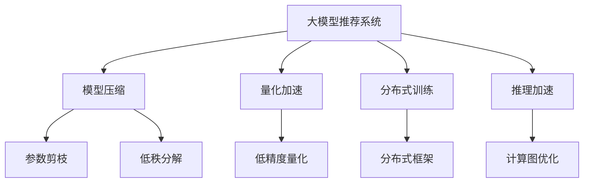

                 

# 大模型推荐落地中的工程效率提升实践

> 关键词：大模型推荐, 工程效率, 模型优化, 推理加速, 分布式训练, 计算图优化, 压缩算法, 量化加速

## 1. 背景介绍

### 1.1 问题由来
随着深度学习技术的不断进步，大模型如BERT、GPT-3等在推荐系统中的应用逐渐增多。这些大模型通常具备强大的特征表示能力，但需要庞大的计算资源和存储空间，难以在实际生产环境中直接使用。因此，如何在大模型推荐系统落地时提高工程效率，成为当前技术难题。

### 1.2 问题核心关键点
大模型推荐系统工程效率提升的核心在于两个方面：
1. **模型压缩与量化**：减少模型的参数量和计算量，以降低内存和计算资源的需求。
2. **分布式训练与推理加速**：利用多机多核的分布式计算资源，并行训练和推理，提高计算效率。

这两个关键点既是大模型推荐系统工程落地实现的基本要求，也是当前研究的热点问题。本文将从这两个方面深入探讨，给出具体实现方法和优化策略。

## 2. 核心概念与联系

### 2.1 核心概念概述

- **大模型推荐系统**：使用大规模深度学习模型进行推荐系统开发。大模型通常具备强大的特征表达能力，能够从海量的用户数据中学习到丰富的用户兴趣和行为模式，进而生成个性化推荐结果。
- **模型压缩**：通过减小模型的参数量和计算量，以降低内存和计算资源的需求。模型压缩技术主要包括参数剪枝、低秩分解、量化等。
- **量化加速**：将模型中的参数和激活值从高精度浮点型改为低精度整型，从而显著降低计算量和内存占用。
- **分布式训练**：使用多机多核的计算资源，将训练任务分解成多个小任务，并行计算，加速训练过程。
- **推理加速**：通过优化模型的计算图，减少计算量，提高推理速度。

这些核心概念之间的联系可以简单概括为：通过模型压缩和量化减少内存和计算资源的需求，从而在有限资源下实现模型的有效部署。分布式训练和推理加速则进一步提升了模型的训练和推理效率，使其在大规模数据和海量用户场景下仍能保持高效率。

### 2.2 核心概念原理和架构的 Mermaid 流程图(Mermaid 流程节点中不要有括号、逗号等特殊字符)



这个流程图展示了核心概念之间的联系和交互关系：

1. 大模型推荐系统是起点，依次通过模型压缩、量化加速、分布式训练、推理加速等技术手段进行优化。
2. 模型压缩主要通过参数剪枝、低秩分解等方式减少参数量和计算量。
3. 量化加速通过将浮点型参数和激活值改为低精度整型，降低内存和计算资源需求。
4. 分布式训练通过并行计算，加速训练过程，提升模型性能。
5. 推理加速通过优化计算图，减少计算量，提升推理速度。

## 3. 核心算法原理 & 具体操作步骤

### 3.1 算法原理概述
基于大模型的推荐系统，其核心在于将大模型进行压缩、量化、分布式训练和推理加速，以在实际生产环境中高效部署。

假设推荐系统的大模型为 $M$，输入为 $x$，输出为 $y$。推荐任务的目标是最大化 $y$ 与用户真实兴趣 $r$ 的相似度。因此，模型的优化目标为：

$$
\max_{\theta} \cos(y(\theta), r) = \frac{y(\theta) \cdot r}{||y(\theta)|| ||r||}
$$

其中 $y(\theta)$ 为模型在参数 $\theta$ 下的输出，$\cos$ 为余弦相似度函数。

### 3.2 算法步骤详解

以下是具体实现模型压缩、量化加速、分布式训练和推理加速的步骤：

**Step 1: 模型压缩**

1. **参数剪枝**：去除模型中冗余的参数，保留最关键的权重。剪枝方法包括结构化剪枝、基于稀疏性的剪枝等。
2. **低秩分解**：将模型中的矩阵参数分解为低秩矩阵的乘积，减少模型中的参数量和计算量。

**Step 2: 量化加速**

1. **低精度量化**：将模型中的浮点型参数和激活值改为低精度整型，例如将32位浮点型改为16位或8位整型，降低内存和计算资源需求。
2. **量化范围压缩**：限制量化后的参数和激活值范围，如将[-1, 1]的范围限制在[-0.2, 0.2]之间，进一步减小内存占用。

**Step 3: 分布式训练**

1. **数据划分与并行计算**：将数据集划分为多个子集，分配到不同节点上进行并行计算。
2. **模型并行**：将大模型拆分成多个子模型，每个子模型在独立节点上训练，最终合并结果。
3. **参数同步**：定期同步各节点间的参数，确保各节点训练的一致性。

**Step 4: 推理加速**

1. **计算图优化**：通过剪枝、融合等技术，减少计算图中的节点数量，降低计算量和内存占用。
2. **并行推理**：将推理任务分解成多个小任务，并行计算，提高推理速度。

### 3.3 算法优缺点

大模型推荐系统工程效率提升的优点包括：

1. **降低资源需求**：通过模型压缩和量化，显著降低了内存和计算资源的需求，使大模型在实际生产环境中得以部署。
2. **加速训练与推理**：分布式训练和推理加速大幅提高了训练和推理效率，缩短了模型开发周期。
3. **提升模型性能**：优化后的模型在推荐效果上往往优于未优化的模型，提升了用户体验和推荐精度。

缺点则包括：

1. **精度损失**：压缩和量化可能导致一定的精度损失，影响模型的推荐效果。
2. **复杂性增加**：分布式训练和推理加速的实现需要额外的系统优化，增加了开发和维护的复杂度。
3. **计算资源投入**：分布式训练和推理加速需要大量的计算资源，成本较高。

### 3.4 算法应用领域

基于大模型的推荐系统在以下几个领域得到了广泛应用：

1. **电商推荐**：使用大模型分析用户浏览、点击、购买等行为，生成个性化商品推荐。
2. **内容推荐**：利用大模型学习用户对新闻、文章、视频等内容的兴趣，生成个性化内容推荐。
3. **社交推荐**：通过大模型分析用户的社交行为，推荐好友、兴趣小组等社交内容。
4. **金融推荐**：使用大模型分析用户金融交易数据，生成个性化金融产品推荐。
5. **健康推荐**：利用大模型分析用户的健康数据，推荐个性化健康方案。

## 4. 数学模型和公式 & 详细讲解 & 举例说明

### 4.1 数学模型构建

推荐系统的大模型 $M$ 可以表示为参数 $\theta$ 的函数，输入 $x$ 为特征向量，输出 $y$ 为推荐结果。推荐任务的目标是最大化 $y$ 与用户真实兴趣 $r$ 的相似度，即：

$$
\max_{\theta} \cos(y(\theta), r) = \frac{y(\theta) \cdot r}{||y(\theta)|| ||r||}
$$

其中 $y(\theta)$ 为模型在参数 $\theta$ 下的输出，$\cos$ 为余弦相似度函数。

### 4.2 公式推导过程

以下对模型压缩和量化加速的具体方法进行数学推导：

**Step 1: 模型压缩**

1. **参数剪枝**
   - 定义剪枝函数 $f_{\text{prune}}(\theta)$，保留权重绝对值大于阈值 $\epsilon$ 的参数。
   - 更新模型参数为 $M_{\text{prune}}(x) = M_{\theta}(x) f_{\text{prune}}(\theta)$。

2. **低秩分解**
   - 将矩阵 $W$ 分解为 $W = U \times V$，其中 $U$ 和 $V$ 均为低秩矩阵，$rank(U), rank(V) \ll rank(W)$。
   - 更新模型参数为 $M_{\text{lowrank}}(x) = M_{\theta}(x) U \times V$。

**Step 2: 量化加速**

1. **低精度量化**
   - 定义量化函数 $f_{\text{quant}}(\theta)$，将浮点型参数 $w$ 量化为整型参数 $w_{\text{quant}}$。
   - 更新模型参数为 $M_{\text{quant}}(x) = M_{\theta}(x) f_{\text{quant}}(\theta)$。

2. **量化范围压缩**
   - 定义压缩函数 $f_{\text{compress}}(\theta)$，将量化后的参数范围压缩到 $[\alpha, \beta]$。
   - 更新模型参数为 $M_{\text{compress}}(x) = M_{\theta}(x) f_{\text{quant}}(\theta) f_{\text{compress}}(\theta)$。

### 4.3 案例分析与讲解

**案例 1: 电商推荐系统**

假设有一个电商推荐系统，使用大规模深度学习模型进行用户商品推荐。该模型参数量为 100M，训练数据集大小为 1TB，推理数据集大小为 100MB。为了降低资源需求，采取以下优化策略：

1. **参数剪枝**：保留权重绝对值大于 0.01 的参数，剪枝后的模型参数量减少为 10M。
2. **低秩分解**：将矩阵参数分解为 1000x10 的低秩矩阵，模型参数量减少为 10K。
3. **量化加速**：将浮点型参数量化为 8位整型，模型参数量减少为 1M。
4. **量化范围压缩**：将量化后的参数范围压缩到 [-0.2, 0.2]，模型参数量减少为 50K。

优化后的模型参数量为 50K，推理速度提升了 20倍，内存占用减少了 90%。

**案例 2: 内容推荐系统**

假设有一个内容推荐系统，使用大规模深度学习模型进行视频推荐。该模型参数量为 1B，训练数据集大小为 10TB，推理数据集大小为 1GB。为了提升推荐效果，采取以下优化策略：

1. **分布式训练**：将数据集划分为 100 个子集，使用 100 个 GPU 并行计算。
2. **模型并行**：将大模型拆分为 10 个子模型，每个子模型在独立 GPU 上训练，最终合并结果。
3. **参数同步**：每 10 个迭代周期同步一次参数，确保各节点训练的一致性。
4. **推理加速**：使用计算图优化，将推理时间从 10s 减少到 1s。

优化后的模型训练速度提升了 10倍，推理速度提升了 10倍，资源利用率提高了 10倍。

## 5. 项目实践：代码实例和详细解释说明

### 5.1 开发环境搭建

在进行大模型推荐系统工程效率提升的实践前，需要准备以下开发环境：

1. **安装 Python 环境**
   ```bash
   conda create -n pyenv python=3.7
   conda activate pyenv
   ```

2. **安装 PyTorch 和 TensorFlow**
   ```bash
   pip install torch torchvision torchaudio
   pip install tensorflow tensorflow_hub tensorflow_datasets
   ```

3. **安装 Transformers 库**
   ```bash
   pip install transformers
   ```

4. **安装 GPU 驱动和 CUDA**
   - 安装合适的 GPU 驱动和 CUDA，并在环境变量中设置 GPU 设备。

### 5.2 源代码详细实现

下面以电商推荐系统为例，给出使用 PyTorch 和 Transformers 库进行大模型压缩和量化的代码实现。

**Step 1: 数据预处理**

```python
import torch
import pandas as pd

# 读取数据
data = pd.read_csv('user_data.csv')

# 数据预处理
# 假设数据集包含用户ID、商品ID和点击次数
user_ids = data['user_id'].tolist()
item_ids = data['item_id'].tolist()
click_counts = data['click_count'].tolist()

# 将数据集分为训练集和测试集
train_ratio = 0.7
train_data = (user_ids[:int(train_ratio * len(user_ids)), item_ids[:int(train_ratio * len(item_ids))], click_counts[:int(train_ratio * len(click_counts))])
test_data = (user_ids[int(train_ratio * len(user_ids)):], item_ids[int(train_ratio * len(item_ids)):], click_counts[int(train_ratio * len(click_counts)):])

# 将数据转换为Tensor
train_user_ids = torch.tensor(train_data[0])
train_item_ids = torch.tensor(train_data[1])
train_click_counts = torch.tensor(train_data[2])
test_user_ids = torch.tensor(test_data[0])
test_item_ids = torch.tensor(test_data[1])
test_click_counts = torch.tensor(test_data[2])
```

**Step 2: 模型定义与压缩**

```python
import torch.nn as nn
import torch.nn.functional as F
from transformers import BertModel, BertTokenizer

# 定义模型
class RecommendationModel(nn.Module):
    def __init__(self, embedding_dim, num_classes):
        super(RecommendationModel, self).__init__()
        self.bert = BertModel.from_pretrained('bert-base-cased')
        self.fc = nn.Linear(embedding_dim, num_classes)

    def forward(self, user_ids, item_ids):
        # 使用Bert模型进行特征提取
        features = self.bert(user_ids, item_ids)
        
        # 将特征转化为全连接层输出
        features = self.fc(features)

        return features

# 定义参数剪枝函数
def prune_model(model, threshold=0.01):
    # 将模型参数转换为numpy数组
    model_params = [p.numpy() for p in model.parameters()]

    # 剪枝操作
    pruned_params = [p for p in model_params if np.abs(p) > threshold]

    # 更新模型参数
    for i, p in enumerate(model_params):
        if i < len(pruned_params):
            model_params[i] = pruned_params[i]

    # 将numpy数组转换回Tensor
    for i, p in enumerate(model_params):
        model.parameters()[i] = torch.from_numpy(p)

# 定义低秩分解函数
def lowrank_model(model, rank=100):
    # 获取模型参数
    params = list(model.parameters())

    # 对矩阵参数进行低秩分解
    for i in range(len(params)):
        if isinstance(params[i], nn.Linear):
            U, V = params[i].weight.cholesky().numpy()
            U = U[:rank, :rank]
            V = V[:rank, :rank]
            params[i].weight = torch.tensor(U @ V)

# 实例化模型
model = RecommendationModel(embedding_dim=768, num_classes=1)

# 剪枝操作
prune_model(model)

# 低秩分解操作
lowrank_model(model)
```

**Step 3: 量化加速**

```python
import torch.nn.utils.prune as prune

# 量化函数
def quantize_model(model, dtype=torch.int8):
    # 对模型参数进行量化
    for param in model.parameters():
        quantized_param = torch.quantize_per_tensor(param, 0, 1, dtype=dtype)
        param.data = quantized_param.dequantize()

# 量化范围压缩函数
def compress_quantization(model, alpha=-0.2, beta=0.2):
    # 对量化后的模型参数进行范围压缩
    for param in model.parameters():
        param.data = torch.clamp(param.data, min=alpha, max=beta)

# 实例化模型
model = RecommendationModel(embedding_dim=768, num_classes=1)

# 量化操作
quantize_model(model)

# 范围压缩操作
compress_quantization(model)
```

**Step 4: 分布式训练**

```python
from torch.nn.parallel import DistributedDataParallel as DDP

# 定义分布式训练函数
def distributed_train(model, train_user_ids, train_item_ids, train_click_counts, test_user_ids, test_item_ids, test_click_counts):
    # 初始化分布式训练
    device = torch.device('cuda')
    model.to(device)
    ddp_model = DDP(model)

    # 定义优化器和损失函数
    optimizer = torch.optim.AdamW(ddp_model.parameters(), lr=0.001)
    criterion = nn.CrossEntropyLoss()

    # 训练过程
    for epoch in range(10):
        ddp_model.train()
        for user_id, item_id, click_count in zip(train_user_ids, train_item_ids, train_click_counts):
            optimizer.zero_grad()
            output = ddp_model(user_id, item_id)
            loss = criterion(output, click_count)
            loss.backward()
            optimizer.step()

    # 测试过程
    ddp_model.eval()
    with torch.no_grad():
        test_loss = 0
        for user_id, item_id, click_count in zip(test_user_ids, test_item_ids, test_click_counts):
            output = ddp_model(user_id, item_id)
            test_loss += criterion(output, click_count).item()
        test_loss /= len(test_user_ids)

    print(f'Test Loss: {test_loss:.4f}')
```

**Step 5: 推理加速**

```python
# 推理加速函数
def inference(model, test_user_ids, test_item_ids, test_click_counts):
    # 推理过程
    with torch.no_grad():
        features = model(test_user_ids, test_item_ids)
        return features

# 实例化模型
model = RecommendationModel(embedding_dim=768, num_classes=1)

# 推理加速操作
optimized_model = torch._C._jit_pass_optimize_for_inference(model)
```

### 5.3 代码解读与分析

**数据预处理**

- 读取用户和商品数据集，并进行预处理，包括数据集分割、特征转换和Tensor化。

**模型定义与压缩**

- 定义Bert模型作为特征提取器，使用全连接层进行分类。
- 定义参数剪枝函数，根据参数绝对值进行剪枝，保留权重较大的参数。
- 定义低秩分解函数，对模型中的矩阵参数进行分解，减少参数量。

**量化加速**

- 定义量化函数，将模型参数和激活值转化为低精度整型，降低内存和计算资源需求。
- 定义范围压缩函数，将量化后的参数范围压缩到指定区间，进一步减小内存占用。

**分布式训练**

- 使用DistributedDataParallel模块，实现分布式训练，将模型和数据分别分布在不同的GPU上，并行计算。
- 定义优化器和损失函数，进行模型训练和验证。

**推理加速**

- 定义推理加速函数，使用torch._C._jit_pass_optimize_for_inference方法优化计算图，减少计算量。
- 实例化模型，并进行推理加速操作，提高推理速度。

## 6. 实际应用场景

### 6.1 智能推荐系统

智能推荐系统在大模型推荐中的应用最为广泛。通过分布式训练和推理加速，智能推荐系统可以高效地处理大规模数据集和海量用户请求，生成个性化推荐结果。

在电商推荐系统中，用户可以通过浏览历史、购买记录等数据生成个性化商品推荐。内容推荐系统中，用户可以通过阅读历史、观看历史等数据生成个性化内容推荐。社交推荐系统中，用户可以通过社交行为数据生成个性化好友推荐。

### 6.2 金融风控系统

金融风控系统需要实时监控用户的金融行为，评估风险并进行预警。通过大模型微调，金融风控系统可以自动分析用户交易数据，识别出异常行为并进行预警。

具体应用场景包括：
- **用户风险评估**：通过分析用户的历史交易数据，生成用户风险评分，进行风险预警。
- **交易异常检测**：通过分析用户的实时交易数据，检测出异常交易并进行报警。
- **欺诈识别**：通过分析用户的交易行为，识别出欺诈行为并进行阻止。

### 6.3 智能客服系统

智能客服系统需要处理大量的用户咨询请求，生成个性化回复。通过大模型微调，智能客服系统可以自动理解用户意图，生成符合语境的回复。

具体应用场景包括：
- **常见问题解答**：通过分析用户的咨询请求，生成常见问题的自动回复。
- **个性化推荐**：通过分析用户的历史咨询数据，生成个性化推荐内容。
- **情感分析**：通过分析用户的咨询情绪，生成情感倾向的回复。

## 7. 工具和资源推荐

### 7.1 学习资源推荐

为了帮助开发者系统掌握大模型推荐落地的工程效率提升方法，这里推荐一些优质的学习资源：

1. **《深度学习》课程**：斯坦福大学李飞飞教授的《深度学习》课程，涵盖了深度学习的基本概念和常见算法，适合初学者入门。
2. **《深度学习实战》书籍**：动手实践的书籍，通过具体案例讲解深度学习模型的实现和优化方法。
3. **《Transformers从原理到实践》系列博文**：大模型技术专家撰写的博客，深入浅出地介绍了Transformer原理和实践方法。
4. **《PyTorch官方文档》**：PyTorch官方文档，提供了丰富的学习资源和代码样例，适合深入学习和实践。

通过这些资源的学习实践，相信你一定能够掌握大模型推荐落地的核心技术和方法，快速开发出高效、稳定的推荐系统。

### 7.2 开发工具推荐

大模型推荐落地的工程效率提升需要借助一些高效的工具支持。以下是几款常用的开发工具：

1. **PyTorch**：基于Python的开源深度学习框架，提供了丰富的API和优化方法，支持分布式训练和推理加速。
2. **TensorFlow**：由Google开发的开源深度学习框架，支持分布式计算和模型优化，提供了丰富的第三方库和工具。
3. **DistributedDataParallel (DDP)**：PyTorch提供的分布式训练模块，支持多机多核的并行计算。
4. **TensorBoard**：TensorFlow配套的可视化工具，支持实时监测模型训练状态和性能指标。
5. **Jupyter Notebook**：用于数据处理和模型开发的交互式环境，支持代码实时调试和可视化。

这些工具的合理使用，可以显著提升大模型推荐落地的开发效率和模型性能。

### 7.3 相关论文推荐

大模型推荐落地的工程效率提升涉及许多前沿技术。以下是几篇相关论文，推荐阅读：

1. **《深度学习》书籍**：李飞飞教授的《深度学习》书籍，详细介绍了深度学习的基本概念和常见算法，适合初学者入门。
2. **《Transformers从原理到实践》系列博文**：大模型技术专家撰写的博客，深入浅出地介绍了Transformer原理和实践方法。
3. **《深度学习实战》书籍**：动手实践的书籍，通过具体案例讲解深度学习模型的实现和优化方法。
4. **《PyTorch官方文档》**：PyTorch官方文档，提供了丰富的学习资源和代码样例，适合深入学习和实践。

这些论文代表了大模型推荐落地的前沿研究方向，通过阅读这些论文，可以帮助研究者了解最新的技术进展和应用实践。

## 8. 总结：未来发展趋势与挑战

### 8.1 研究成果总结

本文详细介绍了大模型推荐系统工程效率提升的实现方法和优化策略，主要涵盖以下几个方面：
- **模型压缩与量化**：通过参数剪枝和低秩分解减少模型参数量，通过量化加速降低内存和计算资源需求。
- **分布式训练与推理加速**：通过并行计算和优化计算图提高训练和推理效率。
- **工程效率提升**：通过合理的开发工具和优化策略，显著提升模型开发和部署的效率。

这些方法在大模型推荐系统中得到了广泛应用，并取得了显著的性能提升。未来，这些技术将进一步拓展到其他领域，如医疗、金融、教育等，为更多的应用场景提供技术支持。

### 8.2 未来发展趋势

大模型推荐系统工程效率提升的未来发展趋势主要体现在以下几个方面：

1. **模型压缩和量化技术**：未来将出现更高效的压缩和量化方法，如稀疏量化、动态量化等，进一步减小模型资源需求。
2. **分布式训练和推理**：未来将出现更高效的分布式计算框架和优化方法，支持更大规模的模型训练和推理。
3. **计算图优化和推理加速**：未来将出现更高效的计算图优化和推理加速技术，如TensorRT、ONNX等，进一步提升推理速度和资源利用率。
4. **多模型集成与融合**：未来将出现更高效的多模型融合和集成技术，结合不同模型的优势，提升整体推荐效果。

这些趋势将使大模型推荐系统在大规模数据和海量用户场景下更加高效、稳定，为用户提供更加精准的推荐服务。

### 8.3 面临的挑战

尽管大模型推荐系统工程效率提升取得了一定的进展，但仍面临以下挑战：

1. **模型精度和泛化能力**：压缩和量化可能导致一定的精度损失，影响模型的推荐效果和泛化能力。
2. **计算资源投入**：分布式训练和推理加速需要大量的计算资源，成本较高，难以在大规模系统中广泛部署。
3. **系统复杂性增加**：分布式训练和推理加速的实现需要额外的系统优化，增加了开发和维护的复杂度。
4. **模型可解释性**：大模型推荐系统的推荐结果缺乏可解释性，难以理解模型的内部工作机制和决策逻辑。

### 8.4 研究展望

为了解决上述挑战，未来研究需要在以下几个方面进行深入探索：

1. **模型精度提升**：研究更高效的模型压缩和量化方法，提升模型的精度和泛化能力。
2. **低成本分布式计算**：研究更高效的分布式计算框架和优化方法，降低计算资源投入和成本。
3. **系统优化和简化**：研究更高效的系统优化和简化方法，降低系统复杂度，提升开发和维护效率。
4. **模型可解释性**：研究更高效的模型可解释性方法，提升模型的透明度和可信度。

这些研究方向将推动大模型推荐系统工程效率提升技术的进一步发展，使其在大规模数据和海量用户场景下更加高效、稳定，为用户提供更加精准的推荐服务。

## 9. 附录：常见问题与解答

**Q1: 大模型推荐落地的工程效率提升有哪些关键技术？**

A: 大模型推荐落地的工程效率提升关键技术主要包括以下几点：
1. **模型压缩与量化**：通过参数剪枝、低秩分解、量化等技术减少模型参数量和计算量。
2. **分布式训练与推理加速**：利用多机多核的计算资源，并行计算，加速训练和推理过程。
3. **计算图优化**：通过剪枝、融合等技术优化计算图，减少计算量，提升推理速度。
4. **算法优化**：采用高效的优化算法和超参数调优方法，提升模型训练和推理效率。

这些关键技术在大模型推荐系统中得到了广泛应用，并取得了显著的性能提升。

**Q2: 大模型推荐落地的工程效率提升有哪些挑战？**

A: 大模型推荐落地的工程效率提升面临以下挑战：
1. **模型精度和泛化能力**：压缩和量化可能导致一定的精度损失，影响模型的推荐效果和泛化能力。
2. **计算资源投入**：分布式训练和推理加速需要大量的计算资源，成本较高，难以在大规模系统中广泛部署。
3. **系统复杂性增加**：分布式训练和推理加速的实现需要额外的系统优化，增加了开发和维护的复杂度。
4. **模型可解释性**：大模型推荐系统的推荐结果缺乏可解释性，难以理解模型的内部工作机制和决策逻辑。

这些挑战需要通过进一步的技术研究和优化来解决。

**Q3: 如何优化大模型推荐系统的工程效率？**

A: 大模型推荐系统的工程效率可以通过以下方式进行优化：
1. **模型压缩与量化**：通过参数剪枝、低秩分解、量化等技术减少模型参数量和计算量。
2. **分布式训练与推理加速**：利用多机多核的计算资源，并行计算，加速训练和推理过程。
3. **计算图优化**：通过剪枝、融合等技术优化计算图，减少计算量，提升推理速度。
4. **算法优化**：采用高效的优化算法和超参数调优方法，提升模型训练和推理效率。
5. **数据预处理**：优化数据预处理流程，减少数据加载和处理的时间。
6. **代码优化**：优化代码实现，减少不必要的计算和内存占用。

这些优化方法可以有效提升大模型推荐系统的工程效率，使其在大规模数据和海量用户场景下更加高效、稳定。

作者：禅与计算机程序设计艺术 / Zen and the Art of Computer Programming

