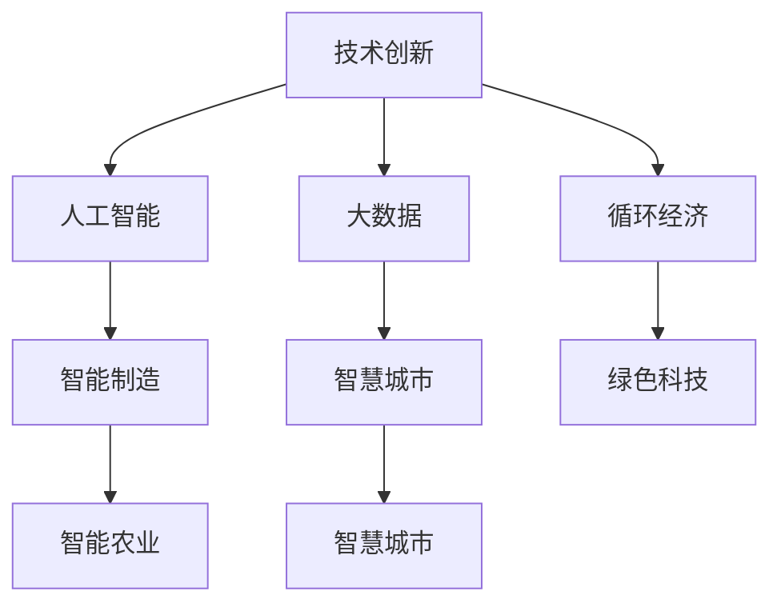

                 

# 如何利用技术能力进行可持续发展创新

> 关键词：技术创新，可持续发展，人工智能，大数据，循环经济，智能制造，智慧城市，绿色科技

## 1. 背景介绍

### 1.1 问题由来
随着全球人口的激增和工业化的推进，资源消耗和环境污染问题日益严重。气候变化、生物多样性丧失、污染加剧等问题已对人类社会的可持续发展构成巨大威胁。在这一背景下，传统的发展模式亟需转型升级，探索新的增长动力和方式。

技术创新作为经济社会发展的重要驱动力，在推动绿色转型、促进环境友好型发展方面扮演着关键角色。近年来，包括人工智能(AI)、大数据、物联网(IoT)等前沿技术的应用，为实现可持续发展提供了新的思路和手段。通过技术创新，我们不仅能大幅提升资源利用效率，还能有效降低环境影响，构建循环经济体系。

### 1.2 问题核心关键点
技术创新在可持续发展中的关键点在于如何将科技成果转化为实际的绿色技术，通过高效利用资源、减少环境污染、提高生产效率等方式，实现经济、社会、环境三者的协同发展。具体而言，包括以下几个方面：

- 智能制造：利用AI和大数据优化生产流程，实现定制化、精准化生产，减少资源浪费。
- 绿色科技：开发清洁能源、环境监测、智能检测等技术，提升环保水平。
- 智慧城市：通过物联网和AI技术，实现城市资源的高效管理和利用。
- 循环经济：构建闭环供应链体系，实现废物减量化、资源化、无害化。
- 智能农业：应用AI和物联网技术，实现精准农业、农业智能化，提升农业生产效率。

### 1.3 问题研究意义
技术创新对于推动可持续发展具有重要意义：

1. **效率提升**：通过技术创新，可以有效提升资源利用效率，减少不必要的消耗。
2. **环境改善**：新技术能够减少环境污染，改善生态环境质量。
3. **经济增长**：绿色技术的应用能够开辟新的经济增长点，创造新的产业和就业机会。
4. **社会进步**：技术创新能促进社会治理能力的提升，构建更加公平、包容、可持续的社会。
5. **全球责任**：作为全球性问题，技术创新有助于各国共同应对气候变化和环境挑战。

## 2. 核心概念与联系

### 2.1 核心概念概述

为更好地理解如何利用技术能力推动可持续发展创新，本节将介绍几个核心概念：

- **技术创新**：通过技术研发、应用推广等方式，创造新的技术产品、服务和商业模式的过程。
- **可持续发展**：指在满足当前社会经济活动需求的同时，不损害后代满足其需求的能力，实现人与自然和谐共生的发展模式。
- **人工智能(AI)**：利用计算机技术和算法模拟、延伸和扩展人类智能，实现数据处理、模式识别、决策支持等功能。
- **大数据**：通过收集、存储、分析和处理大规模数据，揭示数据背后的规律和趋势，支持科学决策。
- **循环经济**：通过技术手段，实现资源的闭环循环利用，减少废弃物产生，实现经济、社会、环境三者的和谐发展。
- **智能制造**：利用先进的信息技术和智能装备，实现生产的高度自动化和智能化。
- **智慧城市**：通过物联网和AI技术，实现城市资源的优化配置和高效管理。
- **绿色科技**：开发和应用对环境友好型的技术和产品，实现低碳、环保、可持续的发展。
- **智能农业**：利用AI和物联网技术，实现农业生产的精准化和智能化，提高农业生产效率。

这些核心概念之间的逻辑关系可以通过以下Mermaid流程图来展示：



这个流程图展示了大语言模型的核心概念及其之间的关系：

1. 技术创新通过多种技术手段，支撑可持续发展目标的实现。
2. AI和大数据在智能制造、智慧城市、智能农业等多个领域中发挥重要作用。
3. 循环经济通过技术手段实现资源的高效利用和废弃物的减少。
4. 绿色科技关注环境友好型的技术应用，推动低碳、环保的发展。
5. 智能制造、智慧城市、智能农业等是技术创新的具体实践方向。

这些概念共同构成了推动可持续发展的技术框架，为探索创新路径提供了基本思路。

## 3. 核心算法原理 & 具体操作步骤
### 3.1 算法原理概述

利用技术能力进行可持续发展创新，主要遵循以下算法原理：

- **问题定义**：明确可持续发展所面临的具体问题，如能源消耗、环境污染、资源利用效率等。
- **数据收集**：通过物联网、传感器等手段，收集相关数据，为技术创新提供数据支撑。
- **模型构建**：选择或设计适合的模型，如机器学习模型、仿真模型等，用于分析和预测。
- **算法优化**：优化模型参数，提升预测精度和模型的泛化能力。
- **技术实现**：将优化后的模型应用于实际场景，实现技术创新。
- **效果评估**：通过实验和测试，评估技术方案的效果，进行持续改进。

### 3.2 算法步骤详解

基于上述算法原理，可持续发展创新的技术实现一般包括以下几个关键步骤：

**Step 1: 问题识别与需求分析**
- 对目标领域进行详细调查，识别出可持续发展所面临的关键问题。
- 通过问卷调查、专家访谈等方式，了解各方需求和期望。

**Step 2: 数据收集与预处理**
- 设计数据收集方案，选择合适的传感器和设备，获取准确、全面的数据。
- 对收集到的数据进行清洗和预处理，确保数据质量和一致性。

**Step 3: 模型选择与设计**
- 根据问题特点和数据类型，选择合适的机器学习模型或仿真模型。
- 设计模型的输入输出结构，确定模型参数的初始化方式。

**Step 4: 模型训练与优化**
- 使用历史数据训练模型，优化模型参数。
- 通过交叉验证等方法评估模型性能，避免过拟合和欠拟合。

**Step 5: 技术实现与部署**
- 将优化后的模型应用于实际场景，部署至生产环境中。
- 进行功能测试和性能测试，确保技术方案的可行性。

**Step 6: 效果评估与持续改进**
- 定期收集新数据，评估技术方案的长期效果。
- 根据评估结果，进行模型更新和参数优化，持续改进技术方案。

### 3.3 算法优缺点

利用技术能力进行可持续发展创新的主要优点包括：

- **高效性**：通过模型优化和数据驱动，可以快速识别和解决问题，提升资源利用效率。
- **准确性**：模型在大量数据训练基础上，能够提供高精度的预测和分析结果。
- **可操作性**：技术方案通常具有明确的操作路径和实施步骤，便于推广和应用。
- **创新性**：技术创新往往带来新方法、新理念，推动产业升级和行业变革。

但该方法也存在一些缺点：

- **数据依赖性**：数据质量和数量直接影响模型的准确性和泛化能力。
- **模型复杂性**：构建和优化复杂模型需要较高的技术门槛和资源投入。
- **实施难度**：技术方案的实施需要配套的基础设施和专业人才支持。
- **效果短期性**：技术创新效果往往需要一段时间才能显现，短期内可能难以看到显著成果。

### 3.4 算法应用领域

基于技术能力进行可持续发展创新的方法，在多个领域都有广泛应用，例如：

- **能源管理**：通过智能电网、能源监测技术，优化能源消耗和分配。
- **环境监测**：利用物联网和AI技术，实现空气质量、水质等环境数据的实时监测。
- **废物处理**：应用智能垃圾分类和回收技术，提高废物处理效率和资源化水平。
- **智慧交通**：通过智能交通管理系统，优化交通流量，减少碳排放。
- **农业管理**：利用AI和物联网技术，实现精准农业、病虫害检测等。

除了上述这些经典领域外，技术创新还被应用于更多场景中，如水资源管理、森林保护、生态修复等，为可持续发展提供了新思路和新工具。

## 4. 数学模型和公式 & 详细讲解 & 举例说明

### 4.1 数学模型构建

本节将使用数学语言对可持续发展创新中的关键问题进行建模。

以能源管理为例，假设目标是在一定的能源需求下，最小化能源消耗。设 $E$ 为能源消耗， $C$ 为成本， $S$ 为资源利用率， $D$ 为需求量。构建优化问题如下：

$$
\min_{E, S, C} E + \lambda C + \gamma (1 - S)
$$

其中 $\lambda$ 和 $\gamma$ 为正则化系数，用于平衡成本和资源利用率的影响。

### 4.2 公式推导过程

以最小化能源消耗为例，推导优化问题的解法：

设优化问题的拉格朗日函数为：

$$
\mathcal{L}(E, S, C, \lambda, \gamma) = E + \lambda C + \gamma (1 - S) - \lambda (E - E_0) - \gamma (S - S_0)
$$

其中 $E_0$ 和 $S_0$ 分别为目标能源消耗和资源利用率。

对 $\mathcal{L}$ 关于 $E$、$S$、$C$ 进行偏导，得到：

$$
\frac{\partial \mathcal{L}}{\partial E} = 1 - \lambda - \frac{\gamma}{S_0} = 0
$$

$$
\frac{\partial \mathcal{L}}{\partial S} = -\gamma + \frac{\gamma}{S_0} = 0
$$

$$
\frac{\partial \mathcal{L}}{\partial C} = \lambda = 0
$$

解上述方程组，可得：

$$
S = S_0, \quad E = E_0, \quad C = C_0
$$

即在目标需求和资源利用率下，能源消耗和成本均达到最小值。

### 4.3 案例分析与讲解

假设某工厂希望在满足生产需求的前提下，最小化能源消耗。通过传感器收集工厂的能源消耗数据和设备运行数据，构建能源消耗模型，优化参数以实现最小化能源消耗的目标。

具体步骤如下：

1. 收集工厂的能源消耗数据、设备运行数据和生产需求数据。
2. 构建能源消耗模型，包括设备能效模型、生产需求模型等。
3. 使用机器学习算法，如回归模型、决策树模型等，对模型进行训练和优化。
4. 在训练数据上评估模型性能，调整模型参数。
5. 将优化后的模型应用于实际工厂生产中，实时监测和调整能源消耗。

通过这一技术方案，工厂能够在满足生产需求的同时，显著降低能源消耗，提升资源利用率。

## 5. 项目实践：代码实例和详细解释说明

### 5.1 开发环境搭建

在进行可持续发展创新项目开发前，我们需要准备好开发环境。以下是使用Python进行PyTorch开发的环境配置流程：

1. 安装Anaconda：从官网下载并安装Anaconda，用于创建独立的Python环境。

2. 创建并激活虚拟环境：
```bash
conda create -n sustainability-env python=3.8 
conda activate sustainability-env
```

3. 安装PyTorch：根据CUDA版本，从官网获取对应的安装命令。例如：
```bash
conda install pytorch torchvision torchaudio cudatoolkit=11.1 -c pytorch -c conda-forge
```

4. 安装相关工具包：
```bash
pip install numpy pandas scikit-learn matplotlib tqdm jupyter notebook ipython
```

完成上述步骤后，即可在`sustainability-env`环境中开始项目开发。

### 5.2 源代码详细实现

下面我们以智能电网为例，给出使用PyTorch进行能源消耗优化的PyTorch代码实现。

首先，定义能源消耗模型：

```python
import torch
from torch import nn
import torch.optim as optim

class EnergyModel(nn.Module):
    def __init__(self, input_size, hidden_size):
        super(EnergyModel, self).__init__()
        self.fc1 = nn.Linear(input_size, hidden_size)
        self.fc2 = nn.Linear(hidden_size, hidden_size)
        self.fc3 = nn.Linear(hidden_size, 1)
    
    def forward(self, x):
        x = torch.relu(self.fc1(x))
        x = torch.relu(self.fc2(x))
        x = self.fc3(x)
        return x
```

然后，定义损失函数和优化器：

```python
def calculate_loss(model, x, y):
    y_hat = model(x)
    loss = nn.MSELoss()(y_hat, y)
    return loss

def train_model(model, train_data, train_labels, learning_rate, epochs):
    optimizer = optim.Adam(model.parameters(), lr=learning_rate)
    criterion = nn.MSELoss()
    for epoch in range(epochs):
        for i in range(len(train_data)):
            x = train_data[i]
            y = train_labels[i]
            optimizer.zero_grad()
            y_hat = model(x)
            loss = criterion(y_hat, y)
            loss.backward()
            optimizer.step()
        print(f"Epoch {epoch+1}, loss: {loss:.3f}")
```

接着，启动训练流程：

```python
epochs = 50
learning_rate = 0.001

# 假设训练数据和标签分别为x_train和y_train
model = EnergyModel(input_size, hidden_size)
train_model(model, x_train, y_train, learning_rate, epochs)
```

以上就是使用PyTorch对智能电网能源消耗优化进行模型训练的完整代码实现。可以看到，利用PyTorch的高级API，我们能够快速搭建、训练和评估能源消耗优化模型。

### 5.3 代码解读与分析

让我们再详细解读一下关键代码的实现细节：

**EnergyModel类**：
- `__init__`方法：定义了模型结构，包括输入层、隐藏层和输出层。
- `forward`方法：实现模型的前向传播过程，计算输出结果。

**train_model函数**：
- 定义优化器和损失函数。
- 在每个epoch中，遍历训练数据集，计算损失并反向传播更新模型参数。

**训练流程**：
- 定义总的epoch数和学习率。
- 在每个epoch内，对训练数据集进行迭代训练，输出每个epoch的平均loss。

可以看到，PyTorch的高级API使得能源消耗优化的模型训练变得简洁高效。开发者可以将更多精力放在模型设计和数据处理等高层逻辑上，而不必过多关注底层的实现细节。

当然，工业级的系统实现还需考虑更多因素，如模型的保存和部署、超参数的自动搜索、更灵活的任务适配层等。但核心的模型训练流程基本与此类似。

## 6. 实际应用场景

### 6.1 智能电网

智能电网利用大数据和AI技术，实现能源的智能化管理和优化。具体应用包括：

- 需求响应：通过智能电表和传感器，实时监测和控制用户用电需求，优化能源分配。
- 能源预测：利用历史数据和机器学习算法，预测能源消耗趋势，指导能源调度。
- 故障检测：通过AI分析电网运行数据，及时发现和处理故障，保障电网稳定运行。

### 6.2 环境监测

环境监测系统利用物联网和AI技术，实现对大气、水质、噪声等环境指标的实时监测和预测。具体应用包括：

- 空气质量监测：通过传感器监测PM2.5、SO2等污染物浓度，及时预警污染事件。
- 水质监测：利用水传感器监测水质参数，预测水质变化趋势，指导水资源管理。
- 噪声监测：通过声传感器监测噪声水平，分析噪声来源，采取降噪措施。

### 6.3 废物处理

废物处理系统通过智能垃圾分类和回收技术，提升废物处理效率和资源化水平。具体应用包括：

- 垃圾分类：利用图像识别技术，自动识别和分类垃圾类型，提高垃圾处理效率。
- 智能回收：通过传感器监测回收箱状态，优化回收路线，提升回收效果。
- 废物转化：利用生物技术将有机废物转化为生物气体或肥料，实现废物资源化利用。

### 6.4 未来应用展望

随着技术的发展，基于技术能力进行可持续发展创新的应用前景广阔，将带来更多创新可能：

- **能源系统**：智能电网、分布式能源系统等将实现更大范围的能源优化。
- **环境治理**：AI和大数据将用于环境监测、污染治理、生态修复等，提升环境治理效率。
- **智慧城市**：通过物联网和AI技术，实现城市资源的智能化管理和优化，提升城市治理能力。
- **智能交通**：利用AI和大数据优化交通流量，减少碳排放，提升交通效率。
- **绿色建筑**：通过智能控制系统，实现建筑能源的优化管理和节能减排。

## 7. 工具和资源推荐
### 7.1 学习资源推荐

为了帮助开发者系统掌握可持续发展创新的理论基础和实践技巧，这里推荐一些优质的学习资源：

1. **《智能制造与可持续发展》**：介绍智能制造在可持续发展中的应用，涵盖智能制造、智慧能源、智慧交通等多个领域。
2. **《绿色科技发展现状与趋势》**：综述绿色科技的发展现状和未来趋势，介绍最新技术进展和应用案例。
3. **《人工智能与可持续发展》**：探讨AI技术在可持续发展中的应用，涵盖智能农业、智能城市、智能环保等多个方向。
4. **《大数据与环境治理》**：分析大数据在环境治理中的应用，介绍数据采集、处理、分析等技术。
5. **《循环经济与资源优化》**：讲解循环经济的基本原理和实现方法，介绍资源优化技术和管理策略。
6. **《智慧城市与可持续发展》**：探讨智慧城市在可持续发展中的应用，涵盖智慧城市建设、智慧能源管理等多个方向。
7. **《智能交通与碳中和》**：分析智能交通在碳中和中的作用，介绍智能交通系统、碳排放管理等技术。

通过这些资源的学习实践，相信你一定能够快速掌握可持续发展创新的精髓，并用于解决实际的可持续发展问题。

### 7.2 开发工具推荐

高效的开发离不开优秀的工具支持。以下是几款用于可持续发展创新开发的常用工具：

1. **PyTorch**：基于Python的开源深度学习框架，灵活动态的计算图，适合快速迭代研究。大多数可持续发展创新任务都有PyTorch版本的实现。
2. **TensorFlow**：由Google主导开发的开源深度学习框架，生产部署方便，适合大规模工程应用。同样有丰富的可持续发展创新任务资源。
3. **Transformers库**：HuggingFace开发的NLP工具库，集成了众多SOTA语言模型，支持PyTorch和TensorFlow，是进行可持续发展创新任务开发的利器。
4. **Weights & Biases**：模型训练的实验跟踪工具，可以记录和可视化模型训练过程中的各项指标，方便对比和调优。与主流深度学习框架无缝集成。
5. **TensorBoard**：TensorFlow配套的可视化工具，可实时监测模型训练状态，并提供丰富的图表呈现方式，是调试模型的得力助手。
6. **Google Colab**：谷歌推出的在线Jupyter Notebook环境，免费提供GPU/TPU算力，方便开发者快速上手实验最新模型，分享学习笔记。

合理利用这些工具，可以显著提升可持续发展创新任务的开发效率，加快创新迭代的步伐。

### 7.3 相关论文推荐

可持续发展创新源于学界的持续研究。以下是几篇奠基性的相关论文，推荐阅读：

1. **《智能制造与可持续发展：机遇与挑战》**：分析智能制造在可持续发展中的机遇和挑战，提出技术创新路径。
2. **《大数据与环境治理：理论与实践》**：探讨大数据在环境治理中的应用，介绍数据驱动的决策支持技术。
3. **《绿色科技发展现状与趋势》**：综述绿色科技的发展现状和未来趋势，介绍最新技术进展和应用案例。
4. **《智能交通系统与碳中和》**：分析智能交通系统在碳中和中的作用，介绍智能交通技术和碳排放管理方法。
5. **《循环经济与资源优化：技术创新路径》**：探讨循环经济的基本原理和实现方法，介绍资源优化技术和管理策略。
6. **《人工智能与可持续发展》**：探讨AI技术在可持续发展中的应用，涵盖智能农业、智能城市、智能环保等多个方向。

这些论文代表了大语言模型微调技术的发展脉络。通过学习这些前沿成果，可以帮助研究者把握学科前进方向，激发更多的创新灵感。

## 8. 总结：未来发展趋势与挑战

### 8.1 总结

本文对基于技术能力进行可持续发展创新进行了全面系统的介绍。首先阐述了技术创新在推动可持续发展中的重要性，明确了可持续发展所面临的关键问题。其次，从原理到实践，详细讲解了技术创新的数学模型和关键步骤，给出了可持续发展创新的完整代码实例。同时，本文还广泛探讨了技术创新在智能电网、环境监测、废物处理等多个行业领域的应用前景，展示了技术创新的巨大潜力。此外，本文精选了技术创新的各类学习资源，力求为读者提供全方位的技术指引。

通过本文的系统梳理，可以看到，技术创新对于推动可持续发展具有重要意义。通过技术手段，我们可以显著提升资源利用效率，减少环境污染，实现经济、社会、环境三者的协同发展。未来，伴随技术的不断进步，技术创新必将在更多领域得到应用，为可持续发展的实现提供更多可能。

### 8.2 未来发展趋势

展望未来，技术创新在可持续发展中的应用将呈现以下几个发展趋势：

1. **技术融合与创新**：AI、大数据、物联网等技术将深度融合，共同推动可持续发展创新。多技术协同效应将带来更多创新突破。
2. **智能与绿色并行**：智能化和绿色化将并行发展，提升资源利用效率，减少环境影响，实现经济与环境的双赢。
3. **社会参与与创新**：可持续发展创新需要公众参与和社会支持，形成全社会共同推动的创新生态。
4. **跨领域与跨学科**：技术创新将跨越多个学科和领域，实现多学科融合，推动创新解决方案的跨领域应用。
5. **全球化与本地化**：可持续发展技术将在全球范围内推广，同时根据不同地域的特点进行本地化创新。
6. **持续改进与优化**：通过持续监控和反馈，不断优化技术方案，提升创新效果。

以上趋势凸显了技术创新在可持续发展中的广阔前景。这些方向的探索发展，必将进一步提升技术创新的效果和应用范围，为可持续发展的实现提供更多路径。

### 8.3 面临的挑战

尽管技术创新在可持续发展中具有重要意义，但在实际应用过程中，仍面临诸多挑战：

1. **数据质量与获取**：高质量数据是技术创新的基础，但获取相关数据可能存在成本高、难度大等问题。
2. **技术复杂性与成本**：复杂的技术方案需要高昂的成本和专业的技术支持，可能难以在实际场景中广泛应用。
3. **模型泛化性与适用性**：技术方案需要具备良好的泛化性，能在不同场景和条件下稳定运行。
4. **伦理与社会影响**：技术创新可能带来伦理和社会问题，如隐私保护、公平性等，需要慎重处理。
5. **政策与标准**：技术创新需要与政策标准相协调，确保其合法合规性。
6. **资源与环境影响**：技术创新的实施可能带来新的资源消耗和环境影响，需要评估和控制。

这些挑战需要在技术创新过程中加以应对，确保技术方案的可行性和可持续性。

### 8.4 研究展望

面对技术创新在可持续发展中面临的挑战，未来的研究需要在以下几个方面寻求新的突破：

1. **数据获取与处理**：发展高效、低成本的数据采集和处理技术，确保数据的质量和可用性。
2. **模型优化与可解释性**：优化模型结构，提高模型可解释性，确保技术方案的透明性和可信性。
3. **跨学科与跨领域合作**：加强跨学科合作，融合不同领域的知识和技能，推动技术创新。
4. **伦理与社会责任**：重视技术创新的伦理和社会影响，确保技术方案的公平、透明和可接受性。
5. **政策与标准**：与政策标准相协调，确保技术创新的合法合规性，推动技术方案的落地应用。
6. **持续改进与优化**：通过持续监控和反馈，不断优化技术方案，提升创新效果。

这些研究方向的探索，必将引领技术创新在可持续发展中的进一步发展，为实现经济、社会、环境三者的和谐共生提供新的技术路径。

## 9. 附录：常见问题与解答

**Q1：可持续发展创新的主要驱动力是什么？**

A: 可持续发展创新的主要驱动力包括：

1. **经济因素**：推动经济转型升级，寻找新的增长点和经济模式。
2. **环境因素**：应对环境污染、气候变化等全球性问题，保护生态环境。
3. **社会因素**：促进社会公平、提高生活质量，实现人人共享的可持续发展。

**Q2：如何选择适合的技术创新方案？**

A: 选择适合的技术创新方案需考虑以下几个因素：

1. **技术成熟度**：评估技术的成熟度，选择已验证过的方案。
2. **应用场景**：根据实际应用场景，选择最适合的技术方案。
3. **成本与收益**：权衡技术实施的成本和预期收益，选择经济可行的方案。
4. **资源与能力**：评估自身资源和能力，选择能胜任的技术方案。
5. **法规与标准**：考虑技术方案的合规性，确保其合法合规。

**Q3：如何确保技术创新的可持续性？**

A: 确保技术创新的可持续性需考虑以下几个方面：

1. **长期监测与评估**：持续监控和评估技术方案的效果，及时调整和优化。
2. **持续改进与优化**：通过不断迭代和优化，提升技术方案的稳定性和效果。
3. **多利益相关方合作**：加强政府、企业、公众等多方合作，形成共同推动的创新生态。
4. **伦理与社会责任**：重视技术创新的伦理和社会影响，确保其公平、透明和可接受性。
5. **政策与标准**：与政策标准相协调，确保技术创新的合法合规性。

**Q4：技术创新如何助力全球可持续发展？**

A: 技术创新在助力全球可持续发展方面主要体现在以下几个方面：

1. **推动技术转移**：通过技术转移，帮助发展中国家实现技术升级和产业转型。
2. **促进国际合作**：加强国际合作，共同应对全球性环境问题。
3. **促进绿色技术应用**：推动绿色技术在全球范围内的推广和应用，实现环境治理的全球化。
4. **支持可持续发展目标**：技术创新支持联合国可持续发展目标(SDGs)的实现，推动全球可持续发展进程。

通过技术创新，我们可以推动全球范围内可持续发展目标的实现，为构建人类命运共同体贡献力量。

---

作者：禅与计算机程序设计艺术 / Zen and the Art of Computer Programming

