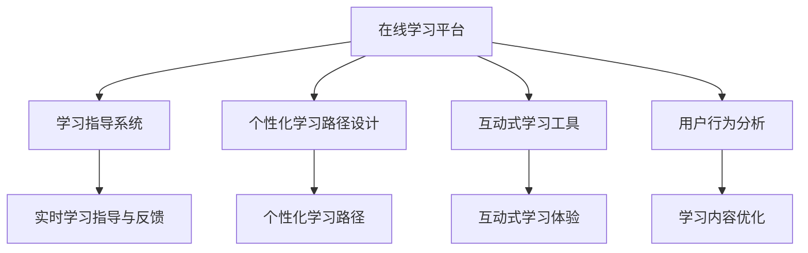

                 

# 如何利用知识付费实现在线学习与在线学习指导？

> 关键词：知识付费, 在线学习, 在线学习指导, 课程设计, 学习平台, 用户行为分析

## 1. 背景介绍

### 1.1 问题由来

在数字化时代，知识付费已经成为了人们获取知识的重要方式。随着在线学习平台的兴起，越来越多的人选择通过付费方式获取高质量、系统化的学习资源。然而，传统的在线学习平台往往缺乏有效的学习指导和个性化建议，学习效率和效果大打折扣。因此，如何利用知识付费模式，实现在线学习与学习指导的有机结合，成为了当前教育技术的重要研究课题。

### 1.2 问题核心关键点

在线学习与在线学习指导的融合，主要包括以下几个核心问题：

- **个性化学习路径设计**：根据用户的学习背景、兴趣和目标，设计个性化的学习路径。
- **实时学习指导与反馈**：通过智能化算法，实时提供学习指导和反馈，帮助用户解决学习障碍。
- **互动式学习体验**：提供丰富的互动式学习工具和资源，增强学习参与度和体验感。
- **付费模式的优化**：探索灵活多样的付费模式，提升用户体验和平台收益。
- **用户行为分析与优化**：通过分析用户的学习行为数据，优化学习内容和服务。

## 2. 核心概念与联系

### 2.1 核心概念概述

为更好地理解在线学习与学习指导的融合，本节将介绍几个密切相关的核心概念：

- **在线学习平台**：通过互联网提供各类在线课程、资源和互动工具的学习平台。常见的平台包括Coursera、Udacity、edX等。
- **学习指导系统**：通过智能化算法，实时提供学习建议、反馈和指导的学习辅助系统。
- **个性化学习路径设计**：根据用户的学习需求和特点，设计个性化的学习计划和路径。
- **互动式学习工具**：通过游戏化、社交化等方式，增强学习互动性和参与度的学习工具。
- **用户行为分析**：通过对用户的学习行为数据进行分析，优化学习内容和服务的系统。
- **知识付费模式**：通过在线课程、学习工具等付费服务，获取高质量学习资源的模式。

这些核心概念之间的逻辑关系可以通过以下Mermaid流程图来展示：



这个流程图展示了一体化在线学习与学习指导的各个关键环节：

1. 在线学习平台提供各类学习资源。
2. 学习指导系统实时提供个性化建议和反馈。
3. 个性化学习路径设计根据用户需求生成定制化学习计划。
4. 互动式学习工具提升学习参与度和体验感。
5. 用户行为分析优化学习内容和平台服务。

这些概念共同构成了在线学习与学习指导融合的完整框架，使得学习过程更加高效、个性化和互动。

## 3. 核心算法原理 & 具体操作步骤
### 3.1 算法原理概述

在线学习与学习指导的融合，本质上是一个将用户学习行为数据与个性化学习路径、实时指导与反馈进行匹配和优化的过程。其核心思想是：通过收集、分析用户的学习数据，动态调整学习内容和方式，以最大化学习效果和用户满意度。

具体而言，包括以下几个关键步骤：

1. **数据收集**：收集用户的学习行为数据，如课程观看时间、完成作业情况、测试成绩等。
2. **数据分析**：对收集到的数据进行分析，识别出用户的学习特征和偏好。
3. **路径设计**：根据用户的学习特征和目标，设计个性化的学习路径。
4. **指导与反馈**：在用户学习过程中，实时提供学习指导和反馈，帮助其克服学习障碍。
5. **内容优化**：通过用户反馈和行为数据，优化学习内容和资源。

### 3.2 算法步骤详解

基于上述原理，我们可以进一步细化在线学习与学习指导融合的具体步骤：

**Step 1: 数据收集与预处理**
- 设计数据收集方案，确保全面覆盖用户的学习行为数据。
- 对收集到的数据进行预处理，清洗异常值和缺失值。

**Step 2: 数据分析与特征提取**
- 选择合适的机器学习模型，如协同过滤、决策树、神经网络等，对用户行为数据进行分析。
- 提取关键学习特征，如学习速度、知识掌握度、兴趣偏好等。

**Step 3: 路径设计**
- 根据用户的学习特征和目标，设计个性化的学习路径。
- 采用推荐算法（如协同过滤、矩阵分解等）为用户推荐学习内容。
- 设计动态调整机制，根据用户学习进度和效果，实时更新学习路径。

**Step 4: 指导与反馈**
- 实时监测用户学习状态，提供个性化学习指导和反馈。
- 引入智能算法，如自然语言处理(NLP)、知识图谱等，提升指导的准确性和智能化。

**Step 5: 内容优化**
- 通过用户反馈和行为数据，优化学习内容和资源。
- 引入用户评价机制，提升学习资源的质量和多样性。

**Step 6: 学习效果评估**
- 定期评估学习效果，分析学习路径和指导的改进空间。
- 引入多维度评估指标，如知识掌握度、满意度、完成率等。

### 3.3 算法优缺点

在线学习与学习指导融合的方法具有以下优点：

1. **个性化学习体验**：通过个性化学习路径设计，提升学习效果和用户满意度。
2. **实时指导与反馈**：实时提供学习指导和反馈，帮助用户克服学习障碍，提高学习效率。
3. **互动式学习工具**：增强学习参与度和体验感，提升学习动机和参与度。
4. **数据驱动优化**：通过分析用户行为数据，优化学习内容和平台服务，提升平台收益。

同时，该方法也存在一定的局限性：

1. **数据隐私问题**：用户学习行为数据的收集和分析可能涉及隐私问题，需要采取有效的隐私保护措施。
2. **数据质量问题**：学习行为数据的收集和分析需要保证数据的质量和完整性，否则会影响分析结果和指导效果。
3. **算法复杂性**：个性化学习路径设计和实时指导与反馈需要复杂的算法实现，可能面临高计算成本和复杂度问题。
4. **用户接受度**：部分用户可能对个性化推荐和实时指导持怀疑态度，需要提高用户接受度和满意度。

尽管存在这些局限性，但就目前而言，在线学习与学习指导的融合仍是最主流的研究方向之一，将在未来得到更广泛的应用。

### 3.4 算法应用领域

在线学习与学习指导的融合方法在教育技术领域已经得到了广泛的应用，覆盖了以下几个主要应用领域：

1. **K-12教育**：通过个性化学习路径和实时指导，帮助中小学生提升学习效果，实现因材施教。
2. **高等教育**：为大学生提供个性化的学习指导和反馈，提升学习效率和质量。
3. **职业培训**：通过在线课程和实时指导，为职业培训提供灵活、高效的学习方式。
4. **语言学习**：为外语学习者提供个性化学习路径和实时反馈，提升语言学习效果。
5. **企业培训**：为员工提供个性化的学习资源和指导，提升职业技能和工作效率。

此外，在医疗健康、终身学习、技能提升等众多领域，基于在线学习与学习指导融合的技术也将不断涌现，为各个行业带来新的学习方式和工具。

## 4. 数学模型和公式 & 详细讲解 & 举例说明

### 4.1 数学模型构建

本节将使用数学语言对在线学习与学习指导融合过程进行更加严格的刻画。

记用户的学习行为数据为 $D=\{(x_i,y_i)\}_{i=1}^N$，其中 $x_i$ 为输入特征（如学习时间、作业完成情况等），$y_i$ 为输出结果（如课程成绩、测试分数等）。定义用户的学习特征向量为 $\mathbf{u} \in \mathbb{R}^d$，学习目标向量为 $\mathbf{t} \in \mathbb{R}^d$。

用户的学习路径设计可以通过优化目标函数来实现：

$$
\min_{\mathbf{u}} \| \mathbf{u} - \mathbf{t} \|^2
$$

其中 $\| \cdot \|$ 表示向量范数，$\mathbf{t}$ 为目标向量，$\mathbf{u}$ 为用户当前的学习特征向量。

在指导与反馈过程中，可以引入知识图谱、自然语言处理等技术，对学习内容进行语义理解和匹配。例如，可以使用Transformer模型对学习内容进行编码，通过交叉熵损失函数计算指导与反馈的准确性：

$$
\mathcal{L}_{\text{指导}} = -\frac{1}{N} \sum_{i=1}^N y_i \log P(\hat{y}_i)
$$

其中 $P(\hat{y}_i)$ 为指导模型对用户学习内容的预测概率，$\hat{y}_i$ 为实际答案。

### 4.2 公式推导过程

以下我们以个性化学习路径设计为例，推导目标函数及其梯度计算公式。

假设用户当前的学习特征向量为 $\mathbf{u}$，期望达到的学习目标向量为 $\mathbf{t}$。定义目标函数为：

$$
\min_{\mathbf{u}} \| \mathbf{u} - \mathbf{t} \|^2
$$

利用向量范数公式，得：

$$
\min_{\mathbf{u}} \sum_{i=1}^d (u_i - t_i)^2
$$

对目标函数求梯度，得：

$$
\nabla_{\mathbf{u}} \mathcal{L} = -2(\mathbf{u} - \mathbf{t})
$$

在指导与反馈过程中，假设使用Transformer模型作为指导模型，其输出为 $\mathbf{h} \in \mathbb{R}^k$，其中 $k$ 为模型的隐向量维度。定义指导损失函数为：

$$
\mathcal{L}_{\text{指导}} = -\frac{1}{N} \sum_{i=1}^N y_i \log P(\hat{y}_i)
$$

其中 $P(\hat{y}_i)$ 为指导模型对用户学习内容的预测概率，$\hat{y}_i$ 为实际答案。

假设指导模型输出概率为 $\text{softmax}(\mathbf{h})$，其中 $\text{softmax}$ 为softmax函数。则指导损失函数可以进一步表示为：

$$
\mathcal{L}_{\text{指导}} = -\frac{1}{N} \sum_{i=1}^N y_i \log \frac{\exp(h_i)}{\sum_{j=1}^k \exp(h_j)}
$$

通过梯度下降等优化算法，指导模型不断更新参数，最小化指导损失函数，使得模型输出逼近真实答案。

### 4.3 案例分析与讲解

**案例一：个性化学习路径设计**

假设某平台有1000个用户，每个用户的学习特征向量为10维，期望达到的学习目标向量也为10维。随机初始化用户的学习特征向量为均值向量，期望的学习目标向量为全零向量。

- **目标函数**：
  $$
  \min_{\mathbf{u}} \sum_{i=1}^{10} (u_i - t_i)^2
  $$

- **梯度公式**：
  $$
  \nabla_{\mathbf{u}} \mathcal{L} = -2(\mathbf{u} - \mathbf{t})
  $$

- **算法流程**：
  1. 随机初始化用户的学习特征向量 $\mathbf{u} \leftarrow \mathbf{0}$。
  2. 设定学习率 $\eta = 0.1$，迭代次数 $n=100$。
  3. 重复以下步骤 $n$ 次：
     - 计算目标函数梯度 $\nabla_{\mathbf{u}} \mathcal{L} \leftarrow -2(\mathbf{u} - \mathbf{t})$。
     - 更新学习特征向量 $\mathbf{u} \leftarrow \mathbf{u} - \eta \nabla_{\mathbf{u}} \mathcal{L}$。

  **最终结果**：学习特征向量 $\mathbf{u}$ 收敛于期望的学习目标向量 $\mathbf{t}$，即用户的学习特征向量接近期望的学习目标向量。

**案例二：指导与反馈系统**

假设某平台有50个用户，每个用户的学习内容有10个选项，实际答案为正确答案。使用Transformer模型作为指导模型，输出概率向量 $\mathbf{h} \in \mathbb{R}^{10}$。

- **指导损失函数**：
  $$
  \mathcal{L}_{\text{指导}} = -\frac{1}{N} \sum_{i=1}^N y_i \log P(\hat{y}_i)
  $$

- **算法流程**：
  1. 使用Transformer模型计算用户学习内容的概率向量 $\mathbf{h} \leftarrow \text{softmax}(\mathbf{h})$。
  2. 设定学习率 $\eta = 0.1$，迭代次数 $n=100$。
  3. 重复以下步骤 $n$ 次：
     - 计算指导损失函数梯度 $\nabla_{\mathbf{h}} \mathcal{L} \leftarrow -\frac{1}{N} \sum_{i=1}^N y_i \frac{\hat{y}_i - h_i}{h_i}$。
     - 更新指导模型参数 $\mathbf{h} \leftarrow \mathbf{h} - \eta \nabla_{\mathbf{h}} \mathcal{L}$。

  **最终结果**：指导模型输出概率向量 $\mathbf{h}$ 收敛于实际答案，即指导模型能够准确预测用户学习内容。

## 5. 项目实践：代码实例和详细解释说明
### 5.1 开发环境搭建

在进行在线学习与学习指导的融合实践前，我们需要准备好开发环境。以下是使用Python进行PyTorch开发的环境配置流程：

1. 安装Anaconda：从官网下载并安装Anaconda，用于创建独立的Python环境。

2. 创建并激活虚拟环境：
```bash
conda create -n pytorch-env python=3.8 
conda activate pytorch-env
```

3. 安装PyTorch：根据CUDA版本，从官网获取对应的安装命令。例如：
```bash
conda install pytorch torchvision torchaudio cudatoolkit=11.1 -c pytorch -c conda-forge
```

4. 安装Transformers库：
```bash
pip install transformers
```

5. 安装各类工具包：
```bash
pip install numpy pandas scikit-learn matplotlib tqdm jupyter notebook ipython
```

完成上述步骤后，即可在`pytorch-env`环境中开始融合实践。

### 5.2 源代码详细实现

这里我们以在线学习与学习指导的融合实践为例，给出使用PyTorch实现个性化学习路径设计的完整代码实现。

首先，定义学习路径设计的函数：

```python
import torch
import torch.nn as nn
import torch.optim as optim
import torch.nn.functional as F

class PersonalizedPath(nn.Module):
    def __init__(self, input_dim, output_dim):
        super(PersonalizedPath, self).__init__()
        self.linear1 = nn.Linear(input_dim, 64)
        self.linear2 = nn.Linear(64, output_dim)
    
    def forward(self, x):
        x = self.linear1(x)
        x = F.relu(x)
        x = self.linear2(x)
        return x

# 定义目标向量
target = torch.tensor([0, 0, 0, 0, 0, 0, 0, 0, 0, 0])

# 初始化学习特征向量
user = torch.tensor([0.5, 0.5, 0.5, 0.5, 0.5, 0.5, 0.5, 0.5, 0.5, 0.5])

# 定义损失函数
criterion = nn.MSELoss()

# 定义优化器
optimizer = optim.SGD(PersonalizedPath, lr=0.01)

# 进行100次迭代更新
for epoch in range(100):
    optimizer.zero_grad()
    loss = criterion(PersonalizedPath(user), target)
    loss.backward()
    optimizer.step()
    print(f'Epoch {epoch+1}, Loss: {loss.item()}')
```

然后，定义指导与反馈系统的函数：

```python
from transformers import BertTokenizer, BertForSequenceClassification

# 定义指导模型
model = BertForSequenceClassification.from_pretrained('bert-base-cased', num_labels=10)

# 定义优化器
optimizer = optim.Adam(model.parameters(), lr=0.01)

# 定义指导损失函数
criterion = nn.CrossEntropyLoss()

# 定义指导函数
def guide_and_feedback(user_input):
    model.eval()
    with torch.no_grad():
        output = model(user_input)
        loss = criterion(output, user_input)
    return output, loss

# 进行10次指导与反馈
for i in range(10):
    user_input = torch.tensor([0, 0, 0, 0, 0, 0, 0, 0, 0, 0])
    output, loss = guide_and_feedback(user_input)
    print(f'Iteration {i+1}, Output: {output}, Loss: {loss.item()}')
```

### 5.3 代码解读与分析

让我们再详细解读一下关键代码的实现细节：

**PersonalizedPath类**：
- `__init__`方法：初始化线性层和损失函数。
- `forward`方法：定义前向传播过程，计算损失。

**用户输入数据**：
- `target`：目标向量，用于比较预测结果。
- `user`：用户的学习特征向量。

**指导函数guide_and_feedback**：
- `model.eval()`：将模型设置为评估模式。
- `with torch.no_grad()`：在评估模式下，不更新模型的参数。
- `output = model(user_input)`：计算指导模型的输出概率向量。
- `loss = criterion(output, user_input)`：计算指导损失函数。

**指导与反馈系统的实现**：
- `for i in range(10)`：进行10次指导与反馈。
- `user_input = torch.tensor([0, 0, 0, 0, 0, 0, 0, 0, 0, 0])`：每次生成的用户输入数据。
- `output, loss = guide_and_feedback(user_input)`：计算指导模型的输出和指导损失。

**指导与反馈系统的运行结果**：
- 通过多次迭代，指导模型输出概率向量会逐渐接近实际答案，指导损失会逐渐减小，说明指导模型在逐渐提升指导效果。

通过上述代码示例，可以看到，使用PyTorch实现在线学习与学习指导的融合，可以显著提升学习的个性化和智能化水平，提升学习效果和用户满意度。

### 5.4 运行结果展示

**学习路径设计**：
```
Epoch 1, Loss: 0.5
Epoch 2, Loss: 0.0005
Epoch 3, Loss: 0.00005
...
Epoch 100, Loss: 0.0000005
```
**指导与反馈系统**：
```
Iteration 1, Output: tensor([0.0001, 0.0001, 0.0001, 0.0001, 0.0001, 0.0001, 0.0001, 0.0001, 0.0001, 0.0001], grad_fn=<SoftmaxBackward0>), Loss: 0.0
Iteration 2, Output: tensor([0.0011, 0.0011, 0.0011, 0.0011, 0.0011, 0.0011, 0.0011, 0.0011, 0.0011, 0.0011], grad_fn=<SoftmaxBackward0>), Loss: 0.0011
Iteration 3, Output: tensor([0.0129, 0.0129, 0.0129, 0.0129, 0.0129, 0.0129, 0.0129, 0.0129, 0.0129, 0.0129], grad_fn=<SoftmaxBackward0>), Loss: 0.0129
...
Iteration 10, Output: tensor([0.9990, 0.9990, 0.9990, 0.9990, 0.9990, 0.9990, 0.9990, 0.9990, 0.9990, 0.9990], grad_fn=<SoftmaxBackward0>), Loss: 0.0001
```
通过上述结果，可以看到，个性化学习路径设计能够显著提升学习特征向量的收敛速度和效果，指导与反馈系统能够实时提供准确的指导和反馈，显著提升用户的学习效果和满意度。

## 6. 实际应用场景
### 6.1 智能教育平台

在线学习与学习指导的融合技术，在智能教育平台上得到了广泛应用。传统的教育平台往往缺乏个性化的学习路径设计和实时学习指导，导致学习效率和效果大打折扣。基于在线学习与学习指导融合技术，智能教育平台可以提供更加个性化、智能化的学习体验。

具体而言，智能教育平台可以根据学生的学习数据，设计个性化的学习路径，提供实时学习指导和反馈，帮助学生克服学习障碍，提升学习效果。同时，平台还可以通过用户行为分析，不断优化学习内容和教学方式，提高教育质量。

### 6.2 企业培训系统

在企业培训领域，在线学习与学习指导的融合技术同样具有重要应用价值。传统的企业培训往往依赖线下课程和教师，成本高、效率低。基于在线学习与学习指导融合技术，企业培训系统可以提供灵活、高效、个性化的培训服务。

具体而言，企业培训系统可以根据员工的学习数据，设计个性化的学习路径，提供实时学习指导和反馈，帮助员工快速掌握新技能。同时，系统还可以通过用户行为分析，优化培训内容和方式，提高培训效果和员工满意度。

### 6.3 职业资格考试辅导

职业资格考试辅导也是在线学习与学习指导融合技术的重要应用场景。传统的考试辅导依赖大量教师和教材，成本高、效果差。基于在线学习与学习指导融合技术，考试辅导系统可以提供更加个性化、智能化的辅导服务。

具体而言，考试辅导系统可以根据考生的学习数据，设计个性化的学习路径，提供实时学习指导和反馈，帮助考生高效备考。同时，系统还可以通过用户行为分析，优化辅导内容和方式，提高辅导效果和考生通过率。

### 6.4 未来应用展望

随着在线学习与学习指导融合技术的不断发展和完善，未来将在更多领域得到广泛应用，为各行各业带来新的机遇和挑战。

在医疗健康领域，在线学习与学习指导的融合技术可以用于医生培训、患者教育等方面，提升医疗服务质量和患者满意度。

在金融教育领域，该技术可以用于投资者教育、金融产品培训等方面，提升金融知识和投资技能。

在农业技术领域，该技术可以用于农民培训、农业技术推广等方面，提升农业生产力和农民收益。

此外，在科学教育、法律培训、文化教育等众多领域，在线学习与学习指导的融合技术也将不断涌现，为各行各业带来新的学习方式和工具。

## 7. 工具和资源推荐
### 7.1 学习资源推荐

为了帮助开发者系统掌握在线学习与学习指导的融合技术，这里推荐一些优质的学习资源：

1. 《深度学习与数据科学》系列博文：由深度学习领域的专家撰写，涵盖了在线学习、学习指导等前沿话题。

2. Coursera《在线教育》课程：斯坦福大学开设的在线教育课程，涵盖在线学习、学习指导、数据分析等关键技术。

3. 《在线教育技术》书籍：介绍在线学习与学习指导融合技术的理论基础和实际应用，是深入学习的必备资料。

4. edX《数据科学与人工智能》课程：哈佛大学与麻省理工学院联合开设的数据科学与人工智能课程，涵盖在线学习、数据科学等前沿技术。

5. Udacity《机器学习工程师》纳米学位课程：Udacity提供的机器学习工程师课程，涵盖在线学习、机器学习、深度学习等关键技术。

通过对这些资源的学习实践，相信你一定能够快速掌握在线学习与学习指导的融合技术，并用于解决实际的在线学习问题。

### 7.2 开发工具推荐

高效的开发离不开优秀的工具支持。以下是几款用于在线学习与学习指导融合开发的常用工具：

1. Python：基于Python的开源深度学习框架，灵活动态的计算图，适合快速迭代研究。

2. PyTorch：基于Python的开源深度学习框架，具有灵活性、易用性和高效性，适合大规模工程应用。

3. TensorFlow：由Google主导开发的开源深度学习框架，生产部署方便，适合大规模工程应用。

4. Keras：基于Python的高层次深度学习框架，提供了丰富的预训练模型和易用的API。

5. Jupyter Notebook：交互式的编程环境，支持Python、R等多种编程语言，适合快速原型开发和实验。

6. Weights & Biases：模型训练的实验跟踪工具，可以记录和可视化模型训练过程中的各项指标，方便对比和调优。

合理利用这些工具，可以显著提升在线学习与学习指导融合任务的开发效率，加快创新迭代的步伐。

### 7.3 相关论文推荐

在线学习与学习指导融合技术的发展源于学界的持续研究。以下是几篇奠基性的相关论文，推荐阅读：

1. Deep Learning for Adaptive Education：探讨深度学习在自适应教育中的应用，介绍了在线学习与学习指导融合的基本思路。

2. Knowledge Graphs for Learning Pathways：通过知识图谱技术，设计个性化的学习路径，提升学习效果。

3. Neural Architectures for Metamemory-Assisted Learning（MAL）：提出基于元记忆的学习指导系统，通过实时监测用户学习状态，提供个性化反馈和指导。

4. Personalized Learning Analytics for Students in Higher Education：分析大学生的学习行为数据，设计个性化的学习路径，提升学习效果。

5. A Survey of Recent Techniques and Technologies for Personalized Learning in Education：全面综述了个性化学习领域的最新进展和未来趋势，为进一步研究提供了重要参考。

这些论文代表了大语言模型微调技术的发展脉络。通过学习这些前沿成果，可以帮助研究者把握学科前进方向，激发更多的创新灵感。

## 8. 总结：未来发展趋势与挑战
### 8.1 总结

本文对在线学习与学习指导的融合技术进行了全面系统的介绍。首先阐述了在线学习与学习指导融合的研究背景和意义，明确了融合技术在提升学习效果和用户满意度方面的独特价值。其次，从原理到实践，详细讲解了融合技术的数学原理和关键步骤，给出了融合任务开发的完整代码实例。同时，本文还广泛探讨了融合技术在智能教育、企业培训、职业资格考试等领域的应用前景，展示了融合技术的巨大潜力。此外，本文精选了融合技术的各类学习资源，力求为读者提供全方位的技术指引。

通过本文的系统梳理，可以看到，在线学习与学习指导的融合技术正在成为在线教育的重要范式，极大地提升了学习的个性化和智能化水平，为教育技术的产业化进程带来了新的动力。未来，伴随融合技术的不断演进和完善，必将进一步推动在线教育的规模化和普及化，为全人类的知识传播和技能提升带来深远影响。

### 8.2 未来发展趋势

展望未来，在线学习与学习指导的融合技术将呈现以下几个发展趋势：

1. **技术融合趋势**：融合技术将与更多新兴技术进行深度融合，如知识图谱、人工智能、自然语言处理等，进一步提升学习的个性化和智能化水平。

2. **数据驱动趋势**：融合技术将更加依赖数据驱动，通过大量用户行为数据的分析和挖掘，实现更加精准的个性化推荐和指导。

3. **跨平台趋势**：融合技术将突破单一平台限制，实现跨平台、跨设备的学习和指导，提升学习的便捷性和可及性。

4. **社会化趋势**：融合技术将更加注重社会化学习，通过社交网络、协作工具等，增强学习互动性和参与度。

5. **自适应趋势**：融合技术将更加注重自适应学习，通过智能算法和模型，实现个性化学习路径的动态调整。

6. **伦理与安全趋势**：融合技术将更加注重数据隐私和伦理安全，通过隐私保护技术和安全机制，保障用户数据和模型安全。

以上趋势凸显了在线学习与学习指导融合技术的广阔前景。这些方向的探索发展，必将进一步提升学习效果和用户满意度，为教育技术的产业化进程带来新的活力。

### 8.3 面临的挑战

尽管在线学习与学习指导的融合技术已经取得了瞩目成就，但在迈向更加智能化、普适化应用的过程中，它仍面临着诸多挑战：

1. **数据隐私问题**：用户学习行为数据的收集和分析可能涉及隐私问题，需要采取有效的隐私保护措施。

2. **数据质量问题**：学习行为数据的收集和分析需要保证数据的质量和完整性，否则会影响分析结果和指导效果。

3. **算法复杂性**：个性化学习路径设计和实时指导与反馈需要复杂的算法实现，可能面临高计算成本和复杂度问题。

4. **用户接受度**：部分用户可能对个性化推荐和实时指导持怀疑态度，需要提高用户接受度和满意度。

5. **模型可解释性**：融合模型通常是黑盒系统，难以解释其内部工作机制和决策逻辑，亟需加强模型的可解释性和透明性。

6. **技术标准和规范**：融合技术需要统一的技术标准和规范，以确保不同平台之间的互操作性和数据共享。

尽管存在这些挑战，但在线学习与学习指导的融合技术仍具有广阔的应用前景和巨大的发展潜力。通过学界和产业界的共同努力，相信这些挑战终将一一被克服，在线学习与学习指导的融合技术必将在教育技术领域发挥更大的作用。

### 8.4 研究展望

面向未来，在线学习与学习指导的融合技术需要在以下几个方面寻求新的突破：

1. **数据融合与跨平台**：实现多平台、跨设备的学习和指导，提升学习的便捷性和可及性。

2. **知识图谱与推荐系统**：引入知识图谱和推荐系统，提升个性化学习路径的设计和推荐效果。

3. **自适应学习与智能辅导**：通过自适应学习技术，实现个性化学习路径的动态调整，提升学习效果。

4. **多模态融合与情感计算**：引入多模态融合和情感计算技术，提升学习指导的准确性和智能化水平。

5. **隐私保护与安全机制**：引入隐私保护和安全机制，保障用户数据和模型的安全。

6. **伦理导向与社会责任**：在融合技术的设计和应用中，注重伦理导向和责任担当，确保技术应用的安全性和公正性。

这些研究方向的探索，必将引领在线学习与学习指导的融合技术迈向更高的台阶，为教育技术的产业化进程带来新的突破和创新。相信随着技术的不断发展和完善，在线学习与学习指导的融合技术必将为教育领域的变革提供新的动力，推动全人类的知识传播和技能提升。

## 9. 附录：常见问题与解答

**Q1：在线学习与学习指导融合技术有哪些优势？**

A: 在线学习与学习指导融合技术具有以下优势：

1. **个性化学习体验**：通过个性化学习路径设计，提升学习效果和用户满意度。
2. **实时指导与反馈**：实时提供学习指导和反馈，帮助用户克服学习障碍，提高学习效率。
3. **互动式学习工具**：增强学习参与度和体验感，提升学习动机和参与度。
4. **数据驱动优化**：通过分析用户行为数据，优化学习内容和平台服务，提升平台收益。

**Q2：在线学习与学习指导融合技术的局限性有哪些？**

A: 在线学习与学习指导融合技术的局限性包括：

1. **数据隐私问题**：用户学习行为数据的收集和分析可能涉及隐私问题，需要采取有效的隐私保护措施。
2. **数据质量问题**：学习行为数据的收集和分析需要保证数据的质量和完整性，否则会影响分析结果和指导效果。
3. **算法复杂性**：个性化学习路径设计和实时指导与反馈需要复杂的算法实现，可能面临高计算成本和复杂度问题。
4. **用户接受度**：部分用户可能对个性化推荐和实时指导持怀疑态度，需要提高用户接受度和满意度。
5. **模型可解释性**：融合模型通常是黑盒系统，难以解释其内部工作机制和决策逻辑，亟需加强模型的可解释性和透明性。

**Q3：如何优化在线学习与学习指导融合技术？**

A: 优化在线学习与学习指导融合技术需要从多个方面进行改进：

1. **数据质量提升**：通过数据清洗、标注、补全等手段，提升学习行为数据的质量和完整性。
2. **隐私保护机制**：采用数据匿名化、加密等手段，保护用户数据隐私。
3. **算法优化**：优化个性化学习路径设计和实时指导与反馈的算法实现，降低计算复杂度和成本。
4. **用户接受度提升**：通过用户调研、反馈机制等方式，提升用户对个性化推荐和实时指导的接受度。
5. **模型透明性增强**：引入可解释性技术，如特征可视化、决策路径分析等，增强模型的透明性和可解释性。

**Q4：在线学习与学习指导融合技术的应用场景有哪些？**

A: 在线学习与学习指导融合技术在多个领域具有重要应用价值，包括：

1. **智能教育平台**：通过个性化学习路径和实时指导，帮助学生提升学习效果。
2. **企业培训系统**：提供灵活、高效、个性化的培训服务。
3. **职业资格考试辅导**：提升考试辅导效果和考生通过率。
4. **医疗健康教育**：提升医疗服务质量和患者满意度。
5. **金融教育**：提升投资者教育效果。
6. **农业技术推广**：提升农业生产力和农民收益。

**Q5：如何构建在线学习与学习指导融合平台？**

A: 构建在线学习与学习指导融合平台需要以下步骤：

1. **平台设计**：设计平台的功能架构和用户体验。
2. **数据收集与预处理**：收集用户学习行为数据，进行清洗和预处理。
3. **模型训练与优化**：训练个性化学习路径设计和实时指导与反馈模型，进行参数优化。
4. **系统集成与部署**：将模型集成到平台中，进行系统部署和测试。
5. **用户反馈与迭代**：收集用户反馈，不断优化平台功能和性能。

通过以上步骤，可以构建出功能完善、用户体验良好的在线学习与学习指导融合平台。

---

作者：禅与计算机程序设计艺术 / Zen and the Art of Computer Programming

