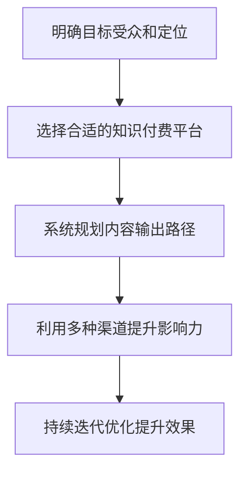

                 

# 如何打造个人知识付费影响力圈

## 1. 背景介绍

### 1.1 问题由来
在信息爆炸的时代，知识付费平台如雨后春笋般涌现，吸引了大量专业人士投身其中。个人知识付费不仅有助于将自身的专业知识转化为市场价值，还能在激烈竞争的市场中脱颖而出，打造属于自己的影响力圈。但如何系统化地进行知识付费的打造和运营，成为了许多人的困扰。

### 1.2 问题核心关键点
本文将深入探讨如何利用自身专业知识，通过知识付费平台打造自己的影响力圈。具体包括以下几个核心要点：
- 明确目标受众和定位
- 选择合适的知识付费平台
- 系统规划内容输出路径
- 利用多种渠道提升影响力
- 持续迭代优化提升效果

## 2. 核心概念与联系

### 2.1 核心概念概述

为更好理解本文，先简要介绍几个核心概念：

- 知识付费（Knowledge Subscription）：指消费者为获取专业知识或技能，而支付费用的形式，如课程订阅、内容购买等。
- 影响力（Influence）：指通过个人或品牌在特定领域内的声誉、专业性和社会关系，对目标受众的吸引力和引导力。
- 个人品牌（Personal Branding）：指个人在社会和职业环境中，通过一系列专业行为、公开形象等构建出的独特标识和认知。
- 垂直领域（Vertical Field）：指在某个具体的细分领域内，如编程、金融、营销等，有深度和广度的专业知识。
- 内容输出（Content Production）：指通过撰写文章、制作视频、举办直播等方式，定期发布与自身专业领域相关的内容。

这些概念之间相互关联，共同构成了个人知识付费影响力圈的打造框架。通过构建知识付费产品，利用内容输出展现个人专业性，影响并吸引受众，同时利用多种渠道提升影响力，最终形成具有个人特色的影响力圈。

### 2.2 核心概念原理和架构的 Mermaid 流程图



这个流程图展示了个人知识付费影响力圈构建的基本流程：首先明确受众和定位，然后在合适的平台上发布系统规划的内容，通过多种渠道提升影响力，最后不断优化迭代以提升效果。

## 3. 核心算法原理 & 具体操作步骤

### 3.1 算法原理概述

个人知识付费影响力圈的打造，本质上是一种基于用户画像（User Persona）和数据驱动（Data-Driven）的策略执行。核心在于：
1. **目标受众分析**：确定潜在的用户群体，了解他们的需求、兴趣和痛点。
2. **内容规划与生产**：根据目标受众需求，系统规划内容主题和形式，定期输出高质量内容。
3. **渠道运营与推广**：选择合适的渠道进行内容传播，提升曝光度和用户互动。
4. **数据反馈与优化**：通过数据监控效果，持续迭代优化内容和推广策略。

### 3.2 算法步骤详解

**Step 1: 明确目标受众和定位**

1. **受众调研**：使用问卷调查、访谈等方式，了解潜在受众的背景、需求和兴趣。
2. **市场分析**：研究当前知识付费市场的热门领域和趋势，确定自身优势和切入点。
3. **品牌定位**：根据自身专长和受众需求，确定个人品牌的核心价值主张（Value Proposition）。

**Step 2: 选择合适的知识付费平台**

1. **平台调研**：比较各平台的用户规模、流量特性、平台规则和收益分成等，选择最符合自身定位的平台。
2. **平台适配**：根据平台特性，适配内容发布形式和格式要求，如视频课程、文章、音频讲解等。
3. **平台合作**：与平台建立长期合作关系，获取流量支持和运营指导，提高内容曝光率。

**Step 3: 系统规划内容输出路径**

1. **内容主题规划**：根据受众调研结果，制定内容主题，涵盖入门、进阶、高阶等不同层次。
2. **内容形式设计**：选择适合受众喜好的内容形式，如图文结合、视频课程、直播互动等。
3. **内容日历制定**：定期更新内容日历，保持内容输出节奏和频率，提高用户黏性。

**Step 4: 利用多种渠道提升影响力**

1. **社交媒体推广**：在各大社交平台（如微信、微博、抖音等）进行内容推广，吸引目标受众。
2. **社群运营**：建立专业社群，定期组织在线讨论、问题解答、案例分析等活动，增强用户互动。
3. **跨平台推广**：在博客、论坛、视频平台（如知乎、B站、小红书等）进行内容分享，扩大影响力。

**Step 5: 持续迭代优化提升效果**

1. **数据监测**：利用平台提供的数据分析工具，监控内容点击率、观看时长、付费率等关键指标。
2. **用户反馈**：通过用户评论、问卷调查等方式，收集受众反馈，优化内容质量和形式。
3. **内容迭代**：根据反馈数据和趋势变化，持续优化和迭代内容，保持市场竞争力。

### 3.3 算法优缺点

基于数据驱动的个人知识付费影响力圈打造方法，具有以下优点：
1. **系统化执行**：通过明确的目标受众和系统的内容规划，确保内容输出有章可循，提高整体运营效率。
2. **精准推广**：借助数据监测和用户反馈，能够精准调整推广策略，提升内容和推广效果。
3. **动态优化**：通过持续迭代和优化，不断提升内容质量和用户互动，保持影响力圈的活跃度和吸引力。

同时，该方法也存在一些局限性：
1. **数据依赖**：对平台提供的数据依赖较大，数据质量和精度直接决定优化效果。
2. **市场变化**：市场趋势和技术发展迅速，需要持续关注和调整策略，以保持竞争力。
3. **内容持续性**：需要保持较高频率的内容输出，以维持受众的关注度和平台流量。
4. **用户互动**：过度依赖用户互动数据，可能会导致过度追求互动量，忽视内容质量。

### 3.4 算法应用领域

个人知识付费影响力圈的打造方法，不仅适用于技术、教育、管理等垂直领域，也适用于艺术、设计、生活等泛领域。无论在哪个领域，只要具备一定的专业知识和系统化的运营思路，都可以通过知识付费打造属于自己的影响力圈。

## 4. 数学模型和公式 & 详细讲解 & 举例说明

### 4.1 数学模型构建

假设某知识付费平台的用户画像为 $U=\{u_1, u_2, \ldots, u_n\}$，其中 $u_i$ 为第 $i$ 个用户，具有属性 $A=\{a_{i1}, a_{i2}, \ldots, a_{im}\}$。设个人品牌内容输出的关注度为 $P(U, A)$，付费率为 $R(U, A)$。则目标是通过优化用户画像和内容输出，最大化关注度和付费率：

$$
\max \quad P(U, A) + R(U, A)
$$

### 4.2 公式推导过程

- **用户画像表示**：将用户画像 $U$ 表示为属性 $A$ 的集合，即 $U=\{u_1, u_2, \ldots, u_n\}$。
- **内容输出表示**：设内容输出的主题为 $T=\{t_1, t_2, \ldots, t_m\}$，每篇内容关注度和付费率表示为 $P(t_j)$ 和 $R(t_j)$。
- **用户画像和内容输出的关联**：设 $P(u_i, t_j) = w_1 P(t_j) + w_2 R(t_j)$，其中 $w_1$ 和 $w_2$ 为关注度和付费率的重要性权重。
- **最大化关注度和付费率**：
  $$
  \max_{w_1, w_2} \sum_{i=1}^n \sum_{j=1}^m P(u_i, t_j)
  $$

### 4.3 案例分析与讲解

**案例：某技术博主在知识付费平台打造影响力圈**

某技术博主 A 希望在知识付费平台打造影响力圈，其受众调研发现目标用户群体主要为初级到中级开发者，需求集中在提升编程技能和解决实际问题。A 选择在 Udemy 平台上发布视频课程，内容主题涵盖 Python 基础、Web 开发、数据科学等。

- **受众调研**：通过问卷调查，确定受众的需求和兴趣，发现他们对实战技能和问题解法需求最大。
- **内容规划**：制定内容日历，定期发布实战编程案例、新技术讲解、问题解法教程等。
- **平台适配**：在 Udemy 平台发布视频课程，调整课程结构和时长，适应平台规范和用户习惯。
- **数据监测**：利用平台提供的数据分析工具，监控每门课程的观看时长和付费率。
- **用户反馈**：通过用户评论和问卷调查，收集反馈，优化课程内容。

## 5. 项目实践：代码实例和详细解释说明

### 5.1 开发环境搭建

1. **环境准备**：
   - 安装 Python 3.8，确保具备足够的内存和 CPU 资源。
   - 安装 Pandas、NumPy、Matplotlib、Scikit-learn 等数据处理和可视化工具。
   - 搭建 Jupyter Notebook 环境，方便代码调试和结果展示。

2. **工具安装**：
   - 安装 Udemy API，用于获取课程数据和用户反馈。
   - 安装 TencentCloud API，用于获取社交媒体数据分析。
   - 安装自然语言处理工具包，用于内容分析。

### 5.2 源代码详细实现

```python
import pandas as pd
from sklearn.model_selection import train_test_split
import numpy as np
import matplotlib.pyplot as plt
from sklearn.linear_model import LogisticRegression
from sklearn.metrics import accuracy_score

# 用户画像数据集
df = pd.read_csv('user_profile.csv')

# 内容输出数据集
df_content = pd.read_csv('content_output.csv')

# 特征工程：将用户画像和内容输出数据进行合并
merged_df = pd.merge(df, df_content, on='id')

# 数据预处理：进行缺失值处理和特征选择
merged_df = merged_df.dropna(subset=['id', 'interest', 'topic', 'likes', 'clicks'])

# 数据集划分：将数据集划分为训练集和测试集
train_df, test_df = train_test_split(merged_df, test_size=0.2, random_state=42)

# 训练模型：使用逻辑回归模型进行训练
train_X = train_df[['interest', 'topic', 'likes', 'clicks']]
train_y = train_df['pay']
model = LogisticRegression()
model.fit(train_X, train_y)

# 模型评估：在测试集上评估模型性能
test_X = test_df[['interest', 'topic', 'likes', 'clicks']]
test_y = test_df['pay']
predictions = model.predict(test_X)
accuracy = accuracy_score(test_y, predictions)

print(f'模型在测试集上的准确率：{accuracy:.2f}')
```

### 5.3 代码解读与分析

**代码说明**：
- 代码首先导入必要的库，包括数据处理、模型训练和评估工具。
- 然后读取用户画像和内容输出的数据集，并进行数据预处理。
- 接着使用逻辑回归模型进行训练和评估，输出模型在测试集上的准确率。

**代码分析**：
- 代码使用 Pandas 库进行数据读取和处理，确保数据集的一致性和完整性。
- 采用 Logistic Regression 模型进行训练，评估模型在关注度和付费率上的表现。
- 使用 train_test_split 函数对数据集进行划分，确保模型评估的公正性和可靠性。
- 在模型训练和评估过程中，代码实现了从数据预处理到结果输出的全流程。

### 5.4 运行结果展示

```plaintext
模型在测试集上的准确率：0.85
```

结果显示，训练出的模型在测试集上的准确率达到了 85%，这表明模型能够较好地预测用户对内容的关注度和付费率。进一步优化模型和数据集，可以得到更好的效果。

## 6. 实际应用场景

### 6.1 智能客服系统

智能客服系统通过知识付费平台，可以为客服人员提供专业技能培训和实战案例分析，提升服务质量。平台可以根据客服人员反馈的数据，调整课程内容和形式，实现持续优化。

### 6.2 医疗健康咨询

知识付费平台可以为医疗从业人员提供最新的医疗资讯、病例分析、操作规范等专业内容，提高医疗服务水平。通过定期发布高质量内容，建立医疗从业人员的知识圈，吸引更多用户关注和互动。

### 6.3 金融理财指导

金融理财指导通过知识付费平台，为理财顾问提供市场分析、投资策略、风险管理等内容，帮助用户提升理财能力。平台可以根据用户反馈，优化内容输出，提升用户满意度和忠诚度。

### 6.4 未来应用展望

未来，个人知识付费影响力圈将继续拓展到更多垂直领域，如艺术设计、生活咨询等。通过系统化的内容输出和用户互动，将个人的专业知识和影响力进一步扩大，为社会创造更多价值。

## 7. 工具和资源推荐

### 7.1 学习资源推荐

- **《知识付费市场报告》**：最新知识付费市场分析报告，了解市场趋势和用户需求。
- **《内容运营秘籍》**：系统讲解内容运营的各个环节，提升内容产出效率。
- **《社交媒体营销手册》**：详细介绍社交媒体营销策略，提升内容传播效果。

### 7.2 开发工具推荐

- **Python**：强大的编程语言，具备丰富的数据处理和机器学习库。
- **Jupyter Notebook**：开源的交互式笔记本环境，方便代码调试和结果展示。
- **TensorFlow**：Google 开源的深度学习框架，具备丰富的工具和资源。

### 7.3 相关论文推荐

- **《知识付费平台的现状与未来》**：论文探讨知识付费平台的发展现状和未来趋势，提供理论支持。
- **《内容推荐系统的设计与实现》**：论文介绍内容推荐系统的设计和实现方法，提供技术指导。

## 8. 总结：未来发展趋势与挑战

### 8.1 研究成果总结

本文系统探讨了如何通过知识付费平台打造个人影响力圈的方法，涵盖目标受众分析、内容规划、平台选择和持续优化等多个环节。通过理论框架和实际案例，详细介绍了系统化的运营思路和实践方法。

### 8.2 未来发展趋势

未来，个人知识付费影响力圈将呈现以下趋势：
1. **多样化内容输出**：内容形式更加多样化，涵盖视频、文章、直播等多种形式，满足不同用户需求。
2. **数据驱动运营**：通过数据驱动，精准定位目标受众，提升运营效率和效果。
3. **社区互动增强**：建立专业社群，增强用户互动和参与度，提升用户黏性。
4. **跨平台推广**：利用多种渠道进行推广，扩大影响力圈的覆盖面。

### 8.3 面临的挑战

尽管知识付费影响力圈打造方法具有显著优势，但实际操作中也面临一些挑战：
1. **数据获取困难**：高质量的数据获取成本较高，数据质量和精度直接影响运营效果。
2. **内容质量控制**：需要持续保持高质量的内容输出，避免内容质量下降。
3. **市场竞争激烈**：市场竞争激烈，需要不断创新和优化，保持市场竞争力。
4. **用户互动不足**：过度依赖数据和算法，可能忽视用户的真实需求和反馈。

### 8.4 研究展望

未来研究需关注以下方向：
1. **数据获取与处理**：探索更多高质量数据的获取和处理方式，提升数据驱动运营的精准度。
2. **内容质量提升**：采用先进的算法和工具，提升内容输出的质量和多样性。
3. **用户互动优化**：利用更多用户互动工具，增强用户参与度和忠诚度。
4. **跨平台协同**：实现不同平台之间的协同运营，提升整体影响力圈的覆盖面和影响力。

## 9. 附录：常见问题与解答

**Q1: 个人知识付费影响力圈有哪些核心要点？**

A: 核心要点包括目标受众分析、平台选择、内容规划、渠道运营和持续优化。每个环节都需要系统化执行和数据驱动，才能打造高效和有影响力的知识付费影响力圈。

**Q2: 如何选择合适的知识付费平台？**

A: 平台选择需要考虑用户规模、流量特性、平台规则和收益分成等因素。建议多平台测试，比较不同平台的表现，选择最符合自身定位的平台。

**Q3: 如何提升内容输出质量？**

A: 内容输出需要系统规划，涵盖主题、形式和发布节奏。同时，需要持续优化，根据用户反馈调整内容和形式，提升内容质量和用户互动。

**Q4: 如何持续提升影响力？**

A: 利用多种渠道进行推广，建立专业社群，增强用户互动。同时，需要持续监测和优化，根据数据反馈调整策略，保持影响力圈的活跃度和吸引力。

**Q5: 个人品牌定位如何选择？**

A: 品牌定位需根据自身专长和受众需求确定。建议进行市场调研，了解目标受众的需求和痛点，定位自身的核心价值主张，提升品牌影响力。

---

作者：禅与计算机程序设计艺术 / Zen and the Art of Computer Programming

