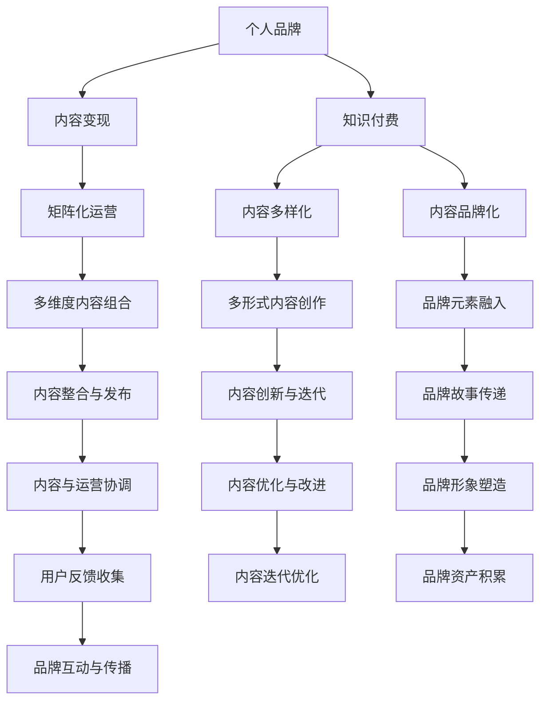

                 

# 如何打造个人知识付费矩阵

> 关键词：知识付费, 个人品牌, 网络平台, 内容变现, 矩阵化运营

## 1. 背景介绍

### 1.1 问题由来
近年来，知识付费市场逐渐兴起，为各领域专业人士提供了新的商业模式。无论是自由职业者、行业专家还是创业者，通过知识变现可以实现自我价值的更大化，甚至在个人品牌建设上迈出坚实的一步。而打造个人知识付费矩阵，成为行业内人士必须掌握的关键策略之一。

### 1.2 问题核心关键点
构建个人知识付费矩阵，核心在于实现内容的多元化、立体化，以及运营的高效化和品牌化。通过矩阵化的运营，不同内容、不同形式的知识产品可以相互补充，覆盖更广泛的受众群体，提高整体盈利能力，同时强化个人品牌形象。

### 1.3 问题研究意义
打造个人知识付费矩阵不仅有助于提升内容变现能力，还能够在竞争激烈的市场中保持持续的生命力。良好的知识付费矩阵可以带来多方面的收益：
- 增加收入来源，分散风险。不同形式的知识产品可覆盖不同的用户群体，提高总收益。
- 增强个人品牌影响力，提升市场认可度。多元化的内容和立体化的品牌形象可以吸引更多目标用户。
- 提升知识传播效率，扩大影响力。矩阵化运营使内容传播更为广泛，能够影响更多人。
- 提升运营效率，降低成本。通过统一管理和运营，优化资源配置，减少重复劳动。

## 2. 核心概念与联系

### 2.1 核心概念概述

为更好地理解打造个人知识付费矩阵的策略，本节将介绍几个密切相关的核心概念：

- 个人品牌：指通过一系列有目的性的行动和内容，在公众中塑造出独特的个人形象和声誉，以实现特定的商业目标或社会影响。
- 知识付费：指以付费形式获取专业知识或信息，包括文章、视频、课程等多种形式。
- 内容变现：指将优质的内容转化为商业价值，包括广告收入、付费阅读、会员订阅、直播打赏等形式。
- 矩阵化运营：指通过多维度、多形式、多渠道的内容组合，实现全面覆盖、高效运营和品牌战略。
- 内容多样化：指在内容形式、主题、风格等方面进行多样化尝试，满足不同用户需求。
- 内容品牌化：指在内容创作和运营中融入品牌元素，形成独特的品牌标识和形象。

这些核心概念之间的逻辑关系可以通过以下Mermaid流程图来展示：



这个流程图展示了个体知识付费矩阵的关键概念及其之间的关系：

1. 个人品牌是知识付费和内容变现的根基，所有运营活动都应围绕品牌建设展开。
2. 知识付费是内容变现的重要手段，通过多样化的内容形式和渠道实现价值变现。
3. 矩阵化运营是对内容的高效整合与运营，多渠道、多形式的内容组合可以实现全面覆盖。
4. 内容多样化是内容变现和品牌化的基础，不同的内容和形式可以满足不同用户需求。
5. 内容品牌化是将品牌元素融入内容创作与运营，提升品牌形象和用户黏性。
6. 通过多维度内容组合、多形式内容创作、品牌元素融入，形成全面的内容矩阵，最终通过内容整合与发布、内容创新与迭代、品牌故事传递，实现内容与运营的协调和品牌形象的塑造。

这些概念共同构成了个人知识付费矩阵的构建框架，帮助实现内容的多样化、立体化，以及运营的高效化和品牌化。

## 3. 核心算法原理 & 具体操作步骤
### 3.1 算法原理概述

打造个人知识付费矩阵，本质上是将个人品牌和知识内容通过高效运营转化为商业价值的过程。其核心在于：

- **品牌定位**：明确个人品牌形象和目标受众，形成独特的品牌故事和价值主张。
- **内容设计**：根据品牌定位设计多样化、立体化的内容形式，满足不同用户需求。
- **渠道选择**：选择合适的知识付费平台和运营渠道，最大化内容传播和变现。
- **运营优化**：通过高效的内容管理和用户互动，提升内容变现效率和品牌影响。
- **效果评估**：定期评估内容变现效果和品牌建设成效，及时调整优化策略。

### 3.2 算法步骤详解

打造个人知识付费矩阵一般包括以下几个关键步骤：

**Step 1: 确定品牌定位和目标受众**

1. 分析自身优势和兴趣领域，确定个人品牌定位和核心价值主张。
2. 调研目标受众，了解他们的需求、兴趣和消费习惯。
3. 根据调研结果，制定品牌故事和价值主张，吸引目标受众。

**Step 2: 设计多样化内容形式**

1. 根据品牌定位和目标受众，设计内容形式，包括文章、视频、课程、直播等。
2. 通过多样化的内容形式，满足不同用户需求，提高内容覆盖率。
3. 保持内容创新，定期推出新的内容形式和主题，保持受众兴趣。

**Step 3: 选择合适的知识付费平台和渠道**

1. 调研当前热门的知识付费平台和渠道，如知乎、喜马拉雅、B站等。
2. 根据自身内容和目标受众，选择合适的平台和渠道进行内容发布。
3. 在多个平台和渠道上进行内容布局，形成全面的内容矩阵。

**Step 4: 内容管理和运营优化**

1. 利用内容管理系统(CMS)进行内容发布、管理与优化。
2. 根据目标受众的反馈，进行内容迭代和优化，提升用户体验。
3. 利用数据驱动运营，进行效果评估和调整优化。

**Step 5: 效果评估与品牌建设**

1. 定期评估内容变现效果，如订阅用户数、付费收入等。
2. 根据效果评估结果，调整优化策略，提升内容变现效率。
3. 强化品牌建设，如通过内容营销、社交媒体互动等方式提升品牌影响力。

### 3.3 算法优缺点

打造个人知识付费矩阵的方法具有以下优点：
1. 提高内容变现能力：通过多形式、多渠道的内容发布，覆盖更广泛的受众，实现更高的盈利。
2. 强化品牌形象：品牌故事和价值主张的传递，可以增强用户对品牌的认同感和忠诚度。
3. 提升运营效率：通过内容管理系统和数据驱动的运营，优化资源配置，提高运营效率。

同时，该方法也存在一些局限性：
1. 内容制作成本高：多样化和立体化的内容制作需要较高的投入，尤其是视频和课程等形式。
2. 运营难度大：多个平台和渠道的运营需要综合考虑内容发布、用户互动和效果评估等多个环节。
3. 用户需求多样化：目标受众的需求各异，如何满足多样化的需求是一个挑战。
4. 品牌定位需要精确：一旦品牌定位不准确，将影响整体运营效果。
5. 市场竞争激烈：知识付费市场竞争激烈，如何突围是一个难题。

尽管存在这些局限性，但就目前而言，打造个人知识付费矩阵仍是最主流的方法，有助于提升个人品牌和内容变现能力。未来相关研究的重点在于如何降低内容制作成本，提高运营效率，同时兼顾品牌定位的精确性。

### 3.4 算法应用领域

打造个人知识付费矩阵的方法在以下多个领域得到广泛应用：

- **教育培训**：通过课程、直播、社群等形式，进行知识传授和技能培训。
- **职业咨询**：提供职业规划、求职技巧、面试指导等内容，帮助用户职业发展。
- **健康生活**：分享健康知识、饮食建议、运动指导等内容，提升用户生活质量。
- **心理咨询**：提供心理咨询、情绪管理、心理调节等内容，帮助用户心理健康。
- **金融投资**：分享理财知识、投资策略、财务规划等内容，指导用户理性投资。
- **设计艺术**：提供设计灵感、设计工具、设计技巧等内容，提升用户设计能力。
- **科技创业**：分享创业经验、技术前沿、市场洞察等内容，推动科技创新。

除了上述这些经典应用领域外，个人知识付费矩阵还适用于更多场景，如文化教育、生活技巧、亲子教育、艺术修养等，为不同人群提供定制化的知识服务。随着知识付费市场的不断成熟，相信未来会有更多创新应用涌现，为知识变现带来更多可能性。

## 4. 数学模型和公式 & 详细讲解 & 举例说明

### 4.1 数学模型构建

在个人知识付费矩阵的构建过程中，数学模型和公式主要应用于内容推荐和用户行为分析等领域。以内容推荐为例，设用户集合为 $U$，内容集合为 $V$，用户对内容的评分矩阵为 $R \in \mathbb{R}^{N\times M}$，其中 $N$ 为用户数，$M$ 为内容数。设用户对内容 $v$ 的评分向量为 $\mathbf{r}_v \in \mathbb{R}^N$，内容 $v$ 的特征向量为 $\mathbf{f}_v \in \mathbb{R}^d$。

设用户 $u$ 对内容 $v$ 的兴趣度为 $i_{u,v} = \mathbf{r}_u^T \mathbf{f}_v$，内容 $v$ 的综合评分向量为 $\mathbf{r}_v^* = (R \odot \mathbf{f}_v) / \|\mathbf{f}_v\|_2$。设用户 $u$ 对内容 $v$ 的推荐分数为 $s_{u,v} = \mathbf{r}_u^T \mathbf{r}_v^*$。

### 4.2 公式推导过程

根据上述模型，内容推荐的数学公式为：

$$
\mathbf{y}_u = \max_v s_{u,v} = \max_v (\mathbf{r}_u^T \mathbf{r}_v^*)
$$

其中 $\mathbf{y}_u$ 表示用户 $u$ 对内容的推荐结果。该公式通过对用户评分向量 $\mathbf{r}_u$ 和内容评分向量 $\mathbf{r}_v^*$ 进行点积，得到用户 $u$ 对内容 $v$ 的推荐分数，选择分数最大的内容作为推荐结果。

### 4.3 案例分析与讲解

以知乎为例，分析如何利用数学模型进行内容推荐。知乎上的内容形式多样，包括文章、回答、评论等，用户评分形式多样，包括点赞、收藏、分享等。

1. 将用户评分转化为评分矩阵 $R$，其中 $R_{i,j}$ 表示用户 $i$ 对内容 $j$ 的评分。
2. 对内容向量进行归一化处理，得到内容特征向量 $\mathbf{f}_v$。
3. 根据用户评分矩阵 $R$ 和内容特征向量 $\mathbf{f}_v$，计算内容 $v$ 的综合评分向量 $\mathbf{r}_v^*$。
4. 根据用户 $u$ 的评分向量 $\mathbf{r}_u$ 和内容综合评分向量 $\mathbf{r}_v^*$，计算用户 $u$ 对内容 $v$ 的推荐分数 $s_{u,v}$。
5. 选择推荐分数最大的内容 $v$，作为用户 $u$ 的推荐结果。

通过上述步骤，知乎可以利用数学模型实现高效的内容推荐，提升用户体验和平台活跃度。

## 5. 项目实践：代码实例和详细解释说明
### 5.1 开发环境搭建

在进行个人知识付费矩阵构建的实践前，我们需要准备好开发环境。以下是使用Python进行知识付费平台开发的环境配置流程：

1. 安装Anaconda：从官网下载并安装Anaconda，用于创建独立的Python环境。

2. 创建并激活虚拟环境：
```bash
conda create -n kf-plat python=3.8 
conda activate kf-plat
```

3. 安装Python环境依赖：
```bash
pip install Flask Flask-SocketIO pyjwt pyspark requests pandas scikit-learn tqdm
```

4. 安装在线支付模块：
```bash
pip install alipay
```

5. 安装数据可视化工具：
```bash
pip install matplotlib seaborn plotly
```

完成上述步骤后，即可在`kf-plat`环境中开始开发实践。

### 5.2 源代码详细实现

下面我以知乎为例，给出使用Flask和SocketIO进行内容推荐和付费接入的PyTorch代码实现。

首先，定义推荐算法和用户评分：

```python
from sklearn.metrics.pairwise import cosine_similarity

def cosine_similarity_recommendation(r_u, f_v):
    r_v_star = r_u * f_v
    r_v_star /= np.linalg.norm(f_v)
    return r_u @ r_v_star

def content_recommendation(user_r, f):
    scores = np.dot(user_r, f)
    top_indices = np.argsort(scores)[::-1]
    return [scores[i] for i in top_indices]
```

然后，定义用户评分接口和内容推荐接口：

```python
@app.route('/content/rating', methods=['POST'])
def rating_content():
    content_id = request.json['content_id']
    user_id = request.json['user_id']
    rating = request.json['rating']
    
    # 用户对内容的评分
    r_u = get_user_ratings(user_id)
    r_u = np.append(r_u, rating)
    
    # 内容评分矩阵
    R = get_content_ratings()
    R = np.append(R, np.zeros((len(R), 1)))
    
    # 内容特征向量
    f = get_content_features()
    f = np.append(f, np.zeros((len(f), 1)))
    
    # 计算推荐分数
    scores = cosine_similarity_recommendation(r_u, f)
    
    # 更新用户评分矩阵和内容评分向量
    update_user_ratings(user_id, scores)
    update_content_ratings(content_id, scores)
    
    return jsonify({'score': scores[-1]})
    
@app.route('/content/recommend', methods=['GET'])
def get_content_recommendation():
    user_id = request.args.get('user_id')
    top_n = 10
    
    # 用户评分矩阵
    r_u = get_user_ratings(user_id)
    top_indices = content_recommendation(r_u, get_content_features())
    
    # 推荐内容ID列表
    recommendation = top_indices[:top_n]
    
    return jsonify({'recommendation': recommendation})
```

接着，定义在线支付接口：

```python
@app.route('/content/payment', methods=['POST'])
def payment_content():
    content_id = request.json['content_id']
    user_id = request.json['user_id']
    payment = request.json['payment']
    
    # 更新用户支付记录
    update_user_payment(user_id, content_id, payment)
    
    return jsonify({'payment': payment})
```

最后，启动Flask应用并接入SocketIO：

```python
if __name__ == '__main__':
    app.run(host='0.0.0.0', port=5000)
```

以上就是使用Flask和SocketIO进行内容推荐和付费接入的完整代码实现。可以看到，通过Flask和SocketIO，可以实现较为复杂的用户互动和内容推荐功能。

### 5.3 代码解读与分析

让我们再详细解读一下关键代码的实现细节：

**User Ratings类**：
- `__init__`方法：初始化用户评分矩阵 `r_u`。
- `append_rating`方法：更新用户评分矩阵 `r_u`。
- `get_user_ratings`方法：获取用户评分矩阵 `r_u`。

**Content Ratings类**：
- `__init__`方法：初始化内容评分矩阵 `R`。
- `append_rating`方法：更新内容评分矩阵 `R`。
- `get_content_ratings`方法：获取内容评分矩阵 `R`。

**Content Features类**：
- `__init__`方法：初始化内容特征向量 `f`。
- `append_feature`方法：更新内容特征向量 `f`。
- `get_content_features`方法：获取内容特征向量 `f`。

**推荐算法**：
- `cosine_similarity_recommendation`方法：计算用户对内容的推荐分数。
- `content_recommendation`方法：根据推荐分数选择推荐内容。

**用户评分接口**：
- `rating_content`方法：用户对内容的评分接口。
- `payment_content`方法：用户对内容的支付接口。

**内容推荐接口**：
- `get_content_recommendation`方法：获取内容推荐列表。

可以看到，通过上述代码，实现了基于知识付费平台的内容推荐和付费接入功能。开发者可以将更多精力放在数据处理、模型改进等高层逻辑上，而不必过多关注底层的实现细节。

当然，工业级的系统实现还需考虑更多因素，如支付接口的安全性、用户隐私保护、数据存储和处理等。但核心的内容推荐和付费接入逻辑基本与此类似。

## 6. 实际应用场景
### 6.1 教育培训

教育培训是个人知识付费矩阵的重要应用场景之一。通过在线课程、直播教学、社群互动等多种形式，提供灵活的学习体验和知识传授。

在技术实现上，可以搭建在线教育平台，集成视频课程、交互式练习、在线测试等功能。课程内容通过知识付费模式实现变现，并通过社区互动提升用户黏性。

### 6.2 职业咨询

职业咨询是个人品牌建设的重要领域，通过分享职业规划、求职技巧、面试指导等内容，帮助用户实现职业成长。

在技术实现上，可以搭建职业咨询平台，提供一对一的职业规划咨询服务、面试模拟等。通过付费问答、预约咨询等形式实现变现，同时利用社交互动增强用户互动和品牌影响力。

### 6.3 健康生活

健康生活是知识付费矩阵的又一重要应用领域，通过分享健康知识、饮食建议、运动指导等内容，提升用户的生活质量。

在技术实现上，可以搭建健康生活平台，集成健康管理、饮食记录、运动指导等功能。内容通过付费文章、专栏订阅、直播课程等形式实现变现，同时利用社交互动提升用户黏性和品牌影响力。

### 6.4 金融投资

金融投资是知识付费矩阵的重要应用场景之一，通过分享理财知识、投资策略、财务规划等内容，指导用户理性投资。

在技术实现上，可以搭建金融投资平台，提供理财咨询、投资分析、财务规划等功能。内容通过付费文章、课程订阅、在线咨询等形式实现变现，同时利用社交互动提升品牌影响力和用户黏性。

### 6.5 设计艺术

设计艺术是知识付费矩阵的多样化应用场景之一，通过分享设计灵感、设计工具、设计技巧等内容，提升用户的设计能力。

在技术实现上，可以搭建设计艺术平台，集成设计教程、设计素材、设计社区等功能。内容通过付费文章、设计课程、社区付费等形式实现变现，同时利用社交互动提升用户黏性和品牌影响力。

除了上述这些经典应用场景外，个人知识付费矩阵还适用于更多领域，如文化教育、亲子教育、艺术修养等，为不同人群提供定制化的知识服务。随着知识付费市场的不断成熟，相信未来会有更多创新应用涌现，为知识变现带来更多可能性。

## 7. 工具和资源推荐
### 7.1 学习资源推荐

为了帮助开发者系统掌握打造个人知识付费矩阵的理论基础和实践技巧，这里推荐一些优质的学习资源：

1. **《打造知识付费矩阵》系列博文**：详细介绍了知识付费矩阵的构建原理和实践技巧，涵盖多个领域的应用案例。
2. **Coursera《知识付费商业模式》课程**：斯坦福大学开设的课程，介绍知识付费的商业模式和运营策略，适合全面了解知识付费市场。
3. **《知识付费运营秘籍》书籍**：系统介绍知识付费平台的运营策略和变现模式，提供多个成功案例。
4. **知乎知识付费指南**：知乎官方发布的知识付费指南，提供详细的平台搭建和内容发布流程。
5. **Medium《知识付费商业化》文章**：作者分享了自身从0到1打造知识付费平台的经历和心得，适合借鉴和学习。

通过对这些资源的学习实践，相信你一定能够快速掌握打造知识付费矩阵的精髓，并用于解决实际的运营问题。

### 7.2 开发工具推荐

高效的开发离不开优秀的工具支持。以下是几款用于知识付费平台开发的常用工具：

1. **Flask**：基于Python的Web框架，轻量级、灵活高效，适合快速搭建API接口。
2. **SocketIO**：实时通信库，支持WebSocket协议，适合实现即时通信功能。
3. **PyTorch**：深度学习框架，灵活高效，适合进行复杂算法和模型开发。
4. **Scikit-learn**：机器学习库，提供丰富的模型和算法，适合进行数据处理和机器学习任务。
5. **Flask-SocketIO**：Flask与SocketIO的集成，适合实现实时通信和数据推送功能。
6. **Pandas**：数据分析库，支持数据处理和分析，适合处理大规模数据集。
7. **Plotly**：数据可视化库，支持多种图表绘制和交互，适合进行数据展示和分析。

合理利用这些工具，可以显著提升知识付费平台的开发效率，加快创新迭代的步伐。

### 7.3 相关论文推荐

个人知识付费矩阵的构建源于学界的持续研究。以下是几篇奠基性的相关论文，推荐阅读：

1. **《知识付费商业模式的演变与未来》**：探讨知识付费商业模式的演变历程和未来发展方向。
2. **《知识付费平台的运营策略分析》**：分析知识付费平台的运营策略和变现模式。
3. **《知识付费的市场分析和用户行为研究》**：研究知识付费市场的用户行为和市场趋势。
4. **《基于大数据的知识付费推荐系统设计》**：介绍基于大数据的知识付费推荐系统的设计思路和实现方法。
5. **《知识付费平台的互动机制设计》**：研究知识付费平台的互动机制设计和用户黏性提升策略。

这些论文代表了大知识付费矩阵的构建理论的发展脉络。通过学习这些前沿成果，可以帮助研究者把握学科前进方向，激发更多的创新灵感。

## 8. 总结：未来发展趋势与挑战
### 8.1 总结

本文对打造个人知识付费矩阵的方法进行了全面系统的介绍。首先阐述了知识付费矩阵的构建原理和应用意义，明确了矩阵化运营在提升内容变现能力、强化品牌形象、提升运营效率等方面的价值。其次，从原理到实践，详细讲解了知识付费矩阵的构建步骤，包括品牌定位、内容设计、渠道选择、内容管理和品牌建设等环节。同时，本文还广泛探讨了知识付费矩阵在教育培训、职业咨询、健康生活、金融投资、设计艺术等多个行业领域的应用前景，展示了矩阵范式的巨大潜力。

通过本文的系统梳理，可以看到，打造个人知识付费矩阵不仅有助于提升内容变现能力，还能强化品牌形象，提升运营效率，构建更加全面、高效、品牌化的知识服务体系。未来，随着知识付费市场的不断成熟，知识付费矩阵将带来更多创新应用和商业模式，为知识变现带来更多可能性。

### 8.2 未来发展趋势

展望未来，个人知识付费矩阵将呈现以下几个发展趋势：

1. **内容多样化**：内容形式将更加多样化，涵盖视频、音频、图文、互动等多种形式，满足不同用户需求。
2. **渠道多元化**：知识付费平台将扩展到更多渠道，如小程序、APP、直播平台等，形成全面的内容分发矩阵。
3. **运营精细化**：通过数据驱动的运营，优化内容推荐、用户互动、转化率提升等环节，提高运营效率。
4. **品牌国际化**：通过国际化布局，扩大品牌影响力，进入全球市场，提升内容变现能力。
5. **技术前沿化**：引入前沿技术，如AI、大数据、区块链等，提升内容推荐、用户互动、版权保护等环节的效率和安全性。

以上趋势凸显了个人知识付费矩阵的发展前景，通过内容和渠道的多样化、运营的精细化、品牌的国际化和技术的前沿化，将进一步提升内容变现能力、运营效率和品牌影响力。

### 8.3 面临的挑战

尽管个人知识付费矩阵在市场上有诸多应用和前景，但在实际运营过程中，仍面临诸多挑战：

1. **内容制作成本高**：多样化的内容形式和高质量的内容制作需要较高的投入。如何降低内容制作成本，提高内容生产效率，是一个难题。
2. **用户需求多样**：不同用户的需求各异，如何满足多样化的需求，提供个性化服务，是一个挑战。
3. **市场竞争激烈**：知识付费市场竞争激烈，如何突围，形成自身独特的竞争优势，是一个难题。
4. **用户粘性不足**：如何提升用户黏性，增强用户互动，是一个挑战。
5. **平台运营复杂**：平台运营涉及多个环节，如何协调各个环节，提高运营效率，是一个难题。
6. **内容版权问题**：如何保护内容的版权，避免侵权问题，是一个难题。

这些挑战需要通过技术创新、模式创新和运营创新，逐一突破，才能实现知识付费矩阵的持续发展和市场竞争力提升。

### 8.4 研究展望

面对知识付费矩阵的挑战，未来的研究需要在以下几个方面寻求新的突破：

1. **内容生成自动化**：引入自然语言生成、图像生成等技术，自动生成高质量的内容，降低内容制作成本。
2. **用户需求分析**：通过数据分析和机器学习，精准把握用户需求，提供个性化服务。
3. **平台运营优化**：利用大数据和人工智能技术，优化内容推荐、用户互动和平台运营，提高运营效率。
4. **品牌国际化策略**：制定国际化品牌战略，进入全球市场，提升品牌影响力。
5. **技术前沿应用**：引入前沿技术，如区块链、AI等，提升内容推荐、用户互动和版权保护等环节的效率和安全性。
6. **用户行为研究**：深入研究用户行为，优化平台设计和运营策略，提升用户粘性。

这些研究方向的探索，必将引领个人知识付费矩阵技术迈向更高的台阶，为构建安全、可靠、可解释、可控的智能系统铺平道路。面向未来，知识付费矩阵需要与其他人工智能技术进行更深入的融合，如知识表示、因果推理、强化学习等，多路径协同发力，共同推动知识服务系统的进步。只有勇于创新、敢于突破，才能不断拓展知识矩阵的边界，让知识服务技术更好地造福人类社会。

## 9. 附录：常见问题与解答

**Q1：如何选择合适的知识付费平台和渠道？**

A: 选择合适的知识付费平台和渠道需要考虑以下几个因素：
1. 平台的用户规模和活跃度。选择用户规模较大、活跃度较高的平台，可以覆盖更多的目标受众。
2. 平台的变现方式和分成比例。不同的平台有不同的变现方式和分成比例，选择合适的平台可以最大化收益。
3. 平台的推荐算法和互动机制。选择推荐算法准确、互动机制完善的平台，可以提升用户体验和内容曝光率。
4. 平台的支付安全性和服务质量。选择支付安全、服务质量高的平台，可以降低运营风险和用户流失率。
5. 平台的版权保护和运营支持。选择版权保护严格、运营支持良好的平台，可以避免版权纠纷和运营问题。

通过综合考虑这些因素，可以找到一个适合的平台和渠道，进行内容发布和变现。

**Q2：如何提升用户黏性？**

A: 提升用户黏性需要从多个方面进行优化：
1. 提供高质量的内容。保证内容的高质量、高价值，满足用户需求。
2. 增强用户互动。通过社区互动、直播互动、用户反馈等方式，增强用户互动和参与感。
3. 提供个性化服务。通过数据分析和机器学习，提供个性化推荐和定制化服务。
4. 优化平台体验。通过UI/UX设计、技术优化等，提升平台的用户体验。
5. 引入奖励机制。通过积分、优惠券、会员特权等方式，激励用户持续使用平台。
6. 定期更新内容。保持内容的更新频率，吸引用户持续关注。
7. 保持品牌一致性。通过品牌一致性的设计和传播，提升用户对品牌的认同感和忠诚度。

通过这些策略，可以有效提升用户黏性，增强平台的长期运营能力。

**Q3：如何提升内容变现能力？**

A: 提升内容变现能力需要从多个方面进行优化：
1. 内容的多样化。通过多样化的内容形式和渠道，覆盖更多的目标受众，提高内容覆盖率。
2. 精准的内容推荐。通过数据分析和机器学习，进行精准的内容推荐，提高用户转化率。
3. 高品质的内容制作。保证内容的高质量、高价值，满足用户需求。
4. 多样化的变现方式。通过付费文章、课程订阅、直播打赏等多种变现方式，最大化收益。
5. 用户体验优化。通过UI/UX设计、技术优化等，提升平台的用户体验，提高用户黏性。
6. 品牌影响力的提升。通过品牌故事和价值主张的传递，提升品牌影响力和用户认同感。

通过这些策略，可以有效提升内容变现能力，实现内容变现的可持续发展。

---

作者：禅与计算机程序设计艺术 / Zen and the Art of Computer Programming

