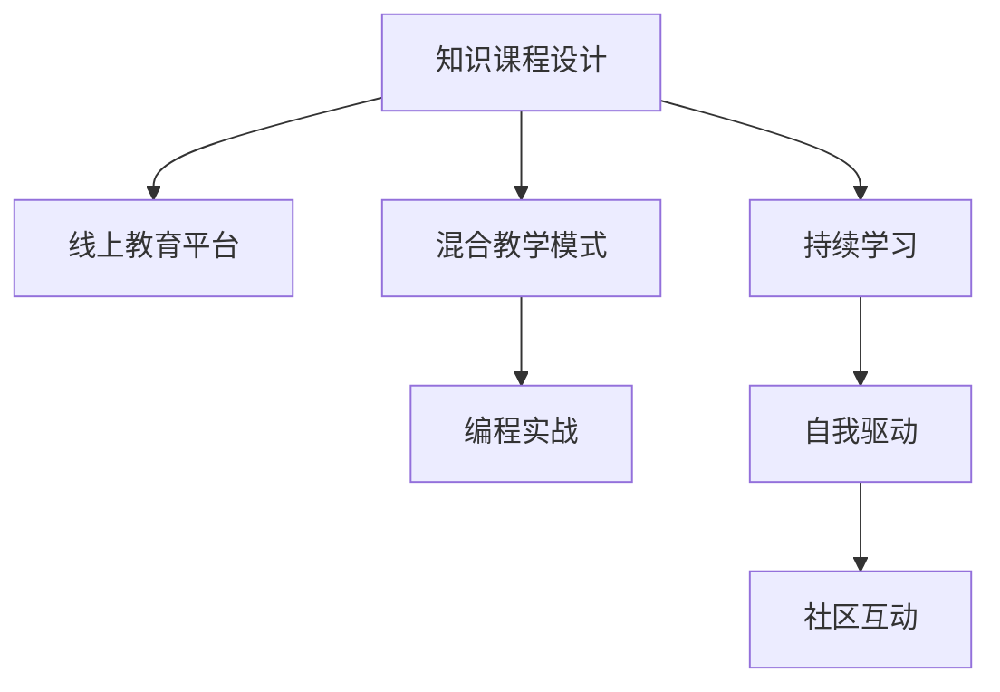

                 

# 如何打造高质量的程序员知识课程

## 1. 背景介绍

在信息爆炸的互联网时代，程序员已经成为了炙手可热的职业之一。无论是前端开发、后端开发、移动端开发还是全栈开发，程序员的门槛和要求都在不断提高。因此，如何为程序员提供高质量的知识课程，帮助他们快速掌握最新技术，成为教育培训机构和在线教育平台关注的重点。

## 2. 核心概念与联系

### 2.1 核心概念概述

为了更好地理解如何打造高质量的程序员知识课程，本节将介绍几个密切相关的核心概念：

- **知识课程设计**：指通过系统性的课程安排，教授程序员必要的基本知识和技能，帮助他们从入门到精通的过程。

- **线上教育平台**：通过互联网提供实时或录播的在线教育服务，打破了传统面对面教学的限制，方便了程序员的自主学习。

- **混合教学模式**：结合线上线下教学的优点，提供灵活多样的学习方式，满足不同学员的需求。

- **编程实战**：强调实践和动手能力的培养，通过项目实战等方式，使学员能够将理论知识转化为实际应用。

- **持续学习**：技术日新月异，程序员需要不断更新知识，保持学习动力。

- **自我驱动**：鼓励学员主动学习，通过内驱力提升自身的编程技能和职业素养。

- **社区互动**：通过技术社区、论坛、讨论组等方式，建立学员之间的交流平台，促进知识的共享和传播。

这些核心概念共同构成了高质量程序员知识课程的基石，其间的逻辑关系可以通过以下Mermaid流程图来展示：



## 3. 核心算法原理 & 具体操作步骤

### 3.1 算法原理概述

打造高质量程序员知识课程，本质上是一个系统化的教育设计过程。其核心思想是通过合理的课程结构、优质的教学内容、有效的教学方法，以及持续的学习激励机制，使学员能够系统性地掌握编程知识和技能。

形式化地，假设我们需要设计一个程序员知识课程，其中包含 $n$ 门课程 $C=\{C_1, C_2, ..., C_n\}$，每门课程 $C_i$ 包含 $m_i$ 个子课程。课程设计的目标是最小化课程 $C$ 的完成时间，即找到最优的课程安排：

$$
T^* = \mathop{\arg\min}_{C} \sum_{i=1}^n T_i
$$

其中 $T_i$ 为课程 $C_i$ 的完成时间，通常与课程的难度、学员的已有基础和学习效率有关。

### 3.2 算法步骤详解

打造高质量程序员知识课程一般包括以下几个关键步骤：

**Step 1: 需求调研与目标设定**

- 了解学员的背景、需求和目标，通过问卷、访谈等方式收集反馈。
- 确定课程目标，如掌握某项技术栈、通过某项认证等，以确保课程内容的针对性和实用性。

**Step 2: 课程结构设计**

- 设计课程的宏观结构和子课程的顺序，如基础课、进阶课、实战课等。
- 考虑学员的学习路径，合理安排难度递增的课程顺序，避免前后知识不连贯。

**Step 3: 教学内容策划**

- 选择和策划课程的知识点和案例，确保内容的时效性和实用性。
- 编写高质量的课程讲义和习题，提供丰富的学习资源，如代码库、参考资料、技术博客等。

**Step 4: 教学方法设计**

- 结合在线教育和传统教学的优点，设计灵活多样的教学方法，如视频讲解、在线讨论、小组项目等。
- 强调实践和动手能力的培养，通过项目实战等方式，使学员能够将理论知识转化为实际应用。

**Step 5: 学习激励与反馈**

- 建立持续学习的激励机制，如学习打卡、学员竞赛、奖学金等，激发学员的学习动力。
- 提供及时的反馈和评估，通过作业、测试、项目评审等方式，帮助学员发现问题并及时纠正。

**Step 6: 课程上线与推广**

- 上线课程，通过平台的用户界面设计，提升用户体验，方便学员自主学习。
- 通过推广活动、广告、合作等方式，吸引更多的学员参与课程学习。

### 3.3 算法优缺点

打造高质量程序员知识课程方法具有以下优点：

1. **系统性**：通过合理的课程结构和教学方法，使学员能够系统性地掌握编程知识和技能。
2. **实用性**：教学内容紧贴实际需求，使学员能够快速应用于工作实践。
3. **灵活性**：通过混合教学模式和多样化教学方法，满足不同学员的学习需求。
4. **持续性**：通过持续学习的激励机制，帮助学员保持长期学习动力。

同时，该方法也存在一定的局限性：

1. **教学资源需求大**：高质量课程的设计和制作需要大量的时间、人力和物力投入。
2. **学员自我管理要求高**：学员需要具备较强的自我管理和自我驱动能力，才能充分利用在线学习资源。
3. **反馈和评估难度大**：在线课程的及时反馈和评估较难实现，需要建立完善的评估体系和机制。

尽管存在这些局限性，但就目前而言，打造高质量程序员知识课程仍是提高编程教育质量、满足技术需求的重要途径。

### 3.4 算法应用领域

高质量程序员知识课程在多个领域得到了广泛的应用，例如：

- **技术培训**：为软件开发工程师、数据科学家等技术人员提供系统化的技术培训，帮助他们掌握新技能。
- **企业内训**：帮助企业员工进行职业培训，提高技术水平和工作效率。
- **学术教育**：为高校学生提供高质量的编程课程，培养他们的编程思维和实战能力。
- **自学平台**：为自学者提供灵活的在线学习资源，满足不同学习阶段和需求。

除了上述这些经典应用外，高质量程序员知识课程也被创新性地应用到更多场景中，如职业发展指导、技术转型培训等，为技术人才的职业发展提供了新的路径。

## 4. 数学模型和公式 & 详细讲解 & 举例说明

### 4.1 数学模型构建

本节将使用数学语言对高质量程序员知识课程的设计过程进行更加严格的刻画。

假设课程设计过程中，每个子课程 $C_{i,j}$ 的难度为 $D_{i,j}$，学员的学习效率为 $L_i$，课程 $C_i$ 的完成时间可以表示为：

$$
T_i = \sum_{j=1}^{m_i} \frac{D_{i,j}}{L_i}
$$

课程设计过程可以看作是一个优化问题，目标是最小化总完成时间：

$$
\min \sum_{i=1}^n T_i = \sum_{i=1}^n \sum_{j=1}^{m_i} \frac{D_{i,j}}{L_i}
$$

### 4.2 公式推导过程

我们可以通过求导和优化算法，计算出每门课程的完成时间。具体步骤如下：

1. 将课程完成时间表示为课程难度和学员学习效率的函数：
   $$
   T_i = \sum_{j=1}^{m_i} \frac{D_{i,j}}{L_i}
   $$

2. 对每门课程的完成时间求导，得到每门课程对课程难度和学员学习效率的偏导数：
   $$
   \frac{\partial T_i}{\partial D_{i,j}} = -\frac{1}{L_i}, \quad \frac{\partial T_i}{\partial L_i} = -\frac{D_{i,j}}{L_i^2}
   $$

3. 通过优化算法，如梯度下降、遗传算法等，最小化总完成时间：
   $$
   \min \sum_{i=1}^n \sum_{j=1}^{m_i} \frac{D_{i,j}}{L_i}
   $$

### 4.3 案例分析与讲解

以编程实战课程为例，分析课程设计的具体过程。

假设课程 $C_1$ 包含两个子课程 $C_{1,1}$ 和 $C_{1,2}$，每个子课程的难度和学员学习效率如下表所示：

| 子课程 | 课程难度 $D$ | 学员学习效率 $L$ |
| --- | --- | --- |
| $C_{1,1}$ | 2 | 1 |
| $C_{1,2}$ | 3 | 1.5 |

课程总难度为 $D = D_{1,1} + D_{1,2} = 2 + 3 = 5$，学员总学习效率为 $L = L_1 + L_2 = 1 + 1.5 = 2.5$。

课程 $C_1$ 的完成时间为：
$$
T_1 = \frac{D}{L} = \frac{5}{2.5} = 2
$$

这个例子展示了如何通过数学模型和公式推导，科学地设计课程。

## 5. 项目实践：代码实例和详细解释说明

### 5.1 开发环境搭建

在进行课程实践前，我们需要准备好开发环境。以下是使用Python进行在线教育平台开发的常见环境配置流程：

1. 安装Python：从官网下载并安装Python 3.x版本。
2. 安装Flask框架：
   ```bash
   pip install Flask
   ```
3. 安装MySQL或MongoDB：安装对应的数据库软件，并搭建数据库环境。
4. 安装Web开发工具：如PyCharm、Sublime Text等，方便开发和调试。

### 5.2 源代码详细实现

下面我们以在线编程课程为例，给出使用Flask框架搭建在线教育平台的PyTorch代码实现。

首先，定义课程、学员和课程进度等模型：

```python
from flask_sqlalchemy import SQLAlchemy
from flask import Flask

app = Flask(__name__)
app.config['SQLALCHEMY_DATABASE_URI'] = 'sqlite:///course.db'
db = SQLAlchemy(app)

class Course(db.Model):
    id = db.Column(db.Integer, primary_key=True)
    name = db.Column(db.String(64), index=True, unique=True)
    duration = db.Column(db.Float)
    def __init__(self, name, duration):
        self.name = name
        self.duration = duration

class Student(db.Model):
    id = db.Column(db.Integer, primary_key=True)
    name = db.Column(db.String(64), index=True, unique=True)
    def __init__(self, name):
        self.name = name

class CourseProgress(db.Model):
    student_id = db.Column(db.Integer, db.ForeignKey('student.id', ondelete='CASCADE'))
    course_id = db.Column(db.Integer, db.ForeignKey('course.id', ondelete='CASCADE'))
    progress = db.Column(db.Float)
    def __init__(self, student, course, progress):
        self.student_id = student.id
        self.course_id = course.id
        self.progress = progress
```

然后，定义API接口，支持学员注册、登录、课程学习等功能：

```python
from flask import request, jsonify

@app.route('/register', methods=['POST'])
def register():
    data = request.json
    student = Student(name=data['name'])
    db.session.add(student)
    db.session.commit()
    return jsonify({'message': 'Student registered successfully'})

@app.route('/login', methods=['POST'])
def login():
    data = request.json
    student = Student.query.filter_by(name=data['name']).first()
    if student:
        return jsonify({'message': 'Login successful'})
    else:
        return jsonify({'message': 'Invalid username or password'})

@app.route('/courses', methods=['GET'])
def courses():
    courses = Course.query.all()
    result = []
    for course in courses:
        result.append({'name': course.name, 'duration': course.duration})
    return jsonify(result)
```

最后，启动Web服务，运行API：

```python
if __name__ == '__main__':
    app.run(debug=True)
```

以上就是使用Flask框架搭建在线编程课程的完整代码实现。可以看到，Flask提供了灵活的API接口设计，方便开发者实现各种功能。

### 5.3 代码解读与分析

让我们再详细解读一下关键代码的实现细节：

**SQLAlchemy库**：
- 用于实现数据库的CRUD操作，方便课程、学员等实体的创建、查询、更新和删除。

**Flask框架**：
- 提供RESTful风格的API接口，通过HTTP请求处理学员注册、登录、课程学习等功能。
- 使用Flask SQLAlchemy扩展，简化数据库操作的代码实现。

**API接口**：
- `/register`：处理学员注册请求，创建学员记录并保存到数据库。
- `/login`：处理学员登录请求，根据用户名查询学员记录并返回登录状态。
- `/courses`：查询所有课程信息，返回JSON格式的数据。

这些接口展示了如何通过Python和Flask框架，实现基本的在线教育平台功能。在实际应用中，还需要考虑更多的安全和性能优化问题，如用户认证、数据加密、缓存等。

## 6. 实际应用场景

### 6.1 企业内训

基于高质量程序员知识课程的企业内训系统，可以大幅提升企业员工的技术水平和工作效率。企业可以根据自己的需求，定制不同的课程内容，如Java、Python、前端开发等。通过在线教育平台，员工可以随时随地进行学习，培训讲师可以实时在线解答问题，确保培训效果。

### 6.2 高校教育

高质量程序员知识课程为高校提供了系统化的编程教育资源，帮助学生掌握编程基础和实战技能。在高校中，可以利用在线平台进行课程教学，灵活安排上课时间和地点，同时提供丰富的学习资源和项目实战机会，提高学生的学习兴趣和实践能力。

### 6.3 自学平台

自学平台为自学者提供了灵活多样的学习资源，如在线视频、编程实战项目、社区讨论等，使学员能够自由安排学习进度，高效掌握编程知识和技能。自学平台还可以通过激励机制和奖励机制，激发学员的学习动力，提高学习效果。

### 6.4 未来应用展望

随着在线教育技术的不断进步，高质量程序员知识课程将在更多领域得到应用，为技术人才的培养和转型提供新的机遇。

在智慧医疗领域，基于高质量编程课程的教育平台可以为医学生提供系统化的技术培训，提高他们的编程技能和数据分析能力，更好地服务于医疗事业。

在智能制造领域，高质量编程课程可以帮助制造工程师掌握自动化、物联网等技术，提高生产效率和产品质量。

在未来，高质量程序员知识课程将通过人工智能和大数据分析技术，实现更加个性化和智能化的学习推荐，使学员能够更加高效地掌握编程知识和技能。

## 7. 工具和资源推荐

### 7.1 学习资源推荐

为了帮助开发者系统掌握高质量程序员知识课程的设计和开发，这里推荐一些优质的学习资源：

1. **《编程实战》系列书籍**：深入浅出地介绍了编程实战技术，包括算法设计、数据结构、Web开发、人工智能等领域的实用技巧。
2. **《算法导论》**：经典的计算机科学教材，全面介绍了算法设计和分析的基础知识。
3. **Coursera和edX**：提供大量高质量的编程课程，涵盖前端、后端、移动开发等多个方向，方便学员自主学习。
4. **Kaggle竞赛**：参与实际的数据科学和机器学习竞赛，锻炼编程能力和问题解决能力。
5. **GitHub和GitLab**：全球最大的开源社区，提供丰富的代码库和项目实战机会，方便学员实践和交流。

通过对这些资源的学习实践，相信你一定能够掌握高质量程序员知识课程的设计和开发方法，为程序员提供高效的学习资源。

### 7.2 开发工具推荐

高效的开发离不开优秀的工具支持。以下是几款用于高质量程序员知识课程开发的常用工具：

1. **Visual Studio Code**：功能强大的代码编辑器，支持多种编程语言和插件扩展，适合编程课程开发。
2. **Jupyter Notebook**：交互式的数据分析和编程平台，方便学员进行实战项目的开发和展示。
3. **Docker和Kubernetes**：容器化技术，方便课程部署和扩展，提供灵活的开发和测试环境。
4. **Slack和Discord**：在线社区平台，方便学员交流和讨论，提供及时的技术支持。

合理利用这些工具，可以显著提升高质量程序员知识课程的开发效率，加快创新迭代的步伐。

### 7.3 相关论文推荐

高质量程序员知识课程的设计和开发研究已经取得了一定的成果，以下是几篇奠基性的相关论文，推荐阅读：

1. **《在线编程课程设计与实施的探索》**：详细探讨了在线编程课程的设计、开发和实施方法，为高质量编程课程提供了实用的指导。
2. **《编程教育的系统化设计》**：介绍了系统化编程教育的设计理念和实践案例，强调了课程内容的时效性和实用性。
3. **《混合教学模式在编程课程中的应用》**：研究了混合教学模式在编程课程中的具体应用，展示了其灵活性和有效性。

这些论文代表了大规模编程教育研究的进展，提供了丰富的参考和借鉴。

## 8. 总结：未来发展趋势与挑战

### 8.1 研究成果总结

高质量程序员知识课程的设计和开发已经在教育和技术领域得到了广泛应用，取得了显著成效。通过系统性的课程设计、灵活多样的教学方法，以及持续学习的激励机制，学员能够高效地掌握编程知识和技能。

### 8.2 未来发展趋势

展望未来，高质量程序员知识课程的设计和开发将呈现以下几个发展趋势：

1. **个性化学习**：通过人工智能和大数据分析技术，实现更加个性化和智能化的学习推荐，使学员能够更加高效地掌握编程知识和技能。
2. **跨学科融合**：与其他学科领域的知识和技术进行交叉融合，如数据科学、人工智能、区块链等，培养复合型技术人才。
3. **社区建设**：建立强大的技术社区和讨论平台，提供丰富的学习资源和社区互动机会，促进知识的共享和传播。
4. **混合教学模式**：结合线上线下教学的优点，提供灵活多样的学习方式，满足不同学员的需求。
5. **多语言支持**：为非英语国家的学员提供多语言支持，使编程课程更加普及和普惠。

这些趋势表明，高质量程序员知识课程的设计和开发将不断适应技术发展和教育需求的变化，推动编程教育的持续进步。

### 8.3 面临的挑战

尽管高质量程序员知识课程的设计和开发已经取得了一定成果，但在迈向更加智能化、普适化应用的过程中，仍面临着诸多挑战：

1. **教学资源需求大**：高质量课程的设计和制作需要大量的时间、人力和物力投入，成本较高。
2. **学员自我管理要求高**：学员需要具备较强的自我管理和自我驱动能力，才能充分利用在线学习资源。
3. **反馈和评估难度大**：在线课程的及时反馈和评估较难实现，需要建立完善的评估体系和机制。
4. **教学质量监控**：确保课程内容的准确性和时效性，避免误导学员。
5. **技术支持不足**：在线教育平台需要强大的技术支持，包括网站性能优化、数据安全等。

这些挑战需要教育机构和技术团队共同努力，不断优化课程设计和教学方法，提升学员的学习体验和效果。

### 8.4 研究展望

面对高质量程序员知识课程设计和开发所面临的挑战，未来的研究需要在以下几个方面寻求新的突破：

1. **技术融合**：将人工智能和大数据分析技术应用于课程设计，实现更加个性化和智能化的学习推荐。
2. **内容创新**：结合最新的技术发展，不断更新课程内容和教学方法，保持课程的时效性和实用性。
3. **社区建设**：建立强大的技术社区和讨论平台，提供丰富的学习资源和社区互动机会，促进知识的共享和传播。
4. **混合教学模式**：结合线上线下教学的优点，提供灵活多样的学习方式，满足不同学员的需求。
5. **多语言支持**：为非英语国家的学员提供多语言支持，使编程课程更加普及和普惠。

这些研究方向的探索，必将引领高质量程序员知识课程的设计和开发迈向更高的台阶，为编程教育的持续进步提供新的动力。

## 9. 附录：常见问题与解答

**Q1：高质量程序员知识课程的设计需要考虑哪些因素？**

A: 高质量程序员知识课程的设计需要考虑以下几个因素：
1. **目标设定**：明确课程的目标，如掌握某项技术栈、通过某项认证等，以确保课程内容的针对性和实用性。
2. **课程结构**：设计课程的宏观结构和子课程的顺序，如基础课、进阶课、实战课等，确保课程内容的连贯性和难度递增。
3. **教学内容**：选择和策划课程的知识点和案例，确保内容的时效性和实用性，提供丰富的学习资源。
4. **教学方法**：结合在线教育和传统教学的优点，设计灵活多样的教学方法，如视频讲解、在线讨论、小组项目等。
5. **学习激励**：建立持续学习的激励机制，如学习打卡、学员竞赛、奖学金等，激发学员的学习动力。

**Q2：高质量程序员知识课程的开发需要哪些资源？**

A: 高质量程序员知识课程的开发需要以下资源：
1. **开发工具**：如Python、Flask、SQLAlchemy等，用于实现课程数据管理和API接口开发。
2. **学习资源**：如书籍、在线课程、编程实战项目等，用于支持学员自主学习和实战练习。
3. **开发环境**：如Jupyter Notebook、Visual Studio Code等，提供灵活多样的开发和测试环境。
4. **技术支持**：如Docker、Kubernetes等，用于课程部署和扩展，提供稳定的服务环境。
5. **社区平台**：如Slack、Discord等，方便学员交流和讨论，提供及时的技术支持。

**Q3：如何提升高质量程序员知识课程的学员学习效果？**

A: 提升高质量程序员知识课程的学员学习效果可以从以下几个方面入手：
1. **系统性设计**：设计合理的课程结构和教学方法，确保课程内容的连贯性和实用性。
2. **灵活多样**：提供灵活多样的学习方式，如视频讲解、在线讨论、小组项目等，满足不同学员的需求。
3. **实践导向**：强调实践和动手能力的培养，通过项目实战等方式，使学员能够将理论知识转化为实际应用。
4. **持续激励**：建立持续学习的激励机制，如学习打卡、学员竞赛、奖学金等，激发学员的学习动力。
5. **及时反馈**：提供及时的反馈和评估，通过作业、测试、项目评审等方式，帮助学员发现问题并及时纠正。

通过这些方法，可以显著提升学员的学习效果，帮助他们高效地掌握编程知识和技能。

**Q4：高质量程序员知识课程的未来发展方向是什么？**

A: 高质量程序员知识课程的未来发展方向包括以下几个方面：
1. **个性化学习**：通过人工智能和大数据分析技术，实现更加个性化和智能化的学习推荐，使学员能够更加高效地掌握编程知识和技能。
2. **跨学科融合**：与其他学科领域的知识和技术进行交叉融合，如数据科学、人工智能、区块链等，培养复合型技术人才。
3. **社区建设**：建立强大的技术社区和讨论平台，提供丰富的学习资源和社区互动机会，促进知识的共享和传播。
4. **混合教学模式**：结合线上线下教学的优点，提供灵活多样的学习方式，满足不同学员的需求。
5. **多语言支持**：为非英语国家的学员提供多语言支持，使编程课程更加普及和普惠。

这些发展方向表明，高质量程序员知识课程将不断适应技术发展和教育需求的变化，推动编程教育的持续进步。

---

作者：禅与计算机程序设计艺术 / Zen and the Art of Computer Programming

