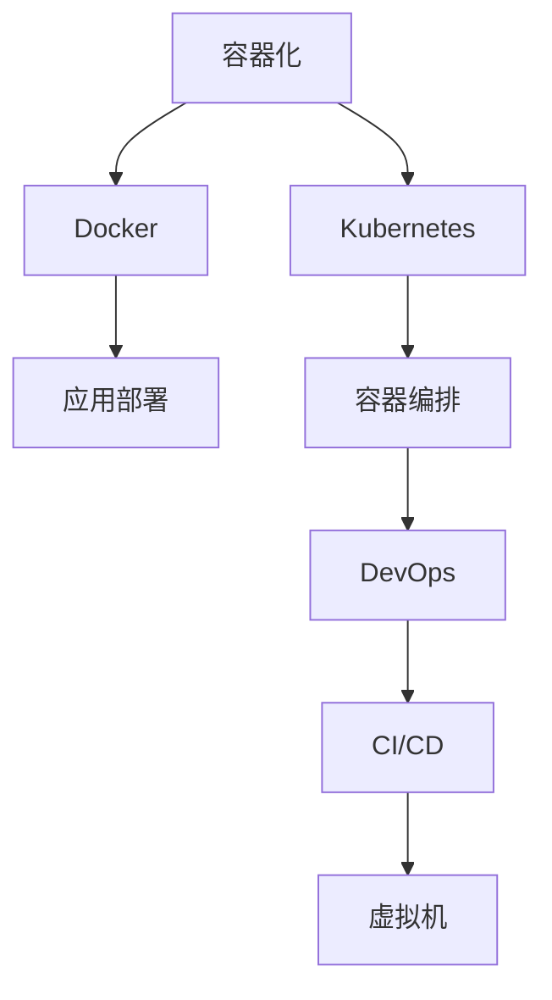

                 

# 容器化技术：Docker 和 Kubernetes

> 关键词：容器化, Docker, Kubernetes, 虚拟机, 微服务, 容器编排, DevOps, 持续集成, 云计算

## 1. 背景介绍

### 1.1 问题由来

随着互联网应用的蓬勃发展，传统的单体应用架构越来越难以适应大规模、高并发的业务需求。为解决这一问题，微服务架构应运而生，将单体应用拆分为多个小而美的服务，每个服务独立部署、运行、扩展。但这种架构也带来了新的挑战，如服务的版本管理、跨服务器迁移、资源管理等。此时，容器技术便成了微服务架构的理想载体，Docker 和 Kubernetes 由此应运而生。

### 1.2 问题核心关键点

容器化技术的核心在于将应用打包到容器中，通过容器引擎（如 Docker）来统一管理和调度。容器化技术具有诸多优点，如轻量级、跨平台、便于管理等。Docker 是当前最流行的容器技术，而 Kubernetes 则是最先进的容器编排工具。本文将从这两个方面展开介绍，重点讲述它们的核心概念、工作原理、应用场景等。

## 2. 核心概念与联系

### 2.1 核心概念概述

- **容器化（Containerization）**：将应用及其依赖打包到一个标准化的、可移植的容器中的过程。容器化后的应用在任意环境中都能稳定运行。

- **Docker**：一款开源的容器引擎，可以将应用打包成 Docker 镜像，并在任意支持 Docker 的平台上运行。Docker 通过容器隔离应用，保证了其独立性、一致性和可移植性。

- **Kubernetes（K8s）**：一款开源的容器编排工具，可以自动化地管理容器的部署、扩展、更新等生命周期管理。Kubernetes 通过强大的集群管理能力，确保了微服务架构的高可用性和自动扩展性。

- **容器编排**：对容器进行统一管理和调度，包括容器的部署、扩展、迁移、监控等。Kubernetes 是最先进的容器编排工具，能够有效管理大规模的容器集群。

- **DevOps**：开发与运维的结合，强调自动化、持续集成和持续交付。容器化技术能够大大简化 DevOps 流程，加速应用的部署和更新。

- **持续集成/持续交付（CI/CD）**：持续集成将代码变更与测试自动化，持续交付将变更快速、稳定地部署到生产环境。容器化技术可以与 CI/CD 工具无缝集成，提高开发效率和部署速度。

- **虚拟机（VM）**：传统的软件部署方式，将应用运行在隔离的虚拟硬件环境中。虚拟化技术虽然隔离性高，但资源利用率低、启动时间长。容器化技术可以视为一种轻量级虚拟化方式。

这些核心概念通过 Mermaid 流程图展现如下：



## 3. 核心算法原理 & 具体操作步骤

### 3.1 算法原理概述

容器化技术的原理是通过容器引擎将应用打包成容器镜像，容器引擎负责创建、管理容器。容器引擎通过在主机上创建隔离的用户空间，将应用及其依赖打包在一个标准化的、可移植的容器镜像中。这样，应用和其依赖便可独立运行在任何支持容器引擎的环境中，实现了跨平台、跨环境的可移植性。

### 3.2 算法步骤详解

容器化技术主要涉及以下几个关键步骤：

**Step 1: 应用打包**
- 将应用代码和其依赖打包到容器镜像中，可以是 Dockerfile 或直接在容器镜像上手工制作。
- 应用和依赖文件需提前构建好，以便后续容器化部署。

**Step 2: 容器引擎创建容器**
- 在主机上，容器引擎（如 Docker）根据容器镜像创建容器。
- 容器引擎创建隔离的用户空间，应用独立运行。

**Step 3: 容器编排**
- 使用 Kubernetes 等容器编排工具，对容器进行统一管理。
- Kubernetes 负责容器的部署、扩展、迁移、监控等。

**Step 4: DevOps 自动化**
- 将容器化技术与 CI/CD 工具集成，实现应用的自动化部署和更新。
- 通过自动化脚本，完成应用的持续集成和持续交付。

**Step 5: 监控与调优**
- 使用监控工具（如 Prometheus）对容器集群进行实时监控。
- 根据监控数据进行调优，保证应用稳定运行。

### 3.3 算法优缺点

容器化技术具有以下优点：
1. 轻量级：容器镜像大小约为几MB，启动速度快。
2. 跨平台：容器镜像在任意支持容器引擎的环境中都能运行。
3. 易于管理：容器引擎提供统一的管理界面，简化运维工作。
4. 弹性扩展：Kubernetes 支持自动扩展和负载均衡，适应大规模应用场景。
5. 安全隔离：容器提供独立的用户空间隔离，防止应用间互相影响。

同时，容器化技术也存在一些缺点：
1. 复杂性高：容器编排工具和 DevOps 流程需要较高的技术门槛。
2. 资源利用率低：虽然容器轻量，但容器编排和调度过程有一定开销。
3. 依赖管理：容器依赖关系需要提前打包，不够灵活。
4. 兼容性差：不同容器引擎版本间可能存在兼容性问题。
5. 学习曲线陡：对于习惯了虚拟机和传统部署方式的用户，容器化技术的上手难度较大。

### 3.4 算法应用领域

容器化技术广泛应用于以下领域：

- **微服务架构**：将单体应用拆分为多个微服务，每个微服务独立部署、扩展。
- **云原生应用**：在云平台（如 Kubernetes、AWS ECS）上运行容器化应用，实现高可用、自动扩展。
- **DevOps 自动化**：通过自动化脚本，实现持续集成和持续交付，提升开发效率。
- **边缘计算**：在资源有限的边缘设备上运行容器化应用，实现高效资源利用。
- **DevOps 运维**：通过容器编排工具，实现自动化运维、监控和故障恢复。

## 4. 数学模型和公式 & 详细讲解

### 4.1 数学模型构建

容器化技术主要涉及容器镜像的构建和管理，以及容器的部署和调度。本文以 Dockerfile 为例，讲述容器的构建过程。

一个标准的 Dockerfile 包括：

- FROM：指定基础镜像。
- COPY、ADD：将文件或目录复制到容器镜像中。
- RUN：在容器镜像中执行命令。
- EXPOSE：设置容器对外服务的端口。
- CMD、ENTRYPOINT：指定容器的启动命令。

### 4.2 公式推导过程

以一个简单的 Dockerfile 为例，推导其构建过程。

```Dockerfile
# 使用 Ubuntu 镜像作为基础镜像
FROM ubuntu:latest

# 安装 dependencies
RUN apt-get update && apt-get install -y curl && apt-get clean

# 将 nginx 源代码复制到镜像中
COPY nginx-1.19.2.tar.gz .
WORKDIR /usr/src/nginx

# 解压 nginx 源代码
RUN tar -C /usr/src/nginx -xzvf nginx-1.19.2.tar.gz

# 进入 nginx 目录，编译安装
RUN cd /usr/src/nginx && ./configure --prefix=/usr && make -j 4 && make install

# 将 nginx 配置文件复制到 /etc/nginx 目录
COPY nginx.conf /etc/nginx/nginx.conf

# 设置 nginx 服务监听 80 端口
EXPOSE 80

# 指定 nginx 启动命令
CMD ["nginx", "-g", "daemon off;"]
```

上述 Dockerfile 构建的镜像包括 Ubuntu 系统和 nginx 服务，满足以下要求：

- 安装 dependencies
- 解压 nginx 源代码
- 编译安装 nginx 服务
- 配置 nginx 监听 80 端口

### 4.3 案例分析与讲解

假设我们有一个 nginx 服务，需要在其基础上添加一些功能，如 Nginx Load Balancer。可以通过 Dockerfile 来实现：

```Dockerfile
# 使用 Ubuntu 镜像作为基础镜像
FROM ubuntu:latest

# 安装 dependencies
RUN apt-get update && apt-get install -y curl && apt-get clean

# 将 nginx 源代码复制到镜像中
COPY nginx-1.19.2.tar.gz .
WORKDIR /usr/src/nginx

# 解压 nginx 源代码
RUN tar -C /usr/src/nginx -xzvf nginx-1.19.2.tar.gz

# 进入 nginx 目录，编译安装 nginx 服务
RUN cd /usr/src/nginx && ./configure --prefix=/usr && make -j 4 && make install

# 将 nginx 配置文件复制到 /etc/nginx 目录
COPY nginx.conf /etc/nginx/nginx.conf

# 设置 nginx 服务监听 80 端口
EXPOSE 80

# 添加 Nginx Load Balancer 功能
RUN apt-get install -y nloadbalancer

# 配置 Nginx Load Balancer
COPY loadbalancer.conf /etc/nginx/nginx-loadbalancer.conf

# 设置 nginx 启动命令
CMD ["nginx", "-g", "daemon off;"]
```

在上述 Dockerfile 中，我们通过 apt-get 安装 Nginx Load Balancer，并配置了相应的 nginx-loadbalancer.conf 文件。最终构建的容器镜像将包含 nginx 和 Nginx Load Balancer，能够满足业务需求。

## 5. 项目实践：代码实例和详细解释说明

### 5.1 开发环境搭建

开发环境搭建包括 Docker 和 Kubernetes 的安装和配置。以下是详细的步骤：

1. 安装 Docker：从官网下载并安装 Docker CE，需配置 Docker 引擎和 Docker Compose。

2. 安装 Kubernetes：在 Linux 上使用 kubeadm 安装 Kubernetes 集群，包括 Master 和 Node。

3. 安装 kubectl：从官网下载并安装 kubectl，用于管理 Kubernetes 集群。

4. 安装 Helm：使用 curl 安装 Helm，用于部署和管理 Kubernetes 应用。

5. 安装 Minikube：使用 Minikube 在本地搭建 Kubernetes 集群，方便开发和测试。

### 5.2 源代码详细实现

以下是一个基于 Dockerfile 和 Kubernetes 的微服务应用示例，包括 nginx 服务和 Redis 服务：

**Dockerfile 示例**：

```Dockerfile
# 使用 Ubuntu 镜像作为基础镜像
FROM ubuntu:latest

# 安装 dependencies
RUN apt-get update && apt-get install -y curl && apt-get clean

# 将 nginx 源代码复制到镜像中
COPY nginx-1.19.2.tar.gz .
WORKDIR /usr/src/nginx

# 解压 nginx 源代码
RUN tar -C /usr/src/nginx -xzvf nginx-1.19.2.tar.gz

# 进入 nginx 目录，编译安装 nginx 服务
RUN cd /usr/src/nginx && ./configure --prefix=/usr && make -j 4 && make install

# 将 nginx 配置文件复制到 /etc/nginx 目录
COPY nginx.conf /etc/nginx/nginx.conf

# 设置 nginx 服务监听 80 端口
EXPOSE 80

# 添加 Redis 服务
RUN apt-get install -y redis-server

# 配置 Redis 监听 6379 端口
COPY redis.conf /etc/redis/redis.conf

# 设置 nginx 启动命令
CMD ["nginx", "-g", "daemon off;"]
```

**Kubernetes 部署示例**：

```yaml
apiVersion: v1
kind: Deployment
metadata:
  name: nginx-deployment
spec:
  replicas: 3
  selector:
    matchLabels:
      app: nginx
  template:
    metadata:
      labels:
        app: nginx
    spec:
      containers:
      - name: nginx
        image: <image_name>
        ports:
        - containerPort: 80
---
apiVersion: v1
kind: Service
metadata:
  name: nginx-service
spec:
  selector:
    app: nginx
  ports:
    - protocol: TCP
      port: 80
      targetPort: 80
---
apiVersion: v1
kind: Deployment
metadata:
  name: redis-deployment
spec:
  replicas: 3
  selector:
    matchLabels:
      app: redis
  template:
    metadata:
      labels:
        app: redis
    spec:
      containers:
      - name: redis
        image: <image_name>
        ports:
        - containerPort: 6379
---
apiVersion: v1
kind: Service
metadata:
  name: redis-service
spec:
  selector:
    app: redis
  ports:
    - protocol: TCP
      port: 6379
      targetPort: 6379
```

### 5.3 代码解读与分析

在上述示例中，我们使用 Dockerfile 打包了 nginx 服务和 Redis 服务，并使用 Kubernetes 进行容器编排。

**Dockerfile 分析**：
- FROM ubuntu:latest：指定基础镜像。
- COPY nginx-1.19.2.tar.gz . 和 WORKDIR /usr/src/nginx：将 nginx 源代码复制到镜像中，并进入 nginx 目录。
- RUN cd /usr/src/nginx && ./configure --prefix=/usr && make -j 4 && make install：编译安装 nginx 服务。
- COPY nginx.conf /etc/nginx/nginx.conf 和 EXPOSE 80：将 nginx 配置文件复制到镜像中，并设置 nginx 监听 80 端口。
- apt-get install -y redis-server 和 COPY redis.conf /etc/redis/redis.conf：安装并配置 Redis 服务。
- CMD ["nginx", "-g", "daemon off;"]：设置 nginx 启动命令。

**Kubernetes 分析**：
- Deployment：定义容器镜像、副本数量、标签和选择器。
- Service：定义服务监听端口和目标端口，实现负载均衡。
- Helm：使用 Helm 部署和管理 Kubernetes 应用。

**代码执行结果**：
- 通过 kubectl apply -f <yaml_file> 将 Kubernetes 部署文件应用到集群中。
- 容器镜像通过 Docker 推送到容器仓库，如 Docker Hub 或 Docker Registry，并在 Kubernetes 中自动拉取。
- 容器服务自动部署和扩展，保证高可用性和负载均衡。

## 6. 实际应用场景

### 6.1 智能推荐系统

基于容器化技术的智能推荐系统，可以通过微服务架构实现高效扩展和灵活更新。推荐系统中的每个模块独立部署、扩展，提升了系统的可扩展性和可维护性。

在实际部署中，推荐系统各个组件容器化后，通过 Kubernetes 进行统一管理和调度。可以根据用户请求实时动态扩展容器实例，保证服务稳定性。同时，推荐系统可以不断接入新的数据和算法，通过 CI/CD 自动化流程，快速迭代和发布。

### 6.2 金融交易系统

金融交易系统对实时性和稳定性要求极高。通过容器化技术，金融交易系统可以实现高可用和快速扩展。交易系统中的数据库、中间件、服务端等组件容器化后，通过 Kubernetes 进行统一管理和调度。可以配置自动扩展和故障转移策略，保证系统稳定运行。

在实际应用中，金融交易系统可以基于容器编排工具，自动部署和扩展容器实例。同时，通过 Helm 进行应用部署和管理，方便开发者进行迭代和更新。

### 6.3 电商购物系统

电商购物系统需要支持大规模并发访问和高可用性。通过容器化技术，电商购物系统可以实现快速扩展和灵活部署。购物系统中的商品库、订单库、用户库等组件容器化后，通过 Kubernetes 进行统一管理和调度。可以配置自动扩展和负载均衡策略，保证服务稳定性。

在实际应用中，电商购物系统可以基于容器编排工具，自动部署和扩展容器实例。同时，通过 Helm 进行应用部署和管理，方便开发者进行迭代和更新。

### 6.4 未来应用展望

未来，容器化技术将进一步拓展其应用领域，推动更多行业的数字化转型。以下是对容器化技术未来发展的一些展望：

- **边缘计算**：在资源有限的边缘设备上运行容器化应用，实现高效资源利用。
- **云原生应用**：在云平台（如 AWS ECS、Google Cloud Kubernetes Engine）上运行容器化应用，实现高可用、自动扩展。
- **DevOps 自动化**：通过自动化脚本，实现持续集成和持续交付，提升开发效率。
- **微服务架构**：通过容器化技术实现微服务架构，提升系统的可扩展性和可维护性。
- **服务网格**：通过服务网格（如 Istio）实现微服务间的通信和流量管理，保证系统稳定性和可观测性。
- **自动化运维**：通过自动化工具（如 Ansible、Puppet）和容器编排工具，实现自动化运维和监控。
- **持续集成/持续交付**：通过自动化工具和容器编排工具，实现应用的持续集成和持续交付。

总之，容器化技术将推动更多行业实现数字化转型，提升系统的可扩展性、可维护性和自动化水平。未来，容器化技术将进一步与区块链、大数据、人工智能等前沿技术相结合，带来更多创新应用。

## 7. 工具和资源推荐

### 7.1 学习资源推荐

以下是一些推荐的容器化技术学习资源：

1. **Docker 官方文档**：Docker 官方文档提供了全面的容器化技术介绍，包括 Dockerfile、Docker Compose、Docker Swarm 等。

2. **Kubernetes 官方文档**：Kubernetes 官方文档提供了详细的容器编排技术介绍，包括 Kubernetes 架构、资源管理、应用部署等。

3. **《Docker 实战》**：本书详细介绍了 Docker 的原理和应用场景，适合实战练习。

4. **《Kubernetes 实战》**：本书详细介绍了 Kubernetes 的原理和应用场景，适合实战练习。

5. **《Kubernetes 权威指南》**：本书提供了 Kubernetes 的全面介绍，适合深入学习和实践。

6. **《Cloud Native Patterns》**：本书介绍了云原生应用的架构和实践，适合学习和参考。

### 7.2 开发工具推荐

以下是一些推荐的容器化开发工具：

1. **Docker**：开源的容器引擎，可以容器化应用，实现跨平台部署。

2. **Kubernetes**：开源的容器编排工具，可以自动化管理容器集群。

3. **Docker Compose**：简化容器编排的工具，适合本地开发和测试。

4. **Kubernetes Dashboard**：可视化界面，方便管理 Kubernetes 集群。

5. **Helm**：包管理工具，方便应用部署和管理。

6. **Prometheus**：监控工具，实时监控 Kubernetes 集群。

7. **Minikube**：本地 Kubernetes 集群，方便开发和测试。

### 7.3 相关论文推荐

以下是一些推荐的容器化技术相关论文：

1. **《Docker 设计模式》**：研究 Docker 的设计模式和原理，适合深入学习和理解。

2. **《Kubernetes 架构设计》**：介绍 Kubernetes 的架构和设计思想，适合深入学习和参考。

3. **《云计算的未来：微服务、容器和 Kubernetes》**：讨论云计算的未来发展趋势，适合学习和参考。

4. **《微服务架构设计模式》**：介绍微服务架构的设计模式和实践，适合学习和参考。

5. **《云原生应用开发指南》**：介绍云原生应用架构和实践，适合学习和参考。

## 8. 总结：未来发展趋势与挑战

### 8.1 研究成果总结

本文从容器化技术的原理、操作步骤、实际应用等方面，全面介绍了容器化技术的核心概念和实践方法。通过详细阐述 Docker 和 Kubernetes 的技术细节，帮助读者系统掌握容器化技术的理论和实践。

### 8.2 未来发展趋势

容器化技术将持续发展，推动更多行业实现数字化转型。未来，容器化技术将进一步拓展其应用领域，带来更多创新应用：

- **边缘计算**：在资源有限的边缘设备上运行容器化应用，实现高效资源利用。
- **云原生应用**：在云平台（如 AWS ECS、Google Cloud Kubernetes Engine）上运行容器化应用，实现高可用、自动扩展。
- **DevOps 自动化**：通过自动化脚本，实现持续集成和持续交付，提升开发效率。
- **微服务架构**：通过容器化技术实现微服务架构，提升系统的可扩展性和可维护性。
- **服务网格**：通过服务网格（如 Istio）实现微服务间的通信和流量管理，保证系统稳定性和可观测性。
- **自动化运维**：通过自动化工具（如 Ansible、Puppet）和容器编排工具，实现自动化运维和监控。
- **持续集成/持续交付**：通过自动化工具和容器编排工具，实现应用的持续集成和持续交付。

### 8.3 面临的挑战

尽管容器化技术已经取得了显著进展，但在实际应用中仍面临一些挑战：

1. **复杂性高**：容器编排工具和 DevOps 流程需要较高的技术门槛，需要开发者具备一定的技术背景。
2. **资源利用率低**：虽然容器轻量，但容器编排和调度过程有一定开销，资源利用率仍需优化。
3. **依赖管理**：容器依赖关系需要提前打包，不够灵活，增加了开发和部署的复杂度。
4. **兼容性差**：不同容器引擎版本间可能存在兼容性问题，增加了运维的难度。
5. **学习曲线陡**：对于习惯了虚拟机和传统部署方式的用户，容器化技术的上手难度较大。

### 8.4 研究展望

未来，容器化技术的研究方向可以从以下几个方面继续探索：

1. **资源优化**：进一步优化容器编排和调度过程，提高资源利用率。
2. **自动化管理**：进一步简化 DevOps 流程，提升应用的自动化管理水平。
3. **容器融合**：将容器技术与区块链、大数据、人工智能等前沿技术相结合，带来更多创新应用。
4. **微服务架构**：进一步优化微服务架构，提升系统的可扩展性和可维护性。
5. **服务网格**：进一步完善服务网格技术，提升微服务间的通信和流量管理能力。
6. **持续集成/持续交付**：进一步优化 CI/CD 流程，提升应用的持续集成和持续交付能力。

总之，容器化技术作为微服务架构的核心支撑，将继续引领云计算和 DevOps 的发展方向。未来，容器化技术将进一步与前沿技术相结合，带来更多创新应用，推动数字化转型的不断深入。

## 9. 附录：常见问题与解答

### Q1: 容器化技术与虚拟机有何不同？

**A**: 容器化技术是基于操作系统层面的隔离，将应用及其依赖打包到容器镜像中，通过容器引擎创建独立的运行环境。而虚拟机是建立在硬件层面的隔离，通过虚拟化技术在主机上创建多个虚拟硬件环境，每个虚拟机独立运行。容器化技术轻量、高效、易于管理，而虚拟机隔离性高、适用于运行大型应用场景。

### Q2: 容器编排工具有哪些？

**A**: 容器编排工具主要有 Kubernetes、Docker Swarm、Rancher 等。其中 Kubernetes 是目前最流行的开源容器编排工具，支持大规模容器集群的自动化管理和扩展。

### Q3: 容器编排与 DevOps 自动化有何关系？

**A**: 容器编排工具可以与 DevOps 自动化工具无缝集成，实现应用的持续集成和持续交付。通过容器编排工具，可以快速部署和扩展容器实例，实现自动化运维和监控。而 DevOps 自动化工具可以自动化测试、集成和部署应用，提升开发效率和质量。

### Q4: 容器化技术的未来发展方向是什么？

**A**: 容器化技术的未来发展方向主要包括以下几个方面：

1. **边缘计算**：在资源有限的边缘设备上运行容器化应用，实现高效资源利用。
2. **云原生应用**：在云平台（如 AWS ECS、Google Cloud Kubernetes Engine）上运行容器化应用，实现高可用、自动扩展。
3. **DevOps 自动化**：通过自动化脚本，实现持续集成和持续交付，提升开发效率。
4. **微服务架构**：通过容器化技术实现微服务架构，提升系统的可扩展性和可维护性。
5. **服务网格**：通过服务网格（如 Istio）实现微服务间的通信和流量管理，保证系统稳定性和可观测性。
6. **自动化运维**：通过自动化工具（如 Ansible、Puppet）和容器编排工具，实现自动化运维和监控。
7. **持续集成/持续交付**：通过自动化工具和容器编排工具，实现应用的持续集成和持续交付。

### Q5: 容器化技术在安全方面有哪些保障？

**A**: 容器化技术在安全方面有以下保障：

1. **隔离性**：容器提供了独立的用户空间隔离，防止应用间互相影响，提升了系统的安全性。
2. **资源限制**：容器引擎可以限制容器的资源使用，防止资源滥用和 DoS 攻击。
3. **网络隔离**：容器提供了网络隔离，防止网络攻击和数据泄露。
4. **安全策略**：Kubernetes 支持各种安全策略，如网络策略、用户认证等，增强系统的安全性。

总之，容器化技术通过隔离、限制、策略等方式，提高了系统的安全性和稳定性。未来，容器化技术将进一步结合安全技术，提供更完善的安全保障。

---

作者：禅与计算机程序设计艺术 / Zen and the Art of Computer Programming

