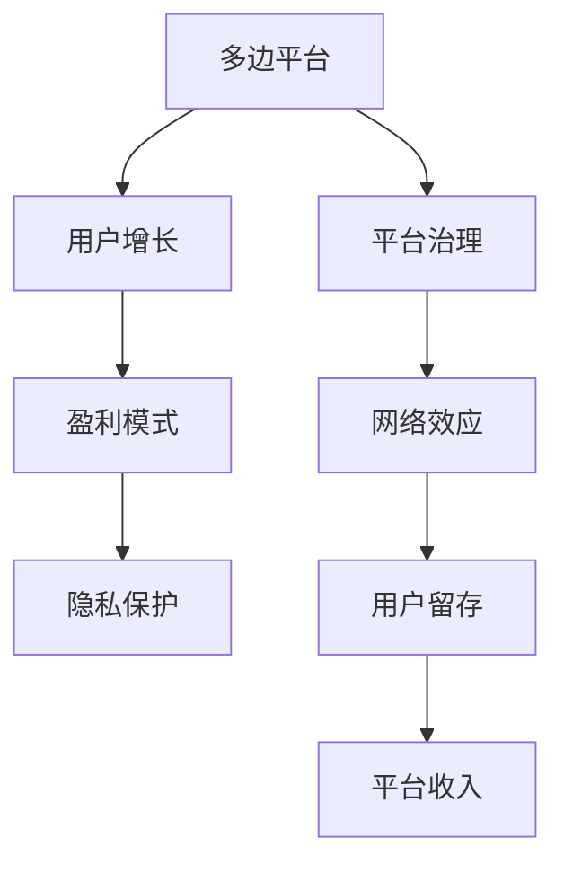

                 

# 平台战略：打造和管理多边平台业务

> 关键词：多边平台,平台治理,网络效应,用户增长,盈利模式,隐私保护

## 1. 背景介绍

### 1.1 问题由来

在互联网时代，多边平台（Multi-sided Platforms, MSPs）成为了连接用户和用户、用户和商家、商家和商家之间的重要载体。成功的多边平台，如Facebook、Amazon、阿里巴巴等，通过整合各方的资源和需求，创造了巨大的价值和影响力。然而，这些平台的成功并非偶然，而是基于一系列精心设计的平台战略。

### 1.2 问题核心关键点

多边平台的战略核心在于如何有效地连接和整合多方利益相关者，最大化网络效应，实现用户增长和平台盈利。在实践中，关键点包括：

- 用户增长策略：如何吸引、留存并扩大用户基础。
- 网络效应放大：如何通过网络效应促进更多用户和商家入驻。
- 盈利模式设计：如何构建可持续的商业模式，平衡各方的利益。
- 平台治理：如何维护平台的公平性和秩序，避免滥用和垄断。
- 隐私保护：如何在数据驱动的平台上，保护用户的隐私和数据安全。

这些问题相辅相成，需要在多边平台的设计和运营过程中综合考虑。本文将围绕这些关键点，深入探讨多边平台的战略打造和管理。

### 1.3 问题研究意义

研究多边平台战略的构建和管理，对于拓展互联网公司的业务边界，提升其在各领域的影响力，具有重要意义：

1. 促进市场竞争：通过高效整合资源，提升市场效率，推动行业创新。
2. 实现用户增长：通过精准的用户增长策略，吸引和留存更多用户，提升市场份额。
3. 优化盈利模式：设计合理的盈利模式，平衡各方的利益，实现可持续发展。
4. 保障数据安全：在数据驱动的平台上，保护用户的隐私和数据安全，赢得用户信任。
5. 提升平台价值：通过优质的平台治理，维护公平竞争和健康生态，提升平台的长期价值。

本文旨在通过深入的理论分析和技术实践，帮助互联网公司打造和管理多边平台业务，实现业务模式的创新和市场竞争力的提升。

## 2. 核心概念与联系

### 2.1 核心概念概述

为更好地理解多边平台的战略设计和管理，本节将介绍几个关键概念及其相互关系：

- 多边平台（Multi-sided Platforms, MSPs）：连接至少两个不同用户群体，实现多方共赢的业务模式。
- 网络效应（Network Effect）：平台价值随着用户数量的增加而增加，促进更多用户和商家入驻。
- 用户增长（User Growth）：通过吸引和留存用户，扩大平台的用户基础。
- 平台治理（Platform Governance）：维护平台的公平性和秩序，避免滥用和垄断。
- 盈利模式（Revenue Model）：根据平台特性，设计合理的商业模式，平衡各方的利益。
- 隐私保护（Privacy Protection）：在数据驱动的平台上，保护用户的隐私和数据安全。

这些概念之间的逻辑关系可以通过以下Mermaid流程图来展示：



这个流程图展示多边平台的核心概念及其相互关系：

1. 多边平台通过连接至少两个用户群体，创造双边或多边共赢。
2. 网络效应促进用户增长，增强平台价值。
3. 平台治理维护平台秩序和公平性。
4. 盈利模式平衡各方利益，支持平台可持续运营。
5. 隐私保护保障用户数据安全，赢得用户信任。

这些概念共同构成了多边平台战略的核心框架，指导着平台的打造和管理。

## 3. 核心算法原理 & 具体操作步骤
### 3.1 算法原理概述

多边平台战略的设计和管理，本质上是一个复杂的多目标优化问题。其核心算法原理包括：

- 网络效应模型：通过数学模型描述网络效应如何随用户数量的增加而增加。
- 用户增长模型：利用增长曲线、用户生命周期等模型，预测用户增长趋势。
- 平台治理模型：建立基于博弈论的模型，描述各方利益冲突和合作行为。
- 盈利模式设计：根据平台的特性和用户行为，设计合理的商业模式。
- 隐私保护机制：建立隐私保护模型，保障用户数据安全和隐私权益。

这些模型和技术，在多边平台的构建和管理中起着至关重要的作用。

### 3.2 算法步骤详解

多边平台战略的打造和管理，通常包括以下几个关键步骤：

**Step 1: 平台定位与目标设定**
- 确定平台的定位和目标，明确平台需要连接哪些用户群体，以及各方的期望和需求。
- 设定平台发展的短期和长期目标，如用户增长目标、盈利目标等。

**Step 2: 用户增长策略设计**
- 分析目标用户的特征和需求，设计吸引和留存用户的策略。
- 利用A/B测试、用户调研等方法，验证用户增长策略的效果，并不断优化。
- 设计多渠道的用户增长机制，如社交媒体推广、搜索引擎优化、内容营销等。

**Step 3: 网络效应放大**
- 通过激励机制和奖励体系，促进用户和商家入驻，形成正反馈循环。
- 优化平台功能，增强用户和商家之间的互动和连接，提升平台价值。

**Step 4: 平台治理体系建立**
- 建立平台规则和监管机制，确保平台公平性和透明度。
- 利用技术手段，如区块链、智能合约等，保障交易安全和用户权益。
- 定期进行平台治理评估，调整和优化治理策略。

**Step 5: 盈利模式设计**
- 根据平台特性和用户行为，设计合理的盈利模式，如广告、佣金、会员订阅等。
- 通过A/B测试和市场调研，验证盈利模式的效果，并不断优化。
- 设计多渠道的收入来源，如广告、增值服务、交易佣金等，实现可持续发展。

**Step 6: 隐私保护机制建立**
- 制定严格的隐私保护政策，明确数据收集、使用和分享的规则。
- 采用技术手段，如数据加密、访问控制等，保障用户数据安全。
- 定期进行隐私保护评估，调整和优化隐私保护策略。

**Step 7: 持续优化和迭代**
- 利用数据驱动的方法，持续监测用户增长、盈利模式、平台治理等关键指标。
- 通过数据分析和机器学习，预测市场趋势和用户行为，优化平台策略。
- 不断迭代和优化平台战略，提升平台竞争力和用户体验。

### 3.3 算法优缺点

多边平台战略的设计和管理，具有以下优点：

- 多样化盈利：通过多样化的盈利模式，平衡各方的利益，实现可持续发展。
- 用户增长快：网络效应可以迅速放大，吸引和留存更多用户。
- 平台价值高：通过高效的治理和优化，提升平台的长期价值。
- 技术驱动：利用技术手段，保障用户数据安全和平台公平性。

同时，该方法也存在一些局限性：

- 复杂度高：多边平台战略涉及多个目标和利益相关者，设计和管理复杂。
- 资源消耗大：平台初期投入资源较多，需要持续优化和迭代。
- 市场风险高：多边平台的竞争激烈，市场风险难以预测和控制。
- 隐私风险高：用户数据的安全和隐私保护难度较大，需严格管控。

尽管存在这些局限性，但就目前而言，多边平台战略仍是互联网公司拓展业务边界的重要手段。未来相关研究的重点在于如何进一步优化平台治理，降低市场风险，同时兼顾用户数据安全和隐私保护等因素。

### 3.4 算法应用领域

多边平台战略在多个领域得到了广泛应用，包括：

- 社交媒体平台：如Facebook、Twitter、LinkedIn等，通过连接用户和商家，实现商业化和社交化的平衡。
- 电子商务平台：如Amazon、阿里巴巴、京东等，通过连接买家和卖家，实现商品和服务的有效匹配。
- 金融服务平台：如PayPal、Alipay等，通过连接消费者和商家，实现资金流动的高效和安全。
- 在线教育和培训平台：如Coursera、Udemy等，通过连接教师和学生，实现知识传播和学习的便利性。
- 健康医疗平台：如WeChat Health、HealthKit等，通过连接患者和医生，实现健康管理和医疗服务的便捷性。

除了上述这些经典领域外，多边平台战略还被创新性地应用到更多场景中，如智能城市治理、社交电商、共享经济等，为互联网公司带来了新的业务机会和增长点。

## 4. 数学模型和公式 & 详细讲解 & 举例说明

### 4.1 数学模型构建

本节将使用数学语言对多边平台战略的设计和管理进行更加严格的刻画。

设多边平台包含用户群体 $U$ 和商家群体 $V$，平台价值 $P$ 与用户数量 $n$ 和商家数量 $m$ 有关。网络效应模型为：

$$
P = f(n,m)
$$

其中 $f$ 为平台价值函数。

设用户增长模型为 $n(t) = g(t)$，商家增长模型为 $m(t) = h(t)$，其中 $g(t)$ 和 $h(t)$ 分别为用户和商家增长的函数。

平台治理模型基于博弈论，描述用户和商家之间的利益冲突和合作行为。设用户效用为 $u(n,m)$，商家效用为 $v(n,m)$，平台治理模型为：

$$
\max_{n,m} \{ u(n,m) + v(n,m) \}
$$

其中 $u(n,m)$ 和 $v(n,m)$ 分别为用户和商家的效用函数。

盈利模式设计需要考虑平台的成本结构和收益模式。设平台总成本为 $C(n,m)$，总收入为 $R(n,m)$，平台盈利模式为：

$$
\max_{n,m} \{ R(n,m) - C(n,m) \}
$$

其中 $C(n,m)$ 为平台运营成本，$R(n,m)$ 为平台收入。

隐私保护机制需要建立隐私保护模型，保障用户数据安全和隐私权益。设平台隐私保护成本为 $P_C$，隐私保护收益为 $P_B$，隐私保护模型为：

$$
\max_{n,m} \{ P_B - P_C \}
$$

通过以上模型，可以综合考虑多边平台的各个方面，设计和管理多边平台战略。

### 4.2 公式推导过程

以用户增长模型为例，设用户增长率为 $\alpha$，用户留存率为 $\beta$，则用户数量 $n$ 随时间 $t$ 的增长模型为：

$$
n(t) = n_0 e^{\alpha t} \beta^t
$$

其中 $n_0$ 为初始用户数量，$\alpha$ 为用户增长率，$\beta$ 为用户留存率。

设平台初始用户数量为 $n_0$，用户增长率为 $\alpha$，用户留存率为 $\beta$，则 $t$ 时刻的用户数量为：

$$
n(t) = n_0 e^{\alpha t} \beta^t
$$

通过以上公式，可以预测平台在给定增长率和留存率下的用户数量变化趋势，为平台战略设计提供参考。

## 5. 项目实践：代码实例和详细解释说明
### 5.1 开发环境搭建

在进行多边平台战略的实现前，我们需要准备好开发环境。以下是使用Python进行多边平台战略管理的开发环境配置流程：

1. 安装Anaconda：从官网下载并安装Anaconda，用于创建独立的Python环境。

2. 创建并激活虚拟环境：
```bash
conda create -n platform-env python=3.8 
conda activate platform-env
```

3. 安装PyTorch：基于Python的开源深度学习框架，灵活动态的计算图，适合快速迭代研究。大部分多边平台战略管理的模型都有PyTorch版本的实现。

4. 安装TensorFlow：由Google主导开发的开源深度学习框架，生产部署方便，适合大规模工程应用。同样有丰富的多边平台战略管理的模型资源。

5. 安装Pandas、Numpy、Scikit-Learn、Matplotlib等库：
```bash
pip install pandas numpy scikit-learn matplotlib jupyter notebook ipython
```

完成上述步骤后，即可在`platform-env`环境中开始多边平台战略的开发。

### 5.2 源代码详细实现

下面我以用户增长模型为例，给出使用Python进行多边平台用户增长的代码实现。

```python
import numpy as np
import pandas as pd
import matplotlib.pyplot as plt

# 初始用户数量
n_0 = 10000
# 用户增长率
alpha = 0.1
# 用户留存率
beta = 0.9

# 预测1年后的用户数量
t = 365
n = n_0 * np.exp(alpha * t) * beta**t

print(f"初始用户数量：{n_0}")
print(f"用户增长率：{alpha}")
print(f"用户留存率：{beta}")
print(f"预测1年后的用户数量：{n}")
```

以上代码实现了基于指数增长模型的用户增长预测。在实际应用中，可以进一步利用机器学习模型（如回归模型、神经网络等）进行用户增长的预测和优化。

### 5.3 代码解读与分析

让我们再详细解读一下关键代码的实现细节：

- `n_0`：初始用户数量，为预测的起点。
- `alpha`：用户增长率，表示每天增加的用户数量与前一天用户数量的比例。
- `beta`：用户留存率，表示每天留存的用户数量与前一天用户数量的比例。
- `t`：时间，表示预测的天数。
- `n`：预测的用户数量，根据指数增长模型计算得到。

在实际应用中，还需进一步优化预测模型，利用历史数据和用户行为数据，训练更加精准的用户增长模型。

## 6. 实际应用场景

### 6.1 社交媒体平台

社交媒体平台通过连接用户和商家，实现商业化和社交化的平衡。例如，Facebook通过连接用户和商家，实现广告和社交互动的有机结合，实现了用户和商家的双赢。

在技术实现上，可以收集用户的社交互动数据和商家的广告数据，构建多边平台的用户增长模型和盈利模式。通过优化广告投放策略和社交互动机制，最大化平台的价值和收益。

### 6.2 电子商务平台

电子商务平台通过连接买家和卖家，实现商品和服务的有效匹配。例如，Amazon通过连接全球用户和商家，实现商品的全球化和个性化推荐，提升了用户的购物体验和商家的销售效率。

在技术实现上，可以收集用户的购物数据和商家的商品数据，构建多边平台的用户增长模型和盈利模式。通过优化推荐算法和交易机制，提升平台的交易量和收益。

### 6.3 金融服务平台

金融服务平台通过连接消费者和商家，实现资金流动的高效和安全。例如，PayPal通过连接全球用户和商家，实现了跨境支付的便捷和安全，提升了用户的支付体验和商家的交易效率。

在技术实现上，可以收集用户的支付数据和商家的交易数据，构建多边平台的用户增长模型和盈利模式。通过优化支付和结算机制，提升平台的支付效率和安全性。

### 6.4 在线教育和培训平台

在线教育和培训平台通过连接教师和学生，实现知识传播和学习的便利性。例如，Coursera通过连接全球教师和学生，实现了在线课程的多样化和个性化，提升了学生的学习体验和教师的教学效果。

在技术实现上，可以收集学生的学习数据和教师的教学数据，构建多边平台的用户增长模型和盈利模式。通过优化课程推荐和教学机制，提升平台的教学效果和学习效果。

### 6.5 健康医疗平台

健康医疗平台通过连接患者和医生，实现健康管理和医疗服务的便捷性。例如，WeChat Health通过连接患者和医生，实现了健康数据的共享和管理的便捷性，提升了患者的健康管理和医生的工作效率。

在技术实现上，可以收集患者的健康数据和医生的诊疗数据，构建多边平台的用户增长模型和盈利模式。通过优化健康数据管理和医疗服务机制，提升平台的健康管理效果和医疗服务效果。

### 6.6 未来应用展望

随着多边平台战略的不断演进，未来的多边平台将进一步拓展到更多场景中，为各行各业带来新的变革和机遇。

在智慧城市治理中，多边平台可以连接政府、企业和市民，实现公共服务的智能化和透明化，提升城市管理的效率和公平性。

在智能制造中，多边平台可以连接设备、系统和人员，实现工业互联网的协同和优化，提升制造效率和质量。

在智慧农业中，多边平台可以连接农业生产者、农民和消费者，实现农业数据的共享和智能化管理，提升农业的智能化水平和可持续发展能力。

此外，在智慧交通、智慧能源、智慧医疗等领域，多边平台的应用也将不断涌现，为各行各业注入新的活力和创新。相信随着技术的不断进步，多边平台战略必将在更广阔的应用领域大放异彩。

## 7. 工具和资源推荐
### 7.1 学习资源推荐

为了帮助开发者系统掌握多边平台战略的理论基础和实践技巧，这里推荐一些优质的学习资源：

1. 《平台战略：连接一切》系列博文：由多边平台战略专家撰写，深入浅出地介绍了多边平台战略的基本概念和经典案例。

2. 《多边平台经济学》课程：斯坦福大学开设的经济学课程，深入分析多边平台的市场结构和行为，帮助理解平台战略的经济学原理。

3. 《多边平台设计与管理》书籍：多边平台战略的权威著作，系统介绍了多边平台战略的设计和管理方法。

4. 《多边平台治理》报告：探讨多边平台治理的挑战和解决方案，帮助理解平台治理的关键问题。

5. 《多边平台盈利模型》论文：研究多边平台盈利模型的设计和优化，帮助理解平台盈利的本质和路径。

通过学习这些资源，相信你一定能够快速掌握多边平台战略的精髓，并用于解决实际的多边平台问题。

### 7.2 开发工具推荐

高效的开发离不开优秀的工具支持。以下是几款用于多边平台战略管理的开发工具：

1. PyTorch：基于Python的开源深度学习框架，灵活动态的计算图，适合快速迭代研究。大部分多边平台战略管理的模型都有PyTorch版本的实现。

2. TensorFlow：由Google主导开发的开源深度学习框架，生产部署方便，适合大规模工程应用。同样有丰富的多边平台战略管理的模型资源。

3. Pandas：数据处理和分析的强大库，适合处理多边平台战略管理的复杂数据。

4. NumPy：高性能数学计算库，适合多边平台战略管理的数值计算。

5. Scikit-Learn：机器学习库，适合构建和优化多边平台战略管理的预测模型。

6. Jupyter Notebook：交互式开发环境，适合快速原型设计和模型验证。

合理利用这些工具，可以显著提升多边平台战略管理的开发效率，加快创新迭代的步伐。

### 7.3 相关论文推荐

多边平台战略的研究源于学界的持续研究。以下是几篇奠基性的相关论文，推荐阅读：

1. 《双边市场理论》：Alfred Marshall和Eric L. Leamer的经典论文，提出了双边市场（双边平台）的基本概念和模型。

2. 《多边平台经济学》：Rajan Goolsbee的著作，深入分析了多边平台的市场结构和行为。

3. 《多边平台设计》：Avinash Dixit和John Stachurski的著作，探讨了多边平台的设计和管理方法。

4. 《多边平台盈利模型》：Anil K Kshirsager的论文，研究了多边平台盈利模型的设计和优化。

5. 《多边平台治理》：David Drucker和Glen Weyl的报告，探讨了多边平台治理的挑战和解决方案。

这些论文代表等多边平台战略的研究进展，通过学习这些前沿成果，可以帮助研究者把握学科前进方向，激发更多的创新灵感。

## 8. 总结：未来发展趋势与挑战

### 8.1 总结

本文对多边平台战略的打造和管理进行了全面系统的介绍。首先阐述了多边平台战略的核心概念和重要性，明确了多边平台连接多方利益相关者的独特价值。其次，从原理到实践，详细讲解了多边平台战略的数学模型和关键步骤，给出了多边平台战略管理的完整代码实例。同时，本文还广泛探讨了多边平台战略在多个行业领域的应用前景，展示了多边平台战略的巨大潜力。此外，本文精选了多边平台战略的各类学习资源，力求为读者提供全方位的技术指引。

通过本文的系统梳理，可以看到，多边平台战略正在成为互联网公司拓展业务边界的重要手段，极大地拓展了平台的连接范围和价值创造能力。受益于多边平台战略，互联网公司能够在多个领域实现业务模式的创新和市场竞争力的提升。未来，伴随多边平台战略的不断演进，相信互联网公司必将在更广阔的应用领域大放异彩。

### 8.2 未来发展趋势

展望未来，多边平台战略将呈现以下几个发展趋势：

1. 多边平台形式多样化。未来，多边平台的形式将更加多样化，不仅限于双边平台，还包括三边、多边平台，甚至跨领域的融合平台。

2. 用户和商家关系复杂化。随着平台规模的扩大，用户和商家之间的关系将更加复杂，平台需要更加灵活和精准的策略来平衡各方的利益。

3. 平台治理机制智能化。未来，平台治理将更多地利用技术手段，如区块链、智能合约等，提升治理的透明性和公正性。

4. 隐私保护技术先进化。隐私保护将更加注重数据安全和用户权益，采用更先进的技术手段，如差分隐私、联邦学习等。

5. 盈利模式多元化。未来，平台盈利模式将更加多元化，不仅限于广告、佣金、订阅等传统模式，还将包括数据变现、共享经济等多种方式。

6. 多边平台协同化。未来，不同领域的多边平台将更加紧密地协同，形成跨领域的生态系统，提升整体的创新能力和价值创造能力。

以上趋势凸显了多边平台战略的广阔前景。这些方向的探索发展，必将进一步提升多边平台的竞争力和市场影响力，为互联网公司带来新的增长机遇。

### 8.3 面临的挑战

尽管多边平台战略已经取得了瞩目成就，但在迈向更加智能化、普适化应用的过程中，它仍面临着诸多挑战：

1. 用户多样性难以统一。多边平台连接的用户群体多样，需求和行为差异大，难以制定统一的策略。

2. 商家利益冲突难平衡。不同商家的目标和利益不同，平台需要在多个商家之间寻求平衡，避免滥用和垄断。

3. 平台治理难度大。多边平台的治理涉及多方利益，复杂度较高，需要不断的调整和优化。

4. 隐私保护难度高。多边平台涉及大量用户数据，隐私保护难度较大，需要严格的数据管理和技术手段。

5. 市场竞争激烈。多边平台的市场竞争激烈，平台需要在多边市场中寻找生存和发展空间。

6. 技术演进快。多边平台需要不断更新和优化技术手段，以适应市场变化和用户需求。

正视多边平台战略面临的这些挑战，积极应对并寻求突破，将是多边平台走向成熟的必由之路。相信随着学界和产业界的共同努力，这些挑战终将一一被克服，多边平台战略必将在构建人机协同的智能时代中扮演越来越重要的角色。

### 8.4 研究展望

面对多边平台战略所面临的种种挑战，未来的研究需要在以下几个方面寻求新的突破：

1. 探索多边平台新形式。研究新的多边平台形式，如三边、多边平台，跨领域的融合平台，探索新的价值创造路径。

2. 研究用户和商家关系管理。深入研究用户和商家的行为特征和需求，制定更加灵活和精准的策略，平衡各方利益。

3. 结合机器学习和AI技术。利用机器学习和AI技术，优化多边平台的治理和运营，提升平台的智能化水平。

4. 研究隐私保护新技术。探索差分隐私、联邦学习等新技术，保障用户数据安全和隐私权益。

5. 设计多元化的盈利模式。研究多边平台的盈利模式，探索数据变现、共享经济等多种方式，实现可持续发展。

6. 探索跨领域的协同机制。研究不同领域的多边平台如何协同，形成跨领域的生态系统，提升整体的创新能力和价值创造能力。

这些研究方向的探索，必将引领多边平台战略迈向更高的台阶，为互联网公司带来更多的创新机遇和市场竞争优势。面向未来，多边平台战略还需要与其他人工智能技术进行更深入的融合，如知识表示、因果推理、强化学习等，多路径协同发力，共同推动多边平台战略的发展。只有勇于创新、敢于突破，才能不断拓展多边平台的边界，让智能技术更好地造福人类社会。

## 9. 附录：常见问题与解答

**Q1：如何设计多边平台的盈利模式？**

A: 多边平台的盈利模式设计需要考虑平台的特性和用户行为，以下是几种常见的盈利模式：

1. 广告模式：通过展示广告和精准定向，实现平台的广告收入。
2. 佣金模式：根据用户和商家的交易量，收取交易佣金。
3. 订阅模式：通过会员订阅，实现平台的持续收入。
4. 数据变现模式：通过数据共享和数据使用，实现数据的商业化价值。
5. 共享经济模式：通过平台连接供需双方，实现资源的共享和优化。

设计盈利模式时，需要考虑平台的可持续性和用户体验，避免过度商业化。

**Q2：如何平衡多边平台的用户和商家利益？**

A: 平衡多边平台的用户和商家利益，需要设计合理的治理机制和激励机制。以下是几种常见的策略：

1. 公平规则：制定公平的交易规则和监管机制，保障各方的权益。
2. 激励机制：设计激励机制，如优惠券、积分等，促进用户和商家的积极参与。
3. 数据分析：利用数据驱动的方法，分析用户和商家的需求和行为，优化平台策略。
4. 用户调研：通过用户调研，了解用户和商家的需求和反馈，不断优化平台。
5. 技术手段：利用技术手段，如区块链、智能合约等，提升治理的透明性和公正性。

通过这些策略，可以有效地平衡多边平台的用户和商家利益，提升平台的竞争力和用户体验。

**Q3：如何保护多边平台的用户隐私？**

A: 保护多边平台的用户隐私，需要制定严格的政策和采用先进的技术手段。以下是几种常见的策略：

1. 数据最小化：只收集必要的数据，减少用户隐私泄露的风险。
2. 数据加密：对用户数据进行加密存储和传输，保障数据的安全性。
3. 匿名化处理：对用户数据进行匿名化处理，保护用户的隐私权益。
4. 访问控制：对用户数据进行严格的访问控制，确保只有授权人员才能访问。
5. 隐私保护技术：采用差分隐私、联邦学习等技术，保障用户数据的安全和隐私权益。

通过这些策略，可以有效保护多边平台的用户隐私，增强用户信任和平台竞争力。

**Q4：多边平台的治理机制如何设计？**

A: 多边平台的治理机制设计需要考虑平台的特性和用户行为，以下是几种常见的策略：

1. 公平规则：制定公平的交易规则和监管机制，保障各方的权益。
2. 激励机制：设计激励机制，如优惠券、积分等，促进用户和商家的积极参与。
3. 数据分析：利用数据驱动的方法，分析用户和商家的需求和行为，优化平台策略。
4. 用户调研：通过用户调研，了解用户和商家的需求和反馈，不断优化平台。
5. 技术手段：利用技术手段，如区块链、智能合约等，提升治理的透明性和公正性。

通过这些策略，可以有效地设计多边平台的治理机制，提升平台的竞争力和用户体验。

**Q5：多边平台的用户增长策略如何设计？**

A: 多边平台的用户增长策略设计需要考虑平台的特性和用户需求，以下是几种常见的策略：

1. 社交媒体推广：利用社交媒体平台进行推广，吸引用户参与。
2. 搜索引擎优化：通过优化网站的搜索引擎排名，提高用户访问率。
3. 内容营销：通过高质量的内容吸引用户关注和参与。
4. 用户推荐：通过用户推荐机制，促进用户传播和参与。
5. 激励机制：设计激励机制，如优惠券、积分等，促进用户参与。

设计用户增长策略时，需要考虑用户需求的差异性和多样性，制定灵活多变的策略。

---

作者：禅与计算机程序设计艺术 / Zen and the Art of Computer Programming

