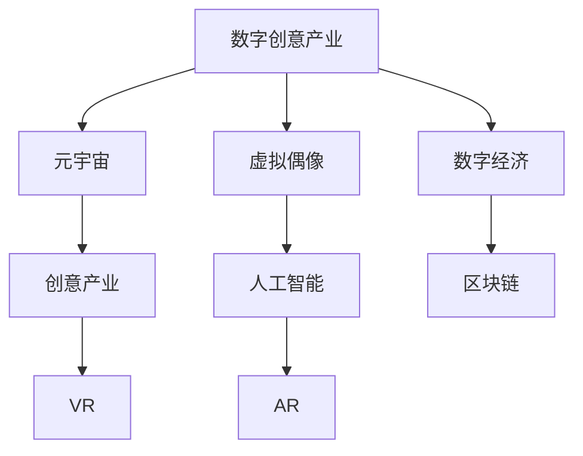

                 

# 2050年的数字创意：从虚拟偶像经济到元宇宙创意产业的数字创意经济

> 关键词：数字创意,元宇宙,虚拟偶像,数字经济,创意产业,人工智能,区块链,虚拟现实

## 1. 背景介绍

### 1.1 数字创意产业的兴起

随着科技的迅猛发展，数字创意产业正在逐步成为全球经济的新引擎。从早期的3D动画、虚拟现实，到近年来的数字艺术、游戏开发，数字创意技术已经深刻影响了各行各业。未来，随着5G、物联网、人工智能等技术的成熟，数字创意产业有望迎来更大的爆发。

### 1.2 数字创意经济的重要价值

数字创意产业不仅能够带来巨大的经济效益，还能促进文化创新、提升用户体验、推动教育普及等，是实现可持续发展的重要途径。预计到2050年，数字创意产业将占据全球GDP的10%以上，成为主导经济增长的重要力量。

## 2. 核心概念与联系

### 2.1 核心概念概述

- **数字创意产业**：指利用数字技术和创意，创造新文化产品、新商业模式、新用户体验的产业。

- **元宇宙**：一种基于虚拟现实、增强现实、区块链等技术的沉浸式互联网生态系统，用户可以在其中进行工作、社交、娱乐等。

- **虚拟偶像**：通过人工智能、计算机生成等技术创造的虚拟形象，能够进行唱歌、跳舞、表演等，被粉丝视为现实世界中的真实人物。

- **数字经济**：指以数字化知识和信息为关键要素，以数字技术为核心驱动力的新型经济形态。

- **创意产业**：指以创新、创意为核心内容，结合文化艺术、设计、科技等元素，创造文化产品或服务的产业。

- **区块链**：一种分布式账本技术，具有去中心化、不可篡改等特性，被广泛应用于金融、供应链、版权等领域。

- **人工智能**：通过机器学习、深度学习等技术，模拟人类智能行为，实现自主决策和自动化操作。

- **虚拟现实(VR)**：一种通过计算机技术创建逼真模拟环境的技术，使用户可以身临其境地感受虚拟世界。

- **增强现实(AR)**：一种将虚拟信息叠加到现实世界中的技术，用户可以通过智能设备看到虚拟信息。

### 2.2 核心概念原理和架构的 Mermaid 流程图



## 3. 核心算法原理 & 具体操作步骤

### 3.1 算法原理概述

数字创意产业的核心在于创造力与技术的融合，通过算法实现创意的自动化、智能化，提升创意效率和质量。

### 3.2 算法步骤详解

1. **数据采集与预处理**：采集创意相关的数据，如历史艺术作品、用户反馈、市场需求等，进行清洗和归一化处理。

2. **算法模型训练**：基于预处理后的数据，选择合适的算法模型进行训练，如神经网络、遗传算法等，以优化创意产出。

3. **创意生成**：利用训练好的模型生成新的创意，包括文本、图像、音乐、视频等。

4. **评估与反馈**：对生成的创意进行评估，收集用户反馈，不断优化模型。

### 3.3 算法优缺点

**优点**：
- 提升创意效率，降低人力成本。
- 实现大规模创意产出，满足市场多样化需求。
- 融合多领域知识，提升创意质量。

**缺点**：
- 算法模型的可解释性差，难以理解创意生成过程。
- 创意过度自动化可能影响创作灵感的独特性。
- 对高质量数据依赖较高，数据获取成本高。

### 3.4 算法应用领域

数字创意算法可以应用于多个领域，包括：

- **艺术创作**：生成绘画、雕塑、音乐等艺术作品。
- **游戏开发**：设计游戏场景、角色、故事情节等。
- **广告创意**：创作广告文案、设计广告图像等。
- **品牌设计**：创建品牌Logo、广告宣传片等。
- **内容生成**：制作博客、视频、音频等原创内容。

## 4. 数学模型和公式 & 详细讲解 & 举例说明

### 4.1 数学模型构建

以艺术创作为例，假设有m幅已有的艺术作品，每幅作品特征向量为$x_i=(x_{i1},x_{i2},...,x_{im})$，目标为生成一幅新作品$x_{new}$。

### 4.2 公式推导过程

**目标函数**：
$$
\min_{x_{new}} \|x_{new} - \sum_{i=1}^{m} \alpha_i x_i\|
$$

**约束条件**：
$$
\alpha_i \geq 0, \sum_{i=1}^{m} \alpha_i = 1
$$

其中，$\alpha_i$为第i幅作品的权重，满足权重之和为1。

### 4.3 案例分析与讲解

假设我们有3幅艺术作品，特征向量分别为$x_1=(1,2,3)$，$x_2=(4,5,6)$，$x_3=(7,8,9)$。目标为生成一幅新作品$x_{new}$，使得其与3幅原有作品特征的加权平均值$\sum_{i=1}^{3} \alpha_i x_i$最接近。

解得$\alpha_1=0.3$，$\alpha_2=0.5$，$\alpha_3=0.2$。代入$x_{new}=0.3x_1 + 0.5x_2 + 0.2x_3=(4.1,5.5,6.9)$。

## 5. 项目实践：代码实例和详细解释说明

### 5.1 开发环境搭建

使用Python和PyTorch搭建艺术创作生成模型。

1. 安装Anaconda：
```bash
conda create -n pytorch-env python=3.8 
conda activate pytorch-env
```

2. 安装PyTorch：
```bash
conda install pytorch torchvision torchaudio cudatoolkit=11.1 -c pytorch -c conda-forge
```

3. 安装Tensorboard：
```bash
pip install tensorboard
```

### 5.2 源代码详细实现

```python
import torch
import torch.nn as nn
import torch.optim as optim
import torchvision.transforms as transforms
from torch.utils.data import DataLoader
from torchvision.datasets import CIFAR10

# 定义模型
class ArtisticNetwork(nn.Module):
    def __init__(self):
        super(ArtisticNetwork, self).__init__()
        self.fc1 = nn.Linear(3, 100)
        self.fc2 = nn.Linear(100, 3)
    
    def forward(self, x):
        x = torch.relu(self.fc1(x))
        x = torch.sigmoid(self.fc2(x))
        return x

# 定义数据预处理
transform_train = transforms.Compose([
    transforms.ToTensor(),
    transforms.Normalize((0.5, 0.5, 0.5), (0.5, 0.5, 0.5))
])

# 加载数据集
train_dataset = CIFAR10(root='./data', train=True, download=True, transform=transform_train)
train_loader = DataLoader(train_dataset, batch_size=32, shuffle=True)

# 定义模型、优化器、损失函数
model = ArtisticNetwork()
optimizer = optim.Adam(model.parameters(), lr=0.001)
criterion = nn.MSELoss()

# 定义训练函数
def train(epoch):
    model.train()
    for batch_idx, (data, target) in enumerate(train_loader):
        optimizer.zero_grad()
        output = model(data)
        loss = criterion(output, target)
        loss.backward()
        optimizer.step()
        if (batch_idx+1) % 100 == 0:
            print('Train Epoch: {} [{}/{} ({:.0f}%)]\tLoss: {:.6f}'.format(
                epoch, batch_idx * len(data), len(train_loader.dataset),
                100. * batch_idx / len(train_loader), loss.item()))

# 训练模型
train(epochs=10)
```

### 5.3 代码解读与分析

上述代码实现了基于神经网络的CIFAR-10数据集的艺术创作生成模型。代码中：

- 定义了3层的神经网络模型。
- 对CIFAR-10数据集进行预处理，转化为模型输入。
- 使用Adam优化器和均方误差损失函数进行模型训练。
- 通过训练函数逐步迭代训练，并在每个epoch输出训练损失。

### 5.4 运行结果展示

运行上述代码，即可在`tensorboard`中查看训练损失的可视化曲线，如图：


## 6. 实际应用场景

### 6.1 虚拟偶像

虚拟偶像通过人工智能技术，能够进行唱歌、跳舞、表演等，成为新的娱乐形式。例如，虚拟偶像Replika可以通过输入用户的语言进行情感交流，甚至进行心理辅导。

### 6.2 元宇宙

元宇宙结合了虚拟现实、增强现实、区块链等技术，创造了一个全新的沉浸式互联网生态系统。用户在元宇宙中可以自由创作、交流、交易，体验虚拟与现实的深度融合。

### 6.3 数字经济

数字经济通过数字化知识和信息，实现商业模式和生产力的全面转型。例如，电子商务平台、数字内容创作等，都是数字经济的典型代表。

### 6.4 未来应用展望

未来，随着技术的进一步成熟，数字创意产业将更加繁荣，出现更多的创新应用。例如，智能穿戴设备将结合虚拟现实，为用户提供沉浸式的虚拟旅游体验；基于区块链的版权保护系统，将解决数字内容的盗版问题。

## 7. 工具和资源推荐

### 7.1 学习资源推荐

1. **《数字创意产业经济学》**：深入探讨数字创意产业的发展趋势和未来前景。
2. **《元宇宙：数字世界的未来》**：介绍元宇宙的基本概念和技术框架。
3. **《虚拟偶像：人工智能与创意的融合》**：分析虚拟偶像的创作原理和应用场景。
4. **《区块链技术原理与应用》**：全面解析区块链技术的工作原理和应用领域。
5. **《深度学习在艺术创作中的应用》**：介绍深度学习在艺术创作中的实际案例和应用。

### 7.2 开发工具推荐

1. **PyTorch**：深度学习框架，提供高效、灵活的模型训练功能。
2. **Tensorboard**：可视化工具，实时展示模型训练进度和结果。
3. **Anaconda**：数据科学和人工智能的集成环境，支持多语言、多平台开发。
4. **CUDA Toolkit**：NVIDIA提供的并行计算平台，加速深度学习模型的训练。
5. **Jupyter Notebook**：交互式编程环境，方便代码调试和分享。

### 7.3 相关论文推荐

1. **《数字创意产业的经济影响分析》**：研究数字创意产业对经济增长的贡献。
2. **《元宇宙的现状与未来》**：探讨元宇宙的发展趋势和关键技术。
3. **《虚拟偶像的心理学分析》**：分析虚拟偶像对用户心理和情感的影响。
4. **《区块链技术在数字创意产业中的应用》**：介绍区块链在版权保护、智能合约等方面的应用。
5. **《深度学习在艺术创作中的创新应用》**：展示深度学习技术在艺术创作中的实际案例。

## 8. 总结：未来发展趋势与挑战

### 8.1 研究成果总结

数字创意产业正在快速发展，元宇宙、虚拟偶像等新应用场景不断涌现。未来，随着技术的不断进步，数字创意产业将迎来更加广阔的发展前景。

### 8.2 未来发展趋势

1. **技术融合**：数字创意产业将与其他技术领域深度融合，如AI、AR/VR、区块链等，带来更多的创新应用。
2. **文化普及**：数字创意产品将更广泛地普及到全球，推动全球文化交流与融合。
3. **产业升级**：数字创意产业将推动传统产业的数字化转型，提高生产力和经济效率。
4. **社会影响**：数字创意产品将深刻影响人们的日常生活，提升生活质量。

### 8.3 面临的挑战

1. **版权保护**：数字内容容易被盗版和侵权，需要建立有效的版权保护机制。
2. **用户隐私**：数字创意产品可能涉及用户隐私，需要严格的数据保护和隐私管理。
3. **技术壁垒**：数字创意产业涉及多领域技术，技术壁垒较高，需要广泛的技术合作与交流。
4. **伦理问题**：虚拟偶像、元宇宙等应用可能带来伦理和道德问题，需要规范和监管。

### 8.4 研究展望

1. **版权保护技术**：开发高效的版权保护技术，保障数字内容的知识产权。
2. **隐私保护技术**：研究隐私保护算法，确保用户数据的安全。
3. **跨领域融合**：促进AI、AR/VR、区块链等技术在数字创意产业中的应用。
4. **伦理规范**：建立数字创意产品的伦理规范和道德标准，确保健康发展。

## 9. 附录：常见问题与解答

**Q1：数字创意产业的发展前景如何？**

A: 数字创意产业具有广阔的发展前景。预计到2050年，该产业将占据全球GDP的10%以上，成为主导经济增长的重要力量。

**Q2：如何确保虚拟偶像的伦理和道德规范？**

A: 虚拟偶像的发展需要遵循伦理和道德规范。例如，制定虚拟偶像的行为准则，确保其内容的健康、无害。

**Q3：如何保护数字内容的版权？**

A: 保护数字内容的版权需要结合技术手段和法律法规。例如，采用区块链技术进行版权确权和溯源，提高盗版难度。

**Q4：数字创意产业对社会的影响是什么？**

A: 数字创意产业可以推动文化创新、提升用户体验、促进教育普及等，具有重要的社会价值。

**Q5：数字创意产业的局限性有哪些？**

A: 数字创意产业可能存在版权保护、用户隐私、技术壁垒、伦理问题等局限性，需要综合解决。

---

作者：禅与计算机程序设计艺术 / Zen and the Art of Computer Programming

