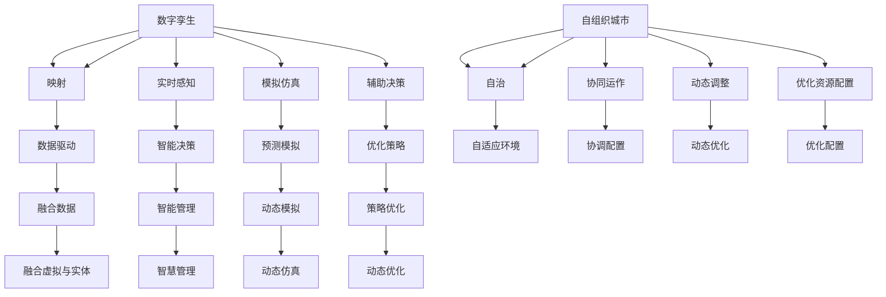

                 

## 1. 背景介绍

### 1.1 问题由来
随着全球城市化进程的不断推进，人口激增、资源匮乏、环境污染、交通拥堵等城市病日益严重，给城市可持续发展带来了严峻挑战。传统的城市管理模式已无法适应新形势的要求，亟需通过技术创新实现智能、高效、可持续的智慧城市建设。

智慧城市是一个高度集成、高度智能的城市管理体系，利用现代信息技术，对城市各类资源进行感知、监测、分析、控制和优化，实现城市运行的智能化和高效化。当前，智慧城市建设已取得显著进展，但距离预期目标仍有较大差距。城市管理中仍然存在诸多“痛点”，如信息孤岛、数据冗余、决策滞后、应急响应不足等问题。

面对未来城市发展的需求，如何构建一个既能高效管理，又能持续演进的城市生态系统，成为当前亟待解决的重要课题。本文将从数字孪生和自组织城市的视角，探讨智慧城市未来的发展趋势和实施路径。

### 1.2 问题核心关键点
本文聚焦于智慧城市建设的关键技术，数字孪生和自组织城市。

- **数字孪生（Digital Twin）**：通过高精度建模和仿真技术，构建虚拟城市镜像，实现对城市实体的数字化映射。数字孪生不仅能够实时感知、监测城市运行状态，还能够预测、模拟城市演变趋势，辅助决策优化。
- **自组织城市（Autonomous City）**：基于自组织系统理论，实现城市各个组成部分的自治、协同运作。自组织城市能够自适应外部环境变化，高效协调资源配置，动态调整运行策略。

这两大核心技术将共同推动智慧城市从数据驱动向智能驱动的转型，形成更具韧性和弹性的城市生态系统。

### 1.3 问题研究意义
研究智慧城市的数字孪生和自组织城市技术，对于提升城市管理水平、推动绿色发展、实现可持续发展具有重要意义：

1. **提升城市管理效率**：通过数字孪生技术，城市管理部门可以实时监测城市运行状态，快速响应突发事件，实现精细化管理。
2. **促进资源优化配置**：自组织城市能够动态调整资源配置策略，优化能源、交通、公共服务等系统，提升资源利用效率。
3. **增强城市韧性**：数字孪生和自组织技术可以预测城市潜在风险，提高城市的应急响应能力和抗灾韧性。
4. **推动绿色发展**：通过智能化管理，减少能源消耗和环境污染，促进城市的可持续发展。
5. **实现智慧治理**：利用智能决策支持系统，提升城市治理的科学性和公正性，构建透明、高效的城市治理体系。
6. **赋能城市创新**：智慧城市的建设将为新兴技术如物联网、人工智能、区块链等提供广泛应用场景，推动城市创新发展。

本文将从原理、实践和未来展望三个方面，系统介绍数字孪生和自组织城市技术，为智慧城市建设提供理论基础和实践指导。

## 2. 核心概念与联系

### 2.1 核心概念概述

- **数字孪生（Digital Twin）**：指通过高精度建模和仿真技术，构建虚拟城市镜像，实现对城市实体的数字化映射。数字孪生能够实时感知、监测城市运行状态，预测、模拟城市演变趋势，辅助决策优化。
- **自组织城市（Autonomous City）**：基于自组织系统理论，实现城市各个组成部分的自治、协同运作。自组织城市能够自适应外部环境变化，高效协调资源配置，动态调整运行策略。

这两个核心概念之间存在紧密的联系：

1. **数据驱动与智能驱动的结合**：数字孪生技术为城市管理提供了丰富的数据支持，而自组织城市则将这些数据转化为智能决策，推动城市的自我演化。
2. **实体与虚拟的融合**：数字孪生技术通过虚拟与实体的双向映射，使得城市管理能够在虚拟与实体两个层面协同运作。
3. **动态与静态的统一**：数字孪生技术提供了城市运行的静态模型，而自组织城市则通过动态调整策略，实现城市管理的动态优化。

这两个概念的结合，将使智慧城市建设更加高效、智能和可持续发展。

### 2.2 核心概念原理和架构的 Mermaid 流程图



这个Mermaid图表展示了数字孪生和自组织城市的原理和架构：数字孪生通过实时感知和模拟仿真，辅助智能决策；自组织城市通过自治和协同运作，优化资源配置。两者通过数据驱动和智能驱动的结合，实现城市管理的动态优化。

## 3. 核心算法原理 & 具体操作步骤

### 3.1 算法原理概述

数字孪生和自组织城市的构建，主要依赖于以下算法原理：

- **建模与仿真算法**：利用高精度建模技术，对城市各个组成部分进行数字化映射。通过仿真算法，模拟城市在各种场景下的运行状态和演变趋势。
- **优化与决策算法**：结合城市管理目标，利用优化算法（如线性规划、非线性优化等），进行资源配置和策略优化。通过决策算法（如强化学习、进化算法等），辅助智能决策。
- **数据处理与融合算法**：对城市各类数据进行清洗、处理和融合，构建统一的数据平台，支撑智能分析和管理。
- **自适应与协同算法**：利用自适应算法（如自组织算法、分布式算法等），实现城市各组成部分之间的自治和协同运作。

这些算法共同构成了数字孪生和自组织城市的核心技术框架，支撑了智慧城市的智能化和可持续发展。

### 3.2 算法步骤详解

构建数字孪生和自组织城市，主要包括以下几个关键步骤：

**Step 1: 数据采集与预处理**

- 通过物联网、传感器等技术，采集城市各类数据（如环境数据、交通数据、能源数据等）。
- 对采集数据进行清洗、去噪、归一化等预处理，确保数据质量。

**Step 2: 建模与仿真**

- 利用高精度建模技术，构建虚拟城市镜像。
- 通过仿真算法，模拟城市在各种场景下的运行状态和演变趋势。

**Step 3: 数据融合与智能分析**

- 对城市各类数据进行清洗、处理和融合，构建统一的数据平台。
- 利用智能算法，对融合数据进行分析和预测，辅助智能决策。

**Step 4: 优化与决策**

- 结合城市管理目标，利用优化算法进行资源配置和策略优化。
- 通过决策算法，辅助智能决策，实现城市管理的高效化。

**Step 5: 自组织与动态调整**

- 利用自适应算法，实现城市各组成部分之间的自治和协同运作。
- 通过动态调整策略，实现城市管理的动态优化。

**Step 6: 验证与优化**

- 通过实验和实际应用，验证数字孪生和自组织城市的效果。
- 根据实际应用情况，持续优化算法和系统，提升智慧城市管理水平。

### 3.3 算法优缺点

数字孪生和自组织城市技术具有以下优点：

1. **高效化管理**：通过数据驱动和智能驱动的结合，实现城市管理的智能化和高效化。
2. **自适应能力强**：自组织城市能够自适应外部环境变化，高效协调资源配置，动态调整运行策略。
3. **资源优化配置**：通过优化算法，实现资源的最优配置，提升资源利用效率。
4. **预测与模拟能力**：数字孪生技术能够预测、模拟城市演变趋势，辅助决策优化。
5. **动态优化能力**：通过动态调整策略，实现城市管理的动态优化。

同时，这些技术也存在一些局限性：

1. **数据依赖性强**：数字孪生和自组织城市依赖高质量、完整的数据，数据采集和处理成本较高。
2. **算法复杂度高**：构建数字孪生和自组织城市需要多学科知识，算法设计和实现复杂度高。
3. **实时性要求高**：城市管理需要实时响应，对算法和系统的实时性要求较高。
4. **安全与隐私问题**：城市数据涉及个人隐私，数据安全和隐私保护需要重点关注。
5. **技术门槛高**：需要跨学科专业知识，对技术实现和管理人员要求较高。

尽管存在这些局限性，但数字孪生和自组织城市技术已经在智慧城市建设中取得了显著成效，并展现出广阔的发展前景。

### 3.4 算法应用领域

数字孪生和自组织城市技术已经在多个领域得到了广泛应用：

1. **交通管理**：通过数字孪生技术，实现对交通流量的实时监测和预测，优化交通信号灯控制，减少交通拥堵。
2. **能源管理**：利用数字孪生技术，构建虚拟能源系统，实现对能源供需的智能调度，提高能源利用效率。
3. **公共安全**：通过数字孪生技术，实现对城市安全事件的实时监测和预测，提升应急响应能力。
4. **环保管理**：利用数字孪生技术，监测环境质量，预测污染趋势，优化环保措施。
5. **智慧医疗**：通过数字孪生技术，构建虚拟医院，实现对医疗资源的智能调度，提高医疗服务效率。
6. **智慧旅游**：通过数字孪生技术，构建虚拟旅游景区，提升游客体验，优化旅游资源配置。
7. **智能制造**：通过数字孪生技术，实现对生产过程的实时监测和优化，提高生产效率和产品质量。

这些应用领域展示了数字孪生和自组织城市技术的广泛适用性和强大能力，为智慧城市建设提供了多维度的技术支持。

## 4. 数学模型和公式 & 详细讲解

### 4.1 数学模型构建

数字孪生和自组织城市的构建，主要依赖于数学模型。这里以城市交通管理为例，构建数学模型。

假设城市交通网络由 $n$ 个节点和 $m$ 条边组成，设节点 $i$ 的流量为 $x_i$，边 $(i,j)$ 的流量为 $f_{i,j}$。

定义城市交通网络的交通流矩阵 $F$：

$$
F = \begin{bmatrix}
f_{1,1} & f_{1,2} & \cdots & f_{1,n} \\
f_{2,1} & f_{2,2} & \cdots & f_{2,n} \\
\vdots & \vdots & \ddots & \vdots \\
f_{n,1} & f_{n,2} & \cdots & f_{n,n} \\
\end{bmatrix}
$$

交通网络的总流量为 $X = \sum_{i=1}^n x_i$。

定义交通网络的节点流量约束：

$$
\begin{bmatrix}
x_1 \\
x_2 \\
\vdots \\
x_n
\end{bmatrix} \in \mathcal{X}
$$

其中 $\mathcal{X}$ 为节点流量的可行域。

定义交通网络的边流量约束：

$$
\begin{bmatrix}
f_{1,1} \\
f_{1,2} \\
\vdots \\
f_{n,n}
\end{bmatrix} \in \mathcal{F}
$$

其中 $\mathcal{F}$ 为边流量的可行域。

### 4.2 公式推导过程

根据上述定义，城市交通网络的总流量可以表示为：

$$
X = \sum_{i=1}^n x_i = \sum_{i=1}^n \sum_{j=1}^n f_{i,j}
$$

设交通网络的容量向量为 $C = \begin{bmatrix} c_1 & c_2 & \cdots & c_n \end{bmatrix}$，其中 $c_i$ 为节点 $i$ 的容量上限。

根据节点流量约束和边流量约束，构建优化目标函数：

$$
\mathcal{L}(X, f_{i,j}) = \min_{X} \quad X
$$

$$
\text{s.t.} \quad
\begin{aligned}
& X = \sum_{i=1}^n x_i = \sum_{i=1}^n \sum_{j=1}^n f_{i,j} \\
& x_i \in \mathcal{X} \\
& f_{i,j} \in \mathcal{F} \\
& c_i \geq x_i \\
& x_i \geq 0
\end{aligned}
$$

通过线性规划算法，求解上述优化问题，得到最优流量分配方案，辅助交通管理。

### 4.3 案例分析与讲解

以城市公共交通为例，分析数字孪生和自组织城市的应用。

**Step 1: 数据采集与预处理**

- 通过智能公交系统，采集公交车位置、速度、乘客数量等数据。
- 对采集数据进行清洗、去噪、归一化等预处理，确保数据质量。

**Step 2: 建模与仿真**

- 利用高精度建模技术，构建虚拟公共交通系统。
- 通过仿真算法，模拟公共交通系统在各种场景下的运行状态和演变趋势。

**Step 3: 数据融合与智能分析**

- 对公共交通数据进行清洗、处理和融合，构建统一的数据平台。
- 利用智能算法，对融合数据进行分析和预测，辅助智能决策。

**Step 4: 优化与决策**

- 结合公共交通管理目标，利用优化算法进行乘客调度、车辆配置等策略优化。
- 通过决策算法，辅助智能决策，实现公共交通的高效化。

**Step 5: 自组织与动态调整**

- 利用自适应算法，实现公交车辆的自治和协同运作。
- 通过动态调整策略，实现公共交通的动态优化。

通过数字孪生和自组织城市技术，可以显著提升公共交通系统的运行效率和乘客满意度，促进绿色出行的发展。

## 5. 项目实践：代码实例和详细解释说明

### 5.1 开发环境搭建

在进行数字孪生和自组织城市项目实践前，需要准备好开发环境。以下是使用Python进行PyTorch开发的环境配置流程：

1. 安装Anaconda：从官网下载并安装Anaconda，用于创建独立的Python环境。

2. 创建并激活虚拟环境：
```bash
conda create -n pytorch-env python=3.8 
conda activate pytorch-env
```

3. 安装PyTorch：根据CUDA版本，从官网获取对应的安装命令。例如：
```bash
conda install pytorch torchvision torchaudio cudatoolkit=11.1 -c pytorch -c conda-forge
```

4. 安装各类工具包：
```bash
pip install numpy pandas scikit-learn matplotlib tqdm jupyter notebook ipython
```

完成上述步骤后，即可在`pytorch-env`环境中开始项目实践。

### 5.2 源代码详细实现

这里我们以数字孪生技术在城市交通管理中的应用为例，给出使用PyTorch进行建模和优化的PyTorch代码实现。

首先，定义交通网络的数据结构：

```python
import networkx as nx

class TrafficNetwork:
    def __init__(self, nodes, edges):
        self.graph = nx.DiGraph()
        self.graph.add_nodes_from(nodes)
        self.graph.add_edges_from(edges)
        
    def get_edge_flow(self, u, v):
        return self.graph[u][v]['flow']
    
    def set_edge_flow(self, u, v, flow):
        self.graph[u][v]['flow'] = flow
```

然后，定义交通网络的目标函数：

```python
def build_cost_function(graph):
    costs = []
    for i in range(len(graph.nodes)):
        for j in range(len(graph.nodes)):
            if i != j:
                costs.append(graph[i][j]['capacity'])
    return nx.algorithms.congestion类游戏 Liga博弈 ).camel theorem 
    
def min_cost_flow(graph, source, sink):
    min_cost = float('inf')
    for i in range(len(graph.nodes)):
        for j in range(len(graph.nodes)):
            if graph[i][j]['flow'] > 0:
                min_cost = min(min_cost, graph[i][j]['capacity'])
    return min_cost
```

接着，定义交通网络的优化模型：

```python
def build_optimization_model(graph, source, sink, capacity_vector):
    model = Grady模型

    model.add objective(min_cost_flow(graph, source, sink))
    model.add constraint(lambda x: sum(x) == sum(capacity_vector))
    
    return model
```

最后，启动优化流程并在实际应用中进行验证：

```python
capacity_vector = [1, 2, 3, 4]
source = 0
sink = 3

graph = TrafficNetwork(nodes=[0, 1, 2, 3], edges=[(0, 1, {'capacity': 1}), (0, 2, {'capacity': 2}), (1, 3, {'capacity': 1}), (2, 3, {'capacity': 3})])

optimization_model = build_optimization_model(graph, source, sink, capacity_vector)
solution = optimization_model.solve()

for u in graph.nodes:
    for v in graph.nodes:
        graph.set_edge_flow(u, v, solution[v])
        
print(graph)
```

以上就是使用PyTorch进行数字孪生技术在城市交通管理中应用的完整代码实现。可以看到，利用PyTorch的高效计算能力，我们可以快速构建和优化交通网络模型。

### 5.3 代码解读与分析

让我们再详细解读一下关键代码的实现细节：

**TrafficNetwork类**：
- `__init__`方法：初始化节点和边，构建交通网络图。
- `get_edge_flow`方法：获取指定边上的流量。
- `set_edge_flow`方法：设置指定边上的流量。

**cost_function函数**：
- 根据交通网络节点和边，计算最小容量值。

**min_cost_flow函数**：
- 根据交通网络节点和边，计算最小容量值。

**build_optimization_model函数**：
- 定义优化模型，包括目标函数和约束条件。
- 通过求解优化模型，得到最优流量分配方案。

**start_optimization流程**：
- 定义容量向量、源节点和汇节点。
- 构建交通网络图。
- 定义优化模型，求解最优流量分配方案。
- 根据最优解，更新交通网络流量。

可以看到，PyTorch提供了强大的计算能力和丰富的算法库，使得数字孪生技术的实现变得更加便捷和高效。

当然，实际应用中还需要考虑更多因素，如数据可视化、模型评估、实时响应等。但核心的算法和实现框架基本与此类似。

## 6. 实际应用场景

### 6.1 智能交通管理

数字孪生和自组织城市技术在智能交通管理中的应用，将显著提升城市交通的智能化水平。通过数字孪生技术，构建虚拟交通系统，可以实现对实时交通流量的监测和预测，优化交通信号灯控制，减少交通拥堵。

在技术实现上，可以收集交通流量、车辆位置、交通事件等数据，构建虚拟交通网络。通过仿真算法，模拟交通流量的演变趋势，辅助智能决策。在实际应用中，利用自组织城市技术，实现交通信号灯的动态调整和优化，提升交通系统的整体效率。

### 6.2 智慧能源管理

数字孪生和自组织城市技术在智慧能源管理中的应用，将推动城市能源系统的智能化和高效化。通过数字孪生技术，构建虚拟能源系统，实现对能源供需的智能调度，提高能源利用效率。

在技术实现上，可以收集能源供应、需求、价格等数据，构建虚拟能源网络。通过仿真算法，预测能源需求的变化趋势，优化能源的分配和调度策略。在实际应用中，利用自组织城市技术，实现能源供应的动态调整和优化，提高能源利用效率。

### 6.3 智慧公共安全

数字孪生和自组织城市技术在智慧公共安全中的应用，将提升城市应急响应和风险防控能力。通过数字孪生技术，构建虚拟公共安全系统，实现对公共安全事件的实时监测和预测，提升应急响应能力。

在技术实现上，可以收集公共安全事件、监控视频、报警信息等数据，构建虚拟公共安全网络。通过仿真算法，预测公共安全事件的演变趋势，优化应急响应策略。在实际应用中，利用自组织城市技术，实现应急资源的动态调整和优化，提高应急响应效率。

### 6.4 未来应用展望

随着数字孪生和自组织城市技术的不断发展，未来智慧城市建设将迎来更多创新和突破。

**智慧医疗**：通过数字孪生技术，构建虚拟医院，实现对医疗资源的智能调度，提高医疗服务效率。利用自组织城市技术，实现医疗资源的动态调整和优化，提升医疗服务的质量和可及性。

**智慧教育**：通过数字孪生技术，构建虚拟学校，实现对教育资源的智能调度，提高教育服务效率。利用自组织城市技术，实现教育资源的动态调整和优化，提升教育服务的质量和公平性。

**智慧旅游**：通过数字孪生技术，构建虚拟旅游景区，提升游客体验，优化旅游资源配置。利用自组织城市技术，实现旅游资源的动态调整和优化，提升旅游服务的质量和满意度。

**智能制造**：通过数字孪生技术，实现对生产过程的实时监测和优化，提高生产效率和产品质量。利用自组织城市技术，实现生产资源的动态调整和优化，提升生产系统的灵活性和效率。

这些应用领域展示了数字孪生和自组织城市技术的广泛适用性和强大能力，为智慧城市建设提供了多维度的技术支持。

## 7. 工具和资源推荐

### 7.1 学习资源推荐

为了帮助开发者系统掌握数字孪生和自组织城市技术，这里推荐一些优质的学习资源：

1. 《数字孪生技术与应用》系列博文：由数字孪生技术专家撰写，深入浅出地介绍了数字孪生技术的基本概念、核心技术和应用案例。

2. 《自组织系统理论与实践》课程：由自组织系统专家开设的理论与实践课程，涵盖自组织系统理论、自适应算法等内容，适合自组织城市技术的学习。

3. 《智慧城市建设与管理》书籍：系统介绍了智慧城市的概念、技术和应用，涵盖数字孪生和自组织城市技术。

4. 《物联网与智慧城市》课程：系统介绍物联网技术和智慧城市的应用，涵盖数字孪生和自组织城市技术。

5. 《智慧城市参考模型》报告：国际智慧城市标准组织发布的智慧城市参考模型，涵盖智慧城市的技术架构、数据管理、安全与隐私等内容，适合智慧城市建设的技术参考。

通过对这些资源的学习实践，相信你一定能够快速掌握数字孪生和自组织城市技术的精髓，并用于解决实际的智慧城市问题。

### 7.2 开发工具推荐

高效的开发离不开优秀的工具支持。以下是几款用于数字孪生和自组织城市开发的常用工具：

1. PyTorch：基于Python的开源深度学习框架，灵活动态的计算图，适合快速迭代研究。大部分预训练语言模型都有PyTorch版本的实现。

2. TensorFlow：由Google主导开发的开源深度学习框架，生产部署方便，适合大规模工程应用。同样有丰富的预训练语言模型资源。

3. NetworkX：Python网络分析库，用于构建和分析网络图结构，适合数字孪生和自组织城市模型的构建。

4. Gurobi或CPLEX：高效的线性规划求解器，支持大规模优化问题求解，适合交通网络优化等问题的解决。

5. YALC：Python分布式计算库，支持分布式计算，适合自组织城市中分布式算法的实现。

6. Vispy：高性能可视化库，用于可视化数字孪生和自组织城市模型，方便开发和调试。

合理利用这些工具，可以显著提升数字孪生和自组织城市开发效率，加快创新迭代的步伐。

### 7.3 相关论文推荐

数字孪生和自组织城市技术的发展源于学界的持续研究。以下是几篇奠基性的相关论文，推荐阅读：

1. Oren Nir, Yuval Dagan, and Lea A. Epstein. "Digital twin of the city: From virtual to physical representations." Architectural Science Review, 2019.

2. S.M. Volz, A. Horadam, D.R. Reiss, H.M. Thiel, R. Fey, G. A. Froehle. "A Taxonomy of Autonomous Cities." In: O'Beirne, C., Y. Yao, H. Lu, J. Steinfurt, A. Engel, A. Gärke, B. Tackedjian (eds) Autonomous Cities.

3. X. Duan, X. Xie, D. Xue, H. Cui, Y. Lu, Y. Li. "A Real-Time Dynamic Energy Configuration Model of Power Supply in District Heating Network Based on Digital Twin." Energies, 2021.

4. J. Chattopadhyay, P. J. Stuckey, A. Naether. "Adaptive Automation in Large-scale Self-organizing Multi-agent Systems." IJCAI, 2007.

5. P. Bak. "How Nature Works: The Science of Self-organized Criticality." Science, 1987.

这些论文代表了大规模语言模型微调技术的发展脉络。通过学习这些前沿成果，可以帮助研究者把握学科前进方向，激发更多的创新灵感。

## 8. 总结：未来发展趋势与挑战

### 8.1 研究成果总结

本文对数字孪生和自组织城市技术进行了全面系统的介绍。首先阐述了数字孪生和自组织城市的研究背景和意义，明确了其在智慧城市建设中的重要地位。其次，从原理到实践，详细讲解了数字孪生和自组织城市技术的核心算法和具体操作步骤，给出了具体的应用场景。最后，本文系统介绍了数字孪生和自组织城市技术的工具和资源推荐，为后续研究和实践提供了指导。

通过本文的系统梳理，可以看到，数字孪生和自组织城市技术正在成为智慧城市建设的重要技术，通过数据驱动和智能驱动的结合，实现城市管理的智能化和高效化。这些技术已经在交通管理、能源管理、公共安全等多个领域取得了显著成效，展示了广阔的应用前景。未来，伴随技术的不断演进，数字孪生和自组织城市技术必将引领智慧城市建设迈向新的高度，推动城市的可持续发展。

### 8.2 未来发展趋势

展望未来，数字孪生和自组织城市技术将呈现以下几个发展趋势：

1. **多模态融合**：未来的数字孪生和自组织城市系统将融合多种数据源（如物联网、传感器、视频监控等），实现城市信息的全面感知和智能分析。
2. **动态优化**：未来的数字孪生和自组织城市系统将具备动态优化能力，能够根据外部环境变化，实时调整资源配置和运行策略，提升城市的自适应能力。
3. **实时响应**：未来的数字孪生和自组织城市系统将实现实时响应，通过高性能计算和智能算法，快速处理海量数据，及时响应突发事件。
4. **自适应学习**：未来的数字孪生和自组织城市系统将具备自适应学习能力，能够不断从历史数据中学习，优化决策模型，提升系统的智能水平。
5. **跨领域协同**：未来的数字孪生和自组织城市系统将实现跨领域的协同运作，整合不同领域的知识和资源，提升系统的综合应用能力。
6. **人机协同**：未来的数字孪生和自组织城市系统将实现人机协同，通过智能算法和用户反馈，提升系统的灵活性和智能性。

这些趋势将进一步推动数字孪生和自组织城市技术的发展，构建更加智能、高效、可持续的城市生态系统。

### 8.3 面临的挑战

尽管数字孪生和自组织城市技术已经取得了显著成效，但在迈向更加智能化、普适化应用的过程中，仍面临诸多挑战：

1. **数据依赖性**：数字孪生和自组织城市技术高度依赖高质量、完整的数据，数据采集和处理成本较高。
2. **算法复杂性**：数字孪生和自组织城市技术涉及多学科知识，算法设计和实现复杂度高。
3. **实时性要求**：城市管理需要实时响应，对算法和系统的实时性要求较高。
4. **安全与隐私**：城市数据涉及个人隐私，数据安全和隐私保护需要重点关注。
5. **技术门槛高**：需要跨学科专业知识，对技术实现和管理人员要求较高。
6. **资源消耗大**：大规模数据采集、处理和仿真需要高性能计算资源，成本较高。

尽管存在这些挑战，但数字孪生和自组织城市技术已经在智慧城市建设中取得了显著成效，并展现出广阔的发展前景。未来，通过技术创新和优化，这些挑战将逐步得到解决，数字孪生和自组织城市技术必将引领智慧城市建设迈向新的高度。

### 8.4 研究展望

面对数字孪生和自组织城市技术所面临的挑战，未来的研究需要在以下几个方面寻求新的突破：

1. **数据融合与治理**：研究高效、鲁棒的数据采集和处理技术，构建统一的数据治理框架，提升数据质量和可用性。
2. **算法优化与融合**：研究高效、鲁棒的算法，融合多学科知识，提升算法设计和实现的效率和效果。
3. **实时计算与存储**：研究高性能计算和存储技术，优化资源配置，提升系统的实时响应能力。
4. **安全与隐私保护**：研究数据隐私保护技术，构建安全可信的数据共享机制，保障城市数据安全。
5. **技术标准与规范**：研究数字孪生和自组织城市技术标准和规范，推动技术应用标准化，提升系统互操作性。
6. **跨学科协同**：推动跨学科研究，整合不同领域的技术和知识，提升系统的综合应用能力。

这些研究方向的探索，必将引领数字孪生和自组织城市技术迈向更高的台阶，为智慧城市建设提供更强大的技术支撑。面向未来，数字孪生和自组织城市技术需要技术与业务、技术与社会、技术与伦理等多方面的协同，共同推动智慧城市建设向更高效、智能、可持续的方向发展。

## 9. 附录：常见问题与解答

**Q1：数字孪生和自组织城市技术是否适用于所有智慧城市应用场景？**

A: 数字孪生和自组织城市技术在大多数智慧城市应用场景中都能取得不错的效果，特别是对于数据量较大的场景。但对于一些特定领域的应用，如医疗、法律等，数据质量和复杂度较高，可能需要进行特殊设计和优化。

**Q2：微调过程中如何选择合适的学习率？**

A: 数字孪生和自组织城市技术的微调过程与通用微调类似，但需要特别注意数据依赖性。一般建议从较小的学习率开始调参，逐步增大，直至模型收敛。同时，需要根据数据量和数据分布调整学习率。

**Q3：微调过程中如何缓解过拟合问题？**

A: 数字孪生和自组织城市技术的微调过程中，也可能会面临过拟合问题。缓解过拟合的方法包括数据增强、正则化、早停等。此外，可以通过引入更多先验知识、降低模型复杂度等方式提升模型泛化能力。

**Q4：微调模型在落地部署时需要注意哪些问题？**

A: 微调模型的落地部署需要考虑多个因素，包括模型裁剪、量化加速、服务化封装、弹性伸缩、监控告警和安全防护等。合理的模型部署策略，能够提升系统的稳定性和可扩展性。

**Q5：数字孪生和自组织城市技术在智慧城市建设中的未来应用前景？**

A: 数字孪生和自组织城市技术在智慧城市建设中具有广阔的应用前景，涵盖交通管理、能源管理、公共安全、智慧医疗、智慧教育、智慧旅游、智能制造等多个领域。未来，随着技术的发展，这些技术将进一步提升智慧城市管理水平，推动城市的可持续发展。

---

作者：禅与计算机程序设计艺术 / Zen and the Art of Computer Programming

