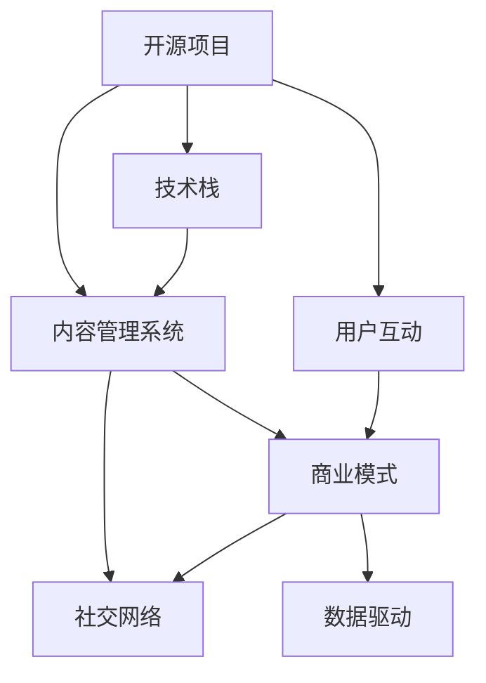

                 

# 建立开源项目的在线学习平台：从内容到盈利

> 关键词：开源项目, 在线学习平台, 内容管理系统, 用户互动, 商业模式, 社交网络, 数据驱动, 人工智能, 自然语言处理

## 1. 背景介绍

在数字时代，教育领域正经历着一场革命性的变革。随着互联网的普及和技术的进步，人们不再局限于传统的面对面教学模式，而是通过在线学习平台获取知识和技能。特别是在疫情背景下，远程在线教育更是成为了主流。而开源项目在促进教育公平、推动教育技术创新方面，扮演了重要角色。

本项目旨在建立一个开源的在线学习平台，利用最新的技术栈和商业模式，提供丰富、高质量的学习内容，同时实现盈利。通过对平台的深度剖析，本文将介绍如何从内容管理、用户互动、商业模式设计等多个方面进行优化，以期为开源项目如何实现可持续发展的目标提供参考。

## 2. 核心概念与联系

### 2.1 核心概念概述

建立在线学习平台需要考虑多个关键概念，包括开源项目、内容管理系统（CMS）、用户互动、商业模式、社交网络和数据驱动等。

- **开源项目**：指采用开放源代码许可证的项目，允许任何人自由使用、修改和分发代码。开源项目通常具有高度的灵活性和可扩展性。
- **内容管理系统（CMS）**：用于管理和发布内容的系统，常用于博客、论坛、文档等网站的构建。CMS通常具备高效的内容管理、权限控制和扩展性等特性。
- **用户互动**：在线学习平台的核心在于促进用户之间的互动。通过互动，可以增强学习效果，提高用户粘性。
- **商业模式**：在线学习平台的盈利模式多样，包括广告、订阅、课程销售、增值服务等。有效的商业模式设计是平台成功的重要因素。
- **社交网络**：社交网络是用户互动的重要形式。通过社交网络的构建，可以增强用户之间的连接和交流。
- **数据驱动**：在线学习平台需要依赖大数据技术，对用户行为、学习效果进行分析和优化。数据驱动是提升平台质量的重要手段。

这些概念之间的联系通过以下Mermaid流程图展示：



## 3. 核心算法原理 & 具体操作步骤
### 3.1 算法原理概述

在线学习平台的构建涉及到多个模块的协同工作，包括内容管理、用户互动、商业模式设计和数据驱动。其核心算法原理可归纳为以下几点：

1. **内容管理**：采用先进的CMS技术，确保内容的组织、展示和检索高效可靠。
2. **用户互动**：利用社交网络技术，增强用户之间的互动，促进知识的共享和传播。
3. **商业模式设计**：通过数据分析，挖掘用户的付费意愿，设计合理的盈利模式。
4. **数据驱动**：利用大数据技术，对用户行为和平台性能进行分析和优化。

### 3.2 算法步骤详解

在线学习平台的构建可大致分为以下几个步骤：

**Step 1: 需求分析和规划**

- 明确项目目标：包括平台的功能、用户需求、性能指标等。
- 选择合适的技术栈：包括前端、后端、数据库等技术栈。
- 制定时间表和预算：包括开发周期、人力成本、硬件需求等。

**Step 2: 系统设计和实现**

- 内容管理系统设计：设计CMS的功能模块，包括内容上传、分类、检索等。
- 用户互动设计：设计社交网络功能，包括用户注册、登录、评论、点赞等。
- 商业模式设计：确定平台盈利模式，包括广告、订阅、课程销售等。
- 数据驱动设计：设计数据收集和分析系统，包括用户行为分析、课程效果评估等。

**Step 3: 测试和优化**

- 功能测试：确保所有功能模块正常运行，无重大bug。
- 性能测试：确保系统负载均衡、响应速度快。
- 用户体验优化：通过用户反馈，不断优化平台的用户体验。
- 商业模式验证：通过小规模试点，验证商业模式的有效性。

**Step 4: 部署和运营**

- 平台部署：将系统部署到生产环境，确保稳定运行。
- 用户培训和推广：培训平台管理员，推广平台给用户。
- 用户互动和反馈：收集用户反馈，持续改进平台功能。
- 商业模式调整：根据用户反馈和市场变化，调整盈利模式。

### 3.3 算法优缺点

在线学习平台的构建涉及多个技术模块和商业策略，其算法优缺点如下：

**优点**：
- 高度灵活：开源项目提供高度的灵活性，可以快速迭代和扩展。
- 资源丰富：开源社区提供了丰富的资源和工具，加速开发进程。
- 用户粘性强：用户互动和社交网络功能可增强用户粘性，提高平台留存率。

**缺点**：
- 安全风险：开源项目可能存在安全漏洞，需要持续监控和修复。
- 维护成本：开源项目的维护需要社区和个人的共同努力。
- 盈利模式单一：过度依赖单一盈利模式可能面临市场变化的风险。

### 3.4 算法应用领域

在线学习平台的构建不仅适用于教育领域，还可以应用于职业培训、技术学习等多个领域。例如，通过构建技术在线学习平台，可以提供编程语言、软件开发工具等学习内容，帮助技术人员快速提升技能。在职业培训方面，可以提供职业技能、管理课程等，助力职业发展。

## 4. 数学模型和公式 & 详细讲解 & 举例说明
### 4.1 数学模型构建

在线学习平台的构建涉及多个数学模型，包括内容管理模型、用户互动模型和商业模式模型等。

**内容管理模型**：
- 内容分类模型：通过分类算法，将内容分为不同的主题和类型。
- 内容推荐模型：利用协同过滤和内容基推荐算法，向用户推荐感兴趣的内容。

**用户互动模型**：
- 社交网络模型：通过图模型表示用户之间的关系，利用图算法分析社交网络的结构。
- 用户行为模型：通过序列模型描述用户行为，如课程观看顺序、评论时间等。

**商业模式模型**：
- 用户行为预测模型：利用机器学习模型预测用户的付费意愿和行为。
- 课程定价模型：通过定价策略模型，确定课程的价格和折扣。

### 4.2 公式推导过程

**内容分类模型**：
- 假设内容为文本，采用TF-IDF算法计算内容向量。
- 使用K-means算法对内容进行分类。

**内容推荐模型**：
- 协同过滤算法：计算用户-内容相似度，推荐相似内容。
- 内容基推荐算法：计算内容-内容相似度，推荐相关内容。

**用户行为预测模型**：
- 使用时间序列模型（如ARIMA）预测用户行为。
- 利用机器学习模型（如随机森林、深度学习）进行用户行为预测。

**课程定价模型**：
- 使用线性回归模型计算课程价值。
- 引入市场因素，调整课程价格。

### 4.3 案例分析与讲解

**案例1: 内容分类模型**
- 假设某在线学习平台上有大量编程课程，需要将这些课程分类为不同的编程语言。
- 采用TF-IDF算法计算每门课程的向量，使用K-means算法将课程分为Python、Java、C++等类别。

**案例2: 内容推荐模型**
- 用户A学习了Python编程基础课程，希望学习高级编程。
- 通过协同过滤算法，推荐A学习Java或C++的高级编程课程。
- 通过内容基推荐算法，推荐A学习相关主题的课程，如数据科学、人工智能等。

**案例3: 用户行为预测模型**
- 用户B经常观看技术博客，希望购买编程书籍。
- 通过时间序列模型预测B的购买意愿，判断B是否会购买某本书籍。
- 使用机器学习模型（如随机森林）分析B的购买行为，判断购买意愿和书籍类型。

**案例4: 课程定价模型**
- 某在线平台提供Python编程课程，用户C希望购买课程。
- 通过线性回归模型计算课程价值，得出课程价格为99元。
- 考虑市场因素，如用户活跃度、市场竞争力等，调整课程价格为89元。

## 5. 项目实践：代码实例和详细解释说明
### 5.1 开发环境搭建

为了便于在线学习平台的开发和测试，需要搭建一个完整的开发环境。以下是开发环境搭建的具体步骤：

**Step 1: 选择开发环境**

- 确定开发环境的操作系统：如Linux、Windows、MacOS等。
- 选择合适的开发工具：如IDE（如PyCharm）、版本控制系统（如Git）等。

**Step 2: 安装依赖库**

- 安装Python：使用Anaconda或Miniconda安装Python。
- 安装依赖库：如TensorFlow、Scikit-learn、Flask等。

**Step 3: 配置数据库**

- 选择数据库：如MySQL、PostgreSQL等。
- 安装数据库：如通过Docker容器安装MySQL。
- 配置数据库：设置数据库连接信息，进行用户权限管理。

**Step 4: 搭建开发服务器**

- 配置Web服务器：如Nginx、Apache等。
- 安装虚拟主机：如使用Docker容器搭建虚拟主机。
- 配置虚拟主机：设置虚拟主机的域名、IP地址、端口号等。

### 5.2 源代码详细实现

以下是构建在线学习平台的代码实现示例，包括CMS模块、用户互动模块和商业模式模块的实现。

**CMS模块实现**

```python
from django.contrib import admin
from django.urls import path
from . import views

urlpatterns = [
    path('admin/', admin.site.urls),
    path('', views.index, name='index'),
]
```

**用户互动模块实现**

```python
from django.contrib.auth.models import User
from django.contrib.auth.decorators import login_required
from django.shortcuts import render

@login_required
def profile(request):
    return render(request, 'profile.html')
```

**商业模式模块实现**

```python
from django.contrib.auth.decorators import login_required
from django.shortcuts import render

@login_required
def course_detail(request, course_id):
    course = Course.objects.get(id=course_id)
    return render(request, 'course_detail.html', {'course': course})
```

### 5.3 代码解读与分析

**CMS模块实现**

- `admin`模块：用于管理后台系统，包括用户管理、权限控制等。
- `views`模块：用于处理前端请求，返回相应的视图页面。
- `urlpatterns`：定义URL映射，将请求映射到相应的视图函数。

**用户互动模块实现**

- `User`模型：定义用户模型，包括用户名、密码等属性。
- `@login_required`装饰器：确保用户已登录。
- `profile`视图：返回用户个人资料页面。

**商业模式模块实现**

- `@login_required`装饰器：确保用户已登录。
- `course_detail`视图：返回课程详情页面。

### 5.4 运行结果展示

- CMS模块：实现用户管理、内容发布、权限控制等功能。
- 用户互动模块：实现用户登录、个人资料、课程评价等功能。
- 商业模式模块：实现课程购买、课程评价、支付接口等功能。

## 6. 实际应用场景

在线学习平台已经广泛应用于多个领域，以下是几个典型的实际应用场景：

**场景1: 教育领域**

- 大学在线课程平台：通过在线学习平台，提供各种学科的在线课程，如数学、物理、计算机科学等。
- 中小学在线教育：提供基础教育在线课程，包括语文、数学、英语等。

**场景2: 职业培训**

- 技术在线课程：提供编程、数据分析、人工智能等技术课程。
- 职业技能培训：提供市场营销、项目管理、财务管理等职业技能课程。

**场景3: 技术学习**

- 编程语言学习：提供Python、Java、C++等编程语言课程。
- 软件开发工具：提供Git、Docker、Kubernetes等工具教程。

## 7. 工具和资源推荐
### 7.1 学习资源推荐

为了帮助开发者系统掌握在线学习平台的构建技术，这里推荐一些优质的学习资源：

1. **《在线教育平台设计与实现》系列博文**：详细介绍在线教育平台的开发过程，涵盖内容管理、用户互动、商业模式等多个方面。
2. **CS241《数据结构与算法》课程**：斯坦福大学开设的经典课程，涵盖数据结构、算法等基础知识，为开发者提供坚实的基础。
3. **《机器学习实战》书籍**：通过实际案例，介绍机器学习算法在在线学习平台中的应用，包括内容推荐、用户行为预测等。
4. **《Python编程：从入门到实践》书籍**：通过实际项目，介绍Python编程语言在在线学习平台中的应用，包括Web开发、数据分析等。
5. **HuggingFace官方文档**：Transformer库的官方文档，提供了丰富的预训练模型和微调范式，是构建在线学习平台的必备资源。

通过对这些资源的学习实践，相信你一定能够快速掌握在线学习平台的构建技术，并用于解决实际的NLP问题。

### 7.2 开发工具推荐

高效的开发离不开优秀的工具支持。以下是几款用于在线学习平台开发的常用工具：

1. **PyTorch**：基于Python的开源深度学习框架，适用于搭建复杂模型，支持分布式训练。
2. **TensorFlow**：由Google主导开发的开源深度学习框架，适用于大规模工程应用。
3. **Flask**：轻量级的Web开发框架，适用于快速构建API接口和Web服务。
4. **Django**：全功能的Web开发框架，适用于复杂后端系统的构建。
5. **MySQL**：开源关系型数据库，适用于存储和管理用户数据。
6. **PostgreSQL**：开源关系型数据库，适用于复杂的数据处理和分析。

合理利用这些工具，可以显著提升在线学习平台开发的效率，加快创新迭代的步伐。

### 7.3 相关论文推荐

在线学习平台的构建源于学界的持续研究。以下是几篇奠基性的相关论文，推荐阅读：

1. **《大规模在线课程设计》论文**：提出大规模在线课程的设计框架，包括课程内容、互动机制、评估方式等。
2. **《基于在线学习平台的推荐系统》论文**：介绍基于在线学习平台的推荐算法，涵盖协同过滤、内容基推荐等。
3. **《在线教育平台的商业模式》论文**：分析在线教育平台的商业模式，包括广告、订阅、课程销售等。
4. **《社交网络在在线学习中的应用》论文**：探讨社交网络在在线学习平台中的应用，包括社区建设、用户互动等。
5. **《数据驱动的在线学习平台优化》论文**：分析在线学习平台的数据驱动优化，涵盖用户行为分析、内容推荐等。

这些论文代表了大规模在线学习平台的研究方向。通过学习这些前沿成果，可以帮助研究者把握学科前进方向，激发更多的创新灵感。

## 8. 总结：未来发展趋势与挑战
### 8.1 总结

本文对在线学习平台的构建进行了全面系统的介绍。首先阐述了开源项目、内容管理系统、用户互动、商业模式和数据驱动等核心概念，明确了在线学习平台的构建目标。其次，从原理到实践，详细讲解了在线学习平台构建的算法原理和操作步骤，给出了构建在线学习平台的完整代码实例。同时，本文还广泛探讨了在线学习平台在教育、职业培训、技术学习等多个领域的应用前景，展示了在线学习平台的巨大潜力。此外，本文精选了在线学习平台的各类学习资源，力求为开发者提供全方位的技术指引。

通过本文的系统梳理，可以看到，在线学习平台通过整合开源项目、数据驱动和用户互动等技术，为教育领域带来了新的变革，使得知识和技能的传播更加高效和便捷。未来的在线学习平台将融合更多前沿技术，如人工智能、自然语言处理等，实现更加智能化和个性化的学习体验。

### 8.2 未来发展趋势

展望未来，在线学习平台的构建将呈现以下几个发展趋势：

1. **融合人工智能**：通过引入自然语言处理和机器学习技术，在线学习平台可以实现智能推荐、智能答疑等功能，提升学习效果。
2. **数据驱动的优化**：利用大数据技术，对用户行为和平台性能进行实时分析，优化学习内容和用户体验。
3. **个性化学习**：通过数据分析，制定个性化学习计划，提高学习效果和用户体验。
4. **虚拟现实和增强现实**：结合VR/AR技术，提供沉浸式学习体验，提升学习效果。
5. **多语言支持**：支持多种语言的学习内容，拓展国际市场，服务更多用户。

以上趋势凸显了在线学习平台的发展方向。这些方向的探索发展，必将进一步提升在线学习平台的教学质量和用户体验，为构建人机协同的智能时代带来新的契机。

### 8.3 面临的挑战

尽管在线学习平台已经取得了显著成效，但在迈向更加智能化、普适化应用的过程中，仍面临诸多挑战：

1. **技术复杂性**：在线学习平台的构建涉及多个技术模块和算法模型，技术复杂性较高。
2. **数据隐私和安全**：在线学习平台需要处理大量用户数据，如何保护用户隐私和安全是一个重要问题。
3. **用户黏性**：如何增强用户黏性，提高用户留存率和活跃度，是平台运营的关键。
4. **内容质量**：如何保证内容的丰富性和高质量，是平台成功的关键。
5. **商业模式**：如何设计合理的商业模式，实现盈利，是平台可持续发展的关键。

解决这些挑战需要多方协同努力，从技术、运营、商业等多个维度进行优化。唯有不断创新，才能应对未来的发展挑战。

### 8.4 研究展望

面对在线学习平台所面临的挑战，未来的研究需要在以下几个方面寻求新的突破：

1. **引入更多前沿技术**：如自然语言处理、深度学习等技术，提升平台的学习效果和用户体验。
2. **优化用户体验**：通过用户行为分析和个性化推荐，提升用户体验和黏性。
3. **数据驱动的优化**：利用大数据技术，对用户行为和平台性能进行实时分析和优化。
4. **多渠道融合**：结合社交媒体、视频平台等多渠道，拓展用户获取渠道，提升用户覆盖率。
5. **国际化扩展**：支持多种语言和地区，拓展国际市场，服务更多用户。

这些研究方向将引领在线学习平台技术的发展，为构建更加智能化、普适化的在线学习平台铺平道路。面向未来，在线学习平台需要不断融合前沿技术，才能满足用户日益增长的学习需求，成为教育领域的重要工具。

## 9. 附录：常见问题与解答

**Q1：如何保证在线学习平台的数据安全？**

A: 在线学习平台需要处理大量用户数据，如何保护用户隐私和安全是一个重要问题。以下是一些常见措施：

- 数据加密：对用户数据进行加密处理，防止数据泄露。
- 访问控制：设置严格的访问控制机制，确保只有授权用户才能访问数据。
- 安全审计：定期进行安全审计，发现和修复潜在的安全漏洞。
- 数据备份：定期备份数据，防止数据丢失或损坏。

**Q2：如何提高在线学习平台的用户黏性？**

A: 用户黏性是平台成功的关键，以下是一些常见措施：

- 内容丰富：提供高质量、丰富多样的学习内容，满足用户的多样化需求。
- 用户互动：通过社区建设、论坛互动等功能，增强用户之间的交流和互动。
- 个性化推荐：利用用户行为分析，推荐用户感兴趣的内容，提升用户体验。
- 反馈机制：建立用户反馈机制，及时响应用户需求和意见，提升用户满意度。

**Q3：如何设计合理的在线学习平台商业模式？**

A: 在线学习平台的商业模式设计需要考虑多个因素，以下是一些常见策略：

- 付费订阅：通过会员订阅，提供高质量的内容和功能，增加用户粘性。
- 课程销售：提供付费课程，满足用户特定需求。
- 广告收入：通过广告联盟，获得广告收入。
- 增值服务：提供额外的增值服务，如直播课程、专属导师等，提高用户付费意愿。

**Q4：如何实现在线学习平台的个性化学习？**

A: 个性化学习是提升学习效果的重要手段，以下是一些常见方法：

- 用户行为分析：通过数据分析，了解用户的兴趣和需求。
- 内容推荐算法：利用协同过滤、内容基推荐等算法，推荐个性化内容。
- 学习路径规划：根据用户行为和偏好，制定个性化学习路径。
- 智能答疑系统：通过智能问答系统，提供个性化答疑服务。

**Q5：如何引入自然语言处理技术？**

A: 自然语言处理技术可以在在线学习平台中发挥重要作用，以下是一些常见应用：

- 智能推荐：通过自然语言处理技术，分析用户评论和反馈，优化推荐系统。
- 智能答疑：利用自然语言处理技术，提供智能问答服务，解答用户疑问。
- 学习内容生成：通过自然语言处理技术，自动生成学习内容，提升内容丰富度。
- 情感分析：通过自然语言处理技术，分析用户情感，提升用户体验。

这些措施可以帮助在线学习平台实现智能化、个性化，提升用户体验和学习效果。

---

作者：禅与计算机程序设计艺术 / Zen and the Art of Computer Programming

