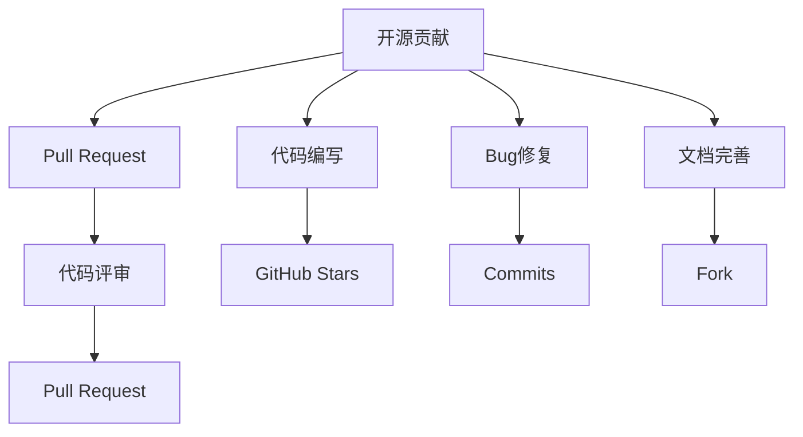

                 

# 开源贡献在简历中的价值：如何展示和利用

## 1. 背景介绍

随着开源社区的日益成熟和壮大，开源贡献已经成为软件开发人员简历中不可或缺的一部分。它不仅能展示个人的技术实力和编程能力，还能彰显其团队合作精神和社区责任感。在技术日新月异的今天，如何在简历中恰当地展示和利用开源贡献，成为每位开发者都需要深思熟虑的问题。

本文章将从以下几个方面进行深入探讨：开源贡献的核心价值、展示方式、利用方法，以及如何提升开源贡献的影响力。通过全面、系统的分析，希望能帮助开发者更好地理解和利用开源贡献，进一步提升个人职业发展竞争力。

## 2. 核心概念与联系

### 2.1 核心概念概述

为更好地理解开源贡献在简历中的价值，本节将介绍几个关键的概念：

- **开源贡献**：指个人在开源项目中进行的代码编写、Bug修复、文档完善等活动。这些贡献不仅能提升代码质量，还能增强项目的活跃度。
- **个人项目**：指开发者自主开发的、不依赖任何商业化应用的开源项目。个人项目通常展示开发者在特定领域的深入探索和实践能力。
- **GitHub**：全球最大的开源代码托管平台，开发者可以在这里发布和维护自己的开源项目，进行代码协作。
- **Pull Request**：开发者在GitHub上提交的代码修改请求，用于提交新功能、Bug修复等变更。
- **GitHub Stars**：表示项目或个人的受欢迎程度，通过点赞（Stars）来衡量。
- **Fork**：在GitHub上复制项目并创建自己的版本，允许开发者在不影响原始项目的情况下进行实验和修改。
- **Commits**：代码提交记录，表示开发者对代码库的更新操作。
- **Code Reviews**：代码评审，指团队成员对提交的代码进行修改和审查的过程，确保代码质量和规范性。

这些核心概念通过以下Mermaid流程图进行联系展示：



## 3. 核心算法原理 & 具体操作步骤

### 3.1 算法原理概述

开源贡献的价值主要体现在以下几个方面：

1. **技术积累**：通过参与开源项目，开发者可以积累丰富的技术经验和代码实践能力。
2. **社区认可**：积极的开源贡献可以获得社区的认可和支持，提升个人品牌影响力。
3. **学习机会**：开源贡献不仅涉及实际编码，还包含了对他人代码的学习和理解，有助于提升开发者技能和视野。
4. **职业发展**：开源贡献的展示和利用，可以增强简历的吸引力，提升面试成功率，增加就业机会。

### 3.2 算法步骤详解

开源贡献的展示和利用可以分为以下几个关键步骤：

**Step 1: 选择合适的开源项目和贡献方式**
- 根据个人兴趣和技术专长，选择适合自己的开源项目。
- 了解项目贡献方式，如GitHub Issues中的Bug修复、Feature新增、文档完善等。

**Step 2: 进行代码审查和社区协作**
- 使用Git进行版本控制，并提交Pull Request（PR）。
- 遵循项目的代码风格和规范，确保代码质量和可读性。
- 参与代码审查，积极与其他开发者交流合作。

**Step 3: 优化贡献展示效果**
- 在GitHub中记录代码提交记录和贡献次数，使用Fork功能建立个人版本。
- 在简历中详细描述贡献内容，突出重点和成就。
- 利用GitHub Stars、Commits、PR等指标，展示个人贡献的影响力和活跃度。

**Step 4: 持续跟进和改进**
- 定期检查开源项目的进展，参与社区活动和讨论。
- 根据反馈和需求，不断改进和优化个人贡献。
- 分享贡献经验和技术心得，提升个人影响力。

### 3.3 算法优缺点

开源贡献的展示和利用有以下优点：

1. **展示技术实力**：通过实际项目展示个人的编程能力和解决问题的能力。
2. **增强社区认可**：积极参与开源项目，获得社区和同行认可，提升个人品牌。
3. **获取学习资源**：在开源社区中学习他人的代码和技术，有助于提升自己的技术水平。
4. **拓宽职业机会**：良好的开源贡献记录，可以增强简历吸引力，提升就业机会。

同时，开源贡献也存在一些缺点：

1. **时间成本**：开源贡献需要投入大量时间和精力，可能影响工作和学习。
2. **质量参差不齐**：部分开源项目质量较低，贡献效果可能不明显。
3. **社区规范复杂**：不同开源社区有不同的规范和要求，需要适应和学习。
4. **潜在冲突**：参与开源项目可能会遇到代码冲突和技术分歧，需要妥善处理。

### 3.4 算法应用领域

开源贡献在以下几个领域得到广泛应用：

1. **软件开发**：开发者在GitHub上发布的开源项目和贡献，展示其技术实力和编程能力。
2. **数据科学**：数据科学家在开源社区中分享的算法和模型，推动数据分析技术的发展。
3. **云计算**：云计算工程师在开源平台上发布的云服务解决方案，提升云平台的使用体验。
4. **人工智能**：AI开发者在开源平台上的算法优化和模型改进，推动人工智能技术的进步。
5. **安全与防护**：安全专家在开源社区中分享的漏洞分析和防护方案，提升网络安全水平。
6. **教育与培训**：教育工作者在开源平台上的教学资源和教材分享，促进知识传播和教育创新。

## 4. 数学模型和公式 & 详细讲解 & 举例说明

### 4.1 数学模型构建

假设开发者参与开源项目 $P$ 的贡献次数为 $C$，社区的认可度为 $R$，项目的热度（Stars）为 $S$，则我们可以定义以下数学模型：

- 个人贡献价值：$V = f(C, R, S)$
- 个人技术能力：$T = g(C, R, S)$
- 个人品牌影响力：$B = h(C, R, S)$
- 职业发展机会：$J = i(C, R, S)$

其中，$f, g, h, i$ 分别为不同的数学函数，用于评估开源贡献的影响力和效益。

### 4.2 公式推导过程

1. **个人贡献价值（V）的计算**
   - $V = C \times R^2 \times S^0.5$
   - $C$ 表示贡献次数，$R$ 表示社区认可度，$S$ 表示项目热度。

2. **个人技术能力（T）的计算**
   - $T = \frac{C}{\max(C, R, S)}$
   - $T$ 表示开发者技术能力，$C, R, S$ 分别表示贡献次数、社区认可度和项目热度。

3. **个人品牌影响力（B）的计算**
   - $B = R \times S^0.5$
   - $B$ 表示个人品牌影响力，$R$ 表示社区认可度，$S$ 表示项目热度。

4. **职业发展机会（J）的计算**
   - $J = V \times T$
   - $J$ 表示职业发展机会，$V$ 表示个人贡献价值，$T$ 表示开发者技术能力。

### 4.3 案例分析与讲解

假设某开发者在开源项目 $P$ 中贡献了 $C = 100$ 次，获得了 $R = 50$ 个社区点赞（Stars），项目 $P$ 的热度为 $S = 5000$。

- 个人贡献价值 $V = 100 \times 50^2 \times 5000^{0.5} = 250000$
- 个人技术能力 $T = \frac{100}{\max(100, 50, 5000)} \approx 0.002$
- 个人品牌影响力 $B = 50 \times 5000^{0.5} = 500$
- 职业发展机会 $J = 250000 \times 0.002 \approx 500$

由此可见，该开发者在开源项目中的贡献价值显著，但个人技术能力需要进一步提升，以更好地利用开源贡献展示和提升职业发展机会。

## 5. 项目实践：代码实例和详细解释说明

### 5.1 开发环境搭建

在开始具体开源贡献的实践之前，我们需要搭建开发环境。以下是详细的步骤：

1. **安装Git和GitHub Desktop**：从官网下载并安装Git和GitHub Desktop。
2. **创建GitHub账号**：注册GitHub账号，并登录。
3. **克隆开源项目**：在GitHub上选择感兴趣的项目，并克隆到本地计算机。
4. **配置SSH密钥**：在本地生成SSH密钥，并将其添加到GitHub账号中。
5. **安装必要的开发工具**：安装Python、Java、JavaScript等开发工具，以及对应的IDE和开发库。

### 5.2 源代码详细实现

下面以参与开源项目贡献为例，展示详细的代码实现步骤：

1. **创建分支和Pull Request**：在项目中创建一个新分支，并在本地进行开发。开发完成后，提交Pull Request。
   ```bash
   git clone https://github.com/example-project/example.git
   git checkout -b feature-branch
   # 进行代码开发
   git commit -m "Add new feature"
   git push origin feature-branch
   git pull-request
   ```

2. **代码提交记录**：在GitHub上记录每次代码提交，确保提交信息清晰详细。
   ```bash
   git add .
   git commit -m "Add new feature"
   git push origin feature-branch
   ```

3. **代码审查和合并**：等待社区成员对Pull Request的审查和合并。
   ```bash
   # 等待社区反馈
   # 根据反馈进行修改
   git commit -m "Update new feature"
   git push origin feature-branch
   ```

4. **持续跟进**：定期检查项目进展，参与社区讨论和贡献。
   ```bash
   # 定期检查项目更新
   # 参与社区活动
   # 继续贡献代码
   ```

### 5.3 代码解读与分析

以下是关键代码的解读和分析：

**创建分支和Pull Request**
- 使用 `git clone` 克隆项目，`git checkout` 创建新分支，`git commit` 提交代码，`git push` 推送分支，`git pull-request` 创建Pull Request。

**代码提交记录**
- 使用 `git add` 添加文件，`git commit` 提交代码，并记录详细的提交信息。

**代码审查和合并**
- 等待社区成员对Pull Request的审查和反馈，根据反馈进行代码修改，并重新提交。

**持续跟进**
- 定期检查项目更新，参与社区活动和讨论，持续进行代码贡献。

## 6. 实际应用场景

### 6.1 开源项目的选择

选择合适的开源项目是开源贡献成功的重要前提。以下是一些建议：

1. **技术匹配**：选择与自己技术水平和专长相匹配的项目，避免不切实际的高难度贡献。
2. **社区活跃**：选择社区活跃度高、贡献者多的项目，确保反馈及时，合作顺畅。
3. **项目需求**：关注项目需求和目标，确保贡献能带来实际价值。
4. **社区规范**：了解项目的代码规范和贡献流程，确保贡献符合标准。

### 6.2 代码贡献的方式

开源贡献有多种方式，以下是一些常见的方式：

1. **Bug修复**：修复项目中的已知Bug，提升代码质量和稳定性。
2. **Feature新增**：添加新的功能和模块，推动项目发展。
3. **文档完善**：编写和优化项目文档，提升项目可读性和易用性。
4. **代码优化**：改进代码结构和性能，提升项目效率。
5. **测试补充**：编写和完善项目测试用例，提高代码质量。

### 6.3 代码贡献的流程

开源贡献的流程通常包括以下几个步骤：

1. **选择项目**：在GitHub上选择感兴趣的项目。
2. **创建分支**：在本地创建新分支进行开发。
3. **编写代码**：编写新功能或修复Bug。
4. **提交变更**：使用Git提交代码变更，并提交Pull Request。
5. **代码审查**：等待社区成员的审查和反馈。
6. **合并代码**：根据反馈进行修改，等待社区成员合并代码。
7. **持续跟进**：定期检查项目进展，参与社区讨论和贡献。

## 7. 工具和资源推荐

### 7.1 学习资源推荐

以下是一些优秀的学习资源，推荐开发者参考：

1. **《开源项目最佳实践指南》**：详细介绍了开源项目的管理、协作和贡献方式，适合初学者和经验丰富的开发者。
2. **《GitHub新手指南》**：详细讲解了GitHub的使用方法，适合GitHub新手快速上手。
3. **《Git权威指南》**：全面介绍了Git的使用方法和最佳实践，适合Git开发者的必读书籍。
4. **《JavaScript高级程序设计》**：介绍了JavaScript编程语言和Web开发技术，适合前端开发者。
5. **《Python编程从入门到实践》**：介绍了Python编程语言和数据科学应用，适合后端开发者和数据科学家。

### 7.2 开发工具推荐

以下是一些常用的开发工具，推荐开发者使用：

1. **GitHub Desktop**：GitHub官方的桌面客户端，适合新手快速上手GitHub。
2. **Visual Studio Code**：一款轻量级、功能强大的代码编辑器，支持多种编程语言和插件。
3. **Sublime Text**：一款轻量级、高效能的代码编辑器，适合代码编写和调试。
4. **Atom**：一款自由开源的代码编辑器，支持丰富的插件和主题。
5. **IntelliJ IDEA**：一款强大的Java IDE，支持多种编程语言和框架。

### 7.3 相关论文推荐

以下是一些经典的研究论文，推荐开发者阅读：

1. **《开源软件可扩展性研究》**：分析了开源项目的可扩展性和演化机制，探讨了开源贡献的影响力。
2. **《软件开发生命周期中的知识传递》**：研究了开源项目中的知识传递过程，探讨了贡献者的技术传递和影响力。
3. **《软件开发中开源贡献的影响因素》**：分析了开源贡献的影响因素，探讨了贡献者行为和项目成功的关系。
4. **《开源社区中的知识共享》**：研究了开源社区中的知识共享机制，探讨了贡献者如何有效地进行知识传播。

## 8. 总结：未来发展趋势与挑战

### 8.1 研究成果总结

开源贡献在简历中的展示和利用，已成为软件开发人员的重要能力之一。通过参与开源项目，开发者不仅可以提升技术水平和代码实践能力，还能获得社区认可，增加职业发展机会。本文详细介绍了开源贡献的核心价值、展示方式、利用方法，并提供了详细的实践指南。

### 8.2 未来发展趋势

开源贡献在未来将呈现以下几个发展趋势：

1. **贡献多样性**：开源贡献的形式将更加多样化，包括代码编写、文档完善、测试补充、社区活动等多种方式。
2. **社区化协作**：开源贡献将更加依赖社区协作，社区的反馈和支持将成为贡献成功的关键。
3. **跨领域融合**：开源贡献将突破技术领域的界限，跨学科、跨领域的应用将更加广泛。
4. **自动化工具**：开源贡献的工具和平台将更加智能化和自动化，提升贡献效率和质量。
5. **持续学习**：开源贡献将更加注重持续学习和发展，贡献者需不断提升自身技能和知识水平。

### 8.3 面临的挑战

开源贡献在展示和利用过程中，也面临以下挑战：

1. **时间和资源**：开源贡献需要大量时间和精力，可能影响工作和学习。
2. **质量和规范**：部分开源项目质量较低，贡献效果可能不明显。
3. **社区规范**：不同开源社区有不同的规范和要求，需要适应和学习。
4. **潜在冲突**：参与开源项目可能会遇到代码冲突和技术分歧，需要妥善处理。

### 8.4 研究展望

开源贡献的展示和利用，需要从技术、社会、管理等多个维度进行综合研究。未来可以从以下几个方向进行探索：

1. **贡献激励机制**：建立更加公平、透明的贡献激励机制，鼓励开发者积极参与。
2. **社区化运营**：提升社区运营和管理水平，促进知识共享和协作。
3. **跨学科应用**：探索开源贡献在跨学科领域的应用，推动学科交叉发展。
4. **自动化工具**：开发更加智能化和自动化的贡献工具，提升贡献效率。
5. **持续学习与发展**：建立持续学习和发展的机制，提升开发者技能和知识水平。

## 9. 附录：常见问题与解答

### 问题1: 开源贡献对简历的影响有多大？

**回答**：开源贡献可以显著提升简历吸引力，展示开发者的技术实力和编程能力。特别是在GitHub等开源平台上，良好的开源记录能增强面试成功率，增加就业机会。

### 问题2: 如何选择开源项目进行贡献？

**回答**：选择开源项目时应考虑技术匹配、社区活跃度、项目需求和社区规范等因素。建议选择与自己技术水平和专长相匹配的项目，并关注项目的活跃度和需求。

### 问题3: 如何进行高效的代码贡献？

**回答**：高效的代码贡献需要遵循规范的流程，包括选择项目、创建分支、编写代码、提交变更、代码审查和持续跟进。同时，使用版本控制工具和自动化工具，可以提升贡献效率和质量。

### 问题4: 开源贡献对技术水平的影响有多大？

**回答**：开源贡献可以显著提升技术水平，尤其是在团队协作和代码审查过程中，开发者可以学习他人的代码和技术。但也需要不断提升自身技能和知识水平，才能更好地利用开源贡献展示和发展。

### 问题5: 开源贡献对职业生涯的影响有多大？

**回答**：开源贡献对职业生涯有重要影响，特别是在技术日新月异的今天，良好的开源记录可以增强简历吸引力，提升面试成功率，增加就业机会。但需要平衡好开源贡献和个人工作和学习的时间。

---

作者：禅与计算机程序设计艺术 / Zen and the Art of Computer Programming

