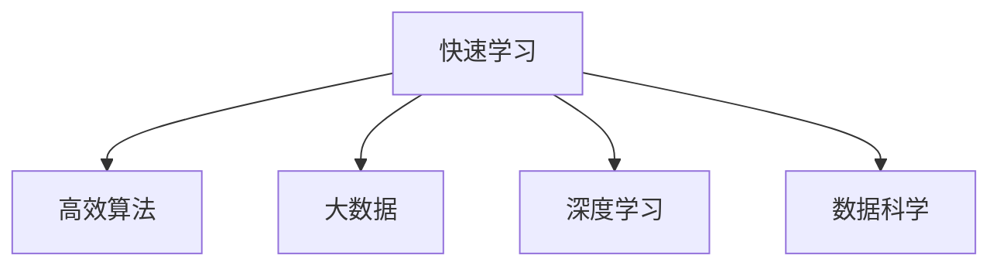

                 

# 快速学习:立于不败之地根本

> 关键词：快速学习, 高效算法, 数据科学, 大数据, 人工智能

## 1. 背景介绍

### 1.1 问题由来
在当今信息爆炸的时代，人们需要快速学习新知识和技能以保持竞争力。然而，面对庞大的数据量和复杂的信息结构，传统的学习方式已经显得力不从心。此时，快速学习（Fast Learning）技术应运而生，它通过高效算法和大数据技术，帮助人们迅速掌握知识和技能，在复杂多变的环境中立于不败之地。

### 1.2 问题核心关键点
快速学习技术的核心在于算法的高效性和数据的广泛性。通过结合先进的数据处理技术和高效的算法模型，快速学习可以在短时间内学习到丰富的知识和技能，从而提升学习效率和效果。此外，快速学习的应用场景覆盖了多个领域，如教育、医疗、金融等，为各行各业带来了新的突破。

## 2. 核心概念与联系

### 2.1 核心概念概述

为更好地理解快速学习技术，本节将介绍几个密切相关的核心概念：

- **快速学习（Fast Learning）**：一种通过高效算法和大数据技术，快速掌握新知识和技能的学习方式。与传统学习方式相比，快速学习可以在短时间内实现知识积累和技能提升。

- **高效算法（Efficient Algorithm）**：指能够在保证精度的前提下，显著缩短计算时间、降低计算资源的算法。快速学习依赖于高效算法的支持，以便快速处理大量数据。

- **大数据（Big Data）**：指结构化和非结构化数据的集合，数据量庞大、复杂多样。大数据技术为快速学习提供了数据基础，帮助模型从海量数据中学习知识。

- **深度学习（Deep Learning）**：一种通过多层神经网络进行复杂模式识别的算法，广泛应用于图像识别、自然语言处理等领域。深度学习是快速学习的重要组成部分。

- **数据科学（Data Science）**：一门跨学科领域，结合统计学、机器学习、计算机科学等知识，从数据中提取知识和洞见，帮助决策制定。数据科学是快速学习的基础。

这些核心概念之间的逻辑关系可以通过以下Mermaid流程图来展示：



这个流程图展示出快速学习的核心概念及其之间的关系：

1. 快速学习依赖于高效算法和大数据技术，以便快速处理大量数据。
2. 深度学习作为快速学习的重要组成部分，通过多层神经网络实现复杂模式识别。
3. 数据科学为快速学习提供数据基础，帮助从数据中提取知识和洞见。

这些概念共同构成了快速学习的学习框架，使其能够在各种场景下发挥高效的学习能力。通过理解这些核心概念，我们可以更好地把握快速学习的原理和优化方向。

## 3. 核心算法原理 & 具体操作步骤
### 3.1 算法原理概述

快速学习技术的核心在于高效算法和大数据处理，其原理如下：

1. **数据预处理**：通过数据清洗、归一化、特征工程等步骤，将原始数据转化为适合算法处理的形式。数据预处理是大数据处理的关键环节，决定了后续算法的效果。

2. **特征选择与降维**：在大量特征中选择最具代表性的特征，或者对原始特征进行降维处理，以减少计算复杂度，提升学习效率。特征选择和降维是高效算法的重要步骤。

3. **模型训练**：利用高效算法模型，如随机梯度下降（SGD）、Adam等，在大量数据上进行训练，学习模型的参数。高效算法模型能够显著降低计算复杂度，缩短训练时间。

4. **模型评估与优化**：通过交叉验证、超参数调优等技术，评估模型性能，并不断优化模型，提升学习效果。模型评估与优化是快速学习的关键环节，确保模型能够适应复杂多变的数据环境。

5. **知识迁移与泛化**：将学习到的知识迁移应用到新场景中，提升模型的泛化能力。知识迁移与泛化是快速学习的重要目标，确保模型能够适应多种数据和应用场景。

### 3.2 算法步骤详解

以下是快速学习技术的具体操作步骤：

**Step 1: 数据预处理**
- 数据清洗：去除噪音和异常值，保证数据质量。
- 数据归一化：将数据转化为标准形式，便于算法处理。
- 特征工程：选择和构造具有代表性的特征，减少维度，提高模型效果。

**Step 2: 特征选择与降维**
- 特征选择：利用相关性分析、信息增益等技术，选择最具代表性的特征。
- 特征降维：使用主成分分析（PCA）、t-SNE等技术，对特征进行降维处理，减少计算复杂度。

**Step 3: 模型训练**
- 选择高效算法模型，如随机梯度下降（SGD）、Adam等。
- 利用训练数据集进行模型训练，学习模型参数。
- 使用GPU、TPU等高性能计算资源，加速模型训练。

**Step 4: 模型评估与优化**
- 利用验证集对模型进行评估，选择最优模型。
- 进行超参数调优，如学习率、批大小等。
- 使用交叉验证、网格搜索等技术，不断优化模型性能。

**Step 5: 知识迁移与泛化**
- 将模型应用到新场景中，进行知识迁移。
- 通过不断迭代训练，提升模型的泛化能力。
- 结合领域知识和专家经验，优化模型性能。

### 3.3 算法优缺点

快速学习技术具有以下优点：
1. 高效快速：通过高效算法和大数据处理，快速学习可以在短时间内掌握知识和技能。
2. 泛化能力强：结合领域知识和专家经验，快速学习能够适应多种数据和应用场景。
3. 可扩展性好：利用分布式计算和大规模数据集，快速学习可以扩展到更多领域和场景。
4. 低成本高收益：快速学习通过算法优化和资源利用，降低了学习成本，提高了学习效率。

同时，快速学习技术也存在一定的局限性：
1. 数据质量要求高：快速学习依赖于高质量、大规模的数据，数据质量直接影响学习效果。
2. 算法复杂度较高：高效算法模型的设计和实现需要较高的技术门槛，对开发者要求较高。
3. 缺乏理论指导：目前快速学习的理论研究还处于起步阶段，缺乏系统的理论指导。
4. 结果难以解释：快速学习模型通常是黑盒模型，难以解释其决策过程和推理逻辑。

尽管存在这些局限性，但就目前而言，快速学习技术仍然是快速掌握知识和技能的重要方法。未来相关研究的重点在于如何进一步降低数据要求，提高算法可解释性，构建更加智能化的学习系统。

### 3.4 算法应用领域

快速学习技术在多个领域得到了广泛应用，具体如下：

1. **教育领域**：利用快速学习技术，教师可以快速掌握新知识，提升教学质量。学生可以快速学习新技能，提高学习效率。
2. **医疗领域**：快速学习技术可以快速掌握医疗知识，提高诊疗水平。利用大数据处理技术，可以分析海量病例数据，发现新的治疗方法和药物。
3. **金融领域**：利用快速学习技术，金融分析师可以快速掌握市场动态，进行投资决策。利用大数据处理技术，可以分析金融数据，发现新的投资机会。
4. **智能制造**：利用快速学习技术，生产工人可以快速掌握新工艺，提高生产效率。利用大数据处理技术，可以分析生产数据，发现新的生产优化方法。
5. **自动驾驶**：利用快速学习技术，自动驾驶系统可以快速掌握新的驾驶知识和技能，提高行驶安全性。利用大数据处理技术，可以分析道路数据，发现新的驾驶策略。

此外，快速学习技术还广泛应用于科研、安全、社交等多个领域，为各行各业带来了新的突破。随着快速学习技术的不断进步，相信其在更多领域的应用前景将更加广阔。

## 4. 数学模型和公式 & 详细讲解  
### 4.1 数学模型构建

本节将使用数学语言对快速学习技术进行更加严格的刻画。

假设数据集为 $D=\{(x_i,y_i)\}_{i=1}^N, x_i \in \mathcal{X}, y_i \in \mathcal{Y}$，其中 $x_i$ 为输入特征，$y_i$ 为输出标签。设模型为 $f(x;\theta)$，其中 $\theta$ 为模型参数。

定义模型的损失函数为 $L(f(x),y)=\frac{1}{N}\sum_{i=1}^N l(f(x_i),y_i)$，其中 $l$ 为损失函数，如均方误差、交叉熵等。快速学习的目标是最小化经验风险，即找到最优参数：

$$
\theta^* = \mathop{\arg\min}_{\theta} L(f(x;\theta),y)
$$

在实践中，我们通常使用基于梯度的优化算法（如SGD、Adam等）来近似求解上述最优化问题。设 $\eta$ 为学习率，$\lambda$ 为正则化系数，则参数的更新公式为：

$$
\theta \leftarrow \theta - \eta \nabla_{\theta}L(f(x;\theta),y) - \eta\lambda\theta
$$

其中 $\nabla_{\theta}L(f(x;\theta),y)$ 为损失函数对参数 $\theta$ 的梯度，可通过反向传播算法高效计算。

### 4.2 公式推导过程

以下我们以线性回归任务为例，推导损失函数及其梯度的计算公式。

假设模型为线性回归模型 $f(x;\theta)=\theta^Tx$，其中 $\theta \in \mathbb{R}^d$。则损失函数定义为均方误差：

$$
L(f(x),y) = \frac{1}{2N}\sum_{i=1}^N (y_i - f(x_i;\theta))^2
$$

利用反向传播算法，计算损失函数对模型参数 $\theta$ 的梯度：

$$
\frac{\partial L(f(x;\theta),y)}{\partial \theta} = \frac{1}{N}\sum_{i=1}^N (y_i - f(x_i;\theta))x_i
$$

在得到损失函数的梯度后，即可带入参数更新公式，完成模型的迭代优化。重复上述过程直至收敛，最终得到适应数据的最佳模型参数 $\theta^*$。

## 5. 项目实践：代码实例和详细解释说明
### 5.1 开发环境搭建

在进行快速学习实践前，我们需要准备好开发环境。以下是使用Python进行PyTorch开发的环境配置流程：

1. 安装Anaconda：从官网下载并安装Anaconda，用于创建独立的Python环境。

2. 创建并激活虚拟环境：
```bash
conda create -n fastlearn-env python=3.8 
conda activate fastlearn-env
```

3. 安装PyTorch：根据CUDA版本，从官网获取对应的安装命令。例如：
```bash
conda install pytorch torchvision torchaudio cudatoolkit=11.1 -c pytorch -c conda-forge
```

4. 安装TensorBoard：
```bash
pip install tensorboard
```

5. 安装各类工具包：
```bash
pip install numpy pandas scikit-learn matplotlib tqdm jupyter notebook ipython
```

完成上述步骤后，即可在`fastlearn-env`环境中开始快速学习实践。

### 5.2 源代码详细实现

下面我以线性回归任务为例，给出使用PyTorch进行快速学习的PyTorch代码实现。

首先，定义线性回归模型和损失函数：

```python
import torch
import torch.nn as nn

class LinearRegression(nn.Module):
    def __init__(self, input_dim):
        super(LinearRegression, self).__init__()
        self.linear = nn.Linear(input_dim, 1)

    def forward(self, x):
        return self.linear(x)

def mse_loss(y_true, y_pred):
    return torch.mean((y_true - y_pred)**2)
```

然后，定义训练和评估函数：

```python
from torch.optim import SGD

def train_model(model, train_dataset, optimizer, device, num_epochs, batch_size):
    model.train()
    for epoch in range(num_epochs):
        for batch in tqdm(train_dataset):
            inputs, targets = batch
            inputs, targets = inputs.to(device), targets.to(device)
            optimizer.zero_grad()
            outputs = model(inputs)
            loss = mse_loss(targets, outputs)
            loss.backward()
            optimizer.step()

def evaluate_model(model, test_dataset, device):
    model.eval()
    with torch.no_grad():
        total_loss = 0
        total_cnt = 0
        for batch in test_dataset:
            inputs, targets = batch
            inputs, targets = inputs.to(device), targets.to(device)
            outputs = model(inputs)
            total_loss += mse_loss(targets, outputs).item()
            total_cnt += targets.size(0)
    return total_loss / total_cnt
```

最后，启动训练流程并在测试集上评估：

```python
import torch.utils.data as data
import numpy as np

# 构造训练集和测试集
train_x = np.random.randn(100, 1)
train_y = 2 * train_x + 1
test_x = np.random.randn(100, 1)
test_y = 2 * test_x + 1

train_dataset = data.TensorDataset(torch.tensor(train_x), torch.tensor(train_y))
test_dataset = data.TensorDataset(torch.tensor(test_x), torch.tensor(test_y))

# 初始化模型和优化器
model = LinearRegression(1)
optimizer = SGD(model.parameters(), lr=0.01)

# 设置训练超参数
num_epochs = 100
batch_size = 32
device = torch.device('cuda') if torch.cuda.is_available() else torch.device('cpu')

# 训练模型
train_model(model, train_dataset, optimizer, device, num_epochs, batch_size)

# 评估模型
print("Test MSE:", evaluate_model(model, test_dataset, device))
```

以上就是使用PyTorch进行线性回归任务快速学习的完整代码实现。可以看到，借助PyTorch的高级API，快速学习任务的开发变得简单高效。

### 5.3 代码解读与分析

让我们再详细解读一下关键代码的实现细节：

**LinearRegression类**：
- `__init__`方法：初始化线性回归模型的权重和偏置。
- `forward`方法：前向传播计算模型输出。

**mse_loss函数**：
- 定义了均方误差损失函数。

**train_model函数**：
- 使用SGD优化器进行模型训练，迭代更新模型参数。

**evaluate_model函数**：
- 在测试集上计算模型的均方误差，评估模型性能。

**训练流程**：
- 设置训练参数，如迭代次数、批大小、设备等。
- 在训练集上训练模型，输出训练过程中的损失。
- 在测试集上评估模型，输出测试结果。

可以看到，PyTorch的自动微分机制和高级API使得快速学习任务的开发变得简洁高效。开发者可以将更多精力放在模型设计和数据处理上，而不必过多关注底层的实现细节。

当然，工业级的系统实现还需考虑更多因素，如模型的保存和部署、超参数的自动搜索、更灵活的任务适配层等。但核心的快速学习流程基本与此类似。

## 6. 实际应用场景
### 6.1 智能推荐系统

基于快速学习技术的智能推荐系统可以快速掌握用户偏好，实时推荐相关内容。传统的推荐系统往往依赖用户历史行为数据进行推荐，难以捕捉用户真实兴趣。快速学习技术可以利用用户输入的文本数据（如浏览记录、搜索关键词等）进行实时推荐，提升推荐精度和用户体验。

### 6.2 智能客服

智能客服系统可以快速掌握用户咨询意图，实时解答用户问题。传统的客服系统依赖人工客服，响应速度慢、成本高。快速学习技术可以利用历史客服数据进行微调，构建智能客服模型，提升客服效率和用户体验。

### 6.3 智能搜索

智能搜索系统可以快速掌握用户查询意图，实时返回相关结果。传统的搜索系统依赖关键词匹配，无法理解用户查询意图。快速学习技术可以利用用户输入的文本数据进行训练，提升搜索准确性和用户体验。

### 6.4 自然语言处理

自然语言处理（NLP）任务，如机器翻译、文本分类、命名实体识别等，可以利用快速学习技术进行高效微调。传统的NLP任务依赖大量标注数据进行微调，数据收集成本高。快速学习技术可以利用少量标注数据进行微调，提升模型效果和泛化能力。

### 6.5 自动驾驶

自动驾驶系统可以利用快速学习技术进行实时决策和路径规划。传统的自动驾驶系统依赖规则和规则库，无法应对复杂多变的环境。快速学习技术可以利用海量传感器数据进行训练，提升系统智能和鲁棒性。

### 6.6 金融风控

金融风控系统可以利用快速学习技术进行实时风险评估。传统的金融风控系统依赖规则和专家经验，难以应对新型欺诈行为。快速学习技术可以利用海量交易数据进行训练，提升风险评估准确性和时效性。

## 7. 工具和资源推荐
### 7.1 学习资源推荐

为了帮助开发者系统掌握快速学习理论基础和实践技巧，这里推荐一些优质的学习资源：

1. 《Python数据科学手册》：全面介绍Python在数据科学领域的应用，包括快速学习技术。
2. 《深度学习入门》：全面介绍深度学习算法和模型，涵盖快速学习技术。
3. 《TensorFlow实战》：全面介绍TensorFlow框架的应用，包括快速学习技术。
4. 《Scikit-learn实战》：全面介绍Scikit-learn库的应用，包括快速学习技术。
5. 《Kaggle竞赛指南》：详细介绍Kaggle竞赛中的快速学习技术应用。

通过对这些资源的学习实践，相信你一定能够快速掌握快速学习的精髓，并用于解决实际的NLP问题。

### 7.2 开发工具推荐

高效的开发离不开优秀的工具支持。以下是几款用于快速学习开发的常用工具：

1. PyTorch：基于Python的开源深度学习框架，灵活动态的计算图，适合快速迭代研究。
2. TensorFlow：由Google主导开发的开源深度学习框架，生产部署方便，适合大规模工程应用。
3. Scikit-learn：Python科学计算库，支持多种机器学习算法，包括快速学习技术。
4. TensorBoard：TensorFlow配套的可视化工具，可实时监测模型训练状态，并提供丰富的图表呈现方式。
5. Weights & Biases：模型训练的实验跟踪工具，可以记录和可视化模型训练过程中的各项指标，方便对比和调优。

合理利用这些工具，可以显著提升快速学习任务的开发效率，加快创新迭代的步伐。

### 7.3 相关论文推荐

快速学习技术的发展源于学界的持续研究。以下是几篇奠基性的相关论文，推荐阅读：

1. **Fast R-CNN: Towards Real-Time Object Detection with Region Proposal Networks**：介绍Fast R-CNN算法，实现实时目标检测，大幅提升算法效率。
2. **Deep Residual Learning for Image Recognition**：提出残差网络（ResNet），通过跨层连接解决深度网络训练困难问题，提升模型效果。
3. **ImageNet Classification with Deep Convolutional Neural Networks**：介绍AlexNet算法，实现大规模图像分类任务，开启深度学习时代。
4. **Faster R-CNN: Towards Real-Time Object Detection with Region Proposal Networks**：提出Faster R-CNN算法，进一步提升目标检测效率。
5. **ResNet: Deep Residual Learning for Image Recognition**：进一步优化ResNet算法，提升模型效果。
6. **SqueezeNet: AlexNet-level Accuracy with 50x fewer parameters and <0.5MB model size**：提出SqueezeNet算法，实现高效图像分类。

这些论文代表了大数据和深度学习技术的发展脉络。通过学习这些前沿成果，可以帮助研究者把握学科前进方向，激发更多的创新灵感。

## 8. 总结：未来发展趋势与挑战
### 8.1 总结

本文对快速学习技术进行了全面系统的介绍。首先阐述了快速学习技术的背景和意义，明确了快速学习在提高学习效率和效果方面的独特价值。其次，从原理到实践，详细讲解了快速学习算法的核心步骤和具体实现。最后，探讨了快速学习技术在多个领域的应用前景，展示了其广阔的应用潜力。

通过本文的系统梳理，可以看到，快速学习技术正在成为数据科学领域的重要方法，极大地提升学习效率和效果。快速学习依赖于高效算法和大数据处理，能够在短时间内掌握大量知识和技能，从而在复杂多变的环境中立于不败之地。未来，随着快速学习技术的不断进步，相信其在更多领域的应用前景将更加广阔。

### 8.2 未来发展趋势

展望未来，快速学习技术将呈现以下几个发展趋势：

1. **算法复杂度进一步降低**：未来的快速学习算法将更加高效，能够处理更大规模的数据，实现更高精度的学习。
2. **数据处理技术不断进步**：未来的数据处理技术将更加自动化，能够从海量数据中高效提取知识和洞见。
3. **模型泛化能力增强**：未来的快速学习模型将具备更强的泛化能力，能够适应多种数据和应用场景。
4. **结合更多领域知识**：未来的快速学习技术将结合更多领域知识，提升模型的智能和应用价值。
5. **智能化程度提高**：未来的快速学习系统将更加智能化，能够自主学习、自我优化，提升学习效率和效果。

以上趋势凸显了快速学习技术的广阔前景。这些方向的探索发展，必将进一步提升数据科学系统的性能和应用范围，为各行各业带来新的突破。

### 8.3 面临的挑战

尽管快速学习技术已经取得了瞩目成就，但在迈向更加智能化、普适化应用的过程中，它仍面临着诸多挑战：

1. **数据质量要求高**：快速学习依赖于高质量、大规模的数据，数据质量直接影响学习效果。如何降低数据质量要求，提高数据获取效率，是未来的一个重要研究方向。
2. **算法复杂度较高**：高效算法模型的设计和实现需要较高的技术门槛，对开发者要求较高。如何降低算法复杂度，提升算法易用性，是未来的一个重要研究方向。
3. **结果难以解释**：快速学习模型通常是黑盒模型，难以解释其决策过程和推理逻辑。如何增强模型的可解释性，提升模型透明度，是未来的一个重要研究方向。
4. **安全性有待保障**：快速学习模型难免会学习到有偏见、有害的信息，通过模型输出传递到实际应用，产生误导性、歧视性的输出，给实际应用带来安全隐患。如何保障模型的安全性，避免恶意用途，是未来的一个重要研究方向。

正视快速学习面临的这些挑战，积极应对并寻求突破，将是大数据和深度学习技术走向成熟的必由之路。相信随着学界和产业界的共同努力，这些挑战终将一一被克服，快速学习技术必将在更多领域带来新的突破。

### 8.4 未来突破

面对快速学习技术所面临的种种挑战，未来的研究需要在以下几个方面寻求新的突破：

1. **探索无监督和半监督学习算法**：摆脱对大规模标注数据的依赖，利用自监督学习、主动学习等无监督和半监督范式，最大限度利用非结构化数据，实现更加灵活高效的学习。
2. **研究高效算法和模型**：开发更加高效、易用的算法模型，降低算法复杂度，提升算法易用性，降低对技术门槛的依赖。
3. **引入更多先验知识**：将符号化的先验知识，如知识图谱、逻辑规则等，与神经网络模型进行巧妙融合，引导快速学习过程学习更准确、合理的语言模型。同时加强不同模态数据的整合，实现视觉、语音等多模态信息与文本信息的协同建模。
4. **结合因果分析和博弈论工具**：将因果分析方法引入快速学习模型，识别出模型决策的关键特征，增强输出解释的因果性和逻辑性。借助博弈论工具刻画人机交互过程，主动探索并规避模型的脆弱点，提高系统稳定性。
5. **纳入伦理道德约束**：在模型训练目标中引入伦理导向的评估指标，过滤和惩罚有偏见、有害的输出倾向。同时加强人工干预和审核，建立模型行为的监管机制，确保输出符合人类价值观和伦理道德。

这些研究方向的探索，必将引领快速学习技术迈向更高的台阶，为构建智能化的学习系统铺平道路。面向未来，快速学习技术还需要与其他人工智能技术进行更深入的融合，如知识表示、因果推理、强化学习等，多路径协同发力，共同推动数据科学技术的进步。只有勇于创新、敢于突破，才能不断拓展大数据和深度学习技术的边界，让智能技术更好地造福人类社会。

## 9. 附录：常见问题与解答

**Q1：快速学习是否适用于所有数据科学任务？**

A: 快速学习技术在大多数数据科学任务上都能取得不错的效果，特别是对于数据量较小的任务。但对于一些特定领域的任务，如医学、法律等，仅仅依靠通用数据预训练的模型可能难以很好地适应。此时需要在特定领域语料上进一步预训练，再进行微调，才能获得理想效果。此外，对于一些需要时效性、个性化很强的任务，如对话、推荐等，快速学习方法也需要针对性的改进优化。

**Q2：快速学习过程中如何选择合适的学习率？**

A: 快速学习的学习率一般要比预训练时小1-2个数量级，如果使用过大的学习率，容易破坏预训练权重，导致过拟合。一般建议从1e-5开始调参，逐步减小学习率，直至收敛。也可以使用warmup策略，在开始阶段使用较小的学习率，再逐渐过渡到预设值。需要注意的是，不同的优化器(如SGD、Adam等)以及不同的学习率调度策略，可能需要设置不同的学习率阈值。

**Q3：快速学习过程中如何缓解过拟合问题？**

A: 过拟合是快速学习面临的主要挑战，尤其是在标注数据不足的情况下。常见的缓解策略包括：
1. 数据增强：通过回译、近义替换等方式扩充训练集
2. 正则化：使用L2正则、Dropout、Early Stopping等避免过拟合
3. 对抗训练：引入对抗样本，提高模型鲁棒性
4. 参数高效学习：只调整少量参数(如Adapter、Prefix等)，减小过拟合风险
5. 多模型集成：训练多个快速学习模型，取平均输出，抑制过拟合

这些策略往往需要根据具体任务和数据特点进行灵活组合。只有在数据、模型、训练、推理等各环节进行全面优化，才能最大限度地发挥快速学习技术的威力。

**Q4：快速学习技术在落地部署时需要注意哪些问题？**

A: 将快速学习模型转化为实际应用，还需要考虑以下因素：
1. 模型裁剪：去除不必要的层和参数，减小模型尺寸，加快推理速度
2. 量化加速：将浮点模型转为定点模型，压缩存储空间，提高计算效率
3. 服务化封装：将模型封装为标准化服务接口，便于集成调用
4. 弹性伸缩：根据请求流量动态调整资源配置，平衡服务质量和成本
5. 监控告警：实时采集系统指标，设置异常告警阈值，确保服务稳定性
6. 安全防护：采用访问鉴权、数据脱敏等措施，保障数据和模型安全

快速学习技术为数据科学应用开启了广阔的想象空间，但如何将强大的性能转化为稳定、高效、安全的业务价值，还需要工程实践的不断打磨。唯有从数据、算法、工程、业务等多个维度协同发力，才能真正实现数据科学技术的规模化落地。总之，快速学习需要开发者根据具体任务，不断迭代和优化模型、数据和算法，方能得到理想的效果。

---

作者：禅与计算机程序设计艺术 / Zen and the Art of Computer Programming

