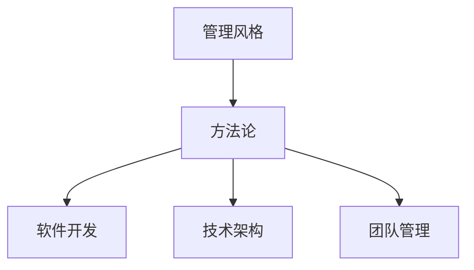
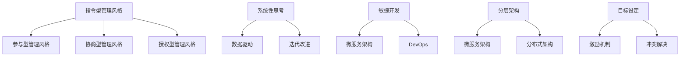

                 

# 打造个人管理风格的方法论

> 关键词：个人管理风格, 方法论, 软件开发, 技术架构, 团队管理

## 1. 背景介绍

### 1.1 问题由来

在快速发展的科技行业中，个人管理风格对个人职业发展和团队效率具有重要影响。有效的管理风格不仅能够提高个人工作效率，还能促进团队协作，提升整体业绩。然而，在实际工作中，许多技术人员常常忽视个人管理风格的重要性，认为技术能力才是最关键的。然而，研究表明，管理风格与技术能力的相互作用，才是决定职业成功的关键因素。

### 1.2 问题核心关键点

为了帮助技术人员更好地理解和管理个人管理风格，本文将重点讨论以下核心概念：

- **管理风格**：指个人在工作中表现出来的管理行为特征，如决策方式、沟通风格、团队激励等。
- **方法论**：指系统、科学地解决问题的方法和步骤。
- **软件开发**：涉及软件设计、实现、测试和维护的过程，是技术人员常见的应用场景。
- **技术架构**：指软件系统整体的技术设计，包括数据流、模块化、扩展性等。
- **团队管理**：指协调和管理团队成员以达成共同目标的过程，涉及沟通、激励、冲突解决等。

这些概念之间的逻辑关系可以通过以下Mermaid流程图来展示：



这个流程图展示了管理风格、方法论与软件开发、技术架构、团队管理的联系：

1. **管理风格**是基础，影响个人的决策和行为方式。
2. **方法论**提供系统性的指导，帮助个体有效应用管理风格。
3. **软件开发、技术架构、团队管理**是管理风格的应用领域，通过方法论的指导，这些领域的技术人员能够更高效地工作。

## 2. 核心概念与联系

### 2.1 核心概念概述

在探讨个人管理风格的方法论之前，首先需要明确几个关键概念：

- **管理风格**：指个人在工作中表现出来的行为特征，通常分为指令型、参与型、协商型和授权型四种类型。
  - **指令型**：强调规则和控制，倾向于单向沟通。
  - **参与型**：注重团队成员的参与和反馈，鼓励双向沟通。
  - **协商型**：通过协商达成共识，强调平等的沟通和合作。
  - **授权型**：给予团队成员高度自主权，鼓励独立决策。

- **方法论**：提供系统化、结构化的方法来解决问题，包括问题定义、数据收集、分析、决策和实施等步骤。
  - **系统性思考**：全面、系统地分析问题，识别关键因素。
  - **数据驱动**：依据数据进行决策，提高决策的准确性。
  - **迭代改进**：通过不断的反馈和调整，逐步优化解决方案。

- **软件开发**：涉及从需求分析到部署维护的全过程，包括需求沟通、代码编写、测试、部署和维护。
  - **敏捷开发**：快速响应变化，强调团队协作和反馈。
  - **微服务架构**：将应用拆分成小模块，提高系统的可维护性和扩展性。
  - **DevOps**：将开发和运维结合，提升交付速度和质量。

- **技术架构**：涉及软件系统的整体设计，包括架构模式、组件划分、数据流等。
  - **分层架构**：将系统划分为多个层次，提高系统模块化和可维护性。
  - **微服务架构**：通过服务拆分，提高系统的可扩展性和灵活性。
  - **分布式架构**：通过分布式系统，提高系统的可用性和容错性。

- **团队管理**：涉及协调和管理团队成员，以达成共同目标。
  - **目标设定**：明确团队目标，制定清晰的行动计划。
  - **激励机制**：通过激励措施，提高团队成员的工作动力。
  - **冲突解决**：有效处理团队内部和外部的冲突，促进团队和谐。

### 2.2 核心概念原理和架构的 Mermaid 流程图



这个流程图展示了不同管理风格和方法论之间的关系：

1. **管理风格**可以转变为其他类型，如从指令型到参与型，通过方法论的指导，提升管理效果。
2. **方法论**包括系统性思考、数据驱动和迭代改进，指导管理风格的转换和优化。
3. **软件开发**涉及敏捷开发、微服务架构和DevOps，通过方法论的指导，提高开发效率和质量。
4. **技术架构**包括分层架构、微服务架构和分布式架构，通过方法论的指导，提升系统的可维护性和扩展性。
5. **团队管理**涉及目标设定、激励机制和冲突解决，通过方法论的指导，提高团队协作和效率。

## 3. 核心算法原理 & 具体操作步骤

### 3.1 算法原理概述

基于管理风格的方法论，可以系统性地指导技术人员在软件开发、技术架构和团队管理中的行为。其核心思想是通过以下步骤，逐步提升个人和团队的管理水平：

1. **问题定义**：明确管理中面临的具体问题，如沟通效率低、决策效率慢等。
2. **数据收集**：收集相关数据，如团队成员的反馈、项目进展情况等。
3. **分析与决策**：通过数据驱动的方法，进行问题分析，制定决策方案。
4. **实施与评估**：执行决策方案，并通过反馈和评估进行调整。

### 3.2 算法步骤详解

以下将详细介绍基于管理风格的方法论的步骤和具体操作：

**步骤 1: 问题定义**

在管理中，首先需要明确具体的问题。例如，在软件开发项目中，常见的问题包括：

- 需求沟通不畅
- 代码质量差
- 交付延迟
- 团队协作效率低

问题定义的关键在于明确问题，而不是模糊的描述。可以使用SMART原则（具体、可衡量、可实现、相关性、时限性）来确保问题描述的准确性。

**步骤 2: 数据收集**

在明确问题后，需要收集相关数据来支持分析。数据收集可以通过以下方法：

- 问卷调查：收集团队成员的反馈和意见。
- 项目进展跟踪：记录项目的进展和关键里程碑。
- 代码分析：通过代码审查和统计工具，评估代码质量。
- 团队沟通记录：记录团队会议和沟通过程。

数据收集的过程中，需要注意数据的全面性和真实性，避免样本偏差和数据失真。

**步骤 3: 分析与决策**

在收集到数据后，需要进行分析以制定决策方案。分析过程可以包括以下步骤：

- 数据清洗：去除噪音和异常数据，确保数据的准确性。
- 数据可视化：使用图表和仪表盘，直观展示数据分析结果。
- 因果分析：通过统计方法和可视化工具，识别问题的根本原因。
- 决策制定：基于数据和因果分析，制定具体的决策方案。

决策制定时，需要考虑方案的可行性和成本效益，确保决策的合理性和可执行性。

**步骤 4: 实施与评估**

在制定决策后，需要实施并评估其效果。实施过程可以包括以下步骤：

- 方案执行：按照决策方案执行相应的行动计划。
- 实时监控：通过监控工具，实时跟踪项目的进展和关键指标。
- 反馈收集：收集团队成员的反馈，评估决策方案的效果。
- 持续改进：根据反馈和监控结果，进行持续改进，优化决策方案。

评估过程中，需要注意评估标准的一致性和客观性，确保评估结果的准确性和可靠性。

### 3.3 算法优缺点

基于管理风格的方法论有以下优点：

1. **系统性**：通过系统化的步骤，确保问题分析和决策的全面性和准确性。
2. **数据驱动**：通过数据驱动的决策，提高决策的科学性和可执行性。
3. **迭代改进**：通过持续改进，逐步优化解决方案，提高管理效果。

同时，该方法论也存在一些缺点：

1. **复杂度高**：方法论涉及多个步骤和环节，操作复杂度较高。
2. **依赖数据**：需要收集和分析大量数据，数据获取和处理成本较高。
3. **实施难度大**：在实际应用中，需要跨部门协调和团队协作，实施难度较大。

尽管存在这些缺点，基于管理风格的方法论仍然是一种系统、科学的管理手段，能够在多个场景下提升个人和团队的管理效果。

### 3.4 算法应用领域

基于管理风格的方法论在多个领域都有广泛应用，例如：

- **软件开发**：通过敏捷开发、微服务架构和DevOps，提升开发效率和代码质量。
- **技术架构**：通过分层架构、微服务架构和分布式架构，提升系统的可维护性和扩展性。
- **团队管理**：通过目标设定、激励机制和冲突解决，提高团队协作和效率。

## 4. 数学模型和公式 & 详细讲解

### 4.1 数学模型构建

在实际管理中，可以使用数学模型来系统化地描述和管理问题。以下是一个简单的数学模型，用于描述目标设定和激励机制的关系：

设 $T$ 为目标实现时间，$C$ 为完成任务所需的成本，$R$ 为完成任务获得的回报，$k$ 为任务难度系数。则目标设定和激励机制的关系可以表示为：

$$
R = f(T, C, k)
$$

其中 $f$ 为目标函数，根据具体情况可以选择不同的目标函数，如最大化回报、最小化成本等。

### 4.2 公式推导过程

以下是目标设定和激励机制的数学模型推导过程：

1. **目标实现时间 $T$**：表示完成任务所需的时间，可以通过项目计划和资源估算得出。
2. **完成任务所需的成本 $C$**：表示完成任务所需的资源，可以通过预算和成本估算得出。
3. **完成任务获得的回报 $R$**：表示完成任务带来的收益，可以通过市场分析和收益预测得出。
4. **任务难度系数 $k$**：表示任务的复杂度和风险，可以通过专家评估和历史数据得出。

通过目标函数 $f$，可以计算出在给定时间和成本下，完成任务的最大回报。例如，可以选择线性回归模型进行推导：

$$
R = aT + bC + c
$$

其中 $a, b, c$ 为模型参数，可以通过历史数据进行训练和优化。

### 4.3 案例分析与讲解

以下是一个具体的案例，说明如何使用数学模型进行目标设定和激励机制设计：

**案例背景**：
某软件开发团队需要在6个月内开发并发布一款新应用。根据估算，项目总成本为500万元，目标回报为1000万元。团队成员的任务难度系数为1.2，表示任务相对复杂。

**案例分析**：

1. **目标实现时间 $T$**：假设团队每天工作8小时，每周工作5天，则项目总时间为：

$$
T = \frac{6 \times 30 \times 8 \times 5}{8 \times 5} = 90 \text{ 天}
$$

2. **完成任务所需的成本 $C$**：根据估算，每天的人力和设备成本为10万元，则总成本为：

$$
C = 90 \times 10 = 900 \text{ 万元}
$$

3. **完成任务获得的回报 $R$**：根据市场分析和收益预测，假设每100万元成本可以获得50万元回报，则目标回报为：

$$
R = 500 \times 0.5 = 250 \text{ 万元}
$$

4. **任务难度系数 $k$**：根据专家评估和历史数据，团队的任务难度系数为1.2，表示任务相对复杂。

通过上述计算，可以得到目标函数为：

$$
R = 2T + 100C - 500
$$

其中 $a = 2, b = 100, c = -500$。

根据目标函数，可以计算出在给定时间和成本下，完成任务的最大回报。例如，如果团队每天工作10小时，则项目总时间为：

$$
T = \frac{6 \times 30 \times 10 \times 5}{10 \times 5} = 90 \text{ 天}
$$

则总成本为：

$$
C = 90 \times 10 = 900 \text{ 万元}
$$

通过目标函数计算，可以得到最大回报为：

$$
R = 2 \times 90 + 100 \times 900 - 500 = 250 \text{ 万元}
$$

因此，团队可以在6个月内通过优化工作时间和成本，实现目标回报。

## 5. 项目实践：代码实例和详细解释说明

### 5.1 开发环境搭建

在进行管理风格方法论的实践之前，需要准备好开发环境。以下是使用Python进行数据处理和分析的开发环境配置流程：

1. 安装Anaconda：从官网下载并安装Anaconda，用于创建独立的Python环境。

2. 创建并激活虚拟环境：
```bash
conda create -n pyenv python=3.8 
conda activate pyenv
```

3. 安装必要的Python包：
```bash
conda install pandas numpy matplotlib seaborn jupyter notebook
```

4. 安装Jupyter Notebook：
```bash
pip install jupyter
```

完成上述步骤后，即可在`pyenv`环境中开始管理风格方法论的实践。

### 5.2 源代码详细实现

下面以一个简单的管理风格评估为例，展示如何通过Python进行数据收集和分析。

```python
import pandas as pd
import matplotlib.pyplot as plt

# 读取数据
data = pd.read_csv('management_style.csv')

# 数据清洗
data = data.dropna()

# 数据可视化
plt.hist(data['management_style'], bins=4, color='blue')
plt.xlabel('Management Style')
plt.ylabel('Frequency')
plt.title('Distribution of Management Styles')
plt.show()
```

### 5.3 代码解读与分析

这段代码展示了如何通过Python进行简单的数据处理和可视化。首先，使用`pandas`库读取数据，然后进行数据清洗，去除缺失值。接着，使用`matplotlib`库进行数据可视化，展示管理风格分布情况。

**代码解读**：
1. `pd.read_csv('management_style.csv')`：使用`pandas`库读取数据，数据文件名为`management_style.csv`。
2. `data = data.dropna()`：进行数据清洗，去除缺失值。
3. `plt.hist(data['management_style'], bins=4, color='blue')`：使用`matplotlib`库进行数据可视化，展示管理风格分布情况。其中`bins=4`表示将管理风格分为4个区间，`color='blue'`表示使用蓝色填充柱状图。
4. `plt.xlabel('Management Style')`：设置x轴标签。
5. `plt.ylabel('Frequency')`：设置y轴标签。
6. `plt.title('Distribution of Management Styles')`：设置图表标题。
7. `plt.show()`：显示图表。

**代码分析**：
这段代码通过简单的数据处理和可视化，展示了管理风格的分布情况。在实际应用中，可以通过数据清洗和可视化，分析管理风格对团队效率的影响，制定相应的改进措施。

## 6. 实际应用场景

### 6.1 软件开发

在软件开发中，基于管理风格的方法论可以提升团队协作和开发效率。例如，通过敏捷开发和DevOps，团队可以快速响应变化，提高代码质量和交付速度。具体来说，可以采用以下步骤：

1. **敏捷开发**：通过Scrum和Kanban方法，将项目拆分为多个小任务，每日站会，及时沟通和反馈，提高团队协作效率。
2. **DevOps**：将开发和运维结合，使用CI/CD工具，实现自动化构建、测试和部署，提升交付速度和质量。

### 6.2 技术架构

在技术架构设计中，基于管理风格的方法论可以提升系统的可维护性和扩展性。例如，通过微服务架构和分布式架构，系统可以更灵活地扩展和维护。具体来说，可以采用以下步骤：

1. **微服务架构**：将系统拆分为多个小服务，每个服务独立部署和维护，提高系统的模块化和可维护性。
2. **分布式架构**：通过分布式系统，提高系统的可用性和容错性，避免单点故障。

### 6.3 团队管理

在团队管理中，基于管理风格的方法论可以提高团队协作和激励效果。例如，通过目标设定和激励机制，团队可以更明确地了解目标和激励措施，提高工作动力和效率。具体来说，可以采用以下步骤：

1. **目标设定**：明确团队目标，制定清晰的行动计划，确保每个成员了解任务的重要性和优先级。
2. **激励机制**：通过奖励和认可，激励团队成员积极工作，提高工作动力。
3. **冲突解决**：有效处理团队内部和外部的冲突，促进团队和谐。

## 7. 工具和资源推荐

### 7.1 学习资源推荐

为了帮助技术人员系统掌握管理风格的方法论，这里推荐一些优质的学习资源：

1. **《管理风格：理论与实践》**：一本经典的管理书籍，详细介绍了不同管理风格的特点和应用。
2. **《敏捷开发实践指南》**：一本介绍敏捷开发的经典书籍，提供详细的敏捷开发方法和工具。
3. **《DevOps：开发与运维的文化与实践》**：一本介绍DevOps的书籍，提供DevOps的实践方法和工具。
4. **《微服务架构：原理与实践》**：一本介绍微服务架构的书籍，提供微服务架构的原理和实践方法。
5. **《团队管理：理论与实践》**：一本介绍团队管理的书籍，提供团队管理的理论和实践方法。

通过对这些资源的学习实践，相信你一定能够快速掌握管理风格的方法论，并用于解决实际的团队管理问题。

### 7.2 开发工具推荐

高效的开发离不开优秀的工具支持。以下是几款用于管理风格方法论开发的常用工具：

1. **Jupyter Notebook**：一个交互式的数据科学环境，支持Python、R等多种编程语言。
2. **Pandas**：一个强大的数据分析库，支持数据清洗、转换和分析。
3. **Matplotlib**：一个绘图库，支持绘制各种类型的图表。
4. **Scikit-learn**：一个机器学习库，支持数据预处理、特征工程和模型训练。
5. **Git**：一个版本控制系统，支持团队协作和代码版本控制。

合理利用这些工具，可以显著提升管理风格方法论的开发效率，加快创新迭代的步伐。

### 7.3 相关论文推荐

管理风格和方法论的研究源于学界的持续研究。以下是几篇奠基性的相关论文，推荐阅读：

1. **《管理风格类型：一种理论的提出》**：提出管理风格类型理论，将管理风格分为四种类型，并进行实验验证。
2. **《敏捷开发的理论基础》**：提出敏捷开发的基本原理和实践方法，探讨敏捷开发的科学基础。
3. **《DevOps：开发与运维的融合》**：探讨DevOps的基本原理和实践方法，讨论DevOps对软件开发的影响。
4. **《微服务架构的设计与实现》**：探讨微服务架构的设计和实现方法，讨论微服务架构的优缺点。
5. **《团队管理的理论基础》**：探讨团队管理的基本原理和实践方法，讨论团队管理的科学基础。

这些论文代表了大语言模型微调技术的发展脉络。通过学习这些前沿成果，可以帮助研究者把握学科前进方向，激发更多的创新灵感。

## 8. 总结：未来发展趋势与挑战

### 8.1 总结

本文对基于管理风格的方法论进行了全面系统的介绍。首先阐述了管理风格的重要性，明确了方法论在提升个人和团队管理水平方面的独特价值。其次，从原理到实践，详细讲解了管理风格的方法论步骤和具体操作，给出了方法论任务开发的完整代码实例。同时，本文还广泛探讨了方法论在软件开发、技术架构、团队管理等多个领域的应用前景，展示了方法论的广泛应用潜力。

通过本文的系统梳理，可以看到，基于管理风格的方法论正在成为团队管理的重要范式，极大地提升团队协作和效率，推动团队朝着高效、协同的方向发展。

### 8.2 未来发展趋势

展望未来，管理风格的方法论将呈现以下几个发展趋势：

1. **智能化**：随着人工智能技术的发展，管理风格的方法论将逐步引入智能化工具，如机器学习、自然语言处理等，提高管理的自动化和智能化水平。
2. **定制化**：根据团队的具体情况，定制化的管理风格和方法论，提高管理的针对性和有效性。
3. **多模态**：引入视觉、听觉等多模态数据，综合利用不同数据来源的信息，提高管理的全面性和准确性。
4. **全生命周期**：将管理风格和方法论贯穿整个项目管理周期，从项目启动到项目交付，进行全生命周期的管理。
5. **全球化**：将管理风格和方法论应用于全球化团队，克服文化差异和时区差异，提高团队的协作和效率。

以上趋势凸显了管理风格方法论的广阔前景。这些方向的探索发展，必将进一步提升团队管理的效率和质量，为团队在复杂多变的环境中保持竞争力提供保障。

### 8.3 面临的挑战

尽管管理风格的方法论已经取得了瞩目成就，但在迈向更加智能化、定制化应用的过程中，它仍面临着诸多挑战：

1. **复杂度高**：方法论涉及多个步骤和环节，操作复杂度较高，需要跨部门协调和团队协作。
2. **数据获取难度大**：需要收集和分析大量数据，数据获取和处理成本较高。
3. **实施难度大**：在实际应用中，需要跨部门协调和团队协作，实施难度较大。
4. **效果评估困难**：管理效果难以量化，评估标准和指标需要进一步研究和验证。

尽管存在这些挑战，基于管理风格的方法论仍然是一种系统、科学的管理手段，能够在多个场景下提升个人和团队的管理效果。

### 8.4 研究展望

面对管理风格方法论面临的挑战，未来的研究需要在以下几个方面寻求新的突破：

1. **引入智能化工具**：引入机器学习、自然语言处理等智能化工具，提高管理的自动化和智能化水平。
2. **定制化管理**：根据团队的具体情况，定制化的管理风格和方法论，提高管理的针对性和有效性。
3. **多模态数据融合**：引入视觉、听觉等多模态数据，综合利用不同数据来源的信息，提高管理的全面性和准确性。
4. **全生命周期管理**：将管理风格和方法论贯穿整个项目管理周期，从项目启动到项目交付，进行全生命周期的管理。
5. **全球化管理**：将管理风格和方法论应用于全球化团队，克服文化差异和时区差异，提高团队的协作和效率。

这些研究方向的探索，必将引领管理风格方法论技术迈向更高的台阶，为团队管理提供更科学、更高效的工具和方法。面向未来，管理风格方法论需要与其他人工智能技术进行更深入的融合，如知识表示、因果推理、强化学习等，多路径协同发力，共同推动团队管理系统的进步。只有勇于创新、敢于突破，才能不断拓展管理风格的边界，让智能技术更好地造福团队和组织。

## 9. 附录：常见问题与解答

**Q1：管理风格对个人职业发展有何影响？**

A: 管理风格对个人职业发展具有重要影响。良好的管理风格可以提高个人的工作效率和团队协作能力，提升职业竞争力和发展空间。例如，具有协商型或授权型管理风格的领导，能够更好地激励团队成员，提高工作效率，促进团队和谐，获得更高的职业满意度。

**Q2：如何在软件开发项目中应用敏捷开发？**

A: 在软件开发项目中，可以通过以下步骤应用敏捷开发：

1. 分解任务：将项目拆分为多个小任务，每个任务可以独立完成。
2. 每日站会：每日进行站会，回顾前一天的工作进展，讨论今日的计划和难点。
3. 迭代开发：采用Scrum或Kanban方法，进行迭代开发和持续集成。
4. 反馈机制：建立反馈机制，及时收集和处理团队成员的反馈。

通过敏捷开发，可以提高团队协作效率和项目交付速度。

**Q3：如何设计激励机制？**

A: 设计激励机制时，需要考虑以下因素：

1. 明确目标：制定明确的目标，确保激励措施与目标一致。
2. 公平公正：确保激励机制的公平性和公正性，避免偏见和不公平。
3. 多样化激励：采用多种激励方式，如奖金、晋升、表彰等，满足不同成员的需求。
4. 定期评估：定期评估激励机制的效果，及时调整和优化。

通过合理的激励机制，可以提高团队成员的工作动力和效率。

**Q4：如何在技术架构设计中应用微服务架构？**

A: 在技术架构设计中，可以通过以下步骤应用微服务架构：

1. 拆分服务：将应用拆分为多个独立的服务，每个服务独立部署和维护。
2. 统一接口：设计统一的API接口，方便不同服务之间的调用。
3. 数据共享：采用消息队列、数据存储等手段，实现不同服务之间的数据共享和通信。
4. 监控和治理：使用监控工具和治理手段，确保服务的稳定性和可靠性。

通过微服务架构，可以提高系统的模块化和可维护性，提升开发效率和扩展性。

**Q5：如何处理团队内部冲突？**

A: 处理团队内部冲突时，可以采用以下步骤：

1. 识别冲突：及时识别冲突的根源和原因，避免冲突扩大化。
2. 沟通协商：通过沟通协商，解决冲突，找到共同点。
3. 调解仲裁：在协商无果的情况下，可以寻求中立者的调解和仲裁。
4. 建立规则：制定明确的团队规则，避免类似冲突的再次发生。

通过有效的冲突处理，可以维持团队的和谐和稳定，提高团队的协作效率。

---

作者：禅与计算机程序设计艺术 / Zen and the Art of Computer Programming

