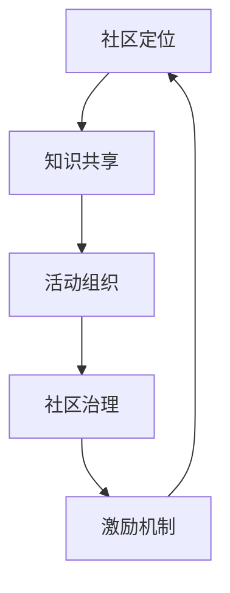

                 

# 技术社区建设：从参与者到组织者

## 1. 背景介绍

### 1.1 问题由来

在当今数字化时代，技术创新日新月异，技术社区的建设已经成为推动技术进步的重要引擎。一个活跃的技术社区不仅能汇聚顶级专家和爱好者，还能提供丰富的知识资源和讨论平台，促进技术传播和应用。然而，构建一个具有强大影响力和持续活力的技术社区并非易事。它需要系统化的规划、创新的组织方式，以及有效的社区治理策略。本文将系统介绍技术社区的建设方法，从参与者到组织者，帮助社区领袖和开发者构建一个高效、有活力的技术社区。

### 1.2 问题核心关键点

构建一个技术社区的关键在于以下几个方面：
- **社区定位**：明确社区的使命、愿景和目标，吸引具有相同兴趣的参与者。
- **知识共享**：提供高质量的知识资源，包括文档、课程、项目等，促进技术交流和学习。
- **活动组织**：定期举办线上线下活动，如技术沙龙、黑客松、讲座等，增强社区的互动性和凝聚力。
- **社区治理**：制定明确的社区规则和行为准则，确保社区环境的健康和有序。
- **激励机制**：设计合理的激励措施，鼓励成员的积极参与和贡献。

## 2. 核心概念与联系

### 2.1 核心概念概述

在构建技术社区的过程中，涉及以下几个关键概念：

- **社区**：由共同兴趣和目标的技术爱好者组成的群体，旨在共享知识、交流经验、合作创新。
- **知识共享平台**：提供丰富的技术资料和讨论区，促进成员之间的知识交流和合作。
- **活动组织**：定期举办的线上线下活动，如技术讨论、项目开发、比赛等，增强社区的凝聚力和活跃度。
- **社区治理**：通过制定规则和实施管理措施，确保社区环境的健康有序。
- **激励机制**：设计合理的激励措施，鼓励成员积极参与和贡献。

这些概念相互关联，共同构成了一个高效、有活力的技术社区。通过理解这些概念的原理和架构，可以更好地指导社区的建设和管理。

### 2.2 核心概念原理和架构的 Mermaid 流程图(Mermaid 流程节点中不要有括号、逗号等特殊字符)



该流程图展示了社区建设的基本流程，从社区定位开始，逐步完善知识共享、活动组织、社区治理和激励机制，形成良性循环。

## 3. 核心算法原理 & 具体操作步骤
### 3.1 算法原理概述

技术社区的建设遵循系统化、自组织的原理，主要包括以下步骤：

1. **社区定位**：明确社区的目标和愿景，吸引相同兴趣的成员。
2. **知识共享**：提供丰富的知识资源和讨论平台，促进技术交流和学习。
3. **活动组织**：定期举办线上线下活动，增强社区的凝聚力和活跃度。
4. **社区治理**：制定明确的社区规则和行为准则，确保社区环境的健康有序。
5. **激励机制**：设计合理的激励措施，鼓励成员积极参与和贡献。

### 3.2 算法步骤详解

#### 3.2.1 社区定位

- **目标设定**：确定社区的主要目标和愿景，如技术创新、知识共享、行业引领等。
- **受众分析**：分析目标受众的需求和兴趣，吸引具有相同兴趣的成员。
- **品牌打造**：通过名称、标识、口号等元素，塑造社区的品牌形象。

#### 3.2.2 知识共享

- **资源收集**：收集和整理高质量的技术文档、课程、项目等，提供给社区成员。
- **平台搭建**：搭建一个易于使用的知识共享平台，如GitHub、Discord、Slack等。
- **内容更新**：定期更新和维护知识库，确保内容的时效性和准确性。

#### 3.2.3 活动组织

- **活动规划**：规划定期举办的线上线下活动，如技术沙龙、黑客松、讲座等。
- **活动宣传**：通过社交媒体、邮件列表等渠道，宣传和推广活动。
- **活动执行**：确保活动的顺利进行，记录和总结活动效果。

#### 3.2.4 社区治理

- **规则制定**：制定明确的社区规则和行为准则，确保社区环境的健康有序。
- **管理团队**：组建一个由社区成员选举产生的管理团队，负责社区的日常管理和维护。
- **争议解决**：建立争议解决机制，及时处理社区内部的纠纷和争议。

#### 3.2.5 激励机制

- **奖励制度**：设计合理的奖励制度，如积分、徽章、荣誉等，激励成员积极参与和贡献。
- **贡献表彰**：定期表彰社区内的贡献者，如技术贡献者、活跃成员等，提升社区凝聚力。
- **反馈机制**：建立社区成员反馈机制，及时改进社区运营和活动组织。

### 3.3 算法优缺点

#### 3.3.1 优点

- **多样化资源**：社区成员共同参与知识共享，提供丰富的技术资料和讨论平台。
- **高互动性**：通过定期活动和讨论，增强社区成员的互动和合作。
- **自我管理**：社区成员通过选举和管理团队，实现自我管理和自治。
- **激励机制**：通过合理的激励措施，鼓励成员积极参与和贡献。

#### 3.3.2 缺点

- **管理难度**：社区成员多样，需要有效管理和协调。
- **资源需求高**：需要投入大量时间和资源进行社区建设和管理。
- **规则执行难度**：确保社区规则的公平执行，避免争议和纠纷。

## 4. 数学模型和公式 & 详细讲解 & 举例说明

### 4.1 数学模型构建

技术社区的知识共享平台可以通过以下几个模型来描述：

- **文档模型**：用于描述技术文档的结构和内容，包括标题、摘要、正文等。
- **讨论模型**：用于描述社区成员之间的讨论内容，包括帖子、评论、点赞等。
- **活动模型**：用于描述社区活动的信息，包括时间、地点、参与者等。

### 4.2 公式推导过程

- **文档模型**：
  $$
  \text{Doc} = (\text{Title}, \text{Abstract}, \text{Body})
  $$
  其中 $\text{Doc}$ 表示文档，$\text{Title}$ 为文档标题，$\text{Abstract}$ 为文档摘要，$\text{Body}$ 为文档正文。

- **讨论模型**：
  $$
  \text{Discuss} = (\text{Post}, \text{Comments}, \text{Likes})
  $$
  其中 $\text{Discuss}$ 表示讨论，$\text{Post}$ 为讨论帖子，$\text{Comments}$ 为讨论评论，$\text{Likes}$ 为点赞数。

- **活动模型**：
  $$
  \text{Event} = (\text{Name}, \text{Date}, \text{Location}, \text{Participants})
  $$
  其中 $\text{Event}$ 表示活动，$\text{Name}$ 为活动名称，$\text{Date}$ 为活动日期，$\text{Location}$ 为活动地点，$\text{Participants}$ 为参与者列表。

### 4.3 案例分析与讲解

以一个开源社区为例，分析其知识共享平台和活动组织的模型：

- **文档模型**：
  - **Python教程**：标题为 "Python编程基础"，摘要为 "本教程介绍Python的基本语法和常用库"，正文详细讲解了Python的语法、数据结构、函数等。
  - **机器学习入门**：标题为 "机器学习简介"，摘要为 "本教程介绍机器学习的基本概念和常用算法"，正文详细讲解了机器学习的基本原理和常用算法。

- **讨论模型**：
  - **帖子**：用户提问 "如何使用Python进行数据分析"，社区成员回复并讨论。
  - **评论**：用户对回复进行点赞和评论，进一步讨论数据分析方法。
  - **讨论热度**：帖子有100条评论，20个点赞。

- **活动模型**：
  - **Python编程大赛**：名称为 "Python编程大赛"，日期为 "2023年5月1日"，地点为 "线上"，参与者包括社区内外的Python开发者。
  - **活动安排**：包含任务说明、参赛规则、时间安排等。

通过这些模型，可以更系统地理解和分析社区的知识共享和活动组织。

## 5. 项目实践：代码实例和详细解释说明

### 5.1 开发环境搭建

为了搭建一个技术社区的知识共享平台和活动组织系统，需要以下开发环境：

- **Web框架**：如Django、Flask等，用于搭建Web应用。
- **数据库**：如MySQL、PostgreSQL等，用于存储文档、讨论、活动等数据。
- **讨论工具**：如Discord、Slack等，用于社区成员之间的讨论。
- **项目管理工具**：如GitHub、GitLab等，用于管理社区的项目和代码。

### 5.2 源代码详细实现

以下是一个基于Django框架的知识共享平台实现示例：

```python
# settings.py
INSTALLED_APPS = [
    'home',
    'documents',
    'discussions',
    'events',
    'forum',
    'user',
]

# urls.py
from django.contrib import admin
from django.urls import path, include

urlpatterns = [
    path('admin/', admin.site.urls),
    path('', include('home.urls')),
    path('documents/', include('documents.urls')),
    path('discussions/', include('discussions.urls')),
    path('events/', include('events.urls')),
    path('forum/', include('forum.urls')),
    path('user/', include('user.urls')),
]

# models.py
class Document(models.Model):
    title = models.CharField(max_length=255)
    abstract = models.TextField()
    body = models.TextField()
    created_at = models.DateTimeField(auto_now_add=True)
    updated_at = models.DateTimeField(auto_now=True)

class Discussion(models.Model):
    title = models.CharField(max_length=255)
    content = models.TextField()
    created_at = models.DateTimeField(auto_now_add=True)
    updated_at = models.DateTimeField(auto_now=True)
    likes = models.IntegerField(default=0)

class Event(models.Model):
    name = models.CharField(max_length=255)
    date = models.DateTimeField()
    location = models.CharField(max_length=255)
    participants = models.ManyToManyField(User)

# views.py
from django.shortcuts import render
from .models import Document, Discussion, Event

def home(request):
    documents = Document.objects.all().order_by('-created_at')
    events = Event.objects.all().order_by('-created_at')
    return render(request, 'home.html', {'documents': documents, 'events': events})

# home.html

    <h2>{{ document.title }}</h2>
    <p>{{ document.abstract }}</p>
    <p>{{ document.body }}</p>
    <a href="/documents/{{ document.id }}">阅读全文</a>



    <h2>{{ event.name }}</h2>
    <p>{{ event.date }}</p>
    <p>{{ event.location }}</p>
    <a href="/events/{{ event.id }}">详情</a>

```

### 5.3 代码解读与分析

- **Django框架**：使用Django框架可以快速搭建Web应用，提供了丰富的ORM模型和视图处理功能。
- **模型设计**：通过定义Document、Discussion、Event等模型，存储社区的知识资源和活动信息。
- **视图设计**：通过定义home视图，展示社区的文档和活动信息。
- **页面渲染**：通过模板引擎渲染HTML页面，展示文档和活动信息。

通过以上代码示例，可以看出技术社区的知识共享平台和活动组织系统的基本实现流程。

### 5.4 运行结果展示

在运行上述代码后，社区成员可以通过Web界面访问社区的文档和活动信息，实现知识共享和活动组织。

## 6. 实际应用场景

### 6.1 开源社区

开源社区是技术社区的重要形式，聚集了大量的技术爱好者和开发者。通过构建知识共享平台和活动组织系统，开源社区可以更好地促进技术交流和合作创新。

例如，一个开源社区可以提供以下服务：
- **文档分享**：社区成员可以上传和分享技术文档，提供丰富的学习资源。
- **代码协作**：社区成员可以通过项目管理工具进行代码协作，共同开发开源项目。
- **技术讨论**：社区成员可以在讨论区进行技术讨论和问题解决，共同提升技术水平。
- **活动组织**：社区可以定期组织技术沙龙、黑客松、线上研讨会等活动，增强社区的凝聚力和活跃度。

### 6.2 企业技术社区

企业技术社区也是技术社区的重要形式，可以提升企业的技术创新能力和员工的技术水平。通过构建知识共享平台和活动组织系统，企业技术社区可以更好地促进知识共享和合作创新。

例如，一个企业技术社区可以提供以下服务：
- **内部培训**：企业可以组织内部培训和技术分享会，提升员工的技术水平。
- **技术交流**：企业员工可以在知识共享平台上交流和分享技术经验，提升整体技术水平。
- **项目协作**：企业员工可以通过项目管理工具进行项目协作，共同开发企业应用。
- **活动组织**：企业可以定期组织技术沙龙、黑客松、线上研讨会等活动，增强团队的凝聚力和创新能力。

### 6.3 学术技术社区

学术技术社区是技术社区的重要形式，可以提升学术研究的水平和影响力。通过构建知识共享平台和活动组织系统，学术技术社区可以更好地促进学术交流和合作创新。

例如，一个学术技术社区可以提供以下服务：
- **文献分享**：学术研究人员可以上传和分享研究论文和文献，提供丰富的学术资源。
- **论文评审**：学术研究人员可以在论文评审平台上进行论文评审和讨论，提升论文质量。
- **学术交流**：学术研究人员可以在讨论区进行学术交流和问题解决，共同提升学术水平。
- **学术活动**：学术社区可以定期组织学术研讨会、线上讲座等活动，增强学术交流的活力。

## 7. 工具和资源推荐

### 7.1 学习资源推荐

为了帮助开发者系统掌握技术社区的建设方法，这里推荐一些优质的学习资源：

- **《社区运营的艺术》系列博文**：由社区运营专家撰写，介绍社区建设的系统化方法和运营技巧。
- **CS401《社区与网络》课程**：斯坦福大学开设的社区管理课程，深入讲解社区的构建和运营。
- **《社区管理与运营》书籍**：社区运营的实践指南，涵盖社区建设的各个方面。
- **Slack官方文档**：Slack官方文档，提供社区管理和活动组织的工具和方法。
- **GitHub官方文档**：GitHub官方文档，提供项目管理和代码协作的详细指南。

通过对这些资源的学习实践，相信你一定能够快速掌握技术社区的建设方法，并用于解决实际的社区问题。

### 7.2 开发工具推荐

高效的工具支持是技术社区建设的关键。以下是几款用于社区建设和活动组织的常用工具：

- **Django框架**：快速搭建Web应用，提供丰富的ORM模型和视图处理功能。
- **MySQL数据库**：用于存储社区的文档、讨论和活动信息。
- **Discord讨论工具**：提供实时通信和语音聊天功能，增强社区成员的互动。
- **GitHub项目管理工具**：用于管理社区的项目和代码，提供版本控制和协作功能。
- **Eventbrite活动管理工具**：用于组织和管理社区活动，提供活动宣传和报名功能。

合理利用这些工具，可以显著提升技术社区的建设和活动组织效率，加快创新迭代的步伐。

### 7.3 相关论文推荐

技术社区建设的研究已经取得诸多成果，以下是几篇奠基性的相关论文，推荐阅读：

- **《社区构建和管理的心理与社会科学研究综述》**：介绍社区构建和管理的理论基础和方法。
- **《开源社区的形成和发展机制》**：分析开源社区的形成和发展机制，探讨社区建设的策略。
- **《学术社区的知识共享与合作网络研究》**：研究学术社区的知识共享与合作网络，提出社区建设的优化策略。
- **《技术社区的治理模式与机制研究》**：探讨技术社区的治理模式与机制，提出社区治理的实践方案。

这些论文代表了大语言模型微调技术的发展脉络。通过学习这些前沿成果，可以帮助研究者把握学科前进方向，激发更多的创新灵感。

## 8. 总结：未来发展趋势与挑战

### 8.1 总结

本文对技术社区的建设方法进行了全面系统的介绍。首先阐述了技术社区建设的背景和意义，明确了社区定位、知识共享、活动组织、社区治理和激励机制的关键点。其次，从原理到实践，详细讲解了技术社区的建设过程，提供了完整的代码实现和运行结果展示。最后，本文还广泛探讨了技术社区在开源社区、企业技术社区和学术技术社区中的应用场景，展示了社区建设的广泛应用前景。

通过本文的系统梳理，可以看到，技术社区建设不仅能促进技术交流和合作创新，还能提升企业和技术社区的竞争力，具有重要的战略价值。未来，伴随社区建设的不断深化，技术社区必将在更广泛的应用领域发挥更大作用。

### 8.2 未来发展趋势

展望未来，技术社区建设将呈现以下几个发展趋势：

1. **社区自治**：社区成员将更多地参与社区治理，实现自我管理和自治。
2. **数据驱动**：通过数据分析和用户反馈，不断优化社区建设和运营策略。
3. **跨社区协作**：不同社区之间将更多地进行协作和资源共享，提升整体技术水平。
4. **虚拟现实**：虚拟现实技术将更多地应用于社区活动和知识共享，提升用户体验和互动效果。
5. **移动化**：社区应用将更多地向移动端拓展，方便用户随时随地访问和使用。

以上趋势凸显了技术社区建设的广阔前景。这些方向的探索发展，必将进一步提升社区的活力和创新能力，促进技术的传播和应用。

### 8.3 面临的挑战

尽管技术社区建设已经取得了诸多成果，但在迈向更加智能化、普适化应用的过程中，它仍面临着诸多挑战：

1. **管理难度**：社区成员多样，需要有效管理和协调。
2. **资源需求高**：需要投入大量时间和资源进行社区建设和管理。
3. **规则执行难度**：确保社区规则的公平执行，避免争议和纠纷。
4. **用户粘性不足**：需要设计合理的激励机制，提升用户粘性和活跃度。
5. **技术迭代快**：社区需要不断更新和维护知识库，保持技术的前沿性。

这些挑战需要社区组织者和开发者共同努力，通过技术创新和社区治理优化，逐步克服。

### 8.4 研究展望

面对技术社区建设所面临的挑战，未来的研究需要在以下几个方面寻求新的突破：

1. **智能化管理**：引入人工智能技术，实现社区成员和活动的智能化管理，提升效率和准确性。
2. **社区治理优化**：研究社区治理的优化策略，制定更公平、透明的规则和激励机制。
3. **知识共享提升**：通过数据分析和用户反馈，不断优化知识库的构建和维护。
4. **跨社区协作**：探讨不同社区之间的协作模式和机制，提升整体技术水平。
5. **虚拟现实应用**：研究虚拟现实技术在社区活动和知识共享中的应用，提升用户体验。

这些研究方向将引领技术社区建设走向更高的台阶，为构建安全、可靠、可解释、可控的智能系统铺平道路。面向未来，技术社区建设还需要与其他人工智能技术进行更深入的融合，多路径协同发力，共同推动自然语言理解和智能交互系统的进步。只有勇于创新、敢于突破，才能不断拓展技术社区的边界，让智能技术更好地造福人类社会。

## 9. 附录：常见问题与解答

**Q1：如何构建一个有影响力的技术社区？**

A: 构建一个有影响力的技术社区需要以下步骤：
- **明确社区定位**：确定社区的目标和愿景，吸引具有相同兴趣的成员。
- **提供高质量资源**：提供丰富的知识资源和讨论平台，促进技术交流和学习。
- **定期举办活动**：通过线上线下活动，增强社区的凝聚力和活跃度。
- **建立社区治理**：制定明确的社区规则和行为准则，确保社区环境的健康有序。
- **设计激励机制**：通过合理的激励措施，鼓励成员积极参与和贡献。

**Q2：技术社区应该如何激励成员的积极参与？**

A: 技术社区可以通过以下激励措施鼓励成员积极参与：
- **积分制度**：根据成员的贡献，给予积分奖励，激励成员积极参与。
- **徽章和荣誉**：设计徽章和荣誉，表彰成员的突出贡献，提升社区成员的荣誉感。
- **奖励机制**：定期组织评选和表彰，奖励在技术创新、知识分享等方面的优秀成员。
- **反馈机制**：建立反馈机制，及时改进社区运营和活动组织，提升用户体验。

**Q3：技术社区在企业内部的建设有何优势？**

A: 技术社区在企业内部的建设有以下优势：
- **知识共享**：提升员工的技术水平，促进知识共享和技术传播。
- **项目协作**：通过项目管理工具，实现跨部门的协作和项目开发。
- **技术交流**：增强员工之间的技术交流和合作，提升整体技术水平。
- **创新能力**：激发员工的创新灵感，推动企业技术创新和应用。

**Q4：如何构建一个跨社区的合作网络？**

A: 构建一个跨社区的合作网络需要以下步骤：
- **选择合适的合作对象**：选择有共同兴趣和目标的社区进行合作。
- **制定合作协议**：明确合作的领域和方式，制定合作协议和责任分工。
- **共享资源和信息**：共享知识资源和技术信息，提升整体技术水平。
- **定期交流与评估**：定期进行交流和评估，及时解决问题和改进合作方式。

**Q5：技术社区如何应对技术迭代快的挑战？**

A: 技术社区可以通过以下方式应对技术迭代快的挑战：
- **持续更新知识库**：定期更新和维护知识库，保持技术的前沿性。
- **引入新技术**：引入最新的人工智能技术和工具，提升社区的技术水平。
- **用户反馈机制**：建立用户反馈机制，及时获取用户的意见和建议，改进社区建设和运营。

通过以上问题与解答，可以帮助开发者更好地理解技术社区建设的方法和挑战，并在实践中不断优化社区的建设和运营策略。

