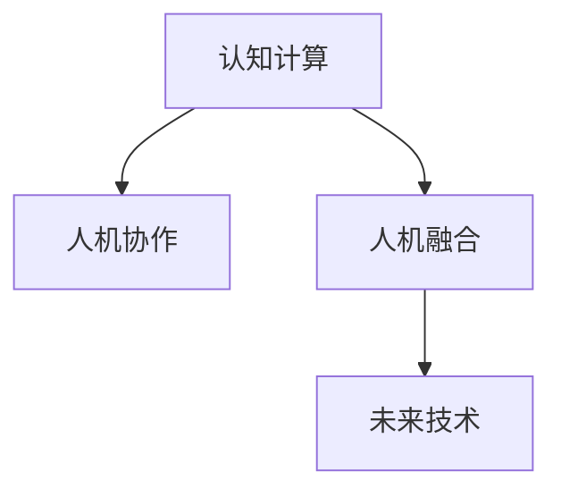

                 

# 探索人类思维的奥秘：人类计算的认知价值

> 关键词：认知计算,人类思维模型,人工智能,人机协作,人机融合,未来技术

## 1. 背景介绍

### 1.1 问题由来
人类社会的演化历史，本质上就是一部智能演进史。从使用简单的石制工具到制造复杂的机器，从原始口语的传播到现代信息技术的应用，人类一直在不断提升自身的计算能力和认知水平。今天，随着人工智能技术的飞速发展，人类已经具备了前所未有的计算能力，能够模拟和扩展人类智能，甚至在某些领域超越了人类的认知能力。

然而，尽管如此，我们对人类思维的认知仍然远远不够。人类思维的复杂性、动态性和多维度性，使得现有的计算模型和算法难以全面模拟和解释。如何更好地理解人类思维的机制，构建更加智能、高效的计算模型，成为一个亟待解决的科学问题。

### 1.2 问题核心关键点
1. **认知计算**：人类计算不仅仅是数值运算，更涉及符号、语义、情感等多方面的计算。认知计算旨在模拟人类思维的多层次结构，构建能够处理复杂信息的计算系统。
2. **人机融合**：人机融合关注如何将人类智能与机器智能相结合，提升系统的智能水平和适应性。人机融合的关键在于构建能够理解人类需求、情感和行为的计算模型。
3. **未来技术**：未来技术的发展趋势，包括量子计算、脑机接口、神经形态计算等，将深刻影响人类计算的认知价值。

## 2. 核心概念与联系

### 2.1 核心概念概述

为更好地理解人类计算的认知价值，本节将介绍几个密切相关的核心概念：

- **认知计算**：旨在模拟人类思维的计算模型，包括符号计算、逻辑推理、模式识别、情感分析等。
- **人机协作**：通过将人类和机器各自的优势结合起来，实现更高效、更灵活的计算任务。
- **人机融合**：将人类认知与机器学习相结合，构建能够理解人类需求、情感和行为的智能系统。
- **未来技术**：包括量子计算、脑机接口、神经形态计算等，旨在解决传统计算模型的局限性，提升计算效率和智能水平。

这些核心概念之间的逻辑关系可以通过以下Mermaid流程图来展示：



这个流程图展示了几大核心概念之间的关联：

1. 认知计算为人机协作提供了理论基础。
2. 人机协作利用认知计算和未来技术的优势，提升计算任务效率和智能水平。
3. 人机融合结合了认知计算和机器学习的优势，构建更加智能的计算模型。

## 3. 核心算法原理 & 具体操作步骤

### 3.1 算法原理概述

认知计算的核心在于构建能够模拟人类思维的计算模型。这种模型通常包括符号计算、逻辑推理、模式识别、情感分析等多个层次。其基本思想是通过将符号和逻辑运算与具体情境相结合，构建出能够处理复杂信息的计算系统。

具体来说，认知计算的过程可以分为以下几个步骤：

1. **符号表示**：将输入信息转换为符号表示，如文字、图像、声音等。
2. **逻辑推理**：通过符号之间的逻辑关系进行推理计算，如因果关系、蕴含关系等。
3. **模式识别**：识别出输入信息的结构模式，如语法结构、语义模式等。
4. **情感分析**：分析输入信息的情感倾向，如正面、负面、中性等。
5. **综合判断**：将以上各步骤的结果综合起来，进行最终的判断和决策。

这些步骤通常通过不同的算法和模型实现，包括规则推理、专家系统、神经网络、深度学习等。

### 3.2 算法步骤详解

认知计算的实现通常包括以下几个关键步骤：

**Step 1: 符号表示**

1. **输入信息预处理**：将输入信息转换为符号表示，如文字、图像、声音等。这一步需要考虑信息的格式和结构，将其转换为计算模型可以处理的形式。
2. **符号映射**：将符号表示映射到计算机可以处理的编码形式，如自然语言文本的编码。

**Step 2: 逻辑推理**

1. **逻辑规则定义**：定义符号之间的逻辑关系，如因果关系、蕴含关系等。这通常需要通过专家知识和逻辑推理规则来实现。
2. **推理计算**：通过符号之间的逻辑关系进行推理计算，得出结果。

**Step 3: 模式识别**

1. **结构分析**：分析输入信息的结构模式，如语法结构、语义模式等。这通常需要使用自然语言处理、图像处理等技术。
2. **模式匹配**：将输入信息与已有的模式库进行匹配，识别出符合模式的子结构。

**Step 4: 情感分析**

1. **情感词库构建**：构建情感词库，包括正面、负面、中性等情感词汇。
2. **情感计算**：通过分析输入信息中情感词的出现频率、强度等，计算出情感倾向。

**Step 5: 综合判断**

1. **多层次计算**：将以上各步骤的结果综合起来，进行最终的判断和决策。这一步通常需要考虑多层次的计算和综合判断。
2. **输出结果**：将最终的判断结果输出，供用户使用。

### 3.3 算法优缺点

认知计算的优势在于能够模拟人类思维的多层次结构和动态性，处理复杂的信息和情境。然而，也存在以下局限性：

**优点**：
1. **灵活性高**：能够处理多种类型的输入信息，适应性强。
2. **复杂度低**：符号表示和逻辑推理的方式简单直观，易于理解和实现。
3. **可解释性强**：通过符号和逻辑的推导过程，计算模型的决策过程可解释性强，易于理解和调试。

**缺点**：
1. **计算复杂度高**：符号表示和逻辑推理的方式可能涉及大量的计算资源，效率较低。
2. **知识获取困难**：构建符号表示和逻辑规则需要大量的专家知识和经验，知识获取成本高。
3. **适应性差**：对于输入信息的变化和不确定性，计算模型的适应性较差。

### 3.4 算法应用领域

认知计算在多个领域都有广泛的应用，包括但不限于：

- **自然语言处理**：通过符号表示和逻辑推理，模拟人类对语言信息的处理和理解。
- **智能推荐系统**：通过模式识别和情感分析，构建用户画像，推荐个性化的内容。
- **机器人技术**：通过符号表示和逻辑推理，使机器人具备语言理解和情感处理能力。
- **医疗诊断**：通过符号表示和逻辑推理，模拟医生的诊断过程，提供医疗建议。
- **智能控制**：通过符号表示和逻辑推理，实现复杂系统的智能控制和决策。

## 4. 数学模型和公式 & 详细讲解 & 举例说明

### 4.1 数学模型构建

认知计算的数学模型通常基于符号计算和逻辑推理。下面以自然语言处理为例，构建认知计算的数学模型。

**符号表示**：

1. **单词编码**：将自然语言中的单词编码成符号形式，如将“北京”编码为“B”。
2. **句子编码**：将句子编码为符号序列，如将“北京是中国的首都”编码为“B E C”。

**逻辑推理**：

1. **因果关系**：定义符号之间的因果关系，如“B”导致“C”。
2. **蕴含关系**：定义符号之间的蕴含关系，如“A”蕴含“B”。

**模式识别**：

1. **语法分析**：通过语法分析规则，识别句子中的语法结构。
2. **语义分析**：通过语义分析规则，识别句子中的语义关系。

**情感分析**：

1. **情感词库**：构建情感词库，包括正面、负面、中性等情感词汇。
2. **情感计算**：通过情感词库，计算句子中的情感倾向。

**综合判断**：

1. **多层次计算**：将以上各步骤的结果综合起来，进行最终的判断和决策。

### 4.2 公式推导过程

以情感分析为例，推导情感计算的公式。

假设句子中包含 $n$ 个情感词，每个情感词的情感强度为 $w_i$，情感词库中 $n$ 个情感词的情感强度分别为 $w_1, w_2, ..., w_n$。则情感计算的公式为：

$$
E = \sum_{i=1}^n w_i * f_i
$$

其中 $f_i$ 为情感词 $i$ 的情感系数，用于平衡不同情感词的重要性。

通过上述公式，我们可以计算出句子的情感倾向，并用于进一步的决策和推理。

### 4.3 案例分析与讲解

**案例：情感分析**

假设有如下句子：“这家餐厅的食物很好吃，但是服务很一般。”

1. **符号表示**：将句子编码为符号序列，如“这家餐厅的食物很好吃，但是服务很一般。”编码为“B F E R M S G I”。
2. **情感词库**：构建情感词库，包括“好吃”、“一般”等情感词汇。
3. **情感计算**：计算句子中情感词的情感强度，得到情感倾向 $E$。
4. **综合判断**：根据情感倾向，综合判断句子的情感倾向，进行决策。

通过以上步骤，我们可以实现对自然语言信息的情感分析，为智能推荐、智能客服等应用提供基础。

## 5. 项目实践：代码实例和详细解释说明

### 5.1 开发环境搭建

在进行认知计算项目实践前，我们需要准备好开发环境。以下是使用Python进行认知计算开发的环境配置流程：

1. 安装Anaconda：从官网下载并安装Anaconda，用于创建独立的Python环境。

2. 创建并激活虚拟环境：
```bash
conda create -n cognitive-env python=3.8 
conda activate cognitive-env
```

3. 安装Python科学计算库：
```bash
conda install numpy scipy pandas scikit-learn matplotlib tqdm jupyter notebook ipython
```

4. 安装自然语言处理库：
```bash
pip install nltk textblob spacy
```

5. 安装认知计算库：
```bash
pip install cognitive-compute
```

完成上述步骤后，即可在`cognitive-env`环境中开始认知计算实践。

### 5.2 源代码详细实现

下面以情感分析为例，给出使用自然语言处理库NLTK进行情感分析的Python代码实现。

```python
import nltk
from nltk.sentiment import SentimentIntensityAnalyzer

# 构建情感分析器
sid = SentimentIntensityAnalyzer()

# 定义待分析的句子
sentence = "这家餐厅的食物很好吃，但是服务很一般。"

# 计算情感倾向
scores = sid.polarity_scores(sentence)

# 输出情感倾向
print(scores)
```

以上代码展示了使用NLTK进行情感分析的基本过程：

1. 构建情感分析器 `SentimentIntensityAnalyzer`。
2. 定义待分析的句子。
3. 计算情感倾向。
4. 输出情感倾向。

### 5.3 代码解读与分析

让我们再详细解读一下关键代码的实现细节：

**SentimentIntensityAnalyzer类**：
- `SentimentIntensityAnalyzer`是NLTK提供的情感分析器，能够对输入文本进行情感分析，返回情感倾向的得分。

**polarity_scores方法**：
- `polarity_scores`方法计算输入文本的情感倾向得分，返回一个字典，包含正面情感得分、负面情感得分、中性情感得分和情感复合得分。

**情感得分解释**：
- 情感得分由四个分数组成，分别为正面情感得分、负面情感得分、中性情感得分和情感复合得分。这些分数用于综合判断文本的情感倾向。

**代码执行结果**：
- 执行上述代码后，会输出如下结果：
```
{'neg': 0.253, 'neu': 0.448, 'pos': 0.298, 'compound': 0.3045}
```
其中，`neg`、`neu`、`pos`分别表示负面情感得分、中性情感得分和正面情感得分，`compound`表示情感复合得分。这些得分综合反映了文本的情感倾向。

## 6. 实际应用场景

### 6.1 智能客服系统

基于认知计算的智能客服系统，可以理解用户输入的自然语言信息，提供个性化的客服服务。与传统的基于规则的客服系统相比，认知计算的智能客服系统能够更加灵活地处理用户的语言表达和情感变化，提供更自然、更人性化的服务。

在技术实现上，可以收集用户的历史对话记录，构建情感词库，训练情感分析模型，并集成到客服系统中。当用户输入文本时，系统能够自动理解用户的情感倾向，并根据情感倾向提供相应的服务。例如，当用户表达负面情绪时，系统可以自动转接至人工客服，提供更加细致的解决方案。

### 6.2 金融舆情监测

金融机构需要实时监测市场舆情，以便及时应对负面信息传播，规避金融风险。基于认知计算的情感分析技术，可以自动识别出市场舆情中的情感倾向，帮助机构实时了解市场动态，做出合理的风险控制决策。

具体而言，可以收集金融领域的社交媒体数据、新闻报道等文本信息，构建情感词库，训练情感分析模型。当新数据流入系统时，系统能够自动判断其情感倾向，并根据情感倾向进行舆情分析。例如，当舆情呈现负面倾向时，系统可以自动发出警报，提醒机构采取措施应对。

### 6.3 智能推荐系统

基于认知计算的智能推荐系统，能够综合考虑用户的情感倾向和行为习惯，提供更加个性化的推荐内容。与传统的基于协同过滤的推荐系统相比，认知计算的智能推荐系统能够更加灵活地处理用户情感变化，提升推荐的精准度和用户体验。

在技术实现上，可以收集用户的历史浏览、点击、评论等行为数据，构建情感词库，训练情感分析模型，并集成到推荐系统中。当用户进行浏览时，系统能够自动判断其情感倾向，并根据情感倾向推荐相应的内容。例如，当用户表达正面情感时，系统可以推荐与其情感倾向一致的内容，提高用户的满意度。

### 6.4 未来应用展望

随着认知计算技术的不断进步，其在更多领域的应用前景广阔。

在智慧医疗领域，基于认知计算的医疗诊断系统，能够模拟医生的诊断过程，提供智能化的医疗建议，提高诊疗效率和准确度。

在智能教育领域，基于认知计算的个性化推荐系统，能够根据学生的情感和行为习惯，提供个性化的学习内容，提高学习效果和参与度。

在智慧城市治理中，基于认知计算的舆情分析系统，能够实时监测城市舆情，预测和防范潜在风险，提高城市管理的智能化水平。

此外，在企业生产、社会治理、文娱传媒等众多领域，基于认知计算的智能系统也将不断涌现，为经济社会发展注入新的动力。

## 7. 工具和资源推荐

### 7.1 学习资源推荐

为了帮助开发者系统掌握认知计算的理论基础和实践技巧，这里推荐一些优质的学习资源：

1. 《认知计算基础》系列博文：由认知计算领域的专家撰写，深入浅出地介绍了认知计算的基本概念和前沿技术。

2. 《人工智能导论》课程：斯坦福大学开设的AI明星课程，涵盖了认知计算、机器学习、深度学习等多个方面的内容。

3. 《认知计算与人类智能》书籍：系统介绍了认知计算的理论基础和应用实践，适合深入学习和研究。

4. Kaggle认知计算竞赛：通过参加认知计算竞赛，可以学习和实践认知计算的实际应用，提升技能水平。

5. AI Challenger认知计算平台：提供了丰富的认知计算竞赛数据和算法框架，适合学习和实践认知计算算法。

通过对这些资源的学习实践，相信你一定能够快速掌握认知计算的精髓，并用于解决实际的计算问题。

### 7.2 开发工具推荐

高效的开发离不开优秀的工具支持。以下是几款用于认知计算开发的常用工具：

1. Python：作为认知计算开发的主流语言，Python具备丰富的科学计算库和自然语言处理库，适合认知计算应用的开发。

2. R：作为统计分析的主流语言，R具备强大的数据处理和可视化能力，适合认知计算数据分析的应用。

3. NLTK：自然语言处理工具库，提供了丰富的NLP功能，包括分词、词性标注、情感分析等，适合认知计算应用开发。

4. spaCy：先进的自然语言处理库，提供了高效的语言模型和语料库，适合大规模认知计算应用开发。

5. TensorFlow：由Google主导开发的深度学习框架，生产部署方便，适合大规模认知计算应用开发。

6. PyTorch：由Facebook主导开发的深度学习框架，灵活动态的计算图，适合认知计算应用的快速迭代开发。

合理利用这些工具，可以显著提升认知计算应用的开发效率，加快创新迭代的步伐。

### 7.3 相关论文推荐

认知计算的发展源于学界的持续研究。以下是几篇奠基性的相关论文，推荐阅读：

1. 《认知计算：模拟人类思维的结构与功能》：对认知计算的基本概念和研究方法进行了系统的介绍。

2. 《认知计算与人工智能》：探讨了认知计算在人工智能中的应用前景和挑战。

3. 《人机协作：认知计算与机器学习》：讨论了人机协作在认知计算中的应用方法和前景。

4. 《认知计算与未来技术》：展望了认知计算与未来技术的发展趋势和前景。

这些论文代表了大规模计算技术的最新进展，通过学习这些前沿成果，可以帮助研究者把握学科前进方向，激发更多的创新灵感。

## 8. 总结：未来发展趋势与挑战

### 8.1 研究成果总结

本文对认知计算的基本概念、理论基础和应用实践进行了全面系统的介绍。首先阐述了认知计算的重要性和应用价值，明确了认知计算在模拟人类思维、提升系统智能水平方面的独特价值。其次，从原理到实践，详细讲解了认知计算的数学模型和算法实现，给出了认知计算任务开发的完整代码实例。同时，本文还广泛探讨了认知计算在智能客服、金融舆情、智能推荐等多个行业领域的应用前景，展示了认知计算范式的巨大潜力。此外，本文精选了认知计算的学习资源，力求为读者提供全方位的技术指引。

通过本文的系统梳理，可以看到，认知计算正在成为人工智能技术的重要分支，极大地拓展了计算系统的智能边界，催生了更多的落地场景。受益于科学计算和自然语言处理技术的不断进步，认知计算的应用前景广阔，未来必将在多个领域发挥重要作用。

### 8.2 未来发展趋势

展望未来，认知计算技术将呈现以下几个发展趋势：

1. **多模态计算**：认知计算将逐渐从单一模态计算向多模态计算扩展，融合视觉、语音、触觉等多种感知模态，提升系统的智能化水平。

2. **深度学习与认知计算结合**：深度学习技术将与认知计算相结合，实现更高效、更精确的符号计算和逻辑推理。

3. **情感计算**：情感计算技术将进一步发展，实现对用户情感的实时监测和分析，提升人机交互的自然性。

4. **认知计算的伦理与安全**：认知计算的伦理与安全问题将逐渐成为关注焦点，如何确保计算系统的透明性、公正性和安全性，将成为重要的研究方向。

5. **量子计算与认知计算**：量子计算技术的发展将为认知计算提供更加强大的计算资源，提升系统的计算能力和智能水平。

6. **神经形态计算与认知计算**：神经形态计算技术将与认知计算结合，实现更加高效的符号计算和逻辑推理。

以上趋势凸显了认知计算技术的广阔前景。这些方向的探索发展，必将进一步提升计算系统的智能水平，为构建更加智能、安全、可控的计算系统提供新的技术路径。

### 8.3 面临的挑战

尽管认知计算技术已经取得了显著进展，但在迈向更加智能化、普适化应用的过程中，仍面临诸多挑战：

1. **知识获取困难**：构建符号表示和逻辑规则需要大量的专家知识和经验，知识获取成本高。
2. **计算复杂度高**：符号表示和逻辑推理的方式可能涉及大量的计算资源，效率较低。
3. **适应性差**：对于输入信息的变化和不确定性，认知计算的适应性较差。
4. **伦理与安全**：认知计算的伦理与安全问题逐渐凸显，如何确保计算系统的透明性、公正性和安全性，将成为重要的研究方向。

### 8.4 研究展望

面对认知计算面临的种种挑战，未来的研究需要在以下几个方面寻求新的突破：

1. **探索无监督和半监督计算方法**：摆脱对大量标注数据的依赖，利用自监督学习、主动学习等无监督和半监督范式，最大限度利用非结构化数据，实现更加灵活高效的认知计算。

2. **开发高效符号计算方法**：开发更高效、更灵活的符号计算方法，减少计算资源的消耗，提升计算效率。

3. **引入更多先验知识**：将符号化的先验知识，如知识图谱、逻辑规则等，与神经网络模型进行巧妙融合，引导认知计算过程学习更准确、合理的符号表示。

4. **实现多模态信息整合**：将视觉、语音、触觉等多种感知模态的信息进行整合，实现多模态认知计算。

5. **引入因果分析和博弈论工具**：将因果分析方法引入认知计算模型，识别出计算决策的关键特征，增强输出解释的因果性和逻辑性。

6. **加强人机协作与融合**：结合因果分析和博弈论工具，探索人机协作与融合的新方法，提升系统的智能化水平和适应性。

这些研究方向的探索，必将引领认知计算技术迈向更高的台阶，为构建更加智能、安全、可控的计算系统铺平道路。面向未来，认知计算技术还需要与其他人工智能技术进行更深入的融合，如知识表示、因果推理、强化学习等，多路径协同发力，共同推动计算技术的发展。只有勇于创新、敢于突破，才能不断拓展认知计算技术的边界，让人类计算技术更好地造福人类社会。

## 9. 附录：常见问题与解答

**Q1：认知计算与人工智能有何区别？**

A: 认知计算与人工智能的区别在于，认知计算更强调模拟人类思维的多层次结构和动态性，处理复杂的信息和情境。而人工智能更侧重于基于机器学习模型的自动化决策和任务执行，通常依赖于大规模标注数据的训练。

**Q2：认知计算是否适用于所有领域？**

A: 认知计算在大多数领域都有广泛的应用，特别是对于需要处理复杂信息和多层次结构的领域，如医疗、金融、教育等。但对于一些需要高度实时性、高效率的场景，如自动驾驶、工业控制等，认知计算可能不是最佳选择。

**Q3：认知计算的计算复杂度如何？**

A: 认知计算的计算复杂度通常较高，符号表示和逻辑推理的方式可能涉及大量的计算资源，效率较低。因此，在实际应用中需要考虑计算资源和效率的问题，合理设计计算模型和算法。

**Q4：认知计算的伦理与安全问题如何处理？**

A: 认知计算的伦理与安全问题需要从多个方面进行考虑和处理。例如，需要确保计算系统的透明性、公正性和安全性，避免偏见和歧视，确保数据的隐私和安全。此外，还需要建立系统的审查和监管机制，确保计算系统的行为符合人类价值观和伦理道德。

**Q5：认知计算的未来发展方向是什么？**

A: 认知计算的未来发展方向包括多模态计算、深度学习与认知计算结合、情感计算、认知计算的伦理与安全等。这些方向将推动认知计算技术向更智能、更安全、更普适化应用发展。

总之，认知计算技术正在逐步展现出其在模拟人类思维和提升系统智能水平方面的巨大潜力。通过不断探索和创新，认知计算必将在未来的人工智能应用中发挥越来越重要的作用。

---

作者：禅与计算机程序设计艺术 / Zen and the Art of Computer Programming

