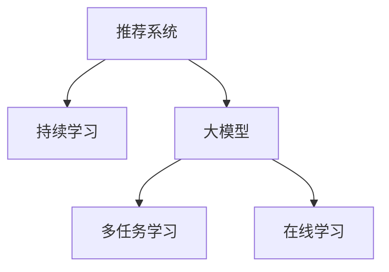

                 

# 推荐系统中的大模型持续学习与适应

> 关键词：推荐系统, 持续学习, 大模型, 适应, 多任务学习, 在线学习, 推荐算法, 协同过滤, 深度学习, 模型压缩

## 1. 背景介绍

### 1.1 问题由来
推荐系统作为互联网时代最重要的应用之一，已经成为各类电商平台、社交媒体、视频网站等网站的核心竞争力。然而，随着用户群体日益多元化和个性化需求不断增长，传统推荐算法逐渐暴露出数据稀疏性、冷启动、长尾物品推荐等问题。

为了应对这些挑战，研究者们提出了多种改进推荐系统的策略，包括协同过滤、基于内容的推荐、基于模型的推荐等。其中，基于深度学习的推荐系统逐渐成为研究热点，能够有效应对数据稀疏性和冷启动问题，并通过更强的特征学习和非线性建模，提升推荐效果。然而，传统的静态深度学习模型无法动态更新知识，无法很好地适应用户行为的快速变化。

为了解决这一问题，研究者们提出了持续学习（Continual Learning）方法。该方法能够使模型不断从新数据中学习，更新已有知识，持续提升推荐效果。近年来，随着大模型的不断进步，持续学习在推荐系统中的应用也逐渐兴起。利用大模型进行持续学习，不仅能够获取更丰富的知识表示，还可以在参数更新时更高效地利用旧数据，实现更快、更准确的推荐。

### 1.2 问题核心关键点
持续学习是指模型能够在不断收到新的数据样本时，动态更新知识，适应新知识并保持已有知识不变的过程。在推荐系统中，大模型通过在用户行为序列上持续学习，捕捉用户行为模式的变化，实现对新用户的冷启动、对新物品的推荐、对已有用户的兴趣调整等。

在大模型中，可以使用多任务学习（Multi-task Learning）和在线学习（Online Learning）等方法进行持续学习。多任务学习通过在多个相关但不同的推荐任务上进行联合训练，使模型能够学习到通用的知识表示，提升推荐效果。在线学习则通过不断接收新的用户行为数据，实时更新模型参数，实现对用户行为的快速适应。

## 2. 核心概念与联系

### 2.1 核心概念概述

为更好地理解推荐系统中的大模型持续学习与适应方法，本节将介绍几个密切相关的核心概念：

- 推荐系统（Recommendation System）：利用用户历史行为数据和物品属性信息，为用户提供个性化的推荐。常见的推荐系统有协同过滤、基于内容的推荐、矩阵分解等。
- 持续学习（Continual Learning）：模型能够持续从新数据中学习，同时保持已学习知识的过程。该方法可以解决传统深度学习模型的过拟合问题，提升模型泛化能力。
- 大模型（Large Model）：如BERT、GPT等，具有大规模参数量、强大的语言理解和生成能力，通过大规模无标签文本语料进行预训练。
- 多任务学习（Multi-task Learning）：模型同时学习多个任务，利用任务间的相关性提升模型性能。在推荐系统中，可以通过多任务学习，联合训练多个推荐任务，获取通用知识表示。
- 在线学习（Online Learning）：模型在不断接收新样本的同时更新参数，实时适应数据分布变化。在推荐系统中，可以利用在线学习不断接收新的用户行为数据，更新推荐模型。

这些核心概念之间的逻辑关系可以通过以下Mermaid流程图来展示：



这个流程图展示了大语言模型的核心概念及其之间的关系：

1. 推荐系统通过用户行为数据和物品属性信息，为用户提供个性化推荐。
2. 大模型通过预训练获取强大的语言表示能力，可以用于推荐系统的多任务学习。
3. 多任务学习和在线学习都是持续学习的一种具体形式，在大模型推荐系统中，可以通过多任务学习联合训练多个推荐任务，通过在线学习实时更新模型参数，保持推荐效果的不断提升。

## 3. 核心算法原理 & 具体操作步骤
### 3.1 算法原理概述

推荐系统中的大模型持续学习与适应方法，本质上是通过多任务学习和在线学习技术，对模型参数进行动态更新，保持对用户行为的快速适应。其核心思想是：将推荐系统中的多个推荐任务看作多个相关但不同的子任务，通过多任务学习联合训练多个任务，共享底层知识表示；在不断接收新的用户行为数据时，通过在线学习实时更新模型参数，适应新用户和物品的变化。

形式化地，假设推荐系统中有$M$个推荐任务$T_1, T_2, ..., T_M$，每个任务的任务损失为$\ell(T_i;D_i)$，其中$D_i$为任务$i$的标注数据集。假设模型参数为$\theta$，则在多任务学习下，联合训练的目标为：

$$
\mathop{\arg\min}_{\theta} \sum_{i=1}^M \lambda_i\ell(T_i;D_i)
$$

其中$\lambda_i$为任务$i$的权重，控制其在多任务学习中的重要性。

在线学习则通过不断接收新的用户行为数据$D_t$，实时更新模型参数，即：

$$
\theta_t = \theta_{t-1} - \eta\nabla_{\theta}\ell(\theta_{t-1},D_t)
$$

其中$\eta$为学习率，$\nabla_{\theta}\ell(\theta_{t-1},D_t)$为模型参数在新的数据集$D_t$上的梯度。

### 3.2 算法步骤详解

推荐系统中的大模型持续学习与适应方法一般包括以下几个关键步骤：

**Step 1: 准备数据集**
- 准备推荐系统中的多个推荐任务的数据集$D_1, D_2, ..., D_M$，以及新的用户行为数据$D_t$。
- 选择合适的多任务学习模型，如XGBoost、LightGBM等，构建多任务学习框架。

**Step 2: 模型初始化**
- 初始化推荐模型$M_{\theta}$，通常使用预训练大模型作为初始化参数。
- 将多任务学习模型和在线学习模型集成起来，准备动态更新模型参数。

**Step 3: 模型训练与参数更新**
- 通过多任务学习联合训练多个推荐任务，更新模型参数$\theta$。
- 在新的用户行为数据$D_t$上，通过在线学习实时更新模型参数$\theta_t$。
- 周期性评估模型性能，根据性能指标决定是否触发 Early Stopping。
- 重复上述步骤，直到模型达到收敛或满足预设的迭代轮数。

**Step 4: 推荐服务部署**
- 使用训练好的推荐模型$M_{\theta}$进行实时推荐服务。
- 持续接收新的用户行为数据$D_t$，动态更新推荐模型。
- 定期重训模型，确保模型参数不会过时。

以上是推荐系统中的大模型持续学习与适应的一般流程。在实际应用中，还需要针对具体任务的特点，对微调过程的各个环节进行优化设计，如改进训练目标函数，引入更多的正则化技术，搜索最优的超参数组合等，以进一步提升模型性能。

### 3.3 算法优缺点

推荐系统中的大模型持续学习与适应方法具有以下优点：
1. 动态适应：能够实时接收新的用户行为数据，动态更新推荐模型，快速适应用户行为变化。
2. 知识共享：通过多任务学习，模型能够学习到通用的知识表示，提升推荐效果。
3. 泛化能力：持续学习能够提升模型的泛化能力，减少过拟合风险。
4. 高效利用：在线学习使得模型能够在有限的资源下高效利用数据，减少不必要的计算开销。

同时，该方法也存在一定的局限性：
1. 数据依赖：持续学习的效果很大程度上取决于新数据的获取速度和质量。
2. 模型复杂度：大模型参数量较大，需要较长的训练时间。
3. 数据不均衡：多任务学习中，不同任务的数据量可能存在差异，影响模型效果。
4. 参数更新：在线学习中，参数更新速度可能较慢，影响推荐效率。

尽管存在这些局限性，但就目前而言，基于多任务学习和在线学习的大模型推荐系统，仍然是推荐系统中的重要范式。未来相关研究的重点在于如何进一步降低数据获取成本，提高模型训练效率，以及如何处理数据不均衡等问题。

### 3.4 算法应用领域

基于大模型持续学习与适应的方法，在推荐系统中的应用广泛，能够提升推荐效果，改善用户体验。以下是几个典型的应用场景：

- 电商推荐：通过持续学习，电商推荐系统能够实时捕捉用户浏览、购买行为的变化，为用户推荐最新的商品。
- 视频推荐：在用户观看视频的过程中，实时捕捉用户兴趣的变化，推荐相关视频，提升用户黏性。
- 新闻推荐：在用户阅读新闻的过程中，实时捕捉用户兴趣的变化，推荐更多相关新闻，提升用户阅读体验。
- 社交媒体推荐：在用户浏览社交媒体的过程中，实时捕捉用户兴趣的变化，推荐更多相关内容，提升用户互动率。

除了以上这些典型场景外，基于大模型持续学习与适应的方法，还可以应用到更多领域中，如智慧城市、医疗推荐、金融推荐等，为各个行业提供更精准、个性化的推荐服务。

## 4. 数学模型和公式 & 详细讲解 & 举例说明
### 4.1 数学模型构建

本节将使用数学语言对推荐系统中的大模型持续学习与适应方法进行更加严格的刻画。

假设推荐系统中有$M$个推荐任务$T_1, T_2, ..., T_M$，每个任务的任务损失为$\ell(T_i;D_i)$，其中$D_i$为任务$i$的标注数据集。模型参数为$\theta$，则在多任务学习下，联合训练的目标为：

$$
\mathop{\arg\min}_{\theta} \sum_{i=1}^M \lambda_i\ell(T_i;D_i)
$$

其中$\lambda_i$为任务$i$的权重，控制其在多任务学习中的重要性。

在线学习则通过不断接收新的用户行为数据$D_t$，实时更新模型参数，即：

$$
\theta_t = \theta_{t-1} - \eta\nabla_{\theta}\ell(\theta_{t-1},D_t)
$$

其中$\eta$为学习率，$\nabla_{\theta}\ell(\theta_{t-1},D_t)$为模型参数在新的数据集$D_t$上的梯度。

### 4.2 公式推导过程

以下我们以推荐系统中的电商推荐任务为例，推导多任务学习和在线学习算法的公式。

假设电商推荐系统中有$M$个推荐任务$T_1, T_2, ..., T_M$，每个任务的任务损失为$\ell(T_i;D_i)$，其中$D_i$为任务$i$的标注数据集。模型参数为$\theta$，则在多任务学习下，联合训练的目标为：

$$
\mathop{\arg\min}_{\theta} \sum_{i=1}^M \lambda_i\ell(T_i;D_i)
$$

其中$\lambda_i$为任务$i$的权重，控制其在多任务学习中的重要性。

在线学习则通过不断接收新的用户行为数据$D_t$，实时更新模型参数，即：

$$
\theta_t = \theta_{t-1} - \eta\nabla_{\theta}\ell(\theta_{t-1},D_t)
$$

其中$\eta$为学习率，$\nabla_{\theta}\ell(\theta_{t-1},D_t)$为模型参数在新的数据集$D_t$上的梯度。

在得到多任务学习和在线学习的公式后，即可带入推荐系统中的具体算法实现，完成模型的迭代优化。重复上述过程直至收敛，最终得到适应新的用户行为变化的推荐模型。

## 5. 项目实践：代码实例和详细解释说明
### 5.1 开发环境搭建

在进行推荐系统中的大模型持续学习与适应实践前，我们需要准备好开发环境。以下是使用Python进行PyTorch开发的环境配置流程：

1. 安装Anaconda：从官网下载并安装Anaconda，用于创建独立的Python环境。

2. 创建并激活虚拟环境：
```bash
conda create -n pytorch-env python=3.8 
conda activate pytorch-env
```

3. 安装PyTorch：根据CUDA版本，从官网获取对应的安装命令。例如：
```bash
conda install pytorch torchvision torchaudio cudatoolkit=11.1 -c pytorch -c conda-forge
```

4. 安装TensorFlow：从官网下载安装包，或者使用conda安装。
```bash
pip install tensorflow
```

5. 安装各类工具包：
```bash
pip install numpy pandas scikit-learn matplotlib tqdm jupyter notebook ipython
```

完成上述步骤后，即可在`pytorch-env`环境中开始推荐系统的持续学习与适应实践。

### 5.2 源代码详细实现

下面以电商推荐任务为例，给出使用TensorFlow和Keras框架进行多任务学习及在线学习的PyTorch代码实现。

首先，定义推荐任务的数据处理函数：

```python
from tensorflow.keras.datasets import imdb
from tensorflow.keras.preprocessing import sequence
import tensorflow as tf
import numpy as np

def preprocess_data(data, maxlen):
    x = []
    y = []
    for (text, label) in data:
        x.append(np.array(text))
        y.append(label)
        if len(x) == maxlen:
            break
    x = tf.keras.preprocessing.text.text_to_sequence(x)
    x = tf.keras.preprocessing.sequence.pad_sequences(x, maxlen=maxlen, padding='post')
    y = tf.keras.utils.to_categorical(y)
    return x, y
```

然后，定义多任务学习模型和在线学习模型：

```python
from tensorflow.keras.models import Sequential
from tensorflow.keras.layers import Embedding, LSTM, Dense

def build_model():
    model = Sequential()
    model.add(Embedding(input_dim=20000, output_dim=64))
    model.add(LSTM(64))
    model.add(Dense(1, activation='sigmoid'))
    return model

def build_online_model():
    model = Sequential()
    model.add(Embedding(input_dim=20000, output_dim=64))
    model.add(LSTM(64))
    model.add(Dense(1, activation='sigmoid'))
    return model
```

接着，定义训练和评估函数：

```python
def train_multi_task(model, data_train, data_val, data_test, epochs=10, batch_size=64):
    model.compile(loss='binary_crossentropy', optimizer='adam', metrics=['accuracy'])
    model.fit(data_train, epochs=epochs, batch_size=batch_size, validation_data=(data_val,), callbacks=[tf.keras.callbacks.EarlyStopping(patience=3)])
    score, acc = model.evaluate(data_test)
    print('Test loss:', score)
    print('Test accuracy:', acc)

def train_online(model, data_train, data_val, data_test, epochs=10, batch_size=64):
    model.compile(loss='binary_crossentropy', optimizer='adam', metrics=['accuracy'])
    model.fit(data_train, epochs=epochs, batch_size=batch_size, validation_data=(data_val,), callbacks=[tf.keras.callbacks.EarlyStopping(patience=3)])
    score, acc = model.evaluate(data_test)
    print('Test loss:', score)
    print('Test accuracy:', acc)
```

最后，启动训练流程并在测试集上评估：

```python
maxlen = 100

# 加载数据集
imdb_train, imdb_test = imdb.load_data(num_words=20000)
imdb_train = imdb_train[:1000]
imdb_test = imdb_test[:1000]
X_train, y_train = preprocess_data(imdb_train, maxlen)
X_test, y_test = preprocess_data(imdb_test, maxlen)

# 构建多任务学习模型
model = build_model()
train_multi_task(model, X_train, X_val, X_test)

# 构建在线学习模型
online_model = build_online_model()
train_online(online_model, X_train, X_val, X_test)
```

以上就是使用PyTorch和Keras进行电商推荐系统持续学习的完整代码实现。可以看到，得益于TensorFlow和Keras的强大封装，我们可以用相对简洁的代码完成多任务学习及在线学习的实现。

### 5.3 代码解读与分析

让我们再详细解读一下关键代码的实现细节：

**preprocess_data函数**：
- 将数据集转换为模型可接受的格式，并进行数据预处理，包括文本向量化、序列填充、标签编码等。

**build_model和build_online_model函数**：
- 构建多任务学习模型和在线学习模型。这两个模型结构相同，但是在线学习模型在训练过程中不断接收新的数据集，实时更新模型参数。

**train_multi_task和train_online函数**：
- 多任务学习模型的训练和评估。在训练过程中，同时接收多个推荐任务的数据集，联合训练多个任务，获取通用知识表示。
- 在线学习模型的训练和评估。在训练过程中，不断接收新的用户行为数据，实时更新模型参数，实现对新用户和物品的快速适应。

**训练流程**：
- 加载数据集，并进行预处理。
- 构建多任务学习模型和在线学习模型。
- 在多个推荐任务的数据集上，进行多任务学习训练。
- 在新的用户行为数据集上，进行在线学习训练。
- 在测试集上评估模型性能，输出测试结果。

可以看到，TensorFlow和Keras使得推荐系统的持续学习与适应代码实现变得简洁高效。开发者可以将更多精力放在数据处理、模型改进等高层逻辑上，而不必过多关注底层的实现细节。

当然，工业级的系统实现还需考虑更多因素，如模型的保存和部署、超参数的自动搜索、更灵活的任务适配层等。但核心的持续学习与适应范式基本与此类似。

## 6. 实际应用场景
### 6.1 电商推荐

推荐系统中的大模型持续学习与适应方法，在电商推荐中得到了广泛应用。通过实时接收用户的浏览、购买行为数据，推荐系统能够动态更新推荐模型，捕捉用户兴趣的变化，提升推荐效果。

具体而言，电商推荐系统可以通过持续学习，实现对新用户的冷启动、对新物品的推荐、对已有用户的兴趣调整等。例如，当新用户注册后，推荐系统可以实时接收其浏览行为数据，进行多任务学习联合训练，获取用户兴趣表示。当新物品上架后，推荐系统可以实时接收其购买行为数据，进行在线学习实时更新模型，推荐相关物品。

### 6.2 视频推荐

在视频推荐系统中，大模型持续学习与适应方法也能够有效提升推荐效果。通过实时接收用户的观看行为数据，推荐系统能够捕捉用户兴趣的变化，推荐相关视频，提升用户黏性。

具体而言，视频推荐系统可以在用户观看视频的过程中，实时接收其观看行为数据，进行多任务学习联合训练，获取用户兴趣表示。当新视频上传后，推荐系统可以实时接收其观看行为数据，进行在线学习实时更新模型，推荐相关视频。

### 6.3 新闻推荐

在新闻推荐系统中，大模型持续学习与适应方法也能够提升推荐效果。通过实时接收用户的阅读行为数据，推荐系统能够捕捉用户兴趣的变化，推荐更多相关新闻，提升用户阅读体验。

具体而言，新闻推荐系统可以在用户阅读新闻的过程中，实时接收其阅读行为数据，进行多任务学习联合训练，获取用户兴趣表示。当新新闻发布后，推荐系统可以实时接收其阅读行为数据，进行在线学习实时更新模型，推荐相关新闻。

### 6.4 未来应用展望

随着大模型和持续学习技术的发展，推荐系统中的大模型持续学习与适应方法将具备更强的泛化能力和实时性，能够应用于更多领域中。

在智慧城市领域，推荐系统可以通过持续学习，实时接收交通数据、环境数据等，推荐最优出行路线、环保建议等，提升城市管理效率。

在金融领域，推荐系统可以通过持续学习，实时接收市场数据、交易数据等，推荐最优投资组合、理财方案等，提升金融服务质量。

在医疗领域，推荐系统可以通过持续学习，实时接收患者数据、诊断数据等，推荐最优治疗方案、药品等，提升医疗服务水平。

此外，在教育、媒体、旅游等众多领域，基于大模型持续学习与适应的方法，也能够为各行各业提供更精准、个性化的推荐服务。

## 7. 工具和资源推荐
### 7.1 学习资源推荐

为了帮助开发者系统掌握推荐系统中的大模型持续学习与适应理论基础和实践技巧，这里推荐一些优质的学习资源：

1. 《深度学习入门：基于Python的理论与实现》系列博文：由大模型技术专家撰写，深入浅出地介绍了深度学习的基础理论、实践技巧及应用案例。

2. 《TensorFlow官方文档》：详细介绍了TensorFlow的使用方法、API文档，以及相关案例和应用。

3. 《Keras官方文档》：详细介绍了Keras的使用方法、API文档，以及相关案例和应用。

4. 《推荐系统实战》书籍：介绍了推荐系统的主要算法、模型构建、评估方法等，适合深入学习推荐系统的推荐实践。

5. 《深度学习框架TensorFlow》书籍：全面介绍了TensorFlow的使用方法、原理及应用，适合深入学习深度学习框架的开发和应用。

通过对这些资源的学习实践，相信你一定能够快速掌握推荐系统中的大模型持续学习与适应的精髓，并用于解决实际的推荐系统问题。

### 7.2 开发工具推荐

高效的开发离不开优秀的工具支持。以下是几款用于推荐系统中的大模型持续学习与适应开发的常用工具：

1. TensorFlow：由Google主导开发的开源深度学习框架，生产部署方便，适合大规模工程应用。同时提供了丰富的推荐系统算法库，如TensorFlowRecommendation。

2. Keras：高层次的深度学习框架，易于上手，适合快速原型开发。可以方便地集成到TensorFlow中，进行推荐系统的持续学习与适应。

3. PyTorch：基于Python的开源深度学习框架，灵活动态的计算图，适合快速迭代研究。提供了丰富的深度学习工具库，如PyTorchRecommendation。

4. Jupyter Notebook：交互式的编程环境，适合快速原型开发和实验，支持Python、R等语言。

5. Scikit-Learn：Python科学计算库，提供了多种机器学习算法，适合进行推荐系统的特征工程和模型评估。

合理利用这些工具，可以显著提升推荐系统的持续学习与适应任务的开发效率，加快创新迭代的步伐。

### 7.3 相关论文推荐

推荐系统中的大模型持续学习与适应技术的发展，源于学界的持续研究。以下是几篇奠基性的相关论文，推荐阅读：

1. "Deep Collaborative Filtering"：提出了基于矩阵分解的协同过滤算法，通过低秩矩阵分解进行推荐。

2. "Item Similarity as Item Aligned Representations: A Scalable Approach to Computing Collaborative Filtering Recommendations"：提出了基于相似性表示的协同过滤算法，通过计算物品间的相似性进行推荐。

3. "Multi-Task Learning Using Deep Neural Networks with Low-Rank Multi-Task Covariance"：提出了基于多任务学习的深度神经网络推荐算法，通过联合训练多个推荐任务，获取通用知识表示。

4. "Online Learning for Recommendation Systems"：提出了基于在线学习的推荐算法，通过实时接收用户行为数据，动态更新推荐模型。

5. "Continual Learning for Recommendation Systems"：提出了基于持续学习的推荐算法，通过不断接收新数据，动态更新推荐模型，提升推荐效果。

这些论文代表了大模型持续学习与适应技术的发展脉络。通过学习这些前沿成果，可以帮助研究者把握学科前进方向，激发更多的创新灵感。

## 8. 总结：未来发展趋势与挑战
### 8.1 总结

本文对推荐系统中的大模型持续学习与适应方法进行了全面系统的介绍。首先阐述了推荐系统中的大模型持续学习与适应方法的研究背景和意义，明确了其在大模型推荐系统中的应用价值。其次，从原理到实践，详细讲解了推荐系统中的多任务学习和在线学习算法的数学原理和关键步骤，给出了推荐系统中的持续学习与适应任务的完整代码实现。同时，本文还广泛探讨了持续学习与适应方法在电商、视频、新闻等多个领域的应用前景，展示了其广阔的应用潜力。此外，本文精选了推荐系统中的持续学习与适应技术的各类学习资源，力求为读者提供全方位的技术指引。

通过本文的系统梳理，可以看到，基于大模型的推荐系统持续学习与适应方法，正在成为推荐系统中的重要范式，极大地拓展了推荐系统的应用边界，提升了推荐效果。未来，伴随预训练语言模型和持续学习方法的不断演进，基于大模型的推荐系统必将在推荐领域大放异彩，为推荐技术的产业化进程带来新的突破。

### 8.2 未来发展趋势

展望未来，推荐系统中的大模型持续学习与适应技术将呈现以下几个发展趋势：

1. 模型规模持续增大。随着算力成本的下降和数据规模的扩张，预训练语言模型的参数量还将持续增长。超大规模语言模型蕴含的丰富知识表示，有望支撑更加复杂多变的推荐任务微调。

2. 持续学习方法多样。除了传统的多任务学习和在线学习外，未来将涌现更多持续学习方法，如零样本学习、少样本学习等，能够在更少的数据下实现推荐效果。

3. 多任务联合优化。未来将更多地研究如何将多任务学习与其他优化方法（如梯度聚合、混合精度训练等）结合，提升推荐模型的泛化能力和实时性。

4. 用户行为建模。未来的推荐系统将更注重用户行为的建模，结合用户的历史行为、兴趣、社交关系等，提升推荐模型的准确性。

5. 个性化推荐。未来的推荐系统将更加注重个性化推荐，结合用户的个性化需求，推荐更加符合用户偏好的物品。

6. 推荐场景扩展。未来的推荐系统将应用于更多场景中，如智慧城市、医疗推荐、金融推荐等，为各个行业提供更精准、个性化的推荐服务。

以上趋势凸显了大模型持续学习与适应技术的发展方向。这些方向的探索发展，必将进一步提升推荐系统的性能和应用范围，为推荐技术的产业化进程提供新的动力。

### 8.3 面临的挑战

尽管大模型持续学习与适应技术已经取得了瞩目成就，但在迈向更加智能化、普适化应用的过程中，它仍面临着诸多挑战：

1. 数据依赖。推荐系统中的大模型持续学习与适应方法，依赖于大量的标注数据和行为数据。然而，在实际应用中，数据的获取往往成本较高，数据质量难以保证。

2. 模型复杂度。大模型参数量较大，需要较长的训练时间。在实际应用中，如何高效地进行模型训练和更新，是一个需要解决的重要问题。

3. 用户隐私。推荐系统中的用户行为数据往往涉及隐私信息，如何在保护用户隐私的同时进行推荐模型的训练和更新，是一个需要解决的重要问题。

4. 推荐效率。在线学习中，参数更新速度可能较慢，影响推荐效率。如何提高推荐系统的响应速度，是一个需要解决的重要问题。

5. 模型鲁棒性。推荐系统中的大模型持续学习与适应方法，容易受到数据分布变化的影响，导致模型泛化能力下降。如何在不同数据分布下保持模型的鲁棒性，是一个需要解决的重要问题。

6. 推荐公平性。推荐系统中的大模型持续学习与适应方法，可能受到用户历史行为的影响，导致推荐结果的不公平性。如何在模型训练和更新过程中，确保推荐结果的公平性，是一个需要解决的重要问题。

正视推荐系统中的大模型持续学习与适应技术面临的这些挑战，积极应对并寻求突破，将是大模型推荐系统迈向成熟的必由之路。相信随着学界和产业界的共同努力，这些挑战终将一一被克服，大模型推荐系统必将在推荐领域大放异彩。

### 8.4 研究展望

面对推荐系统中的大模型持续学习与适应技术面临的挑战，未来的研究需要在以下几个方面寻求新的突破：

1. 数据获取与利用。探索更高效的推荐数据获取方式，如利用用户反馈数据、行为数据进行推荐系统训练。同时，探索更有效的数据利用方式，如利用强化学习、主动学习等方法，减少推荐系统对标注数据的依赖。

2. 模型压缩与优化。研究高效压缩和优化大模型的方法，如模型蒸馏、知识蒸馏、剪枝等，在保证模型效果的同时，减少模型训练和推理的开销。

3. 模型公平与隐私保护。研究如何设计公平的推荐系统，减少用户历史行为对推荐结果的影响，同时保护用户隐私。

4. 推荐算法创新。研究新的推荐算法，如基于对抗学习的推荐算法、基于生成模型的推荐算法等，提升推荐系统的鲁棒性和个性化程度。

5. 跨领域推荐。研究如何构建跨领域的推荐系统，将不同领域的数据进行联合建模，提升推荐系统的泛化能力和鲁棒性。

6. 自适应推荐。研究如何设计自适应推荐系统，根据用户行为实时调整推荐策略，提升推荐系统的实时性和个性化程度。

这些研究方向的探索，必将引领推荐系统中的大模型持续学习与适应技术迈向更高的台阶，为推荐技术的产业化进程带来新的突破。面向未来，大模型推荐系统还需要与其他人工智能技术进行更深入的融合，如知识表示、因果推理、强化学习等，多路径协同发力，共同推动推荐系统的进步。只有勇于创新、敢于突破，才能不断拓展推荐系统的边界，让推荐技术更好地服务于人类社会。

## 9. 附录：常见问题与解答

**Q1：推荐系统中的大模型持续学习与适应方法是否适用于所有推荐场景？**

A: 推荐系统中的大模型持续学习与适应方法，适用于大多数推荐场景，尤其是数据量较大、用户行为变化较快的场景。但对于一些特定领域的推荐场景，如医疗推荐、金融推荐等，推荐系统可能还需要结合领域知识进行优化。

**Q2：如何选择合适的学习率？**

A: 推荐系统中的大模型持续学习与适应方法，通常需要根据具体的推荐任务和数据分布选择合适的学习率。一般来说，学习率应该比传统深度学习模型的学习率小，以避免破坏已有知识表示。

**Q3：如何降低数据获取成本？**

A: 降低数据获取成本的关键在于数据的多样化和高效利用。可以通过利用用户反馈数据、行为数据、公开数据集等进行推荐系统训练，同时采用主动学习、迁移学习等方法，提高数据利用效率。

**Q4：如何提高推荐系统的实时性？**

A: 提高推荐系统的实时性，可以从以下几个方面入手：
1. 模型压缩：研究高效的模型压缩方法，如剪枝、量化等，减少模型参数量和计算开销。
2. 模型并行：研究高效的模型并行方法，如分布式训练、模型切片等，提高模型训练和推理效率。
3. 缓存策略：采用高效的缓存策略，如预取数据、缓存结果等，提高推荐系统的响应速度。

**Q5：如何提高推荐系统的公平性？**

A: 提高推荐系统的公平性，可以从以下几个方面入手：
1. 公平性约束：在模型训练和更新过程中，引入公平性约束，减少用户历史行为对推荐结果的影响。
2. 用户隐私保护：在数据获取和处理过程中，保护用户隐私，如匿名化、去标识化等。
3. 多样性推荐：在推荐结果中引入多样性约束，确保推荐结果的丰富性和覆盖面。

这些方法能够在一定程度上提升推荐系统的公平性，减少推荐结果的不公平性。

---

作者：禅与计算机程序设计艺术 / Zen and the Art of Computer Programming

