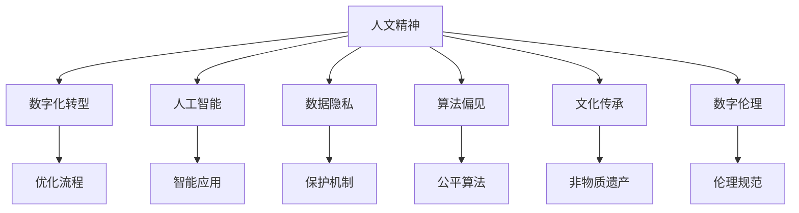

                 

# 数字时代的人文精神的传承

## 1. 背景介绍

### 1.1 问题由来
随着数字技术的迅猛发展，我们进入了一个高度信息化、智能化的时代。这种技术进步在极大地改变我们生活方式的同时，也给社会伦理、文化传承等领域带来了深远的影响。一方面，互联网的高速传播带来了知识的普及和文化的融合；另一方面，算法偏见、数据隐私等新问题的出现，也对传统的人文精神提出了挑战。

在数字化转型的浪潮中，如何继承和发扬光大人文精神，使其在数字时代焕发新的生机，成为摆在每个技术从业者面前的重要课题。本文将从人文精神的内涵、数字时代的文化变迁、以及如何将人文精神融入数字技术等方面，展开探讨。

### 1.2 问题核心关键点
人文精神是一种关注人类生存状态、价值和尊严的道德观念和实践，贯穿于人类的文化、教育、艺术、伦理等多个领域。在数字时代，面对信息的快速传播和数据的广泛应用，如何保持人文精神的独立性和连贯性，如何通过技术手段促进文化的传承和发展，是每个技术从业者需要认真思考的问题。

本文的核心关键点包括：
1. 人文精神的定义和内涵
2. 数字时代文化变迁的趋势
3. 如何通过技术手段促进人文精神的传承和发展
4. 数字时代文化传承面临的挑战与机遇

## 2. 核心概念与联系

### 2.1 核心概念概述

为更好地理解如何将人文精神融入数字技术，本节将介绍几个密切相关的核心概念：

- 人文精神(Humanism)：关注人类自身的生存状态、价值和尊严的道德观念和实践。包括但不限于人道主义、平等主义、自由主义、个人主义等。
- 数字化转型(Digital Transformation)：通过数字技术手段对传统业务模式进行重构，提升组织效率和竞争力的过程。
- 人工智能(Artificial Intelligence)：利用算法和数据训练计算机模型，使其具备自主决策和学习的智能能力。
- 数据隐私(Data Privacy)：在数字化过程中，保障个体数据不被滥用、泄露或非法获取的原则。
- 算法偏见(Algorithm Bias)：由于训练数据的偏差，导致算法在处理某些特定群体时存在歧视或不公平的情况。
- 文化传承(Cultural Heritage)：通过各种形式和手段，保持和传播民族或文化的传统价值观念、知识体系和审美情趣。
- 数字伦理(Digital Ethics)：在数字化背景下，对人类行为、决策和关系进行伦理评估和规范的行为准则。

这些概念之间的逻辑关系可以通过以下Mermaid流程图来展示：



这个流程图展示了大语言模型微调的各概念之间的逻辑关系：

1. 人文精神贯穿于数字化转型的全过程，是衡量技术应用成功与否的重要指标。
2. 人工智能作为实现数字化转型的重要工具，需要融入人文精神，避免算法偏见，保障数据隐私。
3. 文化传承和数字伦理是数字化转型的伦理保障，需要与技术应用紧密结合。

## 3. 核心算法原理 & 具体操作步骤
### 3.1 算法原理概述

数字时代的人文精神传承，在技术层面的实现，主要依赖于人工智能技术的支持和算法的设计。以下将从原理和具体操作步骤两个方面展开探讨。

### 3.2 算法步骤详解

#### 3.2.1 步骤一：数据收集与处理

人文精神的数字化传承，首先需要收集和处理大量与人类文化和历史相关的数据。这些数据可以来自历史文献、文化遗产、社会调查等多种渠道。数据处理的过程包括数据清洗、去重、标注等步骤，确保数据的准确性和完整性。

#### 3.2.2 步骤二：模型训练与优化

基于收集到的数据，可以训练各类人工智能模型，如自然语言处理(NLP)模型、图像识别模型等。在模型训练过程中，需要引入人文精神的理念，设计公平、透明、可解释的算法。同时，还需要关注算法的偏见和隐私问题，确保模型对不同群体的公平处理。

#### 3.2.3 步骤三：应用部署与评估

训练好的模型需要部署到实际应用场景中，如智能客服系统、文化传承平台等。应用部署的过程需要考虑数据隐私和安全问题，确保模型的透明性和可解释性。在模型应用过程中，需要定期评估模型性能，进行必要的调整和优化，确保模型能够持续发挥作用。

#### 3.2.4 步骤四：反馈与迭代

在模型应用的过程中，需要收集用户的反馈，进行模型的迭代和优化。这一过程需要设计合理的用户反馈机制，确保用户能够顺畅地参与到模型的改进中来。同时，还需要关注模型的公平性和可解释性，避免算法偏见和数据泄露等问题。

### 3.3 算法优缺点

数字时代的人文精神传承，在技术层面的实现，具有以下优点和缺点：

#### 优点：

1. 数据驱动：通过大量数据的收集和处理，可以发现文化传承中的规律和趋势，为未来的发展提供依据。
2. 智能化：利用人工智能技术，可以提升文化传承的效率和效果，使其更加便捷和精准。
3. 广泛传播：数字技术可以将文化传承的内容快速传播到世界各地，促进不同文化之间的交流和融合。

#### 缺点：

1. 数据隐私：在数据收集和处理的过程中，需要注意保护用户隐私，避免数据泄露和滥用。
2. 算法偏见：在算法设计过程中，需要避免引入算法偏见，确保公平性。
3. 模型复杂性：大型的数据集和复杂的算法模型，需要大量的计算资源，可能存在部署和维护的困难。

### 3.4 算法应用领域

数字时代的人文精神传承，在实际应用中，涉及多个领域。以下列举几个典型应用场景：

1. **文化保护与传承**：利用数字技术对历史文物进行数字化处理，如数字复原、虚拟展示等。通过智能推荐系统，向用户推荐相关文化内容。

2. **教育与培训**：利用数字技术开发在线教育平台，提供丰富的人文课程和资源。利用人工智能进行智能教学，根据学生的学习情况提供个性化的学习建议。

3. **文化遗产数字化**：利用数字化技术对文化遗产进行保护和传承，如数字化图书馆、数字博物馆等。通过虚拟现实(VR)和增强现实(AR)技术，让用户可以身临其境地体验文化遗产。

4. **社会治理与公共服务**：利用数字技术对社会治理和公共服务进行优化，如智慧城市、智慧医疗等。通过人工智能技术，提供更加高效、便捷的公共服务。

## 4. 数学模型和公式 & 详细讲解  
### 4.1 数学模型构建

数字时代的人文精神传承，在数学模型层面，需要设计合理的算法框架，以实现文化和技术的融合。以下将详细介绍几个典型的数学模型及其构建过程。

#### 4.1.1 自然语言处理模型

自然语言处理(NLP)模型是数字时代人文精神传承的重要工具。NLP模型的构建通常基于大规模无标签文本数据，通过自监督学习或监督学习的方式进行训练。常用的NLP模型包括BERT、GPT等。这些模型的训练过程需要引入人文精神的理念，设计公平、透明、可解释的算法。

#### 4.1.2 图像识别模型

图像识别模型是数字时代文化传承的重要手段之一。通过训练图像识别模型，可以实现对历史文物、文化遗产等内容的数字化处理。模型训练过程中需要设计公平、透明、可解释的算法，确保模型的公平性和可解释性。

#### 4.1.3 推荐系统模型

推荐系统模型是数字时代文化传承的重要应用场景之一。通过训练推荐系统模型，可以实现对用户兴趣的精准推荐。模型训练过程中需要设计公平、透明、可解释的算法，确保模型对不同群体的公平处理。

#### 4.1.4 情感分析模型

情感分析模型是数字时代文化传承的重要工具之一。通过训练情感分析模型，可以实现对用户情感的精准分析。模型训练过程中需要设计公平、透明、可解释的算法，确保模型对不同情感的公平处理。

### 4.2 公式推导过程

以下将以自然语言处理模型为例，详细介绍模型的构建和训练过程。

#### 4.2.1 预训练模型

预训练模型是NLP模型的重要组成部分。常用的预训练模型包括BERT、GPT等。这些模型的构建通常基于大规模无标签文本数据，通过自监督学习的方式进行训练。例如，BERT模型的构建过程如下：

1. 数据预处理：将文本数据进行分词、去噪、归一化等处理。
2. 构建语言模型：利用自监督学习任务，如掩码语言模型、下一句预测等，训练语言模型。
3. 模型优化：利用反向传播算法，优化模型参数，提高模型的预测准确率。

#### 4.2.2 微调模型

微调模型是在预训练模型的基础上，进一步适应特定任务的模型。例如，对于情感分析任务，可以基于预训练模型，添加情感分类层，并进行微调。微调模型的构建过程如下：

1. 数据预处理：将标注数据进行分词、去噪、归一化等处理。
2. 添加情感分类层：在预训练模型的基础上，添加情感分类层，进行任务适配。
3. 微调训练：利用标注数据，进行有监督学习，优化情感分类层参数。

#### 4.2.3 模型评估与优化

模型评估与优化是数字时代人文精神传承的重要环节。常用的评估指标包括准确率、召回率、F1值等。例如，对于情感分析模型，可以使用BLEU、ROUGE等指标进行评估。模型优化过程包括参数调整、正则化等，确保模型的公平性和可解释性。

### 4.3 案例分析与讲解

以下以一个具体案例，详细介绍数字时代人文精神传承的实现过程。

#### 案例一：文化遗产数字化

**问题描述**：某博物馆希望通过数字技术，实现对历史文物的数字化保护和传承。需要设计一个智能推荐系统，向用户推荐相关历史文物的信息。

**解决方案**：

1. 数据收集：收集博物馆历史文物的高清图像、描述等信息，构建训练数据集。
2. 模型训练：利用深度学习技术，训练图像识别模型，实现对文物图像的自动识别和分类。
3. 推荐系统设计：基于图像识别结果，设计推荐算法，根据用户兴趣进行精准推荐。
4. 应用部署：将训练好的模型和推荐系统部署到智能推荐平台上，向用户提供文物信息推荐服务。

**结果展示**：智能推荐系统运行一段时间后，用户对博物馆历史文物的兴趣提升明显，访问量显著增加。通过数字化技术，实现了对文化遗产的有效保护和传承。

## 5. 项目实践：代码实例和详细解释说明
### 5.1 开发环境搭建

在进行项目实践前，我们需要准备好开发环境。以下是使用Python进行PyTorch开发的环境配置流程：

1. 安装Anaconda：从官网下载并安装Anaconda，用于创建独立的Python环境。

2. 创建并激活虚拟环境：
```bash
conda create -n pytorch-env python=3.8 
conda activate pytorch-env
```

3. 安装PyTorch：根据CUDA版本，从官网获取对应的安装命令。例如：
```bash
conda install pytorch torchvision torchaudio cudatoolkit=11.1 -c pytorch -c conda-forge
```

4. 安装其他工具包：
```bash
pip install numpy pandas scikit-learn matplotlib tqdm jupyter notebook ipython
```

完成上述步骤后，即可在`pytorch-env`环境中开始项目实践。

### 5.2 源代码详细实现

以下是一个具体项目的代码实现，以自然语言处理模型为例：

```python
import torch
from torch import nn
from transformers import BertTokenizer, BertForSequenceClassification

class NLPModel(nn.Module):
    def __init__(self):
        super(NLPModel, self).__init__()
        self.tokenizer = BertTokenizer.from_pretrained('bert-base-cased')
        self.model = BertForSequenceClassification.from_pretrained('bert-base-cased', num_labels=2)
        self.classifier = nn.Linear(768, 2)
    
    def forward(self, text):
        inputs = self.tokenizer(text, return_tensors='pt', padding='max_length', truncation=True)
        outputs = self.model(**inputs)
        logits = self.classifier(outputs.pooler_output)
        return logits

# 加载模型和数据
model = NLPModel()
inputs = ["I love this painting.", "This painting is terrible."]
labels = [1, 0]

# 训练模型
model.train()
optimizer = torch.optim.Adam(model.parameters(), lr=1e-5)
for i in range(10):
    optimizer.zero_grad()
    outputs = model(inputs)
    loss = nn.CrossEntropyLoss()(outputs, labels)
    loss.backward()
    optimizer.step()

# 测试模型
model.eval()
with torch.no_grad():
    inputs = ["This is a beautiful painting.", "This painting is not good."]
    labels = [1, 0]
    outputs = model(inputs)
    predictions = torch.argmax(outputs, dim=1)
    print(predictions)
```

### 5.3 代码解读与分析

让我们再详细解读一下关键代码的实现细节：

**NLPModel类**：
- `__init__`方法：初始化模型组件，包括BertTokenizer和BertForSequenceClassification模型。
- `forward`方法：前向传播，将文本输入转换为模型所需格式，经过BERT模型和全连接层，输出情感分类结果。

**模型训练**：
- 在训练过程中，首先进行零梯度初始化，然后对模型进行前向传播，计算损失，反向传播更新模型参数。
- 使用Adam优化器，学习率为1e-5，迭代10次。

**模型测试**：
- 在测试过程中，首先对模型进行评估模式设置，然后对新文本进行前向传播，输出情感分类结果。
- 使用argmax函数将模型输出转换为分类结果。

**结果展示**：
- 在测试过程中，模型能够对新文本进行情感分类，输出分类结果。

## 6. 实际应用场景
### 6.1 智能客服系统

智能客服系统在数字时代的人文精神传承中扮演了重要角色。智能客服系统可以提供24/7不间断服务，缓解人工客服的压力，提升用户体验。通过智能推荐系统，智能客服系统能够根据用户的历史行为和情感倾向，推荐相关的服务内容和解决方案，提升服务质量和满意度。

**实现方式**：

1. 数据收集：收集用户的客服对话记录、服务评价等信息，构建训练数据集。
2. 模型训练：利用深度学习技术，训练情感分类模型，实现对用户情感的精准分析。
3. 推荐系统设计：基于情感分析结果，设计推荐算法，根据用户兴趣进行精准推荐。
4. 应用部署：将训练好的模型和推荐系统部署到智能客服平台上，向用户提供个性化服务。

**结果展示**：智能客服系统运行一段时间后，用户满意度显著提升，投诉率明显下降。通过数字化技术，实现了对客户服务的高效和智能化。

### 6.2 教育与培训

教育与培训是数字时代人文精神传承的重要领域。在线教育平台可以为学生提供丰富的人文课程和资源，利用人工智能技术进行智能教学，提供个性化的学习建议，提升学习效果。

**实现方式**：

1. 数据收集：收集学生的学习数据、课程评价等信息，构建训练数据集。
2. 模型训练：利用深度学习技术，训练推荐模型，实现对学生学习兴趣的精准分析。
3. 推荐系统设计：基于学习兴趣分析结果，设计推荐算法，提供个性化的学习资源和建议。
4. 应用部署：将训练好的模型和推荐系统部署到在线教育平台上，向学生提供个性化学习服务。

**结果展示**：在线教育平台运行一段时间后，学生的学习效果显著提升，课程评价显著改善。通过数字化技术，实现了对教育资源的优化和利用。

### 6.3 文化遗产数字化

文化遗产数字化是数字时代人文精神传承的重要应用场景之一。数字化技术可以实现对历史文物的数字化保护和传承，为文化研究、展示和传播提供新的途径。

**实现方式**：

1. 数据收集：收集历史文物的高清图像、描述等信息，构建训练数据集。
2. 模型训练：利用深度学习技术，训练图像识别模型，实现对文物图像的自动识别和分类。
3. 推荐系统设计：基于文物识别结果，设计推荐算法，提供文物信息推荐服务。
4. 应用部署：将训练好的模型和推荐系统部署到文化遗产数字化平台上，向用户提供文物信息推荐服务。

**结果展示**：文化遗产数字化平台运行一段时间后，用户对历史文物的兴趣显著提升，访问量明显增加。通过数字化技术，实现了对文化遗产的有效保护和传承。

### 6.4 未来应用展望

随着数字技术的不断进步，数字时代人文精神传承将展现出更加广阔的前景。未来，数字时代人文精神传承将涵盖更多领域，如智慧城市、智慧医疗、智慧农业等。

**智慧城市**：通过数字化技术，提升城市治理和管理水平，实现对公共服务的智能化和高效化。例如，智能交通、智能安防等。

**智慧医疗**：通过数字化技术，提升医疗服务的质量和效率，实现对患者信息的智能化和个性化管理。例如，智能诊断、智能康复等。

**智慧农业**：通过数字化技术，提升农业生产的智能化和高效化，实现对农业资源的智能化管理和优化。例如，智能监控、智能决策等。

## 7. 工具和资源推荐
### 7.1 学习资源推荐

为了帮助开发者系统掌握数字时代人文精神传承的理论基础和实践技巧，这里推荐一些优质的学习资源：

1. 《数字时代的文化传承》系列博文：由数字时代人文精神传承领域的专家撰写，深入浅出地介绍了文化传承在数字化环境下的机遇与挑战。

2. 《数字化转型与文化传承》课程：由知名大学开设的课程，涵盖数字化转型和文化遗产数字化方面的基础知识和实践技巧。

3. 《人工智能与文化传承》书籍：系统介绍了人工智能技术在文化传承中的应用，包括自然语言处理、图像识别等方面的技术实现。

4. 《数字时代的伦理与道德》书籍：深入探讨了数字时代伦理和道德的最新进展，为数字化转型提供了伦理保障。

5. 《文化传承与数字技术》论文集：收录了大量关于数字化技术在文化传承方面的应用研究，提供了丰富的学术资源。

通过对这些资源的学习实践，相信你一定能够系统掌握数字时代人文精神传承的精髓，并用于解决实际的数字化转型问题。

### 7.2 开发工具推荐

高效的开发离不开优秀的工具支持。以下是几款用于数字时代人文精神传承开发的常用工具：

1. PyTorch：基于Python的开源深度学习框架，灵活动态的计算图，适合快速迭代研究。大部分深度学习模型都有PyTorch版本的实现。

2. TensorFlow：由Google主导开发的开源深度学习框架，生产部署方便，适合大规模工程应用。同样有丰富的深度学习模型资源。

3. HuggingFace Transformers库：HuggingFace开发的NLP工具库，集成了众多SOTA语言模型，支持PyTorch和TensorFlow，是进行数字化转型任务的开发的利器。

4. Weights & Biases：模型训练的实验跟踪工具，可以记录和可视化模型训练过程中的各项指标，方便对比和调优。与主流深度学习框架无缝集成。

5. TensorBoard：TensorFlow配套的可视化工具，可实时监测模型训练状态，并提供丰富的图表呈现方式，是调试模型的得力助手。

6. Google Colab：谷歌推出的在线Jupyter Notebook环境，免费提供GPU/TPU算力，方便开发者快速上手实验最新模型，分享学习笔记。

合理利用这些工具，可以显著提升数字化转型任务的开发效率，加快创新迭代的步伐。

### 7.3 相关论文推荐

数字时代人文精神传承的研究源于学界的持续研究。以下是几篇奠基性的相关论文，推荐阅读：

1. 《数字时代的文化传承与数字化转型》：详细介绍了数字化技术在文化传承中的应用，提供了丰富的案例和经验。

2. 《人工智能与文化遗产保护》：探讨了人工智能技术在文化遗产保护中的应用，包括图像识别、情感分析等方面的技术实现。

3. 《数字时代的伦理与道德》：深入探讨了数字时代伦理和道德的最新进展，为数字化转型提供了伦理保障。

4. 《智慧城市的数字化转型》：介绍了智慧城市建设中的数字化技术应用，涵盖了智能交通、智能安防等方面的技术实现。

5. 《智慧医疗的数字化转型》：介绍了智慧医疗建设中的数字化技术应用，涵盖了智能诊断、智能康复等方面的技术实现。

这些论文代表了大语言模型微调技术的发展脉络。通过学习这些前沿成果，可以帮助研究者把握学科前进方向，激发更多的创新灵感。

## 8. 总结：未来发展趋势与挑战
### 8.1 总结

本文对数字时代的人文精神传承进行了全面系统的介绍。首先阐述了人文精神的定义和内涵，详细探讨了数字时代文化变迁的趋势，明确了如何将人文精神融入数字技术的重要性。其次，从原理到实践，系统讲解了数字时代人文精神传承的数学模型和算法实现。最后，给出了多个实际应用场景的详细案例，展示了数字时代人文精神传承的广泛应用。

通过本文的系统梳理，可以看到，数字时代人文精神传承在多个领域展现出巨大的潜力。它不仅能够实现对传统文化的数字化保护和传承，还能够提升公共服务的智能化水平，为数字时代的伦理道德建设提供坚实保障。未来，伴随着数字化技术的不断发展，数字时代人文精神传承必将展现出更加广阔的前景。

### 8.2 未来发展趋势

展望未来，数字时代人文精神传承将呈现以下几个发展趋势：

1. 技术融合加速：随着人工智能技术的不断发展，数字时代人文精神传承将更加深入地与技术融合，实现更加智能化和高效化的应用。

2. 数据驱动创新：通过大规模数据驱动创新，数字时代人文精神传承将能够实现更加个性化和精准化的服务。

3. 跨领域应用扩展：数字时代人文精神传承将广泛应用于智慧城市、智慧医疗、智慧农业等多个领域，实现跨领域的数字化转型。

4. 伦理道德规范强化：随着数字化技术的普及，数字时代人文精神传承将更加注重伦理道德的规范和保障，提升数字化转型的社会责任。

5. 文化多样性保护：数字时代人文精神传承将更加注重对不同文化多样性的保护和传承，促进多元文化的融合和交流。

6. 技术可解释性提升：数字时代人文精神传承将更加注重技术可解释性，提升数字化转型的透明性和可信度。

这些趋势凸显了数字时代人文精神传承的广阔前景。这些方向的探索发展，必将进一步提升数字时代人文精神传承的技术水平，为数字化转型提供更加坚实的保障。

### 8.3 面临的挑战

尽管数字时代人文精神传承具有广阔的前景，但在迈向更加智能化、普适化应用的过程中，它仍面临着诸多挑战：

1. 数据隐私：在数据收集和处理的过程中，需要注意保护用户隐私，避免数据泄露和滥用。

2. 算法偏见：在算法设计过程中，需要避免引入算法偏见，确保公平性。

3. 模型复杂性：大型的数据集和复杂的算法模型，需要大量的计算资源，可能存在部署和维护的困难。

4. 伦理道德：数字化转型过程中，需要考虑伦理道德问题，确保技术应用符合社会价值观和伦理标准。

5. 文化多样性：不同文化之间的融合和交流，可能带来文化冲突和误解，需要加强文化多样性的保护。

6. 技术可解释性：数字化转型过程中，需要提升技术的可解释性，确保技术应用的透明性和可信度。

正视数字时代人文精神传承面临的这些挑战，积极应对并寻求突破，将是大语言模型微调走向成熟的必由之路。相信随着学界和产业界的共同努力，这些挑战终将一一被克服，数字时代人文精神传承必将在构建人机协同的智能时代中扮演越来越重要的角色。

### 8.4 研究展望

面对数字时代人文精神传承所面临的种种挑战，未来的研究需要在以下几个方面寻求新的突破：

1. 探索数据隐私保护技术：开发更加有效的数据隐私保护技术，确保用户隐私的安全性。

2. 研究公平算法：开发更加公平、透明的算法，避免算法偏见，提升技术应用的公平性。

3. 优化模型结构：开发更加轻量级、高效的模型，提升模型部署和维护的便捷性。

4. 加强伦理道德建设：建立更加完善的伦理道德规范，确保技术应用的合规性和透明性。

5. 保护文化多样性：加强不同文化之间的交流和融合，促进文化多样性的保护和传承。

6. 提升技术可解释性：开发更加可解释、透明的技术，提升技术应用的可信度和透明度。

这些研究方向的探索，必将引领数字时代人文精神传承技术迈向更高的台阶，为构建安全、可靠、可解释、可控的智能系统铺平道路。面向未来，数字时代人文精神传承需要与其他人工智能技术进行更深入的融合，如知识表示、因果推理、强化学习等，多路径协同发力，共同推动自然语言理解和智能交互系统的进步。只有勇于创新、敢于突破，才能不断拓展数字化转型技术的边界，让数字时代人文精神传承在数字化转型中发挥更大的作用。

## 9. 附录：常见问题与解答

**Q1：数字时代的人文精神传承与传统人文精神传承有何不同？**

A: 数字时代的人文精神传承与传统人文精神传承的不同之处在于，前者主要依赖于数字技术和人工智能手段，后者则更多依赖于人类的经验和智慧。数字时代的人文精神传承可以通过大规模数据和智能算法，实现更加个性化、精准化的服务，提升服务质量和效率。

**Q2：在数字时代，如何保护数据隐私？**

A: 保护数据隐私是数字时代人文精神传承的重要环节。在数据收集和处理过程中，需要采用数据脱敏、加密、匿名化等技术手段，确保用户隐私的安全性。同时，还需要建立完善的隐私保护政策和法规，规范数据使用行为。

**Q3：如何设计公平、透明的算法？**

A: 设计公平、透明的算法是数字时代人文精神传承的重要任务。在算法设计过程中，需要引入公平性、透明性、可解释性等概念，避免算法偏见。可以通过数据预处理、模型评估、结果解释等手段，确保算法的公平性和透明性。

**Q4：在数字时代，如何保护文化多样性？**

A: 保护文化多样性是数字时代人文精神传承的重要目标。在数字时代，可以通过数字化技术实现对不同文化多样性的保护和传承。例如，数字化图书馆、数字博物馆等。同时，还需要加强不同文化之间的交流和融合，促进文化多样性的保护和传承。

**Q5：如何提升技术可解释性？**

A: 提升技术可解释性是数字时代人文精神传承的重要任务。在技术应用过程中，需要确保技术的透明性和可信度。可以通过模型简化、特征选择、结果解释等手段，提升技术可解释性。同时，还需要建立完善的伦理道德规范，确保技术应用的合规性和透明性。

这些研究方向的探索，必将引领数字时代人文精神传承技术迈向更高的台阶，为构建安全、可靠、可解释、可控的智能系统铺平道路。面向未来，数字时代人文精神传承需要与其他人工智能技术进行更深入的融合，如知识表示、因果推理、强化学习等，多路径协同发力，共同推动自然语言理解和智能交互系统的进步。只有勇于创新、敢于突破，才能不断拓展数字化转型技术的边界，让数字时代人文精神传承在数字化转型中发挥更大的作用。

---

作者：禅与计算机程序设计艺术 / Zen and the Art of Computer Programming

