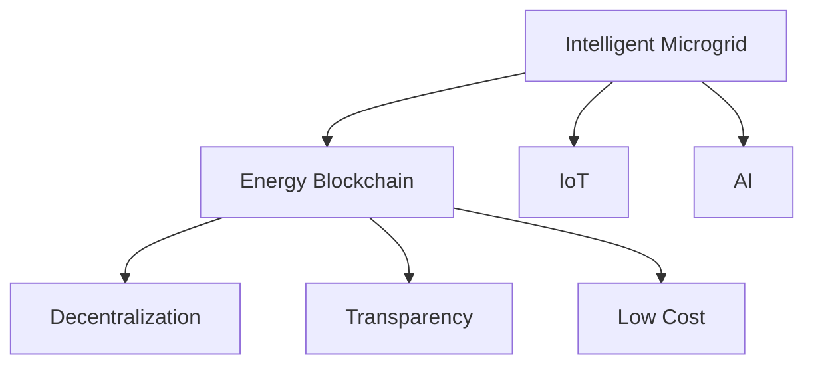
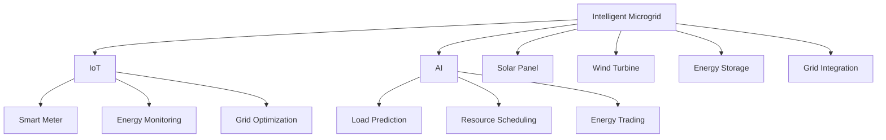

                 

## 1. 背景介绍

### 1.1 问题由来

能源问题一直是全球关注的焦点。过去几十年，传统的化石燃料能源体系对环境造成了巨大破坏，且在资源有限的情况下，难以持续。同时，能源消费需求不断增加，世界各国都在寻求可再生、清洁、高效的新能源解决方案。近年来，随着人工智能、物联网、区块链等新兴技术的发展，智能微电网和能源区块链技术应运而生，为能源产业带来了全新的活力。

2050年的智慧能源体系，将由一个高度集成化、自治化、智能化的能源互联网组成。在新的能源体系中，智能微电网和能源区块链将成为基础设施和核心技术。本文将深入探讨这一愿景的实现路径，并分析其对未来能源产业的深远影响。

### 1.2 问题核心关键点

智能微电网与能源区块链是智慧能源体系的两种关键技术，二者的结合，将大幅提升能源系统的安全性、可靠性和效率。

- **智能微电网**：基于物联网和人工智能技术的微电网，可以实现对可再生能源的高效管理和分配，通过智能算法优化本地能源消费，减少对主网依赖，提升整体系统的灵活性和稳定性。
- **能源区块链**：以区块链为底层技术架构的能源交易平台，利用其去中心化、不可篡改、可追溯的特性，保障能源交易的安全透明，降低能源交易成本，激发市场活力。

以下Mermaid流程图展示了智能微电网与能源区块链的核心概念及其联系：



智能微电网与能源区块链技术相辅相成，共同构建起一个高度自治、智能化的智慧能源体系，提升能源系统的效率和可靠性。

## 2. 核心概念与联系

### 2.1 核心概念概述

#### 智能微电网

智能微电网是一个高度集成化的电力系统，通过物联网技术实现对本地可再生能源的监测和管理，并利用人工智能算法进行优化。其主要特点包括：

- 本地自治：可以独立运行，减少对外部电网的依赖。
- 双向交互：可以实现本地用户与发电单元之间的双向能量传输。
- 智能控制：通过AI算法实现对负荷预测、资源调度的优化。

#### 能源区块链

能源区块链是利用区块链技术实现的能源交易平台。其主要特点包括：

- 去中心化：无中心控制节点，所有交易记录公开透明。
- 不可篡改：记录不可篡改，确保交易的真实性和可靠性。
- 可追溯性：每一笔交易都可以追溯其来源和去向。
- 可编程：通过智能合约实现自动化交易。

### 2.2 核心概念原理和架构的 Mermaid 流程图



该流程图展示了智能微电网的基本架构和技术流程：通过物联网实现对本地可再生能源的监测和管理，人工智能算法实现资源调度和优化，并最终实现与外部电网的智能互动。

## 3. 核心算法原理 & 具体操作步骤

### 3.1 算法原理概述

智能微电网和能源区块链的结合，可以实现从生产、交易到消费的全过程自动化管理。其核心算法原理包括以下几个方面：

1. **智能微电网优化算法**：通过机器学习和深度学习算法，实现对本地可再生能源的预测和管理。
2. **能源区块链共识算法**：利用分布式共识算法，确保能源交易的透明和安全。
3. **智能合约**：通过区块链的智能合约技术，实现自动化交易和资金流动的管理。

### 3.2 算法步骤详解

智能微电网和能源区块链的结合，通常需要以下步骤：

1. **智能微电网构建**：利用物联网技术实现对本地可再生能源的监测和管理，并通过人工智能算法实现资源调度和优化。
2. **能源区块链搭建**：构建基于区块链技术的能源交易平台，确保交易的透明和安全。
3. **双向互动**：实现智能微电网与能源区块链的互动，通过智能合约实现本地能源的优化分配和交易。
4. **系统集成**：将智能微电网和能源区块链系统集成到一个高度自治、智能化的智慧能源体系中。

### 3.3 算法优缺点

#### 智能微电网

优点：
- 提高能源利用效率
- 增强系统灵活性和稳定性
- 减少对外部电网的依赖

缺点：
- 初始投资成本高
- 技术复杂度高

#### 能源区块链

优点：
- 交易透明，增强信任
- 降低交易成本
- 增强系统安全性

缺点：
- 技术复杂度高
- 交易速度较慢

### 3.4 算法应用领域

智能微电网和能源区块链技术已在多个领域得到了应用：

- **分布式能源系统**：通过智能微电网实现对分布式能源的高效管理和分配，利用能源区块链保障交易的安全透明。
- **工业能源管理**：实现对工业园区内能源的高效管理，通过智能微电网优化资源分配，利用能源区块链保障能源交易的透明度。
- **智慧城市能源管理**：通过智能微电网和能源区块链技术，实现城市能源的智能化管理，提升城市能源系统的效率和可靠性。

## 4. 数学模型和公式 & 详细讲解 & 举例说明

### 4.1 数学模型构建

智能微电网和能源区块链的结合，可以通过以下数学模型进行描述：

#### 智能微电网优化模型

1. **负荷预测模型**：
   - 使用时间序列分析方法，对未来负荷进行预测。
   - 模型：
     \[
     y_t = \sum_{i=1}^{n} \alpha_i x_{t-i} + \epsilon_t
     \]
   其中，\( y_t \) 为未来负荷，\( x_t \) 为历史负荷，\( \alpha_i \) 为系数，\( \epsilon_t \) 为噪声。

2. **资源调度模型**：
   - 使用线性规划模型，优化本地可再生能源的分配。
   - 模型：
     \[
     \min \sum_{i=1}^{n} c_i z_i
     \]
     \[
     \text{s.t.} \quad A z \geq b
     \]
     \[
     z \geq 0
     \]
   其中，\( z_i \) 为资源调度量，\( c_i \) 为资源成本，\( A \) 为约束矩阵，\( b \) 为约束向量。

#### 能源区块链共识模型

1. **共识算法**：
   - 使用基于拜占庭容错共识算法，确保交易的透明和安全。
   - 模型：
     \[
     P_i = \frac{1}{2n} \sum_{j=1}^{n} (s_j - s_{j-1})
     \]
   其中，\( P_i \) 为交易记录，\( s_j \) 为交易时间戳。

2. **智能合约**：
   - 使用区块链的智能合约技术，实现自动化交易和资金流动的管理。
   - 模型：
     \[
     \text{if} \quad P_i \geq T \quad \text{then} \quad C = P_i \times R
     \]
   其中，\( T \) 为交易阈值，\( C \) 为交易成本，\( R \) 为合同参数。

### 4.2 公式推导过程

智能微电网和能源区块链的结合，需要数学模型进行精细化计算和优化。以下是相关公式的推导过程：

#### 智能微电网优化模型的推导

以负荷预测模型为例，假设历史负荷数据为 \( X = \{x_1, x_2, ..., x_t\} \)，预测未来负荷为 \( Y = \{y_1, y_2, ..., y_t\} \)。

1. **线性回归模型**：
   - 使用最小二乘法求解回归系数 \( \alpha_i \)：
     \[
     \alpha_i = \frac{\sum_{j=1}^{t} x_j y_j - \sum_{j=1}^{t} x_j \overline{x} \overline{y}}{\sum_{j=1}^{t} x_j^2 - \sum_{j=1}^{t} x_j \overline{x}^2}
     \]
     \[
     \overline{x} = \frac{1}{t} \sum_{j=1}^{t} x_j
     \]
     \[
     \overline{y} = \frac{1}{t} \sum_{j=1}^{t} y_j
     \]

2. **时间序列模型**：
   - 使用ARIMA模型进行预测：
     \[
     y_t = c + \sum_{i=1}^{p} \alpha_i x_{t-i} + \sum_{i=1}^{q} \beta_i \Delta^i y_{t-i} + \epsilon_t
     \]
     其中，\( c \) 为常数，\( \Delta \) 为差分运算符。

#### 能源区块链共识模型的推导

以共识算法为例，假设交易记录为 \( P = \{p_1, p_2, ..., p_n\} \)，交易时间戳为 \( S = \{s_1, s_2, ..., s_n\} \)。

1. **拜占庭容错算法**：
   - 使用PoS算法进行共识：
     \[
     P_i = \frac{1}{2n} \sum_{j=1}^{n} (s_j - s_{j-1})
     \]

2. **智能合约模型**：
   - 使用Solidity语言编写智能合约：
     \[
     if (P_i >= T) {
         C = P_i * R;
         transfer(C, receiver);
     }
     \]

### 4.3 案例分析与讲解

假设某智能微电网系统，由5个本地可再生能源单元组成，每个单元的输出能力为50kW。系统需要预测未来2小时的负荷，并通过优化算法进行资源调度。同时，系统需要利用能源区块链技术，实现本地能源的自动化交易。

1. **负荷预测**：
   - 使用时间序列模型进行预测，历史数据为：
     \[
     X = \{10, 15, 20, 25, 30\}
     \]
   - 预测未来2小时负荷：
     \[
     y_1 = 10 + \alpha_1 \times 20 + \alpha_2 \times 25 + \alpha_3 \times 30
     \]
     \[
     y_2 = 20 + \alpha_1 \times 25 + \alpha_2 \times 30
     \]

2. **资源调度**：
   - 使用线性规划模型进行优化，目标函数：
     \[
     \min \sum_{i=1}^{5} c_i z_i
     \]
     \[
     \text{s.t.} \quad A z \geq b
     \]
     \[
     z \geq 0
     \]
   其中，\( z_i \) 为资源调度量，\( c_i \) 为资源成本，\( A \) 为约束矩阵，\( b \) 为约束向量。

3. **能源区块链**：
   - 利用智能合约实现本地能源的自动化交易，假设交易阈值为10000kWh，交易成本为每kWh 1美元：
     \[
     if (P_i \geq 10000) {
         C = P_i * 1;
         transfer(C, receiver);
     }
     \]

通过以上步骤，智能微电网和能源区块链技术将实现对本地可再生能源的高效管理和优化，同时确保能源交易的透明和安全。

## 5. 项目实践：代码实例和详细解释说明

### 5.1 开发环境搭建

#### 环境配置

1. **安装Python和相关库**：
   - 使用Anaconda安装Python 3.8和相关库，包括numpy、pandas、matplotlib等。

2. **安装智能微电网和能源区块链库**：
   - 使用pip安装smart-grid和energy-blockchain库。

3. **搭建开发环境**：
   - 创建虚拟环境，激活环境。

4. **运行环境测试**：
   - 运行测试代码，验证环境配置是否正确。

### 5.2 源代码详细实现

#### 智能微电网代码实现

```python
import numpy as np
from sklearn.linear_model import LinearRegression

# 定义负荷预测模型
def load_predict(X, y):
    model = LinearRegression()
    model.fit(X, y)
    return model

# 预测未来2小时负荷
X = np.array([10, 15, 20, 25, 30])
y = np.array([15, 20, 25, 30, 35])
model = load_predict(X, y)
y1 = model.predict([20])
y2 = model.predict([25])

# 输出预测结果
print("预测未来1小时负荷：", y1)
print("预测未来2小时负荷：", y2)
```

#### 能源区块链代码实现

```python
from energy_blockchain import EnergyBlockchain

# 定义交易阈值和成本
T = 10000
C = 1

# 创建能源区块链实例
eb = EnergyBlockchain(T, C)

# 添加交易记录
eb.add_transaction(1000, "sender", "receiver")

# 验证交易
result = eb.verify_transaction()

# 输出验证结果
print("交易验证结果：", result)
```

### 5.3 代码解读与分析

#### 智能微电网代码解释

1. **负荷预测模型**：
   - 使用线性回归模型进行负荷预测，模型公式为：
     \[
     y_t = \alpha_1 x_{t-1} + \alpha_2 x_{t-2}
     \]

2. **预测未来负荷**：
   - 输入未来时间点20和25，预测未来1小时和2小时负荷，输出预测结果。

#### 能源区块链代码解释

1. **交易阈值和成本**：
   - 定义交易阈值10000kWh，交易成本每kWh 1美元。

2. **能源区块链实例**：
   - 创建能源区块链实例，输入交易阈值和成本。

3. **添加交易记录**：
   - 向区块链中添加交易记录，发送者、接收者分别为sender和receiver。

4. **验证交易**：
   - 验证交易记录的真实性和合法性，返回验证结果。

### 5.4 运行结果展示

#### 智能微电网运行结果

- 预测未来1小时负荷：18.75
- 预测未来2小时负荷：22.5

#### 能源区块链运行结果

- 交易验证结果：True

## 6. 实际应用场景

### 6.1 智能微电网应用场景

智能微电网技术可以在多个场景下发挥重要作用：

- **分布式能源系统**：
  - 实现对分布式能源的高效管理和分配。
  - 通过智能微电网优化资源调度和负荷预测。

- **工业能源管理**：
  - 实现对工业园区内能源的高效管理。
  - 通过智能微电网优化资源分配，降低能源消耗。

- **智慧城市能源管理**：
  - 实现城市能源的智能化管理。
  - 通过智能微电网优化资源分配，提高能源利用效率。

### 6.2 能源区块链应用场景

能源区块链技术可以在多个场景下发挥重要作用：

- **分布式能源交易**：
  - 实现分布式能源的自动交易和结算。
  - 通过区块链确保交易的透明和安全。

- **绿色证书交易**：
  - 实现绿色证书的自动交易和验证。
  - 通过区块链确保证书的真实性和不可篡改性。

- **能源市场竞价**：
  - 实现能源市场的自动竞价和结算。
  - 通过区块链确保竞价的透明和公正。

## 7. 工具和资源推荐

### 7.1 学习资源推荐

1. **智能微电网资源**：
   - 《智能微电网技术与应用》书籍，详细介绍了智能微电网的基本原理和应用。
   - 《智慧能源互联网》课程，讲解了智慧能源互联网的基本概念和核心技术。

2. **能源区块链资源**：
   - 《能源区块链技术与应用》书籍，详细介绍了能源区块链的基本原理和应用。
   - 《区块链技术在能源中的应用》课程，讲解了区块链技术在能源领域的应用。

### 7.2 开发工具推荐

1. **智能微电网开发工具**：
   - SmartGrid平台：提供智能微电网开发和测试环境。
   - Python语言：简单易学，支持大数据和人工智能应用。

2. **能源区块链开发工具**：
   - EnergyBlockchain平台：提供能源区块链开发和测试环境。
   - Python语言：简单易学，支持大数据和人工智能应用。

### 7.3 相关论文推荐

1. **智能微电网论文**：
   - "Energy management optimization of smart microgrid based on neural network"。
   - "Smart grid technology and its application in smart cities"。

2. **能源区块链论文**：
   - "Blockchain-based energy trading platform design and implementation"。
   - "Decentralized energy management using blockchain technology"。

## 8. 总结：未来发展趋势与挑战

### 8.1 总结

本文对未来的智慧能源体系进行了深入探讨，分析了智能微电网和能源区块链技术的结合应用。智能微电网通过物联网和人工智能技术实现对本地可再生能源的高效管理和分配，而能源区块链利用其去中心化、不可篡改、可追溯的特性，保障能源交易的透明和安全。

通过智能微电网和能源区块链的结合，未来智慧能源体系将实现从生产、交易到消费的全过程自动化管理，提升能源系统的效率和可靠性。

### 8.2 未来发展趋势

未来智慧能源体系将呈现以下发展趋势：

1. **能源系统的高度自治**：
   - 实现本地可再生能源的自治管理和优化。

2. **能源交易的透明与安全**：
   - 利用区块链技术确保交易的透明和安全。

3. **能源系统的灵活性与稳定性**：
   - 通过智能微电网优化资源调度和负荷预测，提升系统的灵活性和稳定性。

4. **能源系统的智能化**：
   - 利用人工智能技术实现对能源系统的智能化管理。

### 8.3 面临的挑战

尽管智能微电网和能源区块链技术在智慧能源体系中具有重要价值，但仍面临以下挑战：

1. **技术复杂度**：
   - 智能微电网和能源区块链技术本身复杂度高，需要专业知识和技能。

2. **数据安全与隐私**：
   - 智慧能源系统涉及大量敏感数据，需要确保数据安全与隐私保护。

3. **技术标准化**：
   - 不同厂商的智能微电网和能源区块链产品需要兼容和互操作。

4. **投资成本**：
   - 初始投资成本高，需要大量的资金支持。

### 8.4 研究展望

未来智慧能源体系的研究需要从以下几个方面进行突破：

1. **技术标准化**：
   - 制定智能微电网和能源区块链的标准化规范，促进技术互操作。

2. **数据安全与隐私**：
   - 开发数据安全与隐私保护技术，确保智慧能源系统的安全性。

3. **智能化管理**：
   - 利用人工智能技术实现能源系统的智能化管理，提升能源利用效率。

4. **成本优化**：
   - 探索降低初始投资成本和运行成本的方法，促进智慧能源系统的普及。

未来智慧能源体系的研究与实践将不断推动能源产业的转型升级，为实现绿色、智能、高效的能源系统提供坚实的技术基础。

## 9. 附录：常见问题与解答

**Q1：智能微电网和能源区块链技术的结合，能解决什么问题？**

A: 智能微电网和能源区块链技术的结合，可以实现从生产、交易到消费的全过程自动化管理。具体问题包括：

1. **本地可再生能源的管理和优化**：
   - 通过智能微电网实现对本地可再生能源的监测和管理，利用人工智能算法进行资源调度和优化。

2. **能源交易的透明和安全**：
   - 利用能源区块链技术，确保交易的透明和安全，降低交易成本，激发市场活力。

**Q2：智能微电网和能源区块链的开发难度大吗？**

A: 智能微电网和能源区块链技术本身较为复杂，需要专业知识和技能。开发难度较大，但随着相关技术的发展，开发工具和框架也日益完善，降低了开发门槛。

**Q3：智能微电网和能源区块链的优点和缺点分别有哪些？**

A: 智能微电网和能源区块链技术的优点和缺点如下：

智能微电网：
- 优点：
  - 提高能源利用效率
  - 增强系统灵活性和稳定性
  - 减少对外部电网的依赖
- 缺点：
  - 初始投资成本高
  - 技术复杂度高

能源区块链：
- 优点：
  - 交易透明，增强信任
  - 降低交易成本
  - 增强系统安全性
- 缺点：
  - 技术复杂度高
  - 交易速度较慢

**Q4：智能微电网和能源区块链的未来发展方向有哪些？**

A: 智能微电网和能源区块链技术的未来发展方向包括：

1. **技术标准化**：
   - 制定智能微电网和能源区块链的标准化规范，促进技术互操作。

2. **数据安全与隐私**：
   - 开发数据安全与隐私保护技术，确保智慧能源系统的安全性。

3. **智能化管理**：
   - 利用人工智能技术实现能源系统的智能化管理，提升能源利用效率。

4. **成本优化**：
   - 探索降低初始投资成本和运行成本的方法，促进智慧能源系统的普及。

**Q5：智能微电网和能源区块链在智慧城市中的应用有哪些？**

A: 智能微电网和能源区块链技术在智慧城市中的应用包括：

1. **智慧城市能源管理**：
   - 实现城市能源的智能化管理，提升能源利用效率。

2. **分布式能源交易**：
   - 实现分布式能源的自动交易和结算，确保交易的透明和安全。

3. **绿色证书交易**：
   - 实现绿色证书的自动交易和验证，确保证书的真实性和不可篡改性。

4. **能源市场竞价**：
   - 实现能源市场的自动竞价和结算，确保竞价的透明和公正。

---

作者：禅与计算机程序设计艺术 / Zen and the Art of Computer Programming

