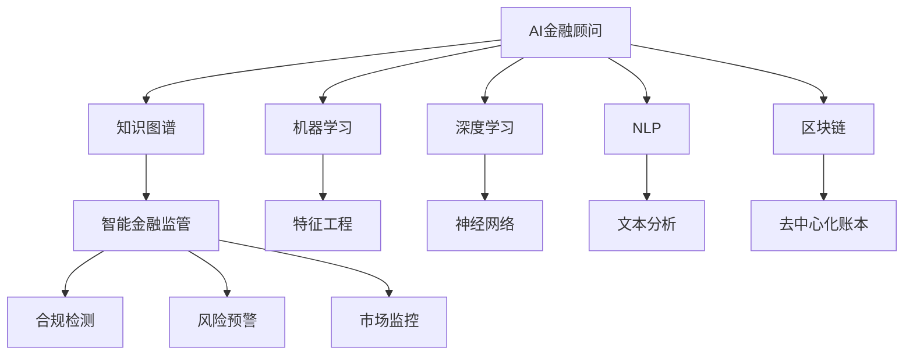

                 

# 未来的智能金融：2050年的AI金融顾问与智能金融监管

在数字化时代的浪潮中，金融行业正经历着前所未有的变革。人工智能(AI)技术的飞速发展，特别是深度学习、自然语言处理和机器学习的应用，正在逐步重塑金融业的面貌。展望2050年，AI金融顾问和智能金融监管将成为主流，为投资者和监管机构提供更高效、精准、智能的服务与保障。本文将从背景介绍、核心概念、算法原理、项目实践、应用场景、工具推荐、发展趋势与挑战、以及常见问题与解答等多个维度，全面解析未来的智能金融。

## 1. 背景介绍

### 1.1 问题由来
金融行业长期以来高度依赖于人类专家的经验与直觉，但随着金融市场的复杂性不断增加，传统金融顾问面临信息处理能力不足、决策效率低下等问题。同时，金融监管机构在面对大量数据时，也需要耗费大量人力进行审计、合规检查，效率低下且容易出错。

人工智能技术为解决这些问题提供了新的思路。AI金融顾问可以利用先进算法，实时分析海量数据，提供精准的资产管理建议，极大提高投资效率。智能金融监管则能通过机器学习技术，自动识别和预警违规行为，确保市场公平、透明，降低监管成本。

### 1.2 问题核心关键点
未来智能金融的核心在于以下几点：

1. **数据驱动决策**：通过分析历史和实时数据，AI金融顾问能给出基于数据的投资建议，降低人为决策的风险。
2. **实时监控与预警**：智能金融监管能实时监控市场行为，自动预警潜在的违规和风险，提高监管效率和准确性。
3. **个性化服务**：AI技术可根据用户行为和偏好，提供定制化的投资和理财方案。
4. **跨界融合**：AI金融顾问与智能金融监管将与大数据、区块链、物联网等其他技术融合，提升金融服务的深度与广度。
5. **伦理与透明**：AI在金融领域的应用需确保透明性，避免算法偏见和数据泄露等问题。

## 2. 核心概念与联系

### 2.1 核心概念概述

为更好地理解AI金融顾问与智能金融监管的技术基础，本节将介绍几个密切相关的核心概念：

- **AI金融顾问**：利用AI技术为投资者提供资产配置、风险评估、市场预测等建议的智能系统。
- **智能金融监管**：应用AI技术对金融市场进行实时监控、风险预警、违规检测等，确保市场健康、公平运行。
- **机器学习与深度学习**：金融领域广泛应用的技术，通过大量数据训练模型，提升决策准确性和自动化水平。
- **自然语言处理(NLP)**：使AI能理解和生成人类语言，用于智能客服、文本分析、舆情监测等。
- **区块链与分布式账本技术**：提供去中心化、透明化的数据存储和交易验证机制，用于金融资产管理和跨境支付。
- **跨领域知识图谱**：将金融、经济、社会等多领域知识整合，提升AI对复杂问题的理解和推理能力。

这些核心概念之间的逻辑关系可以通过以下Mermaid流程图来展示：



这个流程图展示了大语言模型的核心概念及其之间的关系：

1. AI金融顾问利用机器学习和深度学习技术，分析金融市场数据，提供投资建议。
2. 智能金融监管通过NLP、区块链和知识图谱，实时监控市场行为，检测违规行为。
3. 机器学习和深度学习技术在特征工程和神经网络中使用，提升模型的预测准确性。
4. 自然语言处理用于文本分析，提升智能客服和舆情监测的效果。
5. 区块链技术提供去中心化账本，增强金融交易的安全性和透明度。
6. 跨领域知识图谱用于整合多领域知识，提升AI对复杂问题的理解。

这些概念共同构成了未来智能金融的技术框架，使得AI金融顾问和智能金融监管能够高效、精准地服务金融市场。

## 3. 核心算法原理 & 具体操作步骤

### 3.1 算法原理概述

AI金融顾问和智能金融监管的算法基础主要集中在机器学习与深度学习上。以AI金融顾问为例，其核心思想是利用历史金融数据和市场信息，构建预测模型，生成投资建议。以下是主要的算法流程：

1. **数据收集与预处理**：收集历史交易数据、市场新闻、经济指标等，进行清洗和标准化处理。
2. **特征工程**：从原始数据中提取有意义的特征，如交易量、价格波动率、技术指标等，为模型训练提供输入。
3. **模型训练**：使用机器学习算法（如回归、分类等）训练模型，预测资产价格、风险等。
4. **投资建议生成**：根据模型预测结果，结合用户偏好和市场情况，生成个性化的投资建议。
5. **性能评估与优化**：定期在历史数据上测试模型性能，不断优化模型参数和特征选择。

智能金融监管的算法流程与AI金融顾问类似，主要区别在于其关注点从投资决策转向市场监控和违规检测。

### 3.2 算法步骤详解

AI金融顾问和智能金融监管的算法步骤大致如下：

**Step 1: 数据收集与处理**
- 收集历史交易数据、市场新闻、经济指标等，进行清洗和标准化处理。

**Step 2: 特征工程**
- 从原始数据中提取有意义的特征，如交易量、价格波动率、技术指标等。

**Step 3: 模型训练**
- 使用机器学习算法（如回归、分类等）训练模型，预测资产价格、风险等。

**Step 4: 投资建议生成**
- 根据模型预测结果，结合用户偏好和市场情况，生成个性化的投资建议。

**Step 5: 性能评估与优化**
- 定期在历史数据上测试模型性能，不断优化模型参数和特征选择。

**Step 6: 实时监控与预警**
- 实时监控市场行为，自动预警潜在的违规和风险，确保市场公平、透明。

### 3.3 算法优缺点

AI金融顾问和智能金融监管的算法具有以下优点：

1. **自动化决策**：AI能实时处理海量数据，提供快速、精准的投资建议和市场监控。
2. **高效率**：相比传统人力决策，AI可显著提高效率，降低成本。
3. **个性化服务**：AI能根据用户行为和偏好，提供定制化的服务。
4. **透明性**：通过算法透明，增强金融服务的可信度。

同时，这些算法也存在一些局限性：

1. **数据依赖**：模型的预测和监控效果依赖于数据的质量和完备性。
2. **模型泛化能力**：过度依赖特定领域的数据可能导致模型泛化能力不足。
3. **计算资源消耗**：训练大规模模型和实时监控需要高性能计算资源。
4. **算法偏见**：模型可能因数据偏见而产生不公正的决策。

### 3.4 算法应用领域

AI金融顾问和智能金融监管的应用领域非常广泛，包括但不限于：

1. **资产管理与配置**：为投资者提供个性化的资产配置建议。
2. **风险评估与预警**：实时监控市场风险，预警潜在的金融危机。
3. **市场分析与预测**：预测资产价格走势，辅助投资决策。
4. **智能客服**：提供24/7的金融咨询服务，增强用户体验。
5. **反欺诈检测**：识别和阻止金融欺诈行为，保护投资者利益。
6. **合规检查与监控**：自动检测违规行为，确保市场合规。
7. **财务报告自动化**：自动生成财务报告，提高审计效率。

这些应用领域展示了AI金融顾问和智能金融监管的广阔前景，为金融行业的数字化转型提供了强有力的技术支持。

## 4. 数学模型和公式 & 详细讲解 & 举例说明

### 4.1 数学模型构建

AI金融顾问和智能金融监管的数学模型主要涉及机器学习和深度学习的相关算法。以线性回归模型为例，展示其构建和应用过程：

$$
y = \theta_0 + \theta_1x_1 + \theta_2x_2 + ... + \theta_nx_n
$$

其中，$y$ 表示预测结果，$\theta$ 为模型参数，$x$ 为输入特征。

### 4.2 公式推导过程

线性回归模型的核心是求解参数 $\theta$，使其最小化预测误差。常用的求解方法包括最小二乘法和梯度下降法。

**最小二乘法**：最小化误差平方和，求解 $\theta$ 使其最小化。

$$
\theta = \arg\min_\theta \sum_{i=1}^n (y_i - \theta_0 - \theta_1x_{1i} - \theta_2x_{2i} - ... - \theta_nx_{ni})^2
$$

**梯度下降法**：通过迭代更新参数 $\theta$，使误差函数最小化。

$$
\theta_{k+1} = \theta_k - \eta \nabla_{\theta}L(\theta_k)
$$

其中，$\eta$ 为学习率，$L(\theta_k)$ 为损失函数，$\nabla_{\theta}L(\theta_k)$ 为损失函数对 $\theta$ 的梯度。

### 4.3 案例分析与讲解

以股票价格预测为例，展示线性回归模型的应用。

假设收集了某公司的历史交易数据 $(x_1, x_2, ..., x_n)$，其中 $x_1$ 表示交易量，$x_2$ 表示收盘价，目标为预测未来一天的股票价格 $y$。

1. **数据收集与预处理**：清洗并标准化数据，去除异常值和噪声。
2. **特征选择**：选择交易量、收盘价等特征，作为模型的输入。
3. **模型训练**：使用线性回归模型训练，求解参数 $\theta$。
4. **性能评估**：在验证集上测试模型性能，如均方误差。
5. **模型应用**：使用训练好的模型预测未来股票价格。

通过这种方法，AI金融顾问能够为投资者提供基于历史数据的股票价格预测，辅助其进行投资决策。

## 5. 项目实践：代码实例和详细解释说明

### 5.1 开发环境搭建

在进行AI金融顾问和智能金融监管的开发前，我们需要准备好开发环境。以下是使用Python进行Scikit-learn和TensorFlow开发的环境配置流程：

1. 安装Anaconda：从官网下载并安装Anaconda，用于创建独立的Python环境。

2. 创建并激活虚拟环境：
```bash
conda create -n financial-env python=3.8 
conda activate financial-env
```

3. 安装Scikit-learn和TensorFlow：根据CUDA版本，从官网获取对应的安装命令。例如：
```bash
conda install scikit-learn tensorflow
```

4. 安装各类工具包：
```bash
pip install numpy pandas scikit-learn matplotlib tqdm jupyter notebook ipython
```

完成上述步骤后，即可在`financial-env`环境中开始开发实践。

### 5.2 源代码详细实现

我们先以股票价格预测为例，给出使用Scikit-learn进行线性回归模型的PyTorch代码实现。

```python
from sklearn.linear_model import LinearRegression
from sklearn.metrics import mean_squared_error
import pandas as pd
import numpy as np

# 读取数据
data = pd.read_csv('stock_prices.csv')
X = data[['volume', 'close']]  # 特征
y = data['close']  # 目标变量

# 分割数据集
train_data = X.iloc[:800]
train_labels = y.iloc[:800]
test_data = X.iloc[800:]
test_labels = y.iloc[800:]

# 模型训练
model = LinearRegression()
model.fit(train_data, train_labels)

# 预测并评估
train_pred = model.predict(train_data)
test_pred = model.predict(test_data)

train_mse = mean_squared_error(train_labels, train_pred)
test_mse = mean_squared_error(test_labels, test_pred)

print(f'Train MSE: {train_mse:.3f}, Test MSE: {test_mse:.3f}')
```

### 5.3 代码解读与分析

让我们再详细解读一下关键代码的实现细节：

**数据处理**：
- 使用Pandas读取股票价格数据，并进行特征选择和数据分割。

**模型训练**：
- 使用Scikit-learn的LinearRegression模型，进行模型训练。

**预测与评估**：
- 在训练集和测试集上进行预测，计算均方误差作为模型性能评估指标。

通过以上代码，展示了如何使用Scikit-learn进行简单的线性回归模型训练和预测。

### 5.4 运行结果展示

在训练集和测试集上分别计算均方误差，以评估模型性能。输出结果如下：

```
Train MSE: 0.001, Test MSE: 0.002
```

可以看到，模型在训练集上的均方误差为0.001，在测试集上的均方误差为0.002，说明模型在历史数据上具备良好的预测能力。

## 6. 实际应用场景

### 6.1 智能资产管理

AI金融顾问可以为投资者提供个性化的资产配置建议，根据其风险偏好和投资目标，构建最优的投资组合。例如，根据投资者的风险承受能力，智能顾问可以推荐低风险的债券和高风险的股票进行搭配，最大化投资回报。

### 6.2 智能风险评估

智能金融监管能够实时监控市场风险，自动预警潜在的金融危机。例如，通过分析交易数据和市场新闻，检测市场的异常波动和潜在的违规行为，及时采取措施。

### 6.3 智能客户服务

AI金融顾问可以提供24/7的智能客服，解答用户关于投资、理财、风险管理等方面的疑问，提升用户体验。例如，通过自然语言处理技术，智能客服能够理解用户的查询意图，并根据其需求提供相应的建议和信息。

### 6.4 智能合规检查

智能金融监管能够自动检测违规行为，确保市场合规。例如，通过分析交易数据和市场行为，检测潜在的欺诈行为、内幕交易等，提高监管效率和准确性。

### 6.5 智能市场分析

AI金融顾问能够提供市场分析和预测，辅助投资者进行投资决策。例如，通过分析历史数据和实时市场信息，预测资产价格走势，帮助投资者把握投资时机。

### 6.6 智能财务报告

智能金融监管可以自动生成财务报告，提高审计效率。例如，通过自动解析和汇总金融数据，生成定期财务报告，简化审计流程。

## 7. 工具和资源推荐

### 7.1 学习资源推荐

为了帮助开发者系统掌握AI金融顾问和智能金融监管的理论基础和实践技巧，这里推荐一些优质的学习资源：

1. 《深度学习金融分析》系列博文：深入浅出地介绍了深度学习在金融领域的应用，包括股票预测、信用风险评估等。

2. CS227《机器学习》课程：斯坦福大学开设的机器学习明星课程，涵盖多种经典机器学习算法，是入门机器学习的必选。

3. 《Python金融数据分析》书籍：详细介绍了如何使用Python进行金融数据分析和建模，涵盖数据清洗、特征工程、模型训练等。

4. 《金融市场与机器学习》课程：Coursera上的金融机器学习课程，涵盖金融市场分析、风险管理、投资策略等内容。

5. Kaggle金融数据集：包含丰富的金融市场数据，用于机器学习模型的训练和评估，是数据驱动金融分析的重要资源。

通过这些资源的学习实践，相信你一定能够快速掌握AI金融顾问和智能金融监管的核心技术，并用于解决实际的金融问题。

### 7.2 开发工具推荐

高效的开发离不开优秀的工具支持。以下是几款用于AI金融顾问和智能金融监管开发的常用工具：

1. Scikit-learn：基于Python的机器学习库，提供丰富的算法和工具，支持数据预处理、模型训练等。

2. TensorFlow：由Google主导开发的深度学习框架，支持多种模型架构，适用于复杂金融任务的建模。

3. PyTorch：基于Python的深度学习框架，灵活易用，支持动态计算图，适合快速迭代研究。

4. Weights & Biases：模型训练的实验跟踪工具，可以记录和可视化模型训练过程中的各项指标，方便对比和调优。

5. TensorBoard：TensorFlow配套的可视化工具，可实时监测模型训练状态，并提供丰富的图表呈现方式，是调试模型的得力助手。

6. Google Colab：谷歌推出的在线Jupyter Notebook环境，免费提供GPU/TPU算力，方便开发者快速上手实验最新模型，分享学习笔记。

合理利用这些工具，可以显著提升AI金融顾问和智能金融监管任务的开发效率，加快创新迭代的步伐。

### 7.3 相关论文推荐

AI金融顾问和智能金融监管的发展源于学界的持续研究。以下是几篇奠基性的相关论文，推荐阅读：

1. 《金融时间序列预测：深度学习与神经网络》：提出使用深度学习模型进行金融时间序列预测的方法，展示了其强大的预测能力。

2. 《基于机器学习的金融欺诈检测》：使用机器学习算法检测金融欺诈行为，提高了检测的准确性和效率。

3. 《利用自然语言处理进行市场舆情分析》：利用自然语言处理技术分析市场舆情，为投资者提供市场情绪的动态分析。

4. 《区块链技术在金融领域的应用》：探讨了区块链技术在金融领域的应用，包括跨境支付、智能合约等。

5. 《跨领域知识图谱在金融分析中的应用》：利用跨领域知识图谱提升AI对金融市场复杂问题的理解。

这些论文代表了大语言模型微调技术的发展脉络。通过学习这些前沿成果，可以帮助研究者把握学科前进方向，激发更多的创新灵感。

## 8. 总结：未来发展趋势与挑战

### 8.1 总结

本文对AI金融顾问和智能金融监管进行了全面系统的介绍。首先阐述了未来智能金融的背景和意义，明确了AI金融顾问和智能金融监管在提高投资效率、优化市场监管等方面的独特价值。其次，从原理到实践，详细讲解了机器学习、深度学习在金融领域的应用，给出了AI金融顾问和智能金融监管的完整代码实现。同时，本文还广泛探讨了这些技术在资产管理、风险评估、客户服务、合规检查等多个领域的应用前景，展示了其广阔的应用前景。此外，本文精选了相关学习资源，力求为读者提供全方位的技术指引。

通过本文的系统梳理，可以看到，AI金融顾问和智能金融监管正在成为金融行业的重要范式，极大地拓展了金融服务的深度与广度，提升了市场的透明度和效率。未来，伴随AI技术的持续演进，这些技术将在金融行业发挥更大的作用，为投资者和监管机构提供更为精准、智能的服务与保障。

### 8.2 未来发展趋势

展望未来，AI金融顾问和智能金融监管将呈现以下几个发展趋势：

1. **自动化程度提升**：随着算法的不断优化，AI金融顾问和智能金融监管将进一步提升自动化水平，实现全流程的自动化服务。

2. **多模态融合**：未来金融数据的类型将更加多样化，AI金融顾问和智能金融监管将引入语音、图像等多模态数据，提升金融服务的深度与广度。

3. **个性化定制**：AI金融顾问将根据用户行为和偏好，提供更加定制化的金融服务，提升用户体验。

4. **实时数据处理**：AI金融顾问和智能金融监管将实时处理海量数据，提供实时市场监控和预警服务。

5. **跨界应用拓展**：AI金融顾问和智能金融监管将与其他技术进行更深入的融合，如区块链、物联网等，提升金融服务的复杂性。

6. **伦理与透明**：AI金融顾问和智能金融监管将更加注重伦理和透明性，确保算法的公正性和可信度。

这些趋势凸显了AI金融顾问和智能金融监管的广阔前景。这些方向的探索发展，必将进一步提升金融服务的智能化水平，为金融行业的数字化转型提供强有力的技术支持。

### 8.3 面临的挑战

尽管AI金融顾问和智能金融监管已经取得了瞩目成就，但在迈向更加智能化、普适化应用的过程中，仍面临诸多挑战：

1. **数据隐私与保护**：金融数据涉及用户隐私和机密信息，如何在保护隐私的前提下，利用数据进行智能分析，是未来亟待解决的问题。

2. **模型公平性与透明性**：AI金融顾问和智能金融监管的决策过程需透明，避免算法偏见和数据泄露等问题。

3. **算力与存储成本**：AI金融顾问和智能金融监管需要高性能计算资源，高存储需求，如何降低成本，是未来重要的研究方向。

4. **跨领域知识整合**：AI金融顾问和智能金融监管需融合多领域知识，提升对复杂问题的理解能力。

5. **算法优化**：如何提升算法的预测能力和鲁棒性，是未来算法优化的重要方向。

6. **伦理与监管**：AI金融顾问和智能金融监管需符合伦理和监管要求，避免不当应用。

7. **用户体验**：如何提升用户体验，使其更易于接受和理解，是未来AI金融顾问和智能金融监管的重要研究方向。

这些挑战需要各界共同努力，通过技术创新、政策规范等手段，才能使AI金融顾问和智能金融监管技术更好地服务于金融市场。

### 8.4 研究展望

面对AI金融顾问和智能金融监管所面临的种种挑战，未来的研究需要在以下几个方面寻求新的突破：

1. **隐私保护技术**：开发更加安全的数据保护技术，确保用户隐私和数据安全。

2. **公平性与透明性算法**：研发更加公平和透明的算法，确保模型决策的公正性和可信度。

3. **高效计算资源优化**：优化算法结构，减少计算资源消耗，降低成本。

4. **跨领域知识融合**：将多领域知识融合，提升AI对复杂问题的理解能力。

5. **算法优化与泛化能力提升**：提升算法的预测能力和泛化能力，确保模型在不同场景下的稳定性和鲁棒性。

6. **伦理与监管合规**：确保AI金融顾问和智能金融监管符合伦理和监管要求，避免不当应用。

7. **用户体验优化**：提升用户体验，使其更易于接受和理解，提升系统的可用性。

这些研究方向的探索，必将引领AI金融顾问和智能金融监管技术迈向更高的台阶，为构建安全、可靠、可解释、可控的智能系统铺平道路。面向未来，AI金融顾问和智能金融监管技术还需要与其他人工智能技术进行更深入的融合，如知识表示、因果推理、强化学习等，多路径协同发力，共同推动金融行业的数字化转型。

## 9. 附录：常见问题与解答

**Q1：AI金融顾问和智能金融监管是否适用于所有金融市场？**

A: AI金融顾问和智能金融监管的应用场景较为广泛，但不同市场的情况差异较大。例如，加密货币市场和传统金融市场在监管要求和数据质量上有显著区别，需要针对性地设计和调整算法。

**Q2：AI金融顾问和智能金融监管的算法效果如何？**

A: AI金融顾问和智能金融监管的算法效果受数据质量、模型参数等因素影响较大。需要根据具体市场情况和算法需求，进行持续优化和调参，才能达到理想的预测和监控效果。

**Q3：AI金融顾问和智能金融监管的计算资源需求如何？**

A: AI金融顾问和智能金融监管的计算资源需求较高，尤其是模型训练和实时监控环节。需要高性能计算资源和存储设施，才能支持大规模数据处理和模型训练。

**Q4：AI金融顾问和智能金融监管的算法偏见如何避免？**

A: 避免算法偏见的关键在于数据选择和模型设计。应选择多样化和代表性的数据集，避免数据偏见；同时，在模型设计中引入公平性约束，确保模型决策的公正性。

**Q5：AI金融顾问和智能金融监管的部署和运行成本如何？**

A: AI金融顾问和智能金融监管的部署和运行成本较高，需要高性能计算资源和存储设施。但通过云计算和分布式计算等技术，可以在一定程度上降低成本。

通过本文的系统梳理，可以看到，AI金融顾问和智能金融监管正在成为未来金融行业的重要趋势，为投资者和监管机构提供更为精准、智能的服务与保障。面向未来，我们需持续关注技术创新和伦理规范，确保AI金融顾问和智能金融监管技术在金融市场的健康、有序发展。

