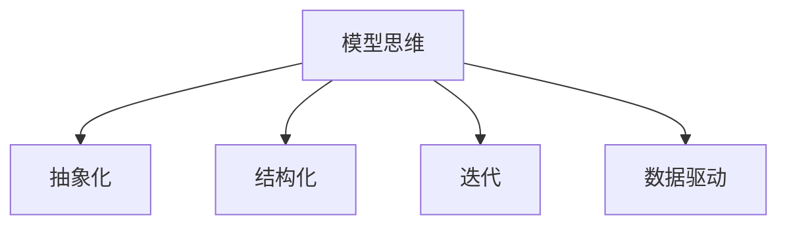

                 

# 模型思维:快速掌握新知识的法宝

> 关键词：模型思维,知识加速,认知迭代,数据驱动,机器学习

## 1. 背景介绍

### 1.1 问题由来
在知识爆炸的今天，人类面临着前所未有的学习挑战。无论是从学术研究还是日常工作中，如何快速掌握新知识、提升学习效率，已经成为一个亟待解决的问题。特别是在数据科学、人工智能等技术领域，知识点繁多、知识体系庞杂，如何快速入门，并通过持续学习跟上技术发展的步伐，是每一位从业者需要思考的问题。

### 1.2 问题核心关键点
模型思维(Mental Model)，是一种通过构建和应用模型来理解和解决问题的思维方式。在人工智能和大数据时代，模型思维尤为关键。它不仅可以帮助我们更好地理解复杂系统，还可以通过模型化的思考方式，加速知识的掌握和应用。

具体而言，模型思维的核心关键点包括：
- **抽象化**：将复杂问题简化为易于理解和处理的形式。
- **结构化**：将知识体系化，便于理解和应用。
- **迭代**：通过不断的模型迭代，逐步深化理解，提升能力。

这些关键点共同构成了一个高效的知识学习和应用框架，使得个人或团队能够在复杂多变的环境中，快速、灵活地适应和应对。

### 1.3 问题研究意义
模型思维的掌握，对于提升个人学习效率、推动团队技术发展、加速知识普及与传播，具有重要意义：

1. **个人学习**：模型思维使得个人能够快速理解和应用复杂知识，加速学习过程，提升知识积累效率。
2. **团队协作**：模型思维可以帮助团队成员更好地理解彼此的技术栈和知识体系，促进协作和创新。
3. **知识传播**：模型化思考有助于将复杂的知识分解为易于理解的小模型，便于更多人接受和掌握。
4. **应用创新**：模型思维催生了许多新的技术和应用，如深度学习、机器学习等，推动了人工智能领域的快速发展。

## 2. 核心概念与联系

### 2.1 核心概念概述

为了更好地理解模型思维的原理和架构，本节将介绍几个密切相关的核心概念：

- **模型(Mental Model)**：对复杂系统或问题的抽象表示，通常包括模型输入、模型输出、模型假设等组成部分。
- **抽象化(Abstraction)**：将复杂问题简化为易于理解和处理的形式，使得复杂问题更容易处理。
- **结构化(Structuration)**：将知识体系化，形成逻辑清晰、层次分明的结构。
- **迭代(Iteration)**：通过不断的模型迭代，逐步深化理解，提升能力。
- **数据驱动(Data-Driven)**：基于数据构建模型，通过数据验证和优化模型。

这些核心概念之间的逻辑关系可以通过以下Mermaid流程图来展示：



这个流程图展示了大模型思维的核心概念及其之间的关系：

1. 模型思维通过抽象化将复杂问题简化，便于理解和处理。
2. 结构化使得知识体系化，便于掌握。
3. 迭代通过不断的模型优化，深化理解。
4. 数据驱动使得模型基于数据进行构建和优化，提高模型的可靠性和泛化能力。

这些概念共同构成了模型思维的学习框架，使得个人或团队能够高效、系统地掌握和应用新知识。

## 3. 核心算法原理 & 具体操作步骤
### 3.1 算法原理概述

模型思维的实现，本质上是一种通过模型化的思维方式，进行知识学习和应用的过程。其核心思想是：将复杂问题或知识抽象为模型，通过模型化的思考方式，逐步深化理解，提升能力。

具体而言，模型思维的步骤包括：
- **抽象化问题**：将复杂问题抽象为易于理解和处理的形式。
- **构建模型**：根据问题的特点，构建相应的模型。
- **验证模型**：通过数据验证模型的有效性，并进行优化。
- **迭代提升**：通过不断的模型迭代，逐步提升模型的准确性和泛化能力。

模型思维的原理，可以类比于机器学习的流程：

1. **特征工程**：将复杂问题抽象为特征向量，便于模型处理。
2. **模型选择**：选择适合的模型，如线性回归、决策树、神经网络等。
3. **模型训练**：通过训练数据验证模型的有效性，并进行参数优化。
4. **模型应用**：将优化后的模型应用于实际问题，进行预测或决策。

这些步骤共同构成了一个完整的模型思维框架，使得个人或团队能够高效、系统地掌握和应用新知识。

### 3.2 算法步骤详解

模型思维的实现步骤可以分为以下几个关键阶段：

**Step 1: 问题抽象化**
- 分析问题，确定核心要素和关系。
- 将问题抽象为模型输入和输出，定义模型假设。
- 简化问题，去除不必要的细节。

**Step 2: 构建模型**
- 根据问题的特点，选择或设计相应的模型。
- 确定模型的输入、输出、参数等关键组件。
- 根据模型的特点，选择合适的优化算法和损失函数。

**Step 3: 数据驱动**
- 收集和处理数据，确保数据质量。
- 使用数据训练模型，验证模型的有效性。
- 根据验证结果，调整模型参数，优化模型。

**Step 4: 迭代提升**
- 使用新数据验证模型的泛化能力。
- 根据新数据调整模型参数，进一步优化模型。
- 重复上述步骤，直至模型满足要求。

以上是模型思维的完整流程。在实际应用中，还需要根据具体问题，对各个步骤进行灵活调整和优化。

### 3.3 算法优缺点

模型思维的实现具有以下优点：
- **系统性**：模型思维通过系统的步骤和方法，使得知识掌握更加有条理。
- **可验证性**：通过数据驱动，模型思维具备可验证性，能够不断验证和优化模型。
- **可扩展性**：模型思维的思路和方法具有通用性，可以应用于各种复杂问题。

同时，模型思维也存在一定的局限性：
- **抽象难度**：将复杂问题抽象为模型可能需要一定的经验和技巧。
- **模型选择**：选择适合的模型需要一定的专业知识和经验。
- **迭代周期**：模型迭代可能需要较长的周期，影响效率。

尽管存在这些局限性，但就目前而言，模型思维仍是学习新知识和解决复杂问题的有效手段。未来相关研究的重点在于如何进一步降低抽象难度、优化模型选择、加速迭代过程，同时兼顾模型可解释性和应用效果。

### 3.4 算法应用领域

模型思维的应用范围非常广泛，涵盖多个学科领域，例如：

- **工程设计**：通过构建和优化模型，提升设计效率和质量。
- **金融分析**：使用模型思维分析市场趋势、预测股市波动。
- **医疗诊断**：建立疾病诊断模型，提升诊断准确性和效率。
- **环境监测**：构建环境监测模型，实时监测污染源、预警环境风险。
- **社会科学**：构建社会行为模型，研究人类行为规律。

除了这些经典应用领域外，模型思维还被创新性地应用于更多场景中，如机器学习、自然语言处理、计算机视觉等，为解决实际问题提供了新的思路和方法。

## 4. 数学模型和公式 & 详细讲解 & 举例说明

### 4.1 数学模型构建

本节将使用数学语言对模型思维的实现过程进行更加严格的刻画。

假设我们要解决一个问题，其输入为 $x$，输出为 $y$。根据问题的特点，我们可以构建一个线性回归模型，假设形式为 $y=f(x;\theta)=\theta_0+\theta_1x$。其中 $\theta_0$ 和 $\theta_1$ 为模型参数。

**模型假设**：
- 输入 $x$ 为连续变量。
- 输出 $y$ 为连续变量。
- 模型为线性关系。

**模型输入和输出**：
- 输入 $x$ 可以是单变量或多变量，如年龄、身高等。
- 输出 $y$ 可以是单变量或多变量，如体重、血压等。

**模型参数**：
- 模型参数 $\theta_0$ 和 $\theta_1$ 需要通过数据进行估计。

**损失函数**：
- 常用的损失函数有均方误差（Mean Squared Error, MSE），定义如下：
$$
L(\theta)=\frac{1}{N}\sum_{i=1}^N (y_i-f(x_i;\theta))^2
$$

**优化目标**：
- 最小化损失函数 $L(\theta)$，得到最优参数 $\hat{\theta}$：
$$
\hat{\theta}=\mathop{\arg\min}_{\theta} L(\theta)
$$

### 4.2 公式推导过程

以下我们以线性回归模型为例，推导损失函数及其梯度的计算公式。

**损失函数**：
$$
L(\theta)=\frac{1}{N}\sum_{i=1}^N (y_i-f(x_i;\theta))^2
$$

**梯度计算**：
$$
\frac{\partial L(\theta)}{\partial \theta_0} = -2\frac{1}{N}\sum_{i=1}^N (y_i-f(x_i;\theta))
$$
$$
\frac{\partial L(\theta)}{\partial \theta_1} = -2\frac{1}{N}\sum_{i=1}^N (x_i-f(x_i;\theta))y_i
$$

通过计算梯度，我们可以使用优化算法（如梯度下降、随机梯度下降等）更新模型参数 $\theta_0$ 和 $\theta_1$，最小化损失函数。

在得到损失函数的梯度后，即可带入优化算法，完成模型的迭代优化。重复上述过程直至收敛，最终得到最优模型参数 $\hat{\theta}$。

### 4.3 案例分析与讲解

假设我们有一组数据，包含身高和体重信息：

| 年龄 | 身高（cm） | 体重（kg） |
|------|-----------|-----------|
| 18   | 170       | 60        |
| 19   | 175       | 65        |
| ...  | ...       | ...       |

现在我们要构建一个身高预测模型，使用线性回归模型进行建模。

**数据预处理**：
- 将数据转换为特征向量 $x=[age, height]$，目标变量 $y=weight$。
- 将数据标准化，使其均值为0，方差为1。

**模型构建**：
- 选择线性回归模型 $y=f(x;\theta)=\theta_0+\theta_1age+\theta_2height$。
- 选择优化算法，如梯度下降。
- 设置学习率、批大小等超参数。

**模型训练**：
- 使用训练数据 $(x_i, y_i)$ 进行迭代训练。
- 计算损失函数 $L(\theta)$ 和梯度 $\frac{\partial L(\theta)}{\partial \theta}$。
- 更新模型参数 $\theta_0$ 和 $\theta_1$，直至收敛。

**模型验证**：
- 使用验证数据 $(x_v, y_v)$ 验证模型泛化能力。
- 根据验证结果调整模型参数，进一步优化模型。

**模型应用**：
- 使用测试数据 $(x_t, y_t)$ 测试模型效果。
- 根据测试结果，评估模型性能。

通过上述步骤，我们可以构建一个简单的身高预测模型，并用数据驱动的方法进行优化，提升模型预测准确性。

## 5. 项目实践：代码实例和详细解释说明
### 5.1 开发环境搭建

在进行模型思维的实践前，我们需要准备好开发环境。以下是使用Python进行Scikit-learn开发的Python环境配置流程：

1. 安装Anaconda：从官网下载并安装Anaconda，用于创建独立的Python环境。

2. 创建并激活虚拟环境：
```bash
conda create -n model-env python=3.8 
conda activate model-env
```

3. 安装Scikit-learn：
```bash
conda install scikit-learn
```

4. 安装各类工具包：
```bash
pip install numpy pandas matplotlib seaborn statsmodels
```

完成上述步骤后，即可在`model-env`环境中开始模型思维的实践。

### 5.2 源代码详细实现

下面我们以线性回归为例，给出使用Scikit-learn进行模型构建和训练的Python代码实现。

```python
import numpy as np
from sklearn.linear_model import LinearRegression
from sklearn.metrics import mean_squared_error
from sklearn.model_selection import train_test_split
import matplotlib.pyplot as plt

# 构造数据
X = np.array([[18, 170], [19, 175], [20, 180], [21, 185], [22, 190], [23, 195]])
y = np.array([60, 65, 70, 75, 80, 85])

# 数据划分
X_train, X_test, y_train, y_test = train_test_split(X, y, test_size=0.2, random_state=42)

# 模型训练
model = LinearRegression()
model.fit(X_train, y_train)

# 模型评估
y_pred = model.predict(X_test)
mse = mean_squared_error(y_test, y_pred)
print(f"均方误差: {mse:.2f}")

# 可视化结果
plt.scatter(X_test[:, 1], y_test, color='blue', label='真实数据')
plt.plot(X_test[:, 1], y_pred, color='red', label='模型预测')
plt.legend()
plt.show()
```

### 5.3 代码解读与分析

让我们再详细解读一下关键代码的实现细节：

**数据构造**：
- 使用NumPy构造输入和输出数据。

**模型训练**：
- 使用Scikit-learn的`LinearRegression`类构建线性回归模型。
- 使用训练数据进行模型训练。

**模型评估**：
- 使用测试数据进行模型验证，计算均方误差（MSE）。
- 可视化模型预测结果与真实数据的对比。

可以看到，Scikit-learn使得模型思维的实现变得非常简单高效。开发者可以将更多精力放在数据处理、模型选择和优化等高层逻辑上，而不必过多关注底层的实现细节。

当然，工业级的系统实现还需考虑更多因素，如模型保存和部署、超参数搜索、模型性能监控等。但核心的模型思维范式基本与此类似。

## 6. 实际应用场景
### 6.1 智能推荐系统

基于模型思维的推荐系统，可以广泛应用于电商、社交网络、视频网站等多个领域。通过分析用户的历史行为数据，使用模型思维构建推荐模型，可以为每个用户推荐个性化的商品或内容。

在技术实现上，可以收集用户浏览、点击、购买等行为数据，提取和商品或内容相关的文本、标签、图片等特征，构建推荐模型。通过不断迭代优化，模型能够自动学习用户偏好，进行精准推荐。

### 6.2 金融风控

金融领域对风险控制的要求非常严格，模型思维在金融风控中的应用，可以有效提升风控模型的准确性和鲁棒性。

在实践过程中，可以收集金融交易数据，提取交易金额、时间、地点、交易类型等特征。使用模型思维构建风控模型，如信用评分模型、欺诈检测模型等，通过不断的迭代优化，提升模型的预测准确性。

### 6.3 医疗诊断

医疗诊断是一个复杂的系统工程，模型思维在医疗诊断中的应用，可以提高诊断的准确性和效率。

在实践过程中，可以收集病人的病历、症状、实验室检查结果等数据，提取特征构建诊断模型。通过不断的迭代优化，模型能够自动学习病人的疾病特征，进行精准诊断。

### 6.4 未来应用展望

随着模型思维的不断发展和应用，未来在更多领域将会有新的突破。

在智慧城市治理中，模型思维可以应用于城市事件监测、舆情分析、应急指挥等环节，提高城市管理的自动化和智能化水平，构建更安全、高效的未来城市。

在教育领域，模型思维可以帮助学生快速掌握知识，提升学习效果。例如，通过构建知识图谱，进行知识推理，帮助学生构建完整的知识体系。

在环境保护中，模型思维可以应用于环境监测、污染源识别等环节，提升环境保护的智能化水平。

此外，在工业制造、能源管理、交通物流等众多领域，模型思维的应用也将不断涌现，为各行各业带来新的创新和突破。

## 7. 工具和资源推荐
### 7.1 学习资源推荐

为了帮助开发者系统掌握模型思维的理论基础和实践技巧，这里推荐一些优质的学习资源：

1. 《深入理解机器学习》系列书籍：由机器学习领域的权威专家撰写，系统介绍了机器学习的基本概念和前沿技术。

2. 《Python机器学习基础》课程：通过Python语言实现机器学习算法，涵盖回归、分类、聚类等多个主题。

3. 《数据科学与统计学》课程：由统计学领域的专家开设，涵盖统计学的基础知识和常用方法。

4. Coursera和edX等在线课程平台：提供丰富的机器学习、统计学、数据科学等课程，满足不同层次的学习需求。

5. GitHub上的开源项目：例如TensorFlow、Scikit-learn等，提供了大量的实践样例和代码，方便开发者学习。

通过对这些资源的学习实践，相信你一定能够快速掌握模型思维的精髓，并用于解决实际的机器学习问题。

### 7.2 开发工具推荐

高效的开发离不开优秀的工具支持。以下是几款用于模型思维开发的常用工具：

1. Jupyter Notebook：免费的开源Jupyter笔记本环境，支持Python、R等多种语言，方便开发者进行交互式编程和数据可视化。

2. PyCharm：由JetBrains开发的Python IDE，提供了丰富的代码编辑器和调试工具，支持PyTorch、TensorFlow等深度学习框架。

3. Visual Studio Code：微软开发的免费开源编辑器，支持多种编程语言和插件，方便开发者进行代码管理和数据分析。

4. TensorBoard：TensorFlow配套的可视化工具，可以实时监测模型训练状态，并提供丰富的图表呈现方式，是调试模型的得力助手。

5. Weights & Biases：模型训练的实验跟踪工具，可以记录和可视化模型训练过程中的各项指标，方便对比和调优。

6. Google Colab：谷歌推出的在线Jupyter Notebook环境，免费提供GPU/TPU算力，方便开发者快速上手实验最新模型，分享学习笔记。

合理利用这些工具，可以显著提升模型思维的开发效率，加快创新迭代的步伐。

### 7.3 相关论文推荐

模型思维的发展源于学界的持续研究。以下是几篇奠基性的相关论文，推荐阅读：

1. 《机器学习》（Machine Learning）：由Tom Mitchell撰写，介绍了机器学习的基本概念、算法和应用。

2. 《统计学习基础》（The Elements of Statistical Learning）：由Tibshirani、Hastie和Friedman共同撰写，系统介绍了统计学习的基本理论和常用方法。

3. 《深度学习》（Deep Learning）：由Goodfellow、Bengio和Courville共同撰写，全面介绍了深度学习的基本原理和实践技巧。

4. 《数据挖掘：概念与技术》（Data Mining: Concepts and Techniques）：由Kapilan、Mangasarian和Omohundro共同撰写，涵盖数据挖掘的基础知识和常用方法。

这些论文代表了大模型思维的发展脉络。通过学习这些前沿成果，可以帮助研究者把握学科前进方向，激发更多的创新灵感。

## 8. 总结：未来发展趋势与挑战

### 8.1 总结

本文对模型思维的实现方法进行了全面系统的介绍。首先阐述了模型思维的学习框架和应用价值，明确了模型思维在提升学习效率、推动技术发展、加速知识普及与传播等方面的重要作用。其次，从原理到实践，详细讲解了模型思维的数学原理和关键步骤，给出了模型思维任务开发的完整代码实例。同时，本文还广泛探讨了模型思维在多个行业领域的应用前景，展示了模型思维的广泛应用潜力。此外，本文精选了模型思维的各类学习资源，力求为读者提供全方位的技术指引。

通过本文的系统梳理，可以看到，模型思维的实现框架在复杂多变的环境中，能够高效、系统地掌握和应用新知识。模型思维的不断发展和应用，必将进一步提升人工智能技术的效率和效果，推动各领域的智能化进程。

### 8.2 未来发展趋势

展望未来，模型思维的发展将呈现以下几个趋势：

1. **自动化学习**：随着自动化机器学习（AutoML）技术的发展，模型思维将进一步自动化，帮助更多用户快速构建和优化模型。

2. **多模态学习**：模型思维将不再局限于单一模态的数据，将进一步拓展到多模态数据的学习，提升模型的泛化能力。

3. **深度强化学习**：模型思维与深度强化学习结合，通过模型驱动的策略学习，提升复杂系统的决策能力和控制能力。

4. **智能决策**：模型思维在决策支持系统中的应用，将使得复杂决策过程更加智能、高效。

5. **认知科学**：模型思维结合认知科学，将进一步提升对人类认知过程的理解，推动人工智能技术的发展。

以上趋势凸显了模型思维的广泛应用前景，未来的研究将在技术、应用、理论等多个层面进行深入探索，推动模型思维向更高的台阶迈进。

### 8.3 面临的挑战

尽管模型思维已经取得了瞩目成就，但在迈向更加智能化、普适化应用的过程中，它仍面临着诸多挑战：

1. **数据质量和数量**：高质量、大规模数据是模型思维的基础，但数据的获取和处理往往需要大量人力和资源。

2. **模型复杂性**：模型思维的实现需要构建和优化复杂模型，增加了模型的构建和维护难度。

3. **计算资源**：模型思维的实现需要高性能计算资源，如GPU/TPU等，增加了模型的运行成本。

4. **可解释性**：模型思维的输出往往是一个黑盒，缺乏可解释性，难以理解和调试。

5. **应用场景局限**：模型思维在特定场景下的应用效果可能有限，需要针对具体问题进行优化。

6. **模型泛化能力**：模型思维的泛化能力受限于数据分布，需要不断优化模型以提升泛化性能。

正视模型思维面临的这些挑战，积极应对并寻求突破，将使模型思维技术更加成熟，更加普及。

### 8.4 研究展望

面对模型思维所面临的挑战，未来的研究需要在以下几个方面寻求新的突破：

1. **自动化技术**：发展自动化机器学习技术，降低模型构建和优化的复杂度。

2. **多模态融合**：研究多模态数据融合技术，提升模型的泛化能力和鲁棒性。

3. **智能决策支持**：开发智能决策支持系统，提升复杂决策的自动化和智能化水平。

4. **可解释模型**：研究可解释性模型，提升模型的可解释性和可理解性。

5. **跨领域应用**：推动模型思维在更多领域的应用，推动技术进步和创新。

这些研究方向的探索，将使模型思维技术更加成熟，更加普及，为构建智能系统提供更加坚实的技术基础。

## 9. 附录：常见问题与解答

**Q1：模型思维是否适用于所有领域？**

A: 模型思维适用于各种复杂问题，包括但不限于工程设计、金融分析、医疗诊断、环境监测等。但对于一些特定领域，如艺术创作、情感交流等，模型思维可能难以直接应用。

**Q2：如何选择合适的模型进行模型思维？**

A: 选择合适的模型需要考虑问题的性质、数据的特点、模型的复杂度等因素。常用的模型包括线性回归、决策树、神经网络等。通常需要结合实际问题进行试验和优化。

**Q3：如何优化模型参数？**

A: 模型参数的优化通常使用梯度下降等优化算法。需要通过交叉验证等方法，选择合适的超参数。例如，可以调整学习率、批大小、正则化系数等。

**Q4：模型思维在应用过程中需要注意哪些问题？**

A: 模型思维在应用过程中需要注意：
1. 数据预处理：清洗、归一化、特征选择等步骤。
2. 模型验证：选择合适的验证数据，避免过拟合。
3. 模型应用：在实际问题中进行模型测试，评估模型效果。
4. 模型部署：将模型转化为可部署的形式，如API、服务化接口等。

**Q5：模型思维在未来有哪些发展方向？**

A: 模型思维的未来发展方向包括：
1. 自动化技术：如AutoML、模型自动构建等。
2. 多模态融合：如融合视觉、语音、文本等多模态数据。
3. 智能决策支持：如决策树、强化学习等。
4. 可解释模型：如可解释的神经网络、因果模型等。

这些方向将进一步推动模型思维技术的创新和应用。

---

作者：禅与计算机程序设计艺术 / Zen and the Art of Computer Programming

