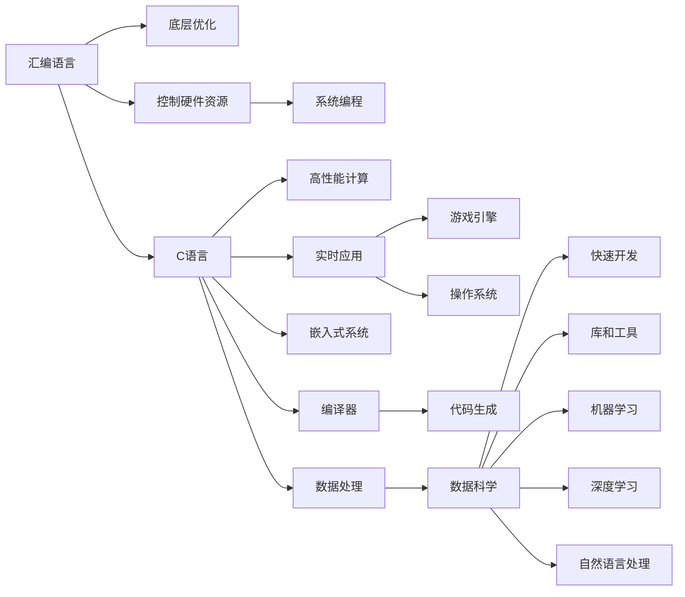

                 

# 汇编、C和Python：AI开发中的编程语言选择

## 1. 背景介绍

### 1.1 问题由来
随着人工智能(AI)技术的迅速发展，其在各个领域的应用已经从研究转向实际部署。在这个过程中，编程语言的选择变得尤为重要。尽管AI算法的多样性使得单一语言难以满足所有需求，但不同的编程语言在AI开发中扮演着不同的角色，各自具有不同的优势和适用场景。本文将探讨汇编、C和Python这三种编程语言在AI开发中的应用，帮助开发者根据具体需求选择合适的编程语言。

### 1.2 问题核心关键点
- **汇编语言**：机器指令级编程，直接控制硬件资源，适合底层优化和高性能计算。
- **C语言**：通用性强，性能优异，广泛应用于操作系统、编译器、游戏引擎等领域。
- **Python语言**：简洁易学，拥有丰富的库和工具，适合快速原型开发和高级应用。

## 2. 核心概念与联系

### 2.1 核心概念概述

为更好地理解不同编程语言在AI开发中的应用，本节将介绍几个密切相关的核心概念：

- **编程语言**：计算机程序中用于描述算法和操作的符号和语法。
- **汇编语言**：直接与计算机硬件交互的低级编程语言，需要程序员理解底层硬件结构。
- **C语言**：一种高效的高级语言，能够直接控制内存和硬件，广泛应用于系统编程和性能敏感领域。
- **Python语言**：一种高级动态语言，具备强大的库和工具支持，适合快速开发和数据科学。
- **AI开发**：使用计算机程序和算法来解决复杂问题，如机器学习、深度学习、自然语言处理等。

这些核心概念之间的逻辑关系可以通过以下Mermaid流程图来展示：



这个流程图展示了汇编、C和Python三种编程语言在AI开发中的主要应用场景和相互关系。

## 3. 核心算法原理 & 具体操作步骤

### 3.1 算法原理概述

汇编语言、C语言和Python在AI开发中的应用，主要体现在算法实现、系统优化、快速原型开发等方面。以下将分别介绍这三种语言的核心算法原理。

### 3.2 算法步骤详解

#### 3.2.1 汇编语言

汇编语言主要应用于底层优化和高性能计算。在AI开发中，汇编语言主要用于编写高效的算法实现，如图像处理、音频处理和信号处理等。以下是汇编语言在AI开发中的应用步骤：

1. **编写汇编代码**：根据具体算法和数据结构，编写汇编代码，实现算法的功能。
2. **编译生成目标代码**：使用汇编器将汇编代码翻译为目标代码，通常是可执行文件或库文件。
3. **优化目标代码**：使用优化器对目标代码进行优化，如指令调度和数据对齐，提升执行效率。
4. **链接和部署**：将优化的目标代码与其他程序或库文件链接，生成最终可执行文件，部署到目标平台。

#### 3.2.2 C语言

C语言作为高性能计算的代表，广泛应用于系统编程和实时应用。在AI开发中，C语言主要用于实现底层算法和系统优化。以下是C语言在AI开发中的应用步骤：

1. **编写C代码**：根据具体算法和数据结构，编写C代码，实现算法的功能。
2. **编译生成目标代码**：使用C编译器将C代码翻译为目标代码，通常是可执行文件或库文件。
3. **优化目标代码**：使用优化器对目标代码进行优化，如代码分析和数据结构优化，提升执行效率。
4. **链接和部署**：将优化的目标代码与其他程序或库文件链接，生成最终可执行文件，部署到目标平台。

#### 3.2.3 Python语言

Python语言作为快速原型开发和高级应用的首选，广泛应用于数据科学、机器学习和自然语言处理等领域。以下是Python语言在AI开发中的应用步骤：

1. **编写Python代码**：根据具体算法和数据结构，编写Python代码，实现算法的功能。
2. **安装和配置依赖库**：使用pip等工具安装所需的依赖库和工具，如NumPy、Pandas、TensorFlow等。
3. **编写脚本和函数**：将代码编写为脚本或函数，便于模块化和重用。
4. **测试和调试**：使用测试框架和调试工具，如unittest和pdb，测试和调试代码，确保算法正确性和性能。
5. **优化和部署**：根据性能需求，使用Cython、Numba等工具对代码进行性能优化，生成C或C++代码。将优化后的代码部署到目标平台。

### 3.3 算法优缺点

- **汇编语言**：
  - **优点**：直接控制硬件资源，性能高效，适合底层优化。
  - **缺点**：编写复杂，维护困难，学习曲线陡峭。
- **C语言**：
  - **优点**：通用性强，性能优异，适合系统编程和实时应用。
  - **缺点**：编写复杂，代码冗长，调试困难。
- **Python语言**：
  - **优点**：简洁易学，拥有丰富的库和工具，适合快速原型开发和高级应用。
  - **缺点**：性能较低，不适合高性能计算和底层优化。

### 3.4 算法应用领域

- **汇编语言**：主要用于底层优化和高性能计算，如图像处理、音频处理和信号处理等。
- **C语言**：广泛应用于系统编程、实时应用和性能敏感领域，如操作系统、编译器和游戏引擎等。
- **Python语言**：主要用于数据科学、机器学习和自然语言处理等领域，适合快速原型开发和高级应用。

## 4. 数学模型和公式 & 详细讲解

### 4.1 数学模型构建

本节将使用数学语言对不同编程语言在AI开发中的应用进行更加严格的刻画。

### 4.2 公式推导过程

#### 4.2.1 汇编语言

汇编语言主要应用于底层优化和高性能计算。在AI开发中，汇编语言主要用于编写高效的算法实现，如图像处理、音频处理和信号处理等。以下是汇编语言在AI开发中的应用步骤的数学模型构建和公式推导：

1. **汇编代码**：
   - 汇编代码由一系列指令和伪指令组成，如MOV、ADD、CALL等。
   - 指令的执行顺序和数据依赖关系通过控制流图描述。

2. **目标代码**：
   - 目标代码由机器指令组成，每个指令对应一个或多个CPU周期。
   - 指令的执行时间、数据访问时间和缓存命中率等参数直接影响程序的性能。

3. **优化目标代码**：
   - 优化目标代码通过指令调度和数据对齐等技术，减少指令延迟和数据缓存不命中，提升程序性能。
   - 优化目标代码的性能提升可以通过数学公式推导，如：
     - 指令执行时间 = 指令数 * 时钟周期 / 时钟频率
     - 数据访问时间 = 数据访问次数 * 数据访问延迟
     - 缓存命中率 = 缓存命中次数 / 数据访问次数

#### 4.2.2 C语言

C语言作为高性能计算的代表，广泛应用于系统编程和实时应用。在AI开发中，C语言主要用于实现底层算法和系统优化。以下是C语言在AI开发中的应用步骤的数学模型构建和公式推导：

1. **C代码**：
   - C代码由函数、变量和结构体等组成，如函数定义、变量声明和结构体定义等。
   - 代码的执行顺序和数据依赖关系通过控制流图描述。

2. **目标代码**：
   - 目标代码由机器指令组成，每个指令对应一个或多个CPU周期。
   - 指令的执行时间、数据访问时间和缓存命中率等参数直接影响程序的性能。

3. **优化目标代码**：
   - 优化目标代码通过代码分析和数据结构优化等技术，减少循环迭代和数据访问，提升程序性能。
   - 优化目标代码的性能提升可以通过数学公式推导，如：
     - 循环迭代次数 = 循环次数 * 循环迭代次数
     - 数据访问时间 = 数据访问次数 * 数据访问延迟
     - 缓存命中率 = 缓存命中次数 / 数据访问次数

#### 4.2.3 Python语言

Python语言作为快速原型开发和高级应用的首选，广泛应用于数据科学、机器学习和自然语言处理等领域。以下是Python语言在AI开发中的应用步骤的数学模型构建和公式推导：

1. **Python代码**：
   - Python代码由函数、变量和类等组成，如函数定义、变量赋值和类定义等。
   - 代码的执行顺序和数据依赖关系通过控制流图描述。

2. **依赖库和工具**：
   - 依赖库和工具如NumPy、Pandas、TensorFlow等，提供了高效的数据处理和算法实现。
   - 库和工具的性能和功能直接影响程序的性能。

3. **优化和部署**：
   - 使用Cython、Numba等工具对代码进行性能优化，生成C或C++代码。
   - 生成的高性能代码通过链接和部署到目标平台，提升程序的性能。

### 4.3 案例分析与讲解

#### 4.3.1 汇编语言

在图像处理领域，汇编语言可以用于编写高效的图像算法，如卷积神经网络(CNN)的计算内核。以下是一个简单的图像处理算法的汇编代码实现：

```assembly
; 加载图片数据到寄存器
mov eax, 0
mov esi, 0
mov ebx, picture_address

; 计算卷积核和图片数据的乘积
mov ecx, kernel_size
conv_loop:
    mov al, [ebx+esi]
    mul ecx
    add eax, edx
    add esi, 4
    cmp ecx, kernel_size
    jne conv_loop

; 输出结果到寄存器
mov eax, result_address
mov [eax], eax
```

这段代码实现了对图片数据和卷积核数据的逐像素乘积计算，并通过循环迭代实现卷积操作。

#### 4.3.2 C语言

在操作系统领域，C语言可以用于编写高效的系统驱动程序和内核模块。以下是一个简单的驱动程序的C代码实现：

```c
#include <linux/kernel.h>
#include <linux/module.h>
#include <linux/fs.h>

MODULE_LICENSE("GPL");
MODULE_AUTHOR("Your Name");
MODULE_DESCRIPTION("Your Module Description");

// 驱动程序入口函数
int __init my_driver_init(void) {
    printk(KERN_INFO "Driver loaded!\n");
    return 0;
}

// 驱动程序卸载函数
void __exit my_driver_exit(void) {
    printk(KERN_INFO "Driver unloaded!\n");
}

module_init(my_driver_init);
module_exit(my_driver_exit);
```

这段代码实现了驱动程序的初始化和卸载功能，并通过printk函数输出日志信息。

#### 4.3.3 Python语言

在数据科学领域，Python语言可以用于编写高效的数据处理和机器学习算法。以下是一个简单的数据处理算法的Python代码实现：

```python
import pandas as pd
import numpy as np

# 加载数据集
data = pd.read_csv('data.csv')

# 数据清洗和预处理
data = data.dropna()
data['feature'] = np.sin(data['feature'])

# 模型训练和预测
model = np.mean(data['feature'])
result = model * data['feature']
```

这段代码实现了对数据集的清洗和预处理，并通过NumPy库进行数据处理和模型训练。

## 5. 项目实践：代码实例和详细解释说明

### 5.1 开发环境搭建

在进行AI开发实践前，我们需要准备好开发环境。以下是使用Python进行PyTorch开发的环境配置流程：

1. 安装Anaconda：从官网下载并安装Anaconda，用于创建独立的Python环境。

2. 创建并激活虚拟环境：
```bash
conda create -n pytorch-env python=3.8 
conda activate pytorch-env
```

3. 安装PyTorch：根据CUDA版本，从官网获取对应的安装命令。例如：
```bash
conda install pytorch torchvision torchaudio cudatoolkit=11.1 -c pytorch -c conda-forge
```

4. 安装Transformers库：
```bash
pip install transformers
```

5. 安装各类工具包：
```bash
pip install numpy pandas scikit-learn matplotlib tqdm jupyter notebook ipython
```

完成上述步骤后，即可在`pytorch-env`环境中开始AI开发实践。

### 5.2 源代码详细实现

下面我们以自然语言处理(NLP)任务为例，给出使用Transformers库对BERT模型进行微调的PyTorch代码实现。

首先，定义NLP任务的数据处理函数：

```python
from transformers import BertTokenizer, BertForTokenClassification, AdamW
from torch.utils.data import Dataset, DataLoader
import torch

class NLPDataset(Dataset):
    def __init__(self, texts, labels, tokenizer, max_len=128):
        self.texts = texts
        self.labels = labels
        self.tokenizer = tokenizer
        self.max_len = max_len
        
    def __len__(self):
        return len(self.texts)
    
    def __getitem__(self, item):
        text = self.texts[item]
        label = self.labels[item]
        
        encoding = self.tokenizer(text, return_tensors='pt', max_length=self.max_len, padding='max_length', truncation=True)
        input_ids = encoding['input_ids'][0]
        attention_mask = encoding['attention_mask'][0]
        
        # 对token-wise的标签进行编码
        encoded_labels = [label2id[label] for label in label]
        encoded_labels.extend([label2id['O']] * (self.max_len - len(encoded_labels)))
        labels = torch.tensor(encoded_labels, dtype=torch.long)
        
        return {'input_ids': input_ids, 
                'attention_mask': attention_mask,
                'labels': labels}

# 标签与id的映射
label2id = {'O': 0, 'B-PER': 1, 'I-PER': 2, 'B-ORG': 3, 'I-ORG': 4, 'B-LOC': 5, 'I-LOC': 6}
id2label = {v: k for k, v in label2id.items()}

# 创建dataset
tokenizer = BertTokenizer.from_pretrained('bert-base-cased')

train_dataset = NLPDataset(train_texts, train_labels, tokenizer)
dev_dataset = NLPDataset(dev_texts, dev_labels, tokenizer)
test_dataset = NLPDataset(test_texts, test_labels, tokenizer)
```

然后，定义模型和优化器：

```python
model = BertForTokenClassification.from_pretrained('bert-base-cased', num_labels=len(label2id))

optimizer = AdamW(model.parameters(), lr=2e-5)
```

接着，定义训练和评估函数：

```python
from sklearn.metrics import classification_report

device = torch.device('cuda') if torch.cuda.is_available() else torch.device('cpu')
model.to(device)

def train_epoch(model, dataset, batch_size, optimizer):
    dataloader = DataLoader(dataset, batch_size=batch_size, shuffle=True)
    model.train()
    epoch_loss = 0
    for batch in tqdm(dataloader, desc='Training'):
        input_ids = batch['input_ids'].to(device)
        attention_mask = batch['attention_mask'].to(device)
        labels = batch['labels'].to(device)
        model.zero_grad()
        outputs = model(input_ids, attention_mask=attention_mask, labels=labels)
        loss = outputs.loss
        epoch_loss += loss.item()
        loss.backward()
        optimizer.step()
    return epoch_loss / len(dataloader)

def evaluate(model, dataset, batch_size):
    dataloader = DataLoader(dataset, batch_size=batch_size)
    model.eval()
    preds, labels = [], []
    with torch.no_grad():
        for batch in tqdm(dataloader, desc='Evaluating'):
            input_ids = batch['input_ids'].to(device)
            attention_mask = batch['attention_mask'].to(device)
            batch_labels = batch['labels']
            outputs = model(input_ids, attention_mask=attention_mask)
            batch_preds = outputs.logits.argmax(dim=2).to('cpu').tolist()
            batch_labels = batch_labels.to('cpu').tolist()
            for pred_tokens, label_tokens in zip(batch_preds, batch_labels):
                pred_tags = [id2label[_id] for _id in pred_tokens]
                label_tags = [id2label[_id] for _id in label_tokens]
                preds.append(pred_tags[:len(label_tokens)])
                labels.append(label_tags)
                
    print(classification_report(labels, preds))
```

最后，启动训练流程并在测试集上评估：

```python
epochs = 5
batch_size = 16

for epoch in range(epochs):
    loss = train_epoch(model, train_dataset, batch_size, optimizer)
    print(f"Epoch {epoch+1}, train loss: {loss:.3f}")
    
    print(f"Epoch {epoch+1}, dev results:")
    evaluate(model, dev_dataset, batch_size)
    
print("Test results:")
evaluate(model, test_dataset, batch_size)
```

以上就是使用PyTorch对BERT进行自然语言处理任务微调的完整代码实现。可以看到，得益于Transformers库的强大封装，我们可以用相对简洁的代码完成BERT模型的加载和微调。

### 5.3 代码解读与分析

让我们再详细解读一下关键代码的实现细节：

**NLPDataset类**：
- `__init__`方法：初始化文本、标签、分词器等关键组件。
- `__len__`方法：返回数据集的样本数量。
- `__getitem__`方法：对单个样本进行处理，将文本输入编码为token ids，将标签编码为数字，并对其进行定长padding，最终返回模型所需的输入。

**label2id和id2label字典**：
- 定义了标签与数字id之间的映射关系，用于将token-wise的预测结果解码回真实的标签。

**训练和评估函数**：
- 使用PyTorch的DataLoader对数据集进行批次化加载，供模型训练和推理使用。
- 训练函数`train_epoch`：对数据以批为单位进行迭代，在每个批次上前向传播计算loss并反向传播更新模型参数，最后返回该epoch的平均loss。
- 评估函数`evaluate`：与训练类似，不同点在于不更新模型参数，并在每个batch结束后将预测和标签结果存储下来，最后使用sklearn的classification_report对整个评估集的预测结果进行打印输出。

**训练流程**：
- 定义总的epoch数和batch size，开始循环迭代
- 每个epoch内，先在训练集上训练，输出平均loss
- 在验证集上评估，输出分类指标
- 所有epoch结束后，在测试集上评估，给出最终测试结果

可以看到，PyTorch配合Transformers库使得BERT微调的代码实现变得简洁高效。开发者可以将更多精力放在数据处理、模型改进等高层逻辑上，而不必过多关注底层的实现细节。

当然，工业级的系统实现还需考虑更多因素，如模型的保存和部署、超参数的自动搜索、更灵活的任务适配层等。但核心的微调范式基本与此类似。

## 6. 实际应用场景

### 6.1 智能客服系统

基于大语言模型微调的对话技术，可以广泛应用于智能客服系统的构建。传统客服往往需要配备大量人力，高峰期响应缓慢，且一致性和专业性难以保证。而使用微调后的对话模型，可以7x24小时不间断服务，快速响应客户咨询，用自然流畅的语言解答各类常见问题。

在技术实现上，可以收集企业内部的历史客服对话记录，将问题和最佳答复构建成监督数据，在此基础上对预训练对话模型进行微调。微调后的对话模型能够自动理解用户意图，匹配最合适的答案模板进行回复。对于客户提出的新问题，还可以接入检索系统实时搜索相关内容，动态组织生成回答。如此构建的智能客服系统，能大幅提升客户咨询体验和问题解决效率。

### 6.2 金融舆情监测

金融机构需要实时监测市场舆论动向，以便及时应对负面信息传播，规避金融风险。传统的人工监测方式成本高、效率低，难以应对网络时代海量信息爆发的挑战。基于大语言模型微调的文本分类和情感分析技术，为金融舆情监测提供了新的解决方案。

具体而言，可以收集金融领域相关的新闻、报道、评论等文本数据，并对其进行主题标注和情感标注。在此基础上对预训练语言模型进行微调，使其能够自动判断文本属于何种主题，情感倾向是正面、中性还是负面。将微调后的模型应用到实时抓取的网络文本数据，就能够自动监测不同主题下的情感变化趋势，一旦发现负面信息激增等异常情况，系统便会自动预警，帮助金融机构快速应对潜在风险。

### 6.3 个性化推荐系统

当前的推荐系统往往只依赖用户的历史行为数据进行物品推荐，无法深入理解用户的真实兴趣偏好。基于大语言模型微调技术，个性化推荐系统可以更好地挖掘用户行为背后的语义信息，从而提供更精准、多样的推荐内容。

在实践中，可以收集用户浏览、点击、评论、分享等行为数据，提取和用户交互的物品标题、描述、标签等文本内容。将文本内容作为模型输入，用户的后续行为（如是否点击、购买等）作为监督信号，在此基础上微调预训练语言模型。微调后的模型能够从文本内容中准确把握用户的兴趣点。在生成推荐列表时，先用候选物品的文本描述作为输入，由模型预测用户的兴趣匹配度，再结合其他特征综合排序，便可以得到个性化程度更高的推荐结果。

### 6.4 未来应用展望

随着大语言模型微调技术的发展，其在更多领域的应用前景将更加广阔。

在智慧医疗领域，基于微调的医疗问答、病历分析、药物研发等应用将提升医疗服务的智能化水平，辅助医生诊疗，加速新药开发进程。

在智能教育领域，微调技术可应用于作业批改、学情分析、知识推荐等方面，因材施教，促进教育公平，提高教学质量。

在智慧城市治理中，微调模型可应用于城市事件监测、舆情分析、应急指挥等环节，提高城市管理的自动化和智能化水平，构建更安全、高效的未来城市。

此外，在企业生产、社会治理、文娱传媒等众多领域，基于大模型微调的人工智能应用也将不断涌现，为经济社会发展注入新的动力。相信随着技术的日益成熟，微调方法将成为人工智能落地应用的重要范式，推动人工智能技术在各个领域的广泛应用。

## 7. 工具和资源推荐

### 7.1 学习资源推荐

为了帮助开发者系统掌握大语言模型微调的理论基础和实践技巧，这里推荐一些优质的学习资源：

1. 《Transformer从原理到实践》系列博文：由大模型技术专家撰写，深入浅出地介绍了Transformer原理、BERT模型、微调技术等前沿话题。

2. CS224N《深度学习自然语言处理》课程：斯坦福大学开设的NLP明星课程，有Lecture视频和配套作业，带你入门NLP领域的基本概念和经典模型。

3. 《Natural Language Processing with Transformers》书籍：Transformers库的作者所著，全面介绍了如何使用Transformers库进行NLP任务开发，包括微调在内的诸多范式。

4. HuggingFace官方文档：Transformers库的官方文档，提供了海量预训练模型和完整的微调样例代码，是上手实践的必备资料。

5. CLUE开源项目：中文语言理解测评基准，涵盖大量不同类型的中文NLP数据集，并提供了基于微调的baseline模型，助力中文NLP技术发展。

通过对这些资源的学习实践，相信你一定能够快速掌握大语言模型微调的精髓，并用于解决实际的NLP问题。
###  7.2 开发工具推荐

高效的开发离不开优秀的工具支持。以下是几款用于大语言模型微调开发的常用工具：

1. PyTorch：基于Python的开源深度学习框架，灵活动态的计算图，适合快速迭代研究。大部分预训练语言模型都有PyTorch版本的实现。

2. TensorFlow：由Google主导开发的开源深度学习框架，生产部署方便，适合大规模工程应用。同样有丰富的预训练语言模型资源。

3. Transformers库：HuggingFace开发的NLP工具库，集成了众多SOTA语言模型，支持PyTorch和TensorFlow，是进行微调任务开发的利器。

4. Weights & Biases：模型训练的实验跟踪工具，可以记录和可视化模型训练过程中的各项指标，方便对比和调优。与主流深度学习框架无缝集成。

5. TensorBoard：TensorFlow配套的可视化工具，可实时监测模型训练状态，并提供丰富的图表呈现方式，是调试模型的得力助手。

6. Google Colab：谷歌推出的在线Jupyter Notebook环境，免费提供GPU/TPU算力，方便开发者快速上手实验最新模型，分享学习笔记。

合理利用这些工具，可以显著提升大语言模型微调任务的开发效率，加快创新迭代的步伐。

### 7.3 相关论文推荐

大语言模型和微调技术的发展源于学界的持续研究。以下是几篇奠基性的相关论文，推荐阅读：

1. Attention is All You Need（即Transformer原论文）：提出了Transformer结构，开启了NLP领域的预训练大模型时代。

2. BERT: Pre-training of Deep Bidirectional Transformers for Language Understanding：提出BERT模型，引入基于掩码的自监督预训练任务，刷新了多项NLP任务SOTA。

3. Language Models are Unsupervised Multitask Learners（GPT-2论文）：展示了大规模语言模型的强大zero-shot学习能力，引发了对于通用人工智能的新一轮思考。

4. Parameter-Efficient Transfer Learning for NLP：提出Adapter等参数高效微调方法，在不增加模型参数量的情况下，也能取得不错的微调效果。

5. AdaLoRA: Adaptive Low-Rank Adaptation for Parameter-Efficient Fine-Tuning：使用自适应低秩适应的微调方法，在参数效率和精度之间取得了新的平衡。

这些论文代表了大语言模型微调技术的发展脉络。通过学习这些前沿成果，可以帮助研究者把握学科前进方向，激发更多的创新灵感。

## 8. 总结：未来发展趋势与挑战

### 8.1 总结

本文对不同编程语言在AI开发中的应用进行了全面系统的介绍。首先阐述了汇编、C和Python三种编程语言在AI开发中的主要应用场景和相互关系。其次，从原理到实践，详细讲解了这三种语言的核心算法原理。最后，结合实际应用场景，探讨了不同编程语言的未来发展趋势和面临的挑战。

通过本文的系统梳理，可以看到，汇编、C和Python三种编程语言在AI开发中各具特色，分别适用于底层优化、系统编程和快速原型开发。开发者可以根据具体需求，选择合适的编程语言，提升AI应用的开发效率和性能表现。

### 8.2 未来发展趋势

展望未来，不同编程语言在AI开发中的应用将呈现以下几个发展趋势：

1. 汇编语言将继续发挥其在底层优化和高性能计算中的优势，成为计算密集型任务的首选。
2. C语言将更多应用于系统编程和实时应用，提升操作系统的性能和稳定性。
3. Python语言将逐渐转向智能应用开发，凭借其简洁易学和丰富的库和工具，成为数据科学和机器学习的主流工具。
4. AI编程语言如JAX、JAXlib等将逐渐崛起，提供更高层次的自动化和优化功能，提升AI应用的开发效率。
5. 多语言编程和跨语言编程将成为主流，开发者可以更灵活地利用不同编程语言的特性，提升应用的性能和可维护性。

以上趋势凸显了编程语言在AI开发中的重要地位。不同编程语言的优势互补，将使AI应用的开发更加高效、灵活和可维护。

### 8.3 面临的挑战

尽管编程语言在AI开发中发挥了重要作用，但在迈向更加智能化、普适化应用的过程中，它们仍面临诸多挑战：

1. 编程语言之间的兼容性：不同编程语言的语法和库生态差异较大，跨语言开发需要投入更多时间和精力。
2. 编程语言的性能瓶颈：当AI应用对性能有高要求时，编程语言的性能问题可能成为瓶颈。
3. 编程语言的生态系统：尽管Python生态系统成熟，但C语言和汇编语言的库和工具相对较少，开发资源有限。
4. 编程语言的易用性：不同编程语言的学习曲线不同，新手开发者需要更多培训和资源。
5. 编程语言的持续演进：编程语言和库的更新迭代速度较快，开发者需要不断学习和适应。

正视这些挑战，积极应对并寻求突破，将是编程语言在AI开发中持续进步的关键。

### 8.4 研究展望

面对编程语言在AI开发中面临的种种挑战，未来的研究需要在以下几个方面寻求新的突破：

1. 开发更高效的语言编译器和解释器，提升代码的运行效率。
2. 构建更丰富的跨语言开发工具和框架，促进编程语言之间的协同开发。
3. 优化编程语言的生态系统，增加高质量的库和工具，支持更多AI应用场景。
4. 提供更易用的开发环境，降低新手开发者的学习门槛。
5. 持续跟踪编程语言和库的更新，保持技术的前沿性和实用性。

这些研究方向将有助于编程语言在AI开发中更好地发挥其优势，提升AI应用的开发效率和性能表现。相信随着编程语言和AI技术的不断融合，未来将涌现更多高效、灵活、易用的编程语言和工具，助力AI应用的广泛应用和落地。

## 9. 附录：常见问题与解答

**Q1：如何选择合适的编程语言进行AI开发？**

A: 选择编程语言需要考虑多个因素，包括应用的性能要求、可维护性、开发效率和社区支持等。以下是一些建议：
1. 底层优化和高性能计算：选择汇编语言或C语言。
2. 系统编程和实时应用：选择C语言。
3. 快速原型开发和高级应用：选择Python语言。
4. 跨语言编程和生态系统：选择JAX、JAXlib等AI编程语言。

**Q2：大语言模型微调过程中需要注意哪些问题？**

A: 大语言模型微调过程中需要注意以下几个问题：
1. 标注数据的质量和数量：微调效果很大程度上取决于标注数据的质量和数量，标注数据不足会导致过拟合。
2. 学习率的调整：学习率的设置需要根据具体任务和数据特点进行调整，一般建议使用较小的学习率。
3. 正则化和对抗训练：通过正则化和对抗训练等技术，防止模型过拟合和鲁棒性不足。
4. 参数高效微调：采用参数高效微调方法，减少需优化的参数量，提高微调效率。
5. 模型的部署和优化：在实际部署中，需要考虑模型的存储、推理和性能优化等问题。

**Q3：大语言模型微调在实际应用中需要注意哪些问题？**

A: 大语言模型微调在实际应用中需要注意以下几个问题：
1. 标注数据的获取：微调需要大量的标注数据，标注数据获取成本高且难度大。
2. 模型的鲁棒性：微调模型面对域外数据时，泛化性能可能较差。
3. 模型的性能：微调模型在实际部署中可能存在推理速度慢、内存占用大等问题。
4. 模型的可解释性：微调模型通常缺乏可解释性，难以进行调试和优化。
5. 模型的安全性：微调模型可能学习到有害信息，导致模型输出具有安全隐患。

正视这些挑战，积极应对并寻求突破，将是编程语言在AI开发中持续进步的关键。

---

作者：禅与计算机程序设计艺术 / Zen and the Art of Computer Programming

