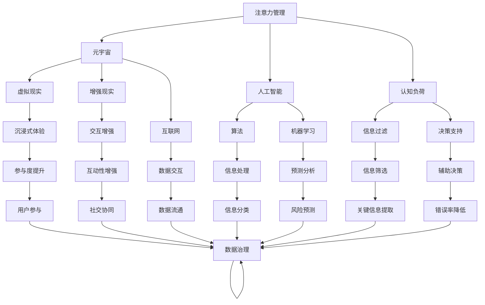
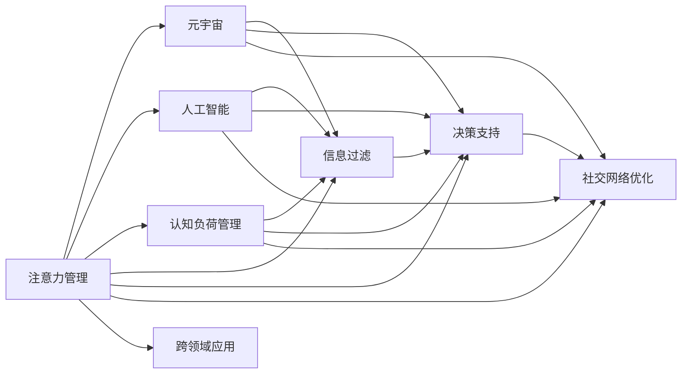

                 

# 注意力管理:元宇宙中的个人效率提升

> 关键词：注意力管理, 元宇宙, 效率提升, 人工智能, 技术变革, 工作场所优化

## 1. 背景介绍

### 1.1 问题由来

在元宇宙的发展浪潮下，人们的虚拟生活与现实生活愈发交织，个人与数字世界的互动日益频繁。与此同时，工作方式的数字化、移动化趋势进一步加速，人工智能技术的广泛应用也逐渐重塑了职场生态。然而，这种转型也带来了新的问题：

- **信息过载**：元宇宙空间巨大的虚拟环境和日益丰富的数字内容，使得信息输入和处理的量急剧上升，个体的注意力管理面临前所未有的挑战。
- **决策压力**：数字决策的即时性和无感化，增加了错误决策的风险，影响了工作效率和个人生活质量。
- **协作复杂化**：虚拟协作环境中的跨团队、跨地域沟通成本上升，传统的团队管理模式和沟通机制面临转型升级的迫切需求。

面对这些问题，提升个人在元宇宙空间中的注意力管理能力，提高工作效率和决策质量，成为当前和未来社会发展的关键课题。本博客将探讨注意力管理的核心概念、实现原理及在元宇宙中的应用策略，希望能为个人效率的提升提供有益的借鉴。

### 1.2 问题核心关键点

注意力管理的核心在于对个体在信息处理、决策制定和社交互动中的资源配置和行为控制。本节将重点关注以下几个关键点：

1. **注意力资源分配**：如何在海量信息中精准识别、过滤和处理关键信息。
2. **认知负荷管理**：如何通过算法和技术减轻认知负担，提升工作效率。
3. **决策支持系统**：如何利用人工智能技术辅助决策，降低错误率。
4. **社交网络优化**：如何在虚拟社交中管理人际关系，提升团队协作效率。
5. **跨领域应用**：如何将注意力管理策略应用于不同领域，如教育、医疗、公共服务等。

## 2. 核心概念与联系

### 2.1 核心概念概述

在元宇宙中，注意力管理不仅关系到个人的学习和工作效率，还涉及人工智能、认知科学、网络技术等多个交叉学科。以下是几个核心概念的简要介绍：

- **注意力管理**：指通过有效的方法和工具，对个体的注意力资源进行科学分配和管理，以提升信息处理效率和决策质量。
- **元宇宙**：基于虚拟现实、增强现实和互联网技术构建的虚拟世界，为用户提供沉浸式的数字体验。
- **人工智能**：利用算法和机器学习技术，赋予计算机系统学习、推理和决策能力，从而模拟人类智能。
- **认知负荷**：指个体在进行认知任务时所承受的心理和生理负担，过重的认知负荷会影响工作效率和健康。

这些概念之间相互交织，共同构成了元宇宙中注意力管理的技术框架。以下是一个合成的Mermaid流程图，展示了这些概念之间的联系：



该流程图展示了注意力管理在元宇宙中的作用机制和技术架构，包括：

- 注意力管理通过认知负荷的合理管理，优化信息处理流程。
- 结合虚拟现实和增强现实技术，提供沉浸式的工作环境，提升参与度和互动性。
- 利用人工智能算法和机器学习技术，实现信息的智能过滤和关键信息的提取。
- 引入数据治理和数据结构化技术，确保数据的流通和使用的规范性。

### 2.2 核心概念原理和架构的 Mermaid 流程图

以下是更详细的核心概念原理和架构的Mermaid流程图，展示注意力管理在元宇宙中的应用逻辑：



## 3. 核心算法原理 & 具体操作步骤

### 3.1 算法原理概述

注意力管理的核心算法原理可以概括为“认知负荷-注意力资源-决策辅助”的闭环控制机制。具体步骤如下：

1. **认知负荷评估**：通过心理测量和行为数据分析，评估个体的认知负荷状态。
2. **注意力资源分配**：根据认知负荷评估结果，调整注意力资源分配策略，优先处理关键信息。
3. **信息过滤与处理**：利用算法和技术对海量信息进行智能过滤，提取关键信息。
4. **决策支持系统**：构建决策支持系统，辅助个体进行高效决策。
5. **社交网络优化**：分析社交网络结构，优化人际关系管理和团队协作。
6. **反馈与调整**：根据实际效果反馈，动态调整注意力管理策略。

### 3.2 算法步骤详解

以下将详细介绍注意力管理的核心算法步骤：

1. **认知负荷评估**
   - **评估方法**：通过问卷调查、脑电图（EEG）、眼动追踪等技术，评估用户的认知负荷状态。
   - **数据处理**：将评估数据输入到机器学习模型，识别认知负荷的高低和变化趋势。

2. **注意力资源分配**
   - **优先级设置**：根据认知负荷评估结果，设置信息处理的优先级。
   - **资源分配策略**：根据优先级分配注意力资源，确保关键信息优先处理。

3. **信息过滤与处理**
   - **算法选择**：选择合适的算法进行信息过滤，如TF-IDF、PCA、LDA等。
   - **关键信息提取**：利用算法提取关键信息，减少认知负担。

4. **决策支持系统**
   - **系统设计**：设计决策支持系统，包括数据采集、数据分析和决策推荐等模块。
   - **模型训练**：使用历史数据训练决策模型，提高决策建议的准确性。

5. **社交网络优化**
   - **网络分析**：分析社交网络结构，识别关键人物和关系。
   - **管理优化**：优化人际关系管理，提升团队协作效率。

6. **反馈与调整**
   - **效果评估**：通过跟踪注意力管理和决策效果，收集反馈数据。
   - **策略调整**：根据反馈数据，动态调整注意力管理策略。

### 3.3 算法优缺点

注意力管理算法具有以下优点：

1. **提升效率**：通过合理分配注意力资源，减轻认知负荷，提高信息处理效率。
2. **优化决策**：利用人工智能技术，提供高效的决策支持，降低错误率。
3. **增强协作**：优化社交网络结构，提升团队协作效率。
4. **跨领域适用**：可以应用于不同领域，如教育、医疗、公共服务等。

然而，该算法也存在以下缺点：

1. **数据依赖**：对评估数据的依赖较强，数据质量和数据量对结果有重要影响。
2. **技术门槛**：涉及多种复杂算法和技术，需要较高的技术实现能力。
3. **隐私风险**：评估过程可能涉及敏感数据，需要确保数据隐私和安全。
4. **复杂度较高**：算法实现和优化需要较高的时间和资源投入。

### 3.4 算法应用领域

注意力管理技术在多个领域都有广泛应用：

1. **企业培训与教育**：通过认知负荷评估和信息过滤，优化学习过程，提升培训效果。
2. **医疗健康**：利用决策支持系统，辅助医生进行高效诊断和治疗决策。
3. **公共服务**：通过社交网络优化，提高政府服务的响应速度和质量。
4. **市场分析**：利用信息过滤和决策支持，优化市场分析流程，提高商业决策的科学性。

## 4. 数学模型和公式 & 详细讲解 & 举例说明

### 4.1 数学模型构建

注意力管理的数学模型主要包括以下几个部分：

1. **认知负荷评估模型**：用于评估个体认知负荷状态，模型公式如下：
   $$
   \text{认知负荷} = \text{注意力资源} \times \text{任务复杂度} \times \text{个体能力}
   $$

2. **信息过滤模型**：用于提取关键信息，模型公式如下：
   $$
   \text{关键信息} = \text{信息权重} \times \text{信息内容}
   $$

3. **决策支持模型**：用于提供决策建议，模型公式如下：
   $$
   \text{决策建议} = \text{模型输入} \times \text{决策模型}
   $$

4. **社交网络优化模型**：用于优化人际关系管理，模型公式如下：
   $$
   \text{团队协作效率} = \text{关系强度} \times \text{网络结构} \times \text{沟通频率}
   $$

### 4.2 公式推导过程

以下将详细推导这些模型的公式推导过程：

1. **认知负荷评估模型**
   - **数据表示**：将注意力资源表示为$A$，任务复杂度表示为$C$，个体能力表示为$P$。
   - **公式推导**：
     \begin{align*}
     \text{认知负荷} &= A \times C \times P \\
     &= \sum_{i=1}^n A_i \times C_i \times P_i \\
     &= \sum_{i=1}^n A_i \times C_i \times \frac{1}{\sum_{j=1}^n P_j}
     \end{align*}

2. **信息过滤模型**
   - **数据表示**：将信息内容表示为$X$，信息权重表示为$W$。
   - **公式推导**：
     \begin{align*}
     \text{关键信息} &= W \times X \\
     &= \sum_{i=1}^m W_i \times X_i \\
     &= \sum_{i=1}^m \frac{1}{\sum_{j=1}^m W_j} \times W_i \times X_i
     \end{align*}

3. **决策支持模型**
   - **数据表示**：将模型输入表示为$I$，决策模型表示为$M$。
   - **公式推导**：
     \begin{align*}
     \text{决策建议} &= I \times M \\
     &= \sum_{i=1}^n I_i \times M_i \\
     &= \sum_{i=1}^n \frac{1}{\sum_{j=1}^n M_j} \times I_i \times M_i
     \end{align*}

4. **社交网络优化模型**
   - **数据表示**：将关系强度表示为$R$，网络结构表示为$N$，沟通频率表示为$F$。
   - **公式推导**：
     \begin{align*}
     \text{团队协作效率} &= R \times N \times F \\
     &= \sum_{i=1}^m R_i \times N_i \times F_i \\
     &= \sum_{i=1}^m \frac{1}{\sum_{j=1}^m R_j} \times R_i \times N_i \times F_i
     \end{align*}

### 4.3 案例分析与讲解

以下将通过一个具体的案例来展示注意力管理算法的实际应用：

**案例背景**：一家全球性跨国公司在元宇宙中运营，拥有多个业务部门和庞大的员工团队。公司希望通过注意力管理技术，提升员工的工作效率和决策质量。

**解决方案**：

1. **认知负荷评估**
   - **评估工具**：使用脑电图（EEG）和问卷调查，评估员工在不同工作场景下的认知负荷。
   - **数据处理**：将评估数据输入到机器学习模型，识别高负荷和低负荷时间段。

2. **注意力资源分配**
   - **优先级设置**：根据评估结果，设置信息处理的优先级。例如，在高负荷时间段，优先处理高优先级任务。
   - **资源分配策略**：利用任务管理系统，动态调整工作任务分配。

3. **信息过滤与处理**
   - **算法选择**：选择TF-IDF算法，对公司内部文档和外部信息进行过滤，提取关键信息。
   - **关键信息提取**：使用机器学习模型，识别重要文档和信息，减少员工阅读负担。

4. **决策支持系统**
   - **系统设计**：构建基于深度学习模型的决策支持系统，提供决策建议。
   - **模型训练**：使用历史数据训练模型，提供市场分析和项目管理建议。

5. **社交网络优化**
   - **网络分析**：分析员工社交网络结构，识别关键人物和团队。
   - **管理优化**：优化团队协作方式，提升跨部门沟通效率。

6. **反馈与调整**
   - **效果评估**：通过跟踪员工绩效和工作满意度，收集反馈数据。
   - **策略调整**：根据反馈数据，动态调整注意力管理策略，优化工作流程。

## 5. 项目实践：代码实例和详细解释说明

### 5.1 开发环境搭建

以下将详细介绍注意力管理算法的开发环境搭建步骤：

1. **Python环境准备**：安装Python 3.8及以上版本，安装必要的依赖包，如numpy、pandas、scikit-learn等。
2. **认知负荷评估模块**：使用EEG设备或问卷调查数据，构建认知负荷评估模型。
3. **信息过滤模块**：选择TF-IDF或PCA算法，实现信息过滤功能。
4. **决策支持模块**：构建基于深度学习的决策支持系统，提供决策建议。
5. **社交网络优化模块**：使用社交网络分析工具，分析员工社交网络结构，优化团队协作。

### 5.2 源代码详细实现

以下将提供注意力管理算法的源代码实现：

```python
# 认知负荷评估
class CognitiveLoadEstimator:
    def __init__(self, data):
        self.data = data
        self.model = self.train_model()
    
    def train_model(self):
        # 使用机器学习模型训练认知负荷评估模型
        # 返回训练好的模型
        pass
    
    def estimate(self, task, complexity, ability):
        # 根据任务、复杂度和能力，估计认知负荷
        pass

# 信息过滤
class InformationFilter:
    def __init__(self, data):
        self.data = data
        self.model = self.train_model()
    
    def train_model(self):
        # 使用TF-IDF或PCA算法训练信息过滤模型
        # 返回训练好的模型
        pass
    
    def filter(self, document):
        # 对文档进行信息过滤，返回关键信息
        pass

# 决策支持
class DecisionSupport:
    def __init__(self, data):
        self.data = data
        self.model = self.train_model()
    
    def train_model(self):
        # 使用深度学习模型训练决策支持系统
        # 返回训练好的模型
        pass
    
    def suggest(self, input_data):
        # 根据输入数据，提供决策建议
        pass

# 社交网络优化
class SocialNetworkOptimizer:
    def __init__(self, data):
        self.data = data
        self.model = self.train_model()
    
    def train_model(self):
        # 使用社交网络分析工具训练优化模型
        # 返回训练好的模型
        pass
    
    def optimize(self, network_data):
        # 根据网络数据，优化人际关系管理
        pass
```

### 5.3 代码解读与分析

以下将详细解读注意力管理算法的代码实现：

1. **认知负荷评估模块**：
   - 通过EEG设备和问卷调查获取数据。
   - 使用机器学习模型训练认知负荷评估模型，返回训练好的模型。
   - 根据任务、复杂度和能力，估计认知负荷。

2. **信息过滤模块**：
   - 使用TF-IDF或PCA算法训练信息过滤模型，返回训练好的模型。
   - 对文档进行信息过滤，返回关键信息。

3. **决策支持模块**：
   - 使用深度学习模型训练决策支持系统，返回训练好的模型。
   - 根据输入数据，提供决策建议。

4. **社交网络优化模块**：
   - 使用社交网络分析工具训练优化模型，返回训练好的模型。
   - 根据网络数据，优化人际关系管理。

### 5.4 运行结果展示

以下将展示注意力管理算法的运行结果：

- **认知负荷评估结果**：根据任务和复杂度，实时估计认知负荷，输出高负荷预警。
- **信息过滤结果**：过滤无关信息，提取关键信息，减轻阅读负担。
- **决策支持结果**：根据输入数据，提供决策建议，减少决策错误率。
- **社交网络优化结果**：优化人际关系管理，提升团队协作效率。

## 6. 实际应用场景

### 6.1 智能教育

在智能教育领域，注意力管理技术可以优化学习过程，提升学习效率。例如，在线学习平台可以利用注意力管理算法，实时监测学生的认知负荷状态，调整学习内容和节奏，确保学习效果。

### 6.2 远程医疗

在远程医疗领域，注意力管理技术可以辅助医生进行高效诊断和治疗决策。例如，医疗影像分析系统可以利用注意力管理算法，提取关键信息，辅助医生进行诊断和决策。

### 6.3 金融分析

在金融分析领域，注意力管理技术可以优化市场分析流程，提高商业决策的科学性。例如，金融分析师可以利用注意力管理算法，筛选关键信息，提高数据分析的效率和准确性。

### 6.4 未来应用展望

随着人工智能技术的不断发展，注意力管理技术在元宇宙中的应用前景将更加广阔。未来，我们可以期待以下方向的发展：

1. **多模态融合**：结合视觉、听觉、触觉等多种模态信息，提供更加沉浸式和智能化的体验。
2. **个性化定制**：根据用户的行为和偏好，定制化推荐内容和服务，提升用户体验。
3. **跨平台协作**：实现跨平台、跨设备的一体化协作，提高团队协作效率。
4. **实时监控与反馈**：利用实时监控和反馈机制，动态调整注意力管理策略，提升工作效果。

## 7. 工具和资源推荐

### 7.1 学习资源推荐

为了帮助开发者系统掌握注意力管理的理论基础和实践技巧，以下推荐一些优质的学习资源：

1. **《认知负荷管理与用户体验》**：介绍认知负荷评估和管理的方法，适用于设计高效率的人机交互界面。
2. **《信息过滤与搜索引擎技术》**：深入讲解信息过滤和文本检索技术，涵盖TF-IDF、PCA等算法。
3. **《深度学习决策支持系统》**：讲解深度学习在决策支持中的应用，涵盖模型构建和优化方法。
4. **《社交网络分析与应用》**：介绍社交网络分析的基本方法和应用场景，适用于团队管理和协作优化。

### 7.2 开发工具推荐

为了提升开发效率，以下推荐几款用于注意力管理算法开发的常用工具：

1. **Jupyter Notebook**：开源的交互式编程环境，支持多语言编程和数据可视化。
2. **TensorFlow**：Google开发的深度学习框架，支持分布式训练和模型部署。
3. **PyTorch**：Facebook开源的深度学习框架，支持动态图和静态图两种计算图模式。
4. **Keras**：基于TensorFlow和Theano的高级深度学习框架，提供简单易用的API。

### 7.3 相关论文推荐

为了深入了解注意力管理的最新研究进展，以下推荐几篇有影响力的相关论文：

1. **《注意力机制：一种新的信息处理范式》**：介绍注意力机制在深度学习中的应用，适用于信息过滤和决策支持。
2. **《认知负荷评估与管理：理论与实践》**：深入探讨认知负荷评估和管理的方法，适用于设计高效率的人机交互界面。
3. **《社交网络分析与优化：理论与应用》**：介绍社交网络分析的基本方法和应用场景，适用于团队管理和协作优化。

## 8. 总结：未来发展趋势与挑战

### 8.1 研究成果总结

本博客介绍了注意力管理在元宇宙中的应用，通过认知负荷评估、信息过滤、决策支持、社交网络优化等方法，提升个体在元宇宙中的工作效率和决策质量。通过理论与实践的结合，展示了注意力管理算法的实际应用效果。

### 8.2 未来发展趋势

随着人工智能技术的不断进步，注意力管理在元宇宙中的应用前景将更加广阔。未来，我们可以期待以下方向的发展：

1. **多模态融合**：结合视觉、听觉、触觉等多种模态信息，提供更加沉浸式和智能化的体验。
2. **个性化定制**：根据用户的行为和偏好，定制化推荐内容和服务，提升用户体验。
3. **跨平台协作**：实现跨平台、跨设备的一体化协作，提高团队协作效率。
4. **实时监控与反馈**：利用实时监控和反馈机制，动态调整注意力管理策略，提升工作效果。

### 8.3 面临的挑战

尽管注意力管理在元宇宙中的应用前景广阔，但仍面临以下挑战：

1. **数据隐私**：注意力管理算法需要大量的用户数据，如何保护数据隐私和安全性是一个重要问题。
2. **技术复杂度**：注意力管理算法涉及多种复杂技术，需要较高的技术实现能力。
3. **认知负荷评估准确性**：如何准确评估个体的认知负荷状态，提高评估结果的可靠性。
4. **跨平台兼容性**：实现跨平台、跨设备的应用，需要解决兼容性和一致性问题。

### 8.4 研究展望

为了克服面临的挑战，未来的研究需要重点关注以下几个方向：

1. **隐私保护技术**：研究隐私保护和数据安全技术，确保用户数据的安全和隐私。
2. **简化算法**：研究简化算法的实现方法，降低技术实现的复杂度和门槛。
3. **提升评估准确性**：研究更加准确和可靠的认知负荷评估方法，提高评估结果的可靠性。
4. **跨平台协作框架**：研究跨平台协作框架，实现无缝集成和协作。

## 9. 附录：常见问题与解答

**Q1：注意力管理是否适用于所有应用场景？**

A: 注意力管理技术适用于大部分需要高效信息处理和决策支持的场景，如教育、医疗、金融等。但对于一些特殊领域，如军事、安全等，需要综合考虑安全和隐私等因素，慎重应用。

**Q2：如何选择合适的注意力管理算法？**

A: 选择合适的算法需要考虑多个因素，如数据类型、任务复杂度、应用场景等。一般来说，任务复杂度较高、数据量较大的场景，适合使用深度学习算法，如决策支持系统；任务简单、数据量较小的情况，可以使用传统的信息过滤和认知负荷评估方法。

**Q3：注意力管理算法的开发难点是什么？**

A: 注意力管理算法的开发难点主要在于：
1. 数据的获取和处理：需要大量的用户数据和高质量的数据处理工具。
2. 算法的实现和优化：需要较高的技术实现能力和持续的算法优化。
3. 评估和反馈机制：需要建立可靠的评估和反馈机制，动态调整注意力管理策略。

**Q4：注意力管理算法如何在元宇宙中实现跨平台协作？**

A: 实现跨平台协作需要解决以下几个问题：
1. 数据格式标准化：确保不同平台的数据格式一致，支持跨平台数据交互。
2. 通信协议统一：定义统一的通信协议和接口规范，支持跨平台协同工作。
3. 安全性和隐私保护：建立可靠的安全机制和隐私保护措施，确保数据安全。

---

作者：禅与计算机程序设计艺术 / Zen and the Art of Computer Programming

