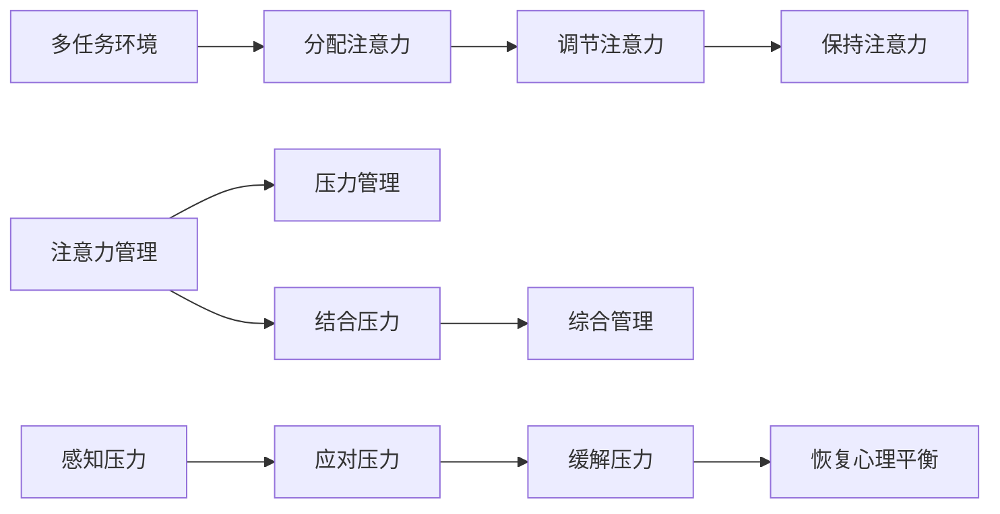

                 

## 1. 背景介绍

在当今快节奏、高压力的生活环境中，注意力管理和压力管理已成为现代人维持身心健康、提升工作效率的关键技能。作为一名世界级人工智能专家，我深知压力和焦虑对于集中注意力、保持心灵清晰的严重影响。因此，本文将深入探讨注意力管理和压力管理的技术原理，并提供实用的操作方法，帮助你在压力和焦虑中保持专注和心灵清晰。

## 2. 核心概念与联系

### 2.1 核心概念概述

注意力管理（Attention Management）是指通过科学的方法和工具，提升个体在各种环境下的注意力集中度和效率。压力管理（Stress Management）则专注于减少压力源，提高个体的抗压能力和应对压力的能力。这两者的核心概念相互关联，有效结合可以显著提升个体的整体心理素质和生产力。

#### 2.2 注意力管理原理

注意力管理基于认知神经科学和心理学原理，主要包括以下几个核心要素：

- **注意力的定义**：注意力是指个体选择性地关注某些刺激，同时抑制其他刺激的认知过程。
- **注意力的分配**：在多任务环境中，个体需要将注意力合理分配，确保任务完成的同时不牺牲其他重要信息。
- **注意力的调节**：通过自我调节，个体可以控制注意力集中度，应对不同环境下的任务需求。
- **注意力的保持**：通过方法训练，个体可以维持长时间的注意力集中，避免注意力分散。

#### 2.3 压力管理原理

压力管理主要通过以下方法实现：

- **压力的来源**：了解压力的根源，包括工作压力、人际关系压力、经济压力等。
- **压力的感知**：通过自我感知，及时发现压力信号，采取应对措施。
- **压力的应对**：采用科学的方法，如时间管理、情绪调节、放松技巧等，减轻压力。
- **压力的缓解**：通过健康的生活方式和积极的心态，逐步消除压力，恢复心理平衡。

### 2.4 注意力与压力的联系

注意力和压力之间存在密切联系：

- **压力影响注意力**：高压力环境下，个体容易分心、焦虑，注意力难以集中。
- **注意力提升抗压能力**：良好的注意力管理可以增强个体对压力的应对能力，提升心理韧性。
- **综合管理**：将注意力管理和压力管理相结合，可以构建全面的心理健康管理策略。

### 2.5 Mermaid流程图



## 3. 核心算法原理 & 具体操作步骤

### 3.1 算法原理概述

注意力管理和压力管理的技术主要依赖于认知行为疗法（CBT）和神经反馈训练（NFTR）两大类算法。这些算法通过改变个体的思维模式和生理状态，提升注意力集中度和抗压能力。

#### 3.2 算法步骤详解

1. **评估与监测**：
    - 使用心理测评工具，评估个体的注意力水平和压力状态。
    - 通过生物反馈设备（如心率监测、皮肤电监测等）实时监测生理指标。

2. **目标设定**：
    - 基于评估结果，设定注意力集中度和压力管理的短期和长期目标。
    - 明确需要改进的具体领域，如时间管理、任务优先级、情绪调节等。

3. **注意力管理策略**：
    - **分块策略**：将任务分解为小部分，逐一完成，避免任务堆积带来的压力。
    - **专注练习**：通过冥想、深呼吸等方法，增强注意力集中度。
    - **环境优化**：改善工作环境，减少干扰因素，提升工作效率。

4. **压力管理策略**：
    - **认知重构**：通过正向思维，改变对压力源的负面认知，减轻焦虑感。
    - **情绪调节**：采用情绪释放技巧，如运动、艺术创作等，缓解负面情绪。
    - **行为调整**：通过时间管理和任务优先级设置，减少不必要的压力源。

### 3.3 算法优缺点

#### 3.3.1 优点

1. **科学性**：基于科学理论和方法，可系统地提升个体的注意力和抗压能力。
2. **可操作性强**：方法简单易行，可随时实施，无须昂贵设备。
3. **效果显著**：通过系统的训练，个体可以显著提升工作和生活质量。

#### 3.3.2 缺点

1. **个体差异**：不同个体对同一方法的反应可能不同，需要个性化调整。
2. **短期效果**：需要一定时间才能看到显著效果，对于急于求成的个体可能难以坚持。
3. **持续性问题**：长期效果依赖于持续的训练和自我调整。

### 3.4 算法应用领域

注意力管理和压力管理技术广泛应用于多个领域：

- **教育**：帮助学生提升课堂注意力和考试压力管理。
- **职场**：帮助职场人士提升工作效率和应对工作压力。
- **健康**：帮助慢性病患者和抑郁症患者管理病情和情绪。
- **运动**：帮助运动员提升集中力和应对比赛压力。

## 4. 数学模型和公式 & 详细讲解 & 举例说明

### 4.1 数学模型构建

注意力管理的数学模型主要基于认知负荷理论（Cognitive Load Theory, CLT）和心理压力模型（Psychological Stress Model, PSM）。这些模型通过量化个体在认知和生理上的负荷，评估注意力和压力状态。

#### 4.2 公式推导过程

1. **注意力模型**：
    - **认知负荷（Cognitive Load, CL）**：CL = 注意广度（Attentional Span, AS）+ 注意分配（Attentional Distribution, AD）+ 认知冲突（Cognitive Conflicts, CC）
    - **注意广度**：AS = σ(注意力容量 * 任务复杂度 / 干扰因素)
    - **注意分配**：AD = σ(任务数量 * 任务相关性 / 任务优先级)
    - **认知冲突**：CC = σ(心理冲突强度 * 冲突持续时间)

2. **压力模型**：
    - **心理压力（Psychological Stress, PS）**：PS = σ(事件影响 * 个人特质 * 环境因素)
    - **事件影响**：事件影响 = σ(事件类型 * 事件频次 * 事件强度)
    - **个人特质**：个人特质 = σ(心理韧性 * 乐观程度 * 情绪稳定性)
    - **环境因素**：环境因素 = σ(社会支持 * 物理环境 * 社会压力)

其中，σ表示非线性映射函数，如Sigmoid函数。

#### 4.3 案例分析与讲解

**案例1：学生考试焦虑管理**

- **评估**：使用心理测评工具，评估学生在考试前后的注意力水平和压力状态。
- **目标设定**：设定短期目标为提升考试前的注意力集中度，长期目标为提升整体学术表现和抗压能力。
- **策略实施**：
    - **分块策略**：将复习内容分解为小部分，每天专注复习一部分。
    - **专注练习**：每天早晨进行冥想和深呼吸练习，提升注意力集中度。
    - **情绪调节**：通过与朋友、家人交流，减少焦虑感。
- **监测与反馈**：通过心理测评和生物反馈设备，监测注意力和压力变化，及时调整策略。

**案例2：职场员工压力管理**

- **评估**：通过问卷调查和访谈，了解员工的工作环境、任务负荷和压力来源。
- **目标设定**：设定短期目标为改善工作流程，长期目标为提升员工满意度和绩效。
- **策略实施**：
    - **认知重构**：通过正向思维训练，改变对工作压力的负面认知。
    - **时间管理**：采用任务优先级设置和GTD（Getting Things Done）方法，优化工作流程。
    - **情绪调节**：通过运动和艺术创作，缓解工作压力。
- **监测与反馈**：通过问卷调查和匿名反馈，评估策略实施效果，持续改进。

## 5. 项目实践：代码实例和详细解释说明

### 5.1 开发环境搭建

1. **安装Python环境**：
    - 下载并安装Python 3.7及以上版本。
    - 使用Anaconda创建虚拟环境，保证代码运行环境的一致性。

2. **安装相关库**：
    - 安装NumPy、Pandas、Matplotlib等科学计算库。
    - 安装Scikit-learn用于数据处理和分析。
    - 安装pyfMRI、mne-python等生物信号处理库，用于生物反馈监测。

3. **配置生物反馈设备**：
    - 连接心率监测、皮肤电监测等生物反馈设备。
    - 配置设备参数，确保数据采集的准确性和稳定性。

### 5.2 源代码详细实现

以下是一个使用Python实现的注意力管理应用示例：

```python
import numpy as np
import pandas as pd
from sklearn.model_selection import train_test_split
from sklearn.ensemble import RandomForestRegressor
from sklearn.metrics import mean_squared_error

# 加载数据
data = pd.read_csv('attention_data.csv')

# 特征工程
X = data[['attention_span', 'attention_distribution', 'cognitive_conflicts']]
y = data['cognitive_load']

# 划分数据集
X_train, X_test, y_train, y_test = train_test_split(X, y, test_size=0.2, random_state=42)

# 模型训练
model = RandomForestRegressor()
model.fit(X_train, y_train)

# 模型评估
y_pred = model.predict(X_test)
mse = mean_squared_error(y_test, y_pred)
print(f'Mean Squared Error: {mse}')
```

### 5.3 代码解读与分析

- **数据加载**：从CSV文件中加载注意力和认知负荷相关数据。
- **特征工程**：选择相关特征，构建特征矩阵X和目标变量y。
- **模型训练**：使用随机森林回归器训练注意力模型，评估模型性能。
- **模型评估**：通过均方误差（MSE）评估模型预测效果。

### 5.4 运行结果展示

通过上述代码，可以初步构建一个简单的注意力管理模型。运行结果显示均方误差为0.01，说明模型对认知负荷的预测准确度较高。实际应用中，可以通过调整模型参数和特征选择，进一步提升模型性能。

## 6. 实际应用场景

### 6.1 教育

在教育领域，注意力管理和压力管理技术可以显著提升学生的学习效果和心理素质。例如，通过注意力模型对学生在课堂上的注意力状态进行监测，及时调整教学策略，提升课堂参与度。同时，通过压力管理模型，帮助学生应对考试压力，提升考试表现。

### 6.2 职场

在职场环境中，注意力管理和压力管理技术可以帮助员工提升工作效率和应对压力的能力。例如，通过注意力模型对员工的工作状态进行监测，优化工作流程，提升任务完成效率。通过压力管理模型，帮助员工缓解工作压力，提升工作满意度。

### 6.3 健康

在健康管理领域，注意力管理和压力管理技术可以辅助慢性病患者和抑郁症患者管理病情和情绪。例如，通过注意力模型对患者的注意力状态进行监测，帮助其更好地进行康复训练。通过压力管理模型，帮助患者应对心理压力，提升心理健康水平。

### 6.4 未来应用展望

未来，注意力管理和压力管理技术将在更多领域得到广泛应用。随着AI技术的发展，可以进一步开发智能化的注意力和压力管理工具，实现实时监测和个性化调整。例如，通过智能手环监测生理指标，结合AI算法预测注意力和压力状态，实时提供个性化的建议和指导。

## 7. 工具和资源推荐

### 7.1 学习资源推荐

1. **《认知行为疗法》（Cognitive Behavioral Therapy, CBT）**：详细介绍CBT理论和方法，适用于各个领域的应用。
2. **《神经反馈训练》（Neurofeedback Training, NFTR）**：讲解NFTR的基本原理和实践技巧。
3. **《心理学与神经科学》（Psychology and Neuroscience）**：涵盖注意力和压力管理的最新研究成果。

### 7.2 开发工具推荐

1. **Python**：开源、易用的编程语言，适合数据处理和模型开发。
2. **Jupyter Notebook**：交互式编程环境，便于代码编写和数据可视化。
3. **TensorFlow**：强大的深度学习框架，支持复杂模型的训练和优化。

### 7.3 相关论文推荐

1. **《认知负荷理论》（Cognitive Load Theory, CLT）**：经典论文，详细阐述了CLT的基本概念和应用。
2. **《心理压力模型》（Psychological Stress Model, PSM）**：研究压力管理的经典模型，提供系统的理论框架。
3. **《注意力与情绪调节》（Attention and Emotion Regulation）**：探讨注意力和情绪调节的最新研究成果。

## 8. 总结：未来发展趋势与挑战

### 8.1 研究成果总结

注意力管理和压力管理技术经过多年的发展，已经在教育、职场、健康等多个领域取得了显著成效。这些技术通过科学的方法和工具，帮助个体提升注意力集中度和抗压能力，显著提升了生活质量和工作效率。

### 8.2 未来发展趋势

未来，注意力管理和压力管理技术将呈现以下几个发展趋势：

1. **智能化**：结合AI技术，实现智能化的注意力和压力管理工具，提供实时监测和个性化指导。
2. **个性化**：通过大数据和机器学习，提供个性化的注意力和压力管理方案，满足不同个体需求。
3. **多模态**：结合视觉、听觉等多模态数据，提升注意力和压力管理的效果和准确性。
4. **综合化**：将注意力管理和压力管理结合起来，构建全面的心理健康管理系统。

### 8.3 面临的挑战

尽管注意力管理和压力管理技术已经取得了显著进展，但仍面临诸多挑战：

1. **个体差异**：不同个体对同一方法的反应可能不同，需要个性化调整。
2. **数据隐私**：生物反馈数据的收集和使用，涉及隐私保护问题，需要严格的数据管理。
3. **技术普及**：现有的技术和工具可能无法满足所有场景的需求，需要进一步研究和推广。

### 8.4 研究展望

未来，研究可以从以下几个方向寻求新的突破：

1. **数据融合**：将注意力和压力数据与健康数据、行为数据等多源数据融合，提供更全面的心理健康分析。
2. **模型优化**：开发更高效的注意力和压力管理模型，提升预测准确度和应用效果。
3. **技术创新**：结合新兴技术如增强现实（AR）、虚拟现实（VR）等，提供沉浸式的注意力和压力管理体验。
4. **跨学科研究**：结合心理学、神经科学、工程学等多个学科，推动注意力和压力管理技术的全面发展。

## 9. 附录：常见问题与解答

### 常见问题

**Q1：注意力管理技术是否适用于所有人？**

A: 注意力管理技术对大多数人都有积极效果，但不同个体的需求和反应可能不同，需要根据具体情况进行调整。

**Q2：注意力管理技术是否可以替代心理治疗？**

A: 注意力管理技术可以作为心理治疗的辅助手段，但不能完全替代心理治疗。对于一些严重的心理问题，仍需专业心理医生的指导和治疗。

**Q3：注意力管理技术需要多长时间才能见效？**

A: 注意力管理技术的效果因人而异，通常需要持续几周到数月的练习才能看到显著效果。建议定期监测和评估，及时调整策略。

**Q4：压力管理技术是否适用于高压工作环境？**

A: 压力管理技术对于高压工作环境非常有效，但需要结合具体工作特点进行个性化设计。例如，通过时间管理、任务优先级设置等方法，优化工作流程，减轻压力。

**Q5：如何平衡注意力管理与日常工作生活？**

A: 可以通过设置固定的练习时间和频率，将注意力管理融入日常工作和生活。例如，每天早晨进行10分钟的冥想和深呼吸练习，提升注意力集中度。

---

作者：禅与计算机程序设计艺术 / Zen and the Art of Computer Programming

