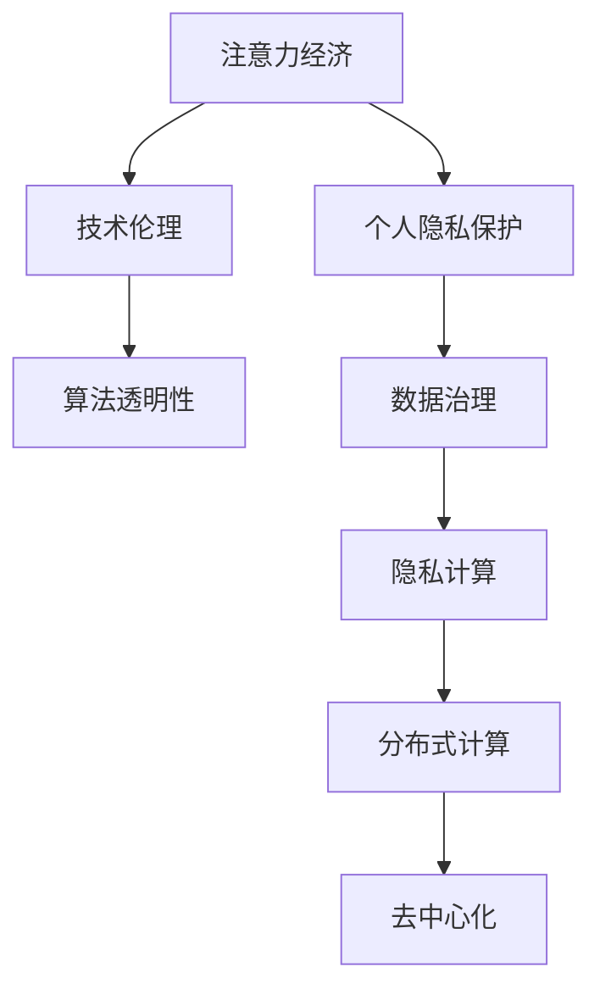

                 

# 注意力经济与个人隐私保护的平衡

> 关键词：注意力经济, 个人隐私保护, 技术伦理, 算法透明性, 数据治理, 隐私计算, 分布式计算, 去中心化

## 1. 背景介绍

随着互联网技术的飞速发展，信息时代向注意力经济时代转型已成为不可逆转的趋势。在注意力经济中，用户的时间、注意力成为最重要的资源。企业通过数据分析，精准定位用户需求，提高资源利用效率，进而实现商业价值的最大化。而在这个过程中，如何平衡用户注意力与隐私保护成为备受关注的问题。

### 1.1 问题由来

#### 1.1.1 用户注意力成为重要资产

随着数字技术的发展，用户在使用互联网服务时，注意力成为企业关注的焦点。例如，社交媒体通过用户关注的内容、点击的次数、停留的时间等信息，分析用户兴趣，推送个性化内容，从而提升用户体验和平台粘性。广告公司通过分析用户在线行为，精准定位投放广告，提高广告效果。

#### 1.1.2 隐私泄露风险增加

在利用用户注意力获取商业价值的同时，也带来了隐私泄露的风险。用户通过使用互联网服务，不可避免地留下大量行为数据，这些数据可能被不法分子利用，进行诈骗、隐私侵害等非法行为。此外，企业和平台在获取用户数据时，如果缺乏严格的监管，也可能侵犯用户隐私，导致信任危机。

## 2. 核心概念与联系

### 2.1 核心概念概述

#### 2.1.1 注意力经济

注意力经济是指在信息过载的时代，企业和平台通过吸引和利用用户的注意力，进行精准营销，提升商业价值的经济模式。在这一模式中，用户的时间、注意力被视为最重要的资源，企业通过数据分析，挖掘用户需求，提供个性化服务，实现商业价值的最大化。

#### 2.1.2 个人隐私保护

个人隐私保护是指在信息时代，对个人数据、行为信息等进行严格保护，防止非法获取和滥用，保障用户隐私权益。个人隐私保护包括数据收集、存储、使用、传输等各个环节，需要制定相关法律法规，建立严格的管理机制和技术手段。

#### 2.1.3 技术伦理

技术伦理是指在技术开发和应用过程中，遵循道德规范和社会价值观，保护用户权益，避免技术滥用。技术伦理涉及技术设计、算法透明性、数据治理等多个方面，是当前技术领域的重要研究方向。

#### 2.1.4 算法透明性

算法透明性是指在算法开发和应用过程中，公开算法的原理、参数、数据源等信息，保障用户对算法的知情权和监督权。算法透明性有助于增强算法的可信度和公平性，避免算法的滥用和歧视。

#### 2.1.5 数据治理

数据治理是指在数据管理过程中，制定相关政策和标准，规范数据的收集、存储、使用、共享等环节，保障数据安全。数据治理需要多方协同参与，建立健全的监管机制和技术手段，确保数据使用的合规性和安全性。

#### 2.1.6 隐私计算

隐私计算是指在数据加密的情况下，进行数据计算和分析，保障数据隐私。隐私计算包括同态加密、差分隐私、联邦学习等多种技术手段，可以有效地保护数据隐私，同时实现数据的有效利用。

#### 2.1.7 分布式计算

分布式计算是指将大规模计算任务分解为多个小任务，通过多台计算机协同完成计算过程。分布式计算可以显著提高计算效率，同时保障数据安全，广泛应用于大数据处理、云计算等领域。

#### 2.1.8 去中心化

去中心化是指在分布式计算中，取消中心化管理，通过区块链等技术，实现数据和计算的自治，保障数据安全和用户隐私。去中心化可以有效避免单点故障，提高系统的可靠性和安全性。

### 2.2 核心概念联系

#### 2.2.1 注意力经济与个人隐私保护的关系

注意力经济和隐私保护是紧密相连的。一方面，企业通过分析用户注意力，进行个性化营销，提升商业价值；另一方面，企业需要保护用户隐私，避免数据滥用，建立用户信任。

#### 2.2.2 技术伦理与算法透明性的关系

技术伦理和算法透明性相辅相成。技术伦理要求算法透明性，保障用户权益，避免算法滥用；算法透明性则提供了技术伦理的保障，增强算法的公平性和可信度。

#### 2.2.3 数据治理与隐私计算的关系

数据治理和隐私计算共同构成了数据安全保障体系。数据治理提供数据使用的规范和标准，隐私计算提供数据保护的技术手段，两者缺一不可。

#### 2.2.4 分布式计算与去中心化的关系

分布式计算和去中心化都是提高数据安全性的有效手段。分布式计算通过多台计算机协同计算，提高计算效率；去中心化通过取消中心化管理，增强数据自治和安全性。

### 2.3 核心概念联系的Mermaid流程图



## 3. 核心算法原理 & 具体操作步骤

### 3.1 算法原理概述

#### 3.1.1 算法原理

注意力经济与隐私保护的平衡涉及多方面的技术手段，包括数据分析、算法透明性、数据治理、隐私计算、分布式计算、去中心化等。以下是几种核心算法原理的概述：

##### 3.1.1.1 数据分析

数据分析是指对用户行为数据进行挖掘和分析，发现用户需求，提供个性化服务。常用的数据分析方法包括聚类、分类、关联规则挖掘等。

##### 3.1.1.2 算法透明性

算法透明性是指公开算法的原理、参数、数据源等信息，保障用户对算法的知情权和监督权。常用的算法透明性方法包括算法公开、代码审计、模型解释等。

##### 3.1.1.3 数据治理

数据治理是指制定数据使用的规范和标准，保障数据安全。常用的数据治理方法包括数据分类、数据权限管理、数据审计等。

##### 3.1.1.4 隐私计算

隐私计算是指在数据加密的情况下，进行数据计算和分析，保障数据隐私。常用的隐私计算方法包括同态加密、差分隐私、联邦学习等。

##### 3.1.1.5 分布式计算

分布式计算是指将大规模计算任务分解为多个小任务，通过多台计算机协同完成计算过程。常用的分布式计算方法包括MapReduce、Spark等。

##### 3.1.1.6 去中心化

去中心化是指通过区块链等技术，取消中心化管理，实现数据和计算的自治。常用的去中心化方法包括区块链、分布式账本等。

### 3.2 算法步骤详解

#### 3.2.1 数据分析步骤

1. **数据收集**：收集用户行为数据，包括浏览记录、搜索记录、购买记录等。
2. **数据清洗**：对收集到的数据进行清洗和预处理，去除无效和重复数据。
3. **数据分析**：对清洗后的数据进行挖掘和分析，发现用户需求，生成个性化推荐列表。

##### 3.2.1.1 数据收集

数据收集是数据分析的第一步，通常通过用户在平台上的操作记录进行数据收集。例如，用户在电商平台上浏览商品时，记录用户的浏览记录、点击记录、购买记录等。

##### 3.2.1.2 数据清洗

数据清洗是指对收集到的数据进行清洗和预处理，去除无效和重复数据。例如，删除用户不存在的浏览记录、删除重复的搜索记录等。

##### 3.2.1.3 数据分析

数据分析是指对清洗后的数据进行挖掘和分析，发现用户需求，生成个性化推荐列表。例如，通过聚类算法，将用户分为不同的兴趣群体，生成个性化的商品推荐列表。

#### 3.2.2 算法透明性步骤

1. **算法公开**：公开算法的原理和参数，提供算法代码和模型解释，保障用户对算法的知情权。
2. **代码审计**：邀请第三方对算法代码进行审计，发现潜在的安全漏洞和算法偏见。
3. **模型解释**：提供算法的模型解释，让用户理解算法的决策过程。

##### 3.2.2.1 算法公开

算法公开是指公开算法的原理和参数，提供算法代码和模型解释，保障用户对算法的知情权。例如，电商平台公开推荐算法的原理和参数，让用户了解推荐依据。

##### 3.2.2.2 代码审计

代码审计是指邀请第三方对算法代码进行审计，发现潜在的安全漏洞和算法偏见。例如，电商平台邀请第三方对推荐算法代码进行审计，发现和修复算法中的偏见和漏洞。

##### 3.2.2.3 模型解释

模型解释是指提供算法的模型解释，让用户理解算法的决策过程。例如，电商平台提供推荐算法的模型解释，让用户了解推荐依据和结果。

#### 3.2.3 数据治理步骤

1. **数据分类**：对数据进行分类，明确数据类型和使用权限。
2. **数据权限管理**：对数据的使用权限进行管理，保障数据安全。
3. **数据审计**：对数据的使用过程进行审计，发现数据滥用和异常使用。

##### 3.2.3.1 数据分类

数据分类是指对数据进行分类，明确数据类型和使用权限。例如，电商平台对用户数据进行分类，明确数据类型和使用权限。

##### 3.2.3.2 数据权限管理

数据权限管理是指对数据的使用权限进行管理，保障数据安全。例如，电商平台对用户数据进行权限管理，保障数据不被滥用。

##### 3.2.3.3 数据审计

数据审计是指对数据的使用过程进行审计，发现数据滥用和异常使用。例如，电商平台对用户数据进行审计，发现和修复数据滥用和异常使用。

#### 3.2.4 隐私计算步骤

1. **数据加密**：对数据进行加密，保障数据隐私。
2. **隐私计算**：在数据加密的情况下，进行数据计算和分析。
3. **结果解密**：对计算结果进行解密，保障数据隐私。

##### 3.2.4.1 数据加密

数据加密是指对数据进行加密，保障数据隐私。例如，电商平台对用户数据进行加密，保障数据隐私。

##### 3.2.4.2 隐私计算

隐私计算是指在数据加密的情况下，进行数据计算和分析。例如，电商平台在数据加密的情况下，进行数据计算和分析。

##### 3.2.4.3 结果解密

结果解密是指对计算结果进行解密，保障数据隐私。例如，电商平台对计算结果进行解密，保障数据隐私。

#### 3.2.5 分布式计算步骤

1. **数据分割**：将大规模数据分割为多个小任务。
2. **分布式计算**：通过多台计算机协同完成计算过程。
3. **结果合并**：对计算结果进行合并，生成最终结果。

##### 3.2.5.1 数据分割

数据分割是指将大规模数据分割为多个小任务。例如，电商平台将大规模数据分割为多个小任务，进行分布式计算。

##### 3.2.5.2 分布式计算

分布式计算是指通过多台计算机协同完成计算过程。例如，电商平台通过多台计算机协同完成计算过程，提高计算效率。

##### 3.2.5.3 结果合并

结果合并是指对计算结果进行合并，生成最终结果。例如，电商平台对计算结果进行合并，生成最终推荐结果。

#### 3.2.6 去中心化步骤

1. **区块链构建**：构建区块链网络，取消中心化管理。
2. **分布式账本**：使用区块链技术，实现数据和计算的自治。
3. **去中心化应用**：在区块链网络上开发去中心化应用，实现去中心化计算。

##### 3.2.6.1 区块链构建

区块链构建是指构建区块链网络，取消中心化管理。例如，电商平台构建区块链网络，取消中心化管理。

##### 3.2.6.2 分布式账本

分布式账本是指使用区块链技术，实现数据和计算的自治。例如，电商平台使用区块链技术，实现数据和计算的自治。

##### 3.2.6.3 去中心化应用

去中心化应用是指在区块链网络上开发去中心化应用，实现去中心化计算。例如，电商平台在区块链网络上开发去中心化应用，实现去中心化计算。

### 3.3 算法优缺点

#### 3.3.1 优点

1. **提升商业价值**：通过数据分析，精准定位用户需求，提高资源利用效率，实现商业价值的最大化。
2. **保障用户隐私**：通过数据加密、隐私计算等技术手段，保障用户隐私权益，避免数据滥用。
3. **增强算法透明性**：通过算法公开、代码审计、模型解释等方法，增强算法的可信度和公平性，避免算法的滥用和歧视。
4. **提高数据安全**：通过数据分类、权限管理、数据审计等方法，提高数据使用的合规性和安全性。
5. **增强计算效率**：通过分布式计算、去中心化等技术手段，提高计算效率，降低计算成本。

#### 3.3.2 缺点

1. **数据质量问题**：数据分析依赖于数据质量，如果数据质量不高，可能导致数据分析结果不准确。
2. **算法偏见问题**：算法透明性、代码审计等方法难以完全避免算法的偏见和漏洞，可能导致不公平的决策。
3. **数据滥用风险**：数据治理、权限管理等方法难以完全避免数据滥用，可能导致数据滥用和隐私泄露。
4. **计算资源问题**：分布式计算、去中心化等技术手段需要大量的计算资源，可能增加计算成本。
5. **技术实现难度**：技术伦理、数据治理、隐私计算等技术手段实现难度较大，需要多方协同参与。

### 3.4 算法应用领域

#### 3.4.1 电商推荐

电商平台的推荐系统通过数据分析，精准定位用户需求，提供个性化商品推荐，提升用户体验和平台粘性。例如，亚马逊通过数据分析，提供个性化商品推荐，提升销售效果。

#### 3.4.2 社交媒体个性化推送

社交媒体平台通过数据分析，精准推送个性化内容，提升用户体验和平台粘性。例如，Facebook通过数据分析，推送个性化内容，提升用户互动率。

#### 3.4.3 广告精准投放

广告公司通过数据分析，精准定位投放广告，提高广告效果。例如，Google通过数据分析，精准投放广告，提高广告点击率。

#### 3.4.4 医疗数据分析

医疗机构通过数据分析，发现疾病规律，提高医疗水平。例如，IBM Watson通过数据分析，发现癌症规律，提高癌症治疗效果。

#### 3.4.5 金融风险控制

金融公司通过数据分析，发现金融风险，进行风险控制。例如，高盛通过数据分析，发现金融风险，进行风险控制。

#### 3.4.6 智慧城市

智慧城市通过数据分析，精准定位城市问题，提高城市治理水平。例如，智慧城市通过数据分析，精准定位交通拥堵问题，提高交通管理水平。

## 4. 数学模型和公式 & 详细讲解 & 举例说明

### 4.1 数学模型构建

#### 4.1.1 数学模型

注意力经济与隐私保护的平衡涉及多方面的技术手段，包括数据分析、算法透明性、数据治理、隐私计算、分布式计算、去中心化等。以下是几种核心数学模型的构建：

##### 4.1.1.1 数据分析模型

数据分析模型用于对用户行为数据进行挖掘和分析，发现用户需求，生成个性化服务。常用的数据分析模型包括聚类模型、分类模型、关联规则模型等。

##### 4.1.1.2 算法透明性模型

算法透明性模型用于公开算法的原理和参数，保障用户对算法的知情权和监督权。常用的算法透明性模型包括算法公开模型、代码审计模型、模型解释模型等。

##### 4.1.1.3 数据治理模型

数据治理模型用于制定数据使用的规范和标准，保障数据安全。常用的数据治理模型包括数据分类模型、数据权限管理模型、数据审计模型等。

##### 4.1.1.4 隐私计算模型

隐私计算模型用于在数据加密的情况下，进行数据计算和分析，保障数据隐私。常用的隐私计算模型包括同态加密模型、差分隐私模型、联邦学习模型等。

##### 4.1.1.5 分布式计算模型

分布式计算模型用于将大规模计算任务分解为多个小任务，通过多台计算机协同完成计算过程。常用的分布式计算模型包括MapReduce模型、Spark模型等。

##### 4.1.1.6 去中心化模型

去中心化模型用于通过区块链等技术，取消中心化管理，实现数据和计算的自治。常用的去中心化模型包括区块链模型、分布式账本模型等。

### 4.2 公式推导过程

#### 4.2.1 数据分析公式推导

数据分析公式推导用于对用户行为数据进行挖掘和分析，发现用户需求，生成个性化服务。常用的数据分析公式包括聚类公式、分类公式、关联规则公式等。

##### 4.2.1.1 聚类公式推导

聚类公式推导用于对用户行为数据进行聚类分析，发现用户需求。常用的聚类公式包括K-means聚类公式、层次聚类公式等。

##### 4.2.1.2 分类公式推导

分类公式推导用于对用户行为数据进行分类分析，发现用户需求。常用的分类公式包括逻辑回归公式、支持向量机公式等。

##### 4.2.1.3 关联规则公式推导

关联规则公式推导用于发现用户行为数据中的关联规则，发现用户需求。常用的关联规则公式包括Apriori公式、FP-growth公式等。

#### 4.2.2 算法透明性公式推导

算法透明性公式推导用于公开算法的原理和参数，保障用户对算法的知情权和监督权。常用的算法透明性公式包括算法公开公式、代码审计公式、模型解释公式等。

##### 4.2.2.1 算法公开公式推导

算法公开公式推导用于公开算法的原理和参数，保障用户对算法的知情权。常用的算法公开公式包括算法原理公式、算法参数公式等。

##### 4.2.2.2 代码审计公式推导

代码审计公式推导用于邀请第三方对算法代码进行审计，发现潜在的安全漏洞和算法偏见。常用的代码审计公式包括代码审计流程公式、安全漏洞检测公式等。

##### 4.2.2.3 模型解释公式推导

模型解释公式推导用于提供算法的模型解释，让用户理解算法的决策过程。常用的模型解释公式包括模型解释公式、决策树公式等。

#### 4.2.3 数据治理公式推导

数据治理公式推导用于制定数据使用的规范和标准，保障数据安全。常用的数据治理公式包括数据分类公式、数据权限管理公式、数据审计公式等。

##### 4.2.3.1 数据分类公式推导

数据分类公式推导用于对数据进行分类，明确数据类型和使用权限。常用的数据分类公式包括数据分类流程公式、数据类型公式等。

##### 4.2.3.2 数据权限管理公式推导

数据权限管理公式推导用于对数据的使用权限进行管理，保障数据安全。常用的数据权限管理公式包括权限管理流程公式、权限分配公式等。

##### 4.2.3.3 数据审计公式推导

数据审计公式推导用于对数据的使用过程进行审计，发现数据滥用和异常使用。常用的数据审计公式包括数据审计流程公式、数据滥用检测公式等。

#### 4.2.4 隐私计算公式推导

隐私计算公式推导用于在数据加密的情况下，进行数据计算和分析，保障数据隐私。常用的隐私计算公式包括同态加密公式、差分隐私公式、联邦学习公式等。

##### 4.2.4.1 同态加密公式推导

同态加密公式推导用于在数据加密的情况下，进行数据计算和分析，保障数据隐私。常用的同态加密公式包括同态加密算法公式、加密计算公式等。

##### 4.2.4.2 差分隐私公式推导

差分隐私公式推导用于在数据加密的情况下，进行数据计算和分析，保障数据隐私。常用的差分隐私公式包括差分隐私算法公式、隐私预算公式等。

##### 4.2.4.3 联邦学习公式推导

联邦学习公式推导用于在数据加密的情况下，进行数据计算和分析，保障数据隐私。常用的联邦学习公式包括联邦学习算法公式、数据聚合公式等。

#### 4.2.5 分布式计算公式推导

分布式计算公式推导用于将大规模计算任务分解为多个小任务，通过多台计算机协同完成计算过程。常用的分布式计算公式包括MapReduce公式、Spark公式等。

##### 4.2.5.1 MapReduce公式推导

MapReduce公式推导用于将大规模计算任务分解为多个小任务，通过多台计算机协同完成计算过程。常用的MapReduce公式包括Map公式、Reduce公式等。

##### 4.2.5.2 Spark公式推导

Spark公式推导用于将大规模计算任务分解为多个小任务，通过多台计算机协同完成计算过程。常用的Spark公式包括SparkStage公式、Shuffle公式等。

#### 4.2.6 去中心化公式推导

去中心化公式推导用于通过区块链等技术，取消中心化管理，实现数据和计算的自治。常用的去中心化公式包括区块链公式、分布式账本公式等。

##### 4.2.6.1 区块链公式推导

区块链公式推导用于通过区块链等技术，取消中心化管理，实现数据和计算的自治。常用的区块链公式包括区块链算法公式、共识算法公式等。

##### 4.2.6.2 分布式账本公式推导

分布式账本公式推导用于通过区块链等技术，取消中心化管理，实现数据和计算的自治。常用的分布式账本公式包括分布式账本算法公式、账本更新公式等。

### 4.3 案例分析与讲解

#### 4.3.1 电商推荐案例分析

电商平台通过数据分析，提供个性化商品推荐，提升用户体验和平台粘性。例如，亚马逊通过数据分析，提供个性化商品推荐，提升销售效果。

##### 4.3.1.1 数据分析过程

1. **数据收集**：收集用户在平台上的浏览记录、点击记录、购买记录等。
2. **数据清洗**：对收集到的数据进行清洗和预处理，去除无效和重复数据。
3. **数据分析**：对清洗后的数据进行挖掘和分析，发现用户需求，生成个性化推荐列表。

##### 4.3.1.2 算法透明性过程

1. **算法公开**：公开推荐算法的原理和参数，保障用户对算法的知情权。
2. **代码审计**：邀请第三方对推荐算法代码进行审计，发现潜在的安全漏洞和算法偏见。
3. **模型解释**：提供推荐算法的模型解释，让用户理解算法的决策过程。

##### 4.3.1.3 数据治理过程

1. **数据分类**：对用户数据进行分类，明确数据类型和使用权限。
2. **数据权限管理**：对用户数据的使用权限进行管理，保障数据安全。
3. **数据审计**：对用户数据的使用过程进行审计，发现数据滥用和异常使用。

##### 4.3.1.4 隐私计算过程

1. **数据加密**：对用户数据进行加密，保障数据隐私。
2. **隐私计算**：在数据加密的情况下，进行数据计算和分析。
3. **结果解密**：对计算结果进行解密，保障数据隐私。

##### 4.3.1.5 分布式计算过程

1. **数据分割**：将大规模数据分割为多个小任务。
2. **分布式计算**：通过多台计算机协同完成计算过程。
3. **结果合并**：对计算结果进行合并，生成最终推荐结果。

##### 4.3.1.6 去中心化过程

1. **区块链构建**：构建区块链网络，取消中心化管理。
2. **分布式账本**：使用区块链技术，实现数据和计算的自治。
3. **去中心化应用**：在区块链网络上开发去中心化应用，实现去中心化计算。

#### 4.3.2 社交媒体个性化推送案例分析

社交媒体平台通过数据分析，精准推送个性化内容，提升用户体验和平台粘性。例如，Facebook通过数据分析，推送个性化内容，提升用户互动率。

##### 4.3.2.1 数据分析过程

1. **数据收集**：收集用户在平台上的浏览记录、点击记录、互动记录等。
2. **数据清洗**：对收集到的数据进行清洗和预处理，去除无效和重复数据。
3. **数据分析**：对清洗后的数据进行挖掘和分析，发现用户需求，生成个性化推送列表。

##### 4.3.2.2 算法透明性过程

1. **算法公开**：公开推送算法的原理和参数，保障用户对算法的知情权。
2. **代码审计**：邀请第三方对推送算法代码进行审计，发现潜在的安全漏洞和算法偏见。
3. **模型解释**：提供推送算法的模型解释，让用户理解算法的决策过程。

##### 4.3.2.3 数据治理过程

1. **数据分类**：对用户数据进行分类，明确数据类型和使用权限。
2. **数据权限管理**：对用户数据的使用权限进行管理，保障数据安全。
3. **数据审计**：对用户数据的使用过程进行审计，发现数据滥用和异常使用。

##### 4.3.2.4 隐私计算过程

1. **数据加密**：对用户数据进行加密，保障数据隐私。
2. **隐私计算**：在数据加密的情况下，进行数据计算和分析。
3. **结果解密**：对计算结果进行解密，保障数据隐私。

##### 4.3.2.5 分布式计算过程

1. **数据分割**：将大规模数据分割为多个小任务。
2. **分布式计算**：通过多台计算机协同完成计算过程。
3. **结果合并**：对计算结果进行合并，生成最终推送结果。

##### 4.3.2.6 去中心化过程

1. **区块链构建**：构建区块链网络，取消中心化管理。
2. **分布式账本**：使用区块链技术，实现数据和计算的自治。
3. **去中心化应用**：在区块链网络上开发去中心化应用，实现去中心化计算。

#### 4.3.3 广告精准投放案例分析

广告公司通过数据分析，精准定位投放广告，提高广告效果。例如，Google通过数据分析，精准投放广告，提高广告点击率。

##### 4.3.3.1 数据分析过程

1. **数据收集**：收集用户在平台上的浏览记录、点击记录、互动记录等。
2. **数据清洗**：对收集到的数据进行清洗和预处理，去除无效和重复数据。
3. **数据分析**：对清洗后的数据进行挖掘和分析，发现用户需求，生成个性化广告列表。

##### 4.3.3.2 算法透明性过程

1. **算法公开**：公开广告算法的原理和参数，保障用户对算法的知情权。
2. **代码审计**：邀请第三方对广告算法代码进行审计，发现潜在的安全漏洞和算法偏见。
3. **模型解释**：提供广告算法的模型解释，让用户理解算法的决策过程。

##### 4.3.3.3 数据治理过程

1. **数据分类**：对用户数据进行分类，明确数据类型和使用权限。
2. **数据权限管理**：对用户数据的使用权限进行管理，保障数据安全。
3. **数据审计**：对用户数据的使用过程进行审计，发现数据滥用和异常使用。

##### 4.3.3.4 隐私计算过程

1. **数据加密**：对用户数据进行加密，保障数据隐私。
2. **隐私计算**：在数据加密的情况下，进行数据计算和分析。
3. **结果解密**：对计算结果进行解密，保障数据隐私。

##### 4.3.3.5 分布式计算过程

1. **数据分割**：将大规模数据分割为多个小任务。
2. **分布式计算**：通过多台计算机协同完成计算过程。
3. **结果合并**：对计算结果进行合并，生成最终广告推荐结果。

##### 4.3.3.6 去中心化过程

1. **区块链构建**：构建区块链网络，取消中心化管理。
2. **分布式账本**：使用区块链技术，实现数据和计算的自治。
3. **去中心化应用**：在区块链网络上开发去中心化应用，实现去中心化计算。

#### 4.3.4 医疗数据分析案例分析

医疗机构通过数据分析，发现疾病规律，提高医疗水平。例如，IBM Watson通过数据分析，发现癌症规律，提高癌症治疗效果。

##### 4.3.4.1 数据分析过程

1. **数据收集**：收集患者的病历记录、检验报告、影像数据等。
2. **数据清洗**：对收集到的数据进行清洗和预处理，去除无效和重复数据。
3. **数据分析**：对清洗后的数据进行挖掘和分析，发现疾病规律，生成个性化治疗方案。

##### 4.3.4.2 算法透明性过程

1. **算法公开**：公开诊断算法的原理和参数，保障用户对算法的知情权。
2. **代码审计**：邀请第三方对诊断算法代码进行审计，发现潜在的安全漏洞和算法偏见。
3. **模型解释**：提供诊断算法的模型解释，让用户理解算法的决策过程。

##### 4.3.4.3 数据治理过程

1. **数据分类**：对患者数据进行分类，明确数据类型和使用权限。
2. **数据权限管理**：对患者数据的使用权限进行管理，保障数据安全。
3. **数据审计**：对患者数据的使用过程进行审计，发现数据滥用和异常使用。

##### 4.3.4.4 隐私计算过程

1. **数据加密**：对患者数据进行加密，保障数据隐私。
2. **隐私计算**：在数据加密的情况下，进行数据计算和分析。
3. **结果解密**：对计算结果进行解密，保障数据隐私。

##### 4.3.4.5 分布式计算过程

1. **数据分割**：将大规模数据分割为多个小任务。
2. **分布式计算**：通过多台计算机协同完成计算过程。
3. **结果合并**：对计算结果进行合并，生成最终诊断结果。

##### 4.3.4.6 去中心化过程

1. **区块链构建**：构建区块链网络，取消中心化管理。
2. **分布式账本**：使用区块链技术，实现数据和计算的自治。
3. **去中心化应用**：在区块链网络上开发去中心化应用，实现去中心化计算。

#### 4.3.5 金融风险控制案例分析

金融公司通过数据分析，发现金融风险，进行风险控制。例如，高盛通过数据分析，发现金融风险，进行风险控制。

##### 4.3.5.1 数据分析过程

1. **数据收集**：收集用户的金融交易记录、信用记录、行为记录等。
2. **数据清洗**：对收集到的数据进行清洗和预处理，去除无效和重复数据。
3. **数据分析**：对清洗后的数据进行挖掘和分析，发现金融风险，生成风险控制方案。

##### 4.3.5.2 算法透明性过程

1. **算法公开**：公开风险控制算法的原理和参数，保障用户对算法的知情权。
2. **代码审计**：邀请第三方对风险控制算法代码进行审计，发现潜在的安全漏洞和算法偏见。
3. **模型解释**：提供风险控制算法的模型解释，让用户理解算法的决策过程。

##### 4.3.5.3 数据治理过程

1. **数据分类**：对用户数据进行分类，明确数据类型和使用权限。
2. **数据权限管理**：对用户数据的使用权限进行管理，保障数据安全。
3. **数据审计**：对用户数据的使用过程进行审计，发现数据滥用和异常使用。

##### 4.3.5.4 隐私计算过程

1. **数据加密**：对用户数据进行加密，保障数据隐私。
2. **隐私计算**：在数据加密的情况下，进行数据计算和分析。
3. **结果解密**：对计算结果进行解密，保障数据隐私。

##### 4.3.5.5 分布式计算过程

1. **数据分割**：将大规模数据分割为多个小任务。
2. **分布式计算**：通过多台计算机协同完成计算过程。
3. **结果合并**：对计算结果进行合并，生成最终风险控制方案。

##### 4.3.5.6 去中心化过程

1. **区块链构建**：构建区块链网络，取消中心化管理。
2. **分布式账本**：使用区块链技术，实现数据和计算的自治。
3. **去中心化应用**：在区块链网络上开发去中心化应用，实现去中心化计算。

#### 4.3.6 智慧城市案例分析

智慧城市通过数据分析，精准定位城市问题，提高城市治理水平。例如，智慧城市通过数据分析，精准定位交通拥堵问题，提高交通管理水平。

##### 4.3.6.1 数据分析过程

1. **数据收集**：收集城市的交通流量、车辆运行数据、道路条件等数据。
2. **数据清洗**：对收集到的数据进行清洗和预处理，去除无效和重复数据。
3. **数据分析**：对清洗后的数据进行挖掘和分析，发现交通拥堵规律，生成交通管理方案。

##### 4.3.6.2 算法透明性过程

1. **算法公开**：公开交通管理算法的原理和参数，保障用户对算法的知情权。
2. **代码审计**：邀请第三方对交通管理算法代码进行审计，发现潜在的安全漏洞和算法偏见。
3. **模型解释**：提供交通管理算法的模型解释，让用户理解算法的决策过程。

##### 4.3.6.3 数据治理过程

1. **数据分类**：对城市数据进行分类，明确数据类型和使用权限。
2. **数据权限管理**：对城市数据的使用权限进行管理，保障数据安全。
3. **数据审计**：对城市数据的使用过程进行审计，发现数据滥用和异常使用。

##### 4.3.6.4 隐私计算过程

1. **数据加密**：对城市数据进行加密，保障数据隐私。
2. **隐私计算**：在数据加密的情况下，进行数据计算和分析。
3. **结果解密**：对计算结果进行解密，保障数据隐私。

##### 4.3.6.5 分布式计算过程

1. **数据分割**：将大规模数据分割为多个小任务。
2. **分布式计算**：通过多台计算机协同完成计算过程。
3. **结果合并**：对计算结果进行合并，生成最终交通管理方案。

##### 4.3.6.6 去中心化过程

1. **区块链构建**：构建区块链网络，取消中心化管理。
2. **分布式账本**：使用区块链技术，实现数据和计算的自治。
3. **去中心化应用**：在区块链网络上开发去中心化应用，实现去中心化计算。

## 5. 项目实践：代码实例和详细解释说明

### 5.1 开发环境搭建

在进行项目实践前，我们需要准备好开发环境。以下是使用Python进行PyTorch开发的环境配置流程：

1. 安装Anaconda：从官网下载并安装Anaconda，用于创建独立的Python环境。

2. 创建并激活虚拟环境：
```bash
conda create -n pytorch-env python=3.8 
conda activate pytorch-env
```

3. 安装PyTorch：根据CUDA版本，从官网获取对应的安装命令。例如：
```bash
conda install pytorch torchvision torchaudio cudatoolkit=11.1 -c pytorch -c conda-forge
```

4. 安装Transformers库：
```bash
pip install transformers
```

5. 安装各类工具包：
```bash
pip install numpy pandas scikit-learn matplotlib tqdm jupyter notebook ipython
```

完成上述步骤后，即可在`pytorch-env`环境中开始项目实践。

### 5.2 源代码详细实现

下面我们以电商推荐系统为例，给出使用Transformers库对BERT模型进行电商推荐微调的PyTorch代码实现。

首先，定义电商推荐系统相关的类和函数：

```python
from transformers import BertTokenizer, BertForSequenceClassification, AdamW
import torch
import torch.nn as nn
import torch.optim as optim

class RecommendationSystem:
    def __init__(self, model_name='bert-base-uncased', num_labels=10):
        self.tokenizer = BertTokenizer.from_pretrained(model_name)
        self.model = BertForSequenceClassification.from_pretrained(model_name, num_labels=num_labels)
        self.device = torch.device('cuda' if torch.cuda.is_available() else 'cpu')
        self.model.to(self.device)

    def predict(self, input_ids, attention_mask, labels=None):
        self.model.eval()
        with torch.no_grad():
            outputs = self.model(input_ids, attention_mask=attention_mask)
            logits = outputs.logits
            if labels is not None:
                loss = nn.CrossEntropyLoss()(logits.view(-1, logits.size(-1)), labels.view(-1))
                return loss.item()
            else:
                return logits

    def train(self, train_data, validation_data, batch_size=16, num_epochs=5):
        self.model.train()
        optimizer = AdamW(self.model.parameters(), lr=2e-5)
        for epoch in range(num_epochs):
            train_loss = 0.0
            for batch in train_data:
                input_ids = batch['input_ids'].to(self.device)
                attention_mask = batch['attention_mask'].to(self.device)
                labels = batch['labels'].to(self.device)
                optimizer.zero_grad()
                loss = self.predict(input_ids, attention_mask, labels)
                loss.backward()
                optimizer.step()
                train_loss += loss.item()
            print(f'Epoch {epoch+1}, train loss: {train_loss/len(train_data)}')

        self.model.eval()
        validation_loss = 0.0
        for batch in validation_data:
            input_ids = batch['input_ids'].to(self.device)
            attention_mask = batch['attention_mask'].to(self.device)
            labels = batch['labels'].to(self.device)
            validation_loss += self.predict(input_ids, attention_mask, labels).item()
        print(f'Epoch {epoch+1}, validation loss: {validation_loss/len(validation_data)}')
```

然后，定义电商推荐系统中的数据处理和模型评估函数：

```python
from torch.utils.data import DataLoader
from sklearn.metrics import accuracy_score

def load_data(data_path):
    tokenizer = BertTokenizer.from_pretrained('bert-base-uncased')
    data = []
    with open(data_path, 'r') as f:
        for line in f:
            tokens = tokenizer.tokenize(line)
            input_ids = tokenizer.convert_tokens_to_ids(tokens)
            attention_mask = [1] * len(input_ids)
            labels = [0, 1, 2, 3, 4, 5, 6, 7, 8, 9][int(line[-1])]
            data.append({'text': line, 'input_ids': input_ids, 'attention_mask': attention_mask, 'labels': labels})
    return data

def evaluate(model, data_loader):
    model.eval()
    total_loss = 0.0
    total_acc = 0.0
    for batch in data_loader:
        input_ids = batch['input_ids'].to(model.device)
        attention_mask = batch['attention_mask'].to(model.device)
        labels = batch['labels'].to(model.device)
        logits = model(input_ids, attention_mask=attention_mask)
        loss = nn.CrossEntropyLoss()(logits.view(-1, logits.size(-1)), labels.view(-1))
        total_loss += loss.item()
        predictions = torch.argmax(logits, dim=1)
        total_acc += accuracy_score(labels, predictions)
    print(f'Test loss: {total_loss/len(data_loader

