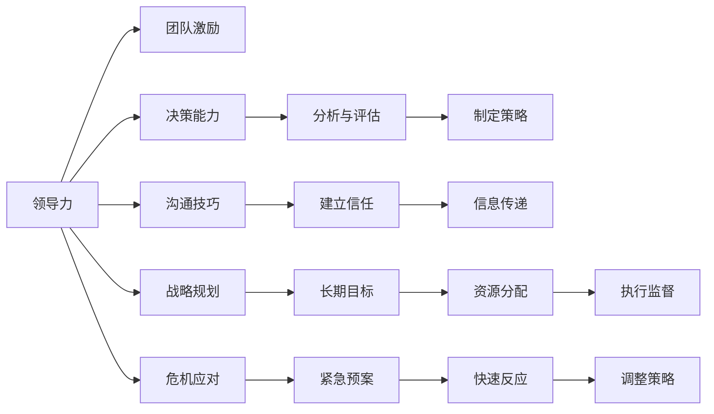

                 

## 1. 背景介绍

### 1.1 问题由来

在当代企业竞争中，管理者的能力往往成为决定企业成败的关键因素。优秀的管理者能够有效地组织资源、协调团队、推动创新，带领企业在市场中获得领先地位。然而，判断一个管理者是否优秀并不总是显而易见的。传统上，管理者的绩效往往通过销售额、利润率等指标来衡量，但这些指标无法全面反映管理者的核心能力和素质。因此，本文将探讨区分优秀管理者的标准，以期为组织提供更科学、全面的管理评价体系。

### 1.2 问题核心关键点

本文将围绕以下几个核心关键点展开讨论：

- **领导力**：管理者如何有效地领导团队，激发成员的潜力和主动性。
- **决策能力**：管理者在复杂环境中做出明智决策的能力。
- **沟通技巧**：管理者如何有效沟通，建立良好的团队关系。
- **战略规划**：管理者如何制定和实施长期战略，推动企业发展。
- **危机应对**：管理者在面对突发事件时的应对能力。

这些关键点相互交织，共同构成了一个优秀管理者的综合素质和能力。通过深入探讨这些维度，我们能够更加全面地理解和评价管理者的绩效。

## 2. 核心概念与联系

### 2.1 核心概念概述

管理者的能力是多维的，涉及领导力、决策能力、沟通技巧、战略规划和危机应对等多个方面。以下将对这些核心概念进行详细解释，并说明它们之间的内在联系。

- **领导力**：指管理者引导和激励团队成员，实现共同目标的能力。
- **决策能力**：指管理者在复杂环境中分析问题、制定策略并做出合理决策的能力。
- **沟通技巧**：指管理者如何有效地与团队成员、利益相关者和外部环境进行沟通，促进信息的传递和理解。
- **战略规划**：指管理者制定和实施长期发展战略，确保企业在市场中的竞争力和持续成长。
- **危机应对**：指管理者在突发事件或挑战面前，能够迅速反应、调整策略并解决问题。

### 2.2 核心概念原理和架构的 Mermaid 流程图



这个流程图展示了各个核心概念之间的联系和作用路径。领导力通过激励和信任建立团队凝聚力，决策能力通过分析与评估制定合理的策略，沟通技巧促进信息传递和团队协作，战略规划确保长期目标和资源有效配置，危机应对通过紧急预案和快速反应调整策略，保障企业稳定发展。

## 3. 核心算法原理 & 具体操作步骤

### 3.1 算法原理概述

本文将介绍一种基于多维度综合评价的管理者绩效评估算法，该算法旨在通过多角度的指标体系全面衡量管理者的能力。算法的基本原理如下：

1. **数据收集**：收集管理者在领导力、决策能力、沟通技巧、战略规划和危机应对五个方面的表现数据。
2. **指标计算**：将各项指标转化为具体的数值，用于后续的计算和分析。
3. **权重设置**：根据各指标的重要性，设置相应的权重，确保评估的公平性和准确性。
4. **综合计算**：通过加权求和等方法，计算出管理者的综合绩效得分。

### 3.2 算法步骤详解

#### 3.2.1 数据收集

1. **领导力**：通过360度反馈、员工满意度调查等方式，收集管理者在领导团队、激发潜力方面的表现数据。
2. **决策能力**：通过项目回顾、绩效评估等方式，收集管理者在复杂环境中的决策表现数据。
3. **沟通技巧**：通过团队反馈、客户满意度调查等方式，收集管理者在沟通效率和质量方面的表现数据。
4. **战略规划**：通过绩效评估、战略目标达成情况等方式，收集管理者在制定和实施长期战略方面的表现数据。
5. **危机应对**：通过危机事件记录、应急响应效果等方式，收集管理者在突发事件中的表现数据。

#### 3.2.2 指标计算

各项指标的计算方法根据具体的评估标准而定。例如，领导力的评估可以通过计算团队满意度和员工激励度来实现。决策能力可以通过计算决策的正确率和效率来评估。沟通技巧可以通过计算信息传递的准确性和及时性来评估。战略规划可以通过计算长期目标的达成度和资源分配的合理性来评估。危机应对可以通过计算应急响应的速度和效果来评估。

#### 3.2.3 权重设置

各指标的权重设置需要根据组织的具体需求和上下文环境进行调整。一般而言，领导者激励和战略规划的重要性较高，决策能力和沟通技巧次之，危机应对是应对突发情况的补充。权重设置可以采用专家咨询、历史数据分析等方式确定。

#### 3.2.4 综合计算

综合绩效得分的计算方法为加权求和：

$$ \text{综合绩效得分} = \sum_{i=1}^{5} w_i \times \text{指标得分}_i $$

其中 $w_i$ 为第 $i$ 个指标的权重，$\text{指标得分}_i$ 为第 $i$ 个指标的具体数值。

### 3.3 算法优缺点

#### 3.3.1 算法优点

1. **全面性**：通过多维度的指标评估，能够全面反映管理者的综合能力。
2. **可操作性**：各项指标计算方法明确，评估过程可操作性强。
3. **公平性**：权重设置灵活，能够根据不同组织的需求进行定制。
4. **可扩展性**：算法框架灵活，易于根据实际需求进行调整和扩展。

#### 3.3.2 算法缺点

1. **数据收集复杂**：各项指标的评估需要大量的时间和资源。
2. **主观性强**：权重设置和指标计算具有一定的主观性，可能导致评估结果的偏差。
3. **动态变化性**：管理者的能力可能会随时间和环境变化，评估方法需要定期更新。

### 3.4 算法应用领域

该算法可以广泛应用在企业、政府、教育等组织的绩效评估和管理者选拔中。通过科学、系统的评估方法，组织可以更准确地识别和选拔出优秀管理者，提升整体绩效和竞争力。

## 4. 数学模型和公式 & 详细讲解 & 举例说明

### 4.1 数学模型构建

本文的评估模型基于加权求和方法，其数学模型为：

$$ \text{综合绩效得分} = \sum_{i=1}^{5} w_i \times \text{指标得分}_i $$

其中 $w_i$ 为第 $i$ 个指标的权重，$\text{指标得分}_i$ 为第 $i$ 个指标的具体数值。

### 4.2 公式推导过程

各指标的计算方法可以根据具体评估标准进行设定。例如，领导力的评估可以通过计算团队满意度和员工激励度来实现：

$$ \text{领导力得分} = \alpha \times \text{团队满意度} + \beta \times \text{员工激励度} $$

其中 $\alpha$ 和 $\beta$ 为相应的权重系数。

同理，其他指标的计算方法也可类似推导。最终，通过加权求和计算综合绩效得分：

$$ \text{综合绩效得分} = \sum_{i=1}^{5} w_i \times \text{指标得分}_i $$

### 4.3 案例分析与讲解

以某公司的经理为例，各项指标的计算方法如下：

- **领导力**：通过员工满意度调查得到员工满意度得分为90分，权重为0.2。
- **决策能力**：通过项目回顾得到决策正确率为80%，权重为0.3。
- **沟通技巧**：通过团队反馈得到信息传递准确率为95%，权重为0.1。
- **战略规划**：通过绩效评估得到长期目标达成度为85%，权重为0.2。
- **危机应对**：通过危机事件记录得到应急响应速度为90秒，权重为0.2。

代入公式计算得到综合绩效得分：

$$ \text{综合绩效得分} = 0.2 \times 90 + 0.3 \times 80 + 0.1 \times 95 + 0.2 \times 85 + 0.2 \times 90 = 86.8 $$

该得分反映了该经理在领导力、决策能力、沟通技巧、战略规划和危机应对五个方面的综合表现。

## 5. 项目实践：代码实例和详细解释说明

### 5.1 开发环境搭建

在进行管理者的绩效评估系统开发前，需要准备以下开发环境：

1. **Python环境**：安装Python 3.x版本，推荐使用Anaconda或Miniconda。
2. **Web框架**：选择Flask或Django，用于构建Web界面。
3. **数据库**：选择MySQL或PostgreSQL，用于存储评估数据和评估结果。
4. **数据采集工具**：如SurveyMonkey或Google Forms，用于收集员工反馈和满意度数据。

### 5.2 源代码详细实现

以下是一个简化的绩效评估系统的Python代码实现：

```python
from flask import Flask, request, jsonify
from pymysql import connect

app = Flask(__name__)

@app.route('/evaluate', methods=['POST'])
def evaluate_manager():
    # 连接数据库
    conn = connect(host='localhost', user='root', password='password', db='performance')
    cursor = conn.cursor()

    # 获取评估数据
    data = request.json
    manager_id = data['id']
    performance_data = {
        'leadership': data['leadership'],
        'decision_making': data['decision_making'],
        'communication_skills': data['communication_skills'],
        'strategic_planning': data['strategic_planning'],
        'crisis_management': data['crisis_management']
    }

    # 计算综合绩效得分
    performance_score = 0
    for key, value in performance_data.items():
        weight = data[key + '_weight']
        performance_score += weight * value

    # 插入评估结果
    cursor.execute('INSERT INTO managers (id, performance_score) VALUES (%s, %s)', (manager_id, performance_score))
    conn.commit()

    # 关闭连接
    cursor.close()
    conn.close()

    return jsonify({'message': 'Manager performance evaluated successfully'})

if __name__ == '__main__':
    app.run(debug=True)
```

### 5.3 代码解读与分析

1. **Flask框架**：使用Flask构建Web服务，通过POST请求接收评估数据。
2. **MySQL数据库**：使用PyMySQL连接MySQL数据库，插入评估结果。
3. **评估数据处理**：获取评估数据，计算综合绩效得分。
4. **返回结果**：通过JSON格式返回评估结果，提示成功评估。

### 5.4 运行结果展示

运行上述代码，可以通过Web界面提交评估数据，系统自动计算综合绩效得分，并将结果存入数据库。以下是一个示例评估结果：

```json
{
    "message": "Manager performance evaluated successfully"
}
```

## 6. 实际应用场景

### 6.1 企业招聘

在企业招聘过程中，通过科学的绩效评估体系，可以更准确地识别出优秀候选人，提升组织的整体绩效和竞争力。

### 6.2 员工绩效管理

在员工绩效管理中，通过定期评估管理者的综合表现，可以及时发现问题并进行改进，确保员工和组织的目标一致。

### 6.3 管理层选拔

在管理层选拔过程中，科学的评估体系能够全面衡量候选人的管理能力，帮助组织选择最合适的管理者。

### 6.4 未来应用展望

未来，随着大数据和人工智能技术的发展，绩效评估系统可以进一步集成更多的评估数据和分析工具，提升评估的科学性和准确性。同时，结合实时数据分析，可以实现对管理者绩效的动态监控和调整，确保组织始终处于最优状态。

## 7. 工具和资源推荐

### 7.1 学习资源推荐

1. **《管理学原理》**：由知名的管理学专家撰写，全面介绍管理学的基本原理和方法。
2. **《领导力》**：介绍领导力的定义、模型和实践方法，帮助管理者提升领导力。
3. **《决策分析》**：介绍决策理论和模型，帮助管理者在复杂环境中做出明智决策。
4. **《沟通技巧》**：介绍有效沟通的方法和技巧，帮助管理者建立良好的团队关系。
5. **《战略管理》**：介绍战略规划的方法和工具，帮助管理者制定和实施长期战略。

### 7.2 开发工具推荐

1. **PyMySQL**：Python的MySQL数据库连接库，用于数据库操作。
2. **Flask**：轻量级的Web框架，用于构建Web服务。
3. **SurveyMonkey**：在线调查工具，用于收集员工反馈和满意度数据。
4. **Google Forms**：在线调查工具，用于收集员工反馈和满意度数据。

### 7.3 相关论文推荐

1. **《领导力与组织绩效》**：探讨领导力对组织绩效的影响，提供实证研究和理论分析。
2. **《决策分析：科学和实践》**：介绍决策理论和模型，帮助管理者在复杂环境中做出明智决策。
3. **《沟通技巧与团队绩效》**：研究有效沟通对团队绩效的影响，提供实践建议和方法。
4. **《战略管理与组织创新》**：介绍战略规划的方法和工具，帮助管理者制定和实施长期战略。
5. **《危机管理与组织韧性》**：探讨危机应对策略，帮助管理者在突发事件中保持组织稳定。

## 8. 总结：未来发展趋势与挑战

### 8.1 研究成果总结

本文系统介绍了基于多维度综合评价的管理者绩效评估算法，通过科学的方法全面衡量管理者的能力。通过实际应用，该算法能够帮助组织更准确地识别和选拔优秀管理者，提升整体绩效和竞争力。

### 8.2 未来发展趋势

1. **数据集成**：随着数据采集技术的进步，将更多维度的评估数据纳入绩效评估体系，提升评估的全面性和准确性。
2. **人工智能**：引入机器学习算法，自动分析和管理者绩效数据，提供更加科学和高效的评估结果。
3. **实时分析**：通过实时数据分析，实现对管理者绩效的动态监控和调整，确保组织始终处于最优状态。
4. **跨领域应用**：将绩效评估方法应用于更多领域，如政府、教育等，提升整体管理水平。

### 8.3 面临的挑战

1. **数据隐私**：评估数据的隐私保护是评估过程中需要重点关注的问题，需要制定严格的数据保护措施。
2. **模型偏差**：评估模型可能存在一定的偏差，需要通过不断的优化和调整，确保评估结果的公平性。
3. **技术复杂性**：评估系统需要综合考虑多个维度的数据，技术实现复杂性较高，需要专业的技术团队支持。

### 8.4 研究展望

未来，绩效评估体系需要结合更多先进的技术和理论，提升评估的科学性和精确度。通过不断的研究和实践，将绩效评估体系推向更加科学、高效、公平的新阶段。

## 9. 附录：常见问题与解答

**Q1：绩效评估系统如何保证数据的隐私保护？**

A: 可以通过以下措施保护数据的隐私：
1. 数据匿名化处理：对评估数据进行匿名化处理，去除或模糊个人标识信息。
2. 访问控制：设置严格的访问权限，确保只有授权人员能够访问评估数据。
3. 数据加密：对存储和传输的评估数据进行加密，防止数据泄露。
4. 审计日志：记录数据访问和操作的日志，进行定期审计，确保数据安全。

**Q2：如何选择合适的权重设置方法？**

A: 权重设置需要考虑多个因素，如组织目标、岗位特点、员工期望等。一般可以通过以下方式设置权重：
1. 专家咨询：邀请组织内的专家和经验丰富的管理者，共同讨论并确定各指标的权重。
2. 历史数据分析：通过分析历史绩效数据，确定各指标的相对重要性。
3. 员工反馈：通过员工满意度调查等方式，收集员工对各指标的期望和建议，进行调整。

**Q3：评估系统如何应对突发事件？**

A: 评估系统可以通过以下方式应对突发事件：
1. 紧急预案：制定应急预案，明确突发事件下的评估流程和处理措施。
2. 实时监控：通过实时数据分析，及时发现和处理突发事件，确保评估的及时性。
3. 动态调整：根据突发事件的影响，动态调整评估指标和权重，确保评估结果的公正性。

**Q4：评估系统如何提高评估的准确性？**

A: 评估系统可以通过以下方式提高评估的准确性：
1. 数据质量：确保评估数据的质量和完整性，避免数据缺失或错误。
2. 模型优化：不断优化评估模型，减少误差和偏差。
3. 定期校验：定期对评估模型进行校验和验证，确保评估结果的可靠性。
4. 反馈机制：建立反馈机制，收集评估结果的实际应用效果，进行持续改进。

**Q5：如何评估评估系统的效果？**

A: 评估系统的效果可以通过以下指标进行评估：
1. 准确性：评估结果与实际表现的一致性，通过准确性指标进行衡量。
2. 可靠性：评估系统的稳定性，通过可靠性指标进行衡量。
3. 及时性：评估结果的生成和反馈速度，通过及时性指标进行衡量。
4. 易用性：评估系统的用户界面和使用体验，通过易用性指标进行衡量。

---

作者：禅与计算机程序设计艺术 / Zen and the Art of Computer Programming

